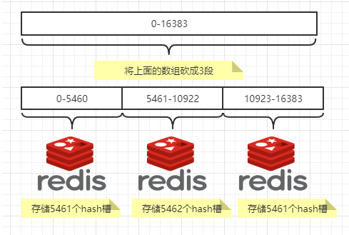

### 1、MySQL主从复制

> 原理：


#### 1、搭建步骤

##### 1、新建主服务器示例3307

```
docker run -p 3307:3306 --name mysql-master \
-v /mydata/mysql-master/log:/var/log/mysql \
-v /mydata/mysql-master/data:/var/lib/mysql \
-v /mydata/mysql-master/conf:/etc/mysql \
-e MYSQL_ROOT_PASSWORD=root  \
-d mysql:5.7
```


##### 2、进入/mydata/mysql-master/conf目录下新建my.cnf

```
vim my.cnf
```

```
[mysqld]
### 设置server_id，同一局域网中需要唯一
server_id=101 
### 指定不需要同步的数据库名称
binlog-ignore-db=mysql  
### 开启二进制日志功能
log-bin=mall-mysql-bin  
### 设置二进制日志使用内存大小（事务）
binlog_cache_size=1M  
### 设置使用的二进制日志格式（mixed,statement,row）
binlog_format=mixed  
### 二进制日志过期清理时间。默认值为0，表示不自动清理。
expire_logs_days=7  
### 跳过主从复制中遇到的所有错误或指定类型的错误，避免slave端复制中断。
### 如：1062错误是指一些主键重复，1032错误是因为主从数据库数据不一致
slave_skip_errors=1062
```


##### 3、重启实例

```
docker restart mysql-master
```


##### 4、进入容器

```
docker exec -it mysql-master /bin/bash
#登录mysql
mysql -u root -p
```


##### 5、master容器实例内创建数据同步用户

```
#创建用户名和密码
CREATE USER 'slave'@'%' IDENTIFIED BY '123456';
#授权
GRANT REPLICATION SLAVE, REPLICATION CLIENT ON *.* TO 'slave'@'%';
```


##### 6、创建从服务器实例3308

```
docker run -p 3308:3306 --name mysql-slave \
-v /mydata/mysql-slave/log:/var/log/mysql \
-v /mydata/mysql-slave/data:/var/lib/mysql \
-v /mydata/mysql-slave/conf:/etc/mysql \
-e MYSQL_ROOT_PASSWORD=root  \
-d mysql:5.7
```


##### 7、进入/mydata/mysql-slave/conf目录下新建my.cnf

```
[mysqld]
### 设置server_id，同一局域网中需要唯一
server_id=102
### 指定不需要同步的数据库名称
binlog-ignore-db=mysql  
### 开启二进制日志功能，以备Slave作为其它数据库实例的Master时使用
log-bin=mall-mysql-slave1-bin  
### 设置二进制日志使用内存大小（事务）
binlog_cache_size=1M  
### 设置使用的二进制日志格式（mixed,statement,row）
binlog_format=mixed  
### 二进制日志过期清理时间。默认值为0，表示不自动清理。
expire_logs_days=7  
### 跳过主从复制中遇到的所有错误或指定类型的错误，避免slave端复制中断。
### 如：1062错误是指一些主键重复，1032错误是因为主从数据库数据不一致
slave_skip_errors=1062  
### relay_log配置中继日志
relay_log=mall-mysql-relay-bin  
### log_slave_updates表示slave将复制事件写进自己的二进制日志
log_slave_updates=1  
### slave设置为只读（具有super权限的用户除外）
read_only=1
```


##### 8、重启mysql-slave

```
docker restart mysql-slave
```


##### 9、在主数据库中查看主从同步状态

```
show master status;
```


##### 10、进入从容器

```
docker exec -it mysql-slave /bin/bash
mysql -uroot -proot
```


##### 11、在从数据库中配置主从复制

```
change master to master_host='192.168.130.132', master_user='slave', master_password='123456', master_port=3307, master_log_file='mall-mysql-bin.000001', master_log_pos=617, master_connect_retry=30;
```

- master_host：主数据库的IP地址；
- master_port：主数据库的运行端口；
- master_user：在主数据库创建的用于同步数据的用户账号；
- master_password：在主数据库创建的用于同步数据的用户密码；
- master_log_file：指定从数据库要复制数据的日志文件，通过查看主数据的状态，获取File参数；
- master_log_pos：指定从数据库从哪个位置开始复制数据，通过查看主数据的状态，获取Position参数；
- master_connect_retry：连接失败重试的时间间隔，单位为秒。


##### 12、在从数据库中查看主从同步状态

```
show slave status \G;
```


##### 13、在从数据库中开启主从同步

```
mysql> start slave;
Query OK, 0 rows affected (0.06 sec)
```


##### 14、查看从数据库状态

```
show slave status \G;
```


##### 15、主从复制测试

###### 1、主机新建库-使用库-新建表-插入数据

```
mysql> create database test;
Query OK, 1 row affected (0.00 sec)

mysql> use test
Database changed
mysql> create table t1(id int, name varchar(20));
Query OK, 0 rows affected (0.04 sec)

mysql> insert into t1(id, name) values (1,'hello');
Query OK, 1 row affected (0.01 sec)

mysql> select * from t1;
+------+-------+
| id   | name  |
+------+-------+
|    1 | hello |
+------+-------+
1 row in set (0.00 sec)

mysql> 

```


###### 2、从机使用库-查看记录

```
mysql> use test;
Reading table information for completion of table and column names
You can turn off this feature to get a quicker startup with -A

Database changed
mysql> select * from t1;
+------+-------+
| id   | name  |
+------+-------+
|    1 | hello |
+------+-------+
1 row in set (0.00 sec)

mysql> 
```


### 2、redis集群

> cluster(集群)模式-docker版  哈希槽分区进行亿级数据存储

#### 1、场景

> 1~2亿条数据需要缓存，请问如何设计这个存储案例？
>
> 单机单台100%不可能，肯定是分布式存储，用redis如何落地？

##### 解决方案

###### 1、哈希取余分区


> 2亿条记录就是2亿个k,v，我们单机不行必须要分布式多机，假设有3台机器构成一个集群，用户每次读写操作都是根据公式：
> hash(key) % N个机器台数，计算出哈希值，用来决定数据映射到哪一个节点上。

**优点：**

  ```
简单粗暴，直接有效，只需要预估好数据规划好节点，例如3台、8台、10台，就能保证一段时间的数据支撑。使用Hash算法让固定的一部分请求落到同一台服务器上，这样每台服务器固定处理一部分请求（并维护这些请求的信息），起到负载均衡+分而治之的作用。
  ```

**缺点：**

 ```
  原来规划好的节点，进行扩容或者缩容就比较麻烦了额，不管扩缩，每次数据变动导致节点有变动，映射关系需要重新进行计算，在服务器个数固定不变时没有问题，如果需要弹性扩容或故障停机的情况下，原来的取模公式就会发生变化：Hash(key)/3会变成Hash(key) /?。此时地址经过取余运算的结果将发生很大变化，根据公式获取的服务器也会变得不可控。
某个redis机器宕机了，由于台数数量变化，会导致hash取余全部数据重新洗牌。
 ```


###### 2、一致性哈希算法分区

> 　　一致性哈希算法在1997年由麻省理工学院中提出的，设计目标是**为了解决分布式缓存数据变动和映射问题，某个机器宕机了，分母数量改变了，自然取余数不OK了。**

**作用：**

> 提出一致性Hash解决方案。目的是当服务器个数发生变动时，尽量减少影响客户端到服务器的映射关系

**步骤：**

1. 算法构建一致性哈希环

   **一致性哈希环**

   > ​    一致性哈希算法必然有个hash函数并按照算法产生hash值，这个算法的所有可能哈希值会构成一个全量集，这个集合可以成为一个hash空间[0,2^32-1]，这个是一个线性空间，但是在算法中，我们通过适当的逻辑控制将它首尾相连(0 = 2^32),这样让它逻辑上形成了一个环形空间。
   >
   > 它也是按照使用取模的方法，前面笔记介绍的节点取模法是对节点（服务器）的数量进行取模。而一致性Hash算法是对2^32 取模，简单来说，一致性Hash算法将整个哈希值空间组织成一个虚拟的圆环，如假设某哈希函数H的值空间为0-2^32-1 （即哈希值是一个32位无符号整形），整个哈希环如下图：整个空间按顺时针方向组织，圆环的正上方的点代表0，0点右侧的第一个点代表1，以此类推，2、3、4、……直到2^32-1 ，也就是说0点左侧的第一个点代表2^32-1， 0和2^32-1 在零点中方向重合，我们把这个由2^32个点组成的圆环称为Hash环。

   

2. 服务器IP节点映射

   节点映射

   >    将集群中各个IP节点映射到环上的某一个位置。
   >    将各个服务器使用Hash进行一个哈希，具体可以选择服务器的IP或主机名作为关键字进行哈希，这样每台机器就能确定其在哈希环上的位置。假如4个节点NodeA、B、C、D，经过IP地址的哈希函数计算(hash(ip))，使用IP地址哈希后在环空间的位置如下：

   

3. key落到服务器的落键规则

   > 当我们需要存储一个kv键值对时，首先计算key的hash值，hash(key)，将这个key使用相同的函数Hash计算出哈希值并确定此数据在环上的位置，从此位置沿环顺时针“行走”，第一台遇到的服务器就是其应该定位到的服务器，并将该键值对存储在该节点上。
   > 如我们有Object A、Object B、Object C、Object D四个数据对象，经过哈希计算后，在环空间上的位置如下：根据一致性Hash算法，数据A会被定为到Node A上，B被定为到Node B上，C被定为到Node C上，D被定为到Node D上。

   


**优点：**

1.一致性哈希算法的容错性

> 容错性
> 假设Node C宕机，可以看到此时对象A、B、D不会受到影响，只有C对象被重定位到Node D。一般的，在一致性Hash算法中，如果一台服务器不可用，则受影响的数据仅仅是此服务器到其环空间中前一台服务器（即沿着逆时针方向行走遇到的第一台服务器）之间数据，其它不会受到影响。简单说，就是C挂了，受到影响的只是B、C之间的数据，并且这些数据会转移到D进行存储。


2.一致性哈希算法的扩展性

> 扩展性
> 数据量增加了，需要增加一台节点NodeX，X的位置在A和B之间，那收到影响的也就是A到X之间的数据，重新把A到X的数据录入到X上即可，不会导致hash取余全部数据重新洗牌。


**缺点：**

> 一致性哈希算法的数据倾斜问题
>
> 一致性Hash算法在服务节点太少时，容易因为节点分布不均匀而造成数据倾斜（被缓存的对象大部分集中缓存在某一台服务器上）问题，
> 例如系统中只有两台服务器：


**总结：**

> 为了在节点数目发生改变时尽可能少的迁移数据
>
> 将所有的存储节点排列在收尾相接的Hash环上，每个key在计算Hash后会顺时针找到临近的存储节点存放。
> 而当有节点加入或退出时仅影响该节点在Hash环上顺时针相邻的后续节点。
>
> **优点**    加入和删除节点只影响哈希环中顺时针方向的相邻的节点，对其他节点无影响。
>
> **缺点**    数据的分布和节点的位置有关，因为这些节点不是均匀的分布在哈希环上的，所以数据在进行存储时达不到均匀分布的效果。


###### 3、哈希槽分区

> 哈希槽实质就是一个数组，数组[0,2^14 -1]形成hash slot空间。
>
> **作用：**解决一致性哈希算法的数据倾斜问题

解决均匀分配的问题，在数据和节点之间又加入了一层，把这层称为哈希槽（slot），用于管理数据和节点之间的关系，现在就相当于节点上放的是槽，槽里放的是数据。


槽解决的是粒度问题，相当于把粒度变大了，这样便于数据移动。
哈希解决的是映射问题，使用key的哈希值来计算所在的槽，便于数据分配。


####### 哈希槽的计算

> Redis 集群中内置了 16384 个哈希槽，redis 会根据节点数量大致均等的将哈希槽映射到不同的节点。当需要在 Redis 集群中放置一个 key-value时，redis 先对 key 使用 crc16 算法算出一个结果，然后把结果对 16384 求余数，这样每个 key 都会对应一个编号在 0-16383 之间的哈希槽，也就是映射到某个节点上。如下代码，key之A 、B在Node2， key之C落在Node3上




#### 2、3主3从集群配置

##### 1、启动docker

```
systemctl start docker
```


##### 2、新建6个docker容器redis实例

```
docker run -d --name redis-node-1 --net host --privileged=true -v /data/redis/share/redis-node-1:/data redis --cluster-enabled yes --appendonly yes --port 6381
 
docker run -d --name redis-node-2 --net host --privileged=true -v /data/redis/share/redis-node-2:/data redis --cluster-enabled yes --appendonly yes --port 6382
 
docker run -d --name redis-node-3 --net host --privileged=true -v /data/redis/share/redis-node-3:/data redis --cluster-enabled yes --appendonly yes --port 6383
 
docker run -d --name redis-node-4 --net host --privileged=true -v /data/redis/share/redis-node-4:/data redis --cluster-enabled yes --appendonly yes --port 6384
 
docker run -d --name redis-node-5 --net host --privileged=true -v /data/redis/share/redis-node-5:/data redis --cluster-enabled yes --appendonly yes --port 6385
 
docker run -d --name redis-node-6 --net host --privileged=true -v /data/redis/share/redis-node-6:/data redis --cluster-enabled yes --appendonly yes --port 6386
```

```
[root@docker ~]## docker ps
CONTAINER ID   IMAGE     COMMAND                  CREATED         STATUS         PORTS     NAMES
d6fc3ef2855b   redis     "docker-entrypoint.s…"   3 seconds ago   Up 2 seconds             redis-node-6
9c8868d69a50   redis     "docker-entrypoint.s…"   3 seconds ago   Up 3 seconds             redis-node-5
7fbb5345951a   redis     "docker-entrypoint.s…"   4 seconds ago   Up 3 seconds             redis-node-4
d53b9d5af1ac   redis     "docker-entrypoint.s…"   4 seconds ago   Up 4 seconds             redis-node-3
fe0e430cb940   redis     "docker-entrypoint.s…"   6 seconds ago   Up 4 seconds             redis-node-2
ee03a7ec212e   redis     "docker-entrypoint.s…"   8 seconds ago   Up 6 seconds             redis-node-1
```

###### 分步解释

- `docker run`：创建并运行docker容器实例
- `--name redis-node-6`：容器名字
- `--net host` ：使用宿主机的IP和端口，默认、
- `--privileged=true`：获取宿主机root用户权限
- `-v /data/redis/share/redis-node-6:/data`：容器卷，宿主机地址:docker内部地址
- `redis`：redis镜像和版本号
- `--cluster-enabled yes`：开启redis集群
- `--appendonly yes`：开启持久化
- `--port 6386`：redis端口号


##### 3、进入容器redis-node-1并为6台机器构建集群关系

###### 1、进入容器

```
docker exec -it redis-node-1 /bin/bash
```


###### 2、构建主从关系

PS：注意自己的真实IP地址

```
redis-cli --cluster create 192.168.130.132:6381 192.168.130.132:6382 192.168.130.132:6383 192.168.130.132:6384 192.168.130.132:6385 192.168.130.132:6386 --cluster-replicas 1
```

- `--cluster-replicas 1`：表示为每个master创建一个slave节点

```
[root@docker ~]## docker exec -it redis-node-1 /bin/bash
root@docker:/data## redis-cli --cluster create 192.168.130.132:6381 192.168.130.132:6382 192.168.130.132:6383 192.168.130.132:6384 192.168.130.132:6385 192.168.130.132:6386 --cluster-replicas 1
>>> Performing hash slots allocation on 6 nodes...
Master[0] -> Slots 0 - 5460
Master[1] -> Slots 5461 - 10922
Master[2] -> Slots 10923 - 16383
Adding replica 192.168.130.132:6385 to 192.168.130.132:6381
Adding replica 192.168.130.132:6386 to 192.168.130.132:6382
Adding replica 192.168.130.132:6384 to 192.168.130.132:6383
>>> Trying to optimize slaves allocation for anti-affinity
[WARNING] Some slaves are in the same host as their master
M: 8335b5349d781c11745ee129f5dbae370dbd3394 192.168.130.132:6381
   slots:[0-5460] (5461 slots) master
M: 60fa7e084483feca3af41f269de5a57b526c0ad7 192.168.130.132:6382
   slots:[5461-10922] (5462 slots) master
M: 8dbe8b347410cf87d62933382b73693405535ba1 192.168.130.132:6383
   slots:[10923-16383] (5461 slots) master
S: c366905ca5ec2472275bbea9b2ae9b642b92a737 192.168.130.132:6384
   replicates 60fa7e084483feca3af41f269de5a57b526c0ad7
S: b5fd469dd1f8b5a64cacd5ecaed9dd396e1b9217 192.168.130.132:6385
   replicates 8dbe8b347410cf87d62933382b73693405535ba1
S: 4051766aa375f0ed4533cb729afa8daf8649f5d2 192.168.130.132:6386
   replicates 8335b5349d781c11745ee129f5dbae370dbd3394
Can I set the above configuration? (type 'yes' to accept): yes
>>> Nodes configuration updated
>>> Assign a different config epoch to each node
>>> Sending CLUSTER MEET messages to join the cluster
Waiting for the cluster to join
...
>>> Performing Cluster Check (using node 192.168.130.132:6381)
M: 8335b5349d781c11745ee129f5dbae370dbd3394 192.168.130.132:6381
   slots:[0-5460] (5461 slots) master
   1 additional replica(s)
S: b5fd469dd1f8b5a64cacd5ecaed9dd396e1b9217 192.168.130.132:6385
   slots: (0 slots) slave
   replicates 8dbe8b347410cf87d62933382b73693405535ba1
M: 8dbe8b347410cf87d62933382b73693405535ba1 192.168.130.132:6383
   slots:[10923-16383] (5461 slots) master
   1 additional replica(s)
S: c366905ca5ec2472275bbea9b2ae9b642b92a737 192.168.130.132:6384
   slots: (0 slots) slave
   replicates 60fa7e084483feca3af41f269de5a57b526c0ad7
M: 60fa7e084483feca3af41f269de5a57b526c0ad7 192.168.130.132:6382
   slots:[5461-10922] (5462 slots) master
   1 additional replica(s)
S: 4051766aa375f0ed4533cb729afa8daf8649f5d2 192.168.130.132:6386
   slots: (0 slots) slave
   replicates 8335b5349d781c11745ee129f5dbae370dbd3394
[OK] All nodes agree about slots configuration.
>>> Check for open slots...
>>> Check slots coverage...
[OK] All 16384 slots covered.
root@docker:/data## 
```

到这里，3主3从就构建完成了。


##### 4、链接进入6381作为切入点，查看集群状态

```
root@docker:/data## redis-cli -p 6381
127.0.0.1:6381> cluster info
cluster_state:ok
cluster_slots_assigned:16384
cluster_slots_ok:16384
cluster_slots_pfail:0
cluster_slots_fail:0
cluster_known_nodes:6
cluster_size:3
cluster_current_epoch:6
cluster_my_epoch:1
cluster_stats_messages_ping_sent:663
cluster_stats_messages_pong_sent:671
cluster_stats_messages_sent:1334
cluster_stats_messages_ping_received:666
cluster_stats_messages_pong_received:663
cluster_stats_messages_meet_received:5
cluster_stats_messages_received:1334
127.0.0.1:6381> cluster nodes
b5fd469dd1f8b5a64cacd5ecaed9dd396e1b9217 192.168.130.132:6385@16385 slave 8dbe8b347410cf87d62933382b73693405535ba1 0 1651152474000 3 connected
8335b5349d781c11745ee129f5dbae370dbd3394 192.168.130.132:6381@16381 myself,master - 0 1651152472000 1 connected 0-5460
8dbe8b347410cf87d62933382b73693405535ba1 192.168.130.132:6383@16383 master - 0 1651152474000 3 connected 10923-16383
c366905ca5ec2472275bbea9b2ae9b642b92a737 192.168.130.132:6384@16384 slave 60fa7e084483feca3af41f269de5a57b526c0ad7 0 1651152476585 2 connected
60fa7e084483feca3af41f269de5a57b526c0ad7 192.168.130.132:6382@16382 master - 0 1651152475573 2 connected 5461-10922
4051766aa375f0ed4533cb729afa8daf8649f5d2 192.168.130.132:6386@16386 slave 8335b5349d781c11745ee129f5dbae370dbd3394 0 1651152474566 1 connected
127.0.0.1:6381> 
```


###### 1、`cluster info`：查看集群状态

```
127.0.0.1:6381> cluster info
cluster_state:ok
cluster_slots_assigned:16384
cluster_slots_ok:16384
cluster_slots_pfail:0
cluster_slots_fail:0
cluster_known_nodes:6
cluster_size:3
cluster_current_epoch:6
cluster_my_epoch:1
cluster_stats_messages_ping_sent:663
cluster_stats_messages_pong_sent:671
cluster_stats_messages_sent:1334
cluster_stats_messages_ping_received:666
cluster_stats_messages_pong_received:663
cluster_stats_messages_meet_received:5
cluster_stats_messages_received:1334
```


- `cluster_state`: `ok`状态表示集群可以正常接受查询请求。`fail` 状态表示，至少有一个哈希槽没有被绑定（说明有哈希槽没有被绑定到任意一个节点），或者在错误的状态（节点可以提供服务但是带有FAIL 标记），或者该节点无法联系到多数master节点。.
- `cluster_slots_assigned`: 已分配到集群节点的哈希槽数量（不是没有被绑定的数量）。16384个哈希槽全部被分配到集群节点是集群正常运行的必要条件.
- `cluster_slots_ok`: 哈希槽状态不是`FAIL` 和 `PFAIL` 的数量.
- `cluster_slots_pfail`: 哈希槽状态是 `PFAIL`的数量。只要哈希槽状态没有被升级到`FAIL`状态，这些哈希槽仍然可以被正常处理。`PFAIL`状态表示我们当前不能和节点进行交互，但这种状态只是临时的错误状态。
- `cluster_slots_fail`: 哈希槽状态是`FAIL`的数量。如果值不是0，那么集群节点将无法提供查询服务，除非`cluster-require-full-coverage`被设置为`no` .
- `cluster_known_nodes`: 集群中节点数量，包括处于`握手`状态还没有成为集群正式成员的节点.
- `cluster_size`: 至少包含一个哈希槽且能够提供服务的master节点数量.
- `cluster_current_epoch`: 集群本地`Current Epoch`变量的值。这个值在节点故障转移过程时有用，它总是递增和唯一的。
- `cluster_my_epoch`: 当前正在使用的节点的`Config Epoch`值. 这个是关联在本节点的版本值.
- `cluster_stats_messages_sent`: 通过node-to-node二进制总线发送的消息数量.
- `cluster_stats_messages_received`: 通过node-to-node二进制总线接收的消息数量.


###### 2、`cluster nodes`：提供了当前连接节点所属集群的配置信息，信息格式和Redis集群在磁盘上存储使用的序列化格式完全一样（在磁盘存储信息的结尾还存储了一些额外信息）

```
127.0.0.1:6381> cluster nodes
b5fd469dd1f8b5a64cacd5ecaed9dd396e1b9217 192.168.130.132:6385@16385 slave 8dbe8b347410cf87d62933382b73693405535ba1 0 1651152474000 3 connected
8335b5349d781c11745ee129f5dbae370dbd3394 192.168.130.132:6381@16381 myself,master - 0 1651152472000 1 connected 0-5460
8dbe8b347410cf87d62933382b73693405535ba1 192.168.130.132:6383@16383 master - 0 1651152474000 3 connected 10923-16383
c366905ca5ec2472275bbea9b2ae9b642b92a737 192.168.130.132:6384@16384 slave 60fa7e084483feca3af41f269de5a57b526c0ad7 0 1651152476585 2 connected
60fa7e084483feca3af41f269de5a57b526c0ad7 192.168.130.132:6382@16382 master - 0 1651152475573 2 connected 5461-10922
4051766aa375f0ed4533cb729afa8daf8649f5d2 192.168.130.132:6386@16386 slave 8335b5349d781c11745ee129f5dbae370dbd3394 0 1651152474566 1 connected
127.0.0.1:6381> 
```

主从关系图：


每行的组成：

> ```
> <id> <ip:port> <flags> <master> <ping-sent> <pong-recv> <config-epoch> <link-state> <slot> <slot> ... <slot>
> ```

1. `id`: 节点ID,是一个40字节的随机字符串，这个值在节点启动的时候创建，并且永远不会改变（除非使用`CLUSTER RESET HARD`命令）。
2. `ip:port`: 客户端与节点通信使用的地址.
3. `flags`: 逗号分割的标记位，可能的值有: `myself`, `master`, `slave`, `fail?`, `fail`, `handshake`, `noaddr`, `noflags`. 下一部分将详细介绍这些标记.
    - `myself`: 当前连接的节点.
    - `master`: 节点是master.
    - `slave`: 节点是slave.
    - `fail?`: 节点处于`PFAIL` 状态。 当前节点无法联系，但逻辑上是可达的 (非 `FAIL` 状态).
    - `fail`: 节点处于`FAIL` 状态. 大部分节点都无法与其取得联系将会将改节点由 `PFAIL` 状态升级至`FAIL`状态。
    - `handshake`: 还未取得信任的节点，当前正在与其进行握手.
    - `noaddr`: 没有地址的节点（No address known for this node）.
    - `noflags`: 连个标记都没有（No flags at all）.
4. `master`: 如果节点是slave，并且已知master节点，则这里列出master节点ID,否则的话这里列出”-“。
5. `ping-sent`: 最近一次发送ping的时间，这个时间是一个unix毫秒时间戳，0代表没有发送过.
6. `pong-recv`: 最近一次收到pong的时间，使用unix时间戳表示.
7. `config-epoch`: 节点的epoch值（or of the current master if the node is a slave）。每当节点发生失败切换时，都会创建一个新的，独特的，递增的epoch。如果多个节点竞争同一个哈希槽时，epoch值更高的节点会抢夺到。
8. `link-state`: node-to-node集群总线使用的链接的状态，我们使用这个链接与集群中其他节点进行通信.值可以是 `connected` 和 `disconnected`.
9. `slot`: 哈希槽值或者一个哈希槽范围. 从第9个参数开始，后面最多可能有16384个 数(limit never reached)。代表当前节点可以提供服务的所有哈希槽值。如果只是一个值,那就是只有一个槽会被使用。如果是一个范围，这个值表示为`起始槽-结束槽`，节点将处理包括起始槽和结束槽在内的所有哈希槽。


> 官方地址：http://www.redis.cn/commands/cluster-info.html

#### 3、主从容错切换迁移案例

##### 1、数据读写存储

###### 1、启动6机构成的集群并通过exec进入

```
root@docker:/data## redis-cli -p 6381
127.0.0.1:6381> set k1 v1
(error) MOVED 12706 192.168.130.132:6383
127.0.0.1:6381> set k2 v2\
OK
127.0.0.1:6381> set k3 v3
OK
127.0.0.1:6381> set k4 v4
(error) MOVED 8455 192.168.130.132:6382
127.0.0.1:6381> 
```

显示k1和k4没有存储进去

`(error) MOVED 12706 192.168.130.132:6383`：请转到6383的redis进行存储


###### 2、防止路由失效加参数-c并新增两个key

```
root@docker:/data## redis-cli -p 6381 -c
127.0.0.1:6381> set k1 v1
-> Redirected to slot [12706] located at 192.168.130.132:6383
OK
192.168.130.132:6383> set k4 v4
-> Redirected to slot [8455] located at 192.168.130.132:6382
OK
192.168.130.132:6382> get k4
"v4"
192.168.130.132:6382> 
```

` Redirected to slot [8455] located at 192.168.130.132:6382`：重定向到6382


###### 3、查看集群状态

```
redis-cli --cluster check 192.168.130.132:6381
```


```
root@docker:/data## redis-cli --cluster check 192.168.130.132:6381
192.168.130.132:6381 (8335b534...) -> 2 keys | 5461 slots | 1 slaves.
192.168.130.132:6383 (8dbe8b34...) -> 1 keys | 5461 slots | 1 slaves.
192.168.130.132:6382 (60fa7e08...) -> 1 keys | 5462 slots | 1 slaves.
[OK] 4 keys in 3 masters.
0.00 keys per slot on average.
>>> Performing Cluster Check (using node 192.168.130.132:6381)
M: 8335b5349d781c11745ee129f5dbae370dbd3394 192.168.130.132:6381
   slots:[0-5460] (5461 slots) master
   1 additional replica(s)
S: b5fd469dd1f8b5a64cacd5ecaed9dd396e1b9217 192.168.130.132:6385
   slots: (0 slots) slave
   replicates 8dbe8b347410cf87d62933382b73693405535ba1
M: 8dbe8b347410cf87d62933382b73693405535ba1 192.168.130.132:6383
   slots:[10923-16383] (5461 slots) master
   1 additional replica(s)
S: c366905ca5ec2472275bbea9b2ae9b642b92a737 192.168.130.132:6384
   slots: (0 slots) slave
   replicates 60fa7e084483feca3af41f269de5a57b526c0ad7
M: 60fa7e084483feca3af41f269de5a57b526c0ad7 192.168.130.132:6382
   slots:[5461-10922] (5462 slots) master
   1 additional replica(s)
S: 4051766aa375f0ed4533cb729afa8daf8649f5d2 192.168.130.132:6386
   slots: (0 slots) slave
   replicates 8335b5349d781c11745ee129f5dbae370dbd3394
[OK] All nodes agree about slots configuration.
>>> Check for open slots...
>>> Check slots coverage...
[OK] All 16384 slots covered.
root@docker:/data## 
```


##### 2、容错切换迁移

###### 1、主6381和从机切换，先停止主机6381

```
[root@docker ~]## docker stop redis-node-1
redis-node-1
[root@docker ~]## docker ps
CONTAINER ID   IMAGE     COMMAND                  CREATED        STATUS        PORTS     NAMES
d6fc3ef2855b   redis     "docker-entrypoint.s…"   47 hours ago   Up 47 hours             redis-node-6
9c8868d69a50   redis     "docker-entrypoint.s…"   47 hours ago   Up 47 hours             redis-node-5
7fbb5345951a   redis     "docker-entrypoint.s…"   47 hours ago   Up 47 hours             redis-node-4
d53b9d5af1ac   redis     "docker-entrypoint.s…"   47 hours ago   Up 47 hours             redis-node-3
fe0e430cb940   redis     "docker-entrypoint.s…"   47 hours ago   Up 47 hours             redis-node-2
[root@docker ~]## 
```

6381主机停了，对应的真实从机上位，也就是6号机变成了主机器


###### 2、查看集群情况

```
127.0.0.1:6382> cluster nodes
4051766aa375f0ed4533cb729afa8daf8649f5d2 192.168.130.132:6386@16386 master - 0 1651158299456 7 connected 0-5460
c366905ca5ec2472275bbea9b2ae9b642b92a737 192.168.130.132:6384@16384 slave 60fa7e084483feca3af41f269de5a57b526c0ad7 0 1651158300472 2 connected
60fa7e084483feca3af41f269de5a57b526c0ad7 192.168.130.132:6382@16382 myself,master - 0 1651158298000 2 connected 5461-10922
8dbe8b347410cf87d62933382b73693405535ba1 192.168.130.132:6383@16383 master - 0 1651158298444 3 connected 10923-16383
8335b5349d781c11745ee129f5dbae370dbd3394 192.168.130.132:6381@16381 master,fail - 1651154146064 1651154140969 1 disconnected
b5fd469dd1f8b5a64cacd5ecaed9dd396e1b9217 192.168.130.132:6385@16385 slave 8dbe8b347410cf87d62933382b73693405535ba1 0 1651158297000 3 connected
127.0.0.1:6382> 
```


###### 3、恢复3主3从

重新启动1号机之后，6号机还是主机，1号机器从之前的主机变成了从机

```
docker start redis-node-1
```


停掉6号机，再启动6号机

```
docker stop redis-node-6
docker start redis-node-6
```


查看集群状态

```
root@docker:/data## redis-cli --cluster check 192.168.130.132:6381
192.168.130.132:6381 (8335b534...) -> 2 keys | 5461 slots | 1 slaves.
192.168.130.132:6382 (60fa7e08...) -> 1 keys | 5462 slots | 1 slaves.
192.168.130.132:6383 (8dbe8b34...) -> 1 keys | 5461 slots | 1 slaves.
[OK] 4 keys in 3 masters.
0.00 keys per slot on average.
>>> Performing Cluster Check (using node 192.168.130.132:6381)
M: 8335b5349d781c11745ee129f5dbae370dbd3394 192.168.130.132:6381
   slots:[0-5460] (5461 slots) master
   1 additional replica(s)
S: c366905ca5ec2472275bbea9b2ae9b642b92a737 192.168.130.132:6384
   slots: (0 slots) slave
   replicates 60fa7e084483feca3af41f269de5a57b526c0ad7
S: 4051766aa375f0ed4533cb729afa8daf8649f5d2 192.168.130.132:6386
   slots: (0 slots) slave
   replicates 8335b5349d781c11745ee129f5dbae370dbd3394
M: 60fa7e084483feca3af41f269de5a57b526c0ad7 192.168.130.132:6382
   slots:[5461-10922] (5462 slots) master
   1 additional replica(s)
M: 8dbe8b347410cf87d62933382b73693405535ba1 192.168.130.132:6383
   slots:[10923-16383] (5461 slots) master
   1 additional replica(s)
S: b5fd469dd1f8b5a64cacd5ecaed9dd396e1b9217 192.168.130.132:6385
   slots: (0 slots) slave
   replicates 8dbe8b347410cf87d62933382b73693405535ba1
[OK] All nodes agree about slots configuration.
>>> Check for open slots...
>>> Check slots coverage...
[OK] All 16384 slots covered.
root@docker:/data## 
```


#### 4、主从扩容案例

##### 1、新建6387、6388两个节点+新建后启动+查看是否8节点

```
docker run -d --name redis-node-7 --net host --privileged=true -v /data/redis/share/redis-node-7:/data redis --cluster-enabled yes --appendonly yes --port 6387
docker run -d --name redis-node-8 --net host --privileged=true -v /data/redis/share/redis-node-8:/data redis --cluster-enabled yes --appendonly yes --port 6388
```


##### 2、进入6387容器实例内部

```
docker exec -it redis-node-7 /bin/bash
```


##### 3、将新增的6387节点(空槽号)作为master节点加入原集群

> 将新增的6387作为master节点加入集群
> redis-cli --cluster add-node 自己实际IP地址:6387 自己实际IP地址:6381
> 6387 就是将要作为master新增节点
> 6381 就是原来集群节点里面的领路人，相当于6387拜拜6381的码头从而找到组织加入集群

```
redis-cli --cluster add-node 192.168.130.132:6387 192.168.130.132:6381
```

```
root@docker:/data## redis-cli --cluster add-node 192.168.130.132:6387 192.168.130.132:6381
>>> Adding node 192.168.130.132:6387 to cluster 192.168.130.132:6381
>>> Performing Cluster Check (using node 192.168.130.132:6381)
M: 8335b5349d781c11745ee129f5dbae370dbd3394 192.168.130.132:6381
   slots:[0-5460] (5461 slots) master
   1 additional replica(s)
S: c366905ca5ec2472275bbea9b2ae9b642b92a737 192.168.130.132:6384
   slots: (0 slots) slave
   replicates 60fa7e084483feca3af41f269de5a57b526c0ad7
S: 4051766aa375f0ed4533cb729afa8daf8649f5d2 192.168.130.132:6386
   slots: (0 slots) slave
   replicates 8335b5349d781c11745ee129f5dbae370dbd3394
M: 60fa7e084483feca3af41f269de5a57b526c0ad7 192.168.130.132:6382
   slots:[5461-10922] (5462 slots) master
   1 additional replica(s)
M: 8dbe8b347410cf87d62933382b73693405535ba1 192.168.130.132:6383
   slots:[10923-16383] (5461 slots) master
   1 additional replica(s)
S: b5fd469dd1f8b5a64cacd5ecaed9dd396e1b9217 192.168.130.132:6385
   slots: (0 slots) slave
   replicates 8dbe8b347410cf87d62933382b73693405535ba1
[OK] All nodes agree about slots configuration.
>>> Check for open slots...
>>> Check slots coverage...
[OK] All 16384 slots covered.
>>> Send CLUSTER MEET to node 192.168.130.132:6387 to make it join the cluster.
[OK] New node added correctly.
root@docker:/data## 
```


##### 4、检查集群情况

```
redis-cli --cluster check 192.168.130.132:6381
```

```
root@docker:/data## redis-cli --cluster check 192.168.130.132:6381
192.168.130.132:6381 (8335b534...) -> 2 keys | 5461 slots | 1 slaves.
192.168.130.132:6382 (60fa7e08...) -> 1 keys | 5462 slots | 1 slaves.
192.168.130.132:6383 (8dbe8b34...) -> 1 keys | 5461 slots | 1 slaves.
192.168.130.132:6387 (34b689b7...) -> 0 keys | 0 slots | 0 slaves.
```

很明显，6387没有槽号


##### 5、重新分配槽号

> 重新分派槽号
> 命令：`redis-cli --cluster reshard IP地址:端口号`

```
redis-cli --cluster reshard 192.168.130.:6381
```

输入需要迁移的槽数量，此处我们输入4096。

目标节点ID，只能指定一个，因为我们需要迁移到6387中，因此下面输入6387的ID。


之后输入源节点的ID，redis会从这些源节点中平均取出对应数量的槽，然后迁移到6385中。最后要输入`done`表示结束。

最后输入yes即可。


##### 6、检查集群情况

```
redis-cli --cluster check 192.168.130.132:6381
```

```
root@docker:/data## redis-cli --cluster check 192.168.130.132:6381
192.168.130.132:6381 (8335b534...) -> 1 keys | 4096 slots | 1 slaves.
192.168.130.132:6382 (60fa7e08...) -> 1 keys | 4096 slots | 1 slaves.
192.168.130.132:6383 (8dbe8b34...) -> 1 keys | 4096 slots | 1 slaves.
192.168.130.132:6387 (34b689b7...) -> 1 keys | 4096 slots | 0 slaves.
[OK] 4 keys in 4 masters.
0.00 keys per slot on average.
>>> Performing Cluster Check (using node 192.168.130.132:6381)
M: 8335b5349d781c11745ee129f5dbae370dbd3394 192.168.130.132:6381
   slots:[1365-5460] (4096 slots) master
   1 additional replica(s)
S: c366905ca5ec2472275bbea9b2ae9b642b92a737 192.168.130.132:6384
   slots: (0 slots) slave
   replicates 60fa7e084483feca3af41f269de5a57b526c0ad7
S: 4051766aa375f0ed4533cb729afa8daf8649f5d2 192.168.130.132:6386
   slots: (0 slots) slave
   replicates 8335b5349d781c11745ee129f5dbae370dbd3394
M: 60fa7e084483feca3af41f269de5a57b526c0ad7 192.168.130.132:6382
   slots:[6827-10922] (4096 slots) master
   1 additional replica(s)
M: 8dbe8b347410cf87d62933382b73693405535ba1 192.168.130.132:6383
   slots:[12288-16383] (4096 slots) master
   1 additional replica(s)
M: 34b689b791d9945a0b761349f1bc7b64f0be876f 192.168.130.132:6387
   slots:[0-1364],[5461-6826],[10923-12287] (4096 slots) master
S: b5fd469dd1f8b5a64cacd5ecaed9dd396e1b9217 192.168.130.132:6385
   slots: (0 slots) slave
   replicates 8dbe8b347410cf87d62933382b73693405535ba1
[OK] All nodes agree about slots configuration.
>>> Check for open slots...
>>> Check slots coverage...
[OK] All 16384 slots covered.
root@docker:/data## 
\
```

```
M: 34b689b791d9945a0b761349f1bc7b64f0be876f 192.168.130.132:6387
   slots:[0-1364],[5461-6826],[10923-12287] (4096 slots) master
```

为什么6387是3个新的区间，以前的还是连续？
重新分配成本太高，所以前3家各自匀出来一部分，从6381/6382/6383三个旧节点分别匀出1364个坑位给新节点6387


##### 7、为主节点6387分配从节点6388

> 命令：`redis-cli --cluster add-node ip:新slave端口 ip:新master端口 --cluster-slave --cluster-master-id 新主机节点ID`

```
redis-cli --cluster add-node 192.168.130.132:6388 192.168.130.132:6387 --cluster-slave --cluster-master-id 34b689b791d9945a0b761349f1bc7b64f0be876f
```


##### 8、检查集群情况

```
redis-cli --cluster check 192.168.130.132:6381
```

```
root@docker:/data## redis-cli --cluster check 192.168.130.132:6381
192.168.130.132:6381 (8335b534...) -> 1 keys | 4096 slots | 1 slaves.
192.168.130.132:6382 (60fa7e08...) -> 1 keys | 4096 slots | 1 slaves.
192.168.130.132:6383 (8dbe8b34...) -> 1 keys | 4096 slots | 1 slaves.
192.168.130.132:6387 (34b689b7...) -> 1 keys | 4096 slots | 1 slaves.
[OK] 4 keys in 4 masters.
0.00 keys per slot on average.
>>> Performing Cluster Check (using node 192.168.130.132:6381)
M: 8335b5349d781c11745ee129f5dbae370dbd3394 192.168.130.132:6381
   slots:[1365-5460] (4096 slots) master
   1 additional replica(s)
S: c366905ca5ec2472275bbea9b2ae9b642b92a737 192.168.130.132:6384
   slots: (0 slots) slave
   replicates 60fa7e084483feca3af41f269de5a57b526c0ad7
S: 4051766aa375f0ed4533cb729afa8daf8649f5d2 192.168.130.132:6386
   slots: (0 slots) slave
   replicates 8335b5349d781c11745ee129f5dbae370dbd3394
M: 60fa7e084483feca3af41f269de5a57b526c0ad7 192.168.130.132:6382
   slots:[6827-10922] (4096 slots) master
   1 additional replica(s)
M: 8dbe8b347410cf87d62933382b73693405535ba1 192.168.130.132:6383
   slots:[12288-16383] (4096 slots) master
   1 additional replica(s)
S: 4b4b4a8a4d50548e954b46e921ff8085ed555c39 192.168.130.132:6388
   slots: (0 slots) slave
   replicates 34b689b791d9945a0b761349f1bc7b64f0be876f
M: 34b689b791d9945a0b761349f1bc7b64f0be876f 192.168.130.132:6387
   slots:[0-1364],[5461-6826],[10923-12287] (4096 slots) master
   1 additional replica(s)
S: b5fd469dd1f8b5a64cacd5ecaed9dd396e1b9217 192.168.130.132:6385
   slots: (0 slots) slave
   replicates 8dbe8b347410cf87d62933382b73693405535ba1
[OK] All nodes agree about slots configuration.
>>> Check for open slots...
>>> Check slots coverage...
[OK] All 16384 slots covered.
root@docker:/data## 
```

6387存在一个子机器


#### 5、主从缩容案例

> 目的：6387和6388下线


##### 1、检查集群情况1获得6388的节点ID

```
redis-cli --cluster check 192.168.130.132:6382
```

```
S: 4b4b4a8a4d50548e954b46e921ff8085ed555c39 192.168.130.132:6388
   slots: (0 slots) slave
   replicates 34b689b791d9945a0b761349f1bc7b64f0be876f
M: 34b689b791d9945a0b761349f1bc7b64f0be876f 192.168.130.132:6387
   slots:[0-1364],[5461-6826],[10923-12287] (4096 slots) master
   1 additional replica(s)
S: b5fd469dd1f8b5a64cacd5ecaed9dd396e1b9217 192.168.130.132:6385
   slots: (0 slots) slave
   replicates 8dbe8b347410cf87d62933382b73693405535ba1
[OK] All nodes agree about slots configuration.
>>> Check for open slots...
>>> Check slots coverage...
[OK] All 16384 slots covered.
root@docker:/data## 
```

节点ID为：`4b4b4a8a4d50548e954b46e921ff8085ed555c39`


##### 2、从集群中将节点6388删除

> 命令：`redis-cli --cluster del-node ip:从机端口 从机6388节点ID`

```
redis-cli --cluster del-node 192.168.130.132:6388 4b4b4a8a4d50548e954b46e921ff8085ed555c39
```

```
oot@docker:/data## redis-cli --cluster del-node 192.168.130.132:6388 4b4b4a8a4d50548e954b46e921ff8085ed555c39
>>> Removing node 4b4b4a8a4d50548e954b46e921ff8085ed555c39 from cluster 192.168.130.132:6388
>>> Sending CLUSTER FORGET messages to the cluster...
>>> Sending CLUSTER RESET SOFT to the deleted node.
root@docker:/data## 
```

检查集群情况

```
redis-cli --cluster check 192.168.130.132:6381
```

```
root@docker:/data## redis-cli --cluster check 192.168.130.132:6381
192.168.130.132:6381 (8335b534...) -> 1 keys | 4096 slots | 1 slaves.
192.168.130.132:6382 (60fa7e08...) -> 1 keys | 4096 slots | 1 slaves.
192.168.130.132:6383 (8dbe8b34...) -> 1 keys | 4096 slots | 1 slaves.
192.168.130.132:6387 (34b689b7...) -> 1 keys | 4096 slots | 0 slaves.
[OK] 4 keys in 4 masters.
0.00 keys per slot on average.
>>> Performing Cluster Check (using node 192.168.130.132:6381)
M: 8335b5349d781c11745ee129f5dbae370dbd3394 192.168.130.132:6381
   slots:[1365-5460] (4096 slots) master
   1 additional replica(s)
S: c366905ca5ec2472275bbea9b2ae9b642b92a737 192.168.130.132:6384
   slots: (0 slots) slave
   replicates 60fa7e084483feca3af41f269de5a57b526c0ad7
S: 4051766aa375f0ed4533cb729afa8daf8649f5d2 192.168.130.132:6386
   slots: (0 slots) slave
   replicates 8335b5349d781c11745ee129f5dbae370dbd3394
M: 60fa7e084483feca3af41f269de5a57b526c0ad7 192.168.130.132:6382
   slots:[6827-10922] (4096 slots) master
   1 additional replica(s)
M: 8dbe8b347410cf87d62933382b73693405535ba1 192.168.130.132:6383
   slots:[12288-16383] (4096 slots) master
   1 additional replica(s)
M: 34b689b791d9945a0b761349f1bc7b64f0be876f 192.168.130.132:6387
   slots:[0-1364],[5461-6826],[10923-12287] (4096 slots) master
S: b5fd469dd1f8b5a64cacd5ecaed9dd396e1b9217 192.168.130.132:6385
   slots: (0 slots) slave
   replicates 8dbe8b347410cf87d62933382b73693405535ba1
[OK] All nodes agree about slots configuration.
>>> Check for open slots...
>>> Check slots coverage...
[OK] All 16384 slots covered.
root@docker:/data## 
```

很明显，6387的从机器已经被没了，6388机器也已经被删除了，只剩下7台机器了。


##### 3、将6387的槽号清空，重新分配，本例将清出来的槽号都给6381

```
redis-cli --cluster reshard 192.168.130.132:6381
```

这里我没有截到图，以阳哥的截图步骤


##### 4、查看集群状态

```
redis-cli --cluster check 192.168.130.132:6381
```

```
root@docker:/data## redis-cli --cluster check 192.168.130.132:6381
192.168.130.132:6381 (8335b534...) -> 2 keys | 8192 slots | 1 slaves.
192.168.130.132:6382 (60fa7e08...) -> 1 keys | 4096 slots | 1 slaves.
192.168.130.132:6383 (8dbe8b34...) -> 1 keys | 4096 slots | 1 slaves.
192.168.130.132:6387 (34b689b7...) -> 0 keys | 0 slots | 0 slaves.
[OK] 4 keys in 4 masters.
0.00 keys per slot on average.
>>> Performing Cluster Check (using node 192.168.130.132:6381)
M: 8335b5349d781c11745ee129f5dbae370dbd3394 192.168.130.132:6381
   slots:[0-6826],[10923-12287] (8192 slots) master
   1 additional replica(s)
S: c366905ca5ec2472275bbea9b2ae9b642b92a737 192.168.130.132:6384
   slots: (0 slots) slave
   replicates 60fa7e084483feca3af41f269de5a57b526c0ad7
S: 4051766aa375f0ed4533cb729afa8daf8649f5d2 192.168.130.132:6386
   slots: (0 slots) slave
   replicates 8335b5349d781c11745ee129f5dbae370dbd3394
M: 60fa7e084483feca3af41f269de5a57b526c0ad7 192.168.130.132:6382
   slots:[6827-10922] (4096 slots) master
   1 additional replica(s)
M: 8dbe8b347410cf87d62933382b73693405535ba1 192.168.130.132:6383
   slots:[12288-16383] (4096 slots) master
   1 additional replica(s)
M: 34b689b791d9945a0b761349f1bc7b64f0be876f 192.168.130.132:6387
   slots: (0 slots) master
S: b5fd469dd1f8b5a64cacd5ecaed9dd396e1b9217 192.168.130.132:6385
   slots: (0 slots) slave
   replicates 8dbe8b347410cf87d62933382b73693405535ba1
[OK] All nodes agree about slots configuration.
>>> Check for open slots...
>>> Check slots coverage...
[OK] All 16384 slots covered.
```

6381拥有8192个槽位


##### 5、将6387删除

> 命令：`redis-cli --cluster del-node ip:端口 6387节点ID`

```
redis-cli --cluster del-node 192.168.130.132:6387 34b689b791d9945a0b761349f1bc7b64f0be876f
```

再次检查集群情况

```
redis-cli --cluster check 192.168.130.132:6381
```

```
root@docker:/data## redis-cli --cluster check 192.168.130.132:6381
192.168.130.132:6381 (8335b534...) -> 2 keys | 8192 slots | 1 slaves.
192.168.130.132:6382 (60fa7e08...) -> 1 keys | 4096 slots | 1 slaves.
192.168.130.132:6383 (8dbe8b34...) -> 1 keys | 4096 slots | 1 slaves.
[OK] 4 keys in 3 masters.
0.00 keys per slot on average.
>>> Performing Cluster Check (using node 192.168.130.132:6381)
M: 8335b5349d781c11745ee129f5dbae370dbd3394 192.168.130.132:6381
   slots:[0-6826],[10923-12287] (8192 slots) master
   1 additional replica(s)
S: c366905ca5ec2472275bbea9b2ae9b642b92a737 192.168.130.132:6384
   slots: (0 slots) slave
   replicates 60fa7e084483feca3af41f269de5a57b526c0ad7
S: 4051766aa375f0ed4533cb729afa8daf8649f5d2 192.168.130.132:6386
   slots: (0 slots) slave
   replicates 8335b5349d781c11745ee129f5dbae370dbd3394
M: 60fa7e084483feca3af41f269de5a57b526c0ad7 192.168.130.132:6382
   slots:[6827-10922] (4096 slots) master
   1 additional replica(s)
M: 8dbe8b347410cf87d62933382b73693405535ba1 192.168.130.132:6383
   slots:[12288-16383] (4096 slots) master
   1 additional replica(s)
S: b5fd469dd1f8b5a64cacd5ecaed9dd396e1b9217 192.168.130.132:6385
   slots: (0 slots) slave
   replicates 8dbe8b347410cf87d62933382b73693405535ba1
[OK] All nodes agree about slots configuration.
>>> Check for open slots...
>>> Check slots coverage...
[OK] All 16384 slots covered.
root@docker:/data## 
```

发现已经删除了
