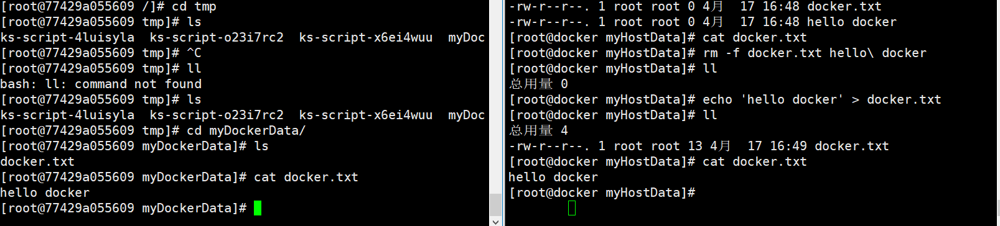
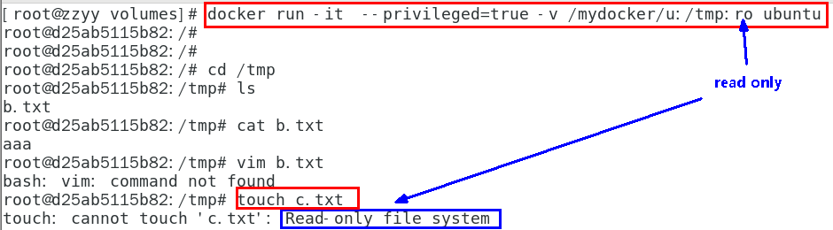
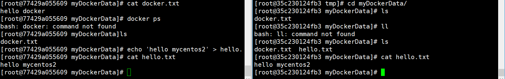

> 容器卷记得加入：`--privileged=true`

Docker挂载主机目录访问如果出现cannot open directory .: Permission denied

**解决办法：**在挂载目录后多 加一个--privileged=true参数即可

> 如果是CentOS7安全模块会比之前系统版本加强，不安全的会先禁止，所以目录挂载的情况被默认为不安全的行为，
> 在SELinux里面挂载目录被禁止掉了额，如果要开启，我们一般使用--privileged=true命令，扩大容器的权限解决挂载目录没有权限的问题，也即
> 使用该参数，container内的root拥有真正的root权限，否则，container内的root只是外部的一个普通用户权限。


### 1、什么是容器卷

> 卷就是目录或文件，存在于一个或多个容器中，由docker挂载到容器，但不属于联合文件系统，因此能够绕过Union File System提供一些用于持续存储或共享数据的特性：
> 卷的设计目的就是数据的持久化，完全独立于容器的生存周期，因此Docker不会在容器删除时删除其挂载的数据卷

一句话：有点类似我们Redis里面的rdb和aof文件

将docker容器内的数据保存进宿主机的磁盘中

运行一个带有容器卷存储功能的容器实例

```
 docker run -it --privileged=true -v /宿主机绝对路径目录:/容器内目录      镜像名
```


### 2、作用

> 将运用与运行的环境打包镜像，run后形成容器实例运行 ，但是我们对数据的要求希望是持久化的；Docker容器产生的数据，如果不备份，那么当容器实例删除后，容器内的数据自然也就没有了。为了能保存数据在docker中我们使用卷。

特点：

- 数据卷可在容器之间共享或重用数据
- 卷中的更改可以直接实时生效
- 数据卷中的更改不会包含在镜像的更新中
- 数据卷的生命周期一直持续到没有容器使用它为止


### 3、案例

#### 1、宿主vs容器之间映射添加容器卷

```
 docker run -it --privileged=true -v /宿主机绝对路径目录:/容器内目录      镜像名
```

```
## 公式：docker run -it -v /宿主机目录:/容器内目录 centos /bin/bash
[root@docker ~]## docker run -it --name mycentos --privileged=true -v /tmp/myHostData:/tmp/myDockerData centos /bin/bash
[root@77429a055609 /]## 
```

容器内目录结构

```
[root@77429a055609 /]## cd tmp
[root@77429a055609 tmp]## ls
ks-script-4luisyla  ks-script-o23i7rc2	ks-script-x6ei4wuu  myDockerData
```

宿主机内

```
[root@docker /]## cd tmp/
[root@docker tmp]## ls
ks-script-DUUAUC                                                         vmware-root_671-3988556280
myHostData                                                               vmware-root_679-3988687326
systemd-private-d8aa05bbc4754bae8de67cf03b16ed6c-chronyd.service-duHBa7  vmware-root_688-2688750615
systemd-private-dfa20a5865b348c4bb8885cff1f38f6a-chronyd.service-Kxsvca  yum.log
vmware-root_662-2689143848
[root@docker tmp]## 
```

##### 1、查看是否挂载成功

```
docker inspect 容器ID
```

```
"Mounts": [
            {
                "Type": "bind",
                "Source": "/tmp/myHostData",
                "Destination": "/tmp/myDockerData",
                "Mode": "",
                "RW": true,
                "Propagation": "rprivate"
            }
        ],
```


##### 2、容器与宿主机数据共享

- docker修改，主机同步获取
- 主机修改，docker同步获得
- docker容器stop，主机修改，docker重启后数据同步获得




#### 2、读写规则映射添加说明

默认就是rw，` rw = read + write`

```
 docker run -it --privileged=true -v /宿主机绝对路径目录:/容器内目录:rw      镜像名
```


##### 1、只读

> 容器实例内部被限制，只能读取不能写 `ro = read only`

```
 docker run -it --privileged=true -v /宿主机绝对路径目录:/容器内目录:ro      镜像名
```




/容器目录:ro 镜像名               就能完成功能，此时容器自己只能读取不能写

此时如果宿主机写入内容，可以同步给容器内，容器可以读取到。


#### 3、卷的继承和共享

> 案例场景：容器1完成与主机的映射，容器2继承容器1的卷规则

```
docker run -it  --privileged=true --volumes-from 父类  --name u2 ubuntu
```


