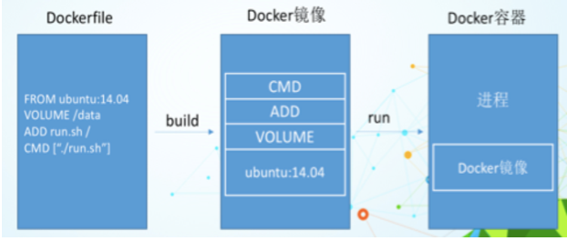
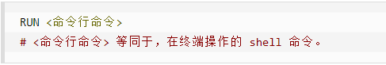
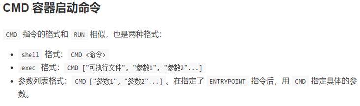
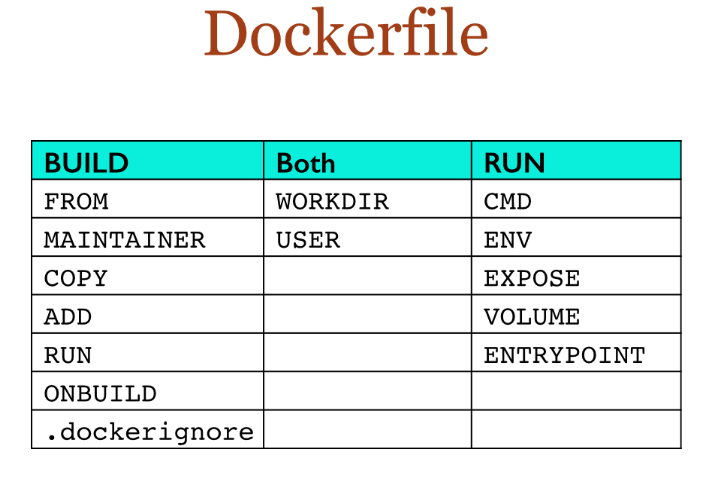

### 1、什么是DockerFile

> DockerFile是用来构建Docker镜像的文本文件，是由一条条构建镜像所需的指令和参数构成的脚本。
>
> 官网：https://docs.docker.com/engine/reference/builder/


构建步骤：

- 编写Dockerfile文件
- docker build命令构建镜像
- docker run依镜像运行容器实例


### 2、DockerFile构建过程解析

#### 1、Dockerfile内容基础知识

> 1. 每条保留字指令都必须为大写字母且后面要跟随至少一个参数
> 2. 指令按照从上到下，顺序执行
> 3. 表示注释
> 4. 每条指令都会创建一个新的镜像层并对镜像进行提交


#### 2、Docker执行Dockerfile的大致流程

> 1. docker从基础镜像运行一个容器
> 2. 执行一条指令并对容器作出修改
> 3. 执行类似docker commit的操作提交一个新的镜像层
> 4. docker再基于刚提交的镜像运行一个新容器
> 5. 执行dockerfile中的下一条指令直到所有指令都执行完成


#### 3、总结

从应用软件的角度来看，Dockerfile、Docker镜像与Docker容器分别代表软件的三个不同阶段，

*  Dockerfile是软件的原材料
*  Docker镜像是软件的交付品
*  Docker容器则可以认为是软件镜像的运行态，也即依照镜像运行的容器实例


> Dockerfile面向开发，Docker镜像成为交付标准，Docker容器则涉及部署与运维，三者缺一不可，合力充当Docker体系的基石。




- Dockerfile，需要定义一个Dockerfile，Dockerfile定义了进程需要的一切东西。Dockerfile涉及的内容包括执行代码或者是文件、环境变量、依赖包、运行时环境、动态链接库、操作系统的发行版、服务进程和内核进程(当应用进程需要和系统服务和内核进程打交道，这时需要考虑如何设计namespace的权限控制)等等;
- Docker镜像，在用Dockerfile定义一个文件之后，docker build时会产生一个Docker镜像，当运行 Docker镜像时会真正开始提供服务;
- Docker容器，容器是直接提供服务的。


### 3、Docker常用保留字指令

> [Docker中文文档 Dockerfile介绍-DockerInfo](http://www.dockerinfo.net/dockerfile介绍)

- `FROM`：基础镜像，当前新镜像是基于哪个镜像的，指定一个已经存在的镜像作为模板，第一条必须是from

- `MAINTAINER`：镜像维护者的姓名和邮箱地址

- `RUN`：容器构建时需要运行的命令

  > RUN是在 docker build时运行

    - `shell格式`：例如 `RUN yum -y install vim`

      

    - `exec格式`：

      

- `EXPOSE`：当前容器对外暴露出的端口

- `WORKDIR`：指定在创建容器后，终端默认登陆的进来工作目录，一个落脚点

- `USER`：指定该镜像以什么样的用户去执行，如果都不指定，默认是root

- `ENV`：用来在构建镜像过程中设置环境变量

  > ENV MY_PATH /usr/mytest
  > 这个环境变量可以在后续的任何RUN指令中使用，这就如同在命令前面指定了环境变量前缀一样；
  > 也可以在其它指令中直接使用这些环境变量，
  >
  > 比如：WORKDIR $MY_PATH

- `ADD`：将宿主机目录下的文件拷贝进镜像且会自动处理URL和解压tar压缩包

- `COPY`：类似ADD，拷贝文件和目录到镜像中。

  > 将从构建上下文目录中 <源路径> 的文件/目录复制到新的一层的镜像内的 <目标路径> 位置

  ```
  COPY src dest
  
  COPY ["src", "dest"]
  <src源路径>：源文件或者源目录
  <dest目标路径>：容器内的指定路径，该路径不用事先建好，路径不存在的话，会自动创建。
  ```

- `VOLUME`：容器数据卷，用于数据保存和持久化工作

- `CMD`：指定容器启动后的要干的事情

  

    - Dockerfile 中可以有多个 CMD 指令，但只有最后一个生效，CMD 会被 docker run **之后的参数替换**
    - 它和前面RUN命令的区别
        - CMD是在docker run 时运行。
        - RUN是在 docker build时运行。

- `ENTRYPOINT`：也是用来指定一个容器启动时要运行的命令

    - 类似于 CMD 指令，但是ENTRYPOINT不会被docker run后面的命令覆盖，而且这些命令行参数会被当作参数送给 ENTRYPOINT 指令指定的程序

      > 命令格式：
      > ENTRYPOINT可以和CMD一起用，一般是变参才会使用 CMD ，这里的 CMD 等于是在给 ENTRYPOINT 传参。
      > 当指定了ENTRYPOINT后，CMD的含义就发生了变化，不再是直接运行其命令而是将CMD的内容作为参数传递给ENTRYPOINT指令，他两个组合会变成
      >
      > 案例如下：假设已通过 Dockerfile 构建了 nginx:test 镜像：
      >
      > | 是否传参         | 按照dockerfile编写执行         | 传参运行                                      |
      > | ---------------- | ------------------------------ | --------------------------------------------- |
      > | Docker命令       | docker run  nginx:test         | docker run  nginx:test -c /etc/nginx/new.conf |
      > | 衍生出的实际命令 | nginx -c /etc/nginx/nginx.conf | nginx -c /etc/nginx/new.conf                  |

    - 优点：在执行docker run的时候可以指定 ENTRYPOINT 运行所需的参数。

    - 注意：如果 Dockerfile 中如果存在多个 ENTRYPOINT 指令，仅最后一个生效。





### 4、构建案例

#### 1、实现目标

> Centos7镜像具备vim+ifconfig+jdk8

准备JDK：[下载地址](https://www.oracle.com/java/technologies/downloads/#java8)


#### 2、编写DockerFile

```dockerfile
FROM centos
MAINTAINER xiaobear<xiaobear@qq.com>
 
ENV MYPATH /usr/local
WORKDIR $MYPATH
 
#centos8 需加上
RUN sed -i -e "s|mirrorlist=|#mirrorlist=|g" /etc/yum.repos.d/CentOS-*
RUN sed -i -e "s|#baseurl=http://mirror.centos.org|baseurl=http://vault.centos.org|g" /etc/yum.repos.d/CentOS-*
#安装vim编辑器
RUN yum -y install vim
#安装ifconfig命令查看网络IP
RUN yum -y install net-tools
#安装java8及lib库
RUN yum -y install glibc.i686
RUN mkdir /usr/local/java
#ADD 是相对路径jar,把jdk-8u333-linux-x64.tar.gz添加到容器中,安装包必须要和Dockerfile文件在同一位置
ADD jdk-8u333-linux-x64.tar.gz /usr/local/java/
#配置java环境变量
ENV JAVA_HOME /usr/local/java/jdk1.8.0_333
ENV JRE_HOME $JAVA_HOME/jre
ENV CLASSPATH $JAVA_HOME/lib/dt.jar:$JAVA_HOME/lib/tools.jar:$JRE_HOME/lib:$CLASSPATH
ENV PATH $JAVA_HOME/bin:$PATH

#对外暴露端口 80
EXPOSE 80
 
CMD echo $MYPATH
CMD echo "success--------------ok"
CMD /bin/bash
```


#### 3、构建

> `docker build -t 新镜像名字:TAG .`

PS：上面TAG后面有个空格，有个点

```
docker build -t centos_java8:2.0 .
```


#### 4、运行

> `docker run -it 新镜像名字:TAG `

```
[root@docker myDockerFile]## docker run -it 1ca6615ca841 /bin/bash
[root@c73761eb0626 local]## ls
bin  etc  games  include  java	lib  lib64  libexec  sbin  share  src
[root@c73761eb0626 local]## cd java
[root@c73761eb0626 java]## ls
jdk1.8.0_333
[root@c73761eb0626 java]## java -version
java version "1.8.0_333"
Java(TM) SE Runtime Environment (build 1.8.0_333-b02)
Java HotSpot(TM) 64-Bit Server VM (build 25.333-b02, mixed mode)
[root@c73761eb0626 java]## vim a.txt
[root@c73761eb0626 java]## cat a.txt 
hello Dockerfile
[root@c73761eb0626 java]## 
```


#### 5、体会`UnionFS`

> UnionFS（联合文件系统）：Union文件系统（UnionFS）是一种分层、轻量级并且高性能的文件系统，它支持对文件系统的修改作为一次提交来一层层的叠加，同时可以将不同目录挂载到同一个虚拟文件系统下(unite several directories into a single virtual filesystem)。Union 文件系统是 Docker 镜像的基础。镜像可以通过分层来进行继承，基于基础镜像（没有父镜像），可以制作各种具体的应用镜像。
>
> 
>
> 特性：一次同时加载多个文件系统，但从外面看起来，只能看到一个文件系统，联合加载会把各层文件系统叠加起来，这样最终的文件系统会包含所有底层的文件和目录


### 5、虚悬镜像

> 仓库名、标签都是`<none>`的镜像，俗称dangling image


#### 1、编写Dockerfile

```dockerfile
from ubuntu
CMD echo 'action is success'
```


构建

```
docker build .
```


查看镜像

```
docker ../../images
```


#### 2、查看

```
docker image ls -f dangling=true
```


#### 3、删除

```
docker image prune
```

虚悬镜像已经失去存在价值，可以删除
