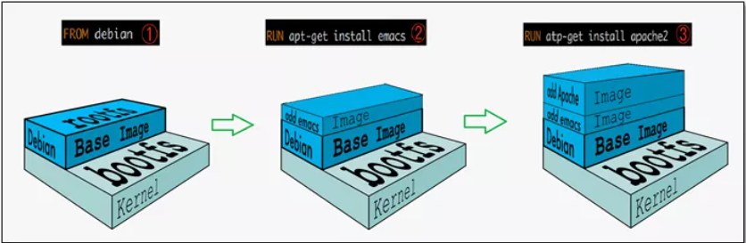

### 1、什么是Docker镜像

> 镜像：是一种轻量级、可执行的独立软件包，它包含运行某个软件所需的所有内容，我们把应用程序和配置依赖打包好形成一个可交付的运行环境(包括代码、运行时需要的库、环境变量和配置文件等)，这个打包好的运行环境就是image镜像文件。
>
> 只有通过这个镜像文件才能生成Docker容器实例(类似Java中new出来一个对象)。


#### 1、分层镜像

`docker pull`我们拉取镜像的时候，下载的时候就是多线程在下载，一层一层的下载


#### 2、联合文件系统

> UnionFS（联合文件系统）：Union文件系统（UnionFS）是一种分层、轻量级并且高性能的文件系统，它支持对文件系统的修改作为一次提交来一层层的叠加，同时可以将不同目录挂载到同一个虚拟文件系统下(unite several directories into a single virtual filesystem)。Union 文件系统是 Docker 镜像的基础。镜像可以通过分层来进行继承，基于基础镜像（没有父镜像），可以制作各种具体的应用镜像。

**特性**：一次同时加载多个文件系统，但从外面看起来，只能看到一个文件系统，联合加载会把各层文件系统叠加起来，这样最终的文件系统会包含所有底层的文件和目录


#### 3、镜像加速的原理


> 平时我们安装进虚拟机的CentOS都是好几个G，为什么docker这里才200M？？

```
[root@docker /]## docker ../../images centos
REPOSITORY   TAG       IMAGE ID       CREATED        SIZE
centos       latest    5d0da3dc9764   6 months ago   231MB
```

对于一个精简的OS，rootfs可以很小，只需要包括最基本的命令、工具和程序库就可以了，因为底层直接用Host的kernel，自己只需要提供 rootfs 就行了。由此可见对于不同的linux发行版, bootfs基本是一致的, rootfs会有差别, 因此不同的发行版可以公用bootfs。


#### 4、Docker为什么采用分层镜像

> **镜像分层最大的一个好处就是共享资源，方便复制迁移，就是为了复用**。
>
> 比如说有多个镜像都从相同的 base 镜像构建而来，那么 Docker Host 只需在磁盘上保存一份 base 镜像；同时内存中也只需加载一份 base 镜像，就可以为所有容器服务了。而且镜像的每一层都可以被共享。


### 2、理解

> Docker镜像层都是只读的，容器层是可写的
> 当容器启动时，一个新的可写层被加载到镜像的顶部。
> 这一层通常被称作“容器层”，“容器层”之下的都叫“镜像层”。

所有对容器的改动 - 无论添加、删除、还是修改文件都只会发生在容器层中。只有容器层是可写的，容器层下面的所有镜像层都是只读的。


### 3、`commit`操作

> docker commit -m="提交的描述信息" -a="作者" 容器ID 要创建的目标镜像名:[标签名]
>
> docker commit提交容器副本使之成为一个新的镜像

##### 案例演示

##### 1、启动centos容器

```
[root@docker /]## docker run -it centos /bin/bash
[root@c7f841ff540c /]## vim a.txt
bash: vim: command not found
```


##### 2、安装Vim

```
[root@c7f841ff540c /]## yum update
Failed to set locale, defaulting to C.UTF-8
CentOS Linux 8 - AppStream                                                                            54  B/s |  38  B     00:00    
Error: Failed to download metadata for repo 'appstream': Cannot prepare internal mirrorlist: No URLs in mirrorlist
```

失败原因：

在2022年1月31日，CentOS团队终于从官方镜像中移除CentOS 8的所有包。

CentOS 8已于2021年12月31日寿终正非，但软件包仍在官方镜像上保留了一段时间。现在他们被转移到[https://vault.centos.org](https://vault.centos.org/)

**解决方法**

如果你仍然需要运行CentOS 8，你可以在/etc/yum.repos.d中更新一下源。使用[vault.centos.org](http://vault.centos.org/)代替[mirror.centos.org](http://mirror.centos.org/)。

```
sed -i -e "s|mirrorlist=|#mirrorlist=|g" /etc/yum.repos.d/CentOS-*
sed -i -e "s|#baseurl=http://mirror.centos.org|baseurl=http://vault.centos.org|g" /etc/yum.repos.d/CentOS-*
```


```
yum install -y vim
```


##### 3、提交新镜像

```
docker commit [OPTIONS] 容器ID [REPOSITORY[:TAG]]
```

```
[root@docker /]## docker commit -m="add vim cmd" -a="xiaobear" c7f841ff540c centos1:1.0
sha256:08f93c12227128eef1e61d0c064ad1b74f903e4102071528a798389980e69608
```


##### 4、测试

```
[root@docker /]## docker run -it centos1:1.0 /bin/bash
[root@80c4d3b1ea3b /]## vim xiaobear.txt
[root@80c4d3b1ea3b /]## 
```

官网是默认下载的centos没有vim命令
我们自己commit构建的镜像，新增加了vim功能，可以成功使用。


### 4、总结

> Docker中的镜像分层，支持通过扩展现有镜像，创建新的镜像。类似Java继承于一个Base基础类，自己再按需扩展。
> 新镜像是从 base 镜像一层一层叠加生成的。每安装一个软件，就在现有镜像的基础上增加一层


