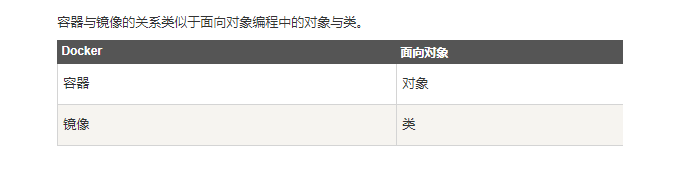
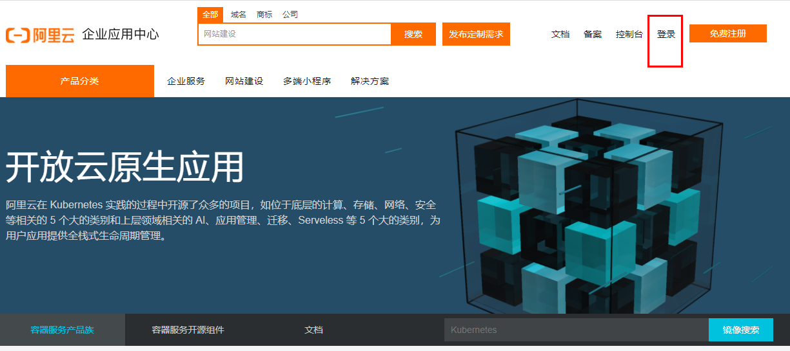
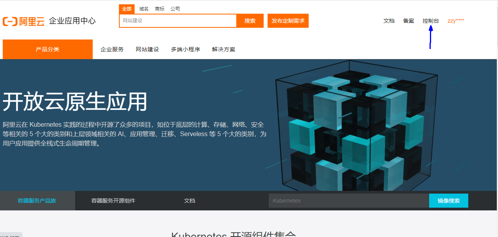
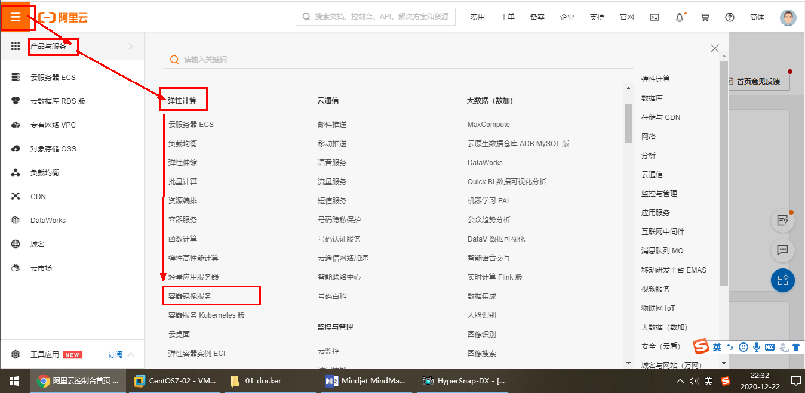
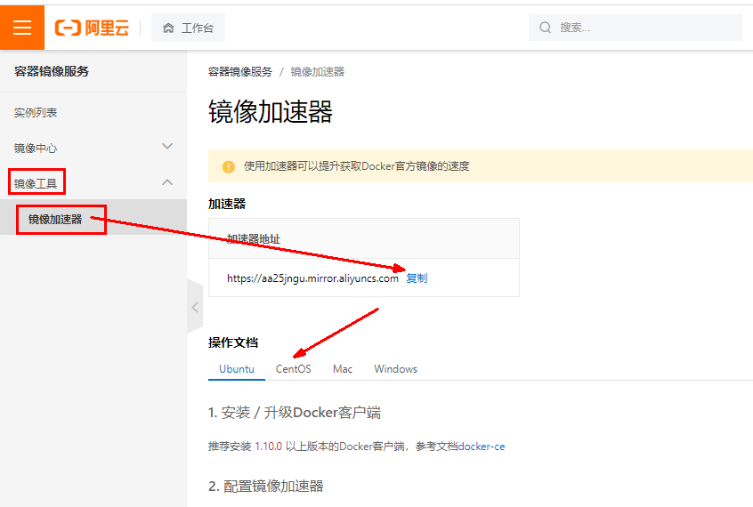
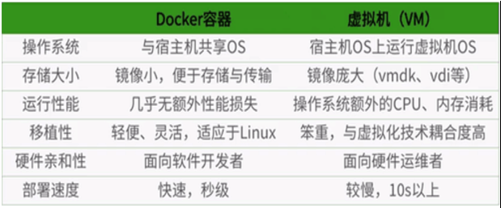

### 1、前提说明


#### 1、前提条件

目前，CentOS 仅发行版本中的内核支持 Docker。Docker 运行在CentOS 7 (64-bit)上，要求系统为64位、Linux系统内核版本为 3.8以上，这里选用Centos7.x

#### 2、查看自己内核

uname命令用于打印当前系统相关信息（内核版本号、硬件架构、主机名称和操作系统类型等）。

```
[root@docker ~]## cat /etc/redhat-release 
CentOS Linux release 7.8.2003 (Core)
[root@docker ~]## uname -r
3.10.0-1127.el7.x86_64
```


### 2、Docker的组成

#### 1、镜像`image`

> Docker 镜像（Image）就是一个只读的模板。镜像可以用来创建 Docker 容器，一个镜像可以创建很多容器。它也相当于是一个root文件系统。
>
> 比如官方镜像 centos:7 就包含了完整的一套 centos:7 最小系统的 root 文件系统。
>
> 相当于容器的“源代码”，docker镜像文件类似于Java的类模板，而docker容器实例类似于java中new出来的实例对象。




#### 2、容器`container`

##### 1、从面向对象角度看

> Docker 利用容器（Container）独立运行的一个或一组应用，应用程序或服务运行在容器里面，容器就类似于一个虚拟化的运行环境，容器是用镜像创建的运行实例。就像是Java中的类和实例对象一样，镜像是静态的定义，容器是镜像运行时的实体。容器为镜像提供了一个标准的和隔离的运行环境，它可以被启动、开始、停止、删除。每个容器都是相互隔离的、保证安全的平台

##### 2、从容器角度看

> 可以把容器看做是一个简易版的 Linux 环境（包括root用户权限、进程空间、用户空间和网络空间等）和运行在其中的应用程序。


#### 3、仓库`repository`

> 仓库（Repository）是集中存放镜像文件的场所。

类似于
Maven仓库，存放各种jar包的地方；
github仓库，存放各种git项目的地方；
Docker公司提供的官方registry被称为Docker Hub，存放各种镜像模板的地方。

仓库分为公开仓库（Public）和私有仓库（Private）两种形式。最大的公开仓库是 Docker Hub(https://hub.docker.com/)，
存放了数量庞大的镜像供用户下载。国内的公开仓库包括阿里云 、网易云等


#### 4、总结

需要正确的理解仓库/镜像/容器这几个概念:

>Docker 本身是一个容器运行载体或称之为管理引擎。我们把应用程序和配置依赖打包好形成一个可交付的运行环境，这个打包好的运行环境就是image镜像文件。只有通过这个镜像文件才能生成Docker容器实例(类似Java中new出来一个对象)。
>
>image文件可以看作是容器的模板。Docker 根据 image 文件生成容器的实例。同一个 image 文件，可以生成多个同时运行的容器实例。
>
>* 镜像文件
   >
   >  image 文件生成的容器实例，本身也是一个文件，称为镜像文件。
>
>* 容器实例
   >
   >  一个容器运行一种服务，当我们需要的时候，就可以通过docker客户端创建一个对应的运行实例，也就是我们的容器
>
>* 仓库
   >
   >  就是放一堆镜像的地方，我们可以把镜像发布到仓库中，需要的时候再从仓库中拉下来就可以了。


### 3、整体架构及底层原理

> Docker 是一个 C/S 模式的架构，后端是一个松耦合架构，众多模块各司其职。


### 4、Docker安装

> 官方安装地址：https://docs.docker.com/engine/install/centos/
>
> 个人总结安装地址：http://xiao_bear.gitee.io/javaxiaobear/install/linux.html#_1%E3%80%81linux%E5%AE%89%E8%A3%85docker

#### 1、卸载系统之前的docker

```text
sudo yum remove docker \
docker-client \
docker-client-latest \
docker-common \
docker-latest \
docker-latest-logrotate \
docker-logrotate \
docker-engine
```

#### 2、yum安装gcc相关

```
yum install -y gcc gcc-c++
```

#### 3、安装需要的软件包

```
yum install -y yum-utils
```

#### 4、设置stable镜像仓库

```
最好使用阿里云镜像,国外下载速度慢
官方镜像：yum-config-manager --add-repo https://download.docker.com/linux/centos/docker-ce.repo
阿里云镜像：yum-config-manager --add-repo http://mirrors.aliyun.com/docker-ce/linux/centos/docker-ce.repo
```

```
[root@docker ~]## yum-config-manager --add-repo http://mirrors.aliyun.com/docker-ce/linux/centos/docker-ce.repo
已加载插件：fastestmirror, langpacks
adding repo from: http://mirrors.aliyun.com/docker-ce/linux/centos/docker-ce.repo
grabbing file http://mirrors.aliyun.com/docker-ce/linux/centos/docker-ce.repo to /etc/yum.repos.d/docker-ce.repo
repo saved to /etc/yum.repos.d/docker-ce.repo
```

#### 5、更新yum软件包索引

```
yum makecache fast
```

#### 6、安装DOCKER CE

```
yum -y install docker-ce docker-ce-cli containerd.io
```

#### 7、启动docker

```
systemctl start docker
```

#### 8、测试

查看docker版本

```
docker version
```

永远的hello-world：没有找到镜像，会自动拉去镜像下载

```
docker run hello-world
```

```
[root@docker ~]## docker run hello-world
Unable to find image 'hello-world:latest' locally
latest: Pulling from library/hello-world
2db29710123e: Pull complete 
Digest: sha256:bfea6278a0a267fad2634554f4f0c6f31981eea41c553fdf5a83e95a41d40c38
Status: Downloaded newer image for hello-world:latest

Hello from Docker!
This message shows that your installation appears to be working correctly.

To generate this message, Docker took the following steps:
 1. The Docker client contacted the Docker daemon.
 2. The Docker daemon pulled the "hello-world" image from the Docker Hub.
    (amd64)
 3. The Docker daemon created a new container from that image which runs the
    executable that produces the output you are currently reading.
 4. The Docker daemon streamed that output to the Docker client, which sent it
    to your terminal.

To try something more ambitious, you can run an Ubuntu container with:
 $ docker run -it ubuntu bash

Share ../../../images, automate workflows, and more with a free Docker ID:
 https://hub.docker.com/

For more examples and ideas, visit:
 https://docs.docker.com/get-started/
```

#### 9、卸载

```
停止docker
systemctl stop docker

移除docker组件
yum remove docker-ce docker-ce-cli containerd.io

rm -rf /var/lib/docker

rm -rf /var/lib/containerd
```


### 5、阿里云加速镜像

#### 1、阿里云镜像地址

https://promotion.aliyun.com/ntms/act/kubernetes.html

#### 2、获得加速器地址连接

- 登录

  

- 控制台

  

- 选择容器镜像服务

  

- 获取加速器地址

  

- 运行命名

  ```
  #分步骤执行
  mkdir -p /etc/docker
  vim  /etc/docker/daemon.json
  
   #阿里云
  {
    "registry-mirrors": ["https://｛自已的编码｝.mirror.aliyuncs.com"]
  }
  ```


- 重启服务器

  ```
  sudo systemctl daemon-reload
  sudo systemctl restart docker
  ```


### 6、Hello World

> 启动Docker后台容器(测试运行 hello-world)


PS：输出这段提示以后，hello world就会停止运行，容器自动终止。


#### run的流程


### 7、底层原理

#### 1、为什么Docker会比虚拟机快

1. docker有着比虚拟机更少的抽象层

   >   由于docker不需要Hypervisor(虚拟机)实现硬件资源虚拟化,运行在docker容器上的程序直接使用的都是实际物理机的硬件资源。因此在CPU、内存利用率上docker将会在效率上有明显优势。

2. docker利用的是宿主机的内核,而不需要加载操作系统OS内核

   >    当新建一个容器时,docker不需要和虚拟机一样重新加载一个操作系统内核。进而避免引寻、加载操作系统内核返回等比较费时费资源的过程,当新建一个虚拟机时,虚拟机软件需要加载OS,返回新建过程是分钟级别的。而docker由于直接利用宿主机的操作系统,则省略了返回过程,因此新建一个docker容器只需要几秒钟。

   

   
