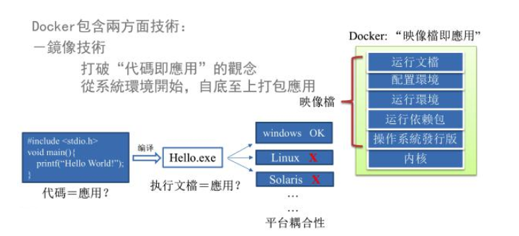
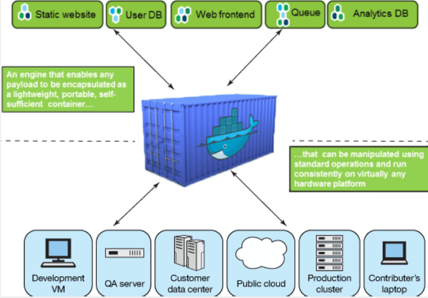
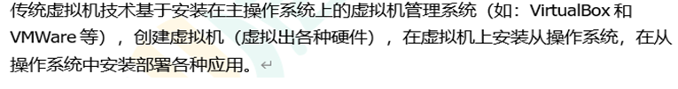
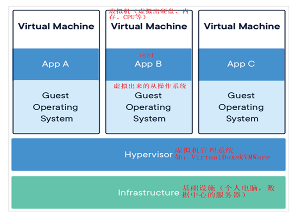
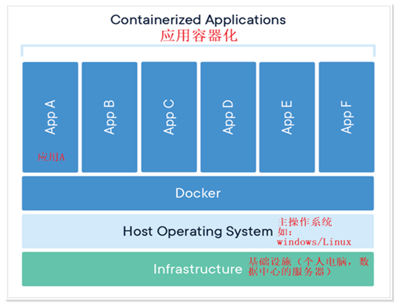
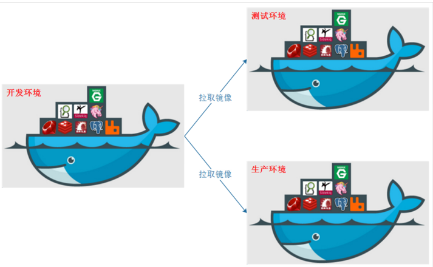

### 1、Docker为何会出现

#### 1、引出Docker

> 假定您在开发一个尚硅谷的谷粒商城，您使用的是一台笔记本电脑而且您的开发环境具有特定的配置。其他开发人员身处的环境配置也各有不同。您正在开发的应用依赖于您当前的配置且还要依赖于某些配置文件。此外，您的企业还拥有标准化的测试和生产环境，且具有自身的配置和一系列支持文件。您希望尽可能多在本地模拟这些环境而不产生重新创建服务器环境的开销。
>
> 请问？
> 您要如何确保应用能够在这些环境中运行和通过质量检测？并且在部署过程中不出现令人头疼的版本、配置问题，也无需重新编写代码和进行故障修复？

**答案**：使用容器。Docker之所以发展如此迅速，也是因为它对此给出了一个标准化的解决方案-----系统平滑移植，容器虚拟化技术。

环境配置相当麻烦，换一台机器，就要重来一次，费力费时。很多人想到，能不能从根本上解决问题，软件可以带环境安装？也就是说，**安装的时候，把原始环境一模一样地复制过来。开发人员利用 Docker 可以消除协作编码时“在我的机器上可正常工作”的问题**。

之前在服务器配置一个应用的运行环境，要安装各种软件，就拿尚硅谷电商项目的环境来说，Java/RabbitMQ/MySQL/JDBC驱动包等。安装和配置这些东西有多麻烦就不说了，它还不能跨平台。假如我们是在 Windows 上安装的这些环境，到了 Linux 又得重新装。况且就算不跨操作系统，换另一台同样操作系统的服务器，要移植应用也是非常麻烦的。

> 传统上认为，软件编码开发/测试结束后，所产出的成果即是程序或是能够编译执行的二进制字节码等(java为例)。而为了让这些程序可以顺利执行，开发团队也得准备完整的部署文件，让维运团队得以部署应用程式，开发需要清楚的告诉运维部署团队，用的全部配置文件+所有软件环境。不过，即便如此，仍然常常发生部署失败的状况。==Docker的出现使得Docker得以打破过去「程序即应用」的观念。透过镜像(../../../images)将作业系统核心除外，运作应用程式所需要的系统环境，由下而上打包，达到应用程式跨平台间的无缝接轨运作。==

#### 2、什么是Docker

> Docker是基于Go语言实现的云开源项目。
> Docker的主要目标是“Build，Ship and Run Any App,Anywhere”，也就是通过对应用组件的封装、分发、部署、运行等生命周期的管理，使用户的APP（可以是一个WEB应用或数据库应用等等）及其运行环境能够做到“一次镜像，处处运行”。

Linux容器技术的出现就解决了这样一个问题，而 Docker 就是在它的基础上发展过来的。将应用打成镜像，通过镜像成为运行在Docker容器上面的实例，而 Docker容器在任何操作系统上都是一致的，这就实现了跨平台、跨服务器。

只需要一次配置好环境，换到别的机子上就可以一键部署好，大大简化了操作。

#### 3、总结

> Docker解决了运行环境和配置问题的软件容器，方便做持续集成并有助于整体发布的容器虚拟化技术。

### 2、容器与虚拟机的比较

#### 1、容器的发展史

具体资讯参考：https://developer.aliyun.com/article/775778

#### 2、传统虚拟机技术

> 虚拟机（virtual machine）就是带环境安装的一种解决方案。
> 它可以在一种操作系统里面运行另一种操作系统，比如在Windows10系统里面运行Linux系统CentOS7。应用程序对此毫无感知，因为虚拟机看上去跟真实系统一模一样，而对于底层系统来说，虚拟机就是一个普通文件，不需要了就删掉，对其他部分毫无影响。这类虚拟机完美的运行了另一套系统，能够使应用程序，操作系统和硬件三者之间的逻辑不变。

虚拟机的缺点：

- 占用资源多
- 冗余步骤多
- 启动速度慢

#### 3、容器虚拟化技术

由于前面虚拟机存在某些缺点，Linux发展出了另一种虚拟化技术：

##### Linux容器(Linux Containers，缩写为 LXC)

> Linux容器是与系统其他部分隔离开的一系列进程，从另一个镜像运行，并由该镜像提供支持进程所需的全部文件。容器提供的镜像包含了应用的所有依赖项，因而在从开发到测试再到生产的整个过程中，它都具有可移植性和一致性。

**Linux 容器不是模拟一个完整的操作系统而是对进程进行隔离**。有了容器，就可以将软件运行所需的所有资源打包到一个隔离的容器中。容器与虚拟机不同，不需要捆绑一整套操作系统，只需要软件工作所需的库资源和设置。系统因此而变得高效轻量并保证部署在任何环境中的软件都能始终如一地运行。

Docker容器则是在操作系统层面上实现虚拟化，直接复用本地主机的操作系统，而传统虚拟机则是在硬件层面上实现虚拟化，**与传统的虚拟机相比，Docker优势体现为启动速度快，占用内存小。**

#### 4、区别

Docker 和传统虚拟化方式的不同之处：

- 传统虚拟机技术是虚拟出一套硬件后，在其上运行一个完整操作系统，在该系统上再运行所需应用进程；
- 容器内的应用进程直接运行于宿主的内核，容器内没有自己的内核且也没有进行硬件虚拟。因此容器要比传统虚拟机更为轻便。
- 每个容器之间互相隔离，每个容器有自己的文件系统 ，容器之间进程不会相互影响，能区分计算资源。

### 3、学习的用处

#### 1、职场的变化

coder -> programmer -> software engineer -> DevOps engineer

#### 2、一次构建，随处运行

- 更快速的应用交付和部署

> 传统的应用开发完成后，需要提供一堆安装程序和配置说明文档，安装部署后需根据配置文档进行繁杂的配置才能正常运行。Docker化之后只需要交付少量容器镜像文件，在正式生产环境加载镜像并运行即可，应用安装配置在镜像里已经内置好，大大节省部署配置和测试验证时间。

- 更便捷的升级和扩缩容

> 随着微服务架构和Docker的发展，大量的应用会通过微服务方式架构，应用的开发构建将变成搭乐高积木一样，每个Docker容器将变成一块“积木”，应用的升级将变得非常容易。当现有的容器不足以支撑业务处理时，可通过镜像运行新的容器进行快速扩容，使应用系统的扩容从原先的天级变成分钟级甚至秒级。

- 更简单的系统运维

> 应用容器化运行后，生产环境运行的应用可与开发、测试环境的应用高度一致，容器会将应用程序相关的环境和状态完全封装起来，不会因为底层基础架构和操作系统的不一致性给应用带来影响，产生新的BUG。当出现程序异常时，也可以通过测试环境的相同容器进行快速定位和修复。

- 更高效的计算资源利用

> Docker是内核级虚拟化，其不像传统的虚拟化技术一样需要额外的Hypervisor支持，所以在一台物理机上可以运行很多个容器实例，可大大提升物理服务器的CPU和内存的利用率。

#### 3、Docker应用场景

### 4、官网地址

官网：docker官网：http://www.docker.com

仓库：Docker Hub官网: https://hub.docker.com/
