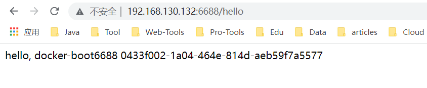

### 1、建立测试微服务模块


### 2、通过dockerfile发布微服务部署到docker容器

#### 1、IDEA 进行打包


#### 2、编写Dockerfile

```dockerfile
## 基础镜像使用java
FROM java:8
## 作者
MAINTAINER xiaobear
## VOLUME 指定临时文件目录为/tmp，在主机/var/lib/docker目录下创建了一个临时文件并链接到容器的/tmp
VOLUME /tmp
## 将jar包添加到容器中并更名为xiaobear_docker.jar
ADD Docker-Boot-0.0.1-SNAPSHOT.jar xiaobear_docker.jar
## 运行jar包
RUN bash -c 'touch /xiaobear_docker.jar'
ENTRYPOINT ["java","-jar","/xiaobear_docker.jar"]
#暴露6688端口作为微服务
EXPOSE 6688
```


PS：将微服务jar包和Dockerfile文件上传到同一个目录下


#### 3、构建镜像

```
docker build -t docker_boot:1.0 .
```


#### 4、运行镜像

```
 docker run -d -p 6688:6688 docker_boot:1.0
```


#### 5、测试

```
curl 127.0.0.1:6688/hello
```


