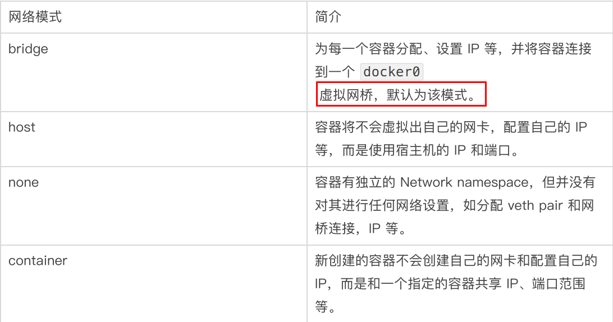
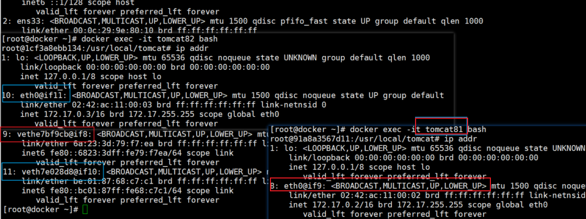

### 1、什么是Docker网络

- 没有开启Docker网络时的网络状态：

```
1: lo: <LOOPBACK,UP,LOWER_UP> mtu 65536 qdisc noqueue state UNKNOWN group default qlen 1000
    link/loopback 00:00:00:00:00:00 brd 00:00:00:00:00:00
    inet 127.0.0.1/8 scope host lo
       valid_lft forever preferred_lft forever
    inet6 ::1/128 scope host 
       valid_lft forever preferred_lft forever
2: ens33: <BROADCAST,MULTICAST,UP,LOWER_UP> mtu 1500 qdisc pfifo_fast state UP group default qlen 1000
    link/ether 00:0c:29:9e:80:10 brd ff:ff:ff:ff:ff:ff
    inet 192.168.130.132/24 brd 192.168.130.255 scope global noprefixroute ens33
       valid_lft forever preferred_lft forever
    inet6 fe80::987d:a504:45a9:2011/64 scope link noprefixroute 
       valid_lft forever preferred_lft forever
39: veth33b55fa@if38: <BROADCAST,MULTICAST,UP,LOWER_UP> mtu 1500 qdisc noqueue master docker0 state UP group default 
    link/ether 2a:e3:37:b2:68:47 brd ff:ff:ff:ff:ff:ff link-netnsid 0
    inet6 fe80::28e3:37ff:feb2:6847/64 scope link 
       valid_lft forever preferred_lft forever
```

- 开启docker后

```
1: lo: <LOOPBACK,UP,LOWER_UP> mtu 65536 qdisc noqueue state UNKNOWN group default qlen 1000
    link/loopback 00:00:00:00:00:00 brd 00:00:00:00:00:00
    inet 127.0.0.1/8 scope host lo
       valid_lft forever preferred_lft forever
    inet6 ::1/128 scope host 
       valid_lft forever preferred_lft forever
2: ens33: <BROADCAST,MULTICAST,UP,LOWER_UP> mtu 1500 qdisc pfifo_fast state UP group default qlen 1000
    link/ether 00:0c:29:9e:80:10 brd ff:ff:ff:ff:ff:ff
    inet 192.168.130.132/24 brd 192.168.130.255 scope global noprefixroute ens33
       valid_lft forever preferred_lft forever
    inet6 fe80::987d:a504:45a9:2011/64 scope link noprefixroute 
       valid_lft forever preferred_lft forever
3: docker0: <BROADCAST,MULTICAST,UP,LOWER_UP> mtu 1500 qdisc noqueue state UP group default 
    link/ether 02:42:8a:3f:98:14 brd ff:ff:ff:ff:ff:ff
    inet 172.17.0.1/16 brd 172.17.255.255 scope global docker0
       valid_lft forever preferred_lft forever
    inet6 fe80::42:8aff:fe3f:9814/64 scope link 
       valid_lft forever preferred_lft forever
39: veth33b55fa@if38: <BROADCAST,MULTICAST,UP,LOWER_UP> mtu 1500 qdisc noqueue master docker0 state UP group default 
    link/ether 2a:e3:37:b2:68:47 brd ff:ff:ff:ff:ff:ff link-netnsid 0
    inet6 fe80::28e3:37ff:feb2:6847/64 scope link 
       valid_lft forever preferred_lft forever
```

> 会产生一个名为docker0的虚拟网桥

查看Docker网络的情况

```
docker network ls
```

```
[root@docker docker-boot]## docker network ls
NETWORK ID     NAME      DRIVER    SCOPE
012ef5850c2b   bridge    bridge    local
15bd0ffe79b0   host      host      local
28741f9b037c   none      null      local
[root@docker docker-boot]## 
```


### 2、基本命令

#### 1、所有命令

```
[root@docker docker-boot]## docker network --help

Usage:  docker network COMMAND

Manage networks

Commands:
  connect     Connect a container to a network
  create      Create a network
  disconnect  Disconnect a container from a network
  inspect     Display detailed information on one or more networks
  ls          List networks
  prune       Remove all unused networks
  rm          Remove one or more networks

Run 'docker network COMMAND --help' for more information on a command.
[root@docker docker-boot]## 
```


#### 2、查看网络命令

```
docker network ls
```


#### 3、查看网络源

```
docker network inspect  XXX网络名字
```


#### 4、删除网络

```
docker network rm 网络名字
```


全程案例过程：

```
[root@docker docker-boot]## docker network create test_network
473cef3a3e4ca58d62898caa93ae97a3772ab0d90325fc7a107082ef8c5a5bce
[root@docker docker-boot]## docker network ls
NETWORK ID     NAME           DRIVER    SCOPE
012ef5850c2b   bridge         bridge    local
15bd0ffe79b0   host           host      local
28741f9b037c   none           null      local
473cef3a3e4c   test_network   bridge    local
[root@docker docker-boot]## docker network rm test_network 
test_network
[root@docker docker-boot]## docker network ls
NETWORK ID     NAME      DRIVER    SCOPE
012ef5850c2b   bridge    bridge    local
15bd0ffe79b0   host      host      local
28741f9b037c   none      null      local
[root@docker docker-boot]## 
```


### 3、作用

> - 容器间的互联和通信以及端口映射
> - 容器IP变动时候可以通过服务名直接网络通信而不受到影响


### 4、网络模式

#### 1、模式类型




- `bridge模式`：使用--network  bridge指定，默认使用docker0
- `host模式`：使用--network host指定
- `none模式`：使用--network none指定
- `container模式`：使用--network container:NAME或者容器ID指定


#### 2、容器实例内默认网络IP生产规则

##### 1、先启动两个centos容器实例

```
docker run -it -d --name c1 centos bash
docker run -it -d --name c2 centos bash
```


##### 2、2 docker inspect 容器ID or 容器名字

```
[root@docker docker-boot]## docker inspect c1 | tail -n 20
            "Networks": {
                "bridge": {
                    "IPAMConfig": null,
                    "Links": null,
                    "Aliases": null,
                    "NetworkID": "012ef5850c2b3e380a1cb58d9365d60a6ee8ee4b943d8d6ab90aaebd22e1bf62",
                    "EndpointID": "257f45d018046dcfa90a5d201c436db20dea41cc9ec2bb58d88576c25143c62f",
                    "Gateway": "172.17.0.1",
                    "IPAddress": "172.17.0.3",
                    "IPPrefixLen": 16,
                    "IPv6Gateway": "",
                    "GlobalIPv6Address": "",
                    "GlobalIPv6PrefixLen": 0,
                    "MacAddress": "02:42:ac:11:00:03",
                    "DriverOpts": null
                }
            }
        }
    }
]
[root@docker docker-boot]## docker inspect c2 | tail -n 20
            "Networks": {
                "bridge": {
                    "IPAMConfig": null,
                    "Links": null,
                    "Aliases": null,
                    "NetworkID": "012ef5850c2b3e380a1cb58d9365d60a6ee8ee4b943d8d6ab90aaebd22e1bf62",
                    "EndpointID": "3b2688b510738178d64344d97e245b38442fbe91e71d486da2fd1ccf1953ec92",
                    "Gateway": "172.17.0.1",
                    "IPAddress": "172.17.0.4",
                    "IPPrefixLen": 16,
                    "IPv6Gateway": "",
                    "GlobalIPv6Address": "",
                    "GlobalIPv6PrefixLen": 0,
                    "MacAddress": "02:42:ac:11:00:04",
                    "DriverOpts": null
                }
            }
        }
    }
]
[root@docker docker-boot]## 
```

两个示例对应的ip地址分别是：`172.17.0.4`和`172.17.0.3`


##### 3、关闭其中一个实例

> 关闭c1，再新建一个c3实例

```
[root@docker docker-boot]## docker stop c1
c1
[root@docker docker-boot]## docker ps
CONTAINER ID   IMAGE          COMMAND                  CREATED          STATUS          PORTS                                       NAMES
010441413dc6   centos         "bash"                   12 minutes ago   Up 12 minutes                                               c2
f1141e4f51b9   90c07658a4b1   "java -jar /xiaobear…"   2 hours ago      Up 2 hours      0.0.0.0:6688->6688/tcp, :::6688->6688/tcp   zealous_shockley
[root@docker docker-boot]## docker run -it -d --name c3 centos bash
70066a4f0735eea5a9d4f175bb4d4af4efe516f7d98e919bfbfe9a4699925515
[root@docker docker-boot]## docker inspect c3 | tail -n 20
            "Networks": {
                "bridge": {
                    "IPAMConfig": null,
                    "Links": null,
                    "Aliases": null,
                    "NetworkID": "012ef5850c2b3e380a1cb58d9365d60a6ee8ee4b943d8d6ab90aaebd22e1bf62",
                    "EndpointID": "f1f8b9195c706b7e618953746be882c68a11bb36cd689519fc1a0b3ef580b6c9",
                    "Gateway": "172.17.0.1",
                    "IPAddress": "172.17.0.3",
                    "IPPrefixLen": 16,
                    "IPv6Gateway": "",
                    "GlobalIPv6Address": "",
                    "GlobalIPv6PrefixLen": 0,
                    "MacAddress": "02:42:ac:11:00:03",
                    "DriverOpts": null
                }
            }
        }
    }
]
[root@docker docker-boot]## docker inspect c2 | tail -n 20
            "Networks": {
                "bridge": {
                    "IPAMConfig": null,
                    "Links": null,
                    "Aliases": null,
                    "NetworkID": "012ef5850c2b3e380a1cb58d9365d60a6ee8ee4b943d8d6ab90aaebd22e1bf62",
                    "EndpointID": "3b2688b510738178d64344d97e245b38442fbe91e71d486da2fd1ccf1953ec92",
                    "Gateway": "172.17.0.1",
                    "IPAddress": "172.17.0.4",
                    "IPPrefixLen": 16,
                    "IPv6Gateway": "",
                    "GlobalIPv6Address": "",
                    "GlobalIPv6PrefixLen": 0,
                    "MacAddress": "02:42:ac:11:00:04",
                    "DriverOpts": null
                }
            }
        }
    }
]
[root@docker docker-boot]## 
```

总结：**docker容器内部的ip是有可能会发生改变的**


#### 3、模式案例

##### 1、`bridge`

> Docker 服务默认会创建一个 docker0 网桥（其上有一个 docker0 内部接口），该桥接网络的名称为docker0，它在内核层连通了其他的物理或虚拟网卡，这就将所有容器和本地主机都放到同一个物理网络。Docker 默认指定了 docker0 接口 的 IP 地址和子网掩码，让主机和容器之间可以通过网桥相互通信。

**查看 bridge 网络的详细信息，并通过 grep 获取名称项**

```
docker network inspect bridge | grep name
```

```
[root@docker ~]## docker network inspect bridge | grep name
            "com.docker.network.bridge.name": "docker0",
[root@docker ~]## 
[root@docker ~]## ifconfig | grep docker
docker0: flags=4099<UP,BROADCAST,MULTICAST>  mtu 1500
[root@docker ~]## 
```


###### 说明

> Docker使用Linux桥接，在宿主机虚拟一个Docker容器网桥(docker0)，Docker启动一个容器时会根据Docker网桥的网段分配给容器一个IP地址，称为Container-IP，同时Docker网桥是每个容器的默认网关。因为在同一宿主机内的容器都接入同一个网桥，这样容器之间就能够通过容器的Container-IP直接通信。
>
>
>
> docker run 的时候，没有指定network的话默认使用的网桥模式就是bridge，使用的就是docker0。在宿主机ifconfig,就可以看到docker0和自己create的network(后面讲)eth0，eth1，eth2……代表网卡一，网卡二，网卡三……，lo代表127.0.0.1，即localhost，inet addr用来表示网卡的IP地址
>
>
>
> 网桥docker0创建一对对等虚拟设备接口一个叫veth，另一个叫eth0，成对匹配。
>
> - 整个宿主机的网桥模式都是docker0，类似一个交换机有一堆接口，每个接口叫veth，在本地主机和容器内分别创建一个虚拟接口，并让他们彼此联通（这样一对接口叫veth pair）；
> - 每个容器实例内部也有一块网卡，每个接口叫eth0；
> - docker0上面的每个veth匹配某个容器实例内部的eth0，两两配对，一一匹配。
>
> 通过上述，将宿主机上的所有容器都连接到这个内部网络上，两个容器在同一个网络下,会从这个网关下各自拿到分配的ip，此时两个容器的网络是互通的。
>
> 


###### 案例

```
docker run -d -p 8081:8080   --name tomcat81 billygoo/tomcat8-jdk8
docker run -d -p 8082:8080   --name tomcat81 billygoo/tomcat8-jdk8
```


主机IP，新增了`5: veth2dc5f8a@if4` 和 `7: vethad18b38@if6`

```
[root@docker ~]## ip addr
1: lo: <LOOPBACK,UP,LOWER_UP> mtu 65536 qdisc noqueue state UNKNOWN group default qlen 1000
    link/loopback 00:00:00:00:00:00 brd 00:00:00:00:00:00
    inet 127.0.0.1/8 scope host lo
       valid_lft forever preferred_lft forever
    inet6 ::1/128 scope host 
       valid_lft forever preferred_lft forever
2: ens33: <BROADCAST,MULTICAST,UP,LOWER_UP> mtu 1500 qdisc pfifo_fast state UP group default qlen 1000
    link/ether 00:0c:29:9e:80:10 brd ff:ff:ff:ff:ff:ff
    inet 192.168.130.132/24 brd 192.168.130.255 scope global noprefixroute ens33
       valid_lft forever preferred_lft forever
    inet6 fe80::987d:a504:45a9:2011/64 scope link noprefixroute 
       valid_lft forever preferred_lft forever
3: docker0: <BROADCAST,MULTICAST,UP,LOWER_UP> mtu 1500 qdisc noqueue state UP group default 
    link/ether 02:42:df:0e:5d:5b brd ff:ff:ff:ff:ff:ff
    inet 172.17.0.1/16 brd 172.17.255.255 scope global docker0
       valid_lft forever preferred_lft forever
    inet6 fe80::42:dfff:fe0e:5d5b/64 scope link 
       valid_lft forever preferred_lft forever
9: vethe7bf9cb@if8: <BROADCAST,MULTICAST,UP,LOWER_UP> mtu 1500 qdisc noqueue master docker0 state UP group default 
    link/ether 6a:23:3d:79:f7:ea brd ff:ff:ff:ff:ff:ff link-netnsid 0
    inet6 fe80::6823:3dff:fe79:f7ea/64 scope link 
       valid_lft forever preferred_lft forever
11: veth7e028d8@if10: <BROADCAST,MULTICAST,UP,LOWER_UP> mtu 1500 qdisc noqueue master docker0 state UP group default 
    link/ether be:01:87:68:c7:c1 brd ff:ff:ff:ff:ff:ff link-netnsid 1
    inet6 fe80::bc01:87ff:fe68:c7c1/64 scope link 
       valid_lft forever preferred_lft forever
```

进入容器内部，发现没有ip addr 和ifconfig命令

可以拉取免修改版`docker pull billygoo/tomcat8-jdk8`

验证结果：




##### 2、`host`

> 直接使用宿主机的 IP 地址与外界进行通信，不再需要额外进行NAT 转换。


###### 说明

> 容器将不会获得一个独立的Network Namespace， 而是和宿主机共用一个Network Namespace。容器将不会虚拟出自己的网卡而是使用宿主机的IP和端口。
>
> 


###### 案例

```
docker run -d -p 8083:8080 --network host --name tomcat83 billygoo/tomcat8-jdk8
```

出现了警告，但是并不影响

```
[root@docker ~]## docker run -d -p 8083:8080 --network host --name tomcat83 billygoo/tomcat8-jdk8
WARNING: Published ports are discarded when using host network mode
3ef26b95ddc8a507fce7dd83becf360d1a3fe150b436a23246d68cf584b7e026
[root@docker ~]## 
```

> **问题：**
>   docke启动时总是遇见标题中的警告
> **原因：**
>  docker启动时指定--network=host或-net=host，如果还指定了-p映射端口，那这个时候就会有此警告，
> 并且通过-p设置的参数将不会起到任何作用，端口号会以主机端口号为主，重复时则递增。
> 解决:
>  解决的办法就是使用docker的其他网络模式，例如--network=bridge，这样就可以解决问题，或者直接无视


若想不出现警告，正确的命令如下：

```
docker run -d                          --network host --name tomcat83 billygoo/tomcat8-jdk8
```

```
[root@docker ~]## docker run -d                          --network host --name tomcat83 billygoo/tomcat8-jdk8
a4dd488fe6958bfe58c0064c7d9082bb86e37f6549592e6d0d7e26b30c222947
```


进入容器内部

```
[root@docker ~]## docker inspect tomcat83 | tail -n 20
            "Networks": {
                "host": {
                    "IPAMConfig": null,
                    "Links": null,
                    "Aliases": null,
                    "NetworkID": "15bd0ffe79b02f0d6afc16e32b9c4246befedde12b2ea733f1f87f02ec24ad83",
                    "EndpointID": "4f72c5950edc766e80d6dad4cd9c6798e0760e5eccd53dbab473e33718e3f765",
                    "Gateway": "",
                    "IPAddress": "",
                    "IPPrefixLen": 0,
                    "IPv6Gateway": "",
                    "GlobalIPv6Address": "",
                    "GlobalIPv6PrefixLen": 0,
                    "MacAddress": "",
                    "DriverOpts": null
                }
            }
        }
    }
]
[root@docker ~]## 
```

发现ip地址是空的，则是访问的宿主机的ip


##### 3、`none`

> 在none模式下，并不为Docker容器进行任何网络配置。
> 也就是说，这个Docker容器没有网卡、IP、路由等信息，只有一个lo
> 需要我们自己为Docker容器添加网卡、配置IP等。
>
> **禁用网络功能，只有lo标识(就是127.0.0.1表示本地回环)**

```
docker run -d -p 8084:8080 --network none --name tomcat84 billygoo/tomcat8-jdk8
```

```
[root@docker ~]## docker run -d -p 8084:8080 --network none --name tomcat84 billygoo/tomcat8-jdk8
944253c3400d267e524f4235d0fc424e4ec9e37790e28cabf66a87014f1ff76d
[root@docker ~]## docker exec -it tomcat84 bash
root@944253c3400d:/usr/local/tomcat## ip addr
1: lo: <LOOPBACK,UP,LOWER_UP> mtu 65536 qdisc noqueue state UNKNOWN group default qlen 1000
    link/loopback 00:00:00:00:00:00 brd 00:00:00:00:00:00
    inet 127.0.0.1/8 scope host lo
       valid_lft forever preferred_lft forever
```

在外部容器查看

```
[root@docker ~]## docker inspect tomcat84 | tail -n 20
            "Networks": {
                "none": {
                    "IPAMConfig": null,
                    "Links": null,
                    "Aliases": null,
                    "NetworkID": "28741f9b037cace317ec9b6dfad0609fb39b7dcc17e88e617298b6185d25301c",
                    "EndpointID": "af0d382eee640ec36b20bd6109a9c9a5e46d4652904fd17253963751d4b41bd1",
                    "Gateway": "",
                    "IPAddress": "",
                    "IPPrefixLen": 0,
                    "IPv6Gateway": "",
                    "GlobalIPv6Address": "",
                    "GlobalIPv6PrefixLen": 0,
                    "MacAddress": "",
                    "DriverOpts": null
                }
            }
        }
    }
]
[root@docker ~]## 
```


##### 4、`container`

> 新建的容器和已经存在的一个容器共享一个网络ip配置而不是和宿主机共享。新创建的容器不会创建自己的网卡，配置自己的IP，而是和一个指定的容器共享IP、端口范围等。同样，两个容器除了网络方面，其他的如文件系统、进程列表等还是隔离的。


###### 错误案例

```
[root@docker ~]## docker run -d -p 8085:8080                                     --name tomcat85 billygoo/tomcat8-jdk8
fb05b8d4dc8af6f4da53c755a599a5184c80f5ae26944280c6b880698832ed6a
[root@docker ~]## docker run -d -p 8086:8080 --network container:tomcat85 --name tomcat86 billygoo/tomcat8-jdk8
docker: Error response from daemon: conflicting options: port publishing and the container type network mode.
See 'docker run --help'.
[root@docker ~]## 
```

> 相当于tomcat86和tomcat85公用同一个ip同一个端口，导致端口冲突
> 本案例用tomcat演示不合适。。。演示坑。。。。。。o(╥﹏╥)o
>
> 换一个镜像给大家演示，


###### 正确案例

> Alpine Linux 是一款独立的、非商业的通用 Linux 发行版，专为追求安全性、简单性和资源效率的用户而设计。 可能很多人没听说过这个 Linux 发行版本，但是经常用 Docker 的朋友可能都用过，因为他小，简单，安全而著称，所以作为基础镜像是非常好的一个选择，可谓是麻雀虽小但五脏俱全，镜像非常小巧，不到 6M的大小，所以特别适合容器打包。

```
[root@docker ~]## docker run -it                                                    --name alpine1  alpine /bin/sh
Unable to find image 'alpine:latest' locally
latest: Pulling from library/alpine
59bf1c3509f3: Pull complete 
Digest: sha256:21a3deaa0d32a8057914f36584b5288d2e5ecc984380bc0118285c70fa8c9300
Status: Downloaded newer image for alpine:latest
/ ## ip addr
1: lo: <LOOPBACK,UP,LOWER_UP> mtu 65536 qdisc noqueue state UNKNOWN qlen 1000
    link/loopback 00:00:00:00:00:00 brd 00:00:00:00:00:00
    inet 127.0.0.1/8 scope host lo
       valid_lft forever preferred_lft forever
14: eth0@if15: <BROADCAST,MULTICAST,UP,LOWER_UP,M-DOWN> mtu 1500 qdisc noqueue state UP 
    link/ether 02:42:ac:11:00:05 brd ff:ff:ff:ff:ff:ff
    inet 172.17.0.5/16 brd 172.17.255.255 scope global eth0
       valid_lft forever preferred_lft forever
/ ## 
```


```
[root@docker ~]## docker run -it --network container:alpine1 --name alpine2  alpine /bin/sh
/ ## ip addr
1: lo: <LOOPBACK,UP,LOWER_UP> mtu 65536 qdisc noqueue state UNKNOWN qlen 1000
    link/loopback 00:00:00:00:00:00 brd 00:00:00:00:00:00
    inet 127.0.0.1/8 scope host lo
       valid_lft forever preferred_lft forever
14: eth0@if15: <BROADCAST,MULTICAST,UP,LOWER_UP,M-DOWN> mtu 1500 qdisc noqueue state UP 
    link/ether 02:42:ac:11:00:05 brd ff:ff:ff:ff:ff:ff
    inet 172.17.0.5/16 brd 172.17.255.255 scope global eth0
       valid_lft forever preferred_lft forever
/ ## 
```


关闭alpine1，再看看alpine2

```
[root@docker ~]## docker exec -it alpine2 /bin/sh
/ ## ip addr
1: lo: <LOOPBACK,UP,LOWER_UP> mtu 65536 qdisc noqueue state UNKNOWN qlen 1000
    link/loopback 00:00:00:00:00:00 brd 00:00:00:00:00:00
    inet 127.0.0.1/8 scope host lo
       valid_lft forever preferred_lft forever
/ ## 
```


##### 5、`自定义网络`

###### 1、过时的`link`

> 官方文档：https://docs.docker.com/network/links/


###### 2、自定义网络之前

启动两个实例，然后互ping 对方的ip，发现可用ping通

```
[root@docker ~]## docker exec -it tomcat81 bash
root@91a8a3567d11:/usr/local/tomcat## ip addr
1: lo: <LOOPBACK,UP,LOWER_UP> mtu 65536 qdisc noqueue state UNKNOWN group default qlen 1000
    link/loopback 00:00:00:00:00:00 brd 00:00:00:00:00:00
    inet 127.0.0.1/8 scope host lo
       valid_lft forever preferred_lft forever
8: eth0@if9: <BROADCAST,MULTICAST,UP,LOWER_UP> mtu 1500 qdisc noqueue state UP group default 
    link/ether 02:42:ac:11:00:02 brd ff:ff:ff:ff:ff:ff link-netnsid 0
    inet 172.17.0.2/16 brd 172.17.255.255 scope global eth0
       valid_lft forever preferred_lft forever
root@91a8a3567d11:/usr/local/tomcat## ping 172.17.0.3
PING 172.17.0.3 (172.17.0.3) 56(84) bytes of data.
64 bytes from 172.17.0.3: icmp_seq=1 ttl=64 time=76.2 ms
64 bytes from 172.17.0.3: icmp_seq=2 ttl=64 time=0.096 ms
^C
--- 172.17.0.3 ping statistics ---
2 packets transmitted, 2 received, 0% packet loss, time 1001ms
rtt min/avg/max/mdev = 0.096/38.150/76.204/38.054 ms
root@91a8a3567d11:/usr/local/tomcat## 
```

\

```
[root@docker ~]## docker exec -it tomcat82 bash
root@1cf3a8ebb134:/usr/local/tomcat## ip addr
1: lo: <LOOPBACK,UP,LOWER_UP> mtu 65536 qdisc noqueue state UNKNOWN group default qlen 1000
    link/loopback 00:00:00:00:00:00 brd 00:00:00:00:00:00
    inet 127.0.0.1/8 scope host lo
       valid_lft forever preferred_lft forever
10: eth0@if11: <BROADCAST,MULTICAST,UP,LOWER_UP> mtu 1500 qdisc noqueue state UP group default 
    link/ether 02:42:ac:11:00:03 brd ff:ff:ff:ff:ff:ff link-netnsid 0
    inet 172.17.0.3/16 brd 172.17.255.255 scope global eth0
       valid_lft forever preferred_lft forever
root@1cf3a8ebb134:/usr/local/tomcat## ping 172.17.0.2
PING 172.17.0.2 (172.17.0.2) 56(84) bytes of data.
64 bytes from 172.17.0.2: icmp_seq=1 ttl=64 time=9.62 ms
64 bytes from 172.17.0.2: icmp_seq=2 ttl=64 time=0.139 ms
64 bytes from 172.17.0.2: icmp_seq=3 ttl=64 time=0.139 ms
64 bytes from 172.17.0.2: icmp_seq=4 ttl=64 time=0.139 ms
64 bytes from 172.17.0.2: icmp_seq=5 ttl=64 time=0.145 ms
^Z
[1]+  Stopped                 ping 172.17.0.2
root@1cf3a8ebb134:/usr/local/tomcat## 
```


两个实例互ping服务名

```
root@91a8a3567d11:/usr/local/tomcat## ping tomcat82
ping: tomcat82: Name or service not known
root@91a8a3567d11:/usr/local/tomcat## 
```


###### 3、自定义网络之后

> 自定义桥接网络,自定义网络默认使用的是桥接网络bridge

```
[root@docker ~]## docker network ls
NETWORK ID     NAME      DRIVER    SCOPE
718aa0f569ac   bridge    bridge    local
15bd0ffe79b0   host      host      local
28741f9b037c   none      null      local
[root@docker ~]## docker network create xiaobear-network
490b2d2ac003088758a7b0fa6cb8840ffe4c34b935d0e5b0d683ee55b42256b5
[root@docker ~]## docker network ls
NETWORK ID     NAME               DRIVER    SCOPE
718aa0f569ac   bridge             bridge    local
15bd0ffe79b0   host               host      local
28741f9b037c   none               null      local
490b2d2ac003   xiaobear-network   bridge    local
```


新建容器加入上一步新建的自定义网络

```
docker run -d -p 8081:8080 --network xiaobear-network  --name tomcat81 billygoo/tomcat8-jdk8
docker run -d -p 8082:8080 --network xiaobear-network  --name tomcat82 billygoo/tomcat8-jdk8
```


互相ping测试

```
[root@docker ~]## docker run -d -p 8081:8080 --network xiaobear-network  --name tomcat81 billygoo/tomcat8-jdk8
d39d6f0c02b99566a12dbbe05f3f94e4bd63de4103e19b676fa81001bd33e378
[root@docker ~]## docker run -d -p 8082:8080 --network xiaobear-network  --name tomcat82 billygoo/tomcat8-jdk8
8a84293be606ff235d9c24372703dc48db3da4e84903d0e85b7120e855082b5f
[root@docker ~]## docker exec -it tomcat81 bash
root@d39d6f0c02b9:/usr/local/tomcat## ping tomcat82
PING tomcat82 (172.18.0.3) 56(84) bytes of data.
64 bytes from tomcat82.xiaobear-network (172.18.0.3): icmp_seq=1 ttl=64 time=0.699 ms
64 bytes from tomcat82.xiaobear-network (172.18.0.3): icmp_seq=2 ttl=64 time=0.173 ms
64 bytes from tomcat82.xiaobear-network (172.18.0.3): icmp_seq=3 ttl=64 time=0.140 ms
^C
--- tomcat82 ping statistics ---
3 packets transmitted, 3 received, 0% packet loss, time 2003ms
rtt min/avg/max/mdev = 0.140/0.337/0.699/0.256 ms
root@d39d6f0c02b9:/usr/local/tomcat## 
```

总结：**自定义网络本身就维护好了主机名和ip的对应关系（ip和域名都能通）**


### 5、Docker平台架构图解

#### 1、整体说明

> 从其架构和运行流程来看，Docker 是一个 C/S 模式的架构，后端是一个松耦合架构，众多模块各司其职。

Docker 运行的基本流程为：

1. 用户是使用 Docker Client 与 Docker Daemon 建立通信，并发送请求给后者。
2. Docker Daemon 作为 Docker 架构中的主体部分，首先提供 Docker Server 的功能使其可以接受 Docker Client 的请求。
3. Docker Engine 执行 Docker 内部的一系列工作，每一项工作都是以一个 Job 的形式的存在。
4. Job 的运行过程中，当需要容器镜像时，则从 Docker Registry 中下载镜像，并通过镜像管理驱动 Graph driver将下载镜像以Graph的形式存储。
5. 当需要为 Docker 创建网络环境时，通过网络管理驱动 Network driver 创建并配置 Docker 容器网络环境。
6. 当需要限制 Docker 容器运行资源或执行用户指令等操作时，则通过 Execdriver 来完成。
7. Libcontainer是一项独立的容器管理包，Network driver以及Exec driver都是通过Libcontainer来实现具体对容器进行的操作。


#### 2、整体架构


