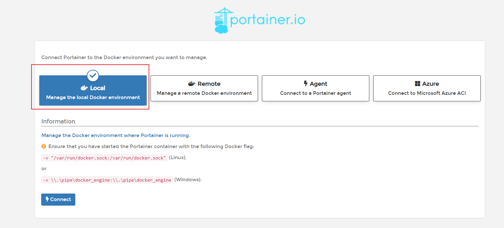
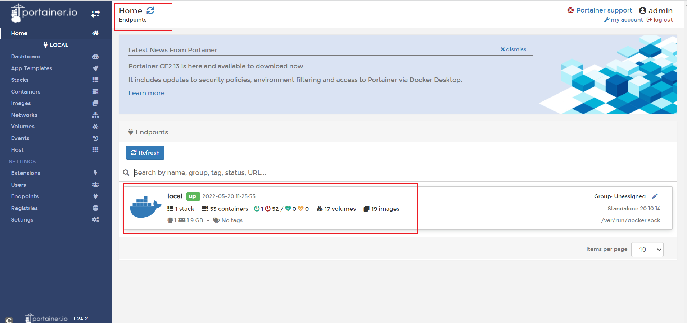
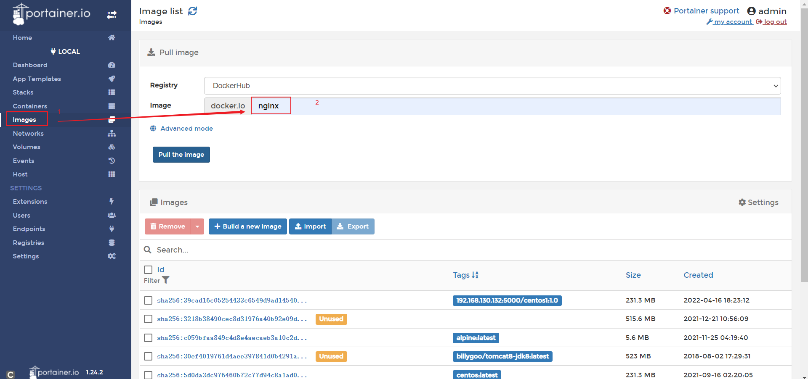

> Portainer 是一款轻量级的应用，它提供了图形化界面，用于方便地管理Docker环境，包括单机环境和集群环境。

官网地址：https://www.portainer.io/


### 1、安装

#### 1、docker命令安装

首次没有安装，系统会自己下载镜像并运行

```
docker run -d -p 8000:8000 -p 9000:9000 --name portainer     --restart=always     -v /var/run/docker.sock:/var/run/docker.sock     -v portainer_data:/data     portainer/portainer
```


#### 2、访问

第一次登录需创建admin，访问地址：xxx.xxx.xxx.xxx:9000，然后设置用户名和密码（**密码需8位**）登录




#### 3、图形化界面，一顿操作




#### 4、安装镜像示例`nginx`


