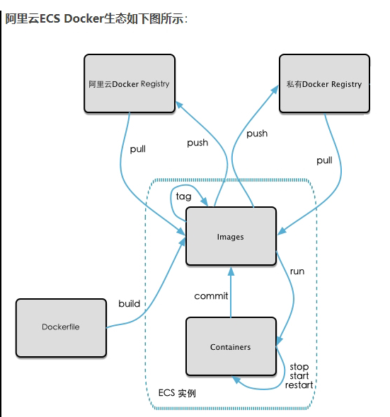

### 1、本地镜像发布到私有库流程



### 2、什么是`Docker Registry`

> 官方Docker Hub地址：https://hub.docker.com/，中国大陆访问太慢了且准备被阿里云取代的趋势，不太主流。
>
> Dockerhub、阿里云这样的公共镜像仓库可能不太方便，涉及机密的公司不可能提供镜像给公网，所以需要创建一个本地私人仓库供给团队使用，基于公司内部项目构建镜像。
>
> Docker Registry是官方提供的工具，可以用于构建私有镜像仓库


### 3、将本地镜像推送到私有库

#### 1、下载镜像Docker Registry

```
docker pull registry 
```

```
[root@docker ~]## docker pull registry
Using default tag: latest
latest: Pulling from library/registry
79e9f2f55bf5: Pull complete 
0d96da54f60b: Pull complete 
5b27040df4a2: Pull complete 
e2ead8259a04: Pull complete 
3790aef225b9: Pull complete 
Digest: sha256:169211e20e2f2d5d115674681eb79d21a217b296b43374b8e39f97fcf866b375
Status: Downloaded newer image for registry:latest
docker.io/library/registry:latest
[root@docker ~]## docker ../../images
REPOSITORY                                                   TAG       IMAGE ID       CREATED        SIZE
centos1                                                      1.0       08f93c122271   5 days ago     298MB
registry.cn-hangzhou.aliyuncs.com/xiaobear/xiaobear-dcoker   1.0       12e7a58fc36a   5 days ago     231MB
redis                                                        latest    7614ae9453d1   3 months ago   113MB
registry                                                     latest    b8604a3fe854   5 months ago   26.2MB
hello-world                                                  latest    feb5d9fea6a5   6 months ago   13.3kB
centos                                                       latest    5d0da3dc9764   7 months ago   231MB
[root@docker ~]## 
```


#### 2、运行私有库Registry，相当于本地有个私有Docker hub

默认情况，仓库被创建在容器的/var/lib/registry目录下，建议自行用容器卷映射，方便于宿主机联调

```
docker run -d -p 5000:5000  -v /zzyyuse/myregistry/:/tmp/registry --privileged=true registry
```

`-p`：指定端口

`-P`：随机端口

#### 3、案例演示创建一个新镜像，centos安装ifconfig命令

##### 1、从Hub上下载ubuntu镜像到本地并成功运行

```
docker pull centos
docker run -it centos /bin/bash
[root@docker ~]## docker run -it centos /bin/bash
[root@76d96b17087a /]## ifconfig
bash: ifconfig: command not found
```


##### 2、外网连通，安装redis

```
yum install -y redis
```


##### 3、安装完成，提交镜像

> docker commit -m="提交的描述信息" -a="作者" 容器ID 要创建的目标镜像名:[标签名]
> 命令：在容器外执行，记得

```
docker commit -m="add test" -a="xiaobear" 846cde73b2fd centos1:1.0
```


#### 4、验证私服上镜像

```
curl -XGET http://[ip]:5000/v2/_catalog
```

```
[root@docker ~]## docker ps
CONTAINER ID   IMAGE      COMMAND                  CREATED          STATUS         PORTS                                       NAMES
a35006a5eb6e   registry   "/entrypoint.sh /etc…"   13 seconds ago   Up 7 seconds   0.0.0.0:5000->5000/tcp, :::5000->5000/tcp   tender_buck
846cde73b2fd   centos     "/bin/bash"              7 minutes ago    Up 7 minutes                                               stupefied_wescoff
[root@docker ~]##  curl -XGET http://192.168.130.132:5000/v2/_catalog
{"repositories":[]}
[root@docker ~]## 
```


#### 5、将新镜像centos1:1.0修改符合私服规范的Tag

> 公式： docker   tag   镜像:Tag   Host:Port/Repository:Tag

```
[root@docker ~]## docker tag centos1:1.0  192.168.130.132:5000/centos1:1.0
[root@docker ~]## docker ../../images
REPOSITORY                                                   TAG       IMAGE ID       CREATED          SIZE
192.168.130.132:5000/centos1                                 1.0       39cad16c0525   32 minutes ago   231MB
centos1                                                      1.0       39cad16c0525   32 minutes ago   231MB
registry.cn-hangzhou.aliyuncs.com/xiaobear/xiaobear-dcoker   1.0       12e7a58fc36a   6 days ago       231MB
redis                                                        latest    7614ae9453d1   3 months ago     113MB
registry                                                     latest    b8604a3fe854   5 months ago     26.2MB
hello-world                                                  latest    feb5d9fea6a5   6 months ago     13.3kB
centos                                                       latest    5d0da3dc9764   7 months ago     231MB
[root@docker ~]## 
```


#### 6、修改配置文件，支持http

> docker默认不允许http方式推送镜像，通过配置选项来取消这个限制。

##### 1、查看配置文件

```
cat /etc/docker/daemon.json
```

##### 2、修改配置文件

```
vim /etc/docker/daemon.json
```

```
{
  "registry-mirrors": ["https://cmquykjm.mirror.aliyuncs.com"],
  "insecure-registries": ["192.168.140.132:5000"]
}
```

["ip:端口"]:

- ip：自己启动服务器的ip
- 端口：映射的端口


##### 3、修改之后查看配置并重新启动

PS：重新启动端口之后，需启动私有仓库


#### 7、push到私有仓库

```
[root@docker ~]## docker ps
CONTAINER ID   IMAGE      COMMAND                  CREATED         STATUS         PORTS                                       NAMES
e36d4066ba00   registry   "/entrypoint.sh /etc…"   5 seconds ago   Up 5 seconds   0.0.0.0:5000->5000/tcp, :::5000->5000/tcp   ecstatic_goldstine
[root@docker ~]## docker push 192.168.130.132:5000/centos1:1.0
The push refers to repository [192.168.130.132:5000/centos1]
74ddd0ec08fa: Pushed 
1.0: digest: sha256:df7b98170728e2ae419520239adf7862c15a246a58115ba91ee5ac10dfb7fdb0 size: 529
[root@docker ~]## 
```


#### 8、验证私服镜像

```
curl -XGET http://192.168.130.132:5000/v2/_catalog
```

```
[root@docker ~]## curl -XGET http://192.168.130.132:5000/v2/_catalog
{"repositories":["centos1"]}
[root@docker ~]## 
```


#### 9、pull到本地并运行

```
[root@docker ~]## docker pull 192.168.130.132:5000/centos1:1.0
1.0: Pulling from centos1
a1d0c7532777: Already exists 
Digest: sha256:df7b98170728e2ae419520239adf7862c15a246a58115ba91ee5ac10dfb7fdb0
Status: Downloaded newer image for 192.168.130.132:5000/centos1:1.0
192.168.130.132:5000/centos1:1.0
[root@docker ~]## 
```
