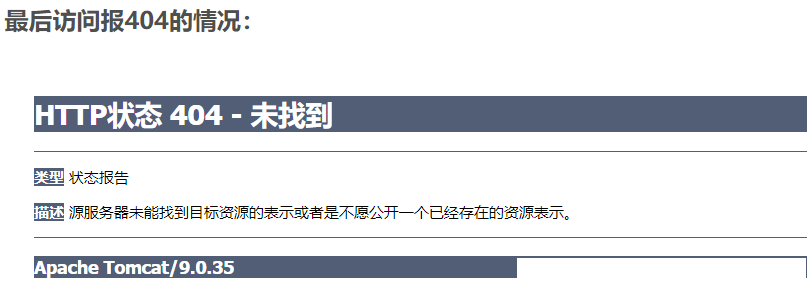
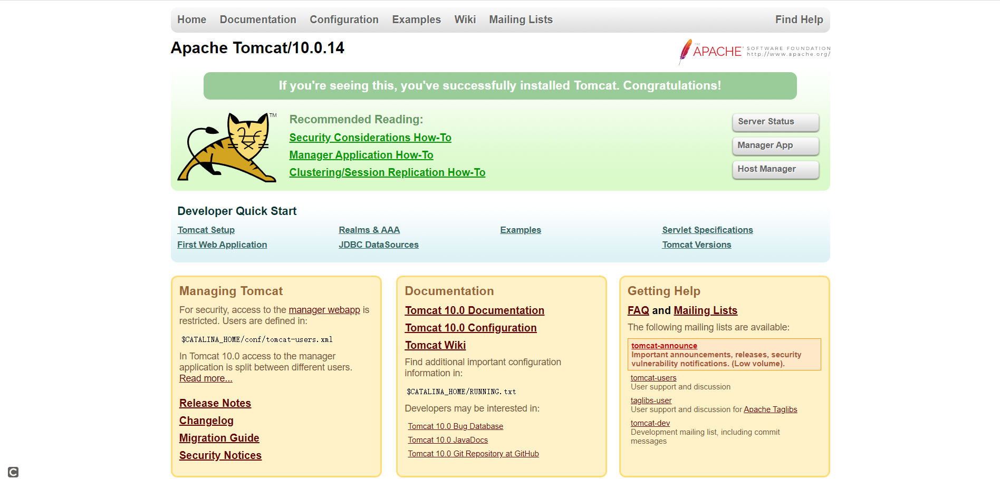

步骤：

1. 搜索镜像
2. 拉取镜像
3. 查看镜像
4. 启动镜像
5. 停止容器
6. 移除容器


### 1、安装tomcat

#### 1、搜索镜像

```
docker search tomcat
```


#### 2、拉取镜像

```
docker pull tomcat
```


#### 3、查看镜像

```
docker ../../images
```


#### 4、创建容器示例

```
docker run -it -p 8080:8080 tomcat
```

- -p 小写，主机端口:docker容器端口
- -P 大写，随机分配端口
- i:交互
- t:终端
- d:后台

PS：宿主机8080映射到容器内的8080端口


##### 测试

访问http://[ip]:8080/




##### 解决

1. 可能没有映射端口或者没有关闭防火墙

2. 查看tomcat文件，把webapps.dist目录换成webapps

    1. 先后台启动tomcat

       ```
       docker run -d -p 8080:8080 tomcat
       ```

    2. 进入容器内部

       ```
       docker exec -it tomcat /bin/bash
       ```

    3. 查看文件目录，webapps.dist目录换成webapps

       ```
       root@90c2f8c553b0:/usr/local/tomcat## ls
       BUILDING.txt	 LICENSE  README.md	 RUNNING.txt  conf  logs	    temp     webapps.dist
       CONTRIBUTING.md  NOTICE   RELEASE-NOTES  bin	      lib   native-jni-lib  webapps  work
       root@90c2f8c553b0:/usr/local/tomcat## rm -f webapps
       rm: cannot remove 'webapps': Is a directory
       root@90c2f8c553b0:/usr/local/tomcat## rm -r webapps
       root@90c2f8c553b0:/usr/local/tomcat## mv webapps.dist webapps
       root@90c2f8c553b0:/usr/local/tomcat## ls
       BUILDING.txt	 LICENSE  README.md	 RUNNING.txt  conf  logs	    temp     work
       CONTRIBUTING.md  NOTICE   RELEASE-NOTES  bin	      lib   native-jni-lib  webapps
       root@90c2f8c553b0:/usr/local/tomcat## 
       ```

    4. 重新访问：http://[ip]:8080/

       


#### 5、免修改版

##### 拉取镜像

```
docker pull billygoo/tomcat8-jdk8
```


##### 创建容器

```
docker run -d -p 8080:8080 --name mytomcat8 billygoo/tomcat8-jdk8
```


### 2、安装MySQL

#### 1、搜索镜像

```
docker search mysql
```


#### 2、拉取指定版本镜像

```
docker pull mysql:5.7
```


#### 3、创建容器

查看镜像省略

```text
docker run -itd --name mysql -p 3306:3306 -e MYSQL_ROOT_PASSWORD=123456 mysql:5.7
```

- **-p 3306:3306** ：映射容器服务的 3306 端口到宿主机的 3306 端口，外部主机可以直接通过 **宿主机ip:3306** 访问到 MySQL 的服务。
- **MYSQL_ROOT_PASSWORD=123456**：设置 MySQL 服务 root 用户的密码。


#### 4、使用

##### 1、简单版

###### 1、使用MySQL镜像

```
docker exec -it a6b1fc904bad /bin/bash
```

```
[root@docker myHostData]## docker exec -it a6b1fc904bad /bin/bash
root@a6b1fc904bad:/## mysql -u root -p
Enter password: 
Welcome to the MySQL monitor.  Commands end with ; or \g.
Your MySQL connection id is 2
Server version: 5.7.36 MySQL Community Server (GPL)

Copyright (c) 2000, 2021, Oracle and/or its affiliates.

Oracle is a registered trademark of Oracle Corporation and/or its
affiliates. Other names may be trademarks of their respective
owners.

Type 'help;' or '\h' for help. Type '\c' to clear the current input statement.

mysql> 
```


###### 2、建库建表

```
mysql> create database db1;
Query OK, 1 row affected (0.01 sec)

mysql> show databases;
+--------------------+
| Database           |
+--------------------+
| information_schema |
| db1                |
| mysql              |
| performance_schema |
| sys                |
+--------------------+
5 rows in set (0.00 sec)

mysql> use db1;
Database changed
mysql> create table test01(id int, name varchar(20));
Query OK, 0 rows affected (0.05 sec)

mysql> insert into test01 values(1, 'xiaobear');
Query OK, 1 row affected (0.45 sec)

mysql> select * from test01;
+------+----------+
| id   | name     |
+------+----------+
|    1 | xiaobear |
+------+----------+
1 row in set (0.00 sec)

mysql> 
```


###### 3、远程连接docker中的MySQL


###### 4、插入中文数据


**原因：**docker上默认字符集编码隐患

```
mysql> show variables like 'character%';
+--------------------------+----------------------------+
| Variable_name            | Value                      |
+--------------------------+----------------------------+
| character_set_client     | latin1                     |
| character_set_connection | latin1                     |
| character_set_database   | latin1                     |
| character_set_filesystem | binary                     |
| character_set_results    | latin1                     |
| character_set_server     | latin1                     |
| character_set_system     | utf8                       |
| character_sets_dir       | /usr/share/mysql/charsets/ |
+--------------------------+----------------------------+
8 rows in set (0.01 sec)

mysql> 
```


##### 2、实战版

###### 1、创建容器

```
docker run -d -p 3306:3306 --privileged=true -v /xiaobear/mysql/log:/var/log/mysql -v /xiaobear/mysql/data:/var/lib/mysql -v /xiaobear/mysql/conf:/etc/mysql/conf.d -e MYSQL_ROOT_PASSWORD=123456  --name mysql mysql:5.7
```


###### 2、创建配置文件

```
[root@docker ~]## docker run -d -p 3306:3306 --privileged=true -v /xiaobear/mysql/log:/var/log/mysql -v /xiaobear/mysql/data:/var/lib/mysql -v /xiaobear/mysql/conf:/etc/mysql/conf.d -e MYSQL_ROOT_PASSWORD=123456  --name mysql mysql:5.7
9b08a40ccc0668416dbe8abc744cf2878940203f0e4fa3cb3a46c0179ac2244b
[root@docker ~]## docker ps
CONTAINER ID   IMAGE       COMMAND                  CREATED         STATUS         PORTS                                                  NAMES
9b08a40ccc06   mysql:5.7   "docker-entrypoint.s…"   7 seconds ago   Up 7 seconds   0.0.0.0:3306->3306/tcp, :::3306->3306/tcp, 33060/tcp   mysql
[root@docker ~]## cd /xiaobear/mysql/conf/
[root@docker conf]## ls
[root@docker conf]## vim my.cnf
[root@docker conf]## 
```


配置文件内容

```ini
[client]
default-character-set=utf8

[mysql]
default-character-set=utf8

[mysqld]
init_connect='SET collation_connection = utf8_unicode_ci'
init_connect='SET NAMES utf8'
character-set-server=utf8
collation-server=utf8_unicode_ci
skip-character-set-client-handshake
skip-name-resolve
```


###### 3、重新启动查看编码

```
docker restart mysql
docker exec -it mysql /bin/bash
mysql -u root -p

#show variables like 'character%';
```


###### 4、中文测试


###### 5、总结

> docker安装完MySQL并run出容器后，建议请先修改完字符集编码后再新建mysql库-表-插数据


### 3、安装redis

#### 1、拉取镜像

```
docker pull redis
```


#### 2、创建容器

```
docker run -d -p 6739:6739 redis
```


#### 3、进入容器

```
docker exec -it 3f85f4351992 /bin/bash
```


#### 4、在宿主机创建目录

```
mkdir -p /app/redis/
```


#### 5、复制一份redis.conf到该目录下,修改

/app/redis目录下修改redis.conf文件
3.1 开启redis验证    可选
requirepass 123

3.2 允许redis外地连接  必须
注释掉 ## bind 127.0.0.1


3.3   daemonize no
将daemonize yes注释起来或者 daemonize no设置，因为该配置和docker run中-d参数冲突，会导致容器一直启动失败


3.4 开启redis数据持久化  appendonly yes  可选


#### 6、使用redis镜像创建容器(也叫运行镜像)

```
docker run  -p 6379:6379 --name myredis --privileged=true -v /app/redis/redis.conf:/etc/redis/redis.conf -v /app/redis/data:/data -d redis redis-server /etc/redis/redis.conf
```

```
[root@docker redis]## docker run  -p 6379:6379 --name myredis --privileged=true -v /app/redis/redis.conf:/etc/redis/redis.conf -v /app/redis/data:/data -d redis redis-server /etc/redis/redis.conf
50c5ce6ccb609cb8d4e3da1d40f51e5148c57b44f821ab55483ffe1aae689a31
[root@docker redis]## docker ps
CONTAINER ID   IMAGE       COMMAND                  CREATED         STATUS         PORTS                                                  NAMES
50c5ce6ccb60   redis       "docker-entrypoint.s…"   8 seconds ago   Up 6 seconds   0.0.0.0:6379->6379/tcp, :::6379->6379/tcp              myredis
9b08a40ccc06   mysql:5.7   "docker-entrypoint.s…"   2 days ago      Up 2 days      0.0.0.0:3306->3306/tcp, :::3306->3306/tcp, 33060/tcp   mysql
[root@docker redis]## 
```


#### 7、测试连接

```
[root@docker redis]## docker exec -it myredis /bin/bash
root@50c5ce6ccb60:/data## redis-cli
127.0.0.1:6379> set k hello
OK
127.0.0.1:6379> get k
"hello"
127.0.0.1:6379> 
```

docker exec -it 运行着Rediis服务的容器ID redis-cli
