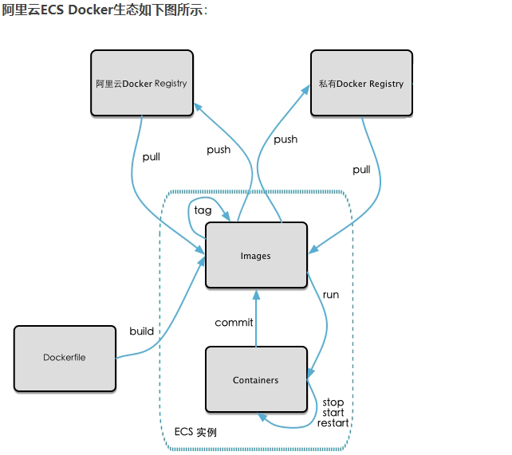

### 1、镜像的生成方法

> - 基于当前容器创建一个新的镜像，新功能增强
    >
    >   ```
    >   docker commit [OPTIONS] 容器ID [REPOSITORY[:TAG]]
    >   ```
>
> - DockerFile


### 2、本地推送到阿里云

#### 1、阿里云开发者平台

https://promotion.aliyun.com/ntms/act/kubernetes.html

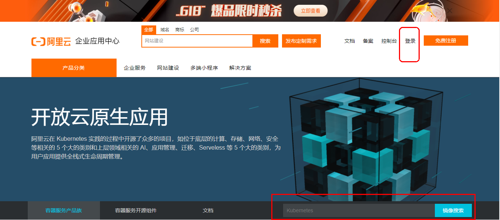


#### 2、创建仓库镜像

##### 1、选择控制台，进入容器镜像服务

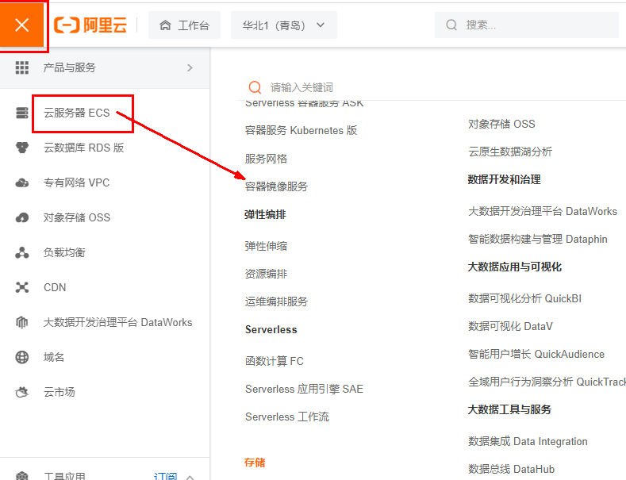


##### 2、选择个人实例


##### 3、命名空间

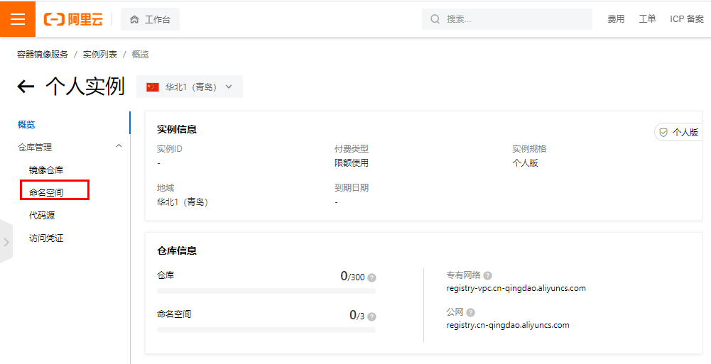


创建命名空间

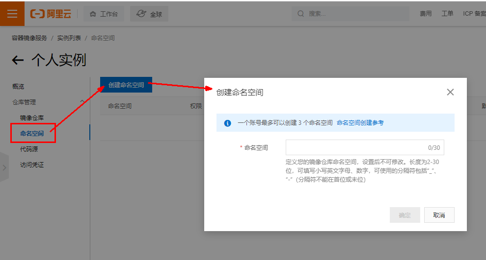


##### 4、仓库名称

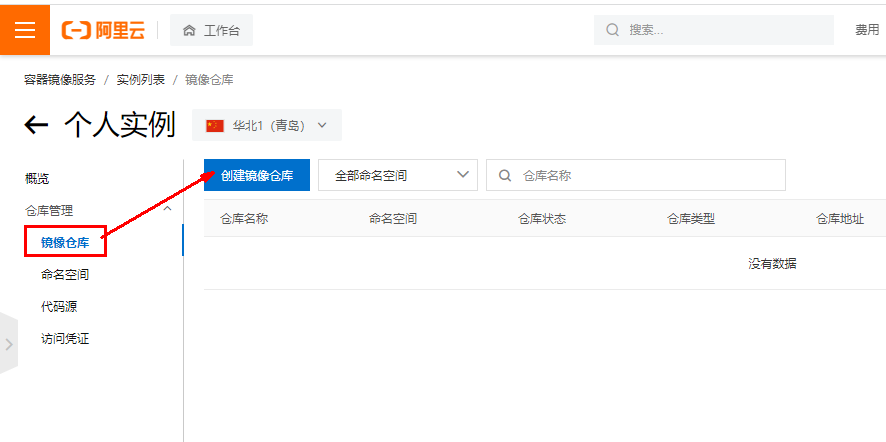

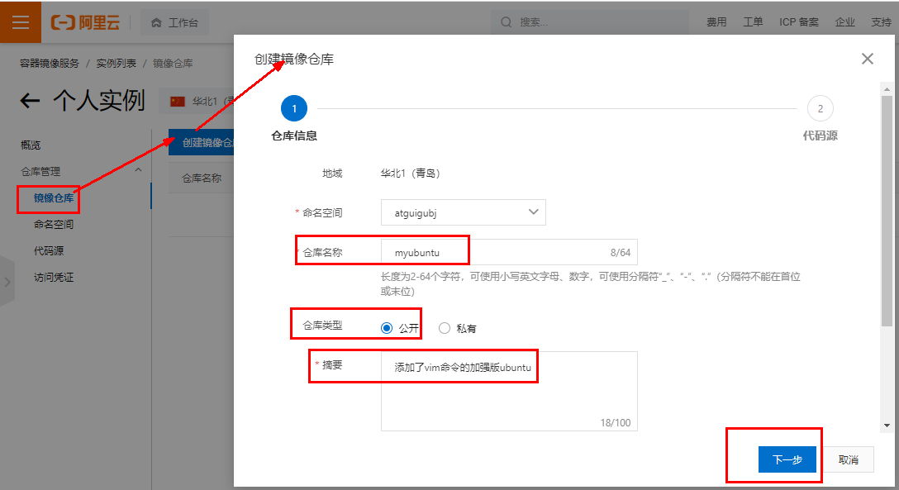

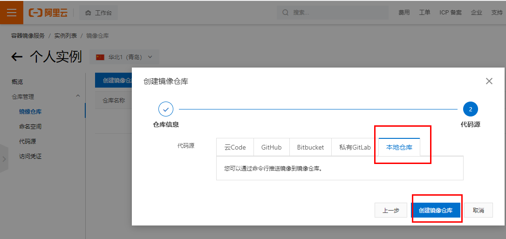


##### 5、进入管理界面获得脚本

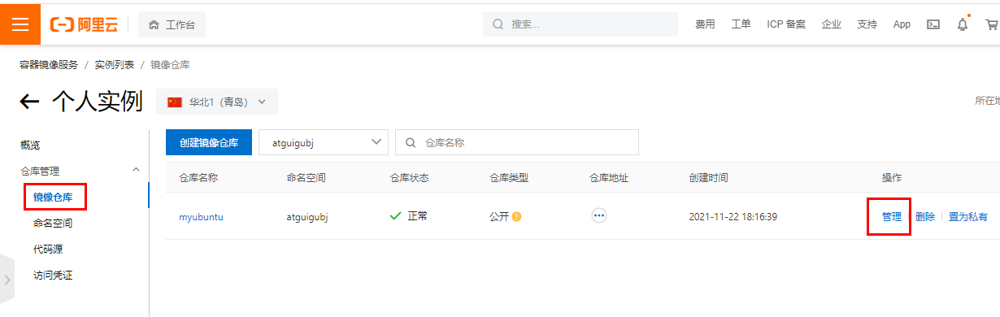


#### 3、将镜像推送到阿里云

将镜像推送到阿里云registry

- 管理界面脚本

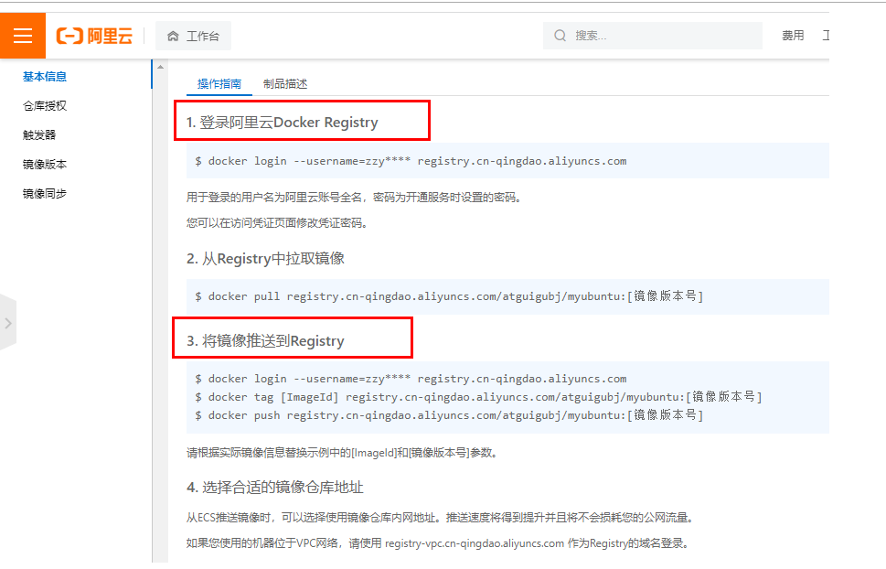


```
将镜像推送到Registry
$ docker login --username=[阿里云账号] registry.cn-hangzhou.aliyuncs.com
$ docker tag [ImageId] registry.cn-hangzhou.aliyuncs.com/xiaobear/xiaobear-dcoker:[镜像版本号]
$ docker push registry.cn-hangzhou.aliyuncs.com/xiaobear/xiaobear-dcoker:[镜像版本号]
```

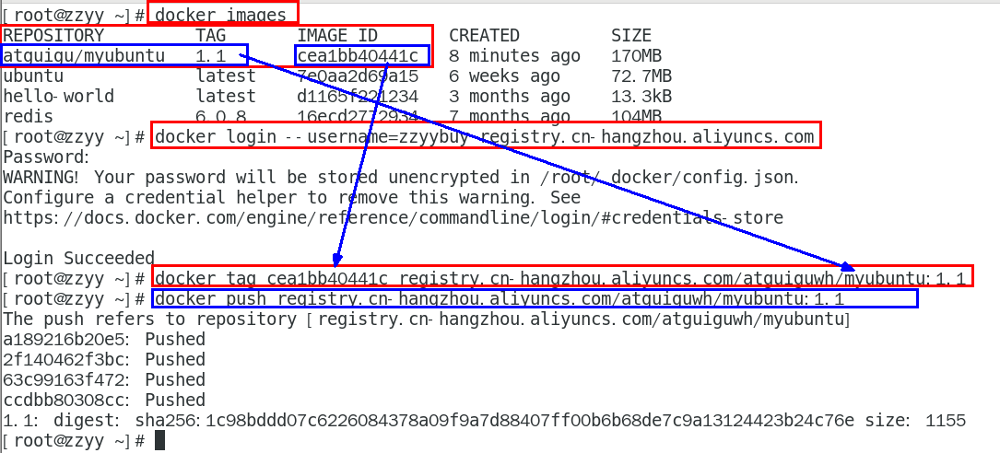


### 3、将阿里云上的镜像下载到本地

#### 从Registry中拉取镜像

```
 docker pull registry.cn-hangzhou.aliyuncs.com/xiaobear/xiaobear-dcoker:[镜像版本号]
```
