### 1、Elasticsearch 安装

#### 1、下载

Elasticsearch 的官方地址： [https://www.elastic.co/cn/]( https://www.elastic.co/cn/)

下载地址：https://www.elastic.co/cn/downloads/past-releases#elasticsearch

Elasticsearch 分为 Linux 和 WindowWindows版本，基于我们主要学习的是 ElasticElasticsearch 的 Java客户端的使用，所以 课程 中使用的是安装较为简便的 WindowWindows版本 。

#### 2、安装

Windows版的 ElasticElasticsearch 的安装很简单，解压即安装完毕，解压后的 ElasticElasticsearch 的 目录结构如下

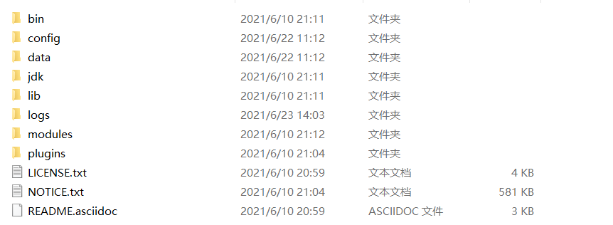

| 目录    | 含义           |
| ------- | -------------- |
| bin     | 可执行脚本目录 |
| config  | 配置目录       |
| jdk     | 内置JDK 目录   |
| lib     | 类库           |
| logs    | 日志目录       |
| modules | 模块目录       |
| plugins | 插件目录       |

解压后，进入bin 文件目录，点击 **elasticsearch.bat** 文件启动 ES 服务

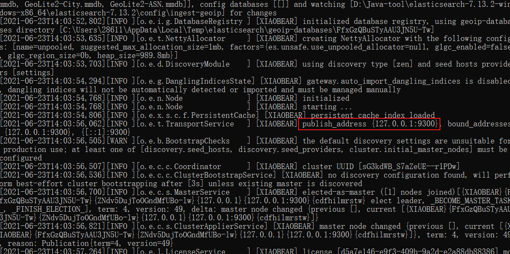

**注意：**

- `9300` 端口为 Elastic s earch 集群间组件的通信端口，

- `9200` 端口为浏览器访问的 http协议 RESTful 端口。

打开浏览器（推荐使用谷歌浏览器），输入地址：http://localhost:9200 ，测试结果

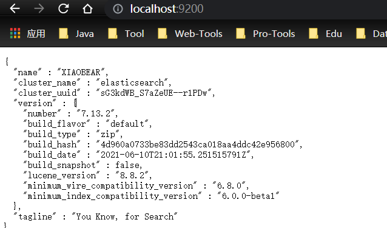


#### 3、问题解决

- ElasticSearch 是使用 java 开发的，且 7.13.2版本的 ES 需要 JDK 版本 1.8 以上，默认安装包带有 jdk 环境，如果系统配置 JAVA_HOME ，那么使用系统默认的 JDK ，如果没有配置使用自带的 JDK ，一般建议使用系统配置的 JDK 。

- 双击启动窗口闪退，通过路径访问追踪错误，如果是“空间不足”，请修改config/jvm.options 配置文件

  > 设置 JVM 初始内存为 1G 。此值可以设置与 Xmx 相同，以避免每次垃圾回收完成后 JVM 重新分配内存
  >
  > Xms represents the initial size of total heap space
  >
  > 设置 JVM 最大可用内存为 1G
  >
  > Xmx represents the maximum size of total heap space
  >
  > Xms1g
  > Xmx1g


### 2、基本操作

#### 1、RESTful

​		REST指的是一组架构约束条件和原则。满足这些约束条件和原则的应用程序或设计就是 RESTful 。 Web 应用程序最重要的 REST 原则是，客户端和服务器之间的交互在请求之间是无状态的。从客户端到服务器的每个请求都必须包含理解请求所必需的信息。如果服务器在请求之间的任何时间点重启，客户端不会得到通知。此外，无状态请求可以由任何可用服务器回答，这十分适合云计算之类的环境。客户端可以缓存数据以改进性能。

​		在服务器端，应用程序状态和功能可以分为各种资源。资源是一个有趣的概念实体，它向客户端公开。资源的例子有：应用程序对象、数据库记录、算法等等。每个资源都使用 URI(Universal Resource Identifier) 得到一个唯一的地址。所有资源都共享统一的接口，以便在客户端和服务器之间传输状态。使用的是标准的 HTTP 方法，比如 GET 、 PUT 、 POST 和DELETE 。

​		在REST 样式的 Web 服务中，每个资源都有一个地址。资源本身都是方法调用的目标，方法列表对所有资源都是一样的。这些方法都是标准方法，包括 HTTP GET 、 POST 、PUT 、 DELETE ，还可能包括 HEAD 和 OPTIONS 。简单的理解就是，如果想要访问互联网上的资源，就必须向资源所在的服务器发出请求，请求体中必须包含资源的网络路径， 以及对资源进行的操作 增删改查 。

#### 2、Postman安装

​		如果直接通过浏览器向Elasticsearch 服务器发请求，那么需要在发送的请求中包含HTTP 标准的方法，而 HTTP 的大部分特性且仅支持 GET 和 POST 方法。所以为了能方便地进行客户端的访问，可以使用 Postman 软件
​		Postman是一款强大 的 网页调试工具，提供功能强大的 Web API 和 HTTP 请求调试。软件功能强大，界面简洁明晰、操作方便快捷，设计得很人性化。 Postman 中文版能够发送任何类型的 HTTP 请求 (GET, POST, PUT..) PUT..)，不仅能够表单提交，且可以附带任意类型请求体。

Postman官网： https://www.getpostman.com
Postman下载 https://www.getpostman.com/apps

#### 3、数据格式

Elasticsearch是面向文档型数据库，一条数据在这里就是一个文档。 为了方便大家理解，我们将 Elastic s earch 里 存储 文档 数据和关系型数据库 MySQL 存储数据的概念进行一个类比

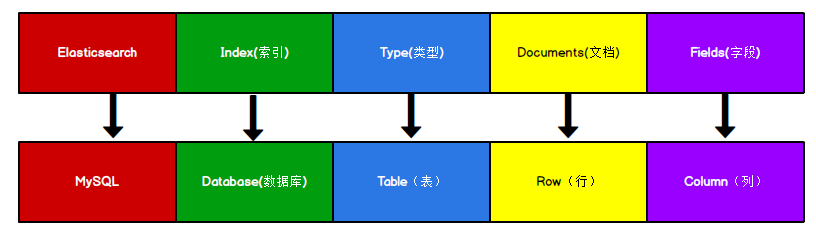

ES里的 Index 可以看做一个库，而 Types 相当于表， Documents 则相当于表的行。这里Types 的概念已经被逐渐弱化， Elasticsearch 6.X 中，一个 index 下已经只能包含一个type Elasticsearch 7.X 中 , Type 的概念已经被删除了。

#### 4、HTTP操作

##### 1、索引操作

###### 1、创建索引

> 对比关系型数据库，创建索引就等同于创建数据库

在Postman 中，向 ES 服务器发 **PUT** 请求 http://127.0.0.1:9200/start


请求后，服务器返回响应

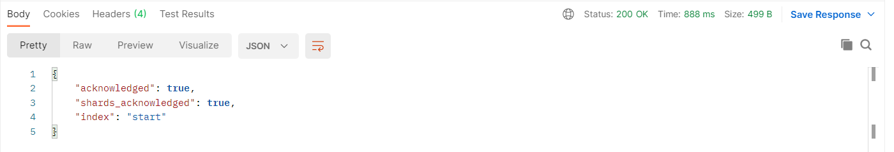

```
" 【响应结果】 : true, ## true 操作成功
"shards_ 【分片结果】 : true, ## 分片操作成功
" 【索引名称】 : "
## 注意：创建索引库的分片数默认 1 片，在 7.0.0 之前的 Elasticsearch 版本中，默认 5 片
```

如果重复添加索引，会返回错误信息

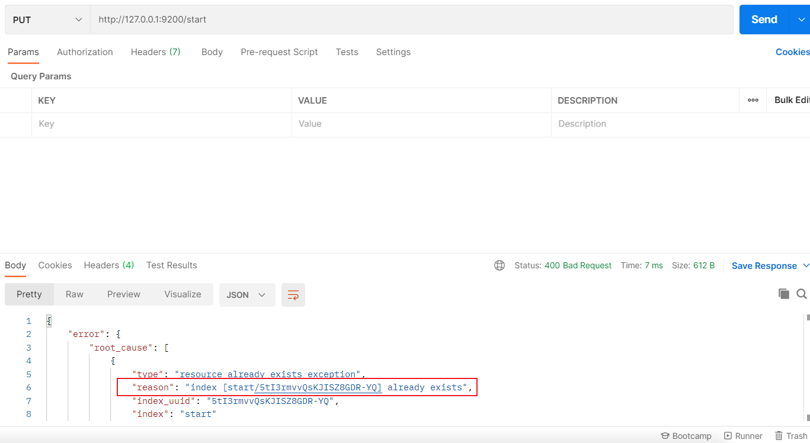

###### 2、查看索引

在Postman 中，向 ES 服务器发 **GET** 请求 http://127.0.0.1:9200/_cat/indices?v

这里请求路径中的**_cat 表示查看的意思**， **indices 表示索引**，所以整体含义就是查看当前 ES服务器中的所有索引，就好像 MySQL 中的 show tables 的感觉，服务器响应结果如下

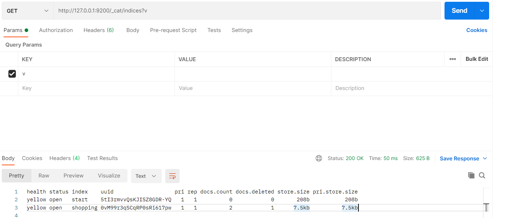

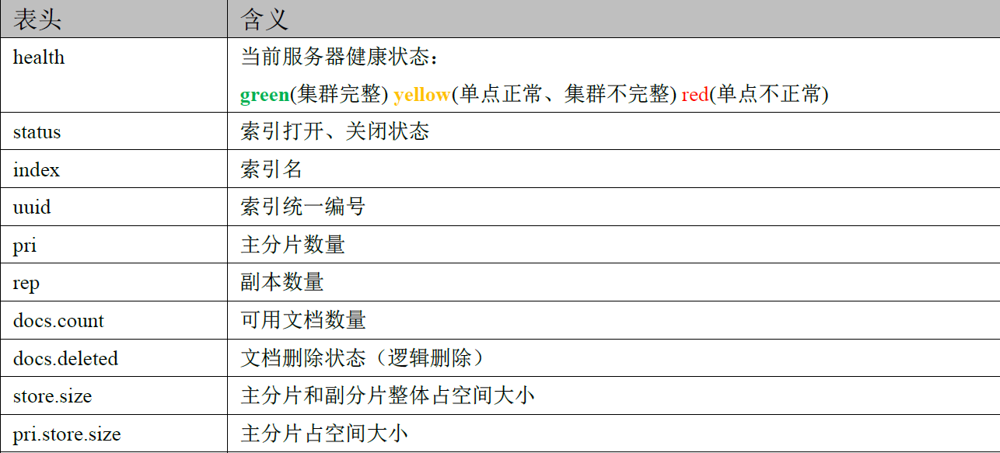

###### 3、查看单个索引

在Postman 中，向 ES 服务器发 **GET** 请求 http://127.0.0.1:9200/start


查看索引向ES 服务器发送的请求路径和创建索引是一致的。但是 HTTP 方法不一致。这里可以体会一下 RESTful 的意义，请求后，服务器响应结果如下：

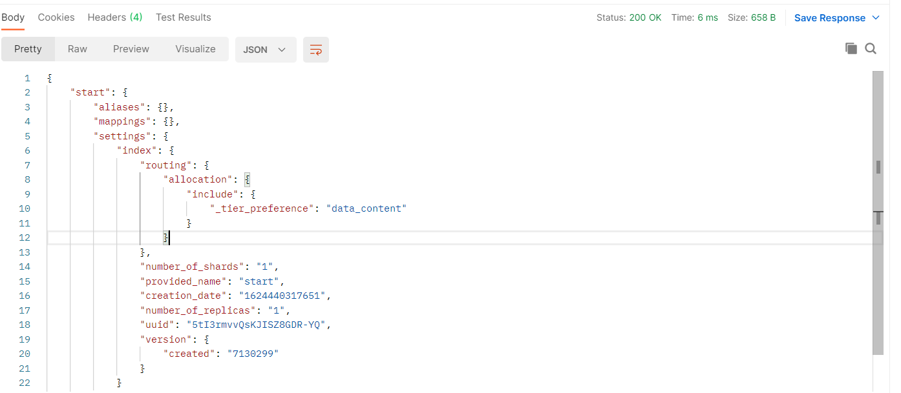

```json
{
    "start"【索引名】: {
        "aliases"【别名】: {},
        "mappings"【映射】: {},
        "settings"【设置】: {
            "index"【设置-索引】: {
                "routing": {
                    "allocation": {
                        "include": {
                            "_tier_preference": "data_content"
                        }
                    }
                },
                "number_of_shards"【设置-索引-主分片数量】: "1",
                "provided_name"【名称】: "start",
                "creation_date"【创建时间】: "1624440317651",
                "number_of_replicas"【设置-索引-副分片数量】: "1",
                "uuid"【唯一标识】: "5tI3rmvvQsKJISZ8GDR-YQ",
                "version"【设置-索引-版本】: {
                    "created": "7130299"
                }
            }
        }
    }
}
```

###### 4、删除索引

在Postman 中，向 ES 服务器发 **DELETE** 请求 http://127.0.0.1:9200/start


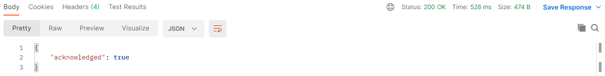

重新访问索引时，服务器返回响应：**索引不存在**

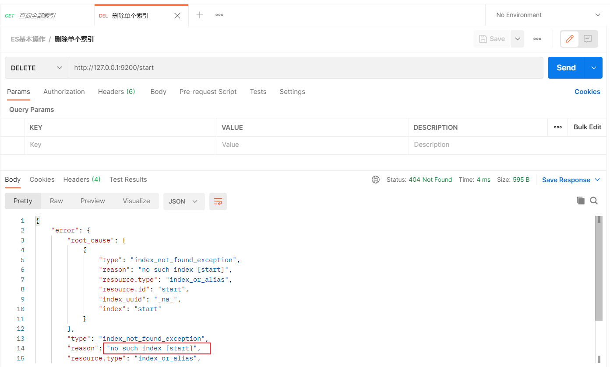

##### 2、文档操作

###### 1、创建文档

索引已经创建好了，接下来我们来创建文档，并添加数据。这里的文档可以类比为关系型数据库中的表数据，添加的数据格式为 JSON 格式

在Postman 中，向 ES 服务器发 POST 请求 http://127.0.0.1:9200/start/doc

此处发送请求的方式必须为**POST** ，不能是 PUT ，否则会发生错误

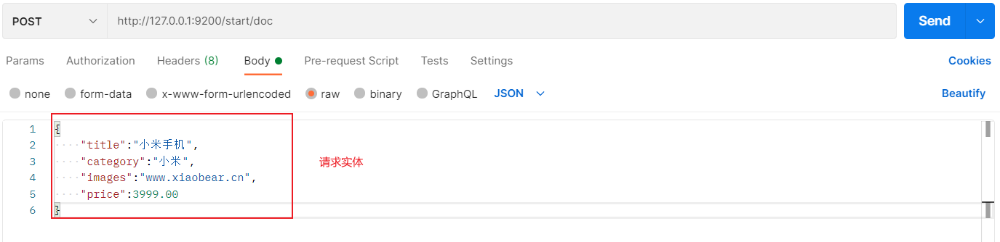

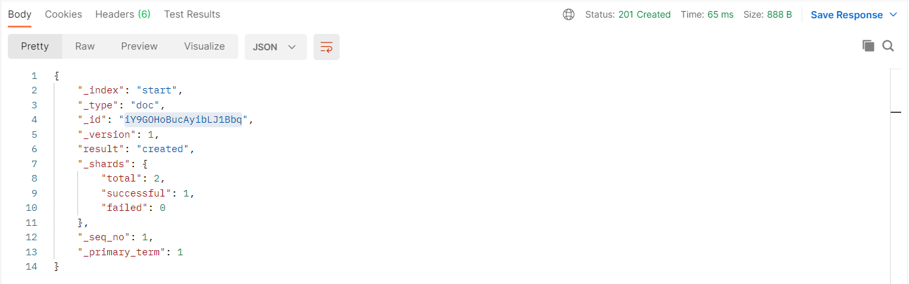

```json
{
    "_index"【索引】: "start",
    "_type"【类型-文档】: "doc",
    "_id"【唯一标识】: "iY9GOHoBucAyibLJ1Bbq",#可以类比为 MySQL 中的主键，随机生成
    "_version"【版本号】: 1,
    "result"【结果】: "created", #这里的 create 表示创建成功
    "_shards"【分片】: {
        "total"【分片-总数】: 2,
        "successful"【分片-成功】: 1,
        "failed"【分片-s】: 0
    },
    "_seq_no": 1,
    "_primary_term": 1
}
```

上面的数据创建后，由于没有指定数据唯一性标识（ID ），默认情况下 ES 服务器会随机生成一个 。

如果想要自定义唯一性标识，需要在创建时指定http://127.0.0.1:9200/start/doc/1 or http://127.0.0.1:9200/start/_doc/1

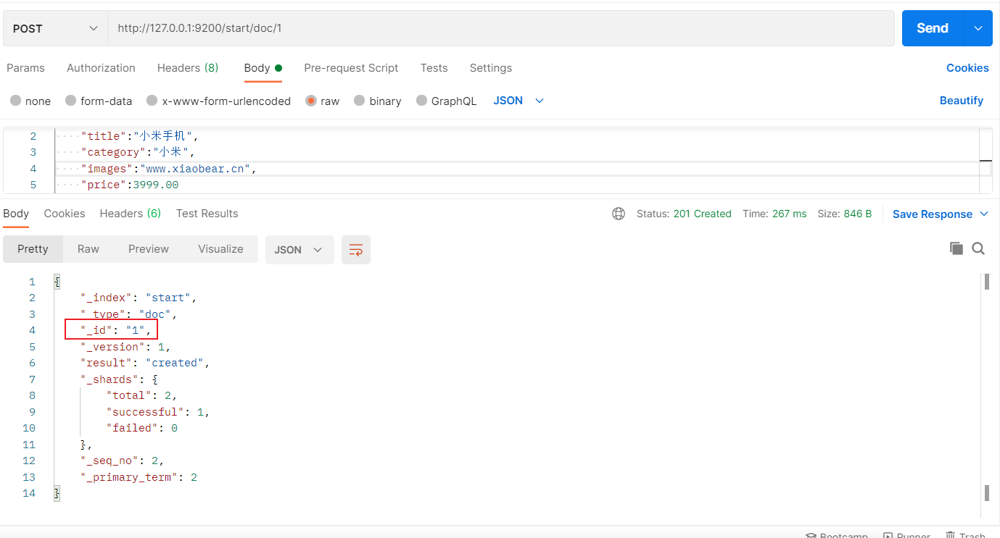

**此处需要注意：如果增加数据时明确数据主键，那么请求方式也可以为PUT**

###### 2、查看文档

查看文档时，需要指明文档的唯一性标识，类似于MySQL 中数据的主键查询

在Postman 中，向 ES 服务器发 GET 请求 http://127.0.0.1:9200/start/_doc/1


查询成功后，服务器响应结果：

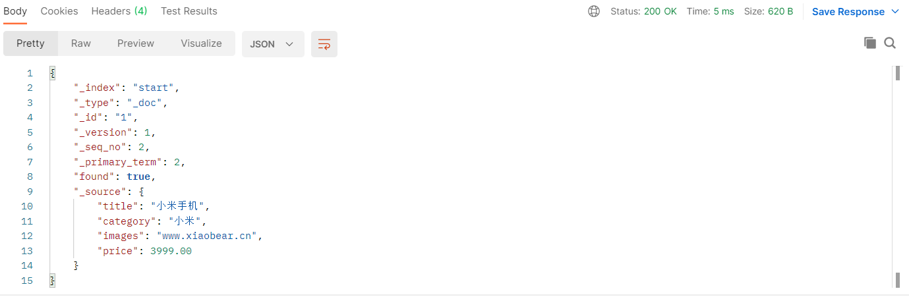

```json
{
    "_index"【索引】: "start",
    "_type"【文档类型】: "_doc",
    "_id": "1",
    "_version": 1,
    "_seq_no": 2,
    "_primary_term": 2,
    "found"【查询结果】: true,## true 表示查找到， false 表示未查找到
    "_source"【文档源信息】: {
        "title": "小米手机",
        "category": "小米",
        "images": "www.xiaobear.cn",
        "price": 3999.00
    }
}
```

###### 3、修改文档

和新增文档一样，输入相同的URL 地址请求，如果请求体变化，会将原有的数据内容覆盖
在Postman 中，向 ES 服 务器发 POST 请求 http://127.0.0.1:9200/start/_doc/1


请求体内容为:

```json
{
    "title":"华为手机",
    "category":"小米",
    "images":"www.xiaobear.cn",
    "price":4999.00
}
```

修改成功后，服务器响应结果：

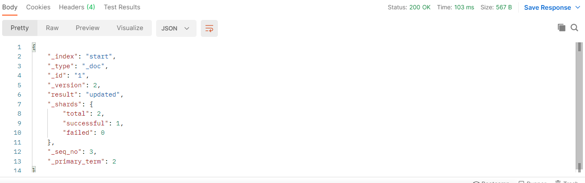

```json
{
    "_index": "start",
    "_type": "_doc",
    "_id": "1",
    "_version"【版本】: 2,
    "result"【结果】: "updated",## updated 表示数据被更新
    "_shards": {
        "total": 2,
        "successful": 1,
        "failed": 0
    },
    "_seq_no": 3,
    "_primary_term": 2
}
```

###### 4、修改字段

> 修改数据时，也可以只修改某一给条数据的局部信息

在Postman 中，向 ES 服务器发 POST 请求 http://127.0.0.1:9200/start/_update/1


请求体内容为：

```json
{
"doc": {
    "price":5000.00
    }
}
```

修改成功后，服务器响应结果：

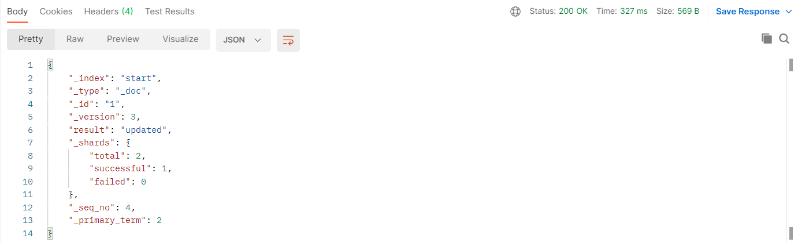

根据唯一性标识，查询文档数据，文档数据已经更新


###### 5、删除文档

删除一个文档不会立即从磁盘上移除，它只是被标记成已删除（逻辑删除）。

在Postman 中，向 ES 服务器发 DELETE 请求 http://127.0.0.1:9200/start/_doc/1


删除成功，服务器响应结果：

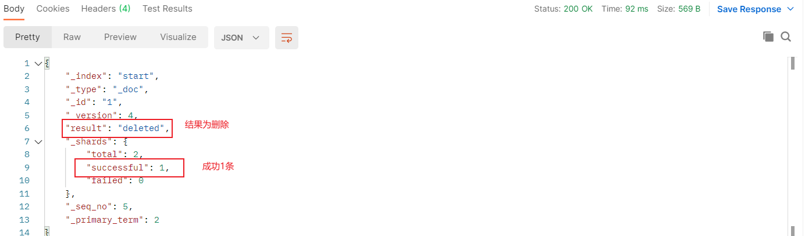

version：**对数据的操作，都会更新版本**

删除后再查询当前文档信息

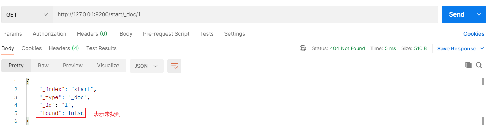

如果删除一个并不存在的文档

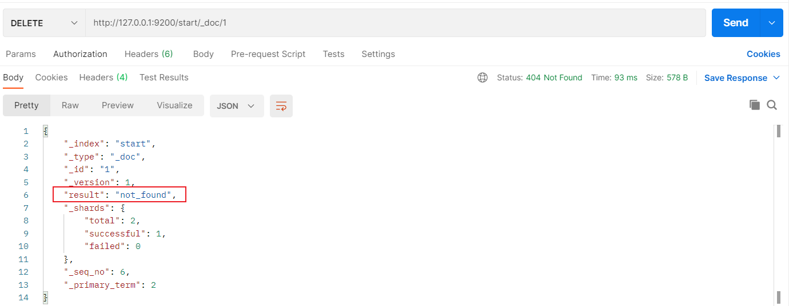

###### 6、条件删除文档

> 一般删除数据都是根据文档的唯一性标识进行删除，实际操作时，也可以根据条件对多条数据进行删除

首先分别增加多条数据：

```json
{
    "title":"小米手机",
    "category":"小米",
    "images":"www.xiaobear.cn",
    "price":3999.00
}
{
    "title":"华为手机",
    "category":"华为",
    "images":"www.xiaobear.cn",
    "price":3999.00
}
```

向ES 服务器发 POST 请求 http://127.0.0.1:9200/start/_delete_by_query

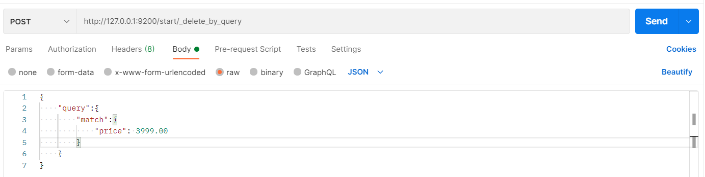

请求体内容为：

```json
{
    "query":{
        "match":{
            "price": 3999.00
        }
    }
}
```

删除成功后，服务器响应结果：

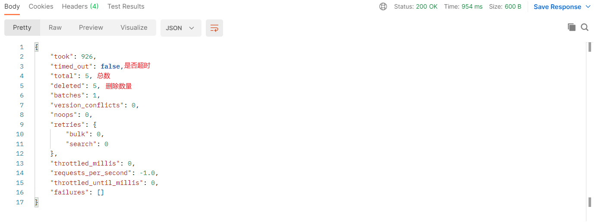

##### 3、映射操作

有了索引库，等于有了数据库中的database 。

> 接下来就需要建索引库(index)中的映射了，类似于数据库 (database)中的表结构 (table)。创建数据库表需要设置字段名称，类型，长度，约束等；索引库也一样，需要知道这个类型下有哪些字段，每个字段有哪些约束信息，这就叫做映射 (mapping)。

###### 1、创建映射

在Postman 中，向 ES 服务器发 PUT 请求http://127.0.0.1:9200/user/_mapping

请求内容为：

```json
{
    "properties":{
        "name":{
            "type": "text",
            "index": true
        },
        "sex":{
            "type": "keyword",
            "index": true
        },
        "phone":{
            "type": "keyword",
            "index": false
        }
    }
}
```

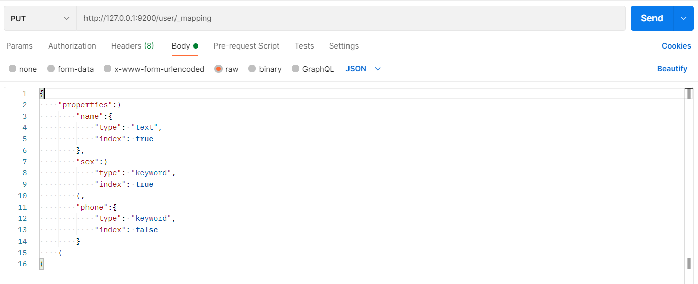

服务器的响应

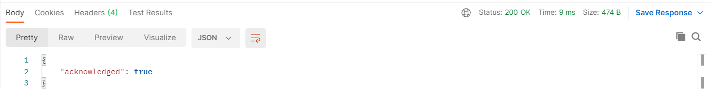


**映射数据说明**

> - 字段名：任意填写，下面指定许多属性，例如： title 、 subtitle 、 images 、 price
>
> - type ：类型 Elasticsearch 中支持的数据类型非常丰富，说几个关键的：
    >
    >   - String 类型，又分两种：
    >     - text：可分词
    >     - keyword：不可分词，数据会作为完整字段进行匹配
>   - Numerical ：数值类型，分两类
      >     - 基本数据类型：long 、 integer 、 short 、 byte 、 double 、 float 、 half_float
      >     - 浮点数的高精度类型：scaled_float
>   - Date ：日期类型
>   - Array ：数组类型
>   - Object ：对象
>
> - index ：是否索引，默认为 true ，也就是说你不进行任何配置，所有字段都会被索引。
    >
    >   - true：字段会被索引，则可以用来进行搜索
    >   - false：字段不会被索引，不能用来搜索
>
> - store ：是否将数据进行独立存储，默认为 false
    >
    >   原始的文本会存储在_source 里面，默认情况下其他提取出来的字段都不是独立存储的，是从 _source 里面提取出来的。当然你也可以独立的存储某个字段，只要设置"store": true 即可，获取独立存储的字段要比从 _source 中解析快得多，但是也会占用更多的空间，所以要根据实际业务需求来设置。
>
> - analyzer ：分词器，这里的 ik_max_word 即使用 ik 分词器


###### 2、查看映射

在Postman 中，向 ES 服务器发 GET 请求http://127.0.0.1:9200/user/_mapping


###### 3、索引映射关联

在Postman 中，向 ES 服务器发 PUT 请求 http://127.0.0.1:9200/user1

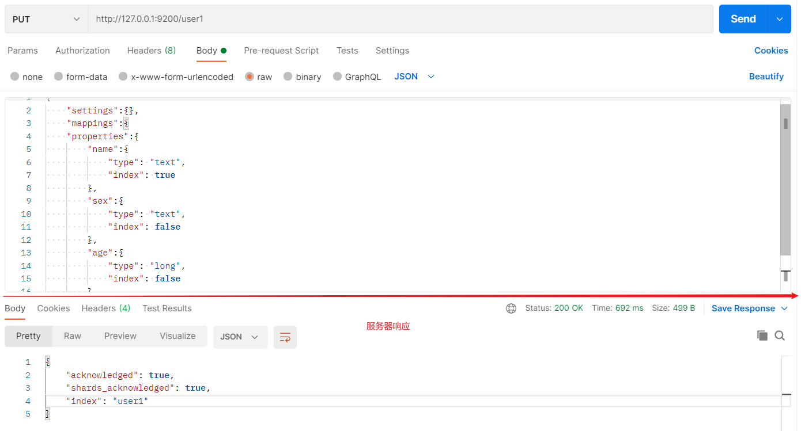
