### 1、环境准备

1. 创建maven项目

2. 导入相关依赖

   ```xml
       <dependencies>
           <dependency>
               <groupId>org.elasticsearch</groupId>
               <artifactId>elasticsearch</artifactId>
               <version>7.8.0</version>
           </dependency>
           <!--es的客户端-->
           <dependency>
               <groupId>org.elasticsearch.client</groupId>
               <artifactId>elasticsearch-rest-high-level-client</artifactId>
               <version>7.8.0</version>
           </dependency>
           <dependency>
               <groupId>org.apache.logging.log4j</groupId>
               <artifactId>log4j-core</artifactId>
               <version>2.14.1</version>
           </dependency>
           <dependency>
               <groupId>org.apache.logging.log4j</groupId>
               <artifactId>log4j-api</artifactId>
               <version>2.14.1</version>
           </dependency>
           <dependency>
               <groupId>com.fasterxml.jackson.core</groupId>
               <artifactId>jackson-databind</artifactId>
               <version>2.12.4</version>
           </dependency>
           <dependency>
               <groupId>junit</groupId>
               <artifactId>junit</artifactId>
               <version>4.13.1</version>
               <scope>test</scope>
           </dependency>
       </dependencies>
   ```

3. 创建测试

   ```java
   public class ElasticSearchTest {
   
       public static void main(String[] args) throws IOException {
           //9200 端口为 Elastic s earch 的 Web 通信端口 localhost 为启动 ES 服务的主机名
           RestHighLevelClient client = new RestHighLevelClient(
                   RestClient.builder(new HttpHost("localhost",9200)));
           client.close();
       }
   }
   ```

   没有任何输出或报错信息即是成功


### 2、索引操作

#### 1、创建索引

> ES服务器正常启动后，可以通过 Java API 客户端对象对 ES 索引进行操作

```java
public class ElasticsearchDocCreate {

    public static void main(String[] args) throws IOException {
        RestHighLevelClient client = new RestHighLevelClient(
                RestClient.builder(new HttpHost("localhost",9200)));
        //创建索引
        CreateIndexRequest request = new CreateIndexRequest("user");
        CreateIndexResponse response = client.indices().create(request, RequestOptions.DEFAULT);
        //创建索引的响应状态
        boolean acknowledged = response.isAcknowledged();
        System.out.println("响应状态为：" + acknowledged);
        client.close();
    }
}
```


输出结果

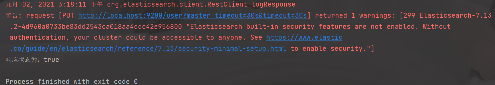


#### 2、查看索引

```java
public class ElasticsearchDocSearch {

    public static void main(String[] args) throws IOException {
        RestHighLevelClient client = new RestHighLevelClient(
                RestClient.builder(new HttpHost("localhost",9200)));
        //查询索引
        GetIndexRequest request = new GetIndexRequest("user");
        GetIndexResponse response = client.indices().get(request, RequestOptions.DEFAULT);
        //查询索引的响应状态
        System.out.println(response);
        System.out.println(response.getSettings());
        System.out.println(response.getAliases());
        System.out.println(response.getMappings());
        client.close();
    }
}
```

输出结果

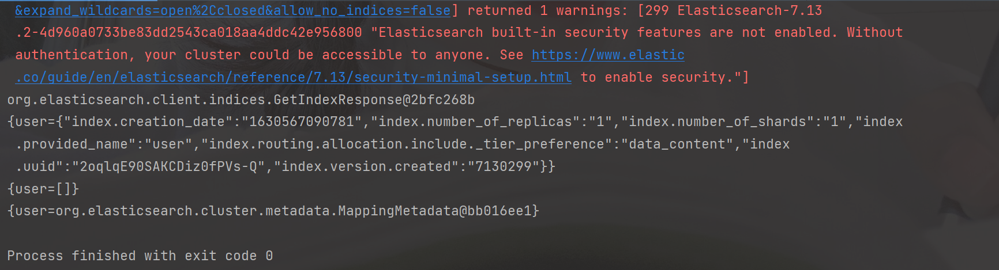


#### 3、删除索引

```java
public class ElasticsearchDocDelete {

    public static void main(String[] args) throws IOException {
        RestHighLevelClient client = new RestHighLevelClient(
                RestClient.builder(new HttpHost("localhost",9200)));
        //删除索引
        DeleteIndexRequest request = new DeleteIndexRequest("user");
        AcknowledgedResponse response = client.indices().delete(request, RequestOptions.DEFAULT);
        //删除索引的响应状态
        System.out.println("删除状态为：" + response.isAcknowledged());
        client.close();
    }
}
```

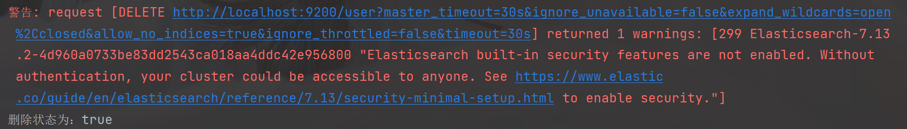


### 3、文档操作

创建数据模型

```java
public class User {

    private String name;

    private Integer age;

    private String sex;

    public User() {
    }

    public User(String name, Integer age, String sex) {
        this.name = name;
        this.age = age;
        this.sex = sex;
    }

    public String getName() {
        return name;
    }

    public void setName(String name) {
        this.name = name;
    }

    public Integer getAge() {
        return age;
    }

    public void setAge(Integer age) {
        this.age = age;
    }

    public String getSex() {
        return sex;
    }

    public void setSex(String sex) {
        this.sex = sex;
    }

    @Override
    public String toString() {
        return new StringJoiner(", ", User.class.getSimpleName() + "[", "]")
                .add("name='" + name + "'")
                .add("age=" + age)
                .add("sex='" + sex + "'")
                .toString();
    }
}
```


#### 1、创建数据，添加到文档

```java
public class ElasticsearchDocInsert {

    public static void main(String[] args) throws IOException {
        RestHighLevelClient client = new RestHighLevelClient(
                RestClient.builder(new HttpHost("localhost",9200)));

        IndexRequest indexRequest = new IndexRequest();
        indexRequest.index("user").id("1001");
        //创建数据对象
        User user = new User("xiaobear",18,"boy");
        //数据对象转为JSON
        ObjectMapper mapper = new ObjectMapper();
        String userJson = mapper.writeValueAsString(user);
        indexRequest.source(userJson, XContentType.JSON);
        //获取响应对象
        IndexResponse response = client.index(indexRequest, RequestOptions.DEFAULT);
        System.out.println("_index：" + response.getIndex());
        System.out.println("_id：" + response.getId());
        System.out.println("_result：" + response.getResult());
        client.close();
    }
}
```

输出结果

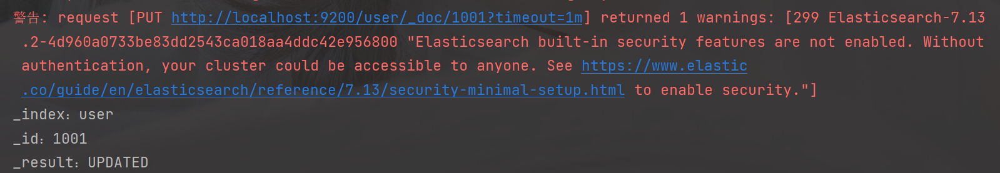


#### 2、修改文档

```java
public class ElasticsearchDocUpdate {

    public static void main(String[] args) throws IOException {
        RestHighLevelClient client = new RestHighLevelClient(
                RestClient.builder(new HttpHost("localhost",9200)));
        //修改文档
        UpdateRequest request = new UpdateRequest();
        request.index("user").id("1001");
        // 设置请求体，对数据进行修改
        request.doc(XContentType.JSON,"sex","girl");
        UpdateResponse response = client.update(request, RequestOptions.DEFAULT);
        System.out.println("_index：" + response.getIndex());
        System.out.println("_id：" + response.getId());
        System.out.println("_result：" + response.getResult());
        client.close();
    }
}
```

输出结果

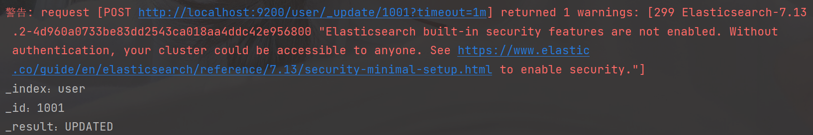


#### 3、查询文档

```java
public class ElasticsearchDocGet {

    public static void main(String[] args) throws IOException {
        RestHighLevelClient client = new RestHighLevelClient(
                RestClient.builder(new HttpHost("localhost",9200)));
        //创建请求对象
        GetRequest request = new GetRequest().index("user").id("1001");
        //创建响应对象
        GetResponse response = client.get(request, RequestOptions.DEFAULT);
        // 打印结果信息
        System.out.println("_index:" + response.getIndex());
        System.out.println("_type:" + response.getType());
        System.out.println("_id:" + response.getId());
        System.out.println("source:" + response.getSourceAsString());
        client.close();
    }
}
```

输出结果

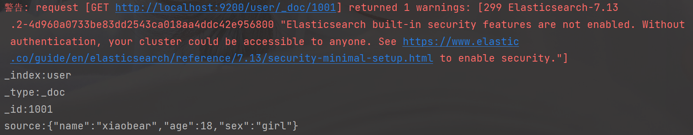


#### 4、删除文档

```java
public class ElasticsearchDoc_Delete {

    public static void main(String[] args) throws IOException {
        RestHighLevelClient client = new RestHighLevelClient(
                RestClient.builder(new HttpHost("localhost",9200)));
        //创建请求对象
        DeleteRequest request = new DeleteRequest().index("user").id("1");
        //创建响应对象
        DeleteResponse response = client.delete(request, RequestOptions.DEFAULT);
        //打印信息
        System.out.println(response.toString());
        client.close();
    }
}
```

输出结果

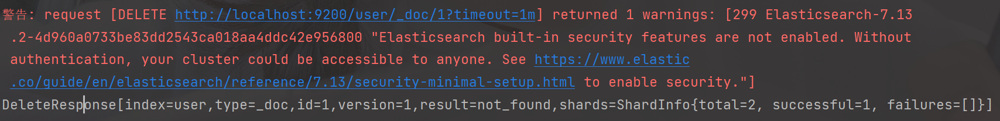


#### 5、批量操作

##### 1、批量新增

```java
public class ElasticSearchBatchInsert {

    public static void main(String[] args) throws IOException {
        RestHighLevelClient client = new RestHighLevelClient(RestClient.builder(new HttpHost("localhost", 9200)));
        //创建批量新增请求对象
        BulkRequest request = new BulkRequest();
        request.add(new IndexRequest().index("user").id("1004").source(XContentType.JSON,"name","xiaohuahua"));
        request.add(new IndexRequest().index("user").id("1005").source(XContentType.JSON,"name","zhangsan"));
        request.add(new IndexRequest().index("user").id("1006").source(XContentType.JSON,"name","lisi"));
        //创建响应对象
        BulkResponse response = client.bulk(request, RequestOptions.DEFAULT);
        System.out.println("took：" + response.getTook());
        System.out.println("items：" + response.getItems());
    }
}
```

输出结果

查询文档：

- http://127.0.0.1:9200/user/_doc/1005
- http://127.0.0.1:9200/user/_doc/1004
- http://127.0.0.1:9200/user/_doc/1006

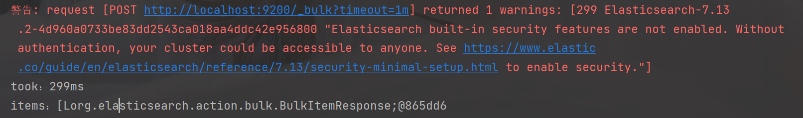


##### 2、批量删除

```java
public class ElasticSearchBatchDelete {

    public static void main(String[] args) throws IOException {
        RestHighLevelClient client = new RestHighLevelClient(RestClient.builder(new HttpHost("localhost", 9200)));
        //创建批量新增请求对象
        BulkRequest request = new BulkRequest();
        request.add(new DeleteRequest().index("user").id("1001"));
        request.add(new DeleteRequest().index("user").id("1002"));
        request.add(new DeleteRequest().index("user").id("1003"));
        //创建响应对象
        BulkResponse response = client.bulk(request, RequestOptions.DEFAULT);
        System.out.println("took：" + response.getTook());
        Arrays.stream(response.getItems()).forEach(System.out::println);
        System.out.println("items：" + Arrays.toString(response.getItems()));
        System.out.println("status：" + response.status());
        System.out.println("失败消息：" + response.buildFailureMessage());
    }
}
```

输出结果

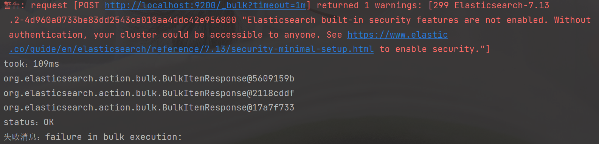


### 4、高级查询

#### 1、请求体查询

##### 1、查询所有索引数据

```java
public class RequestBodyQuery {

    public static void main(String[] args) throws IOException {
        RestHighLevelClient client = new RestHighLevelClient(RestClient.builder(new HttpHost("localhost", 9200)));
        //创建搜索对象
        SearchRequest request = new SearchRequest();
        request.indices("user");
        //构建查询的请求体
        SearchSourceBuilder sourceBuilder = new SearchSourceBuilder();
        //查询所有对象
        sourceBuilder.query(QueryBuilders.matchAllQuery());
        request.source(sourceBuilder);

        SearchResponse response = client.search(request, RequestOptions.DEFAULT);
        //查询匹配
        SearchHits hits = response.getHits();
        System.out.println("took：" + response.getTook());
        System.out.println("是否超时：" + response.isTimedOut());
        System.out.println("TotalHits：" + hits.getTotalHits());
        System.out.println("MaxScore：" + hits.getMaxScore());
        for (SearchHit hit : hits) {
            System.out.println(hit.getSourceAsString());
        }
    }
}
```

输出结果

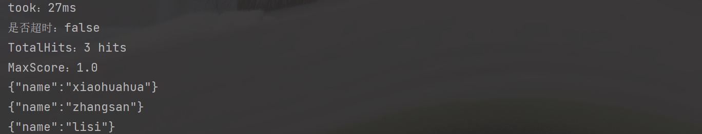


#### 2、term查询

```java
public class TremQuery {

    public static void main(String[] args) throws IOException {
        RestHighLevelClient client = new RestHighLevelClient(RestClient.builder(new HttpHost("localhost", 9200)));
        //创建搜索对象
        SearchRequest request = new SearchRequest();
        request.indices("user");
        //构建查询的请求体
        SearchSourceBuilder sourceBuilder = new SearchSourceBuilder();
        //查询所有对象
        sourceBuilder.query(QueryBuilders.termQuery("name","zhangsan"));
        request.source(sourceBuilder);

        SearchResponse response = client.search(request, RequestOptions.DEFAULT);
        //查询匹配
        SearchHits hits = response.getHits();
        System.out.println("took：" + response.getTook());
        System.out.println("是否超时：" + response.isTimedOut());
        System.out.println("TotalHits：" + hits.getTotalHits());
        System.out.println("MaxScore：" + hits.getMaxScore());
        for (SearchHit hit : hits) {
            System.out.println(hit.getSourceAsString());
        }
    }
}
```

输出结果

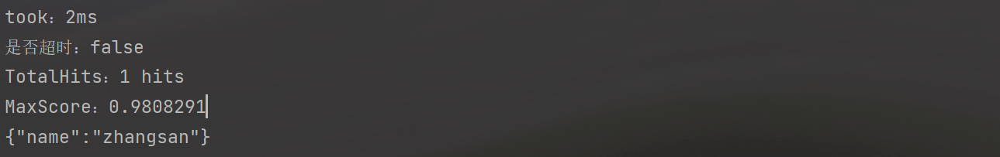


#### 3、分页查询

```java
public class PageQuery {

    public static void main(String[] args) throws IOException {
        RestHighLevelClient client = new RestHighLevelClient(RestClient.builder(new HttpHost("localhost", 9200)));
        //创建搜索对象
        SearchRequest request = new SearchRequest();
        request.indices("user");
        //构建查询的请求体
        SearchSourceBuilder sourceBuilder = new SearchSourceBuilder();
        //查询所有对象
        sourceBuilder.query(QueryBuilders.matchAllQuery());
        //分页查询 当前页其实索引 第一条数据的顺序号 from
        sourceBuilder.from(0);
        //每页显示多少条
        sourceBuilder.size(2);
        request.source(sourceBuilder);

        SearchResponse response = client.search(request, RequestOptions.DEFAULT);
        //查询匹配
        SearchHits hits = response.getHits();
        System.out.println("took：" + response.getTook());
        System.out.println("是否超时：" + response.isTimedOut());
        System.out.println("TotalHits：" + hits.getTotalHits());
        System.out.println("MaxScore：" + hits.getMaxScore());
        for (SearchHit hit : hits) {
            System.out.println(hit.getSourceAsString());
        }
    }
}
```

输出结果

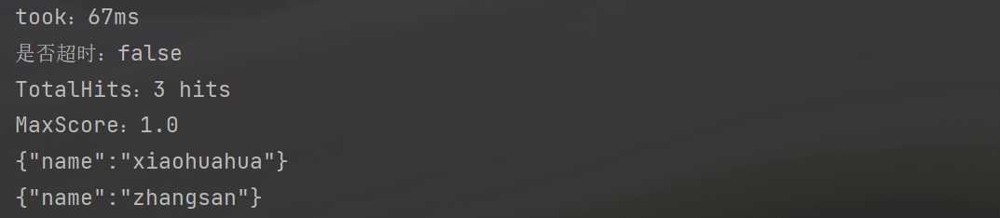


#### 4、数据排序

```java
public class DataSorting {

    public static void main(String[] args) throws IOException {
        RestHighLevelClient client = new RestHighLevelClient(RestClient.builder(new HttpHost("localhost", 9200)));
        //创建搜索对象
        SearchRequest request = new SearchRequest();
        request.indices("user");
        //构建查询的请求体
        SearchSourceBuilder sourceBuilder = new SearchSourceBuilder();
        //查询所有对象
        sourceBuilder.query(QueryBuilders.matchAllQuery());
        //数据排序
        sourceBuilder.sort("age", SortOrder.DESC);

        request.source(sourceBuilder);
        SearchResponse response = client.search(request, RequestOptions.DEFAULT);
        //查询匹配
        SearchHits hits = response.getHits();
        System.out.println("took：" + response.getTook());
        System.out.println("是否超时：" + response.isTimedOut());
        System.out.println("TotalHits：" + hits.getTotalHits());
        System.out.println("MaxScore：" + hits.getMaxScore());
        for (SearchHit hit : hits) {
            System.out.println(hit.getSourceAsString());
        }
    }
}
```


#### 5、过滤字段

```java
public class FilterFiled {

    public static void main(String[] args) throws IOException {
        RestHighLevelClient client = new RestHighLevelClient(RestClient.builder(new HttpHost("localhost", 9200)));
        //创建搜索对象
        SearchRequest request = new SearchRequest();
        request.indices("user");
        //构建查询的请求体
        SearchSourceBuilder sourceBuilder = new SearchSourceBuilder();
        //查询所有对象
        sourceBuilder.query(QueryBuilders.matchAllQuery());
        //数据排序
        sourceBuilder.sort("age", SortOrder.DESC);
        //查询过滤字段
        String[] excludes = {};
        //过滤掉name属性
        String[] includes = {"age"};
        sourceBuilder.fetchSource(includes,excludes);

        request.source(sourceBuilder);
        SearchResponse response = client.search(request, RequestOptions.DEFAULT);
        //查询匹配
        SearchHits hits = response.getHits();
        System.out.println("took：" + response.getTook());
        System.out.println("是否超时：" + response.isTimedOut());
        System.out.println("TotalHits：" + hits.getTotalHits());
        System.out.println("MaxScore：" + hits.getMaxScore());
        for (SearchHit hit : hits) {
            System.out.println(hit.getSourceAsString());
        }
    }
}
```

输出结果

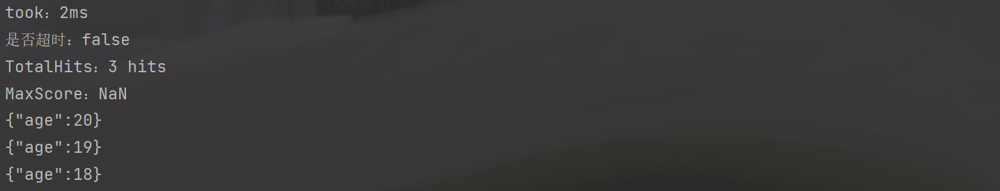


#### 6、Bool查询

```java
public class BoolSearch {

    public static void main(String[] args) throws IOException {
        RestHighLevelClient client = new RestHighLevelClient(RestClient.builder(new HttpHost("localhost", 9200)));
        //创建搜索对象
        SearchRequest request = new SearchRequest();
        request.indices("user");
        //构建查询的请求体
        SearchSourceBuilder sourceBuilder = new SearchSourceBuilder();
        BoolQueryBuilder boolQuery = QueryBuilders.boolQuery();
        //必须包含
        boolQuery.must(QueryBuilders.matchQuery("age",18));
        //一定不包含
        boolQuery.mustNot(QueryBuilders.matchQuery("name","lisi"));
        //可能包含
        boolQuery.should(QueryBuilders.matchQuery("name","zhangsan"));
        //查询所有对象
        sourceBuilder.query(boolQuery);
        
        request.source(sourceBuilder);
        SearchResponse response = client.search(request, RequestOptions.DEFAULT);
        //查询匹配
        SearchHits hits = response.getHits();
        System.out.println("took：" + response.getTook());
        System.out.println("是否超时：" + response.isTimedOut());
        System.out.println("TotalHits：" + hits.getTotalHits());
        System.out.println("MaxScore：" + hits.getMaxScore());
        for (SearchHit hit : hits) {
            System.out.println(hit.getSourceAsString());
        }
    }
}
```

输出结果

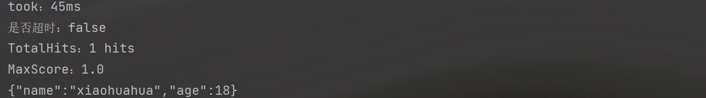


#### 7、范围查询

```java
public class RangeSearch {

    public static void main(String[] args) throws IOException {
        RestHighLevelClient client = new RestHighLevelClient(RestClient.builder(new HttpHost("localhost", 9200)));
        //创建搜索对象
        SearchRequest request = new SearchRequest();
        request.indices("user");
        //构建查询的请求体
        SearchSourceBuilder sourceBuilder = new SearchSourceBuilder();
        //范围查询
        RangeQueryBuilder rangeQuery = QueryBuilders.rangeQuery("age");
        //大于等于
        rangeQuery.gte("19");
        //小于等于
        rangeQuery.lte("40");
        //查询所有对象
        sourceBuilder.query(rangeQuery);

        request.source(sourceBuilder);
        SearchResponse response = client.search(request, RequestOptions.DEFAULT);
        //查询匹配
        SearchHits hits = response.getHits();
        System.out.println("took：" + response.getTook());
        System.out.println("是否超时：" + response.isTimedOut());
        System.out.println("TotalHits：" + hits.getTotalHits());
        System.out.println("MaxScore：" + hits.getMaxScore());
        for (SearchHit hit : hits) {
            System.out.println(hit.getSourceAsString());
        }
    }
}
```

输出结果

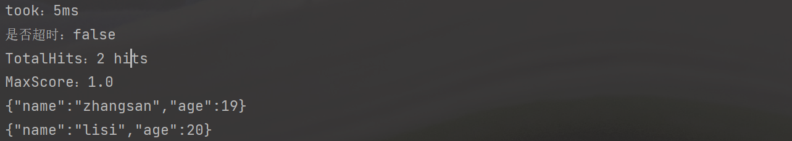


#### 8、模糊查询

```java
public class FuzzySearch {

    public static void main(String[] args) throws IOException {
        RestHighLevelClient client = new RestHighLevelClient(RestClient.builder(new HttpHost("localhost", 9200)));
        //创建搜索对象
        SearchRequest request = new SearchRequest();
        request.indices("user");
        //构建查询的请求体
        SearchSourceBuilder sourceBuilder = new SearchSourceBuilder();
        //模糊查询
        FuzzyQueryBuilder fuzzyQuery = QueryBuilders.fuzzyQuery("name", "zhangsan");
        fuzzyQuery.fuzziness(Fuzziness.ONE);

        sourceBuilder.query(fuzzyQuery);

        request.source(sourceBuilder);
        SearchResponse response = client.search(request, RequestOptions.DEFAULT);
        //查询匹配
        SearchHits hits = response.getHits();
        System.out.println("took：" + response.getTook());
        System.out.println("是否超时：" + response.isTimedOut());
        System.out.println("TotalHits：" + hits.getTotalHits());
        System.out.println("MaxScore：" + hits.getMaxScore());
        for (SearchHit hit : hits) {
            System.out.println(hit.getSourceAsString());
        }
    }
}
```

输出结果

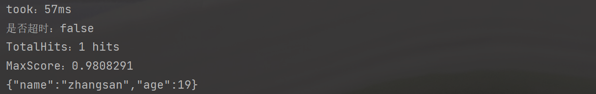


### 5、高亮查询

```java
public class HighlightQuery {

    public static void main(String[] args) throws IOException {
        RestHighLevelClient client = new RestHighLevelClient(RestClient.builder(new HttpHost("localhost", 9200)));
        //高亮查询
        SearchRequest request = new SearchRequest("user");
        //创建查询请求体构建器
        SearchSourceBuilder sourceBuilder = new SearchSourceBuilder();
        //构建查询方式，高亮查询
        TermQueryBuilder termQueryBuilder = QueryBuilders.termQuery("name", "zhangsan");
        //设置查询方式
        sourceBuilder.query(termQueryBuilder);
        //构建高亮字段
        HighlightBuilder highlightBuilder = new HighlightBuilder();
        //设置标签前缀
        highlightBuilder.preTags("<font color='red'");
        //设置标签后缀
        highlightBuilder.postTags("</font>");
        //设置高亮字段
        highlightBuilder.field("name");
        //设置高亮构建对象
        sourceBuilder.highlighter(highlightBuilder);
        //设置请求体
        request.source(sourceBuilder);
        //客户端发送请求，获取响应对象
        SearchResponse response = client.search(request, RequestOptions.DEFAULT);
        // 打印响应结果
        SearchHits hits = response.getHits();
        System.out.println("took::"+response.getTook());
        System.out.println("time_out::"+response.isTimedOut());
        System.out.println("total::"+hits.getTotalHits());
        System.out.println("max_s core::"+hits.getMaxScore());
        System.out.println("hits::::>>");
        for (SearchHit hit : hits) {
            String sourceAsString = hit.getSourceAsString();
            System.out.println(sourceAsString);
            //打印高亮结果
            Map<String, HighlightField> highlightFields = hit.getHighlightFields();
            System.out.println(highlightFields);
            System.out.println("<<::::");
        }
    }
}
```

输出结果

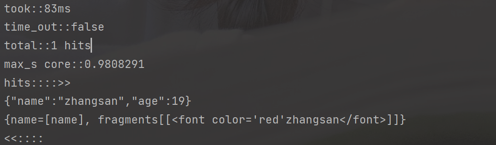


### 6、聚合查询

#### 1、最大年龄

```java
public class AggregateQuery {

    public static void main(String[] args) throws IOException {
        RestHighLevelClient client = new RestHighLevelClient(RestClient.builder(new HttpHost("localhost", 9200)));
        SearchRequest request = new SearchRequest().indices("user");
        SearchSourceBuilder sourceBuilder = new SearchSourceBuilder();
        sourceBuilder.aggregation(AggregationBuilders.max("maxAge").field("age"));
        //设置请求体
        request.source(sourceBuilder);
        SearchResponse response = client.search(request, RequestOptions.DEFAULT);
        //打印响应结果
        SearchHits hits = response.getHits();
        System.out.println("hits = " + hits);
        System.out.println(response);
    }
}
```

输出结果

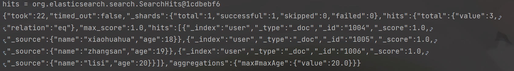


#### 2、分组查询

```java
public class GroupQuery {

    public static void main(String[] args) throws IOException {
        RestHighLevelClient client = new RestHighLevelClient(RestClient.builder(new HttpHost("localhost", 9200)));
        //创建搜索对象
        SearchRequest request = new SearchRequest().indices("user");
        SearchSourceBuilder searchSourceBuilder = new SearchSourceBuilder();
        searchSourceBuilder.aggregation(AggregationBuilders.terms("age_groupby").field("age"));

        //设置请求体
        request.source(searchSourceBuilder);
        SearchResponse response = client.search(request, RequestOptions.DEFAULT);
        System.out.println(response.getHits());
        System.out.println(response);

    }
}
```

输出结果

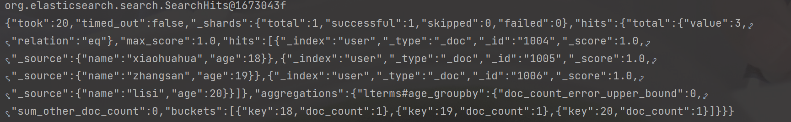


