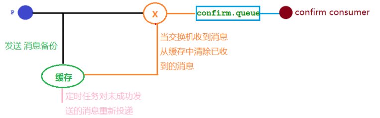
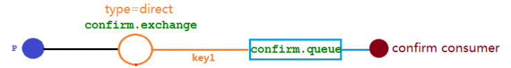
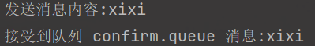
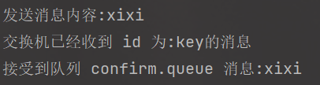
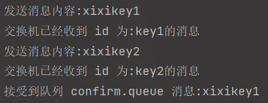
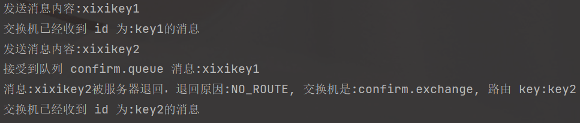
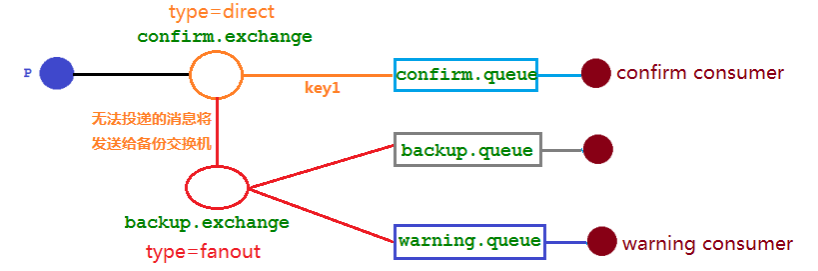
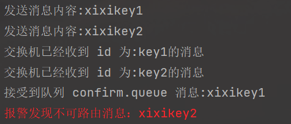

> 在生产环境中由于一些不明原因，导致 rabbitmq 重启，在 RabbitMQ 重启期间生产者消息投递失败，导致消息丢失，需要手动处理和恢复。于是，我们开始思考，如何才能进行 RabbitMQ 的消息可靠投递呢？特别是在这样比较极端的情况，RabbitMQ 集群不可用的时候，无法投递的消息该如何处理呢:


### 1、发布确认 springboot 版本

#### 1、确认机制方案

> 回顾之前学习的发布确认，只是简单的确认消息发出接收，并没有考虑交换机和队列出现问题的情况，如下图所示，若交换机或队列宕机/rabbitmq重启，导致消息传输过程中未被消费者消费，但是又不知道谁未被消费




#### 2、代码架构图

> 新建一个确认的直接交换机和确认队列，然后进行绑定，进行案例测试




#### 3、修改rabbitMq的配置文件

> 在配置文件中添加`spring.rabbitmq.publisher-confirm-type=correlated`
>
> spring.rabbitmq.publisher-confirm-type有三种选择：
>
> - `NONE`：禁用发布确认模式，是默认值
> - `CORRELATED`：发布消息成功到交换器后会触发回调方法
> - `SIMPLE`：存在两种效果
    >   - 一是和 CORRELATED 值一样会触发回调方法
    >   - 二在发布消息成功后使用 rabbitTemplate 调用 waitForConfirms 或 waitForConfirmsOrDie 方法等待 broker 节点返回发送结果，根据返回结果来判定下一步的逻辑，要注意的点是waitForConfirmsOrDie 方法如果返回 false 则会关闭 channel，则接下来无法发送消息到 broker

配置文件内容如下：

```yaml
spring:
  rabbitmq:
    host: 192.168.130.134
    port: 5672
    username: admin
    password: admin123
    #发布消息成功到交换器后会触发回调方法
    publisher-confirm-type: correlated
```


#### 4、添加配置类

```java
@Configuration
public class ConfirmConfig {

    public static final String CONFIRM_EXCHANGE_NAME = "confirm.exchange";
    public static final String CONFIRM_QUEUE_NAME = "confirm.queue";
    public static final String ROUTING_KEY = "key1";

    /**
     * 声明队列
     * @return
     */
    @Bean
    public Queue queue(){
        return QueueBuilder.durable(CONFIRM_QUEUE_NAME).build();
    }

    /**
     * 声明交换机
     * @return
     */
    @Bean
    public DirectExchange directExchange(){
        return new DirectExchange(CONFIRM_EXCHANGE_NAME);
    }

    /**
     * 绑定交换机与队列
     * @param queue
     * @param exchange
     * @return
     */
    @Bean
    public Binding queueBinding(@Qualifier("queue") Queue queue, @Qualifier("directExchange") DirectExchange exchange){
        return BindingBuilder.bind(queue).to(exchange).with(ROUTING_KEY);
    }

}
```


#### 5、消息生产者

```java
@Slf4j
@RestController
@RequestMapping("/confirm")
public class ProducerController {

    @Resource
    private RabbitTemplate rabbitTemplate;

    @GetMapping("/send/{msg}")
    public void send(@PathVariable String msg){
        CorrelationData correlationData = new CorrelationData("key");
        rabbitTemplate.convertAndSend(ConfirmConfig.CONFIRM_EXCHANGE_NAME, ConfirmConfig.ROUTING_KEY, msg, correlationData);
        log.info("发送消息内容:{}",msg);
    }
}
```


#### 6、消息消费者

```java
public class ConfirmConsumer {
    /** logger */
    private static final Logger log = LoggerFactory.getLogger(ConfirmConsumer.class);

    @RabbitListener(queues = "confirm.queue")
    public void receive(Message message){
        String msg=new String(message.getBody());
        log.info("接受到队列 confirm.queue 消息:{}",msg);
    }
}
```


##### 测试

访问： http://localhost:8080/confirm/send/xixi



#### 7、加入确认消息的回调接口

```java
@Slf4j
@Component
public class MyConfirmCallBack implements RabbitTemplate.ConfirmCallback {

    @Resource
    private RabbitTemplate rabbitTemplate;

    @PostConstruct
    public void init(){
        //将MyConfirmCallBack 注入到 rabbitTemplate
        rabbitTemplate.setConfirmCallback(this);
    }

    /**
     * 交换机不管是否收到消息的一个回调方法
     * CorrelationData 消息相关数据
     * ack 交换机是否收到消息
     *
     */
    @Override
    public void confirm(CorrelationData correlationData, boolean b, String s) {
        //是否接受到消息
        String id = correlationData != null ? correlationData.getId():"";
        if(b){
            log.info("交换机已经收到 id 为:{}的消息",id);
        }else{
            log.info("交换机还未收到 id 为:{}消息,由于原因:{}", id, s);
        }
    }
}

```

效果：http://localhost:8080/confirm/send/xixi




#### 8、模拟场景，消息发送，消费者未接收到消息

##### 1、更改生产者

> 消费者绑定队列的ROUTING_KEY为`key1`，生产者通过key2发送的，消费者是接收不到的

```java
@Slf4j
@RestController
@RequestMapping("/confirm")
public class ProducerController {

    @Resource
    private RabbitTemplate rabbitTemplate;

    @GetMapping("/send/{msg}")
    public void send(@PathVariable String msg){
        CorrelationData correlationData1 = new CorrelationData("key1");
        rabbitTemplate.convertAndSend(ConfirmConfig.CONFIRM_EXCHANGE_NAME, ConfirmConfig.ROUTING_KEY, msg  + "key1", correlationData1);
        log.info("发送消息内容:{}",msg + "key1");

        CorrelationData correlationData2 = new CorrelationData("key2");
        rabbitTemplate.convertAndSend(ConfirmConfig.CONFIRM_EXCHANGE_NAME, "key2", msg + "key2", correlationData2);
        log.info("发送消息内容:{}",msg + "key2");
    }
}
```



可以看到，发送了两条消息，第一条消息的 RoutingKey 为 "key1"，第二条消息的 RoutingKey 为"key2"，两条消息都成功被交换机接收，也收到了交换机的确认回调，但消费者只收到了一条消息，因为第二条消息的 RoutingKey 与队列的 BindingKey 不一致，也没有其它队列能接收这个消息，所有第二条消息被直接丢弃了。


### 2、回退消息

#### 1、Mandatory 参数

> **在仅开启了生产者确认机制的情况下，交换机接收到消息后，会直接给消息生产者发送确认消息**，**如果发现该消息不可路由，那么消息会被直接丢弃，此时生产者是不知道消息被丢弃这个事件的**。那么如何让无法被路由的消息帮我想办法处理一下？最起码通知我一声，我好自己处理啊。通过设置 mandatory 参数可以在当消息传递过程中不可达目的地时将消息返回给生产者。

#### 2、修改回调函数

```java
@Slf4j
@Component
public class MyConfirmCallBack implements RabbitTemplate.ConfirmCallback, RabbitTemplate.ReturnsCallback {

    @Resource
    private RabbitTemplate rabbitTemplate;

    @PostConstruct
    public void init(){
        //将MyConfirmCallBack 注入到 rabbitTemplate
        rabbitTemplate.setConfirmCallback(this);
        /**
         * true:交换机无法将消息进行路由时，会将该消息返回给生产者
         * false：如果发现消息无法进行路由，则直接丢弃
         */
        rabbitTemplate.setMandatory(true);
        rabbitTemplate.setReturnsCallback(this);
    }

    /**
     * 交换机不管是否收到消息的一个回调方法
     * CorrelationData 消息相关数据
     * ack 交换机是否收到消息
     *
     */
    @Override
    public void confirm(CorrelationData correlationData, boolean b, String s) {
        //是否接受到消息
        String id = correlationData != null ? correlationData.getId():"";
        if(b){
            log.info("交换机已经收到 id 为:{}的消息",id);
        }else{
            log.info("交换机还未收到 id 为:{}消息,由于原因:{}", id, s);
        }
    }

    /**
     * 回退消息回调函数
     * @param returnedMessage
     */
    @Override
    public void returnedMessage(ReturnedMessage returnedMessage) {
        log.info("消息:{}被服务器退回，退回原因:{}, 交换机是:{}, 路由 key:{}",
                new String(returnedMessage.getMessage().getBody()),
                returnedMessage.getReplyText(),
                returnedMessage.getExchange(),
                returnedMessage.getRoutingKey());
    }
}
```

测试结果：http://localhost:8080/confirm/send/xixi




### 3、备份交换机

> 有了 mandatory 参数和回退消息，我们获得了对无法投递消息的感知能力，有机会在生产者的消息无法被投递时发现并处理。但有时候，我们并不知道该如何处理这些无法路由的消息，最多打个日志，然后触发报警，再来手动处理。而通过日志来处理这些无法路由的消息是很不优雅的做法，特别是当生产者所在的服务有多台机器的时候，手动复制日志会更加麻烦而且容易出错。而且设置 mandatory 参数会增加生产者的复杂性，需要添加处理这些被退回的消息的逻辑。如果既不想丢失消息，又不想增加生产者的复杂性，该怎么做呢？
>
> 前面在设置死信队列的文章中，我们提到，可以为队列设置死信交换机来存储那些处理失败的消息，可是这些不可路由消息根本没有机会进入到队列，因此无法使用死信队列来保存消息。在 RabbitMQ 中，有一种备份交换机的机制存在，可以很好的应对这个问题。
>
> 什么是备份交换机呢？备份交换机可以理解为 RabbitMQ 中交换机的“备胎”，当我们为某一个交换机声明一个对应的备份交换机时，
>
> 就是为它创建一个备胎，当交换机接收到一条不可路由消息时，将会把这条消息转发到备份交换机中，由备份交换机来进行转发和处理，通常备份交换机的类型为 Fanout ，这样就能把所有消息都投递到与其绑定的队列中，然后我们在备份交换机下绑定一个队列，这样所有那些原交换机无法被路由的消息，就会都进入这个队列了。当然，我们还可以建立一个报警队列，用独立的消费者来进行监测和报警。

#### 1、代码架构图

> 将无法接收的消息发送给备份交换机




#### 2、修改配置类

```java
@Configuration
public class ConfirmConfig {

    public static final String CONFIRM_EXCHANGE_NAME = "confirm.exchange";
    public static final String CONFIRM_QUEUE_NAME = "confirm.queue";
    public static final String ROUTING_KEY = "key1";
    public static final String BACKUP_EXCHANGE_NAME = "backup.exchange";
    public static final String BACKUP_QUEUE_NAME = "backup.queue";
    public static final String WARNING_QUEUE_NAME = "warning.queue";

    /**
     * 声明队列
     * @return
     */
    @Bean
    public Queue queue(){
        return QueueBuilder.durable(CONFIRM_QUEUE_NAME).build();
    }

    /**
     * 声明交换机
     * @return
     */
    @Bean
    public DirectExchange directExchange(){
        ExchangeBuilder exchangeBuilder =
                ExchangeBuilder.directExchange(CONFIRM_EXCHANGE_NAME)
                        .durable(true)
                        //设置该交换机的备份交换机
                        .withArgument("alternate-exchange", BACKUP_EXCHANGE_NAME);
        return exchangeBuilder.build();
    }

    /**
     * 绑定交换机与队列
     * @param queue
     * @param exchange
     * @return
     */
    @Bean
    public Binding queueBinding(@Qualifier("queue") Queue queue, @Qualifier("directExchange") DirectExchange exchange){
        return BindingBuilder.bind(queue).to(exchange).with(ROUTING_KEY);
    }

    /**
     * 备份队列
     * @return
     */
    @Bean
    public Queue backupQueue(){
        return QueueBuilder.durable(BACKUP_QUEUE_NAME).build();
    }

    /**
     * 告警队列
     * @return
     */
    @Bean
    public Queue warningQueue(){
        return QueueBuilder.durable(WARNING_QUEUE_NAME).build();
    }

    /**
     * 声明备份交换机
     * @return
     */
    @Bean
    public FanoutExchange backupExchange(){
        return new FanoutExchange(BACKUP_EXCHANGE_NAME);
    }

    /**
     * 绑定备份交换机和备份队列
     * @param queue
     * @param fanoutExchange
     * @return
     */
    @Bean
    public Binding bindingBackUp(@Qualifier("backupQueue") Queue queue, @Qualifier("backupExchange") FanoutExchange fanoutExchange){
        return BindingBuilder.bind(queue).to(fanoutExchange);
    }

    /**
     * 绑定备份交换机和备份队列
     * @param queue
     * @param fanoutExchange
     * @return
     */
    @Bean
    public Binding bindingWarning(@Qualifier("warningQueue") Queue queue, @Qualifier("backupExchange") FanoutExchange fanoutExchange){
        return BindingBuilder.bind(queue).to(fanoutExchange);
    }

}
```


#### 3、告警消费者

```java
@Slf4j
@Component
public class WarningConsumer {
    public static final String WARNING_QUEUE_NAME = "warning.queue";

    @RabbitListener(queues = WARNING_QUEUE_NAME)
    public void receiveWarningMsg(Message message){
        String msg = new String(message.getBody());
        log.error("报警发现不可路由消息：{}", msg);
    }

}
```


#### 4、测试

PS：重新启动项目的时候需要把原来的 confirm.exchange 删除因为我们修改了其绑定属性，不然会报错

浏览器访问：http://localhost:8080/confirm/send/xixi


