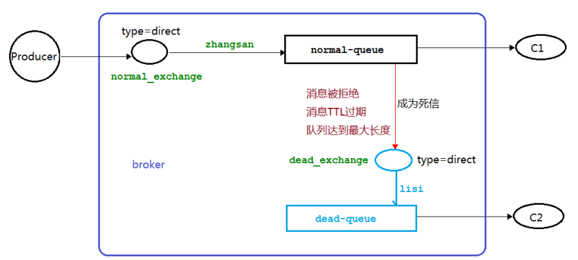
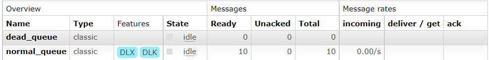
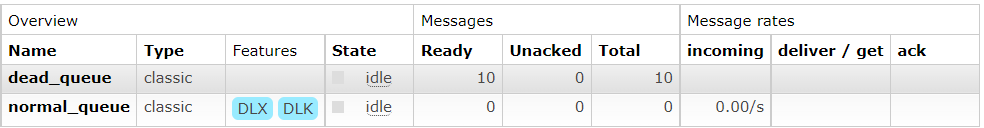
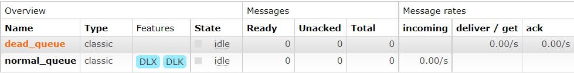
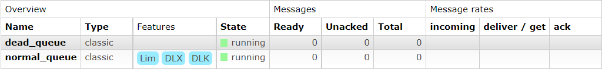
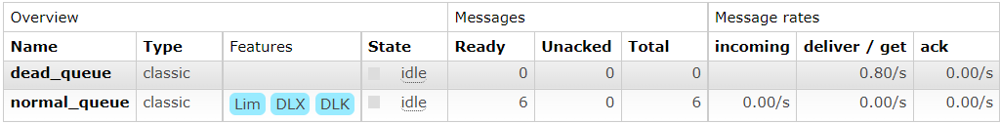
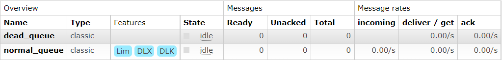
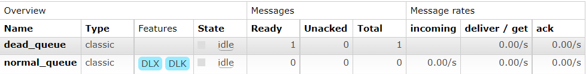
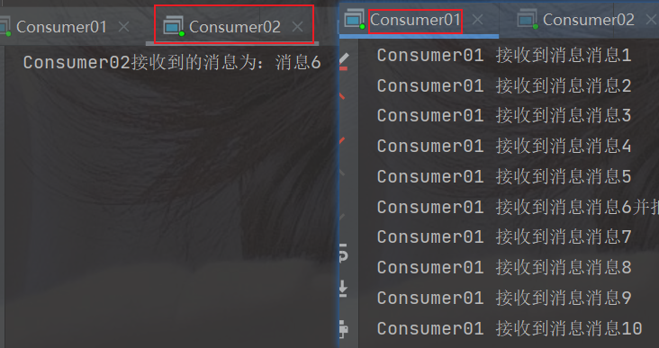

### 1、概念

> 先从概念解释上搞清楚这个定义，死信，顾名思义就是无法被消费的消息，字面意思可以这样理解，一般来说，producer 将消息投递到 broker 或者直接到 queue 里了，consumer 从 queue 取出消息进行消费，但某些时候由于特定的**原因导致** **queue** **中的某些消息无法被消费**，这样的消息如果没有后续的处理，就变成了死信，有死信自然就有了死信队列。
>
> **应用场景：**为了保证订单业务的消息数据不丢失，需要使用到 `RabbitMQ` 的死信队列机制，当消息消费发生异常时，将消息投入死信队列中；还有比如说: 用户在商城下单成功并点击去支付后在指定时间未支付时自动失效


### 2、死信的来源

> - 消息 TTL 过期
> - 队列达到最大长度(队列满了，无法再添加数据到 mq 中)
> - 消息被拒绝(basic.reject 或 basic.nack)并且 requeue=false.


### 3、实战

#### 1、代码架构图



**流程说明：**

1. 一个生产者，两个消费者，交换机为直接类型
2. 正常流程：生产者发送消息，经过正常队列后，由 C1 进行消费
3. 产生三大问题后的流程：生产者发送消息，经过正常队列，由于出现了三大问题，C1没有接收到消息，不能进行消费，需转发到死信交换机中的队列里，由C2进行消费。


**实现说明：**

- 由于C1未进行消费，需转发到C2，所以C1消费者需创建两个交换机和队列
- C2只需进行正常消费死信队列的消息即可


#### 2、消息 TTL 过期

##### 1、场景模拟

> 1. 先启动消费者C1，创建好交换机和队列
> 2. 关闭C1，然后启动生产者和消费者C2
> 3. 因C1被关闭，所以生产者发送的消息无法被消费，过了时间后，会进入死信队列，被C2进行消费


##### 2、消费者01

```java
public class Consumer01 {

    /**
     * 正常交换机
     */
    public static final String NORMAL_EXCHANGE = "normal_exchange";

    /**
     * 死信交换机
     */
    public static final String DEAD_EXCHANGE = "dead_exchange";

    //正常队列
    public static final String NORMAL_QUEUE = "normal_queue";
    //死信队列
    public static final String DEAD_QUEUE = "dead_queue";

    public static void main(String[] args) throws Exception{
        Channel channel = RabbitMQConfig.getChannel();
        //声明交换机
        channel.exchangeDeclare(NORMAL_EXCHANGE, BuiltinExchangeType.DIRECT);
        channel.exchangeDeclare(DEAD_EXCHANGE, BuiltinExchangeType.DIRECT);

        //正常队列绑定死信队列信息
        Map<String, Object> params = new HashMap<>();
        //设置过期时间
//        params.put("x-message-ttl", 10000);
        //正常队列设置死信交换机 参数 key 是固定值
        params.put("x-dead-letter-exchange", DEAD_EXCHANGE);
        //正常队列设置死信 routing-key 参数 key 是固定值
        params.put("x-dead-letter-routing-key", "dead");
        channel.queueDeclare(NORMAL_QUEUE, false, false, false, params);
        //声明队列 不共享 不持久化 不删除
        channel.queueDeclare(DEAD_QUEUE, false, false, false, null);

        //绑定交换机和队列
        channel.queueBind(NORMAL_QUEUE, NORMAL_EXCHANGE, "normal");
        channel.queueBind(DEAD_QUEUE, DEAD_EXCHANGE, "dead");
        System.out.println("等待接收消息......");
        DeliverCallback deliverCallback =  (consumerTag, deliver) ->{
            //获取消息
            String message = new String(deliver.getBody(), "UTF-8");
            System.out.println("Consumer01接收到的消息为：" + message);
        };
        channel.basicConsume(NORMAL_QUEUE, true, deliverCallback, cancelCallback -> {});
    }
}
```


##### 3、消费者02

```java
public class Consumer02 {

    /**
     * 死信交换机
     */
    public static final String DEAD_EXCHANGE = "dead_exchange";


    //死信队列
    public static final String DEAD_QUEUE = "dead_queue";

    public static void main(String[] args) throws Exception{
        Channel channel = RabbitMQConfig.getChannel();
        //声明交换机
        channel.exchangeDeclare(DEAD_EXCHANGE, BuiltinExchangeType.DIRECT);
        //声明队列 不共享 不持久化 不删除
        channel.queueDeclare(DEAD_QUEUE, false, false, false, null);

        //绑定交换机和队列
        channel.queueBind(DEAD_QUEUE, DEAD_EXCHANGE, "dead");
        System.out.println("等待接收消息......");
        DeliverCallback deliverCallback =  (consumerTag, deliver) ->{
            //获取消息
            String message = new String(deliver.getBody(), "UTF-8");
            System.out.println("Consumer02接收到的消息为：" + message);
        };
        channel.basicConsume(DEAD_QUEUE, true, deliverCallback, cancelCallback -> {});
    }
}

```


##### 4、生产者

```java
public class Product {
    /**
     * 正常交换机
     */
    public static final String NORMAL_EXCHANGE = "normal_exchange";

    //正常队列
    public static final String NORMAL_QUEUE = "normal_queue";


    public static void main(String[] args) throws Exception{
        Channel channel = RabbitMQConfig.getChannel();
        //设置消息的 TTL 时间
        AMQP.BasicProperties properties = new
                AMQP.BasicProperties().builder().expiration("10000").build();

        for (int i = 1; i < 11; i++) {
            String msg = "消息" + i;
            channel.basicPublish(NORMAL_EXCHANGE, "normal", properties, msg.getBytes(StandardCharsets.UTF_8));
        }
    }
}
```


##### 5、监控图对比

- 启动生产者，关闭消费者C1，未启动消费者C2



- 启动生产者，关闭消费者C1，未启动消费者C2，时间经过10s后



- 启动生产者，关闭消费者C1，启动消费者C2




##### 6、设置过期时间

###### 1、生产者设置

> 生产者设置具有灵活性，第一条消息可设置10s，第二条设置8s

```java
//设置消息的 TTL 时间
AMQP.BasicProperties properties = new AMQP.BasicProperties().builder().expiration("10000").build();
```


###### 2、消费者设置

> 消费者设置，所有消息的ttl都是一样的，没有灵活性

```java
//正常队列绑定死信队列信息
Map<String, Object> params = new HashMap<>();
//设置过期时间
params.put("x-message-ttl", 10000);

//正常队列设置死信交换机 参数 key 是固定值
params.put("x-dead-letter-exchange", DEAD_EXCHANGE);
//正常队列设置死信 routing-key 参数 key 是固定值
params.put("x-dead-letter-routing-key", "dead");
channel.queueDeclare(NORMAL_QUEUE, false, false, false, params);
```


#### 3、队列达到最大长度

> 消息达到设置的最大长度后，多与的消息会进入死信队列

##### 1、场景模拟

> 1. 先启动消费者C1，创建好交换机和队列
> 2. 关闭C1，然后启动生产者和消费者C2
> 3. C1设置的队列最大长度为6，多与的消息会进入死信队列，被C2消费
> 4. 再启动C1，C1消费6条

##### 2、生产者

```java
public class Product {
    /**
     * 正常交换机
     */
    public static final String NORMAL_EXCHANGE = "normal_exchange";

    public static void main(String[] args) throws Exception{
        Channel channel = RabbitMQConfig.getChannel();
        for (int i = 1; i < 11; i++) {
            String msg = "消息" + i;
            channel.basicPublish(NORMAL_EXCHANGE, "normal", properties, msg.getBytes(StandardCharsets.UTF_8));
        }
    }
}
```


##### 3、消费者01

```java
public class Consumer01 {

    /**
     * 正常交换机
     */
    public static final String NORMAL_EXCHANGE = "normal_exchange";

    /**
     * 死信交换机
     */
    public static final String DEAD_EXCHANGE = "dead_exchange";

    //正常队列
    public static final String NORMAL_QUEUE = "normal_queue";
    //死信队列
    public static final String DEAD_QUEUE = "dead_queue";

    public static void main(String[] args) throws Exception{
        Channel channel = RabbitMQConfig.getChannel();
        //声明交换机
        channel.exchangeDeclare(NORMAL_EXCHANGE, BuiltinExchangeType.DIRECT);
        channel.exchangeDeclare(DEAD_EXCHANGE, BuiltinExchangeType.DIRECT);

        //正常队列绑定死信队列信息
        Map<String, Object> params = new HashMap<>();
        //设置过期时间
//        params.put("x-message-ttl", 10000);
        //设置队列长度的限制
        params.put("x-max-length", 6);
        //正常队列设置死信交换机 参数 key 是固定值
        params.put("x-dead-letter-exchange", DEAD_EXCHANGE);
        //正常队列设置死信 routing-key 参数 key 是固定值
        params.put("x-dead-letter-routing-key", "dead");
        channel.queueDeclare(NORMAL_QUEUE, false, false, false, params);
        //声明队列 不共享 不持久化 不删除
        channel.queueDeclare(DEAD_QUEUE, false, false, false, null);

        //绑定交换机和队列
        channel.queueBind(NORMAL_QUEUE, NORMAL_EXCHANGE, "normal");
        channel.queueBind(DEAD_QUEUE, DEAD_EXCHANGE, "dead");
        System.out.println("等待接收消息......");
        DeliverCallback deliverCallback =  (consumerTag, deliver) ->{
            //获取消息
            String message = new String(deliver.getBody(), "UTF-8");
            System.out.println("Consumer01接收到的消息为：" + message);
        };
        channel.basicConsume(NORMAL_QUEUE, true, deliverCallback, cancelCallback -> {});
    }
}
```


##### 4、消费者02

```java
public class Consumer02 {

    /**
     * 死信交换机
     */
    public static final String DEAD_EXCHANGE = "dead_exchange";


    //死信队列
    public static final String DEAD_QUEUE = "dead_queue";

    public static void main(String[] args) throws Exception{
        Channel channel = RabbitMQConfig.getChannel();
        //声明交换机
        channel.exchangeDeclare(DEAD_EXCHANGE, BuiltinExchangeType.DIRECT);
        //声明队列 不共享 不持久化 不删除
        channel.queueDeclare(DEAD_QUEUE, false, false, false, null);

        //绑定交换机和队列
        channel.queueBind(DEAD_QUEUE, DEAD_EXCHANGE, "dead");
        System.out.println("等待接收消息......");
        DeliverCallback deliverCallback =  (consumerTag, deliver) ->{
            //获取消息
            String message = new String(deliver.getBody(), "UTF-8");
            System.out.println("Consumer02接收到的消息为：" + message);
        };
        channel.basicConsume(DEAD_QUEUE, true, deliverCallback, cancelCallback -> {});
    }
}
```


##### 5、监控图对比

- C1启动时，其他未启动

  

- 启动生产者，关闭消费者，未启动C2

  

- 启动C2

  

- 启动C1

  


##### 6、设置队列最大长度

```java
//正常队列绑定死信队列信息
Map<String, Object> params = new HashMap<>();
//设置队列长度的限制
params.put("x-max-length", 6);
//正常队列设置死信交换机 参数 key 是固定值
params.put("x-dead-letter-exchange", DEAD_EXCHANGE);
//正常队列设置死信 routing-key 参数 key 是固定值
params.put("x-dead-letter-routing-key", "dead");
channel.queueDeclare(NORMAL_QUEUE, false, false, false, params);
```


#### 4、消息被拒绝

##### 1、场景模拟

> 1. 先启动消费者C1，创建好交换机和队列
> 2. 然后启动生产者和消费者C2
> 3. C1设置的队列拒绝接收消息“消息6”
> 4. “消息6”被C2消费


##### 2、生产者

```java
public class Product {
    /**
     * 正常交换机
     */
    public static final String NORMAL_EXCHANGE = "normal_exchange";

    public static void main(String[] args) throws Exception{
        Channel channel = RabbitMQConfig.getChannel();
        for (int i = 1; i < 11; i++) {
            String msg = "消息" + i;
            channel.basicPublish(NORMAL_EXCHANGE, "normal", properties, msg.getBytes(StandardCharsets.UTF_8));
        }
    }
}
```


##### 3、消费者01

```java
public class Consumer01 {

    /**
     * 正常交换机
     */
    public static final String NORMAL_EXCHANGE = "normal_exchange";

    /**
     * 死信交换机
     */
    public static final String DEAD_EXCHANGE = "dead_exchange";

    //正常队列
    public static final String NORMAL_QUEUE = "normal_queue";
    //死信队列
    public static final String DEAD_QUEUE = "dead_queue";

    public static void main(String[] args) throws Exception{
        Channel channel = RabbitMQConfig.getChannel();
        //声明交换机
        channel.exchangeDeclare(NORMAL_EXCHANGE, BuiltinExchangeType.DIRECT);
        channel.exchangeDeclare(DEAD_EXCHANGE, BuiltinExchangeType.DIRECT);

        //正常队列绑定死信队列信息
        Map<String, Object> params = new HashMap<>();
        //正常队列设置死信交换机 参数 key 是固定值
        params.put("x-dead-letter-exchange", DEAD_EXCHANGE);
        //正常队列设置死信 routing-key 参数 key 是固定值
        params.put("x-dead-letter-routing-key", "dead");
        channel.queueDeclare(NORMAL_QUEUE, false, false, false, params);
        //声明队列 不共享 不持久化 不删除
        channel.queueDeclare(DEAD_QUEUE, false, false, false, null);

        //绑定交换机和队列
        channel.queueBind(NORMAL_QUEUE, NORMAL_EXCHANGE, "normal");
        channel.queueBind(DEAD_QUEUE, DEAD_EXCHANGE, "dead");
        System.out.println("等待接收消息......");
        DeliverCallback deliverCallback =  (consumerTag, deliver) ->{
            //获取消息
            String message = new String(deliver.getBody(), "UTF-8");
            if ("消息6".equals(message)){
                System.out.println("Consumer01 接收到消息" + message + "并拒绝签收该消息");
                //requeue 设置为 false 代表拒绝重新入队 该队列如果配置了死信交换机将发送到死信队列中
                channel.basicReject(deliver.getEnvelope().getDeliveryTag(), false);
            }else {
                System.out.println("Consumer01 接收到消息"+message);
                channel.basicAck(deliver.getEnvelope().getDeliveryTag(), false);
            }
        };
        //
        channel.basicConsume(NORMAL_QUEUE, false, deliverCallback, cancelCallback -> {});
    }
}
```


##### 4、消费者02

```java
public class Consumer02 {

    /**
     * 死信交换机
     */
    public static final String DEAD_EXCHANGE = "dead_exchange";

    //死信队列
    public static final String DEAD_QUEUE = "dead_queue";

    public static void main(String[] args) throws Exception{
        Channel channel = RabbitMQConfig.getChannel();
        //声明交换机
        channel.exchangeDeclare(DEAD_EXCHANGE, BuiltinExchangeType.DIRECT);
        //声明队列 不共享 不持久化 不删除
        channel.queueDeclare(DEAD_QUEUE, false, false, false, null);

        //绑定交换机和队列
        channel.queueBind(DEAD_QUEUE, DEAD_EXCHANGE, "dead");
        System.out.println("等待接收消息......");
        DeliverCallback deliverCallback =  (consumerTag, deliver) ->{
            //获取消息
            String message = new String(deliver.getBody(), "UTF-8");
            System.out.println("Consumer02接收到的消息为：" + message);
        };
        channel.basicConsume(DEAD_QUEUE, true, deliverCallback, cancelCallback -> {});
    }
}
```


##### 5、监控图对比

- 其他均启动，C2未启动时






##### 6、设置消息被拒绝

```java
//获取消息
String message = new String(deliver.getBody(), "UTF-8");
if ("消息6".equals(message)){
    System.out.println("Consumer01 接收到消息" + message + "并拒绝签收该消息");
    //requeue 设置为 false 代表拒绝重新入队 该队列如果配置了死信交换机将发送到死信队列中
    channel.basicReject(deliver.getEnvelope().getDeliveryTag(), false);
}else {
    System.out.println("Consumer01 接收到消息"+message);
    channel.basicAck(deliver.getEnvelope().getDeliveryTag(), false);
}
//消费成功之后是否要自动应答 true 代表自动应答 false 手动应答
channel.basicConsume(NORMAL_QUEUE, false, deliverCallback, cancelCallback -> {});
```
