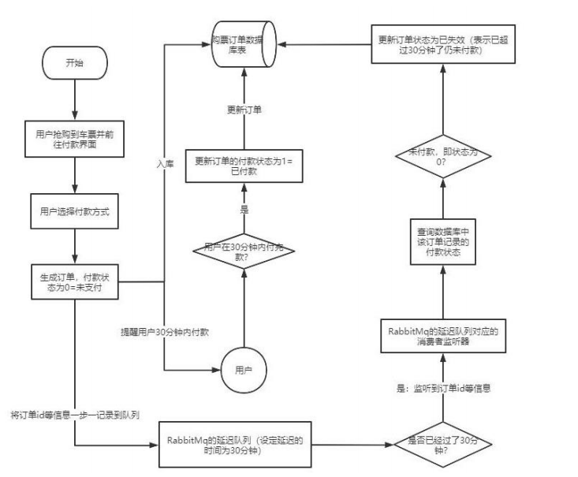
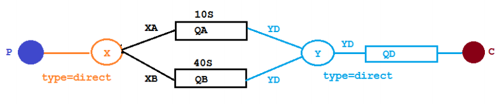
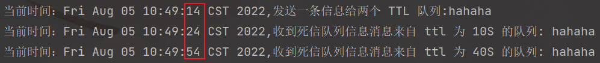
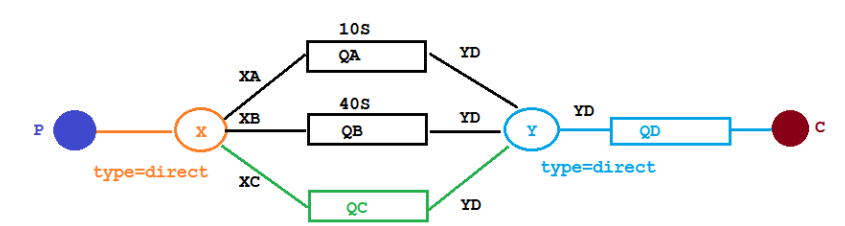
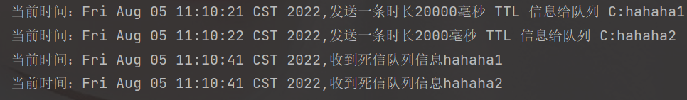
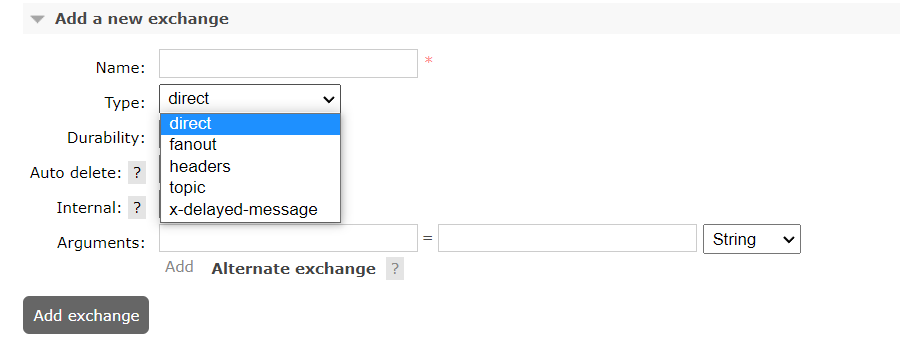
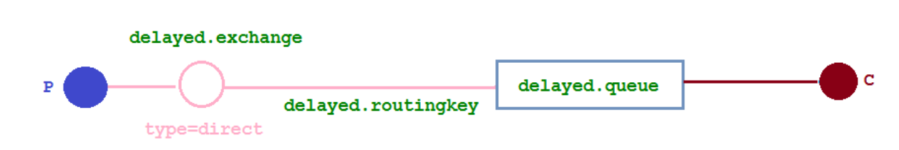
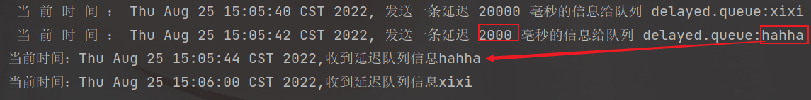

### 1、概念

> 延时队列,队列内部是有序的，最重要的特性就体现在它的延时属性上，延时队列中的元素是希望在指定时间到了以后或之前取出和处理，简单来说，延时队列就是用来存放需要在指定时间被处理的元素的队列。


### 2、延迟队列使用场景

> - 订单在十分钟之内未支付则自动取消
> - 新创建的店铺，如果在十天内都没有上传过商品，则自动发送消息提醒
> - 用户注册成功后，如果三天内没有登陆则进行短信提醒
> - 用户发起退款，如果三天内没有得到处理则通知相关运营人员
> - 预定会议后，需要在预定的时间点前十分钟通知各个与会人员参加会议

这些场景都有一个特点，**需要在某个事件发生之后或者之前的指定时间点完成某一项任务**，如：发生订单生成事件，在十分钟之后检查该

订单支付状态，然后将未支付的订单进行关闭；看起来似乎使用定时任务，一直轮询数据，每秒查一次，取出需要被处理的数据，然后处

理不就完事了吗？如果数据量比较少，确实可以这样做，比如：对于“如果账单一周内未支付则进行自动结算”这样的需求，如果对于时间

不是严格限制，而是宽松意义上的一周，那么每天晚上跑个定时任务检查一下所有未支付的账单，确实也是一个可行的方案。但对于数据

量比较大，并且时效性较强的场景，如：“订单十分钟内未支付则关闭“，短期内未支付的订单数据可能会有很多，活动期间甚至会达到百

万甚至千万级别，对这么庞大的数据量仍旧使用轮询的方式显然是不可取的，很可能在一秒内无法完成所有订单的检查，同时会给数据库

带来很大压力，无法满足业务要求而且性能低下。




### 3、RabbitMQ 中的TTL

> TTL ：RabbitMQ 中一个消息或者队列的属性，表明一条消息或者该队列中的所有消息的最大存活时间
>
> 单位是毫秒。换句话说，如果一条消息设置了 TTL 属性或者进入了设置 TTL 属性的队列，那么这条消息如果在 TTL 设置的时间内没有被消费，则会成为"死信"。如果同时配置了队列的 TTL 和消息的TTL，那么较小的那个值将会被使用，有两种方式设置 TTL。

#### 1、消息设置 TTL

```java
rabbitTemplate.convertAndSend("X", "XC", message, correlationData ->{
    //设置ttl
    correlationData.getMessageProperties().setExpiration(ttl);
    return correlationData;
});
```


#### 2、队列设置TTL

> 第一种是在创建队列的时候设置队列的`x-message-ttl`属性

```java
args.put("x-message-ttl", 5000);
return QueueBuilder.durable(QUEUE_A).withArguments(args).build();
```


#### 3、区别

> 如果设置了队列的 TTL 属性，那么一旦消息过期，就会被队列丢弃(如果配置了死信队列被丢到死信队列中)，而第二种方式，消息即使过期，也不一定会被马上丢弃，因为**消息是否过期是在即将投递到消费者之前判定的**，如果当前队列有严重的消息积压情况，则已过期的消息也许还能存活较长时间；另外，还需要注意的一点是，如果不设置 TTL，表示消息永远不会过期，如果将 TTL 设置为 0，则表示除非此时可以直接投递该消息到消费者，否则该消息将会被丢弃。
>
> 前一节我们介绍了死信队列，刚刚又介绍了 TTL，至此利用 RabbitMQ 实现延时队列的两大要素已经集齐，接下来只需要将它们进行融合，再加入一点点调味料，延时队列就可以新鲜出炉了。想想看，延时队列，不就是想要消息延迟多久被处理吗，TTL 则刚好能让消息在延迟多久之后成为死信，另一方面，成为死信的消息都会被投递到死信队列里，这样只需要消费者一直消费死信队列里的消息就完事了，因为里面的消息都是希望被立即处理的消息。


### 4、整合Spring Boot


### 5、队列TTL

#### 1、代码架构图

> **场景：**创建两个队列 QA 和 QB，两者队列 TTL 分别设置为 10S 和 40S，然后在创建一个交换机 X 和死信交换机 Y，它们的类型都是 direct，创建一个死信队列 QD，它们的绑定关系如下：




#### 2、队列配置类

> 声明队列和交换机，并进行绑定

```java
@Configuration
public class TtlQueueConfig {

    //普通交换机
    public static final String X_EXCHANGE = "X";

    /**
     *  死信交换机
     */
    public static final String Y_DEAD_LETTER_EXCHANGE = "Y";

    public static final String QUEUE_A = "QA";
    public static final String QUEUE_B = "QB";

    public static final String DEAD_LETTER_QUEUE = "QD";

    /**
     * 声明 xExchange
     * @return DirectExchange
     */
    @Bean("xExchange")
    public DirectExchange xExchange(){
        return new DirectExchange(X_EXCHANGE);
    }

    /**
     * 声明死信交换机 y
     * @return
     */
    @Bean("yExchange")
    public DirectExchange yExchange(){
        return new DirectExchange(Y_DEAD_LETTER_EXCHANGE);
    }

    @Bean
    public Queue queueA(){
        Map<String, Object> args = new HashMap<>(3);
        //声明当前队列绑定的死信交换机
        args.put("x-dead-letter-exchange", Y_DEAD_LETTER_EXCHANGE);
        //声明当前队列的死信路由 key
        args.put("x-dead-letter-routing-key", "YD");
        //声明队列的 TTL
        args.put("x-message-ttl", 10000);
        return QueueBuilder.durable(QUEUE_A).withArguments(args).build();
    }

    /**
     * 绑定队列A与交换机X
     * @param queueA
     * @param xExchange
     * @return
     */
    @Bean
    public Binding queueABindingX(@Qualifier("queueA") Queue queueA, @Qualifier("xExchange") DirectExchange xExchange){
        return BindingBuilder.bind(queueA).to(xExchange).with("XA");
    }

    @Bean
    public Queue queueB(){
        Map<String, Object> args = new HashMap<>(3);
        //声明当前队列绑定的死信交换机
        args.put("x-dead-letter-exchange", Y_DEAD_LETTER_EXCHANGE);
        //声明当前队列的死信路由 key
        args.put("x-dead-letter-routing-key", "YD");
        //声明队列的 TTL
        args.put("x-message-ttl", 40000);
        return QueueBuilder.durable(QUEUE_B).withArguments(args).build();
    }

    /**
     * 绑定队列B与交换机X
     * @param queueB
     * @param xExchange
     * @return
     */
    @Bean
    public Binding queueBBindingX(@Qualifier("queueB") Queue queueB, @Qualifier("xExchange") DirectExchange xExchange){
        return BindingBuilder.bind(queueB).to(xExchange).with("XB");
    }

    /**
     * 死信队列
     * @return
     */
    @Bean
    public Queue queueD(){
        return QueueBuilder.durable(DEAD_LETTER_QUEUE).build();
    }

    @Bean
    public Binding queueDBindingY(@Qualifier("queueD") Queue queueD, @Qualifier("yExchange") DirectExchange yExchange){
        return BindingBuilder.bind(queueD).to(yExchange).with("YD");
    }
}

```


#### 3、生产者

> 通过controller发送消息，分别发送到队列A和B中

```java
@RestController
@RequestMapping("ttl")
public class SendMsgController {

    /** logger */
    private static final Logger log = LoggerFactory.getLogger(SendMsgController.class);

    @Resource
    private RabbitTemplate rabbitTemplate;

    @GetMapping("/send/{message}")
    public void sendMsg(@PathVariable("message") String message){
        log.info("当前时间：{},发送一条信息给两个 TTL 队列:{}", new Date(), message);
        rabbitTemplate.convertAndSend("X","XA", "消息来自 ttl 为 10S 的队列: " + message);
        rabbitTemplate.convertAndSend("X","XB", "消息来自 ttl 为 40S 的队列: " + message);
    }
}
```


#### 4、消费者代码

> 打印消费的消息

```java
@Component
public class DeadLetterQueueConsumer {
    /** logger */
    private static final Logger log = LoggerFactory.getLogger(DeadLetterQueueConsumer.class);

    @RabbitListener(queues = "QD")
    public void receiveD(Message message, Channel channel) throws Exception{
        String msg = new String(message.getBody());
        log.info("当前时间：{},收到死信队列信息{}", new Date().toString(), msg);
    }
}
```


#### 5、结果

> 发起一个请求 http://localhost:8080/ttl/send/hahaha

```
2022-08-05 10:49:14.864  INFO 11296 --- [nio-8080-exec-1] c.x.r.controller.SendMsgController       : 当前时间：Fri Aug 05 10:49:14 CST 2022,发送一条信息给两个 TTL 队列:hahaha
2022-08-05 10:49:24.877  INFO 11296 --- [ntContainer#0-2] c.x.r.consumer.DeadLetterQueueConsumer   : 当前时间：Fri Aug 05 10:49:24 CST 2022,收到死信队列信息消息来自 ttl 为 10S 的队列: hahaha
2022-08-05 10:49:54.874  INFO 11296 --- [ntContainer#0-2] c.x.r.consumer.DeadLetterQueueConsumer   : 当前时间：Fri Aug 05 10:49:54 CST 2022,收到死信队列信息消息来自 ttl 为 40S 的队列: hahaha
```



第一条消息在 10S 后变成了死信消息，然后被消费者消费掉，第二条消息在 40S 之后变成了死信消息，然后被消费掉，这样一个延时队列就打造完成了。

不过，如果这样使用的话，岂不是**每增加一个新的时间需求，就要新增一个队列**，这里只有 10S 和 40S两个时间选项，如果需要一个小时后处理，那么就需要增加 TTL 为一个小时的队列，如果是预定会议室然后提前通知这样的场景，岂不是要增加无数个队列才能满足需求？


### 6、延时队列优化

#### 1、代码架构图

> 场景：在这里新增了一个队列 QC,绑定关系如下,该队列不设置 TTL 时间，由用户传参设置ttl




#### 2、队列配置类增加

> 添加对 队列C的配置与绑定

```java
@Bean
public Queue queueC(){
    Map<String, Object> args = new HashMap<>(3);
    //声明当前队列绑定的死信交换机
    args.put("x-dead-letter-exchange", Y_DEAD_LETTER_EXCHANGE);
    //声明当前队列的死信路由 key
    args.put("x-dead-letter-routing-key", "YD");
    return QueueBuilder.durable(QUEUE_C).withArguments(args).build();
}

/**
     * 绑定队列C与交换机X
     * @param queueC
     * @param xExchange
     * @return
     */
@Bean
public Binding queueCBindingX(@Qualifier("queueC") Queue queueC, @Qualifier("xExchange") DirectExchange xExchange){
    return BindingBuilder.bind(queueC).to(xExchange).with("XC");
}
```


#### 3、生产者发送消息

```java
@GetMapping("/send/{message}/{ttl}")
public void sendMsg(@PathVariable("message") String message, @PathVariable String ttl){
    rabbitTemplate.convertAndSend("X", "XC", message, correlationData ->{
        correlationData.getMessageProperties().setExpiration(ttl);
        return correlationData;
    });
    log.info("当前时间：{},发送一条时长{}毫秒 TTL 信息给队列 C:{}", new Date(),ttl, message);
}
```


#### 4、结果



看起来似乎没什么问题，但是在最开始的时候，就介绍过如果使用在消息属性上设置 TTL 的方式，消息可能并不会按时“死亡“，因为 **RabbitMQ** **只会检查第一个消息是否过期**，如果过期则丢到死信队列，**如果第一个消息的延时时长很长，而第二个消息的延时时长很短，第二个消息并不会优先得到执行**。


### 7、RabbitMQ 插件实现延迟队列

> 上文中提到的问题，确实是一个问题，如果不能实现在消息粒度上的 TTL，并使其在设置的 TTL 时间及时死亡，就无法设计成一个通用的延时队列。那如何解决呢，接下来我们就去解决该问题。
>
> 使用插件实现延迟队列


#### 1、安装插件

> 下载地址：https://www.rabbitmq.com/community-plugins.html
>
> 找到延迟队列插件：**rabbitmq_delayed_message_exchange**
>
> PS：下载的插件是：`rabbitmq_delayed_message_exchange-3.10.2.ez`，而不是zip等其他格式

进入rabbitmq的插件目录

```
/usr/lib/rabbitmq/lib/rabbitmq_server-3.10.5/plugins
```

启动延迟插件

```
[root@xiaobear plugins]## rabbitmq-plugins enable rabbitmq_delayed_message_exchange
Enabling plugins on node rabbit@xiaobear:
rabbitmq_delayed_message_exchange
The following plugins have been configured:
  rabbitmq_delayed_message_exchange
  rabbitmq_management
  rabbitmq_management_agent
  rabbitmq_web_dispatch
Applying plugin configuration to rabbit@xiaobear...
Plugin configuration unchanged.
[root@xiaobear plugins]## 
```

添加插件后




#### 2、代码架构图

> 新增了一个队列 delayed.queue,一个自定义交换机 delayed.exchange，绑定关系如下:



#### 3、配置类代码

> 声明一个延迟队列和交换机，并进行绑定
>
> 在我们自定义的交换机中，这是一种新的交换类型，该类型消息支持延迟投递机制 消息传递后并不会立即投递到目标队列中，而是存储在 mnesia(一个分布式数据系统)表中，当达到投递时间时，才投递到目标队列中。

```java
@Configuration
public class DelayedQueueConfig {

    public static final String DELAYED_QUEUE_NAME = "delayed.queue";
    public static final String DELAYED_EXCHANGE_NAME = "delayed.exchange";
    public static final String DELAYED_ROUTING_KEY = "delayed.routingkey";

    @Bean
    public Queue delayedQueue(){
        return new Queue(DELAYED_QUEUE_NAME);
    }

    /**
     * 自定义交换机 定义延迟交换机
     * @return
     */
    @Bean
    public CustomExchange delayedExchange(){
        Map<String, Object> map = new HashMap<>(1);
        map.put("x-delayed-type","direct");
        return new CustomExchange(DELAYED_EXCHANGE_NAME, "x-delayed-message", true, false, map);
    }

    /**
     * 绑定队列与交换机
     * @return
     */
    @Bean
    public Binding bindingDelayedQueue(@Qualifier("delayedQueue")Queue queue, @Qualifier("delayedExchange") CustomExchange exchange){
        return BindingBuilder.bind(queue).to(exchange).with(DELAYED_ROUTING_KEY).noargs();
    }

}
```


#### 4、生产者代码

```java
@RestController
@RequestMapping("/delay")
public class DelayedMsgController {
    /** logger */
    private static final Logger log = LoggerFactory.getLogger(DelayedMsgController.class);

    @Resource
    private RabbitTemplate rabbitTemplate;

    public static final String DELAYED_EXCHANGE_NAME = "delayed.exchange";
    public static final String DELAYED_ROUTING_KEY = "delayed.routingkey";

    @GetMapping("/send/{message}/{delayTime}")
    public void sendMsg(@PathVariable String message, @PathVariable Integer delayTime){
        rabbitTemplate.convertAndSend(DELAYED_EXCHANGE_NAME, DELAYED_ROUTING_KEY, message, correlationData ->{
            //设置延迟消息
            correlationData.getMessageProperties().setDelay(delayTime);
            return correlationData;
        });
        log.info(" 当 前 时 间 ： {}, 发送一条延迟 {} 毫秒的信息给队列 delayed.queue:{}", new
                Date(),delayTime, message);
    }
}
```


#### 5、消费者代码

> 通过监听器消费 延迟队列中的消息

```java
@RabbitListener(queues = "delayed.queue")
    public void receiveDelayMsg(Message message){
        String msg = new String(message.getBody());
        log.info("当前时间：{},收到延迟队列信息{}", new Date(), msg);
    }
```


#### 6、测试

> 发送请求：http://localhost:8080/delay/send/xixi/20000 和 http://localhost:8080/delay/send/hahha/2000




结果显示：第二个消息被先消费掉了，符合预期
