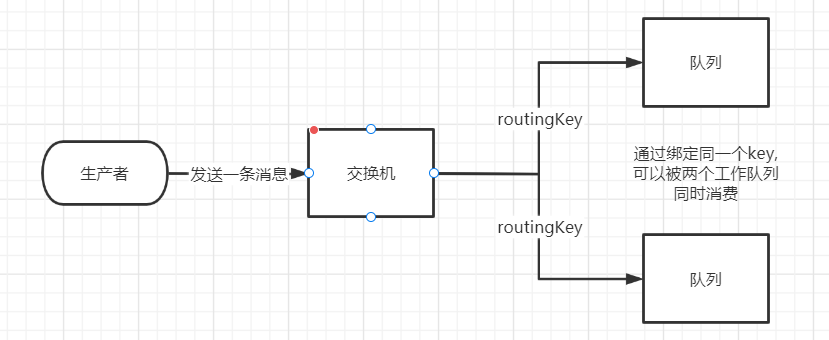
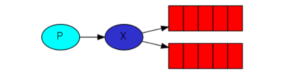
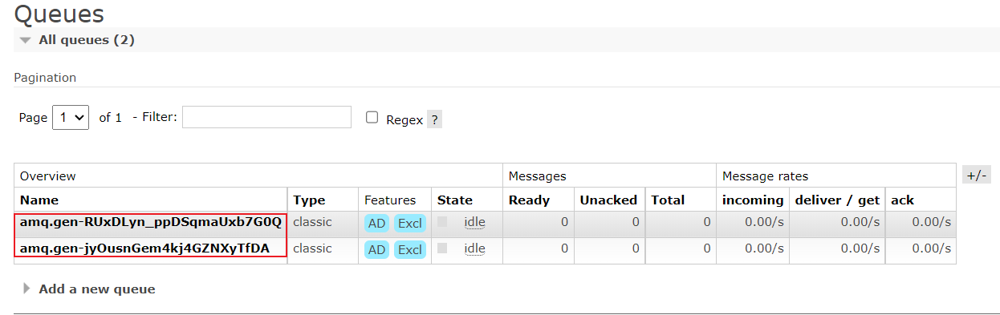
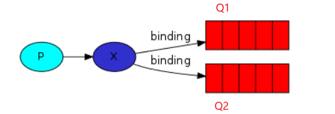
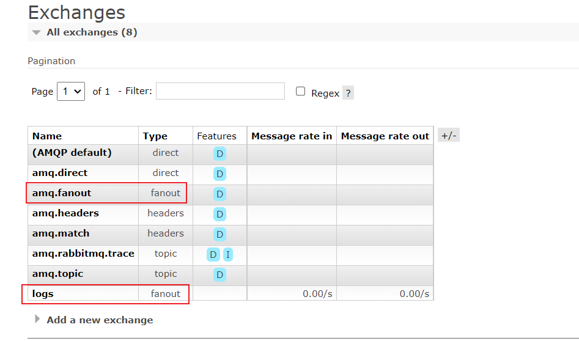
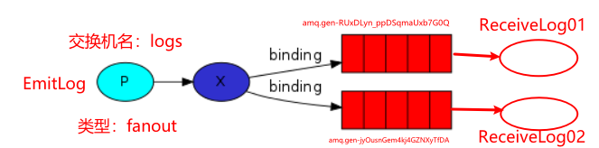
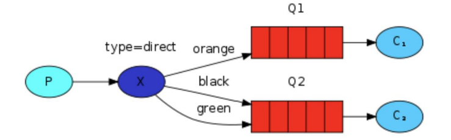
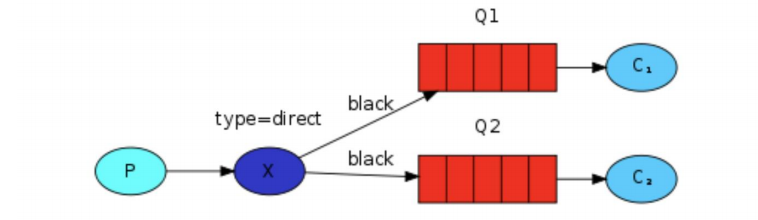
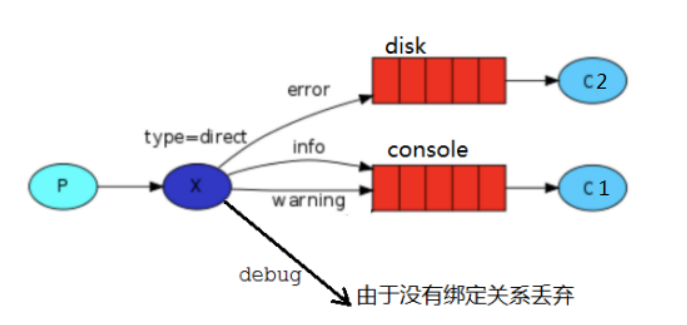
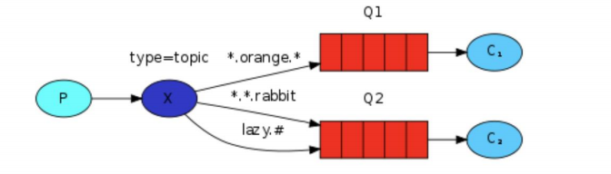

> 在上一节中，我们创建了一个工作队列。我们假设的是工作队列背后，每个任务都恰好交付给一个消费者(工作进程)。在这一部分中，我们将做一些完全不同的事情-我们将消息传达给多个消费者。这种模式称为 ”发布/订阅”.



为了说明这种模式，我们将构建一个简单的日志系统。它将由两个程序组成:第一个程序将发出日志消息，第二个程序是消费者。其中我们会启动两个消费者，其中一个消费者接收到消息后把日志存储在磁盘，另外一个消费者接收到消息后把消息打印在屏幕上，事实上第一个程序发出的日志消息将广播给所有消费者


### 1、Exchanges

#### 1、Exchanges概念

> `RabbitMQ` 消息传递模型的核心思想是: **生产者生产的消息从不会直接发送到队列**。实际上，通常生产者甚至都不知道这些消息传递传递到了哪些队列中。
>
> 相反，**生产者只能将消息发送到交换机(exchange)**，交换机工作的内容非常简单，一方面它接收来自生产者的消息，另一方面将它们推入队列。交换机必须确切知道如何处理收到的消息。是应该把这些消息放到特定队列还是说把他们到许多队列中还是说应该丢弃它们。这就的由交换机的类型来决定。




#### 2、类型

- direct（直接）
- topic（主题）：路由
- headers （标题）
- fanout（扇出）：发布订阅


#### 3、无名Exchange

在前面部分我们对 exchange 一无所知，但仍然能够将消息发送到队列。之前能实现的原因是因为我们使用的是默认交换，我们通过空字符串(“”)进行标识。

```java
/**
             * 发送一个消息
             * 1.发送到那个交换机
             * 2.路由的 key 是哪个
             * 3.其他的参数信息
             * 4.发送消息的消息体
             */
channel.basicPublish("", "hello", null, message.getBytes());
```

第一个参数是交换机的名称。空字符串表示默认或无名称交换机：消息能路由发送到队列中其实是由 routingKey(bindingkey)绑定 key 指定的，如果它存在的话


### 2、临时队列

> 前面的学习我们使用的是具有特定名称的队列(还记得 hello 和 ack_queue 吗？)。队列的名称我们来说至关重要-我们需要指定我们的消费者去消费哪个队列的消息。

每当我们连接到 Rabbit 时，我们都需要一个全新的空队列，为此我们可以创建一个具有**随机名称的队列**，或者能让服务器为我们选择一个随机队列名称那就更好了。其次**一旦我们断开了消费者的连接，队列将被自动删除。**

创建临时队列的方式如下:

```java
String queueName = channel.queueDeclare().getQueue();
```




### 3、绑定(bindings)

> 什么是 bingding 呢，binding 其实是 exchange 和 queue 之间的桥梁，它告诉我们 exchange 和那个队列进行了绑定关系。比如说下面这张图告诉我们的就是 X 与 Q1 和 Q2 进行了绑定。



```java
//String queue, String exchange, String routingKey
channel.queueBind(queueName, "logs", "");
```


### 4、Fanout

#### 1、Fanout 概念

> Fanout 这种类型非常简单。正如从名称中猜到的那样，它是将接收到的所有消息**广播**到它知道的所有队列中。系统中默认有些 exchange 类型




#### 2、Fanout 实战

场景：一个生产者，两个消费者，绑定空routingKey，实现一次发送，同时消费




- 消费者1

  ```java
  public class ReceiveLog01 {
  
      public static final String EXCHANGE_NAME = "logs";
  
      public static void main(String[] args) throws Exception{
          Channel channel = RabbitMQConfig.getChannel();
          //声明一个交换机 类型为：扇出
          channel.exchangeDeclare(EXCHANGE_NAME, "fanout");
  
          //声明工作队列
          String queueName = channel.queueDeclare().getQueue();
  
          //将临时队列绑定到交换机上 String queue, String exchange, String routingKey
          channel.queueBind( queueName, EXCHANGE_NAME, "");
  
          DeliverCallback deliverCallback =  (consumerTag, deliver) ->{
              System.out.println("ReceiveLog01接收到的消息为：" + new String(deliver.getBody(), "UTF-8"));
          };
  
          //String queue, boolean autoAck, DeliverCallback deliverCallback, CancelCallback cancelCallback
          //取消接收消息的回调为空
          channel.basicConsume(queueName, true, deliverCallback, cancelCallback -> {});
      }
  }
  ```


- 消费者2

  ```java
  public class ReceiveLog02 {
  
      public static final String EXCHANGE_NAME = "logs";
  
      public static void main(String[] args) throws Exception{
          Channel channel = RabbitMQConfig.getChannel();
          //声明一个交换机 类型为：扇出
          channel.exchangeDeclare(EXCHANGE_NAME, "fanout");
  
          //声明工作队列
          String queueName = channel.queueDeclare().getQueue();
  
          //将临时队列绑定到交换机上 String queue, String exchange, String routingKey
          channel.queueBind( queueName, EXCHANGE_NAME, "");
  
          DeliverCallback deliverCallback =  (consumerTag, deliver) ->{
              System.out.println("ReceiveLog02接收到的消息为：" + new String(deliver.getBody(), "UTF-8"));
          };
  
          //String queue, boolean autoAck, DeliverCallback deliverCallback, CancelCallback cancelCallback
          //取消接收消息的回调为空
          channel.basicConsume(queueName, true, deliverCallback, cancelCallback -> {});
      }
  }
  ```


- 生产者

  ```java
  public class EmitLog {
  
      public static final String EXCHANGE_NAME = "logs";
  
      public static void main(String[] args) throws Exception{
          Channel channel = RabbitMQConfig.getChannel();
          //声明交换机，因消费者已经声明，故不需要重复声明
          Scanner sc = new Scanner(System.in);
          while (sc.hasNext()){
              String msg = sc.nextLine();
              //String exchange, String routingKey, BasicProperties props, byte[] body
              channel.basicPublish(EXCHANGE_NAME, "", null, msg.getBytes(StandardCharsets.UTF_8));
              System.out.println("生产者发送的消息为:" + msg);
          }
      }
  }
  ```


### 5、Direct exchange

> 在上一节中，我们构建了一个简单的日志记录系统。我们能够向许多接收者广播日志消息。在本节我们将向其中添加一些特别的功能-比方说我们只让某个消费者订阅发布的部分消息。例如我们只把严重错误消息定向存储到日志文件(以节省磁盘空间)，同时仍然能够在控制台上打印所有日志消息。
>
> 我们再次来回顾一下什么是 bindings，绑定是交换机和队列之间的桥梁关系。也可以这么理解：**队列只对它绑定的交换机的消息感兴趣**。绑定用参数：routingKey 来表示也可称该参数为 binding key，创建绑定我们用代码:
>
> ```
> channel.queueBind(queueName, EXCHANGE_NAME, "routingKey");
> ```
>
> **绑定之后的意义由其交换类型决定。**


#### 1、Direct exchange 介绍

> 上一节中的我们的日志系统将所有消息广播给所有消费者，对此我们想做一些改变，例如我们希望将日志消息写入磁盘的程序仅接收严重错误(errros)，而不存储哪些警告(warning)或信息(info)日志消息避免浪费磁盘空间。Fanout 这种交换类型并不能给我们带来很大的灵活性-它只能进行无意识的广播，在这里我们将使用 `direct `这种类型来进行替换，这种类型的工作方式是，**消息只去到它绑定的routingKey 队列中去**。



在上面这张图中，我们可以看到 X 绑定了两个队列，绑定类型是 direct。队列 Q1 绑定键为 orange，队列 Q2 绑定键有两个:一个绑定键为 black，另一个绑定键为 green.

在这种绑定情况下，生产者发布消息到 exchange 上，绑定键为 orange 的消息会被发布到队列Q1。绑定键为 black、green 和的消息会被发布到队列 Q2，其他消息类型的消息将被丢弃。


#### 2、多重绑定



当然如果 exchange 的绑定类型是 direct，**但是它绑定的多个队列的** **key** **如果都相同**，在这种情况下虽然绑定类型是 direct **但是它表现的就和** **fanout** **有点类似了**，就跟广播差不多，如上图所示。


#### 3、实战



引入依赖，因用到导出文件，用到了`commons-io`

```xml
<!-- https://mvnrepository.com/artifact/commons-io/commons-io -->
<dependency>
    <groupId>commons-io</groupId>
    <artifactId>commons-io</artifactId>
    <version>2.5</version>
</dependency>
```


##### 1、消费者01

> 消费者01绑定的`routingKey`为`error`，只接收绑定的消息，然后写入文件中

```java
public class ReceiveDirectLog01 {
    public static final String EXCHANGE_DIRECT_NAME = "direct_log";

    public static void main(String[] args) throws Exception{
        //获取信道
        Channel channel = RabbitMQConfig.getChannel();
        //创建交换机，类型为direct
        channel.exchangeDeclare(EXCHANGE_DIRECT_NAME, BuiltinExchangeType.DIRECT);
        //创建临时队列
        String queueName = channel.queueDeclare().getQueue();
        //String queue, boolean durable, boolean exclusive, boolean autoDelete, Map<String, Object> arguments
//        channel.queueDeclare(queueName, false, false, false, null);
        //绑定交换机与队列 String queue, String exchange, String routingKey
        channel.queueBind(queueName, EXCHANGE_DIRECT_NAME, "error");
        System.out.println("等待接收消息");
        //接收消息的回调函数
        DeliverCallback deliverCallback = (consumerTag, deliver) ->{
            //获取消息
            String message = new String(deliver.getBody(), "UTF-8");
            message = "接收绑定键:" + deliver.getEnvelope().getRoutingKey() + ",消息:" + message;
            File file = new File("C:\\Users\\xiaobear\\Desktop\\rabbitmq_log.txt");
            FileUtils.writeStringToFile(file, message, "UTF-8");
            System.out.println("错误日志已经接收");
        };
        channel.basicConsume(queueName, true, deliverCallback, cancelCallback -> {});
    }
}

```


##### 2、消费者02

> 消费者01绑定的`routingKey`为`info`和`warning`，只接收绑定的消息，然后打印到控制台

```java
public class ReceiveDirectLog02 {
    public static final String EXCHANGE_DIRECT_NAME = "direct_log";

    public static void main(String[] args) throws Exception{
        //获取信道
        Channel channel = RabbitMQConfig.getChannel();
        //创建交换机，类型为direct
        channel.exchangeDeclare(EXCHANGE_DIRECT_NAME, BuiltinExchangeType.DIRECT);
        //创建临时队列
        String queueName = channel.queueDeclare().getQueue();
        //String queue, boolean durable, boolean exclusive, boolean autoDelete, Map<String, Object> arguments
//        channel.queueDeclare(queueName, false, false, false, null);
        //绑定交换机与队列 String queue, String exchange, String routingKey
        channel.queueBind(queueName, EXCHANGE_DIRECT_NAME, "info");
        channel.queueBind(queueName, EXCHANGE_DIRECT_NAME, "warning");
        System.out.println("等待接收消息");
        //接收消息的回调函数
        DeliverCallback deliverCallback = (consumerTag, deliver) ->{
            //获取消息
            String message = new String(deliver.getBody(), "UTF-8");
            message = "接收绑定键:" + deliver.getEnvelope().getRoutingKey() + ",消息:" + message;
            System.out.println(message);
        };
        channel.basicConsume(queueName, true, deliverCallback, cancelCallback -> {});
    }
}
```


##### 3、生产者

```java
public class EmitDirectLog {

    public static final String EXCHANGE_DIRECT_NAME = "direct_log";

    public static void main(String[] args) throws Exception{
        try(Channel channel = RabbitMQConfig.getChannel()){
            channel.exchangeDeclare(EXCHANGE_DIRECT_NAME, BuiltinExchangeType.DIRECT);
            //声明交换机，因消费者已经声明，故不需要重复声明
            //创建多个 bindingKey
            Map<String, String> bindingKeyMap = new HashMap<>(4);
            bindingKeyMap.put("error","这是错误消息");
            bindingKeyMap.put("info","这是info消息");
            bindingKeyMap.put("debug","这是debug消息");
            bindingKeyMap.put("warning","这是警告消息");
            bindingKeyMap.forEach((k,v) -> {
                try {
                    channel.basicPublish(EXCHANGE_DIRECT_NAME, k, null, v.getBytes(StandardCharsets.UTF_8));
                } catch (IOException e) {
                    e.printStackTrace();
                }
                System.out.println("生产者发出的消息为：" + v);
            });
        }
    }
}
```


### 6、Topics

前面存在的问题：

> 在上一个小节中，我们改进了日志记录系统。我们没有使用只能进行随意广播的 fanout 交换机，而是使用了 direct 交换机，从而有能实现有选择性地接收日志。
>
> 尽管使用 direct 交换机改进了我们的系统，但是它仍然存在局限性-比方说我们想接收的日志类型有info.base 和 info.advantage，某个队列只想 info.base 的消息，那这个时候 direct 就办不到了。这个时候就只能使用 topic 类型

#### 1、要求

发送到类型是 topic 交换机的消息的 routing_key 不能随意写，必须满足一定的要求，它**必须是一个单词列表，以点号分隔开**。这些单词可以是任意单词，比如说："stock.usd.nyse", "nyse.vmw",

​	`"quick.orange.rabbit"`.这种类型的。当然这个单词列表最多不能超过 255 个字节。

有两个替换符是大家需要注意的：

- **(*星号**)**可以代替一个单词**
- **#(井号**)**可以替代零个或多个单词**


#### 2、匹配案例



Q1：中间带 orange 带 3 个单词的字符串(*.orange.*)

Q2：最后一个单词是 rabbit 的 3 个单词(*.*.rabbit)、第一个单词是 lazy 的多个单词(lazy.#)

```
quick.orange.rabbit     	被队列 Q1Q2 接收到
lazy.orange.elephant    	被队列 Q1Q2 接收到
quick.orange.fox        	被队列 Q1 接收到
lazy.brown.fox          	被队列 Q2 接收到
lazy.pink.rabbit        	虽然满足两个绑定但只被队列 Q2 接收一次
quick.brown.fox             不匹配任何绑定不会被任何队列接收到会被丢弃
quick.orange.male.rabbit 	是四个单词不匹配任何绑定会被丢弃
lazy.orange.male.rabbit 	是四个单词但匹配 Q2
```

当队列绑定关系是下列这种情况时需要引起注意

- **当一个队列绑定键是#，那么这个队列将接收所有数据，就有点像fanout 了**

- **如果队列绑定键当中没有#和*出现，那么该队列绑定类型就是direct了**


#### 3、实战

##### 1、生产者

```java
public class EmitTopicLog {

    public static final String EXCHANGE_DIRECT_NAME = "topic_log";

    public static void main(String[] args) throws Exception{
        try(Channel channel = RabbitMQConfig.getChannel()){
            channel.exchangeDeclare(EXCHANGE_DIRECT_NAME, BuiltinExchangeType.TOPIC);
            //声明交换机，因消费者已经声明，故不需要重复声明
            //创建多个 bindingKey
            Map<String, String> bindingKeyMap = new HashMap<>(4);
            bindingKeyMap.put("quick.orange.rabbit","被队列 Q1Q2 接收到");
            bindingKeyMap.put("lazy.orange.elephant","被队列 Q1Q2 接收到");
            bindingKeyMap.put("quick.orange.fox","被队列 Q1 接收到");
            bindingKeyMap.put("lazy.brown.fox","被队列 Q2 接收到");
            bindingKeyMap.put("lazy.pink.rabbit","虽然满足两个绑定但只被队列 Q2 接收一次");
            bindingKeyMap.put("quick.brown.fox","不匹配任何绑定不会被任何队列接收到会被丢弃");
            bindingKeyMap.put("quick.orange.male.rabbit","是四个单词不匹配任何绑定会被丢弃");
            bindingKeyMap.put("lazy.orange.male.rabbit","是四个单词但匹配 Q2");
            bindingKeyMap.forEach((k,v) -> {
                try {
                    channel.basicPublish(EXCHANGE_DIRECT_NAME, k, null, v.getBytes(StandardCharsets.UTF_8));
                } catch (IOException e) {
                    e.printStackTrace();
                }
                System.out.println("生产者发出的消息为：" + v);
            });
        }
    }
}
```

```
生产者发出的消息为：是四个单词不匹配任何绑定会被丢弃
生产者发出的消息为：不匹配任何绑定不会被任何队列接收到会被丢弃
生产者发出的消息为：被队列 Q1Q2 接收到
生产者发出的消息为：被队列 Q2 接收到
生产者发出的消息为：被队列 Q1Q2 接收到
生产者发出的消息为：被队列 Q1 接收到
生产者发出的消息为：虽然满足两个绑定但只被队列 Q2 接收一次
生产者发出的消息为：是四个单词但匹配 Q2
```


##### 2、消费者01

```JAVA
public class ReceiveTopic01 {
    public static final String EXCHANGE_NAME_TOPIC = "topic_log";

    public static void main(String[] args) throws Exception{
        Channel channel = RabbitMQConfig.getChannel();
        //交换机为主题模式
        channel.exchangeDeclare(EXCHANGE_NAME_TOPIC, BuiltinExchangeType.TOPIC);
        //创建临时队列
        String queueName = "Q1";
        //绑定队列
        channel.queueDeclare(queueName, false, false, false, null);
        channel.queueBind(queueName, EXCHANGE_NAME_TOPIC, "*.orange.*");
        System.out.println("等待接收消息");
        DeliverCallback deliverCallback =  (consumerTag, deliver) ->{
            //获取消息
            String message = new String(deliver.getBody(), "UTF-8");
            message = "接收绑定键:" + deliver.getEnvelope().getRoutingKey() + ",消息:" + message;
            System.out.println(message);
        };
        channel.basicConsume(queueName, true, deliverCallback, cancelCallback -> {});
    }
}
```

```
等待接收消息
接收绑定键:lazy.orange.elephant,消息:被队列 Q1Q2 接收到
接收绑定键:quick.orange.rabbit,消息:被队列 Q1Q2 接收到
接收绑定键:quick.orange.fox,消息:被队列 Q1 接收到
```


##### 3、消费者02

```java
public class ReceiveTopic02 {
    public static final String EXCHANGE_NAME_TOPIC = "topic_log";

    public static void main(String[] args) throws Exception{
        Channel channel = RabbitMQConfig.getChannel();
        //交换机为主题模式
        channel.exchangeDeclare(EXCHANGE_NAME_TOPIC, BuiltinExchangeType.TOPIC);
        //创建临时队列
        String queueName = "Q2";
        //绑定队列
        channel.queueDeclare(queueName, false, false, false, null);

        channel.queueBind(queueName, EXCHANGE_NAME_TOPIC, "*.*.rabbit");
        channel.queueBind(queueName, EXCHANGE_NAME_TOPIC, "lazy.#");
        System.out.println("等待接收消息");
        DeliverCallback deliverCallback =  (consumerTag, deliver) ->{
            //获取消息
            String message = new String(deliver.getBody(), "UTF-8");
            message = "接收绑定键:" + deliver.getEnvelope().getRoutingKey() + ",消息:" + message;
            System.out.println(message);
        };
        channel.basicConsume(queueName, true, deliverCallback, cancelCallback -> {});
    }
}
```

```
等待接收消息
接收绑定键:lazy.orange.elephant,消息:被队列 Q1Q2 接收到
接收绑定键:lazy.brown.fox,消息:被队列 Q2 接收到
接收绑定键:quick.orange.rabbit,消息:被队列 Q1Q2 接收到
接收绑定键:lazy.pink.rabbit,消息:虽然满足两个绑定但只被队列 Q2 接收一次
接收绑定键:lazy.orange.male.rabbit,消息:是四个单词但匹配 Q2
```
