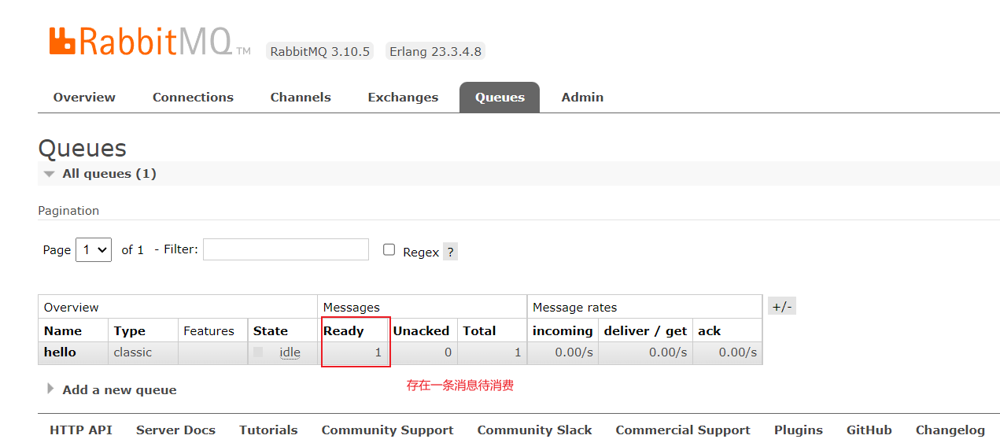
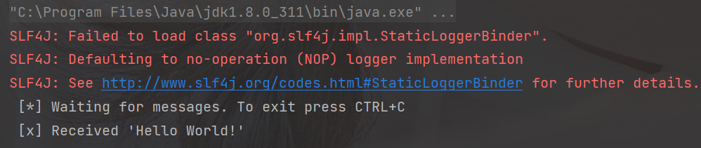
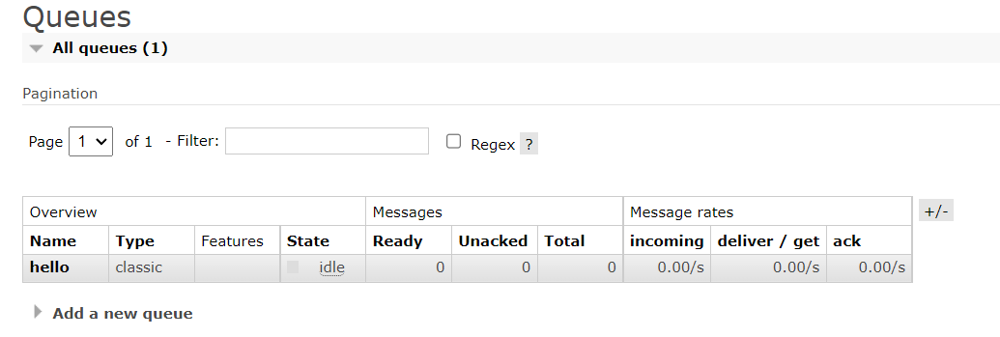

> 官网Hello World地址：https://www.rabbitmq.com/tutorials/tutorial-one-java.html

#### 1、新建maven项目

添加依赖

```xml
<?xml version="1.0" encoding="UTF-8"?>
<project xmlns="http://maven.apache.org/POM/4.0.0"
         xmlns:xsi="http://www.w3.org/2001/XMLSchema-instance"
         xsi:schemaLocation="http://maven.apache.org/POM/4.0.0 http://maven.apache.org/xsd/maven-4.0.0.xsd">
    <modelVersion>4.0.0</modelVersion>

    <groupId>org.example</groupId>
    <artifactId>xiaobear-RabbitMQ</artifactId>
    <version>1.0-SNAPSHOT</version>

    <properties>
        <maven.compiler.source>8</maven.compiler.source>
        <maven.compiler.target>8</maven.compiler.target>
    </properties>

    <dependencies>
        <dependency>
            <groupId>com.rabbitmq</groupId>
            <artifactId>amqp-client</artifactId>
            <version>5.13.1</version>
        </dependency>
    </dependencies>

</project>
```


#### 2、建生产者类

```java
public class Product {

    private final static String QUEUE_NAME = "hello";

    public static void main(String[] args) throws Exception {
        //创建连接
        ConnectionFactory factory = new ConnectionFactory();
        factory.setHost("192.168.130.134");
        factory.setUsername("admin");
        factory.setPassword("admin123");
        //channel 实现了自动 close 接口 自动关闭 不需要显示关闭
        try (Connection connection = factory.newConnection();
             Channel channel = connection.createChannel()) {
            /**
             * 生成一个队列
             * 1.队列名称
             * 2.队列里面的消息是否持久化 默认消息存储在内存中
             * 3.该队列是否只供一个消费者进行消费 是否进行共享 true 可以多个消费者消费
             * 4.是否自动删除 最后一个消费者端开连接以后 该队列是否自动删除 true 自动删除
             * 5.其他参数
             */
            channel.queueDeclare(QUEUE_NAME, false, false, false, null);
            String message = "Hello World!";
            /**
             * 发送一个消息
             * 1.发送到那个交换机
             * 2.路由的 key 是哪个
             * 3.其他的参数信息
             * 4.发送消息的消息体
             */
            channel.basicPublish("", QUEUE_NAME, null, message.getBytes());
            System.out.println(" [x] Sent '" + message + "'");
        }
    }
}
```

执行后，打开管理面板，会发现，存在一条消息待消费



#### 3、建消费者类

```java
public class RabbitMQConfig {

    /**
     * rabbitmq连接信息
     * @return
     */
    public static ConnectionFactory connectRabbitMq(){
        //创建连接
        ConnectionFactory factory = new ConnectionFactory();
        factory.setHost("192.168.130.134");
        factory.setUsername("admin");
        factory.setPassword("admin123");
        return factory;
    }
}
```


```java
public class Consumer {
    private final static String QUEUE_NAME = "hello";

    public static void main(String[] args) throws Exception {
        //创建连接诶信息
        ConnectionFactory factory = RabbitMQConfig.connectRabbitMq();

        Connection connection = factory.newConnection();
        Channel channel = connection.createChannel();

        channel.queueDeclare(QUEUE_NAME, false, false, false, null);
        System.out.println(" [*] Waiting for messages. To exit press CTRL+C");
        //推送的消息如何进行消费的接口回调
        DeliverCallback deliverCallback = (consumerTag, delivery) -> {
            String message = new String(delivery.getBody(), "UTF-8");
            System.out.println(" [x] Received '" + message + "'");
        };
        /**
         * 消费者消费消息
         * 1.消费哪个队列
         * 2.消费成功之后是否要自动应答 true 代表自动应答 false 手动应答
         * 3.消费者未成功消费的回调
         */
        channel.basicConsume(QUEUE_NAME, true, deliverCallback, consumerTag -> { });
    }
}
```

执行消费者后，控制台打印出消费的消息，此时管理面板待消费的消息为0






#### 4、遇到的问题

##### 1、Connection timed out: connect

> 查看5672端口是否开放


##### 2、connection error; protocol method: #method<connection.close>(reply-code=530, reply-text=NOT_ALLOWED

> ```
> rabbitmqctl set_permissions -p "/" admin ".*" ".*" ".*"
> ```
>
> 把`Virtual Host`为【/】的set permission给用户
