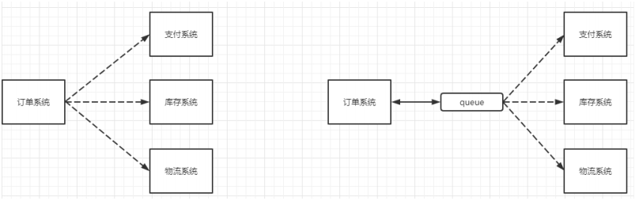
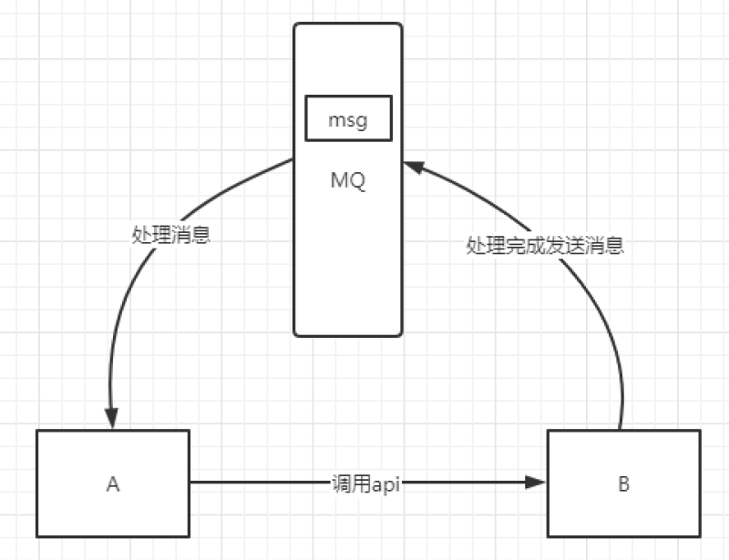
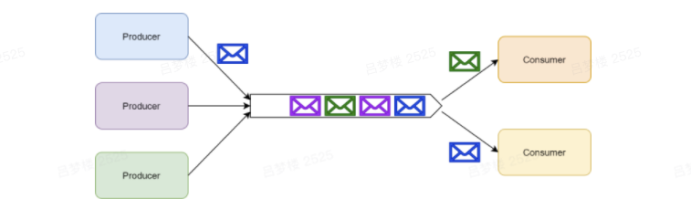
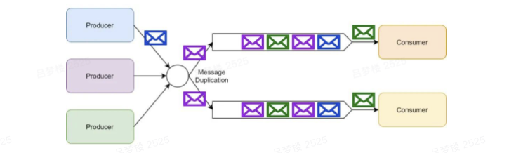
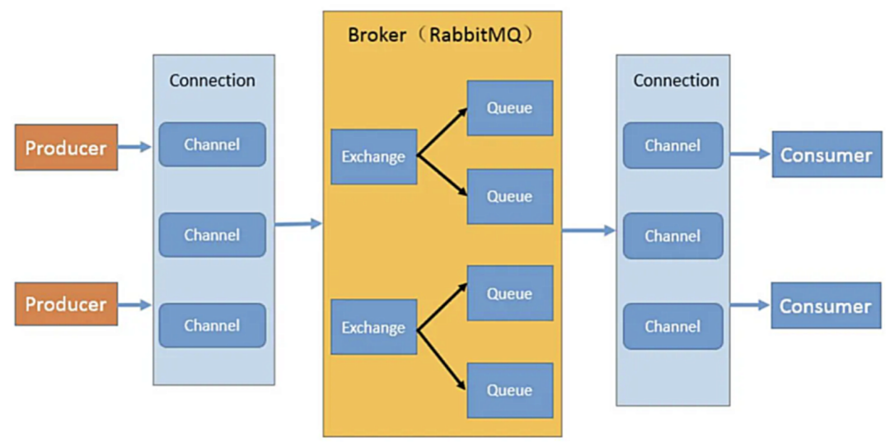

### 1、`MQ`的相关概念

#### 1、什么是MQ

> `MQ(message queue)`，从字面意思上看，本质是个队列，`FIFO` 先入先出，只不过队列中存放的内容是`message `而已，还是一种**跨进程**的通信机制，用于上下游传递消息。
>
> 在互联网架构中，`MQ` 是一种非常常见的上下游“**逻辑解耦+物理解**耦”的消息通信服务。使用了` MQ `之后，消息发送上游只需要依赖` MQ`，不用依赖其他服务。


#### 2、为什么要使用MQ

##### 1、流量消峰

> 举个例子：如果订单系统最多能处理一万次订单，这个处理能力应付正常时段的下单时绰绰有余，正常时段我们下单一秒后就能返回结果。但是在高峰期，如果有两万次下单操作系统是处理不了的，只能限制订单超过一万后不允许用户下单。使用消息队列做缓冲，我们可以取消这个限制，把一秒内下的订单分散成一段时间来处理，这时有些用户可能在下单十几秒后才能收到下单成功的操作，但是比不能下单的体验要好。


##### 2、应用解耦

> 以电商应用为例，应用中有订单系统、库存系统、物流系统、支付系统。用户创建订单后，如果耦合调用库存系统、物流系统、支付系统，任何一个子系统出了故障，都会造成下单操作异常。当转变成基于消息队列的方式后，系统间调用的问题会减少很多，比如物流系统因为发生故障，需要几分钟来修复。在这几分钟的时间里，物流系统要处理的内存被缓存在消息队列中，用户的下单操作可以正常完成。当物流系统恢复后，继续处理订单信息即可，中单用户感受不到物流系统的故障，提升系统的可用性。




##### 3、异步处理

> 有些服务间调用是异步的，例如 A 调用 B，B 需要花费很长时间执行，但是 A 需要知道 B 什么时候可以执行完，以前一般有两种方式：
>
> 1. A 过一段时间去调用 B 的查询 api 查询
> 2. A 提供一个 callback api， B 执行完之后调用 api 通知 A 服务。
>
> 这两种方式都不是很优雅，使用消息总线，可以很方便解决这个问题，A 调用 B 服务后，只需要监听 B 处理完成的消息，当 B 处理完成后，会发送一条消息给 MQ，MQ 会将此消息转发给 A 服务。这样 A 服务既不用循环调用 B 的查询 api，也不用提供 callback api。同样 B 服务也不用做这些操作。A 服务还能及时的得到异步处理成功的消息。




#### 3、MQ的分类

##### 1、`ActiveMQ`

> 优点：单机吞吐量万级，时效性 ms 级，可用性高，基于主从架构实现高可用性，消息可靠性较低的概率丢失数据
>
> 缺点：官方社区现在对 ActiveMQ 5.x 维护越来越少，高吞吐量场景较少使用。


##### 2、`Kafka`

> 大数据的杀手锏，谈到大数据领域内的消息传输，则绕不开 Kafka，这款为大数据而生的消息中间件，以其百万级 TPS 的吞吐量名声大噪，迅速成为大数据领域的宠儿，在数据采集、传输、存储的过程中发挥着举足轻重的作用。目前已经被 LinkedIn，Uber, Twitter, Netflix 等大公司所采纳。
>
> 优点：性能卓越，单机写入 TPS 约在百万条/秒，最大的优点，就是**吞吐量高**。时效性 ms 级可用性非常高，kafka 是分布式的，一个数据多个副本，少数机器宕机，不会丢失数据，不会导致不可用,消费者采用 Pull 方式获取消息, 消息有序, 通过控制能够保证所有消息被消费且仅被消费一次;有优秀的第三方Kafka Web 管理界面 Kafka-Manager；在日志领域比较成熟，被多家公司和多个开源项目使用；功能支持：功能较为简单，主要支持简单的 MQ 功能，在大数据领域的实时计算以及日志采集被大规模使用.
>
> 缺点：Kafka 单机超过 64 个队列/分区，Load 会发生明显的飙高现象，队列越多，load 越高，发送消息响应时间变长，使用短轮询方式，实时性取决于轮询间隔时间，消费失败不支持重试；支持消息顺序，但是一台代理宕机后，就会产生消息乱序，**社区更新较慢**；


##### 3、`RocketMQ`

> RocketMQ 出自阿里巴巴的开源产品，用 Java 语言实现，在设计时参考了 Kafka，并做出了自己的一些改进。被阿里巴巴广泛应用在订单，交易，充值，流计算，消息推送，日志流式处理，binglog 分发等场景。
>
> 优点:单机吞吐量十万级,可用性非常高，分布式架构,消息可以做到 0 丢失,MQ 功能较为完善，还是分布式的，扩展性好,支持 10 亿级别的消息堆积，不会因为堆积导致性能下降,源码是 java 我们可以自己阅读源码，定制自己公司的 MQ
>
> 缺点：支持的客户端语言不多，目前是 java 及 c++，其中 c++不成熟；社区活跃度一般,没有在 MQ核心中去实现 JMS 等接口,有些系统要迁移需要修改大量代码


##### 4、`RabbitMQ`

> 2007 年发布，是一个在 AMQP(高级消息队列协议)基础上完成的，可复用的企业消息系统，是当前最主流的消息中间件之一。
>
> 优点：由于 erlang 语言的高并发特性，性能较好；吞吐量到万级，MQ 功能比较完备,健壮、稳定、易用、跨平台、支持多种语言 如：Python、Ruby、.NET、Java、JMS、C、PHP、ActionScript、XMPP、STOMP等，支持 AJAX 文档齐全；开源提供的管理界面非常棒，用起来很好用,社区活跃度高；更新频率相当高
>
> 缺点：商业版需要收费,学习成本较高


##### 对比

| 特性                     | ActiveMQ                                        | Kafka                                                        | RocketMQ                                                     | RabbitMQ                                           |
| ------------------------ | ----------------------------------------------- | ------------------------------------------------------------ | ------------------------------------------------------------ | -------------------------------------------------- |
| 单机吞吐量               | 单机吞吐量万级，比 RocketMQ、Kafka 低一个数量级 | 10 万级，高吞吐，一般配合大数据类的系统来进行实时数据计算、日志采集等场景 | 10 万级，支撑高吞吐                                          | 吞吐量到万级                                       |
| topic 数量对吞吐量的影响 |                                                 | topic 从几十到几百个时候，吞吐量会大幅度下降，在同等机器下，Kafka 尽量保证 topic 数量不要过多，如果要支撑大规模的 topic，需要增加更多的机器资源 | topic 可以达到几百/几千的级别，吞吐量会有较小幅度的下降，这是 RocketMQ 的一大优势，在同等机器下，可以支撑大量的 topic |                                                    |
| 时效性                   | ms级                                            | 延迟在 ms 级以内                                             | ms 级                                                        | 微秒级，这是 RabbitMQ 的一大特点，延迟最低         |
| 可用性                   | 高，基于主从架构实现高可用                      | 非常高，分布式，一个数据多个副本，少数机器宕机，不会丢失数据，不会导致不可用 | 非常高，分布式架构                                           | 高，基于主从架构实现高可用                         |
| 消息可靠性               | 有较低的概率丢失数据                            | 经过参数优化配置，可以做到 0 丢失                            | 经过参数优化配置，可以做到 0 丢失                            | 基本不丢                                           |
| 功能支持                 | MQ 领域的功能极其完备                           | 功能较为简单，主要支持简单的 MQ 功能，在大数据领域的实时计算以及日志采集被大规模使用 | MQ 功能较为完善，还是分布式的，扩展性好                      | 基于 erlang 开发，并发能力很强，性能极好，延时很低 |


####  4、MQ的选择

对消息队列进行技术选型时，需要通过以下指标衡量你所选择的消息队列，是否可以满足你的需求：

- **消息顺序**：发送到队列的消息，消费时是否可以保证消费的顺序，比如A先下单，B后下单，应该是A先去扣库存，B再去扣，顺序不能反。
- **消息路由**：根据路由规则，只订阅匹配路由规则的消息，比如有A/B两者规则的消息，消费者可以只订阅A消息，B消息不会消费。
- 消息可靠性：是否会存在丢消息的情况，比如有A/B两个消息，最后只有B消息能消费，A消息丢失。
- **消息时序**：主要包括“消息存活时间”和“延迟/预定的消息”，“消息存活时间”表示生产者可以对消息设置TTL，如果超过该TTL，消息会自动消失；“延迟/预定的消息”指的是可以延迟或者预订消费消息，比如延时5分钟，那么消息会5分钟后才能让消费者消费，时间未到的话，是不能消费的。
- **消息留存**：消息消费成功后，是否还会继续保留在消息队列。
- **容错性**：当一条消息消费失败后，是否有一些机制，保证这条消息是一种能成功，比如异步第三方退款消息，需要保证这条消息消费掉，才能确定给用户退款成功，所以必须保证这条消息消费成功的准确性。
- **伸缩**：当消息队列性能有问题，比如消费太慢，是否可以快速支持库容；当消费队列过多，浪费系统资源，是否可以支持缩容。
- **吞吐量**：支持的最高并发数


##### 1、`kafka`

> Kafka主要特点是基于Pull的模式来处理消息消费，追求高吞吐量，一开始的目的就是用于日志收集和传输，适合产生大量数据的互联网服务的数据收集业务。大型公司建议可以选用，如果有日志采集、实时计算功能，肯定是首选kafka。


##### 2、`RocketMQ`

> 天生为金融互联网领域而生，对于可靠性要求很高的场景，尤其是电商里面的订单扣款，以及业务削峰，在大量交易涌入时，后端可能无法及时处理的情况。RoketMQ在稳定性上可能更值得信赖，这些业务场景在阿里双11已经经历了多次考验，如果你的业务有上述并发场景，建议可以选择RocketMQ。


##### 3、`RabbitMQ`

> ==结合erlang==语言本身的并发优势，性能好时效性微秒级，社区活跃度也比较高，管理界面用起来十分方便，如果你的数据量没有那么大，中小型公司优先选择功能比较完备的RabbitMQ。


### 2、消息队列模式

#### 1、点对点模式

> 一个具体的消息只能由一个消费者消费，多个生产者可以向同一个消息队列发送消息，但是一个消息在被一个消息者处理的时候，这个消息在队列上会被锁住或者被移除并且其他消费者无法处理该消息。
>
> 需要额外注意的是，如果消费者处理一个消息失败了，消息系统一般会把这个消息放回队列，这样其他消费者可以继续处理。




#### 2、发布/订阅模式

> 单个消息可以被多个订阅者并发的获取和处理。一般来说，订阅有两种类型：
>
> - **临时（ephemeral）订阅**：这种订阅只有在消费者启动并且运行的时候才存在。一旦消费者退出，相应的订阅以及尚未处理的消息就会丢失。
> - **持久（durable）订阅**：这种订阅会一直存在，除非主动去删除。消费者退出后，消息系统会继续维护该订阅，并且后续消息可以被继续处理。




### 3、`RabbitMQ`

#### 1、什么是`RabbitMQ`

> `RabbitMQ`是一个消息中间件：它接受并转发消息。你可以把它当做一个快递站点，当你要发送一个包裹时，你把你的包裹放到快递站，快递员最终会把你的快递送到收件人那里，按照这种逻辑`RabbitMQ`是一个快递站，一个快递员帮你传递快件。`RabbitMQ`与快递站的主要区别在于，它不处理快件而是接收，存储和转发消息数据。


#### 2、四大核心概念

##### 1、生产者

> 产生数据发送消息的程序是生产者


##### 2、交换机

> 交换机是RabbitMQ非常重要的一个部件，一方面它接收来自生产者的消息，另一方面它将消息推送到队列中。交换机必须确切知道如何处理它接收到的消息，是将这些消息推送到特定队列还是推送到多个队列，亦或者是把消息丢弃，这个得有交换机类型决定。


##### 3、队列

> 队列是RabbitMQ内部使用的一种数据结构，尽管消息流经RabbitMQ和应用程序，但它们只能存储在队列中。队列仅受主机的内存和磁盘限制的约束，本质上是一个大的消息缓冲区。许多生产者可以将消息发送到一个队列，许多消费者可以尝试从一个队列接收数据。这就是我们使用队列的方式


##### 4、消费者

> 消费与接收具有相似的含义。消费者大多时候是一个等待接收消息的程序。请注意生产者，消费者和消息中间件很多时候并不在同一机器上。同一个应用程序既可以是生产者又是可以是消费者。


#### 3、基本概念

> 提到`RabbitMQ`，就不得不提`AMQP`协议。`AMQP`协议是具有现代特征的二进制协议。是一个提供统一消息服务的应用层标准高级消息队列协议，是应用层协议的一个开放标准，为面向消息的中间件设计。

先了解一下`AMQP`协议中间的几个重要概念：

- **Server**：接收客户端的连接，实现`AMQP`实体服务。

- **Connection**：连接，应用程序与Server的网络连接，TCP连接。

- **Channel**：信道，消息读写等操作在信道中进行。客户端可以建立多个信道，每个信道代表一个会话任务。如果每一次访问 RabbitMQ 都建立一个 Connection，在消息量大的时候建立 TCP Connection 的开销将是巨大的，效率也较低。Channel 是在 connection 内部建立的逻辑连接，如果应用程序支持多线程，通常每个 thread 创建单独的 channel 进行通讯，AMQP method 包含了 channel id 帮助客户端和 message broker 识别 channel，所以 channel 之间是完全隔离的。**Channel 作为轻量级的**

  **Connection** **极大减少了操作系统建立** **TCP connection** **的开销**

- **Message**：消息，应用程序和服务器之间传送的数据，消息可以非常简单，也可以很复杂。由Properties和Body组成。Properties为外包装，可以对消息进行修饰，比如消息的优先级、延迟等高级特性；Body就是消息体内容。

- **Virtual Host**：虚拟主机，用于逻辑隔离。一个虚拟主机里面可以有若干个Exchange和Queue，同一个虚拟主机里面不能有相同名称的Exchange或Queue。

- **Exchange**：交换器，接收消息，按照路由规则将消息路由到一个或者多个队列。如果路由不到，或者返回给生产者，或者直接丢弃。`RabbitMQ`常用的交换器常用类型有direct、topic、fanout、headers四种，后面详细介绍。

- **Binding**：绑定，交换器和消息队列之间的虚拟连接，绑定中可以包含一个或者多个`RoutingKey`，Binding 信息被保存到 exchange 中的查询表中，用于 message 的分发依据

- `RoutingKey`：路由键，生产者将消息发送给交换器的时候，会发送一个`RoutingKey`，用来指定路由规则，这样交换器就知道把消息发送到哪个队列。路由键通常为一个“.”分割的字符串，例如`“com.rabbitmq”`。

- **Queue**：消息队列，用来保存消息，供消费者消费。


#### 4、工作原理

不得不看一下经典的图了，如下:point_down:



AMQP 协议模型由三部分组成：生产者、消费者和服务端，执行流程如下：

1. 生产者是连接到 Server，建立一个连接，开启一个信道。
2. 生产者声明交换器和队列，设置相关属性，并通过路由键将交换器和队列进行绑定。
3. 消费者也需要进行建立连接，开启信道等操作，便于接收消息。
4. 生产者发送消息，发送到服务端中的虚拟主机。
5. 虚拟主机中的交换器根据路由键选择路由规则，发送到不同的消息队列中。
6. 订阅了消息队列的消费者就可以获取到消息，进行消费。


#### 5、环境搭建

> 我使用的Linux搭建，搭建流程可参考官网：https://www.rabbitmq.com/install-rpm.html
>
> 查看系统版本号，Rabbitmq 对 Erlang 有版本要求，不能使用太旧的Erlang版本：https://www.rabbitmq.com/which-erlang.html
>
> Erlang下载地址：https://github.com/rabbitmq/erlang-rpm/releases


##### 1、下载rpm包

> - erlang-23.3.4.8-1.el7.x86_64.rpm
>
> - rabbitmq-server-3.10.5-1.el8.noarch.rpm


##### 2、上传至服务器

```
#创建存放目录
mkdir -p /usr/rabbitmq
```


##### 3、安装文件

```
[root@xiaobear rabbitmq]## rpm -Uvih erlang-25.0.2-1.el8.x86_64.rpm 
警告：erlang-25.0.2-1.el8.x86_64.rpm: 头V4 RSA/SHA256 Signature, 密钥 ID cc4bbe5b: NOKEY
错误：依赖检测失败：
	libcrypto.so.1.1()(64bit) 被 erlang-25.0.2-1.el8.x86_64 需要
	libcrypto.so.1.1(OPENSSL_1_1_0)(64bit) 被 erlang-25.0.2-1.el8.x86_64 需要
	libcrypto.so.1.1(OPENSSL_1_1_1)(64bit) 被 erlang-25.0.2-1.el8.x86_64 需要
	libstdc++.so.6(CXXABI_1.3.9)(64bit) 被 erlang-25.0.2-1.el8.x86_64 需要
	libtinfo.so.6()(64bit) 被 erlang-25.0.2-1.el8.x86_64 需要
	libz.so.1(ZLIB_1.2.7.1)(64bit) 被 erlang-25.0.2-1.el8.x86_64 需要
```

PS：这是因为下载版本的问题，el8下载的是8的版本，改回下载7的就可以了

我下载的版本：[erlang-23.3.4.8-1.el7.x86_64.rpm](https://github.com/rabbitmq/erlang-rpm/releases/download/v23.3.4.8/erlang-23.3.4.8-1.el7.x86_64.rpm)

```
[root@xiaobear rabbitmq]## rpm -Uivh erlang-23.3.4.8-1.el7.x86_64.rpm 
警告：erlang-23.3.4.8-1.el7.x86_64.rpm: 头V4 RSA/SHA256 Signature, 密钥 ID cc4bbe5b: NOKEY
准备中...                          ################################## [100%]
正在升级/安装...
   1:erlang-23.3.4.8-1.el7            ################################## [100%]
[root@xiaobear rabbitmq]## yum install socat -y
```

查看版本

```
## 测试
erl -version
```

`rabbitmq `在安装过程中需要依赖`socat`这个插件，需要先安装

```
[root@xiaobear rabbitmq]## rpm -ivh rabbitmq-server-3.10.5-1.el8.noarch.rpm 
警告：rabbitmq-server-3.10.5-1.el8.noarch.rpm: 头V4 RSA/SHA512 Signature, 密钥 ID 6026dfca: NOKEY
准备中...                          ################################## [100%]
正在升级/安装...
   1:rabbitmq-server-3.10.5-1.el8     ################################## [100%]
[root@xiaobear rabbitmq]## 
```


##### 4、常用命令

```
#开机启动 chkconfig rabbitmq-server on会转发到下面命令
systemctl enable rabbitmq-server.service
## 启动服务
systemctl start rabbitmq-server
## 查看服务状态，running表示启动成功
systemctl status rabbitmq-server.service
## 开机自启动
systemctl enable rabbitmq-server
## 停止服务
systemctl stop rabbitmq-server
```


##### 5、安装Web管理插件

```
rabbitmq-plugins enable rabbitmq_management
#安装完成后，重启服务
systemctl restart rabbitmq-server
```


##### 6、访问web页面

访问地址：服务器 IP+端口号（默认15672）,若没有反应，请开放端口，执行下面命令

```
## 防火墙开放15672端口
firewall-cmd --zone=public --add-port=15672/tcp --permanent
firewall-cmd --reload
```

注意：

- 在对应服务器（阿里云，腾讯云等）的安全组中开放`15672`端口（rabbitmq默认端口号），5672端口后续程序需要使用也要开放
- rabbitmq有一个默认账号和密码都是：`guest`默认情况只能在 localhost本计下访问，所以需要添加一个远程登录的用户


##### 7、添加用户

- 创建账号

  ```
  rabbitmqctl add_user admin admin123
  ```


- 分配角色

  ```
  rabbitmqctl set_user_tags admin administrator
  ```

  用户操作权限分四种级别：

    1. administrator：可以登录控制台、查看所有信息、可以对 rabbitmq进行管理
    2. monitoring：监控者 登录控制台，查看所有信息
    3. policymaker：策略制定者 登录控制台，指定策略
    4. managment 普通管理员 登录控制台

- 设置权限

  > `set_permissions [-p <vhostpath>] <user> <conf> <write> <read> ` 
  >
  > 用户 user_admin 具有/vhost1 这个 virtual host 中所有资源的配置、写、读权限当前用户和角色

  ```
  rabbitmqctl set_permissions -p "/" admin ".*" ".*" ".*"
  ```


- 再次访问登录，即可成功


##### 8、重置命令

```
#关闭应用的命令
rabbitmqctl stop_app
#清除的命令
rabbitmqctl reset
#重新启动命令
rabbitmqctl start_app
```


##### 9、其他命令

```
## 添加账号、密码
rabbitmqctl add_user
## 设置账号为管理员
rabbitmqctl set_user_tags 账号 administrator
## 修改账号密码
rabbitmqctl change_password Username Newpassword
## 查看用户清单
rabbitmqctl list_users
## 添加账号查看资源的权限
rabbitmqctl set_permissions -p / 用户名 ".*"".*"".*"
```
