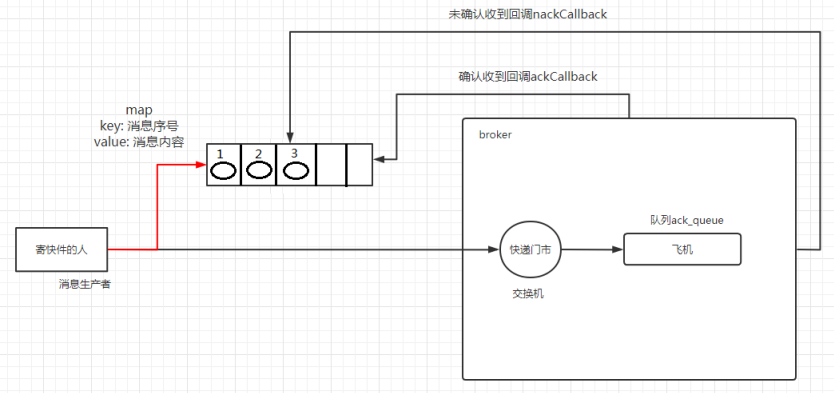

### 1、原理

> 生产者将信道设置成 confirm 模式，一旦信道进入 confirm 模式，**所有在该信道上面发布的消息都将会被指派一个唯一的 ID**(从 1 开始)，一旦消息被投递到所有匹配的队列之后，broker就会发送一个确认给生产者(包含消息的唯一 ID)，这就使得生产者知道消息已经正确到达目的队列了，如果消息和队列是可持久化的，那么确认消息会在将消息写入磁盘之后发出，broker 回传给生产者的确认消息中 delivery-tag 域包含了确认消息的序列号，此外 broker 也可以设置`basic.ack` 的 multiple 域，表示到这个序列号之前的所有消息都已经得到了处理。
>
> confirm 模式最大的好处在于它是异步的，一旦发布一条消息，生产者应用程序就可以在等信道返回确认的同时继续发送下一条消息，当消息最终得到确认之后，生产者应用便可以通过回调方法来处理该确认消息，如果 RabbitMQ 因为自身内部错误导致消息丢失，就会发送一条 nack 消息，生产者应用程序同样可以在回调方法中处理该 nack 消息。


### 2、发布确认策略

#### 1、开启发布确认

> 发布者确认是 `AMQP 0.9.1 `协议的` RabbitMQ `扩展，因此默认情况下不启用它们。使用`confirmSelect`方法在通道级别启用发布者确认

```java
Channel channel = connection.createChannel();
channel.confirmSelect();
```


#### 2、单独发布消息(Publishing Messages Individually)

> 这是一种简单的确认方式，它是一种**同步确认发布**的方式，也就是发布一个消息之后只有它被确认发布，后续的消息才能继续发布，`waitForConfirmsOrDie(long)`这个方法只有在消息被确认的时候才返回，如果在指定时间范围内这个消息没有被确认那么它将抛出异常。
>
> 这种确认方式有一个最大的缺点就是：**发布速度特别的慢，**因为如果没有确认发布的消息就会阻塞所有后续消息的发布，这种方式最多提供每秒不超过数百条发布消息的吞吐量。当然对于某些应用程序来说这可能已经足够了。

```java
public class PublishingMessagesIndividually {

    public static void main(String[] args) {
        try(Channel channel = RabbitMQConfig.getChannel()) {
            //随机生成队列
            String queryName = UUID.randomUUID().toString();
            //生成队列 不持久化 不共享 不删除 参数为空
            channel.queueDeclare(queryName, false, false, false, null);
            //开启发布确认
            channel.confirmSelect();
            long startTime = System.nanoTime();
            //消息数量为10
            for (int i = 0; i < 10; i++) {
                String message = i + "";
                channel.basicPublish("", queryName, null, message.getBytes());
                if (channel.waitForConfirms()) {
                    System.out.println("消息发送成功");

                }
            }
            long endTime = System.nanoTime();
            System.out.println("发布10" + "个单独确认消息,耗时" + (endTime - startTime) +
                    "ms");
        } catch (Exception e) {
            e.printStackTrace();
        }
    }
}
```

```
消息发送成功
消息发送成功
消息发送成功
消息发送成功
消息发送成功
消息发送成功
消息发送成功
消息发送成功
消息发送成功
消息发送成功
发布10个单独确认消息,耗时18288200ms
```


#### 3、批量确认发布(Publishing Messages in Batches)

> 上面那种方式非常慢，与单个等待确认消息相比，先发布一批消息然后一起确认可以极大地提高吞吐量，当然这种方式的缺点就是:**当发生故障导致发布出现问题时，不知道是哪个消息出现问题了，我们必须将整个批处理保存在内存中，以记录重要的信息而后重新发布消息**。当然这种方案仍然是同步的，也一样阻塞消息的发布。

```java
public class BatchesPublishingMessages {

    public static void main(String[] args) {
        try(Channel channel = RabbitMQConfig.getChannel()) {
            String queueName = UUID.randomUUID().toString();
            channel.queueDeclare(queueName, false, false, false, null);
            //开启发布确认
            channel.confirmSelect();
            //批量确认消息大小
            int msgSize = 100;
            //初始化未确认消息个数
            int outstandingMessageCount = 0;
            long start = System.currentTimeMillis();
            for (int i = 0; i < 10; i++) {
                String message = i + "";
                channel.basicPublish("", queueName, null, message.getBytes());
                outstandingMessageCount++;
                if (outstandingMessageCount == msgSize) {
                    channel.waitForConfirms();
                    outstandingMessageCount = 0;
                }
                //为了确保还有剩余没有确认消息 再次确认
                if (outstandingMessageCount > 0) {
                    channel.waitForConfirms();
                }

            }
            long end = System.currentTimeMillis();
            System.out.println("发布10"  + "个批量确认消息,耗时" + (end - start) +
                    "ms");
        } catch (Exception e) {
            e.printStackTrace();
        }
    }
}

```

```
发布10个批量确认消息,耗时6ms
```


#### 4、异步发布确认(Handling Publisher Confirms Asynchronously)

> 异步确认虽然编程逻辑比上两个要复杂，但是性价比最高，无论是可靠性还是效率都没得说，他是利用回调函数来达到消息可靠性传递的，这个中间件也是通过函数回调来保证是否投递成功，下面就让我们来详细讲解异步确认是怎么实现的？



```java
public class AsyncHandlingPublisherConfirms {

    public static void main(String[] args) throws Exception {
        asyncPublishMessage();
    }

    public static void asyncPublishMessage() throws Exception{
        try(Channel channel = RabbitMQConfig.getChannel()) {
            String queueName = UUID.randomUUID().toString();
            channel.queueDeclare(queueName, false, false, false, null);
            //开启发布确认
            channel.confirmSelect();
            /**
             * 线程安全有序的一个哈希表，适用于高并发的情况
             * 1.轻松的将序号与消息进行关联
             * 2.轻松批量删除条目 只要给到序列号
             * 3.支持并发访问
             */
            ConcurrentSkipListMap<Long, String> outstandingConfirms = new ConcurrentSkipListMap<>();
            ConfirmCallback callback = (sequenceNumber, multiple) ->{
                if (multiple){
                    //返回的是小于等于当前序列号的未确认消息 是一个 map
                    ConcurrentNavigableMap<Long, String> confirmed = outstandingConfirms.headMap(
                            sequenceNumber, true
                    );
                    //清除该部分未确认消息
                    confirmed.clear();
                }else {
                    //只清除当前序列号的消息
                    outstandingConfirms.remove(sequenceNumber);
                }
            };
            ConfirmCallback nackCallback = (sequenceNumber, multiple) -> {
                String message = outstandingConfirms.get(sequenceNumber);
                System.out.println("发布的消息"+message+"未被确认，序列号"+sequenceNumber);
            };
            //接收消息回调 未接收消息回调
            channel.addConfirmListener(callback, null);
            long begin = System.currentTimeMillis();
            for (int i = 0; i < 10; i++) {
                String message = "消息" + i;
                /**
                 * channel.getNextPublishSeqNo()获取下一个消息的序列号
                 * 通过序列号与消息体进行一个关联
                 * 全部都是未确认的消息体
                 */
                outstandingConfirms.put(channel.getNextPublishSeqNo(), message);
                channel.basicPublish("", queueName, null, message.getBytes());
            }
            long end = System.currentTimeMillis();
            System.out.println("发布10" + "个异步确认消息,耗时" + (end - begin) +
                    "ms");
        }
    }
}
```

```
发布10个异步确认消息,耗时4ms
```


#### 5、如何处理异步未确认消息

> 最好的解决的解决方案就是把未确认的消息放到一个基于内存的能被发布线程访问的队列，比如说用 ConcurrentLinkedQueue 这个队列在 confirm callbacks 与发布线程之间进行消息的传递。


#### 6、对比

| 类型         | 优点                                                 | 缺点                                         |
| ------------ | ---------------------------------------------------- | -------------------------------------------- |
| 单独发布确认 | 同步等待确认，简单                                   | 吞吐量有限，100左右                          |
| 批量发布确认 | 批量同步等待确认，简单，合理的吞吐量                 | 一旦出现问题但很难推断出是那条消息出现了问题 |
| 异步发布确认 | 最佳性能和资源使用，在出现错误的情况下可以很好地控制 | 实现起来稍微难些                             |

```
1000个消息的执行时间对比
发布1000个单独确认消息,耗时561ms
发布1000个批量确认消息,耗时558ms
发布1000个异步确认消息,耗时42ms
```
