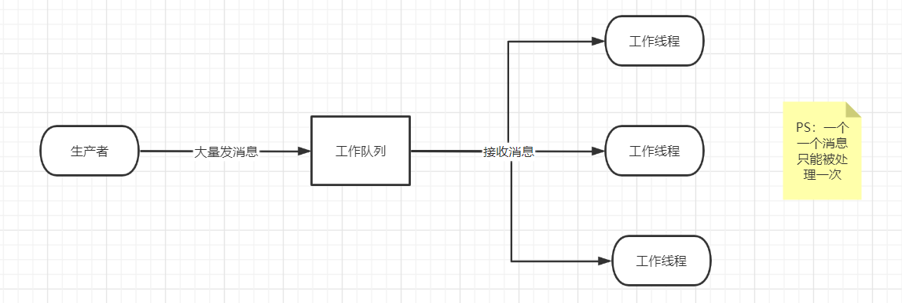
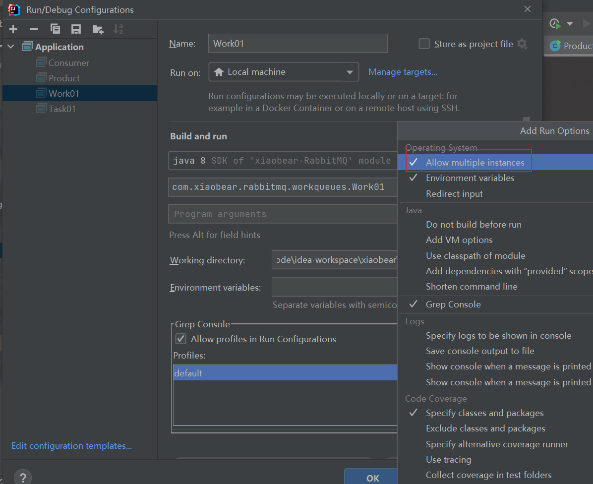
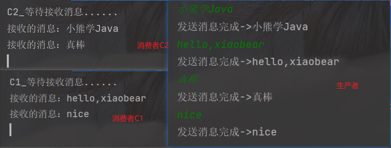
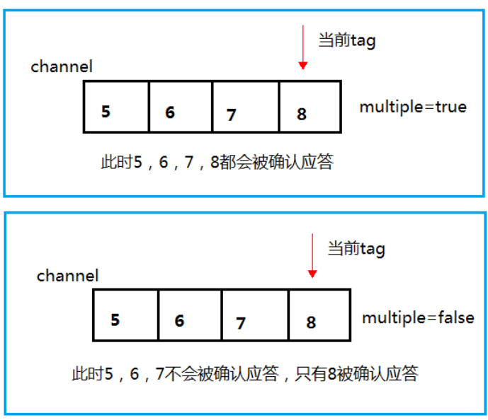
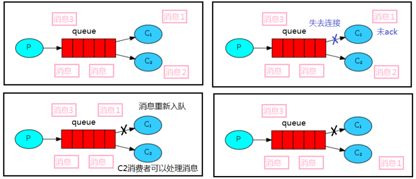
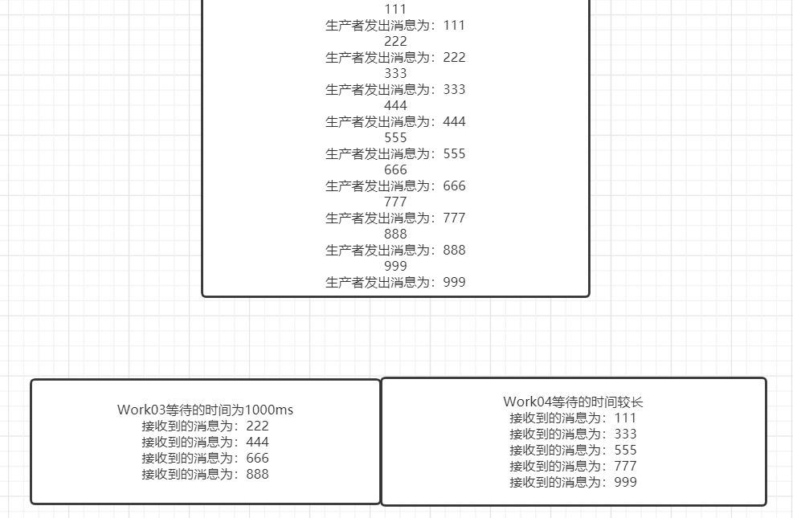
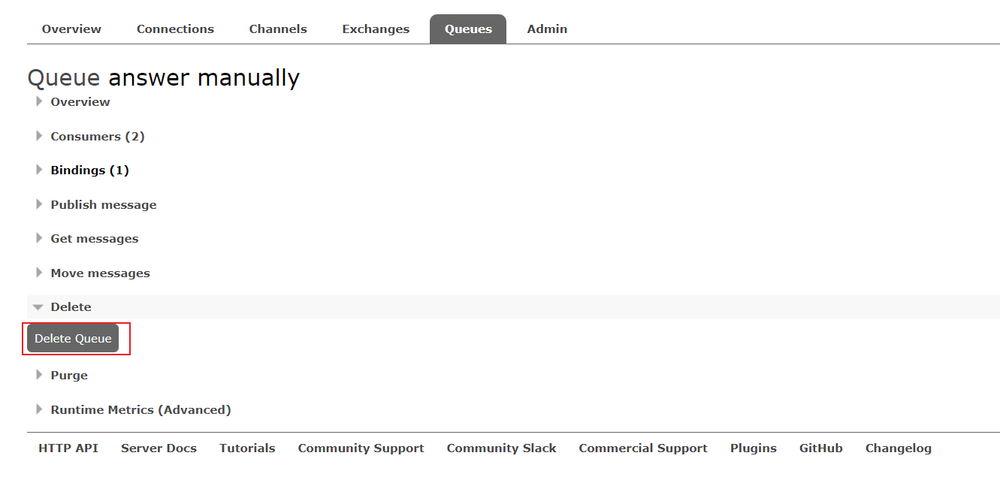
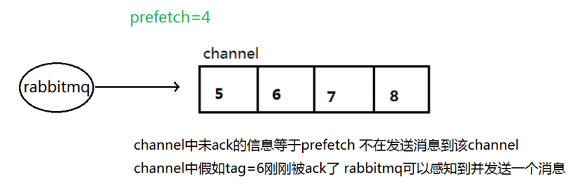

> The main idea behind Work Queues (aka: *Task Queues*) is to avoid doing a resource-intensive task immediately and having to wait for it to complete. Instead we schedule the task to be done later. We encapsulate a *task* as a message and send it to a queue. A worker process running in the background will pop the tasks and eventually execute the job. When you run many workers the tasks will be shared between them.
>
> 工作队列(又称任务队列)的主要思想是避免立即执行资源密集型任务，而不得不等待它完成。相反我们安排任务在之后执行。我们把任务封装为消息并将其发送到队列。在后台运行的工作进程将弹出任务并最终执行作业。当有多个工作线程时，这些工作线程将一起处理这些任务。


### 1、轮训分发消息



工作线程接收消息，采用轮询接收，三个线程中只有一个能接收到

> 案例：启动两个线程，一个线程发送消息，看看他们是如何工作的？

#### 1、抽取工具类

```java
public class RabbitMQConfig {

    /**
     * rabbitmq连接信息
     * @return
     */
    public static ConnectionFactory connectRabbitMq(){
        //创建连接
        ConnectionFactory factory = new ConnectionFactory();
        factory.setHost("192.168.130.134");
        factory.setUsername("admin");
        factory.setPassword("admin123");
        return factory;
    }

    /**
     * 得到一个连接的 channel
     * @return
     */
    public static Channel getChannel() throws Exception {
        //创建连接
        ConnectionFactory factory = connectRabbitMq();
        Connection connection = factory.newConnection();
        Channel channel = connection.createChannel();
        return channel;
    }
}
```


#### 2、启动两个线程

##### 1、消费者

```java
public class Work01 {

    private static final String QUEUE_NAME = "workQueues";

    public static void main(String[] args) throws Exception {
        //获取信道
        Channel channel = RabbitMQConfig.getChannel();

        channel.queueDeclare(QUEUE_NAME, false, false, false, null);
        //消息的接收
        DeliverCallback deliverCallback = (custom, deliver) ->{
            System.out.println("接收的消息：" + new String(deliver.getBody()));
        };

        //消息被取消的回调
        CancelCallback callback = (item) ->{
            System.out.println("取消的消息为：" + item);
        };
        /**
         * 消费者消费消息
         * 1.消费哪个队列
         * 2.消费成功之后是否要自动应答 true 代表自动应答 false 手动应答
         * 3.消费者未成功消费的回调
         */
        System.out.println("C2_等待接收消息......");
        channel.basicConsume(QUEUE_NAME, true, deliverCallback, callback);
    }
}
```


##### 2、生产者

```java
public class Task01 {

    private static final String QUEUE_NAME = "workQueues";

    public static void main(String[] args) throws Exception{
        try(Channel channel = RabbitMQConfig.getChannel()){
            /**
             * 生成一个队列
             * 1.队列名称
             * 2.队列里面的消息是否持久化 默认消息存储在内存中
             * 3.该队列是否只供一个消费者进行消费 是否进行共享 true 可以多个消费者消费
             * 4.是否自动删除 最后一个消费者端开连接以后 该队列是否自动删除 true 自动删除
             * 5.其他参数
             */
            channel.queueDeclare(QUEUE_NAME, false, false, false, null);

            Scanner sc = new Scanner(System.in);
            while (sc.hasNext()){
                String next = sc.next();
                /**
                 * 发送一个消息
                 * 1.发送到那个交换机
                 * 2.路由的 key 是哪个
                 * 3.其他的参数信息
                 * 4.发送消息的消息体
                 */
                channel.basicPublish("", QUEUE_NAME, null, next.getBytes());
                System.out.println("发送消息完成->" + next);
            }
        }
    }
}
```


##### 3、测试

启动消费者，然后勾选`all ... instance`，允许多个实例




##### 4、测试结果

通过程序执行发现生产者总共发送 4 个消息，消费者 1 和消费者 2 分别分得两个消息，并且是按照有序的一个接收一次消息




### 2、消息应答

#### 1、概念

> 消费者完成一个任务可能需要一段时间，如果其中一个消费者处理一个长的任务并且只完成了部分突然它挂掉了，会发生什么情况？
>
> `RabbitMQ` 一旦向消费者传递了一条消息，便立即将该消息标记为删除。在这种情况下，突然有个消费者挂掉了，我们将丢失正在处理的消息。以及后续发送给该消费这的消息，因为它无法接收到。
>
> 为了保证消息在发送过程中不丢失，`rabbitmq` 引入消息应答机制，消息应答就是:**消费者在接收到消息并且处理该消息之后，告诉 `rabbitmq` 它已经处理了，`rabbitmq `可以把该消息删除了。**


#### 2、自动应答

> 消息发送后立即被认为已经传送成功，这种模式需要在**高吞吐量和数据传输安全性方面做权衡**,因为这种模式如果消息在接收到之
>
> 前，消费者那边出现连接或者 channel 关闭，那么消息就丢失了，当然另一方面这种模式消费者那边可以传递过载的消息，**没有对**
>
> **传递的消息数量进行限制**，当然这样有可能使得消费者这边由于接收太多还来不及处理的消息，导致这些消息的积压，最终使
>
> 得内存耗尽，最终这些消费者线程被操作系统杀死，**所以这种模式仅适用在消费者可以高效并以某种速率能够处理这些消息的情况下使用**。


#### 3、消息应答的方法

> 1. `Channel.basicAck` (用于肯定确认)
     >
     >    ```
     >    RabbitMQ 已知道该消息并且成功的处理消息，可以将其丢弃了
     >    ```
>
> 2. `Channel.basicNack`(用于否定确认)
>
> 3. `Channel.basicReject` (用于否定确认)
     >
     >    ```
     >    与 Channel.basicNack 相比少一个参数 不处理该消息了直接拒绝，可以将其丢弃了
     >    ```


#### 4、`Multiple`

> **手动应答的好处是可以批量应答并且减少网络拥堵**

```java
//源码
public void basicAck(long deliveryTag, boolean multiple) throws IOException {
        this.delegate.basicAck(deliveryTag, multiple);
}
```

multiple 的 true 和 false 代表不同意思

- true 代表批量应答 channel 上未应答的消息

  > 比如说 channel 上有传送 tag 的消息 5,6,7,8 当前 tag 是 8 那么此时5-8 的这些还未应答的消息都会被确认收到消息应答

- false 同上面相比

  > 只会应答 tag=8 的消息 5,6,7 这三个消息依然不会被确认收到消息应答




#### 5、消息自动重新入队

> 如果消费者由于某些原因失去连接(其通道已关闭，连接已关闭或 TCP 连接丢失)，导致消息未发送 `ACK `确认，`RabbitMQ `将了解到消息未完全处理，并将对其重新排队。如果此时其他消费者可以处理，它将很快将其重新分发给另一个消费者。这样，即使某个消费者偶尔死亡，也可以确保不会丢失任何消息。




#### 6、手动应答实现

默认消息采用的是自动应答，所以我们要想实现消息消费过程中不丢失，需要把自动应答改为手动应答

```java
//最主要的变化为如下
channel.basicAck(delivery.getEnvelope().getDeliveryTag(), false);
//将自定应答关闭
boolean autoAck = false;
channel.basicConsume(TASK_QUEUE_NAME, autoAck, deliverCallback, consumerTag -> { });
```

```java
//官网案例
channel.basicQos(1); // accept only one unack-ed message at a time (see below)

DeliverCallback deliverCallback = (consumerTag, delivery) -> {
  String message = new String(delivery.getBody(), "UTF-8");

  System.out.println(" [x] Received '" + message + "'");
  try {
    doWork(message);
  } finally {
    System.out.println(" [x] Done");
    channel.basicAck(delivery.getEnvelope().getDeliveryTag(), false);
  }
};
boolean autoAck = false;
channel.basicConsume(TASK_QUEUE_NAME, autoAck, deliverCallback, consumerTag -> { });
```


##### 案例实现

> 采用一个生产者和两个消费者，消费者利用线程睡眠，来查看效果

- 生产者

  ```java
  public class Task02 {
  
      /** 手动应答队列 */
      public static final String ANSWER_MANUALLY = "answer manually";
  
      public static void main(String[] args) throws Exception{
          //获取信道
          try(Channel channel = RabbitMQConfig.getChannel()){
              //生成队列 不持久化 不共享 不删除 参数为空
              channel.queueDeclare(ANSWER_MANUALLY, false, false, false, null);
  
              Scanner scanner = new Scanner(System.in);
              while (scanner.hasNext()){
                  String message = scanner.nextLine();
                  channel.basicPublish("", ANSWER_MANUALLY, null, message.getBytes(StandardCharsets.UTF_8));
                  System.out.println("生产者发出消息为：" + message);
              }
          }
      }
  }
  ```


- 消费者

  ```java
  public class Work03 {
  
      /** 手动应答队列 */
      public static final String ANSWER_MANUALLY = "answer manually";
  
      public static void main(String[] args) throws Exception{
          Channel channel = RabbitMQConfig.getChannel();
          System.out.println("Work03等待的时间为1000ms");
          DeliverCallback deliverCallback = (consumerTag, deliver) ->{
              String message = new String(deliver.getBody());
              try {
                  Thread.sleep(1000);
              } catch (InterruptedException e) {
                  e.printStackTrace();
              }
              System.out.println("接收到的消息为：" + message);
              //消息标记Tag 不批量显示应答消息
              channel.basicAck(deliver.getEnvelope().getDeliveryTag(), false);
          };
          //采用手动应答
          boolean autoAck = false;
          channel.basicConsume(ANSWER_MANUALLY, autoAck, deliverCallback, (consumerTag) ->{
              System.out.println(consumerTag + "消费者取消接收消息回调逻辑");
          });
      }
  
  }
  
  ```


```java
public class Work04 {

    /** 手动应答队列 */
    public static final String ANSWER_MANUALLY = "answer manually";

    public static void main(String[] args) throws Exception{
        Channel channel = RabbitMQConfig.getChannel();
        System.out.println("Work04等待的时间较长");
        DeliverCallback deliverCallback = (consumerTag, deliver) ->{
            String message = new String(deliver.getBody());
            try {
                Thread.sleep(3000);
            } catch (InterruptedException e) {
                e.printStackTrace();
            }
            System.out.println("接收到的消息为：" + message);
            //消息标记Tag 不批量显示应答消息
            channel.basicAck(deliver.getEnvelope().getDeliveryTag(), false);
        };
        //采用手动应答
        boolean autoAck = false;
        channel.basicConsume(ANSWER_MANUALLY, autoAck, deliverCallback, (consumerTag) ->{
            System.out.println(consumerTag + "消费者取消接收消息回调逻辑");
        });
    }

}
```


##### 结果显示

消息发送方发送两个消息 work03 和 work04 分别接收到消息并进行处理




### 3、持久化

#### 1、概念

> 刚刚我们已经看到了如何处理任务不丢失的情况，但是如何保障当 RabbitMQ 服务停掉以后消息生产者发送过来的消息不丢失。默认情况下 RabbitMQ 退出或由于某种原因崩溃时，它忽视队列和消息，除非告知它不要这样做。确保消息不会丢失需要做两件事：**我们需要将队列和消息都标记为持久化**。


#### 2、队列如何持久化

> 之前我们创建的队列都是非持久化的，`rabbitmq` 如果重启的化，该队列就会被删除掉，如果要队列实现持久化 需要在声明队列的时候把 durable 参数设置为持久化。

翻出之前的设置，第二个参数标记是否为持久化

```java
/**
* 生成一个队列
* 1.队列名称
* 2.队列里面的消息是否持久化 默认消息存储在内存中
* 3.该队列是否只供一个消费者进行消费 是否进行共享 true 可以多个消费者消费
* 4.是否自动删除 最后一个消费者端开连接以后 该队列是否自动删除 true 自动删除
* 5.其他参数
*/
channel.queueDeclare(QUEUE_NAME, false, false, false, null);
```

将上面的Task02改为true之后，启动报错了

```
Caused by: com.rabbitmq.client.ShutdownSignalException: channel error; protocol method: #method<channel.close>(reply-code=406, reply-text=PRECONDITION_FAILED - inequivalent arg 'durable' for queue 'answer manually' in vhost '/': received 'true' but current is 'false', class-id=50, method-id=10)
```

==PS：需要注意的就是如果之前声明的队列不是持久化的，需要把原先队列先删除，或者重新创建一个持久化的队列，不然就会出现错误==





#### 3、消息持久化

> 消息持久化需要增加属性`MessageProperties.PERSISTENT_TEXT_PLAIN`

```java
import com.rabbitmq.client.MessageProperties;

channel.basicPublish("", "task_queue",
            MessageProperties.PERSISTENT_TEXT_PLAIN,
            message.getBytes());
```

将消息标记为持久化并不能完全保证不会丢失消息。尽管它告诉 `RabbitMQ `将消息保存到磁盘，但是这里依然存在当消息刚准备存储在磁

盘的时候 但是还没有存储完，消息还在缓存的一个间隔点。此时并没有真正写入磁盘。持久性保证并不强，但是对于我们的简单任务队

列而言，这已经绰绰有余了。


#### 4、不公平分发

> 在最开始的时候我们学习到 `RabbitMQ` 分发消息采用的轮训分发，但是在某种场景下这种策略并不是很好，比方说有两个消费者在处理任务，其中有个消费者 1 处理任务的速度非常快，而另外一个消费者 2 处理速度却很慢，这个时候我们还是采用轮训分发的化就会到这处理速度快的这个消费者很大一部分时间处于空闲状态，而处理慢的那个消费者一直在干活，这种分配方式在这种情况下其实就不太好，但是`RabbitMQ` 并不知道这种情况它依然很公平的进行分发。

为了避免这种情况，我们可以设置参数 `channel.basicQos(1);`

```java
int prefetchCount = 1 ; 
channel.basicQos(prefetchCount)
```


意思就是如果这个任务我还没有处理完或者我还没有应答你，你先别分配给我，我目前只能处理一个任务，然后 `rabbitmq `就会把该任务分配给没有那么忙的那个空闲消费者，当然如果所有的消费者都没有完成手上任务，队列还在不停的添加新任务，队列有可能就会遇到队列被撑满的情况，这个时候就只能添加新的 `worker` 或者改变其他存储任务的策略。


#### 5、预取值

> 本身消息的发送就是异步发送的，所以在任何时候，channel 上肯定不止只有一个消息另外来自消费者的手动确认本质上也是异步的。因此这里就存在一个未确认的消息缓冲区，因此希望开发人员能**限制此缓冲区的大小，以避免缓冲区里面无限制的未确认消息问题**。
>
> 这个时候就可以通过使用 basic.qos 方法设置“预取计数”值来完成的。**该值定义通道上允许的未确认消息的最大数量**。一旦数量达到配置的数量，RabbitMQ 将停止在通道上传递更多消息，除非至少有一个未处理的消息被确认，例如，假设在通道上有未确认的消息 5、6、7，8，并且通道的预取计数设置为 4，此时 RabbitMQ 将不会在该通道上再传递任何消息，除非至少有一个未应答的消息被 ack。比方说 tag=6 这个消息刚刚被确认 ACK，RabbitMQ 将会感知这个情况到并再发送一条消息。消息应答和 QoS 预取值对用户吞吐量有重大影响。
>
> 通常，增加预取将提高向消费者传递消息的速度。**虽然自动应答传输消息速率是最佳的，但是，在这种情况下已传递但尚未处理****的消息的数量也会增加，从而增加了消费者的 **RAM** **消耗**(随机存取存储器)应该小心使用具有无限预处理的自动确认模式或手动确认模式，消费者消费了大量的消息如果没有确认的话，会导致消费者连接节点的内存消耗变大，所以找到合适的预取值是一个反复试验的过程，不同的负载该值取值也不同 100 到 300 范围内的值通常可提供最佳的吞吐量，并且不会给消费者带来太大的风险。预取值为 1 是最保守的。当然这将使吞吐量变得很低，特别是消费者连接延迟很严重的情况下，特别是在消费者连接等待时间较长的环境
>
> 中。对于大多数应用来说，稍微高一点的值将是最佳的。


