### 1、全局唯一ID

#### 1、场景引入

> 当用户抢购时，就会生成订单并保存到tb_voucher_order这张表中，而订单表如果使用数据库自增ID就存在一些问题:
>
> - id的规律性太明显
    >
    >   例如今天下单的订单ID为10，明天接着下一单，订单号为100，则会知道，今天----明天商城一共卖了90单
>
> - 受单表数据量的限制

```sql
CREATE TABLE `tb_voucher_order` (
  `id` bigint NOT NULL COMMENT '主键',
  `user_id` bigint unsigned NOT NULL COMMENT '下单的用户id',
  `voucher_id` bigint unsigned NOT NULL COMMENT '购买的代金券id',
  `pay_type` tinyint unsigned NOT NULL DEFAULT '1' COMMENT '支付方式 1：余额支付；2：支付宝；3：微信',
  `status` tinyint unsigned NOT NULL DEFAULT '1' COMMENT '订单状态，1：未支付；2：已支付；3：已核销；4：已取消；5：退款中；6：已退款',
  `create_time` timestamp NOT NULL DEFAULT CURRENT_TIMESTAMP COMMENT '下单时间',
  `pay_time` timestamp NULL DEFAULT NULL COMMENT '支付时间',
  `use_time` timestamp NULL DEFAULT NULL COMMENT '核销时间',
  `refund_time` timestamp NULL DEFAULT NULL COMMENT '退款时间',
  `update_time` timestamp NOT NULL DEFAULT CURRENT_TIMESTAMP ON UPDATE CURRENT_TIMESTAMP COMMENT '更新时间',
  PRIMARY KEY (`id`) USING BTREE
) ENGINE=InnoDB DEFAULT CHARSET=utf8mb4 COLLATE=utf8mb4_general_ci ROW_FORMAT=COMPACT;
```


#### 2、全局ID生成器

> 全局ID生成器，是一种在分布式系统下用来生成全局唯一ID的工具，一般要满足下列特性：
>
> - 唯一性
> - 高可用
> - 高性能
> - 递增性
> - 安全性

为了增加ID的安全性，我们可以不直接使用Redis自增的数值，而是拼接一些其它信息：

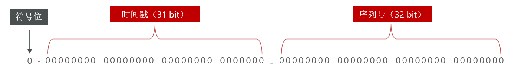

ID的组成部分：

- 符号位：1bit，永远为0
- 时间戳：31bit，以秒为单位，可以使用69年
- 序列号：32bit，秒内的计数器，支持每秒产生2^32个不同ID


#### 3、代码实现

```java
@Component
public class RedisIdWorker {

    private static final long BEGIN_TIMESTAMP = 1640995200L;

    private static final int COUNT_BITS = 32;

    @Resource
    private StringRedisTemplate stringRedisTemplate;

    /**
     * redis 生成器
     * @param keyPrefix
     * @return
     */
    public long nextId(String keyPrefix){
        //1.生成时间戳
        LocalDateTime now = LocalDateTime.now();
        long nowSecond = now.toEpochSecond(ZoneOffset.UTC);
        long timestamp = nowSecond - BEGIN_TIMESTAMP;
        //生成序列号
        //获取当前日期，精确到天
        String date = now.format(DateTimeFormatter.ofPattern("yyyy:MM:dd"));
        //这样可用根据日期去统计订单量 自动拆箱回产生空指针，但事实上这里并不会，redis发现没有，会自动生成
        long increment = stringRedisTemplate.opsForValue().increment("icr:" + keyPrefix + date);
        //拼接返回
        // 这里拼接返回的是long类型，字符串拼接返回的是字符串
        //这里需要使用 位运算 时间戳向左移动32位 在高位, 系列号采用或运算去填充
        return timestamp << COUNT_BITS | increment;
    }
}
```


测试

```java
/**
     * 测试并发的情况
     */
@Test
public void redisIdTest() throws InterruptedException {
    CountDownLatch latch = new CountDownLatch(300);
    ThreadFactory build = new ThreadFactoryBuilder().setNamePrefix("redis_id_%d").build();
    //定义500个线程池
    ExecutorService pool = new ThreadPoolExecutor(500, 500,
                                                  0L, TimeUnit.MILLISECONDS,
                                                  new LinkedBlockingQueue<Runnable>(1024), build, new ThreadPoolExecutor.AbortPolicy());

    Runnable task = () ->{
        for (int i = 0; i < 100; i++) {
            long order = redisIdWorker.nextId("order");
            System.out.println("id=" + order);
        }
        latch.countDown();
    };
    long begin = System.currentTimeMillis();
    for (int i = 0; i < 300; i++) {
        pool.submit(task);
    }
    latch.await();
    long end = System.currentTimeMillis();
    System.out.println("耗时：" + (end - begin));
}
```


全局唯一ID生成策略：

- UUID
- Redis自增
- snowflake算法

- 数据库自增

Redis自增ID策略：

- 每天一个key，方便统计订单量
- ID构造是 时间戳 + 计数器

### 2、实现优惠券秒杀下单

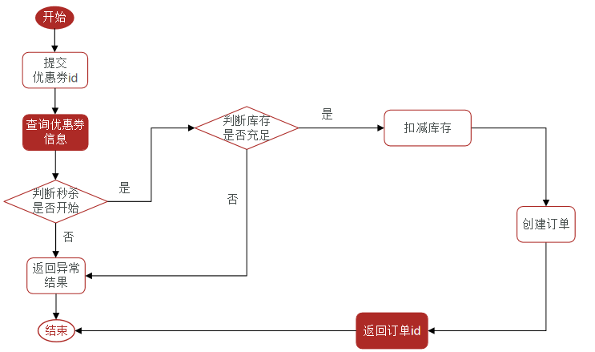


```java
@Transactional(rollbackFor = Exception.class)
@Override
public Result seckillVoucher(Long voucherId) {
    //查询优惠券信息
    SeckillVoucher voucher = seckillVoucherService.getById(voucherId);
    if (null == voucher){
        return Result.fail("优惠券不存在！");
    }
    //判断时间是否开始或过期
    if (voucher.getBeginTime().isAfter(LocalDateTime.now())){
        return Result.fail("秒杀未开始！");
    }
    if (voucher.getEndTime().isBefore(LocalDateTime.now())){
        return Result.fail("秒杀已结束！");
    }
    //判断库存是否充足
    if (1 > voucher.getStock()){
        return Result.fail("库存不足");
    }
    //扣减库存
    boolean success = seckillVoucherService.update()
        .setSql("stock = stock - 1")
        .eq("voucher_id", voucherId).update();
    if (!success){
        return Result.fail("库存不足");
    }
    //创建订单
    VoucherOrder voucherOrder = new VoucherOrder();
    voucherOrder.setVoucherId(voucherId);
    //创建订单号
    long id = redisIdWorker.nextId("order");
    voucherOrder.setId(id);
    Long userId = UserHolder.getUser().getId();
    voucherOrder.setUserId(userId);
    save(voucherOrder);
    //返回订单号
    return Result.ok(id);
}
```


### 3、超卖问题

#### 1、问题描述

> 超卖问题是指卖出的数量已经超出库存了

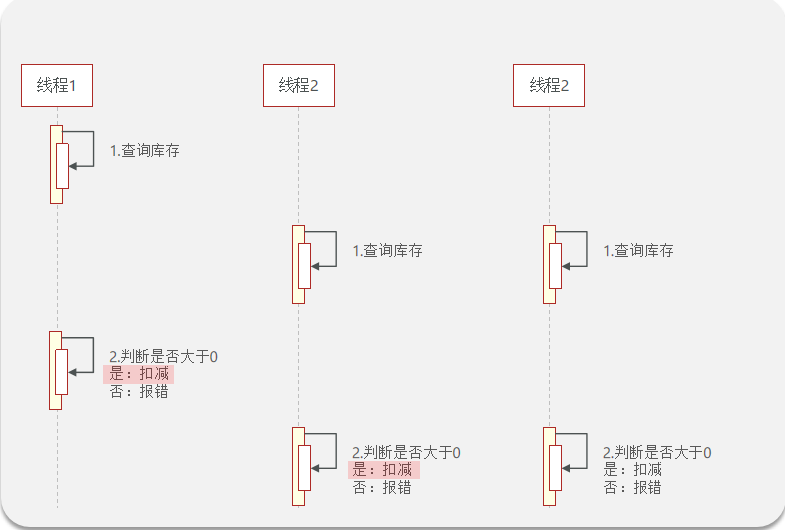

库存数据为：1

1. 线程1、线程2同时发出请求，查询库存，为1
2. 线程1判断是否大于0，此时为true，则扣减库存，此时库存为0
3. 线程2判断是否大于0，此时为true，则扣减库存，此时库存为-1


#### 2、解决方案

> 超卖问题是典型的多线程安全问题，针对这一问题的常见解决方案就是加锁：
>
> - 乐观锁
> - 悲观锁

##### 1、乐观锁

认为线程安全问题不一定会发生，因此不加锁，只是在更新数据时去判断有没有其它线程对数据做了修改。

- 如果没有修改则认为是安全的，自己才更新数据。
- 如果已经被其它线程修改说明发生了安全问题，此时可以重试或异常。


> 乐观锁的关键是判断之前查询得到的数据是否有被修改过，常见的方式有两种：
>
> - 版本号法
> - CAS法

###### 1、版本号法

> 每次修改库存时，版本号+1，修改时根据查询的版本号进行修改

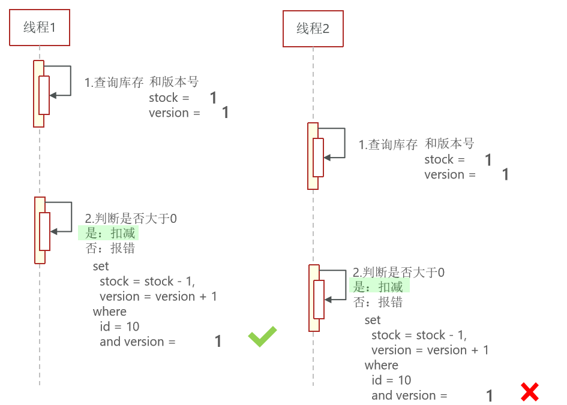

初始库存为1，版本号为1

1. 线程1查询库存和版本号都是为1，判断是否大于0，大于0则进行修改且版本号+1，扣减成功
2. 线程1查询库存和版本号都是为1，判断是否大于0，大于0则进行修改且版本号+1，此时线程1已经修改版本号为2了，所以不执行


###### 2、CAS方法

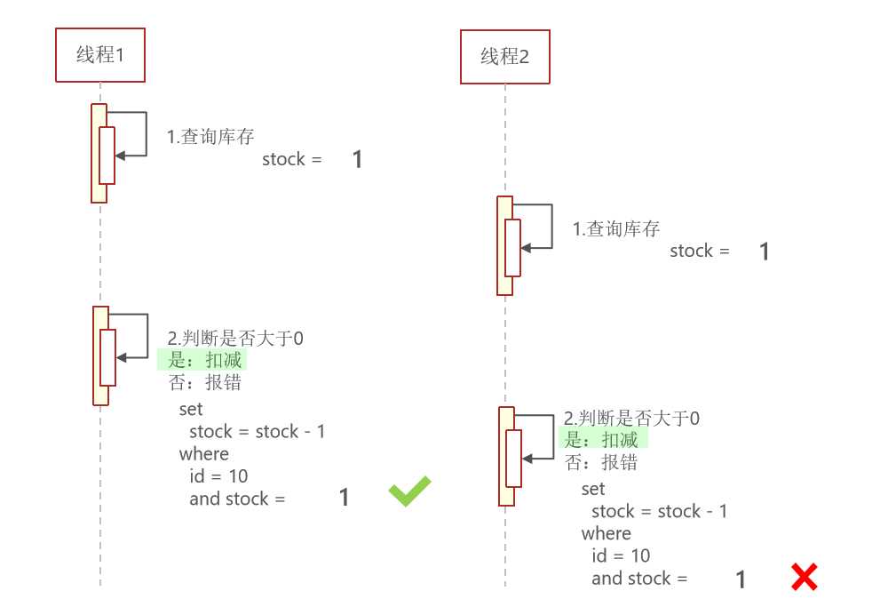


初始库存为1，版本号为1

1. 线程1查询库存为1，判断是否大于0，大于0则进行修改，扣减成功
2. 线程1查询库存为1，判断是否大于0，大于0则进行修改，此时线程1已经修改库存为0了，所以不执行

代码实现：

采用的是`jmeter`模拟并发请求

```java
@Transactional(rollbackFor = Exception.class)
@Override
public Result seckillVoucher(Long voucherId) {
    //查询优惠券信息
    SeckillVoucher voucher = seckillVoucherService.getById(voucherId);
    if (null == voucher){
        return Result.fail("优惠券不存在！");
    }
    //判断时间是否开始或过期
    if (voucher.getBeginTime().isAfter(LocalDateTime.now())){
        return Result.fail("秒杀未开始！");
    }
    if (voucher.getEndTime().isBefore(LocalDateTime.now())){
        return Result.fail("秒杀已结束！");
    }
    //判断库存是否充足
    if (1 > voucher.getStock()){
        return Result.fail("库存不足");
    }
    //扣减库存
    boolean success = seckillVoucherService.update()
        .setSql("stock = stock - 1")
        .eq("voucher_id", voucherId).eq("stock",voucher.getStock()).update();
    if (!success){
        return Result.fail("库存不足");
    }
    //创建订单
    VoucherOrder voucherOrder = new VoucherOrder();
    voucherOrder.setVoucherId(voucherId);
    //创建订单号
    long id = redisIdWorker.nextId("order");
    voucherOrder.setId(id);
    Long userId = UserHolder.getUser().getId();
    voucherOrder.setUserId(userId);
    save(voucherOrder);
    //返回订单号
    return Result.ok(id);
}
```

相比优惠券秒杀下单，修改的地方：

```java
boolean success = seckillVoucherService.update()
        .setSql("stock = stock - 1")
        .eq("voucher_id", voucherId).eq("stock",voucher.getStock()).update();
```

使用多线程模拟秒杀后，发现异常比例反而增加了

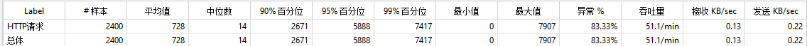

原因：这是因为多线程访问的时候，一个线程进行修改了，那其他99个线程都未修改成功，订单失败。这也是乐观锁的一个缺点


**改进方法**

> 前面是用库存代表的版本号进行控制高并发方法，但是其实只要库存量大于0的时候，都允许线程进行修改，这样就控制了高并发

```java
//扣减库存
boolean success = seckillVoucherService.update()
    .setSql("stock = stock - 1")
    .eq("voucher_id", voucherId).gt("stock",0)
    .update();
```

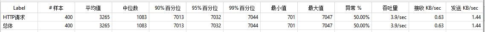

符合预期


##### 2、悲观锁

认为线程安全问题一定会发生，因此在操作数据之前先获取锁，确保线程串行执行。

- 例如Synchronized、Lock都属于悲观锁


#### 3、总结

超卖这样的线程安全问题，解决方案有哪些？

1. 悲观锁：添加同步锁，让线程串行执行
    - 优点：简单粗暴
    - 缺点：性能一般
2. 乐观锁：不加锁，在更新时判断是否有其它线程在修改
    - 优点：性能好
    - 缺点：存在成功率低的问题


### 4、一人一单

#### 1、场景

> 需求：修改秒杀业务，要求同一个优惠券，一个用户只能下一单

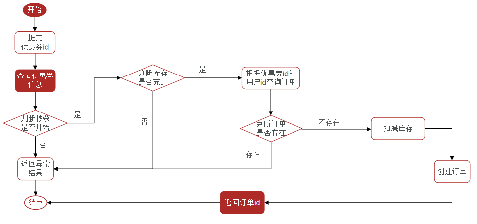

##### 1、代码实现

```java
@Transactional(rollbackFor = Exception.class)
@Override
public Result seckillVoucher(Long voucherId) {
    //查询优惠券信息
    SeckillVoucher voucher = seckillVoucherService.getById(voucherId);
    if (null == voucher){
        return Result.fail("优惠券不存在！");
    }
    //判断时间是否开始或过期
    if (voucher.getBeginTime().isAfter(LocalDateTime.now())){
        return Result.fail("秒杀未开始！");
    }
    if (voucher.getEndTime().isBefore(LocalDateTime.now())){
        return Result.fail("秒杀已结束！");
    }
    //判断库存是否充足
    if (1 > voucher.getStock()){
        return Result.fail("库存不足");
    }

    //一人一单
    Long userId = UserHolder.getUser().getId();
    //查询订单
    Integer count = query().eq("user_id", userId).eq("voucher_id", voucherId).count();

    if (count > 0) {
        return Result.fail("用户已经购买过一次了！");
    }
    
    //扣减库存
    boolean success = seckillVoucherService.update()
        .setSql("stock = stock - 1")
        .eq("voucher_id", voucherId).gt("stock",0).update();
    if (!success){
        return Result.fail("库存不足");
    }
    //创建订单
    VoucherOrder voucherOrder = new VoucherOrder();
    voucherOrder.setVoucherId(voucherId);
    //创建订单号
    long id = redisIdWorker.nextId("order");
    voucherOrder.setId(id);
    voucherOrder.setUserId(userId);
    save(voucherOrder);
    //返回订单号
    return Result.ok(id);
}
```


##### 2、结果

> 发现数据库中存在10同一用户的订单


##### 3、解决方案

> 很明显，这是线程并发问题，解决就是加锁，到底是加乐观锁呢还是悲观锁？
>
> 这时我们分析一下，乐观锁认为在线程执行的时候，没有其他线程来修改之前的数据，悲观锁则是认为有人修改它的数据
>
> 这里我们要控制的是同一个用户只能下一单，可以锁住用户ID来进行解决，则采用悲观锁`synchronized`

```java
@Override
public Result seckillVoucher(Long voucherId) {
    //查询优惠券信息
    SeckillVoucher voucher = seckillVoucherService.getById(voucherId);
    if (null == voucher){
        return Result.fail("优惠券不存在！");
    }
    //判断时间是否开始或过期
    if (voucher.getBeginTime().isAfter(LocalDateTime.now())){
        return Result.fail("秒杀未开始！");
    }
    if (voucher.getEndTime().isBefore(LocalDateTime.now())){
        return Result.fail("秒杀已结束！");
    }
    //判断库存是否充足
    if (1 > voucher.getStock()){
        return Result.fail("库存不足");
    }
    Long userId = UserHolder.getUser().getId();
    //返回字符串对象的规范表示。
    //一个字符串池，最初是空的，由String类私下维护。
    //当调用 intern 方法时，如果池中已经包含一个等于该String对象的字符串，由equals(Object)方法确定，则返回池中的字符串。否则，将此String对象添加到池中并返回对该String对象的引用。
    //因此，对于任何两个字符串s和t ，当且仅当s.equals(t)为true时， s.intern() == t.intern()才为true 。
    synchronized(userId.toString().intern()) {
        //获取代理对象（事务）
        IVoucherOrderService proxy = (IVoucherOrderService) AopContext.currentProxy();
        return proxy.createVoucherOrder(voucherId);
    }
}

@Override
@Transactional(rollbackFor = Exception.class)
public Result createVoucherOrder(Long voucherId) {
    //一人一单
    Long userId = UserHolder.getUser().getId();

    //查询订单
    Integer count = query().eq("user_id", userId).eq("voucher_id", voucherId).count();

    if (count > 0) {
        return Result.fail("用户已经购买过一次了！");
    }
    //扣减库存
    boolean success = seckillVoucherService.update()
        .setSql("stock = stock - 1")
        .eq("voucher_id", voucherId).gt("stock",0).update();
    if (!success){
        return Result.fail("库存不足");
    }
    //创建订单
    VoucherOrder voucherOrder = new VoucherOrder();
    voucherOrder.setVoucherId(voucherId);
    //创建订单号
    long id = redisIdWorker.nextId("order");
    voucherOrder.setId(id);
    voucherOrder.setUserId(userId);
    save(voucherOrder);
    //返回订单号
    return Result.ok(id);
}
```


###### 引入依赖

```xml
<dependency>
    <groupId>org.aspectj</groupId>
    <artifactId>aspectjweaver</artifactId>
</dependency>
```


###### 主启动类引入注解

```java
//开启代理
@EnableAspectJAutoProxy(exposeProxy = true)
@MapperScan("com.hmdp.mapper")
@SpringBootApplication
public class HmDianPingApplication {

    public static void main(String[] args) {
        SpringApplication.run(HmDianPingApplication.class, args);
    }

}
```


#### 2、集群环境下一人一单

##### 1、创建服务集群

1.复制一份微服务

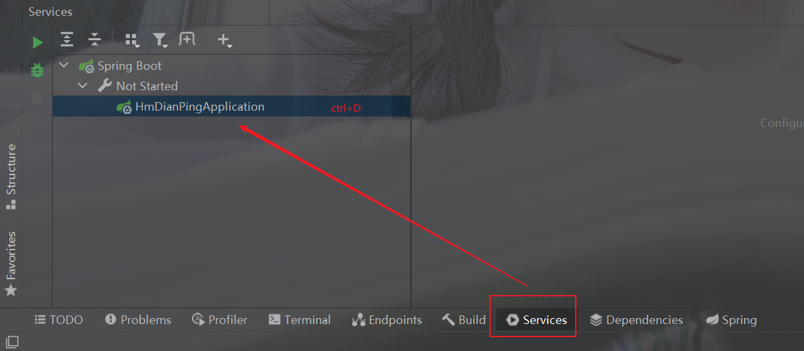


若找不到Service，可去view->Tool Windows->Services，然后Run Configure Type，选择Spring Boot项目即可

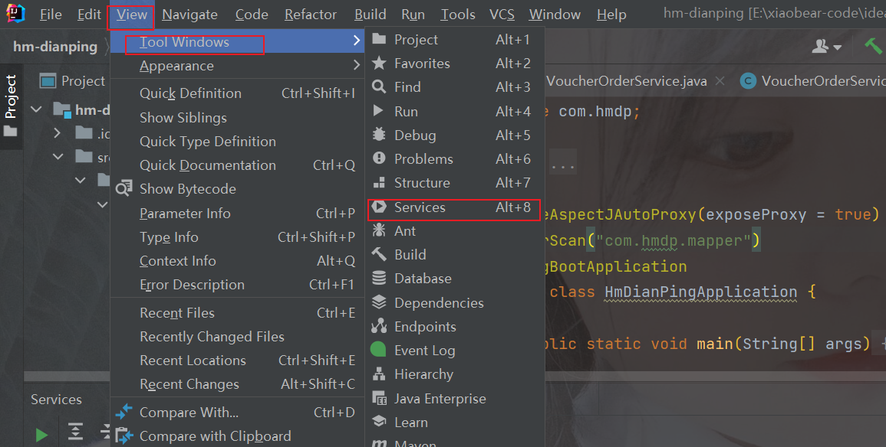


2.配置名称以及覆盖之前的端口

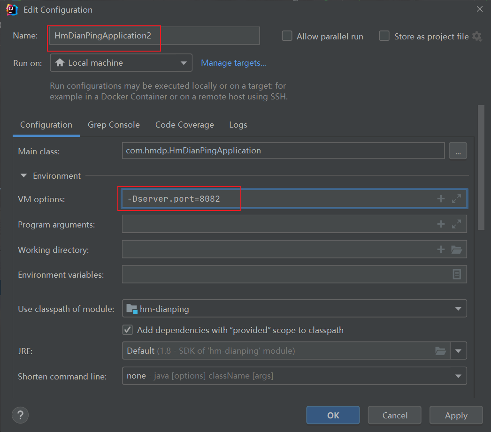


3.配置nginx作负载均衡

```
upstream backend {
server 127.0.0.1:8081 max_fails=5 fail_timeout=10s weight=1;
server 127.0.0.1:8082 max_fails=5 fail_timeout=10s weight=1;
} 
```

现在，用户请求会在这两个节点上负载均衡，再次测试下是否存在线程安全问题。


###### 测试


#### 3、一人一单的并发问题

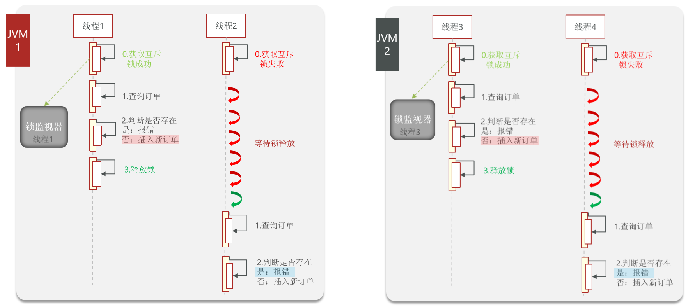

对于多个微服务来说，锁监视器 锁住的是线程，而不是我们自定义的代码块，每个微服务都有一个JVM，而每个JVM都会存在锁，此时并发问题还是会存在。

### 5、分布式锁

#### 1、场景引入

> 对于一人一单并发问题，可以把锁从内部提取出来，放在外部进行监视锁，这样，不管有多少个服务，共用一把锁，即可解决并发问题

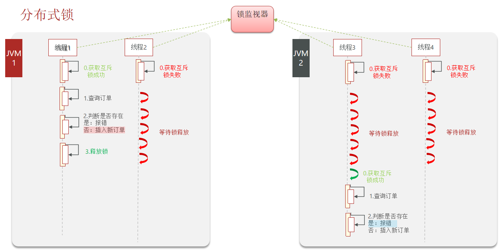


#### 2、定义

> **分布式锁**：满足分布式系统或集群模式下多进程可见并且互斥的锁。

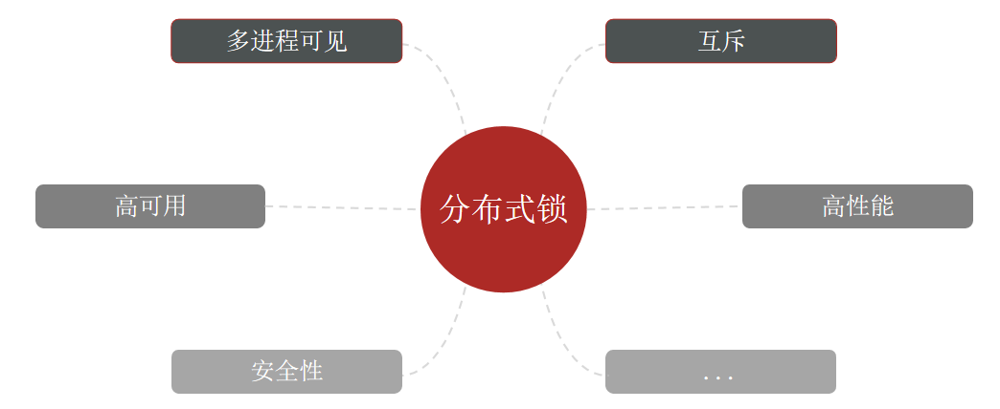


#### 3、实现

分布式锁的核心是实现多进程之间互斥，而满足这一点的方式有很多，常见的有三种：

|             |         **MySQL**         |        **Redis**         |          **Zookeeper**           |
| :---------: | :-----------------------: | :----------------------: | :------------------------------: |
|  **互斥 **  | 利用mysql本身的互斥锁机制 | 利用setnx这样的互斥命令  | 利用节点的唯一性和有序性实现互斥 |
| **高可用 ** |            好             |            好            |                好                |
| **高性能 ** |           一般            |            好            |               一般               |
| **安全性 ** |   断开连接，自动释放锁    | 利用锁超时时间，到期释放 |    临时节点，断开连接自动释放    |


#### 4、基于Redis的分布式锁

实现分布式锁时需要实现的两个基本方法：

- 获取锁
- 释放锁

##### 1、获取锁

> 互斥：确保只能有一个线程获取锁

```
# 添加锁，利用setnx的互斥特性
SETNX lock thread1
# 添加锁过期时间，避免服务宕机引起的死锁
EXPIRE lock 10
```

但是如果在添加锁与添加锁的过期时间之间，redis宕机了，这是我们就灭法释放锁，这是就会一直存在

`SET`有一次性到位的命令

> 非阻塞：尝试一次，成功返回true，失败返回false

```
# 添加锁，NX是互斥、EX是设置超时时间
SET lock thread1 NX EX 10
```


##### 2、释放锁

> - 手动释放
> - 超时释放：获取锁时添加一个超时时间

```
# 释放锁，删除即可
DEL key
```


##### 3、整体流程

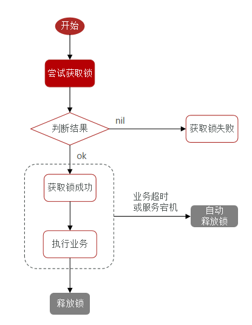

1. 尝试获取锁，判断获取锁的返回结果
2. 返回OK，则表示获取锁成功，执行相应的业务，最后释放锁
3. 返回nil，则表示获取锁失败
4. 若存在业务超时或服务宕机，则会利用超时时间释放锁


##### 4、代码实现

1. 定义一个锁接口，用户获取和释放锁，利用Redis实现分布式锁功能

   ```java
   public interface ILock {
   
       /**
        * 尝试获取锁
        * @param timeoutSec 锁持有的超时时间，过期后自动释放
        * @return true代表获取锁成功; false代表获取锁失败
        **/
       boolean tryLock(long timeoutSec);
   
       /**
        * 释放锁
        */
       void unLock();
   }
   ```


2. 新建类实现锁接口

   ```java
   public class SimpleRedisLock implements ILock{
   
       private String name;
       private StringRedisTemplate stringRedisTemplate;
   
       public SimpleRedisLock(String name, StringRedisTemplate stringRedisTemplate) {
           this.name = name;
           this.stringRedisTemplate = stringRedisTemplate;
       }
   
       public static final String KEY_PREFIX = "lock:";
   
       @Override
       public boolean tryLock(long timeoutSec) {
           //获取线程标识
           long threadId = Thread.currentThread().getId();
           //获取锁
           Boolean flag = stringRedisTemplate.opsForValue()
                   .setIfAbsent(KEY_PREFIX + this.name, threadId + "", timeoutSec, TimeUnit.SECONDS);
           return Boolean.TRUE.equals(flag);
       }
   
       /**
        * 释放锁
        */
       @Override
       public void unLock() {
           stringRedisTemplate.delete(KEY_PREFIX + this.name);
       }
   }
   ```


3. 修改下单的锁逻辑，之前采用的是悲观锁，现在引入自定义锁

   ```java
   @Service
   public class VoucherOrderServiceImpl extends ServiceImpl<VoucherOrderMapper, VoucherOrder> implements IVoucherOrderService {
   
       @Resource
       private ISeckillVoucherService seckillVoucherService;
   
       @Resource
       private RedisIdWorker redisIdWorker;
   
       @Autowired
       private StringRedisTemplate stringRedisTemplate;
   
       @Override
       public Result seckillVoucher(Long voucherId) {
           //查询优惠券信息
           SeckillVoucher voucher = seckillVoucherService.getById(voucherId);
           if (null == voucher){
               return Result.fail("优惠券不存在！");
           }
           //判断时间是否开始或过期
           if (voucher.getBeginTime().isAfter(LocalDateTime.now())){
               return Result.fail("秒杀未开始！");
           }
           if (voucher.getEndTime().isBefore(LocalDateTime.now())){
               return Result.fail("秒杀已结束！");
           }
           //判断库存是否充足
           if (1 > voucher.getStock()){
               return Result.fail("库存不足");
           }
           Long userId = UserHolder.getUser().getId();
           //返回字符串对象的规范表示。
           //一个字符串池，最初是空的，由String类私下维护。
           //当调用 intern 方法时，如果池中已经包含一个等于该String对象的字符串，由equals(Object)方法确定，则返回池中的字符串。否则，将此String对象添加到池中并返回对该String对象的引用。
           //因此，对于任何两个字符串s和t ，当且仅当s.equals(t)为true时， s.intern() == t.intern()才为true 。
   //        synchronized(userId.toString().intern()) {
   //            //获取代理对象（事务）
   //            IVoucherOrderService proxy = (IVoucherOrderService) AopContext.currentProxy();
   //            return proxy.createVoucherOrder(voucherId);
   //        }
           //创建锁对象
           SimpleRedisLock redisLock = new SimpleRedisLock("order" + userId, stringRedisTemplate);
           boolean isLock = redisLock.tryLock(1200);
           //获取锁失败
           if (!isLock){
               //返回错误
               return Result.fail("不允许重复下单");
           }
           try {
               IVoucherOrderService proxy = (IVoucherOrderService) AopContext.currentProxy();
               return proxy.createVoucherOrder(voucherId);
           } finally {
               //释放锁
               redisLock.unLock();
           }
   
       }
   
       @Override
       @Transactional(rollbackFor = Exception.class)
       public Result createVoucherOrder(Long voucherId) {
           //一人一单
           Long userId = UserHolder.getUser().getId();
   
           //查询订单
           Integer count = query().eq("user_id", userId).eq("voucher_id", voucherId).count();
   
           if (count > 0) {
               return Result.fail("用户已经购买过一次了！");
           }
           //扣减库存
           boolean success = seckillVoucherService.update()
                   .setSql("stock = stock - 1")
                   .eq("voucher_id", voucherId).gt("stock",0).update();
           if (!success){
               return Result.fail("库存不足");
           }
           //创建订单
           VoucherOrder voucherOrder = new VoucherOrder();
           voucherOrder.setVoucherId(voucherId);
           //创建订单号
           long id = redisIdWorker.nextId("order");
           voucherOrder.setId(id);
           voucherOrder.setUserId(userId);
           save(voucherOrder);
           //返回订单号
           return Result.ok(id);
   
       }
   }
   ```


##### 5、存在的问题

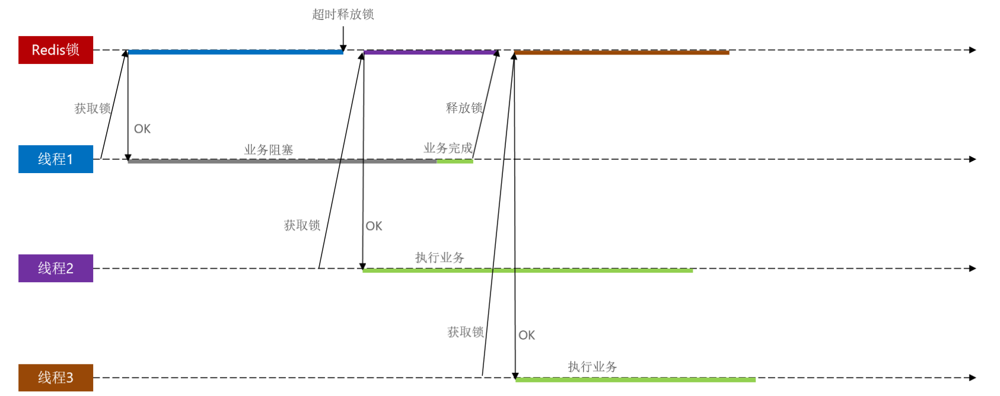


1. 线程1获取锁之后，执行业务阻塞了，此时超时释放锁
2. 线程2请求获取锁成功后，线程1的业务执行完成，并释放锁
3. 线程3同理

> 线程1在执行完业务之后，释放的锁并不是自己持有的锁，而是线程2获取到的锁，


##### 6、优化

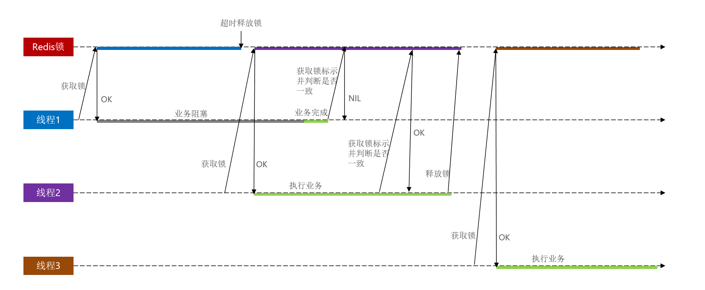

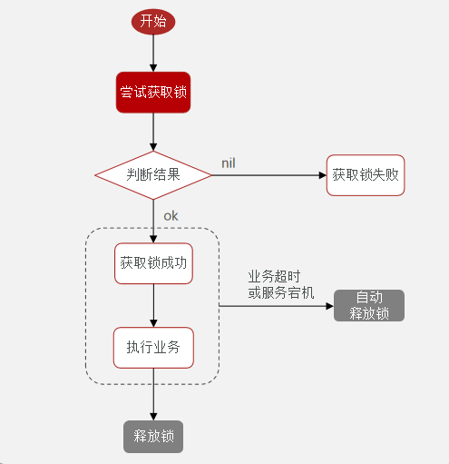

> 需求：修改之前的分布式锁实现，满足：
>
> - 在获取锁时存入线程标示（可以用UUID表示）
> - 在释放锁时先获取锁中的线程标示，判断是否与当前线程标示一致
    >   - 如果一致则释放锁
    >   - 如果不一致则不释放锁

修改获取锁和释放锁的实现

```java
public class SimpleRedisLock implements ILock{

    private String name;
    private StringRedisTemplate stringRedisTemplate;

    public SimpleRedisLock(String name, StringRedisTemplate stringRedisTemplate) {
        this.name = name;
        this.stringRedisTemplate = stringRedisTemplate;
    }

    public static final String KEY_PREFIX = "lock:";
    public static final String ID_PREFIX = UUID.randomUUID().toString(true) + "-";

    @Override
    public boolean tryLock(long timeoutSec) {
        //获取线程标识
        String threadId = ID_PREFIX + Thread.currentThread().getId();
        //获取锁
        Boolean flag = stringRedisTemplate.opsForValue()
                .setIfAbsent(KEY_PREFIX + this.name, threadId, timeoutSec, TimeUnit.SECONDS);
        return Boolean.TRUE.equals(flag);
    }

    /**
     * 释放锁
     */
    @Override
    public void unLock() {
        //获取线程标识
        String threadId = ID_PREFIX + Thread.currentThread().getId();
        //判断标识是否一致
        String id = stringRedisTemplate.opsForValue().get(KEY_PREFIX + this.name);
        if (threadId.equals(id)){
            stringRedisTemplate.delete(KEY_PREFIX + this.name);
        }
    }
}
```


##### 7、Redis的Lua脚本

> Redis提供了Lua脚本功能，在一个脚本中编写多条Redis命令，确保多条命令执行时的原子性。Lua是一种编程语言，它的基本语法大家可以参考网站：https://www.runoob.com/lua/lua-tutorial.html

介绍Redis提供的调用函数，语法如下：


例如，我们要执行set name jack，则脚本是这样：


例如，我们要先执行set name Rose，再执行get name，则脚本如下：

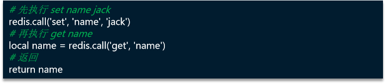

写好脚本以后，需要用Redis命令来调用脚本，调用脚本的常见命令如下：

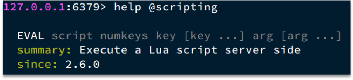

例如，我们要执行 redis.call('set', 'name', 'jack') 这个脚本，语法如下：


如果脚本中的key、value不想写死，可以作为参数传递。key类型参数会放入KEYS数组，其它参数会放入ARGV数组，在脚本中可以从KEYS和ARGV数组获取这些参数：


**释放锁的业务流程是这样的：**

1. 获取锁中的线程标示
2. 判断是否与指定的标示（当前线程标示）一致
3. 如果一致则释放锁（删除）
4. 如果不一致则什么都不做

如果用Lua脚本来表示则是这样的：

```lua
-- 锁的key
local key = KEYS[1]
-- 当前线程标识
local threadId = ARGV[1]
---
---获取锁中的线程标识
---
local id = redis.call('get', key)
-- 比较是否一致
if (id == threadId) then
    -- 释放锁 del key
    return redis.call('del', key)
end

------------------------------------------------------简化版-------------------------------------------------

-- 这里的 KEYS[1] 就是锁的key，这里的ARGV[1] 就是当前线程标示
-- 获取锁中的标示，判断是否与当前线程标示一致
if (redis.call('GET', KEYS[1]) == ARGV[1]) then
  -- 一致，则删除锁
  return redis.call('DEL', KEYS[1])
end
-- 不一致，则直接返回
return 0
```


##### 8、再次改进Redis的分布式锁

需求：基于Lua脚本实现分布式锁的释放锁逻辑
提示：RedisTemplate调用Lua脚本的API如下：

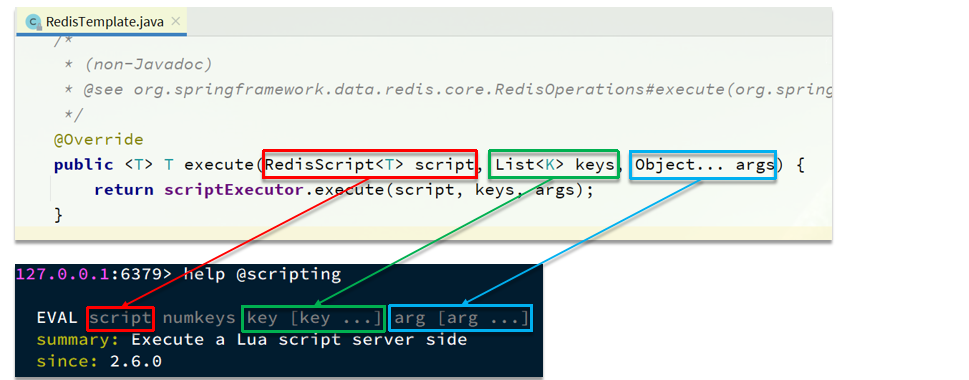


这里只需要更改释放锁的逻辑即可，把unlock.lua脚本放到resource目录下

```java
public class SimpleRedisLock implements ILock{

    private String name;
    private StringRedisTemplate stringRedisTemplate;

    public SimpleRedisLock(String name, StringRedisTemplate stringRedisTemplate) {
        this.name = name;
        this.stringRedisTemplate = stringRedisTemplate;
    }

    public static final String KEY_PREFIX = "lock:";
    public static final String ID_PREFIX = UUID.randomUUID().toString(true) + "-";
    
    //设置为静态，不需要每次释放锁都调用一次基本
    public static final DefaultRedisScript<Long> UNLOCK_SCRIPT;
    static {
        UNLOCK_SCRIPT = new DefaultRedisScript<>();
        //调用resource下的unlock脚本
        UNLOCK_SCRIPT.setLocation(new ClassPathResource("unlock.lua"));
        UNLOCK_SCRIPT.setResultType(Long.class);
    }

    @Override
    public boolean tryLock(long timeoutSec) {
        //获取线程标识
        String threadId = ID_PREFIX + Thread.currentThread().getId();
        //获取锁
        Boolean flag = stringRedisTemplate.opsForValue()
                .setIfAbsent(KEY_PREFIX + this.name, threadId, timeoutSec, TimeUnit.SECONDS);
        return Boolean.TRUE.equals(flag);
    }
    /**
     * 通过lua脚本释放锁
     */
    @Override
    public void unLock() {
        //调用lua脚本
        stringRedisTemplate.execute(
                UNLOCK_SCRIPT,
                Collections.singletonList(KEY_PREFIX + name),
                ID_PREFIX + Thread.currentThread().getId());
    }
}
```


##### 9、总结

> 基于Redis的分布式锁实现思路：
>
> - 利用set nx ex获取锁，并设置过期时间，保存线程标示
> - 释放锁时先判断线程标示是否与自己一致，一致则删除锁
>
> 特性：
>
> - 利用set nx满足互斥性
> - 利用set ex保证故障时锁依然能释放，避免死锁，提高安全性
> - 利用Redis集群保证高可用和高并发特性


#### 5、基于Redis的分布式锁优化

##### 1、基于setnx实现的分布式锁存在的问题

1. **不可重入**：同一个线程无法多次获取同一把锁

   > 例如：方法A先获取锁，调用方法B中的业务，B也想获取同一把锁，此时无法获取到锁，只能等待A释放

2. **不可重试**：获取锁只尝试一次就返回false，没有重试机制

   > 很多业务下，不能返回立即失败，而是需要等待，重试

3. **超时释放**：锁超时释放虽然可避免死锁，但如果业务执行耗时较长，也会导致锁释放，存在安全隐患

   > 虽然之前利用判断锁标识，`Lua`脚本解决了因为超时释放解决的误删问题，

4. **主从一致性**：如果Redis提供了主从集群，主从同步存在延迟，当主宕机时，如果从同步主中的锁数据，则会出现锁实现


##### 2、Redisson

> Redisson是一个在Redis的基础上实现的Java驻内存数据网格（In-Memory Data Grid）。它不仅提供了一系列的分布式的Java常用对象，还提供了许多分布式服务，其中就包含了各种分布式锁的实现。
>
> 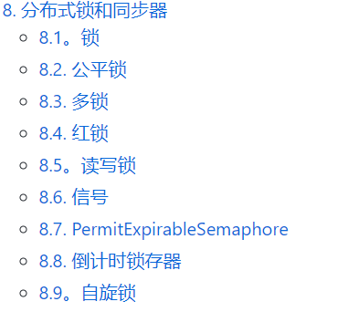

官网地址： https://redisson.org

GitHub地址： https://github.com/redisson/redisson


###### 1、Redisson入门

1、引入依赖

```xml
<dependency>
   <groupId>org.redisson</groupId>
   <artifactId>redisson</artifactId>
   <version>3.17.3</version>
</dependency>  
```


2、配置Redisson客户端

```java
@Component
public class RedisConfig {

    @Bean
    public RedissonClient redissonClient(){
        Config config = new Config();
        // 添加redis地址，这里添加了单点的地址，也可以使用config.useClusterServers()添加集群地址
        config.useSingleServer().setAddress("redis://127.0.0.1:6379").setPassword("123456");
        //创建redisson对象 创建客户端
        return Redisson.create(config);
    }
}
```


3、使用Redisson的分布式锁

```java
@Resource
private RedissonClient redissonClient;
@Test
void testRedisson() throws InterruptedException {
    // 获取锁（可重入），指定锁的名称 
    RLock lock = redissonClient.getLock("anyLock");   
    // 尝试获取锁，参数分别是：获取锁的最大等待时间（期间会重试），锁自动释放时间，时间单位   
    boolean isLock = lock.tryLock(1, 10, TimeUnit.SECONDS);   
    // 判断释放获取成功   
    if(isLock){      
        try {            
            System.out.println("执行业务");        
        }finally {            
            // 释放锁          
            lock.unlock();        
        }   
    }
}
```


###### 2、Redisson可重入锁原理

> 为了避免并发安全问题，释放不是自己的锁，这里采用的是锁计数器，获取锁+1，判断是否为自己的锁-1，最终计数为0

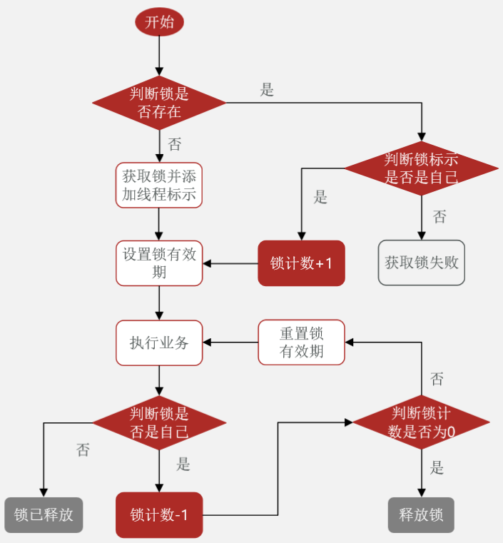


**测试类**

```java
@RunWith(SpringRunner.class)
@SpringBootTest
@Slf4j
public class RedissonTest {

    @Autowired
    private RedissonClient redissonClient;

    private RLock lock;

    @BeforeEach
    void setUp(){
        System.out.println(121312);
        lock = redissonClient.getLock("order");
    }

    @Test
    public void method1(){
        //获取锁对象
        boolean tryLock = lock.tryLock();
        if (!tryLock){
            log.error("获取锁失败！，1");
            return;
        }
        try {
            log.info("获取锁成功，1");
            method2();
        }finally {
            log.info("释放锁，1");
            lock.unlock();
        }
    }

    public void method2(){
        boolean tryLock = lock.tryLock();
        if (!tryLock) {
            log.error("获取锁失败！，2");
        }
        try {
            log.info("获取锁成功！，2");
        }finally {
            log.error("释放锁！，2");
            lock.unlock();
        }
    }
}
```

PS：这里`@Test`注解需引入`import org.junit.jupiter.api.Test;`而不是`import org.junit.Test;`，否则`@BeforeEach`不会执行

`@BeforeEach`：


获取锁的`Lua`脚本

```lua
-- 锁的key
local key = KEYS[1]
-- 当前线程标识
local threadId = ARGV[1]
--锁的自动释放时间
local releaseTime = ARGV[2]
--判断是否存在
if (redis.call('exist', key) == 0) then
    --不存在，则释放锁
    redis.call('hset',key, threadId, '1')
    --设置有效期
    redis.call('expire', key, releaseTime)
    --返回结果
    return 1;
    
end
--锁已经存在，判断threadId是否是自己的
if (redis.call('hexist', key, threadId) == 1) then
    --不存在，则获取锁，重入次数+1
    redis.call('hincrby', key, threadId, '1')
    --设置有效期
    redis.call('expire', key, releaseTime)
    --返回结果
    return 1;
end
-- 代码走到这里,说明获取锁的不是自己，获取锁失败
return 0;
```


释放锁的`Lua`脚本

```lua
local key = KEYS[1]; -- 锁的key
local threadId = ARGV[1]; -- 线程唯一标识
local releaseTime = ARGV[2]; -- 锁的自动释放时间
-- 判断当前锁是否还是被自己持有
if (redis.call('HEXISTS', key, threadId) == 0) then
    return nil;
    -- 如果已经不是自己，则直接返回
end
-- 是自己的锁，则重入次数-1
local count = redis.call('HINCRBY', key, threadId, -1);
-- 判断是否重入次数是否已经为0
if (count > 0) then
-- 大于0说明不能释放锁，重置有效期然后返回
    redis.call('EXPIRE', key, releaseTime);
    return nil;
else  -- 等于0说明可以释放锁，直接删除
    redis.call('DEL', key);
    return nil;
end;
```


###### 3、Redisson分布式锁原理

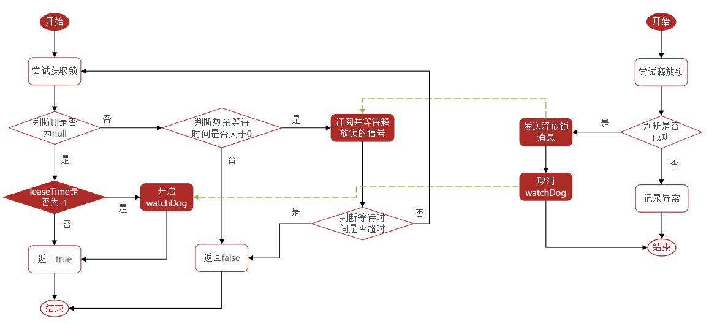


###### 4、总结

Redisson分布式锁原理：

- 可重入：利用hash结构记录线程id和重入次数
- 可重试：利用信号量和PubSub功能实现等待、唤醒，获取锁失败的重试机制
- 超时续约：利用watchDog，每隔一段时间（releaseTime / 3），重置超时时间


###### 5、Redisson分布式锁主从一致性问题

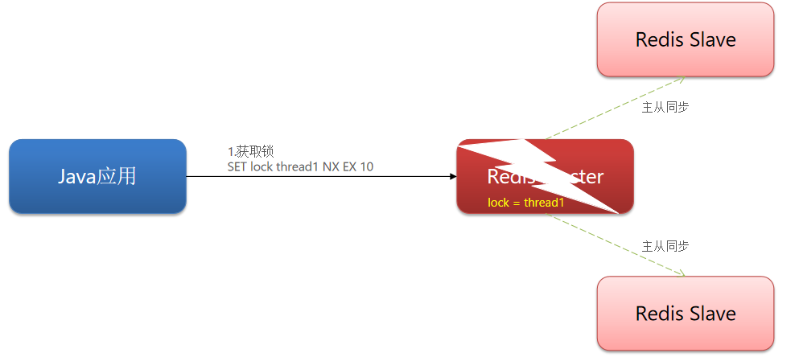

Redis集群

> 存在一瞬间，redis主机突然宕机了，且此时锁并未同步到从机，此时就会出现线程并发问题，可以从其他的主机都获取到锁


**Redisson解决**

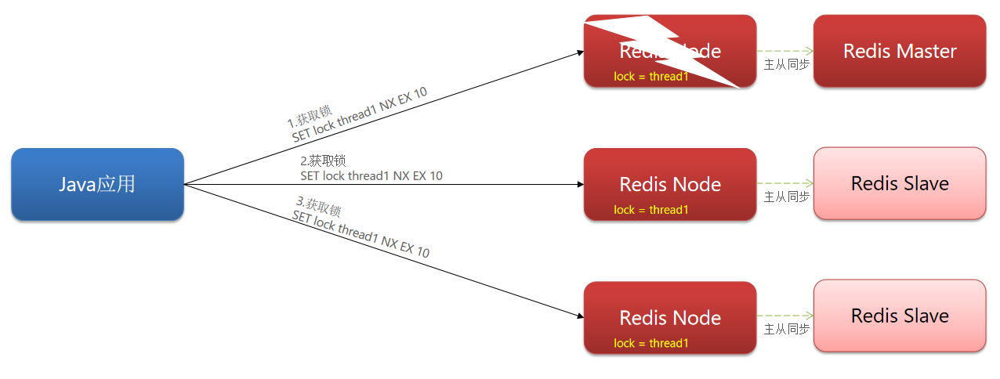

Redisson分别从所有主机获取锁，当从所有主机获取到锁且一致时，才会获取锁成功，其他一台宕机了，则会获取锁失败，这种设计也叫做联锁。

> **联锁（MultiLock）**
>
> 基于Redis的Redisson分布式联锁[`RedissonMultiLock`](http://static.javadoc.io/org.redisson/redisson/3.10.0/org/redisson/RedissonMultiLock.html)对象可以将多个`RLock`对象关联为一个联锁，每个`RLock`对象实例可以来自于不同的Redisson实例。

大家都知道，如果负责储存某些分布式锁的某些Redis节点宕机以后，而且这些锁正好处于锁住的状态时，这些锁会出现锁死的状态。为

了避免这种情况的发生，Redisson内部提供了一个监控锁的看门狗，它的作用是在Redisson实例被关闭前，不断的延长锁的有效期。默

认情况下，看门狗的检查锁的超时时间是30秒钟，也可以通过修改[Config.lockWatchdogTimeout](https://github.com/redisson/redisson/wiki/2.-配置方法#lockwatchdogtimeout监控锁的看门狗超时单位毫秒)来另行指定。

```java
RLock lock1 = redissonInstance1.getLock("lock1");
RLock lock2 = redissonInstance2.getLock("lock2");
RLock lock3 = redissonInstance3.getLock("lock3");

RedissonMultiLock lock = new RedissonMultiLock(lock1, lock2, lock3);
// 同时加锁：lock1 lock2 lock3
// 所有的锁都上锁成功才算成功。
lock.lock();
...
lock.unlock();
```


**测试**

1.修改Redisson配置类

```java
@Component
public class RedisConfig {

    @Bean
    public RedissonClient redissonClient(){
        Config config = new Config();
        // 添加redis地址，这里添加了单点的地址，也可以使用config.useClusterServers()添加集群地址
        config.useSingleServer().setAddress("redis://127.0.0.1:6379").setPassword("123456");
        //创建redisson对象 创建客户端
        return Redisson.create(config);
    }
    @Bean
    public RedissonClient redissonClient1(){
        Config config = new Config();
        // 添加redis地址，这里添加了单点的地址，也可以使用config.useClusterServers()添加集群地址
        config.useSingleServer().setAddress("redis://127.0.0.1:6380");
        //创建redisson对象 创建客户端
        return Redisson.create(config);
    }
}
```


2、修改测试类

```java
@RunWith(SpringRunner.class)
@SpringBootTest
@Slf4j
public class RedissonTest {

    @Autowired
    private RedissonClient redissonClient;

    @Autowired
    private RedissonClient redissonClient1;

    private RLock lock;

    @BeforeEach
    void setUp(){
        System.out.println(121312);
        RLock lock1 = redissonClient.getLock("order");
        RLock lock2 = redissonClient1.getLock("order");

        lock = new RedissonMultiLock(lock1, lock2);
    }

    @Test
    public void method1(){
        //获取锁对象
        boolean tryLock = lock.tryLock();
        if (!tryLock){
            log.error("获取锁失败！，1");
            return;
        }
        try {
            log.info("获取锁成功，1");
            method2();
        }finally {
            log.info("释放锁，1");
            lock.unlock();
        }
    }

    public void method2(){
        boolean tryLock = lock.tryLock();
        if (!tryLock) {
            log.error("获取锁失败！，2");
        }
        try {
            log.info("获取锁成功！，2");
        }finally {
            log.error("释放锁！，2");
            lock.unlock();
        }
    }
}
```


**总结：**

1. 不可重入Redis分布式锁：
    - 原理：利用setnx的互斥性；利用ex避免死锁；释放锁时判断线程标示
    - 缺陷：不可重入、无法重试、锁超时失效
2. 可重入的Redis分布式锁：
    - 原理：利用hash结构，记录线程标示和重入次数；利用watchDog延续锁时间；利用信号量控制锁重试等待
    - 缺陷：redis宕机引起锁失效问题
3. Redisson的multiLock：
    - 原理：多个独立的Redis节点，必须在所有节点都获取重入锁，才算获取锁成功
    - 缺陷：运维成本高、实现复杂


### 6、Redis优化秒杀

#### 1、场景

> 多用户同时请求下单时，延迟过高，tomcat需要操作整套流程

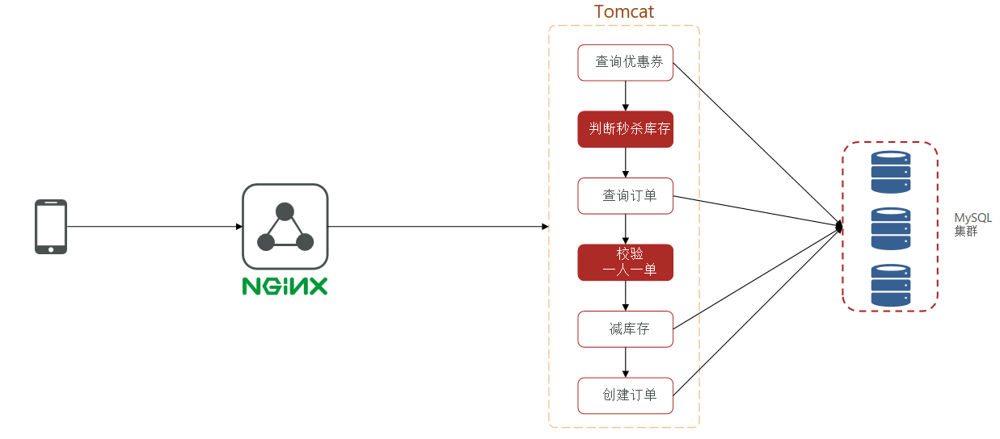


#### 2、优化方案

> 核心的处理是：判断秒杀库存和一人一单，可采用多个线程的方式完成下单

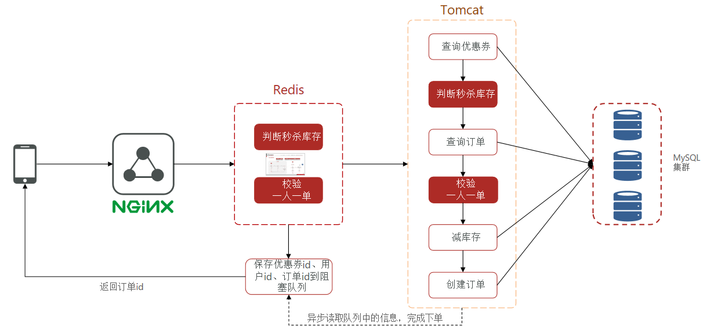


整体流程：

> Lua脚本保证redis的原子性，要么全部成功，要么就全部不执行
>
> userId存入set集合，保证用户一人一单

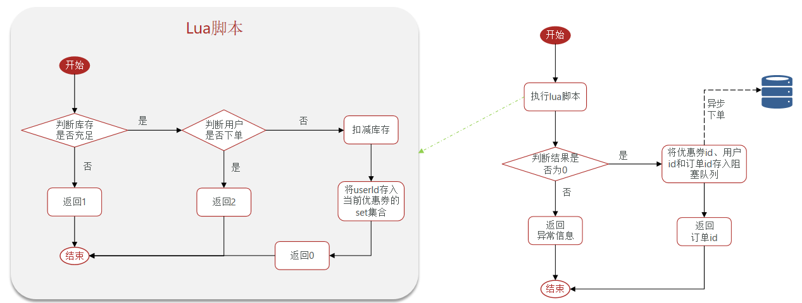


#### 3、改进秒杀业务，提高并发性能

> 需求：
>
> - 新增秒杀优惠券的同时，将优惠券信息保存到Redis中
> - 基于Lua脚本，判断秒杀库存、一人一单，决定用户是否抢购成功
> - 如果抢购成功，将优惠券id和用户id封装后存入阻塞队列
> - 开启线程任务，不断从阻塞队列中获取信息，实现异步下单功能

##### 1、新增秒杀优惠券的同时，将优惠券信息保存到Redis中

```java
@Override
@Transactional(rollbackFor = Exception.class)
public void addSeckillVoucher(Voucher voucher) {
    // 保存优惠券
    save(voucher);
    // 保存秒杀信息
    SeckillVoucher seckillVoucher = new SeckillVoucher();
    seckillVoucher.setVoucherId(voucher.getId());
    seckillVoucher.setStock(voucher.getStock());
    seckillVoucher.setBeginTime(voucher.getBeginTime());
    seckillVoucher.setEndTime(voucher.getEndTime());
    seckillVoucherService.save(seckillVoucher);
    //保存秒杀到redis
    stringRedisTemplate.opsForValue().set(RedisConstants.SECKILL_STOCK_KEY + voucher.getId(), voucher.getStock().toString());
}
```


##### 2、基于Lua脚本，判断秒杀库存、一人一单，决定用户是否抢购成功

```lua
--优惠券ID
local voucherId = ARGV[1]
--用户ID
local userId = ARGV[2]

-- 数据key 库存key 订单key
local stockKey = "seckill:stock:" .. voucherId
local orderKey = "seckill:order:" .. voucherId

--判断库存是否充足 tonumber函数转为数字
if (tonumber(redis.call('get',stockKey)) <= 0) then
    --库存不足
    return 1;
end

--判断用户是否下单 sismember判断是否存在该字符，存在返回1，不存在返回0
if (redis.call('sismember', orderKey, userId) == 1) then
    --存在，说明重复下单
    return 2;
end

--扣库存，下单
redis.call('incrby', stockKey, -1)
-- 这里使用sadd往集合添加数据
redis.call('sadd', orderKey, userId)
return 0;
```


##### 3、存入阻塞队列，异步下单

```java
@Service
public class VoucherOrderServiceImpl extends ServiceImpl<VoucherOrderMapper, VoucherOrder> implements IVoucherOrderService {

    @Resource
    private ISeckillVoucherService seckillVoucherService;

    @Resource
    private RedisIdWorker redisIdWorker;

    @Autowired
    private StringRedisTemplate stringRedisTemplate;

    @Resource
    private RedissonClient redissonClient;

    public static final DefaultRedisScript<Long> SECKILL_SCRIPT;
    static {
        SECKILL_SCRIPT = new DefaultRedisScript<>();
        //调用resource下的seckill脚本
        SECKILL_SCRIPT.setLocation(new ClassPathResource("seckill.lua"));
        SECKILL_SCRIPT.setResultType(Long.class);
    }

    /**
     * 阻塞队列
     */
    private BlockingQueue<VoucherOrder> orderTasks = new ArrayBlockingQueue<>(1024*1024);

    //开启线程
    private static final ExecutorService seckill_order_excutor = Executors.newSingleThreadExecutor();

    // @PostConstruct表示在系统启动时调用
    @PostConstruct
    private void init(){
        seckill_order_excutor.submit(new VoucherOrderHandle());
    }
    /**
     * 内部类
     */
    private class VoucherOrderHandle implements Runnable{

        @Override
        public void run() {
            while (true){
                //1.获取队列中的订单信息
                try {
                    VoucherOrder take = orderTasks.take();
                    handleVoucherOrder(take);
                } catch (InterruptedException e) {
                    e.printStackTrace();
                }
                //创建订单
            }
        }

        private void handleVoucherOrder(VoucherOrder take) {
            //获取用户
            Long userId = take.getUserId();
            RLock redisLock = redissonClient.getLock("lock:order:" + userId);
            boolean isLock = redisLock.tryLock();
            //获取锁失败
            if (!isLock){
                //返回错误
                return;
            }
            try {

                proxy.createVoucherOrder(take);
            } finally {
                //释放锁
                redisLock.unlock();
            }
        }
    }
    private IVoucherOrderService proxy;

    @Override
    public Result seckillVoucher(Long voucherId) {
        Long userId = UserHolder.getUser().getId();
        //执行lua脚本
        Long execute = stringRedisTemplate.execute(
                SECKILL_SCRIPT,
                Collections.emptyList(),
                voucherId.toString(), userId.toString()
        );
        //判断是否返回为0 0-有购买资格 !0没有购买资格
        int i = execute.intValue();
        if (0 != i) {
            return Result.fail(1 == i ? "库存不足" : "不能重复下单");
        }
        //0 把下单信息保存到阻塞队列
        //创建订单号
        long orderId = redisIdWorker.nextId("order");
        //创建订单
        VoucherOrder voucherOrder = new VoucherOrder();
        voucherOrder.setVoucherId(voucherId);
        voucherOrder.setId(orderId);
        voucherOrder.setUserId(userId);
        //创建阻塞队列
        orderTasks.add(voucherOrder);
        //获取代理对象
        proxy = (IVoucherOrderService) AopContext.currentProxy();

        return Result.ok(orderId);
    }

    @Override
    @Transactional(rollbackFor = Exception.class)
    public void createVoucherOrder(VoucherOrder voucherOrder) {
        //一人一单
        Long userId = voucherOrder.getUserId();

        //查询订单
        Integer count = query().eq("user_id", userId).eq("voucher_id", voucherOrder).count();

        if (count > 0) {
            return ;
        }
        //扣减库存
        boolean success = seckillVoucherService.update()
                .setSql("stock = stock - 1")
                .eq("voucher_id", voucherOrder.getVoucherId()).gt("stock",0).update();
        if (!success){
            return;
        }

        save(voucherOrder);

    }
}
```


#### 4、总结

秒杀业务的优化思路是什么？

1. 先利用Redis完成库存余量、一人一单判断，完成抢单业务
2. 再将下单业务放入阻塞队列，利用独立线程异步下单

基于阻塞队列的异步秒杀存在哪些问题？

- 内存限制问题：开启异步任务会占用CPU和内存
- 数据安全问题：基于内存保存信息，若redis宕机了，则查询不到订单信息，可重复下单


### 7、Redis消息队列实现异步秒杀

#### 1、消息队列

> 消息队列（Message Queue），字面意思就是存放消息的队列。最简单的消息队列模型包括3个角色：
>
> - 消息队列：存储和管理消息，也被称为消息代理（Message Broker）
> - 生产者：发送消息到消息队列
> - 消费者：从消息队列获取消息并处理消息

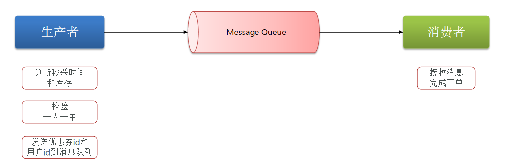

Redis提供了三种不同的方式来实现消息队列：

- list结构：基于List结构模拟消息队列
- PubSub：基本的点对点消息模型
- Stream：比较完善的消息队列模型


##### 1、基于List结构模拟消息队列

消息队列（Message Queue），字面意思就是存放消息的队列。而Redis的list数据结构是一个双向链表，很容易模拟出队列效果。

队列是入口和出口不在一边，因此我们可以利用：LPUSH 结合 RPOP、或者 RPUSH 结合 LPOP来实现。

不过要注意的是，当队列中没有消息时RPOP或LPOP操作会返回null，并不像JVM的阻塞队列那样会阻塞并等待消息。因此这里应该使用

BRPOP或者BLPOP来实现阻塞效果。


**基于List的消息队列有哪些优缺点？**

> 优点：
>
> - 利用Redis存储，不受限于JVM内存上限
> - 基于Redis的持久化机制，数据安全性有保证
> - 可以满足消息有序性
>
> 缺点：
>
> - 无法避免消息丢失
> - 只支持单消费者


##### 2、基于PubSub的消息队列

PubSub（发布订阅）是Redis2.0版本引入的消息传递模型。顾名思义，消费者可以订阅一个或多个channel，生产者向对应channel发送消息后，所有订阅者都能收到相关消息。

- SUBSCRIBE channel [channel] ：订阅一个或多个频道
- PUBLISH channel msg ：向一个频道发送消息
- PSUBSCRIBE pattern[pattern] ：订阅与pattern格式匹配的所有频道

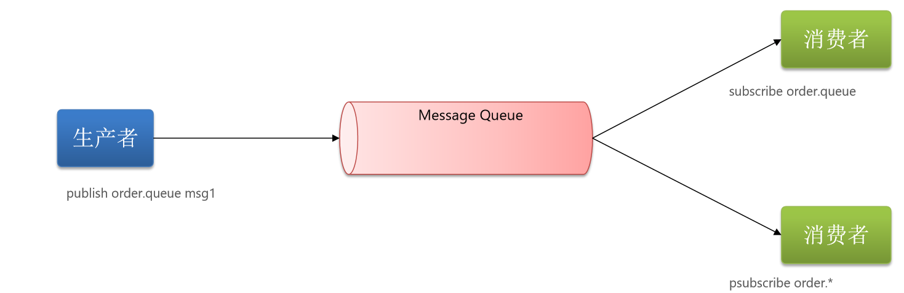


**基于PubSub的消息队列有哪些优缺点？**

> 优点：
>
> - 采用发布订阅模型，支持多生产、多消费
>
> 缺点：
>
> - 不支持数据持久化
> - 无法避免消息丢失
> - 消息堆积有上限，超出时数据丢失


##### 3、基于Stream的消息队列

Stream 是 Redis 5.0 引入的一种新数据类型，可以实现一个功能非常完善的消息队列。

发送消息的命令：

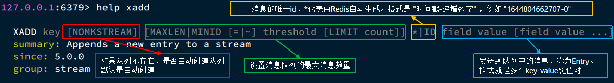

例如：

```
## 创建名为 users 的队列，并向其中发送一个消息，内容是：{name=jack,age=21}，并且使用Redis自动生成ID
127.0.0.1:6379> XADD users * name jack age 21
"1644805700523-0"
```


###### 1、XREAD

读取消息的方式之一：XREAD

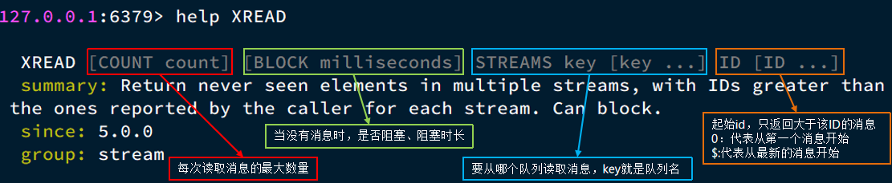

例如，使用XREAD读取第一个消息：

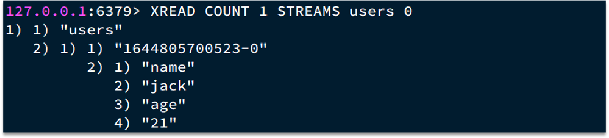


XREAD阻塞方式，读取最新的消息：

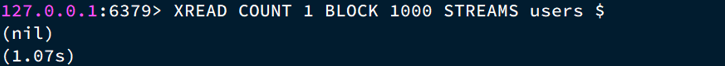


在业务开发中，我们可以循环的调用XREAD阻塞方式来查询最新消息，从而实现持续监听队列的效果，伪代码如下：

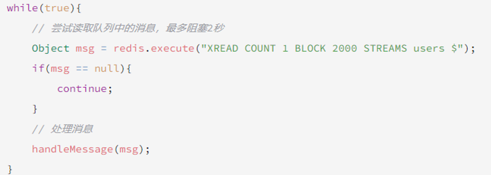

PS：当我们指定起始ID为$时，代表读取最新的消息，如果我们处理一条消息的过程中，又有超过1条以上的消息到达队列，则下次获取时也只能获取到最新的一条，会出现漏读消息的问题。


总结：

STREAM类型消息队列的XREAD命令特点：

- 消息可回溯
- 一个消息可以被多个消费者读取
- 可以阻塞读取
- 有消息漏读的风险


##### 4、基于Stream的消息队列-消费者组

> 消费者组（Consumer Group）：将多个消费者划分到一个组中，监听同一个队列。具备下列特点：
>
> 1. **消息分流**：队列中的消息会分流给组内的不同消费者，而不是重复消费，从而加快消息处理的速度
> 2. **消息标示**：消费者组会维护一个标示，记录最后一个被处理的消息，哪怕消费者宕机重启，还会从标示之后读取消息。确保每一个消息都会被消费
> 3. **消息确认**：消费者获取消息后，消息处于pending状态，并存入一个pending-list。当处理完成后需要通过XACK来确认消息，标记消息为已处理，才会从pending-list移除。


创建消费者组：

```
XGROUP CREATE  key groupName ID [MKSTREAM]
```

- key：队列名称
- groupName：消费者组名称
- ID：起始ID标示，$代表队列中最后一个消息，0则代表队列中第一个消息
- MKSTREAM：队列不存在时自动创建队列


其它常见命令：

```
# 删除指定的消费者组
XGROUP DESTORY key groupName

# 给指定的消费者组添加消费者
XGROUP CREATECONSUMER key groupname consumername

# 删除消费者组中的指定消费者
XGROUP DELCONSUMER key groupname consumername
```


从消费者组读取消息：

```
XREADGROUP GROUP group consumer [COUNT count] [BLOCK milliseconds] [NOACK] STREAMS key [key ...] ID [ID ...]
```

- group：消费组名称
- consumer：消费者名称，如果消费者不存在，会自动创建一个消费者
- count：本次查询的最大数量
- BLOCK milliseconds：当没有消息时最长等待时间
- NOACK：无需手动ACK，获取到消息后自动确认
- STREAMS key：指定队列名称
- ID：获取消息的起始ID：
    - ">"：从下一个未消费的消息开始
    - 其它：根据指定id从pending-list中获取已消费但未确认的消息，例如0，是从pending-list中的第一个消息开始


消费者监听消息的基本思路：

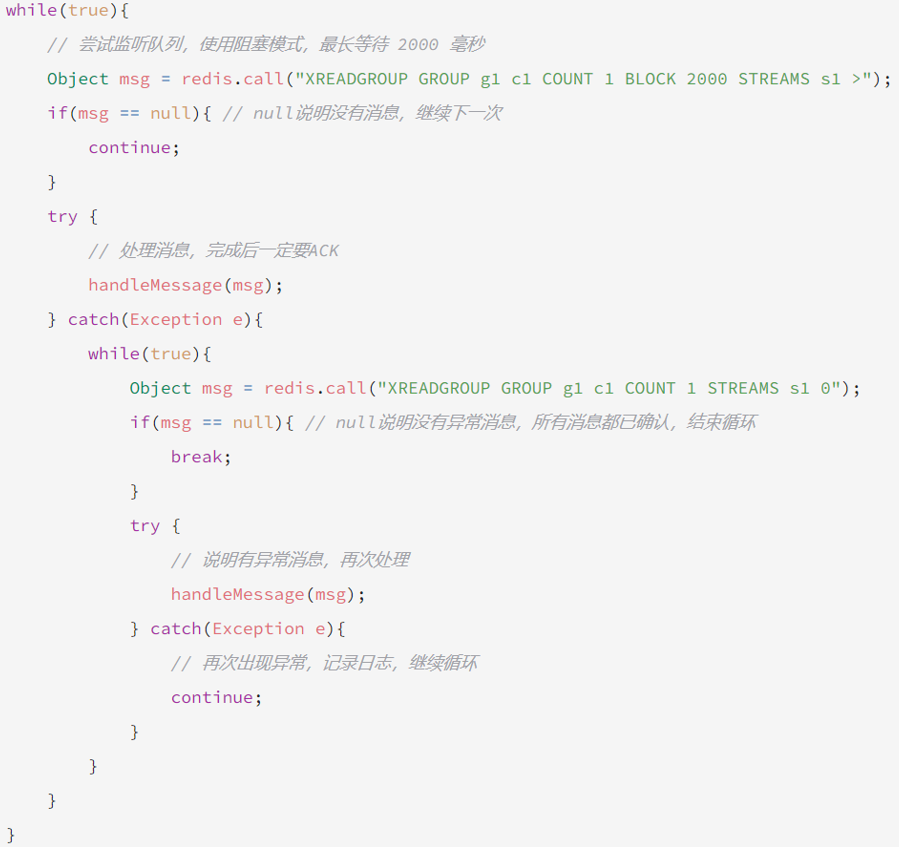


**总结**

STREAM类型消息队列的XREADGROUP命令特点：

- 消息可回溯
- 可以多消费者争抢消息，加快消费速度
- 可以阻塞读取
- 没有消息漏读的风险
- 有消息确认机制，保证消息至少被消费一次


##### 5、对比

|                  |                 **List**                 |     **PubSub**     |                       **Stream**                       |
| :--------------: | :--------------------------------------: | :----------------: | :----------------------------------------------------: |
|  **消息持久化**  |                   支持                   |       不支持       |                          支持                          |
|   **阻塞读取**   |                   支持                   |        支持        |                          支持                          |
| **消息堆积处理** | 受限于内存空间，可以利用多消费者加快处理 | 受限于消费者缓冲区 | 受限于队列长度，可以利用消费者组提高消费速度，减少堆积 |
| **消息确认机制** |                  不支持                  |       不支持       |                          支持                          |
|   **消息回溯**   |                  不支持                  |       不支持       |                          支持                          |


#### 2、基于Redis的Stream结构作为消息队列，实现异步秒杀下单

##### 1、需求

> 需求：
>
> - 创建一个Stream类型的消息队列，名为stream.orders
> - 修改之前的秒杀下单Lua脚本，在认定有抢购资格后，直接向stream.orders中添加消息，内容包含voucherId、userId、orderId
> - 项目启动时，开启一个线程任务，尝试获取stream.orders中的消息，完成下单


##### 2、创建一个Stream类型的消息队列，名为stream.orders

```
localhost:0>XGROUP CREATE stream.orders g1 0 MKSTREAM
"OK"
localhost:0>
```


##### 3、Java代码改造

```java
package com.hmdp.service.impl;

import cn.hutool.core.bean.BeanUtil;
import com.baomidou.mybatisplus.extension.service.impl.ServiceImpl;
import com.hmdp.dto.Result;
import com.hmdp.entity.VoucherOrder;
import com.hmdp.mapper.VoucherOrderMapper;
import com.hmdp.service.ISeckillVoucherService;
import com.hmdp.service.IVoucherOrderService;
import com.hmdp.utils.RedisIdWorker;
import com.hmdp.utils.UserHolder;
import org.redisson.api.RLock;
import org.redisson.api.RedissonClient;
import org.springframework.aop.framework.AopContext;
import org.springframework.beans.factory.annotation.Autowired;
import org.springframework.core.io.ClassPathResource;
import org.springframework.data.redis.connection.stream.*;
import org.springframework.data.redis.core.StringRedisTemplate;
import org.springframework.data.redis.core.script.DefaultRedisScript;
import org.springframework.stereotype.Service;
import org.springframework.transaction.annotation.Transactional;

import javax.annotation.PostConstruct;
import javax.annotation.Resource;
import java.time.Duration;
import java.util.Collections;
import java.util.List;
import java.util.Map;
import java.util.concurrent.ArrayBlockingQueue;
import java.util.concurrent.BlockingQueue;
import java.util.concurrent.ExecutorService;
import java.util.concurrent.Executors;
vv
@Service
public class VoucherOrderServiceImpl extends ServiceImpl<VoucherOrderMapper, VoucherOrder> implements IVoucherOrderService {

    @Resource
    private ISeckillVoucherService seckillVoucherService;

    @Resource
    private RedisIdWorker redisIdWorker;

    @Autowired
    private StringRedisTemplate stringRedisTemplate;

    @Resource
    private RedissonClient redissonClient;

    public static final DefaultRedisScript<Long> SECKILL_SCRIPT;
    static {
        SECKILL_SCRIPT = new DefaultRedisScript<>();
        //调用resource下的seckill脚本
        SECKILL_SCRIPT.setLocation(new ClassPathResource("seckill.lua"));
        SECKILL_SCRIPT.setResultType(Long.class);
    }

    /**
     * 阻塞队列
     */


    private static final ExecutorService seckill_order_excutor = Executors.newSingleThreadExecutor();

    @PostConstruct
    private void init(){
        seckill_order_excutor.submit(new VoucherOrderHandle());
    }
    /**
     * 内部类
     */
    private class VoucherOrderHandle implements Runnable{

        String queueName = "stream.orders";
        @Override
        public void run() {
            while (true){
                try {
                    //1.获取消息队列中的订单信息
                    List<MapRecord<String, Object, Object>> list = stringRedisTemplate.opsForStream().read(
                            Consumer.from("g1", "c1"),
                            StreamReadOptions.empty().count(1).block(Duration.ofSeconds(2)),
                            StreamOffset.create(queueName, ReadOffset.lastConsumed())
                    );
                    //判断消息是否获取成功
                    if (null == list || list.isEmpty()){
                        //获取失败，说明没有异常，执行下一次循环
                        continue;
                    }
                    //解析消息中的订单信息
                    MapRecord<String, Object, Object> record = list.get(0);
                    Map<Object, Object> values = record.getValue();
                    VoucherOrder voucherOrder = BeanUtil.fillBeanWithMap(values, new VoucherOrder(), true);
                    //获取成功，可用下单

                    handleVoucherOrder(voucherOrder);
                    //ACK确认
                    stringRedisTemplate.opsForStream().acknowledge(queueName, "g1", record.getId());
                } catch (Exception e) {
                    handlePendingList();
                    e.printStackTrace();
                }
                }
                //创建订单
            }

        private void handlePendingList() {
            while (true){
                try {
                    //1.获取消息队列中的订单信息
                    List<MapRecord<String, Object, Object>> list = stringRedisTemplate.opsForStream().read(
                            Consumer.from("g1", "c1"),
                            StreamReadOptions.empty().count(1).block(Duration.ofSeconds(2)),
                            StreamOffset.create(queueName, ReadOffset.from("0"))
                    );
                    //判断消息是否获取成功
                    if (null == list || list.isEmpty()){
                        //获取失败，说明pending-list没有异常，执行下一次循环
                        break;
                    }
                    //解析消息中的订单信息
                    MapRecord<String, Object, Object> record = list.get(0);
                    Map<Object, Object> values = record.getValue();
                    VoucherOrder voucherOrder = BeanUtil.fillBeanWithMap(values, new VoucherOrder(), true);
                    //获取成功，可用下单

                    handleVoucherOrder(voucherOrder);
                    //ACK确认
                    stringRedisTemplate.opsForStream().acknowledge(queueName, "g1", record.getId());
                } catch (Exception e) {
                    e.printStackTrace();
                }
            }
        }
    }
    private void handleVoucherOrder(VoucherOrder take) {
        //获取用户
        Long userId = take.getUserId();
        RLock redisLock = redissonClient.getLock("lock:order:" + userId);
        boolean isLock = redisLock.tryLock();
        //获取锁失败
        if (!isLock){
            //返回错误
            return;
        }
        try {

            proxy.createVoucherOrder(take);
        } finally {
            //释放锁
            redisLock.unlock();
        }
    }
    private IVoucherOrderService proxy;

    @Override
    public Result seckillVoucher(Long voucherId) {
        Long userId = UserHolder.getUser().getId();
        //创建订单号
        long orderId = redisIdWorker.nextId("order");
        //执行lua脚本
        Long execute = stringRedisTemplate.execute(
                SECKILL_SCRIPT,
                Collections.emptyList(),
                voucherId.toString(), userId.toString(), String.valueOf(orderId)
        );
        //判断是否返回为0 0-有购买资格 !0没有购买资格
        int i = execute.intValue();
        if (0 != i) {
            return Result.fail(1 == i ? "库存不足" : "不能重复下单");
        }

        //获取代理对象
        proxy = (IVoucherOrderService) AopContext.currentProxy();

        return Result.ok(orderId);
    }

    @Override
    @Transactional(rollbackFor = Exception.class)
    public void createVoucherOrder(VoucherOrder voucherOrder) {
        //一人一单
        Long userId = voucherOrder.getUserId();

        //查询订单
        Integer count = query().eq("user_id", userId).eq("voucher_id", voucherOrder).count();

        if (count > 0) {
            return ;
        }
        //扣减库存
        boolean success = seckillVoucherService.update()
                .setSql("stock = stock - 1")
                .eq("voucher_id", voucherOrder.getVoucherId()).gt("stock",0).update();
        if (!success){
            return;
        }

        save(voucherOrder);

    }
}
```
