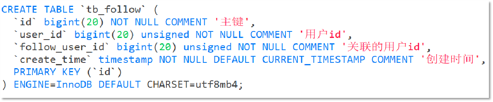
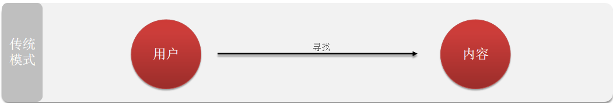
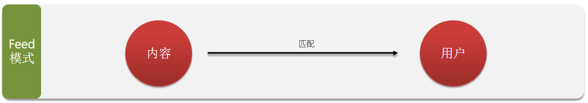
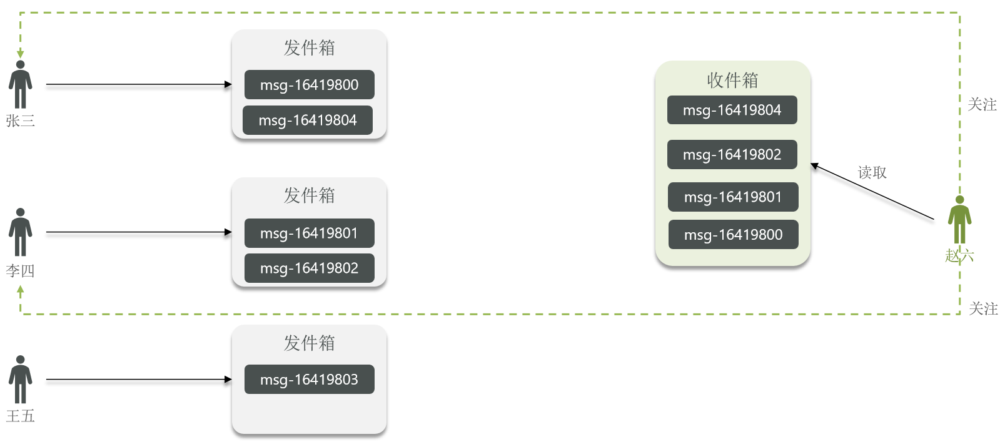
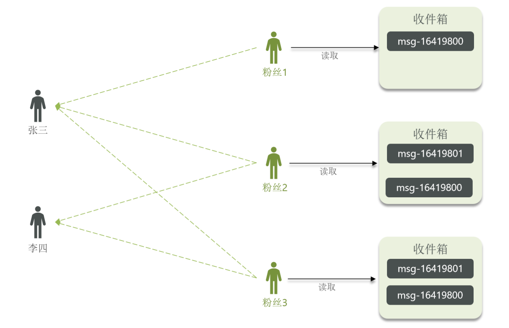
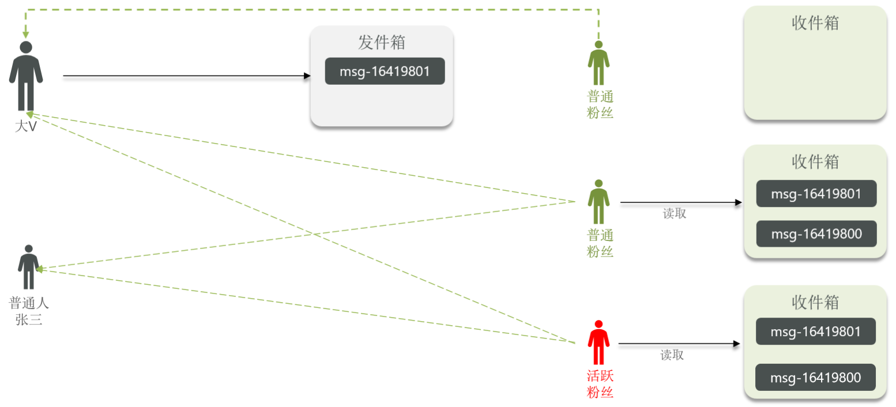
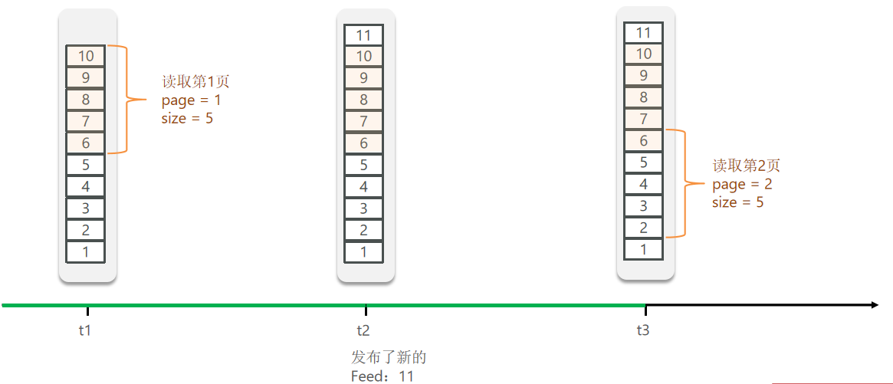
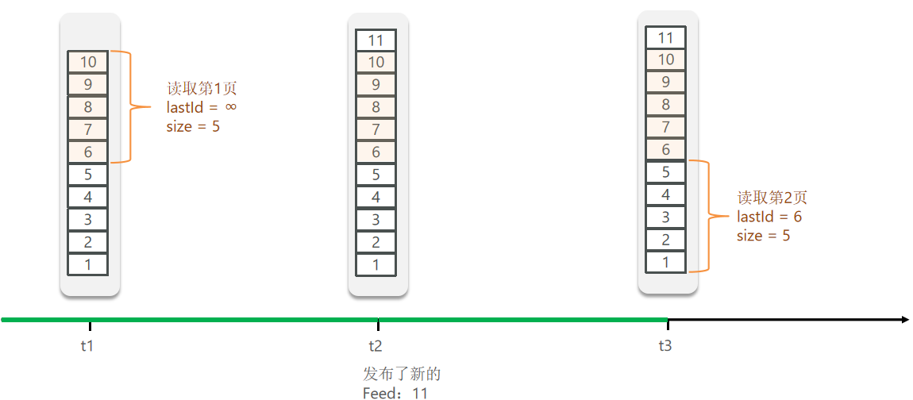

### 1、关注和取关

#### 1、需求

需求：基于该表数据结构，实现两个接口：

- 关注和取关接口
- 判断是否关注的接口

关注是User之间的关系，是博主与粉丝的关系，数据库中有一张tb_follow表来标示：




#### 2、实现

```java
@Override
public Result follow(Long followUserId, Boolean isFollow) {
    //获取登录用户
    Long userId = UserHolder.getUser().getId();

    String key = "follow:" + userId;
    //判断关注还是取关
    if (isFollow){
        Follow follow = new Follow();
        follow.setFollowUserId(followUserId);
        follow.setUserId(userId);
        save(follow);
    }else {
       remove(new QueryWrapper<Follow>()
                                .eq("user_id", userId).eq("follow_user_id", followUserId));
    }

    return Result.ok();
}

@Override
public Result isFollow(Long id) {
    //获取登录用户
    Long userId = UserHolder.getUser().getId();
    //查询是否关注
    Integer count = query().eq("user_id", userId).eq("follow_user_id", id).count();
    return Result.ok(0 < count);
}
```


### 2、共同关注

#### 1、需求

需求：利用Redis中恰当的数据结构，实现共同关注功能。在博主个人页面展示出当前用户与博主的共同好友。


#### 2、实现

共同关注是指user1和user2共同关注的博主，这里可以使用`SortSet`，可查看两个key共同的值

```
ZINTERSTORE destination numkeys key [key ...]
```

计算给定的一个或多个有序集的交集并将结果集存储在新的有序集合 destination 中


```java
/**
     * 共同关注
     * @param id
     * @return
     */
@Override
public Result followCommons(Long id) {
    Long userId = UserHolder.getUser().getId();

    String key = "follow:" + userId;
    String key2 = "follow:" + id;
    //求交集
    Set<String> intersect = stringRedisTemplate.opsForSet().intersect(key, key2);
    if (null == intersect || intersect.isEmpty()){
        return Result.ok(Collections.emptyList());
    }
    //转换id
    List<Long> ids = intersect.stream().map(Long::valueOf).collect(Collectors.toList());
    //查询用户
    List<UserDTO> users = userService.listByIds(ids)
        .stream()
        .map(user -> BeanUtil.copyProperties(user, UserDTO.class))
        .collect(Collectors.toList());
    return Result.ok(users);
}
```


### 3、关注推送

关注推送也叫做Feed流，直译为投喂。为用户持续的提供“沉浸式”的体验，通过无限下拉刷新获取新的信息。

传统模式下，用户需要的内容通过自己去查找



Feed模式下，通过用户浏览的内容进行分析，然后推送给用户




#### 1、Feed流

> Feed流产品有两种常见模式：
>
> - Timeline：不做内容筛选，简单的按照内容发布时间排序，常用于好友或关注。例如朋友圈
    >   - 优点：信息全面，不会有缺失。并且实现也相对简单
    >   - 缺点：信息噪音较多，用户不一定感兴趣，内容获取效率低
> - 智能排序：利用智能算法屏蔽掉违规的、用户不感兴趣的内容。推送用户感兴趣信息来吸引用户
    >   - 优点：投喂用户感兴趣信息，用户粘度很高，容易沉迷
    >   - 缺点：如果算法不精准，可能起到反作用

#### 2、Timeline模式

> 该模式的实现方案有三种：
>
> - 拉模式
> - 推模式
> - 推拉结合


##### 1、拉模式

> 拉模式：也叫做读扩散。简单来说就是关注者要读取的时候，实时去查询被关注者的发件箱，然后进行读取



每人都有一个发件箱，收件箱，张三、李四、王五、赵六四个人，赵六关注张三和李四。

现在张三和李四同时发两条信息，王五发送一条，赵六因关注张三和李四，这时会去查询张三李四的发件箱，然后进行读取，未关注王五则读取不到信息。


##### 2、推模式

> 推模式：也叫做写扩散。简单来说就是推送到每一个关注的邮箱，他们读取自己的邮箱的信息



##### 3、推拉结合

> 推拉结合模式：也叫做读写混合，兼具推和拉两种模式的优点。



对于普通人，粉丝量不大的，采用拉模式；对于大V且是活跃粉丝，采用推模式，精准推送，活跃度不高的可采用拉模式


##### 4、对比

|                  | **拉模式** | **推模式**        | **推拉结合**          |
| ---------------- | ---------- | ----------------- | --------------------- |
| **写比例**       | 低         | 高                | 中                    |
| **读比例**       | 高         | 低                | 中                    |
| **用户读取延迟** | 高         | 低                | 低                    |
| **实现难度**     | 复杂       | 简单              | 很复杂                |
| **使用场景**     | 很少使用   | 用户量少、没有大V | 过千万的用户量，有大V |


#### 3、基于推模式实现关注推送功能

##### 1、需求

> 需求：
>
> - 修改新增探店笔记的业务，在保存blog到数据库的同时，推送到粉丝的收件箱
> - 收件箱满足可以根据时间戳排序，必须用Redis的数据结构实现
> - 查询收件箱数据时，可以实现分页查询


##### 2、Feed流的分页问题

Feed流中的数据会不断更新，所以数据的角标也在变化，因此不能采用传统的分页模式。

传统角标的效果：



实际需要的效果：



##### 3、实现

1.修改新增探店笔记的业务，在保存blog到数据库的同时，推送到粉丝的收件箱

```java
@Override
public Result saveBlog(Blog blog) {
    // 获取登录用户
    UserDTO user = UserHolder.getUser();
    blog.setUserId(user.getId());
    // 保存探店博文
    boolean save = save(blog);
    if (!save) {
        return Result.fail("新增笔记失败！");
    }
    //查询笔记所有粉丝
    List<Follow> followList = followService.query().eq("follow_user_id", user.getId()).list();
    //笔记Id推送给粉丝
    for (Follow follow : followList) {
        String key = RedisConstants.FEED_KEY + follow.getUserId();
        stringRedisTemplate.opsForZSet().add(key, blog.getId().toString(), System.currentTimeMillis());
    }
    // 返回id
    return Result.ok(blog.getId());
}
```


```java
@Override
public Result follow(Long followUserId, Boolean isFollow) {
    //获取登录用户
    Long userId = UserHolder.getUser().getId();

    String key = "follow:" + userId;
    //判断关注还是取关
    if (isFollow){
        Follow follow = new Follow();
        follow.setFollowUserId(followUserId);
        follow.setUserId(userId);
        boolean isSuccess = save(follow);
        if (isSuccess) {
            //把关注用户的id存入redis set集合
            stringRedisTemplate.opsForSet().add(key, followUserId.toString());
        }
    }else {
        boolean remove = remove(new QueryWrapper<Follow>()
                                .eq("user_id", userId).eq("follow_user_id", followUserId));
        if (remove) {
            //从redis set集合中移除
            stringRedisTemplate.opsForSet().remove(key, followUserId.toString());
        }
    }

    return Result.ok();
}
```


2.收件箱满足可以根据时间戳排序，必须用Redis的数据结构实现


3.查询收件箱数据时，可以实现分页查询

```java
/**
     * 收件箱笔记滚动分页
     * @param lastId
     * @param offset
     * @return
     */
@Override
public Result queryBlogOfFollow(Long lastId, Integer offset) {
    //获取当前用户
    Long userId = UserHolder.getUser().getId();
    //查询收件箱
    String key = RedisConstants.FEED_KEY + userId;
    Set<ZSetOperations.TypedTuple<String>> range = stringRedisTemplate.opsForZSet()
        .reverseRangeByScoreWithScores(key, 0, lastId, offset, 2);
    if (null == range || range.isEmpty()) {
        return Result.ok();
    }
    //解析数据blogId,minTime时间戳
    List<Long> list = new ArrayList<>(range.size());
    long minTime = 0;
    int os = 1;
    for (ZSetOperations.TypedTuple<String> tuple : range) {
        //获取iD
        list.add(Long.valueOf(tuple.getValue()));
        //获取分数（时间戳）
        long time = tuple.getScore().longValue();
        if (time == minTime){
            os++;
        }else {
            minTime = time;
            os = 1;
        }
    }
    //根据id查询blog 返回也要根据顺序返回
    List<Blog> blogs = query().in("id", list)
        .last("order by field(id, " + StrUtil.join(",", list) + ")").list();
    for (Blog blog : blogs) {
        isBlogLiked(blog);
    }
    //封装返回
    ScrollResult scrollResult = new ScrollResult();
    scrollResult.setList(blogs);
    scrollResult.setMinTime(minTime);
    scrollResult.setOffset(os);
    return Result.ok(scrollResult);
}
```
