### 1、什么是缓存

> 缓存就是数据交换的缓冲区（称作Cache [ kæʃ ] ），是存贮数据的临时地方，一般读写性能较高。

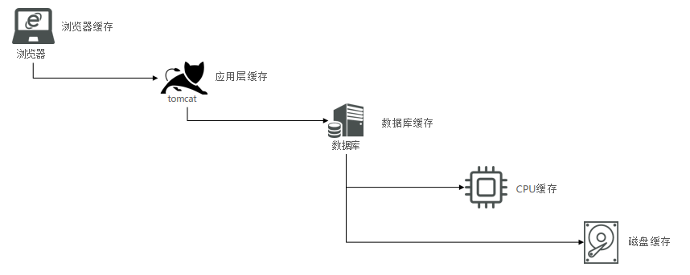

- 浏览器缓存：缓存常用的样式css，js

- 应用层缓存：浏览器未命中的缓存，则缓存在应用中

- 数据库缓存：应用层未命中，则命中到数据库缓存，可缓存索引；通过索引查询时可快速检索，减少磁盘的读写

- CPU缓存：在Cache中的数据是内存中的一小部分，但这一小部分是短时间内CPU即将访问的，当CPU调用大量数据时，就可避开内

  存直接从Cache中调用，从而加快读取速度。由此可见，在CPU中加入Cache是一种高效的解决方案，这样整个内存储器（Cache+内

  存）就变成了既有Cache的高速度，又有内存的大容量的存储系统了。

- 磁盘缓存：为了减少CPU透过I/O读取磁盘机的次数，提升磁盘I/O的效率，用一块内存来储存存取较频繁的磁盘内容；因为内存的存取是电子动作，而磁盘的存取是I/O动作，感觉上磁盘I/O变得较为快速。


#### 缓存的作用

- 降低后端负载
- 提高读写效率，降低响应时间


#### 缓存的成本

- 数据一致性成本
- 代码维护成本
- 运维成本


### 2、添加Redis缓存

#### 1、未添加缓存作用模型

> 客户端直接将请求打到数据库，数据库查询到之后直接返回给客户端

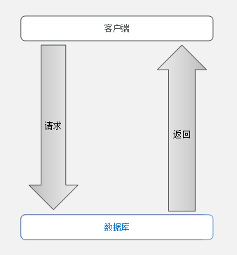


#### 2、添加缓存作用模型

> 客户端请求到Redis，如果redis命中则返回客户端，未命中则请求到数据库，查询到之后则返回给客户端，同时，将结果写入到redis中

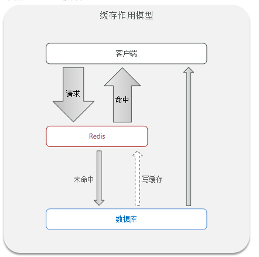


#### 3、商户缓存到redis

```java
@Override
public Result queryById(Long id) {
    //从redis查询缓存
    String key = RedisConstants.CACHE_SHOP_KEY + id;
    String shopInfo = stringRedisTemplate.opsForValue().get(key);
    //判断是否存在
    if (StrUtil.isNotBlank(shopInfo)){
        //存在则返回
        Shop shop = JSONUtil.toBean(shopInfo, Shop.class);
        return Result.ok(shop);
    }

    //不存在，则查询数据库
    Shop shop = getById(id);
    //不存在则返回错误
    if (null == shop){
        return Result.fail("店铺不存在");
    }

    //写入缓存
    stringRedisTemplate.opsForValue().set(key, JSONUtil.toJsonStr(shop));
    //数据库存在，则返回

    return Result.ok(shop);
}
```


### 3、缓存更新策略

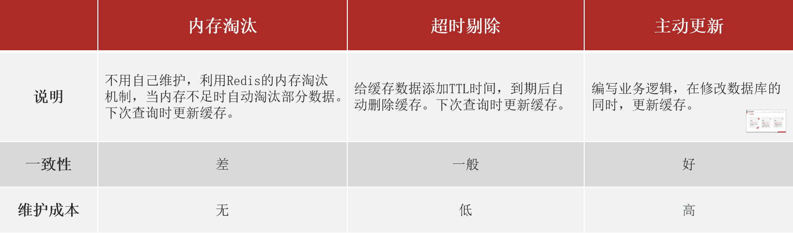

业务场景：

- 低一致性需求：使用内存淘汰机制。例如店铺类型的查询缓存
- 高一致性需求：主动更新，并以超时剔除作为兜底方案。例如店铺详情查询的缓存


#### 1、主动更新

1. Cache Aside Pattern：由缓存的调用者，在更新数据库的同时更新缓存
2. Read/Write Through Pattern：缓存与数据库整合为一个服务，由服务维护一致性，调用者调用该服务，无需关心缓存一致性问题
3. Write Behind Caching Pattern：调用者只操作缓存，由其他线程异步的将缓存的数据持久化到数据库，保证最终一致。

PS：**一般使用方案1，由缓存的调用者，在更新数据库的同时更新缓存**


#### 2、Cache Aside Pattern

> 由缓存的调用者，在更新数据库的同时更新缓存

操作缓存和数据库时有三个问题需要考虑：

1. 删除缓存还是更新缓存？
2. 如何保证缓存与数据库的操作的同时成功或失败？
3. 先操作缓存还是先操作数据库？


##### 1、删除缓存还是更新缓存？

> - 更新缓存：每次更新数据库都更新缓存，无效写操作较多 :x:
    >
    >   如果更新数据库的次数多，而读取的次数较少，则每次更新时，都会增加无效的更新缓存操作
>
> - 删除缓存：更新数据库时让缓存失效，查询时再更新缓存 :heavy_check_mark:


##### 2、如何保证缓存与数据库的操作的同时成功或失败？

> - 单体系统，将缓存与数据库操作放在一个事务
> - 分布式系统，利用TCC等分布式事务方案


##### 3、先操作缓存还是先操作数据库？

> - 先删除缓存，再操作数据库
> - 先操作数据库，再删除缓存


###### 1、先删除缓存，再操作数据库

**不存在线程安全问题场景**

1. 线程1收到请求后，先删除缓存，然后更新数据库值为20
2. 线程2收到请求后，先查询缓存，并没有命中，则查询数据库的值为20，再写入缓存

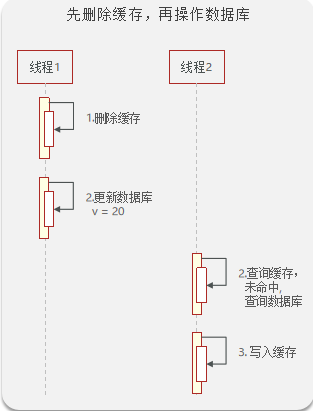


**存在线程安全问题场景**

1. 线程1收到请求后，先删除缓存
2. 线程2收到查询请求，查询缓存发现没有命中，则去查询数据库的值为10
3. 线程2将数据库的值写入缓存
4. 线程1更新数据库的值为20，此时导致数据不一致问题

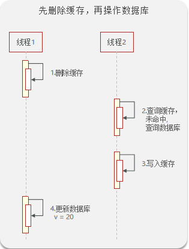


###### 2、先操作数据库，再删除缓存:heavy_check_mark:

**不存在线程安全问题场景**

1. 线程2收到请求后更新数据库值为20
2. 线程2更新完成后，删除缓存
3. 线程1收到请求后，查询缓存，未命中，则查询数据库
4. 线程1查询到数据后，写入缓存

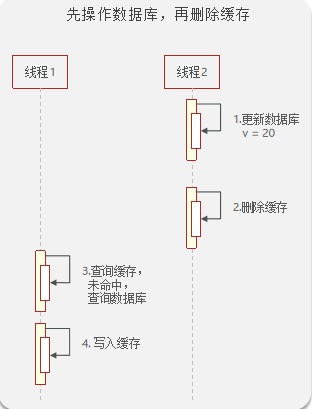


**存在线程安全问题场景**

1. 线程1收到查询请求后，查询缓存，未名中，则去查询数据库值为10
2. 线程2收到更新请求，更新数据库值为20
3. 线程2更新数据库后，删除缓存
4. 线程1写入缓存值为10，此时缓存写入的是旧数据

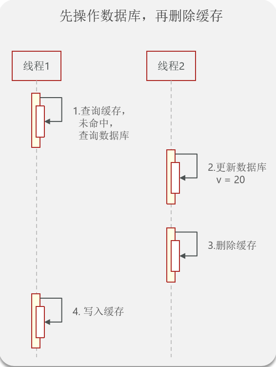


#### 3、总结

缓存更新策略的最佳实践方案：

1. 低一致性需求：使用Redis自带的内存淘汰机制
2. 高一致性需求：主动更新，并以超时剔除作为兜底方案
    - 读操作
        - 缓存命中则直接返回
        - 缓存未命中则查询数据库，并写入缓存，设定超时时间
    - 写操作
        - 先写数据库，然后再删除缓存
        - 要确保数据库与缓存操作的原子性


#### 4、实战

##### 1、查询设置超时时间

```java
@Override
public Result queryById(Long id) {
    //从redis查询缓存
    String key = RedisConstants.CACHE_SHOP_KEY + id;
    String shopInfo = stringRedisTemplate.opsForValue().get(key);
    //判断是否存在
    if (StrUtil.isNotBlank(shopInfo)){
        //存在则返回
        Shop shop = JSONUtil.toBean(shopInfo, Shop.class);
        return Result.ok(shop);
    }

    //不存在，则查询数据库
    Shop shop = getById(id);
    //不存在则返回错误
    if (null == shop){
        return Result.fail("店铺不存在");
    }

    //写入缓存 设置超时时间为30min
    stringRedisTemplate.opsForValue().set(key, JSONUtil.toJsonStr(shop), RedisConstants.CACHE_SHOP_TTL, TimeUnit.MINUTES);
    //数据库存在，则返回

    return Result.ok(shop);
}
```


##### 2、更新时删除缓存

```java
@Override
@Transactional
public Result update(Shop shop) {
    Long id = shop.getId();
    if (null == id){
        return Result.fail("店铺id不能为空");
    }
    //1.更新数据库
    updateById(shop);
    //2.删除缓存
    stringRedisTemplate.delete(RedisConstants.CACHE_SHOP_KEY + shop.getId());

    return Result.ok();
}
```


### 4、缓存穿透

#### 1、定义

> 缓存穿透是指客户端请求的数据在缓存中和数据库中都不存在，这样缓存永远不会生效，这些请求都会打到数据库。
>
> 通俗点就是：key对应的数据在数据源并不存在，每次针对此key的请求从缓存获取不到，请求都会到数据源，从而可能压垮数据源。比如用一个不存在的用户id获取用户信息，不论缓存还是数据库都没有，若黑客利用此漏洞进行攻击可能压垮数据库。

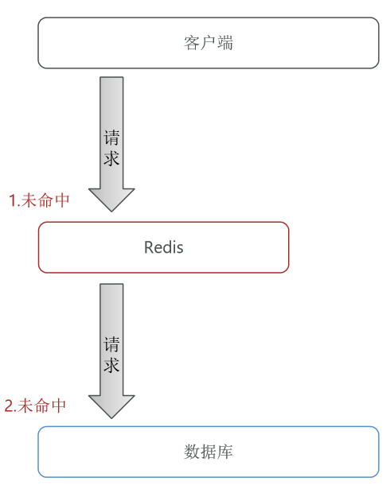

#### 2、解决方案

##### 1、缓存空对象

> 当客户端请求到redis后，未命中去查询数据库，数据库查询返回为null，则缓存为null

优点：

- 实现简单，维护方便

缺点：

- 额外的内存消耗

  > 若客户端请求大量数据都是不存在的，则redis会缓存大量的null数据

- 可能造成短期的不一致

  > 客户端请求不存在的数据后，redis缓存数据为null，并设置了超时时间，此时就新增了一条数据，则再去查询时（还在TTL内），还是为null，只有当时间失效时，才会查询到
  >
  > - 可在新增时，更新缓存，可解决短期的不一致


##### 2、布隆过滤器

> 布隆过滤器是一个 bit 向量或者说 bit 数组（超长超长，记住一定要足够长）
>
> 将所有可能存在的数据哈希到一个足够大的bitmap中，一个一定不存在的数据会被 这个bitmap拦截掉，从而避免了对底层存储系统的查询压力。

优点：

- 内存占用较少，没有多余key

缺点：

- 实现复杂
- 存在误判可能

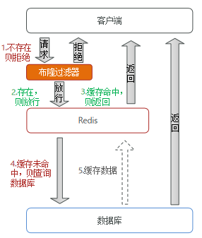


#### 3、实战

```JAVA
@Override
public Result queryById(Long id) {
    //从redis查询缓存
    String key = RedisConstants.CACHE_SHOP_KEY + id;
    String shopInfo = stringRedisTemplate.opsForValue().get(key);
    //判断是否存在
    if (StrUtil.isNotBlank(shopInfo)){
        //存在则返回
        Shop shop = JSONUtil.toBean(shopInfo, Shop.class);
        return Result.ok(shop);
    }

    if (null != shopInfo){
        return Result.fail("店铺不存在");
    }

    //不存在，则查询数据库
    Shop shop = getById(id);
    //不存在则返回错误
    if (null == shop){
        //将空值写入redis
        stringRedisTemplate.opsForValue().set(key, "", RedisConstants.CACHE_NULL_TTL, TimeUnit.MINUTES);
        return Result.fail("店铺不存在");
    }

    //写入缓存 设置超时时间为30min
    stringRedisTemplate.opsForValue().set(key, JSONUtil.toJsonStr(shop), RedisConstants.CACHE_SHOP_TTL, TimeUnit.MINUTES);
    //数据库存在，则返回

    return Result.ok(shop);
}
```


#### 4、总结

##### 原因

> 用户请求的数据在缓存中和数据库中都不存在，不断发起这样的请求，给数据库带来巨大压力

##### 解决方案

> - 缓存null值
> - 布隆过滤
> - 增强id的复杂度，避免被猜测id规律
> - 做好数据的基础格式校验
> - 加强用户权限校验
> - 做好热点参数的限流


### 5、缓存雪崩

#### 1、定义

> 缓存雪崩是指在同一时段大量的缓存key同时失效或者Redis服务宕机，导致大量请求到达数据库，带来巨大压力。
>
> key可能会在某些时间点被超高并发地访问，是一种非常“热点”的数据。这个时候，需要考虑一个问题：缓存被“击穿”的问题。

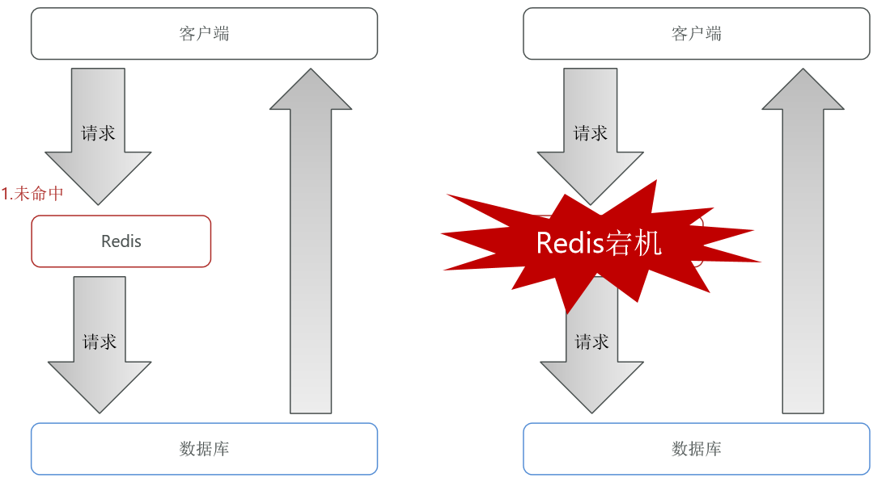


#### 2、解决方案

- 给不同的Key的TTL添加随机值
- 利用Redis集群提高服务的可用性
- 给缓存业务添加降级限流策略
- 给业务添加多级缓存

### 6、缓存击穿

#### 1、定义

> 缓存击穿问题也叫热点Key问题，就是一个被**高并发访问**并且**缓存重建业务较复杂**的key突然失效了，无数的请求访问会在瞬间给数据库带来巨大的冲击。

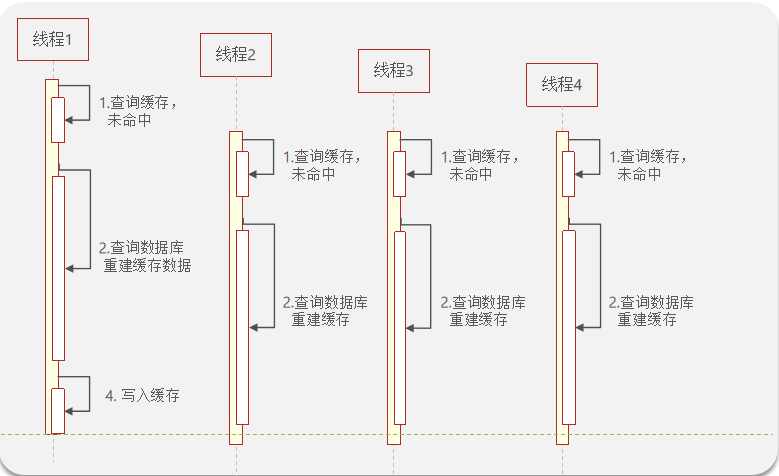

4个线程同时访问，且redis数据失效了，4个线程同时请求，查询缓存，发现未命中，则去查询数据库，重建缓存数据，最后写入缓存。

会发现，4个线程会同时访问数据库并写入缓存。


解决方案：

- 互斥锁
- 逻辑过期


#### 2、解决方案

##### 1、互斥锁

> 所谓互斥，就是不同线程，通过竞争进入临界区（共享的数据和硬件资源），为了防止访问冲突，在有限的时间内只允许其中之一独占性的使用共享资源。如不允许同时写。

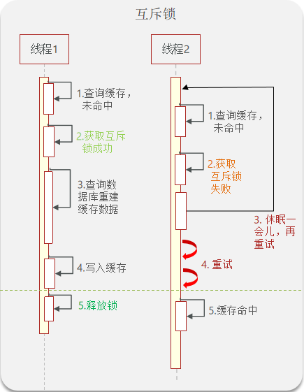


1. 线程1发起请求，查询缓存发现未命中，然后获取互斥锁，成功之后，则去查询数据库重建缓存数据，写入缓存，释放锁。
2. 线程2在线程1未释放锁之前发起请求，查询缓存未命中，然后获取互斥锁，发现被线程1占用了，则获取失败，休眠一会儿，再重新获取锁（直到线程1释放），最后缓存命中。

存在的问题：互斥等待时间，如果1000个线程同时访问，则只有1个获取成功，其他999个都是在等待，性能会下降


##### 2、逻辑过期

> 逻辑过期：原来我们存储数据到redis中的时候，存的是k:v键值对，那逻辑过期，就是手动给value增加一个expire时间

| **KEY**      | **VALUE**                                   |
| ------------ | ------------------------------------------- |
| heima:user:1 | {name:"Jack", age:21, **expire:152141223**} |

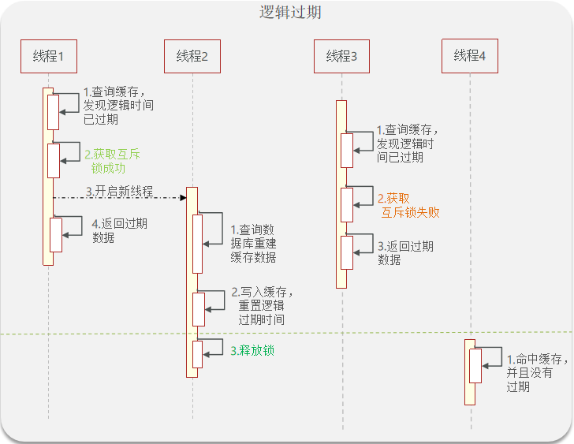


1. 线程1发起请求，查询缓存，发现逻辑时间已过期，则回获取互斥锁，此时线程会开启一个新线程2（用于查询数据存入缓存），先返回过期的数据
2. 线程2查询数据库后，重建缓存数据，写入缓存后，重置逻辑过期时间，最后释放锁
3. 线程3发起请求（与线程1同步），查询缓存，发现逻辑时间已过期，获取互斥锁失败，就先返回旧数据
4. 线程4查询缓存，此时线程2已经释放锁，缓存命中，逻辑过期时间未过期，则直接返回


##### 3、比较

| **解决方案**         | **优点**                                 | **缺点**                               |
| -------------------- | ---------------------------------------- | -------------------------------------- |
| **互斥锁**（一致性） | 没有额外的内存消耗、保证一致性、实现简单 | 线程需要等待，性能受影响可能有死锁风险 |
| **逻辑过期**（性能） | 线程无需等待，性能较好                   | 不保证一致性、有额外内存消耗、实现复杂 |


#### 3、实战

##### 1、基于互斥锁方式解决缓存击穿问题

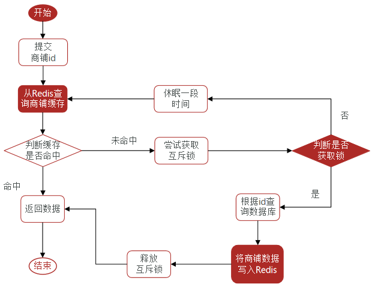

```java
/**
     * 缓存穿透解决方案
     * @param id
     * @return
     */
public Shop queryByCacheMutex(Long id){
    //从redis查询缓存
    String key = RedisConstants.CACHE_SHOP_KEY + id;
    String shopInfo = stringRedisTemplate.opsForValue().get(key);
    //判断是否存在
    if (StrUtil.isNotBlank(shopInfo)){
        //存在则返回
        return JSONUtil.toBean(shopInfo, Shop.class);
    }

    if (null != shopInfo){
        return null;
    }
    Shop shop = null;

    String lockKey = RedisConstants.LOCK_SHOP_KEY + id;
    try {
        //尝试获取互斥锁
        boolean tryLock = tryLock(lockKey);
        //判断是否获取成功
        if (!tryLock){
            //不成功，则休眠，重试
            Thread.sleep(10);
            return queryByCacheMutex(id);
        }

        //成功则查询数据库
        shop = getById(id);
        //模拟延迟
        Thread.sleep(200);
        //不存在则返回错误
        if (null == shop){
            //将空值写入redis
            stringRedisTemplate.opsForValue().set(key, "", RedisConstants.CACHE_NULL_TTL, TimeUnit.MINUTES);
            return null;
        }

        //写入缓存 设置超时时间为30min
        stringRedisTemplate.opsForValue().set(key, JSONUtil.toJsonStr(shop), RedisConstants.CACHE_SHOP_TTL, TimeUnit.MINUTES);

    } catch (InterruptedException e) {
        e.printStackTrace();
    } finally {
        //释放锁
        unLock(lockKey);
    }
    return shop;
}

/**
     * 获取锁
     * @param key
     * @return
     */
private boolean tryLock(String key){
    Boolean flag = stringRedisTemplate.opsForValue().setIfAbsent(key, "", RedisConstants.LOCK_SHOP_TTL, TimeUnit.SECONDS);
    return BooleanUtil.isTrue(flag);
}

/**
     * 释放锁
     * @param key
     */
private void unLock(String key){
    stringRedisTemplate.delete(key);
}
```


##### 2、基于逻辑过期方式解决缓存击穿问题

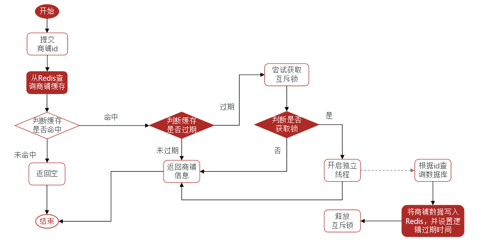

```java
public Shop queryWithLogicalExpire(Long id){
    //从redis查询缓存
    String key = RedisConstants.CACHE_SHOP_KEY + id;
    String shopInfo = stringRedisTemplate.opsForValue().get(key);
    //判断是否存在
    if (StrUtil.isBlank(shopInfo)){
        //存在则返回
        return null;
    }
    RedisData data = JSONUtil.toBean(shopInfo, RedisData.class);
    LocalDateTime expireTime = data.getExpireTime();
    Shop shop = JSONUtil.toBean((JSONObject) data.getData(), Shop.class);
    //判断是否过期
    if (expireTime.isAfter(LocalDateTime.now())) {
        //未过期，直接返回
        return shop;
    }
    //过期则获取互斥锁
    String lockKey = RedisConstants.LOCK_SHOP_KEY + id;
    boolean lock = tryLock(lockKey);
    if (lock){
        //获取系统处理器个数，作为线程池数量
        //            int nThreads = Runtime.getRuntime().availableProcessors();
        //手动创建线程池
        ThreadFactory build = new ThreadFactoryBuilder().setNamePrefix("demo-build-%d").build();
        //Common Thread Pool
        ExecutorService pool = new ThreadPoolExecutor(10, 12,
                                                      0L, TimeUnit.MILLISECONDS,
                                                      new LinkedBlockingQueue<Runnable>(1024), build, new ThreadPoolExecutor.AbortPolicy());

        pool.submit(()->{
            try {
                this.saveShopToRedis(id,20L);
            } catch (Exception e) {
                e.printStackTrace();
            } finally {
                //释放锁
                unLock(lockKey);
            }
        });
    }

    return shop;
}

/**
     * 保存数据到redis
     * @param id
     * @param expire
     */
public void saveShopToRedis(Long id, Long expire){
    //查询店铺数据
    Shop byId = getById(id);
    //封装逻辑过期时间
    RedisData redisData = new RedisData();
    redisData.setData(byId);
    redisData.setExpireTime(LocalDateTime.now().plusSeconds(expire));
    //写入redis
    stringRedisTemplate.opsForValue().set(RedisConstants.CACHE_SHOP_KEY + id, JSONUtil.toJsonStr(redisData));
}

```


```java
@Data
public class RedisData {
    private LocalDateTime expireTime;
    private Object data;
}
```


### 7、缓存工具封装

```java
@Component
@Slf4j
public class RedisCacheClient {

    private final StringRedisTemplate stringRedisTemplate;

    public RedisCacheClient(StringRedisTemplate stringRedisTemplate) {
        this.stringRedisTemplate = stringRedisTemplate;
    }

    public void set(String key, Object value, Long time, TimeUnit timeUnit){
        stringRedisTemplate.opsForValue().set(key, JSONUtil.toJsonStr(value), time, timeUnit);
    }

    /**
     * 逻辑过期时间
     * @param key
     * @param value
     * @param time
     * @param timeUnit
     */
    public void setWithLogicalExpire(String key, Object value, Long time, TimeUnit timeUnit){
        RedisData redisData = new RedisData();
        redisData.setData(value);
        redisData.setExpireTime(LocalDateTime.now().plusSeconds(timeUnit.toSeconds(time)));
        //写入redis
        stringRedisTemplate.opsForValue().set(key, JSONUtil.toJsonStr(redisData), time, timeUnit);
    }

    /**
     * 缓存穿透
     * @param keyPrefix
     * @param id
     * @param type
     * @param dbFallBack
     * @param time
     * @param timeUnit
     * @param <R>
     * @param <ID>
     * @return
     */
    public <R, ID> R queryWithPassThrough(
            String keyPrefix, ID id, Class<R> type, Function<ID, R> dbFallBack, Long time, TimeUnit timeUnit){
        //从redis查询缓存
        String key = keyPrefix + id;
        String json = stringRedisTemplate.opsForValue().get(key);
        //判断是否存在
        if (StrUtil.isNotBlank(json)){
            //存在则返回
            return JSONUtil.toBean(json, type);
        }

        if (null != json){
            return null;
        }

        //不存在，则查询数据库
        R r = dbFallBack.apply(id);
        //不存在则返回错误
        if (null == r){
            //将空值写入redis
            stringRedisTemplate.opsForValue().set(key, "", RedisConstants.CACHE_NULL_TTL, TimeUnit.MINUTES);
            return null;
        }

        //写入缓存 设置超时时间为30min
        this.set(key, r, time, timeUnit);
        //数据库存在，则返回
        return r;
    }

    /**
     * 缓存击穿
     * @param keyPrefix
     * @param id
     * @param type
     * @param dbFallBack
     * @param time
     * @param timeUnit
     * @param <R>
     * @param <ID>
     * @return
     */
    public <R, ID> R  queryWithLogicalExpire(
            String keyPrefix, ID id, Class<R> type, Function<ID, R> dbFallBack, Long time, TimeUnit timeUnit){
        //从redis查询缓存
        String key = keyPrefix + id;
        String json = stringRedisTemplate.opsForValue().get(key);
        //判断是否存在
        if (StrUtil.isBlank(json)){
            //存在则返回
            return null;
        }
        RedisData data = JSONUtil.toBean(json, RedisData.class);
        LocalDateTime expireTime = data.getExpireTime();
        R r = JSONUtil.toBean((JSONObject) data.getData(), type);
        //判断是否过期
        if (expireTime.isAfter(LocalDateTime.now())) {
            //未过期，直接返回
            return r;
        }
        //过期则获取互斥锁
        String lockKey = RedisConstants.LOCK_SHOP_KEY + id;
        boolean lock = tryLock(lockKey);
        if (lock){
            //获取系统处理器个数，作为线程池数量
//            int nThreads = Runtime.getRuntime().availableProcessors();
            ThreadFactory build = new ThreadFactoryBuilder().setNamePrefix("demo-build-%d").build();
            //Common Thread Pool
            ExecutorService pool = new ThreadPoolExecutor(10, 12,
                    0L, TimeUnit.MILLISECONDS,
                    new LinkedBlockingQueue<Runnable>(1024), build, new ThreadPoolExecutor.AbortPolicy());

            pool.submit(()->{
                try {
                    //查询数据库
                    R r1 = dbFallBack.apply(id);
                    //写入缓存
                    this.setWithLogicalExpire(key, r1, time, timeUnit);
                } catch (Exception e) {
                    e.printStackTrace();
                } finally {
                    //释放锁
                    unLock(lockKey);
                }
            });
        }
        return r;
    }
    /**
     * 获取锁
     * @param key
     * @return
     */
    private boolean tryLock(String key){
        Boolean flag = stringRedisTemplate.opsForValue().setIfAbsent(key, "", RedisConstants.LOCK_SHOP_TTL, TimeUnit.SECONDS);
        return BooleanUtil.isTrue(flag);
    }

    /**
     * 释放锁
     * @param key
     */
    private void unLock(String key){
        stringRedisTemplate.delete(key);
    }
    
}
```

调用

```java
@Override
public Result queryById(Long id) {
    //缓存穿透解决方案
    Shop shop = redisCacheClient
        .queryWithPassThrough(RedisConstants.CACHE_SHOP_KEY, id, Shop.class, this::getById, RedisConstants.CACHE_SHOP_TTL, TimeUnit.MINUTES);

    //缓存击穿
    redisCacheClient.queryWithLogicalExpire(RedisConstants.CACHE_SHOP_KEY, id, Shop.class, this::getById, RedisConstants.CACHE_SHOP_TTL, TimeUnit.MINUTES);
    if (null == shop) {
        return Result.fail("店铺不存在");
    }
    return Result.ok(shop);

}
```
