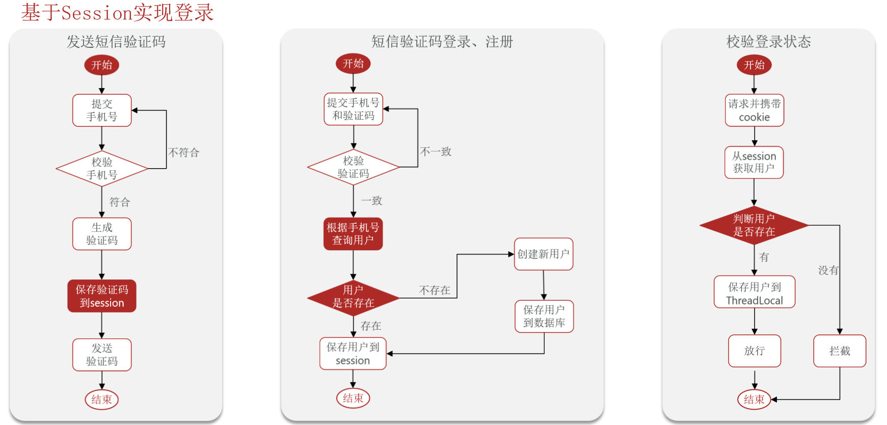
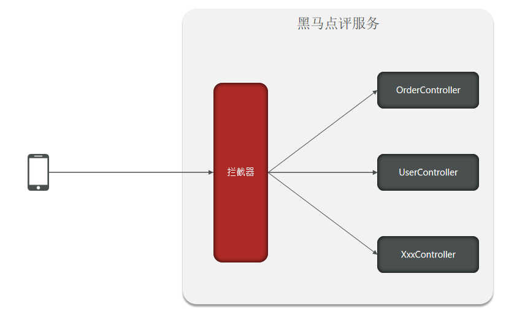
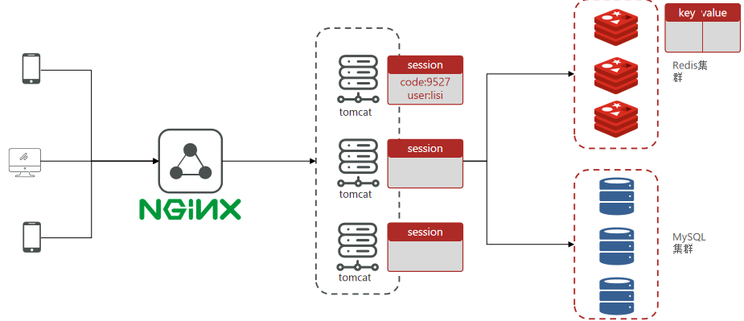
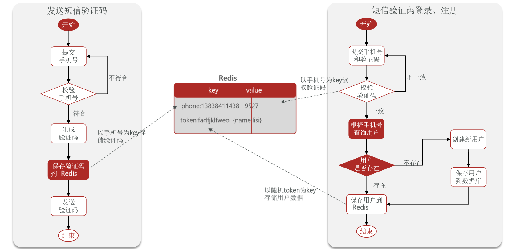
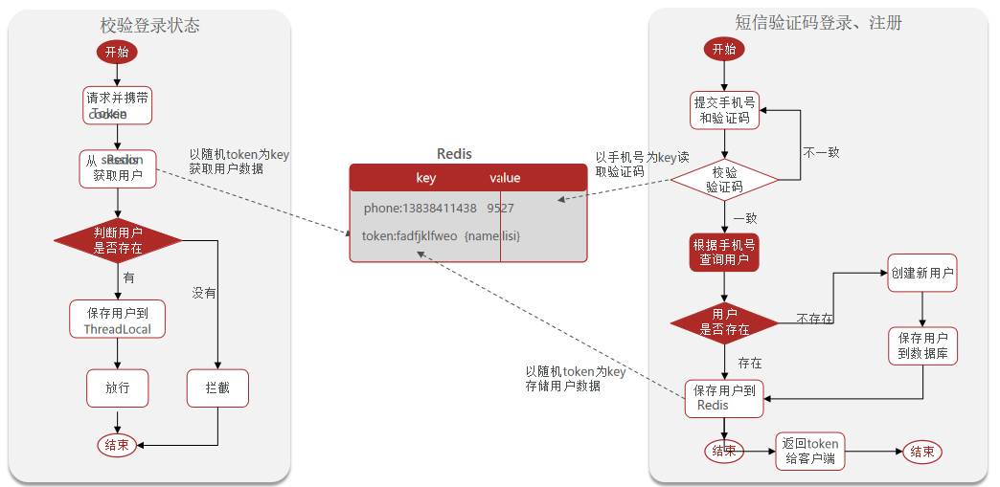
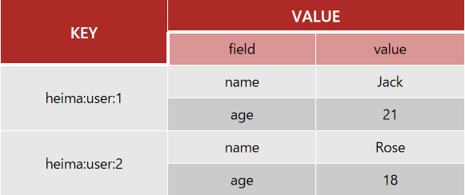
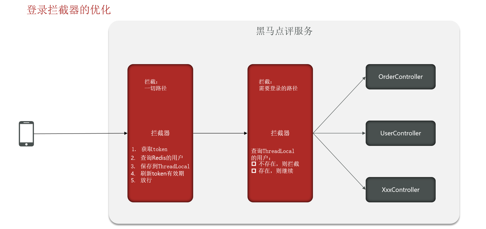

### 1、流程讲解




### 2、基于Session实现登录

#### 1、发送短信验证码

```java
    /**
     * 发送验证码
     * @param phone
     * @param session
     * @return
     */
    @Override
    public Result sendCode(String phone, HttpSession session) {
        //【1】校验手机号
        if (RegexUtils.isPhoneInvalid(phone)) {
            return Result.fail("手机号格式错误");
        }
        //【2】生成验证码
        String numbers = RandomUtil.randomNumbers(6);

        //保存到session
        session.setAttribute("code",numbers);

        return Result.ok(numbers);
    }
```


#### 2、短信验证码登录、注册

```java
  /**
     * 用户登录
     * @param loginForm
     * @param session
     * @return
     */
    @Override
    public Result login(LoginFormDTO loginForm, HttpSession session) {
        //【1】校验手机号
        String phone = loginForm.getPhone();
        if (RegexUtils.isPhoneInvalid(phone)) {
            return Result.fail("手机号格式错误");
        }
        //【2】校验验证码
        String code = loginForm.getCode();
        //存在session的数据
        Object sessionCode = session.getAttribute("code");
        if (null == sessionCode || !sessionCode.equals(code)){
            return Result.fail("验证码错误");
        }

        //【3】查询用户是否存在
        User user = query().eq("phone", phone).one();
        if (null == user){
            user = createUserWithPhone(phone);
        }
        session.setAttribute("user", userDTO);
        return Result.ok(token);
    }

    /**
     * 根据手机号创建用户
     * @param phone
     * @return
     */
    private User createUserWithPhone(String phone) {
        User user = new User();
        user.setPhone(phone);
        user.setNickName(SystemConstants.USER_NICK_NAME_PREFIX + RandomUtil.randomString(10));
        save(user);
        return user;
    }

```


#### 3、校验登录状态

> 我们大部分接口都需要登录才能访问，这时我们需要增加一个拦截器，拦截需要登录才能访问的功能




```java
/**
 * @author xiaoBear
 * @date 2022/5/22 15:14
 * @description 登录拦截
 */
public class LoginInterceptor implements HandlerInterceptor {

    /**
     * 前置拦截
     * @param request
     * @param response
     * @param handler
     * @return
     * @throws Exception
     */
    @Override
    public boolean preHandle(HttpServletRequest request, HttpServletResponse response, Object handler) throws Exception {
        //获取session
        HttpSession session = request.getSession();
        //获取session用户
        Object user = session.getAttribute("user");
        //判断用户是否存在
       if (null == user){
            response.setStatus(401);
           return false;
        }
        //存在，保存在ThreadLocal
        UserHolder.saveUser((UserDTO) user);

        //放行
        return true;
    }

    /**
     * 拦截之后
     *
     * @param request
     * @param response
     * @param handler
     * @param ex
     * @throws Exception
     */
    @Override
    public void afterCompletion(HttpServletRequest request, HttpServletResponse response, Object handler, Exception ex) throws Exception {
        //移除用户
        UserHolder.removeUser();
        HandlerInterceptor.super.afterCompletion(request, response, handler, ex);
    }
}
```


- 再把拦截器加入到配置中

```java
@Configuration
public class MvcConfig implements WebMvcConfigurer {

    @Override
    public void addInterceptors(InterceptorRegistry registry) {
        registry.addInterceptor(new LoginInterceptor())
                .excludePathPatterns(
                        "/user/code",
                        "/user/login",
                        "/blog/hot",
                        "/shop/**",
                        "/shop-type/**",
                        "/voucher/**"
                );
    }
}
```

> `excludePathPatterns`：代表放行的接口，不需要拦截


### 3、集群的session共享问题

> **session共享问题**：多台Tomcat并不共享session存储空间，当请求切换到不同tomcat服务时导致数据丢失的问题。
>
> session的替代方案应该满足：
>
> - 数据共享
> - 内存存储
> - key、value结构



**解决方案：使用Redis进行存储**


### 4、基于Redis实现共享session登录






保存登录的用户信息，可以使用String结构，以JSON字符串来保存，比较直观：

| **KEY**      | **VALUE**              |
| ------------ |------------------------|
| heima:user:1 | `{name:"Jack", age:21}` |
| heima:user:2 | `{name:"Rose", age:18} ` |


但是Hash结构可以将对象中的每个字段独立存储，可以针对单个字段做CRUD，并且内存占用更少：



Redis代替session需要考虑的问题：

- 选择合适的数据结构
- 选择合适的key
- 选择合适的存储粒度


#### 1、发送短信验证码

> 这里采用的是`StringRedisTemplate`这个Bean对象

```java
  /**
     * 发送验证码
     * @param phone
     * @param session
     * @return
     */
    @Override
    public Result sendCode(String phone, HttpSession session) {
        //【1】校验手机号
        if (RegexUtils.isPhoneInvalid(phone)) {
            return Result.fail("手机号格式错误");
        }
        //【2】生成验证码
        String numbers = RandomUtil.randomNumbers(6);
        //设置两分钟过期 set key value expire 120
        stringRedisTemplate.opsForValue().set(RedisConstants.LOGIN_CODE_KEY + phone, numbers, RedisConstants.LOGIN_CODE_TTL, TimeUnit.MINUTES);
        return Result.ok(numbers);
    }
```


#### 2、短信验证码登录注册

```java
/**
     * 用户登录
     * @param loginForm
     * @param session
     * @return
     */
    @Override
    public Result login(LoginFormDTO loginForm, HttpSession session) {
        //【1】校验手机号
        String phone = loginForm.getPhone();
        if (RegexUtils.isPhoneInvalid(phone)) {
            return Result.fail("手机号格式错误");
        }
        //【2】校验验证码
        String code = loginForm.getCode();
        
        //从redis获取验证码并校验
        String sessionCode = stringRedisTemplate.opsForValue().get(RedisConstants.LOGIN_CODE_KEY + phone);
        if (null == sessionCode || !sessionCode.equals(code)){
            return Result.fail("验证码错误");
        }

        //【3】查询用户是否存在
        User user = query().eq("phone", phone).one();
        if (null == user){
            user = createUserWithPhone(phone);
        }


        //【4】保存用户到redis中

        //生成随机token，作为登录令牌
        String token = UUID.randomUUID().toString(true);
        //将user对象转为HashMap存储
        UserDTO userDTO = new UserDTO();
        BeanUtils.copyProperties(user, userDTO);
        //存储
        Map<String, Object> map = BeanUtil.beanToMap(userDTO, new HashMap<>(),
                CopyOptions.create()
                        .setIgnoreNullValue(true)
                        .setFieldValueEditor((k,v) -> v.toString()));
        stringRedisTemplate.opsForHash().putAll(RedisConstants.LOGIN_USER_KEY + token, map);
        //设置有效期 30分钟
        stringRedisTemplate.expire(RedisConstants.LOGIN_USER_KEY + token, RedisConstants.CACHE_SHOP_TTL, TimeUnit.MINUTES);
        return Result.ok(token);
    }
```

#### 3、校验登录状态

> **最开始登录拦截器流程**：前面session拦截的时候，只拦截需要登录的路径，然后查询用户是否存在。存在则继续，将用户信息保存到`ThreadLocal`中，刷新token的有效时间，放行；不存在则拦截；
>
> **存在的问题**：如果访问的路径并不是需要拦截的路径，token的有效期就不会一直刷新，就会导致在登录状态下，会自动退出登录。
>
> **解决办法**：再添加一个拦截器，用于拦截一切路径。先获取接口中的token，根据token查询Redis，若存在则保存到`ThreadLocal`中，刷新token时间，最后放行；而登录拦截器只用于从`ThreadLocal`中获取用户信息，不存在则拦截，存在则放行。



```java
public class RefreshTokenInterceptor implements HandlerInterceptor {

    private StringRedisTemplate stringRedisTemplate;

    public RefreshTokenInterceptor(StringRedisTemplate redisTemplate) {
        this.stringRedisTemplate = redisTemplate;
    }

    /**
     * 前置拦截
     * @param request
     * @param response
     * @param handler
     * @return
     * @throws Exception
     */
    @Override
    public boolean preHandle(HttpServletRequest request, HttpServletResponse response, Object handler) throws Exception {
        //获取请求头的token 基于token获取redis的用户
        String token = request.getHeader("authorization");
        if (StrUtil.isBlank(token)){
            return true;
        }
        //如果用户信息为空，则放行 进行第二次拦截LoginInterceptor
        Map<Object, Object> entries = stringRedisTemplate.opsForHash().entries(RedisConstants.LOGIN_USER_KEY + token);
        if (entries.isEmpty()){
            return true;
        }
        UserDTO userDTO = BeanUtil.fillBeanWithMap(entries, new UserDTO(), false);
//        //存在，保存在ThreadLocal
        UserHolder.saveUser(userDTO);
        //刷新过期时间
        stringRedisTemplate.expire(RedisConstants.LOGIN_USER_KEY + token, RedisConstants.CACHE_SHOP_TTL, TimeUnit.MINUTES);
        //放行
        return true;
    }

    /**
     * 拦截之后
     *
     * @param request
     * @param response
     * @param handler
     * @param ex
     * @throws Exception
     */
    @Override
    public void afterCompletion(HttpServletRequest request, HttpServletResponse response, Object handler, Exception ex) throws Exception {
        //移除用户
        UserHolder.removeUser();
        HandlerInterceptor.super.afterCompletion(request, response, handler, ex);
    }
}
```

登录拦截器

```java
public class LoginInterceptor implements HandlerInterceptor {

    /**
     * 前置拦截
     * @param request
     * @param response
     * @param handler
     * @return
     * @throws Exception
     */
    @Override
    public boolean preHandle(HttpServletRequest request, HttpServletResponse response, Object handler) throws Exception {
        //判断是否需要拦截 （ThreadLocal中存在用户）
        if (null == UserHolder.getUser()) {
            response.setStatus(401);
            return false;
        }
        //放行
        return true;
    }

    /**
     * 拦截之后
     *
     * @param request
     * @param response
     * @param handler
     * @param ex
     * @throws Exception
     */
    @Override
    public void afterCompletion(HttpServletRequest request, HttpServletResponse response, Object handler, Exception ex) throws Exception {
        //移除用户
        UserHolder.removeUser();
        HandlerInterceptor.super.afterCompletion(request, response, handler, ex);
    }
}
```
