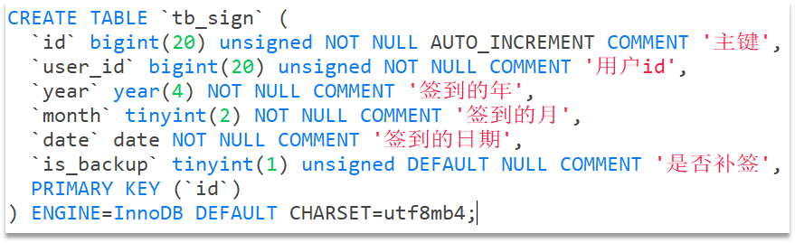
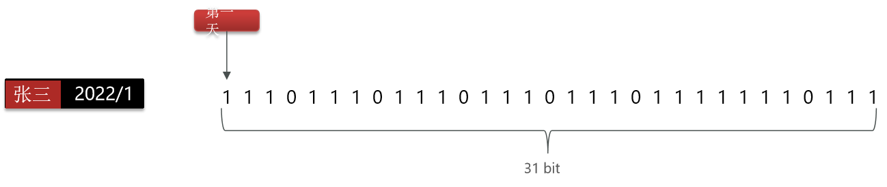
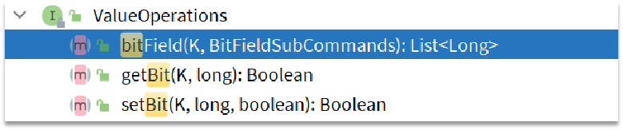
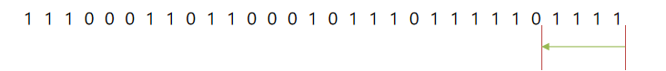

### 1、BitMap用法

#### 1、场景

假如我们用一张表来存储用户签到信息，其结构应该如下：



> 假如有1000万用户，平均每人每年签到次数为10次，则这张表一年的数据量为 1亿条
> 每签到一次需要使用（8 + 8 + 1 + 1 + 3 + 1）共22 字节的内存，一个月则最多需要600多字节

很显然，这种做法占用空间过大，那有没有更好的做法呢？


##### 优化版

>  我们按月来统计用户签到信息，签到记录为1，未签到则记录为0.



例：张三2022年1月的签到记录，key为`张三：202201`，值为0或1组成的bit，那这样一个月也就2字节

**把每一个bit位对应当月的每一天，形成了映射关系。用0和1标示业务状态，这种思路就称为位图（BitMap）**

Redis中是利用string类型数据结构实现BitMap，因此最大上限是512M，转换为bit则是 2^32个bit位


#### 2、用法

> Redis中是利用string类型数据结构实现BitMap，因此最大上限是512M，转换为bit则是 2^32个bit位。

BitMap的操作命令有：

- SETBIT：向指定位置（offset）存入一个0或1
- GETBIT ：获取指定位置（offset）的bit值
- BITCOUNT ：统计BitMap中值为1的bit位的数量
- BITFIELD ：操作（查询、修改、自增）BitMap中bit数组中的指定位置（offset）的值
- BITFIELD_RO ：获取BitMap中bit数组，并以十进制形式返回
- BITOP ：将多个BitMap的结果做位运算（与 、或、异或）
- BITPOS ：查找bit数组中指定范围内第一个0或1出现的位置

```
localhost:0>setbit zs 0 1
"0"
localhost:0>setbit zs 1 0
"0"
localhost:0>getbit zs 1
"0"
localhost:0>bitcount zs
"1"
localhost:0>bitpos zs 1
"0"
```


### 2、签到功能

#### 1、需求

> 实现签到接口，将当前用户当天签到信息保存到Redis中


#### 2、实现

提示：因为BitMap底层是基于String数据结构，因此其操作也都封装在字符串相关操作中了。




```java
/**
     * 签到
     * @return
     */
@Override
public Result sign() {
    //获取登录用户
    Long userId = UserHolder.getUser().getId();

    //获取日期，获取today是当前月的第几天
    LocalDateTime time = LocalDateTime.now();
    String keySuffix = time.format(DateTimeFormatter.ofPattern(":yyyyMM"));
    int dayOfMonth = time.getDayOfMonth();
    //存入redis
    String key = RedisConstants.USER_SIGN_KEY + userId + keySuffix;
    stringRedisTemplate.opsForValue().setBit(key, dayOfMonth - 1, true);
    return Result.ok();
}
```


### 3、签到统计

Q1：什么叫做连续签到天数？

> 从最后一次签到开始向前统计，直到遇到第一次未签到为止，计算总的签到次数，就是连续签到天数。




Q2：如何得到本月到今天为止的所有签到数据？

```
BITFIELD key GET u[dayOfMonth] 0
```


Q3：如何从后向前遍历每个bit位？

> 与 1 做与运算，就能得到最后一个bit位。
> 随后右移1位，下一个bit位就成为了最后一个bit位。


#### 实现签到统计功能

##### 1、需求

> 统计当前用户截止当前时间在本月的连续签到天数


##### 2、实现

```java
@Override
public Result signCount() {
    //获取登录用户
    Long userId = UserHolder.getUser().getId();

    //获取日期，获取today是当前月的第几天
    LocalDateTime time = LocalDateTime.now();
    String keySuffix = time.format(DateTimeFormatter.ofPattern(":yyyyMM"));
    int dayOfMonth = time.getDayOfMonth();
    //存入redis
    String key = RedisConstants.USER_SIGN_KEY + userId + keySuffix;
    //获取本月截止 今天为止的所有签到记录，返回一个十进制的数字
    List<Long> result = stringRedisTemplate.opsForValue().bitField(key,
                                                                   BitFieldSubCommands.create().get(BitFieldSubCommands.BitFieldType.unsigned(dayOfMonth)).valueAt(0));
    //循环遍历
    if (null == result || result.isEmpty()) {
        return Result.ok(0);
    }
    Long num = result.get(0);
    if (null == num || 0 == num) {
        return Result.ok(0);
    }
    //让这个数字与1做与运算，得到数字的最后一个bit位
    int count = 0;
    while (true) {
        //判断是否为0，如果为0，则表示未签到，结束，不为0，已签到，计数器+1
        if (0 == (num & 1)) {
            break;
        }else {
            count++;
        }
        //把数字右移一位，抛弃最后一个bit位，继续下一个bit位
        num >>>= 1;
    }
    return Result.ok(count);
}
```
