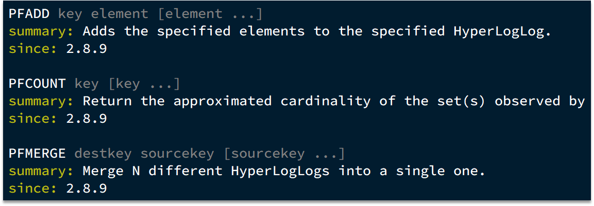

### 1、HyperLogLog用法

首先我们搞懂两个概念：

> UV：全称Unique Visitor，也叫独立访客量，是指通过互联网访问、浏览这个网页的自然人。1天内同一个用户多次访问该网站，只记录1次。
> PV：全称Page View，也叫页面访问量或点击量，用户每访问网站的一个页面，记录1次PV，用户多次打开页面，则记录多次PV。往往用来衡量网站的流量。

UV统计在服务端做会比较麻烦，因为要判断该用户是否已经统计过了，需要将统计过的用户信息保存。但是如果每个访问的用户都保存到Redis中，数据量会非常恐怖。


Hyperloglog(HLL)是从Loglog算法派生的概率算法，用于确定非常大的集合的基数，而不需要存储其所有值。相关算法原理大家可以参考：https://juejin.cn/post/6844903785744056333#heading-0


Redis中的HLL是基于string结构实现的，单个HLL的内存永远小于16kb，内存占用低的令人发指！作为代价，其测量结果是概率性的，有小于0.81％的误差。不过对于UV统计来说，这完全可以忽略。




### 2、实现UV统计

```java
@Test
public void testHyperLogLog(){
    String[] values = new String[1000];
    int j = 0;
    for (int i = 0; i < 1000000; i++) {
        j = i % 1000;
        values[j] = "user_" + i;
        if (999 == j){
            stringRedisTemplate.opsForHyperLogLog().add("hl",values);
        }
    }
    Long count = stringRedisTemplate.opsForHyperLogLog().size("hl");
    System.out.println(count);
}
```


### 3、总结

HyperLogLog的作用：

>  做海量数据的统计工作

- HyperLogLog的优点：内存占用极低、性能非常好
- HyperLogLog的缺点：有一定的误差
