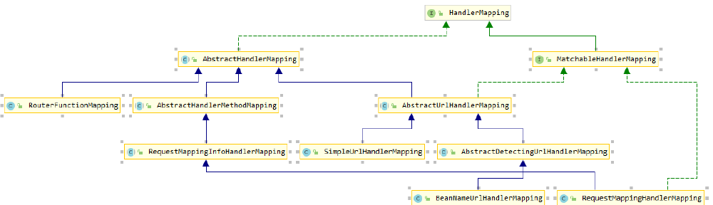
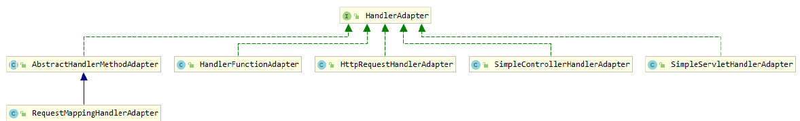

### 1、`DispatcherServlet`

> DispatcherServlet 是前端控制器设计模式的实现，提供 Spring Web MVC 的集中访问点，而且负责职责的分派，而且与 Spring IoC 容器无缝集成，从而可以获得 Spring 的所有好处。DispatcherServlet 主要用作职责调度工作，本身主要用于控制流程，主要职责如下：
>
> - 文件上传解析，如果请求类型是 multipart 将通过 MultipartResolver 进行文件上传解析
> - 通过 HandlerMapping，将请求映射到处理器（返回一个 HandlerExecutionChain，它包括一个处理器、多个 HandlerInterceptor 拦截器）
> - 通过 HandlerAdapter 支持多种类型的处理器(HandlerExecutionChain 中的处理器)
> - 通过 ViewResolver 解析逻辑视图名到具体视图实现
> - 本地化解析
> - 渲染具体的视图等
> - 如果执行过程中遇到异常将交给 HandlerExceptionResolver 来解析

#### 1、`DispatcherServlet`配置详解

```xml
<!--注册DispatcherServlet-->
    <servlet>
        <servlet-name>springmvc</servlet-name>
        <servlet-class>org.springframework.web.servlet.DispatcherServlet</servlet-class>
        <init-param>
            <param-name>contextConfigLocation</param-name>
            <param-value>classpath:springmvc-servlet.xml</param-value>
        </init-param>
        <load-on-startup>1</load-on-startup>
    </servlet>
    <servlet-mapping>
        <servlet-name>springmvc</servlet-name>
        <url-pattern>/</url-pattern>
    </servlet-mapping>
```

•	`load-on-startup`：表示启动容器时初始化该` Servlet`

•	`url-pattern`：表示哪些请求交给` Spring Web MVC `处理， "/" 是用来定义默认servlet 映射的。也可以如

*.html 表示拦截所有以 html 为扩展名的请求

•	`contextConfigLocation`：表示 SpringMVC 配置文件的路径

**DispatcherServlet其他初始化参数**

| 参数                             | 说明                                                         |
| :------------------------------- | :----------------------------------------------------------- |
| `contextClass`                   | 实现类，`ConfigurableWebApplicationContext`由该Servlet实例化并在本地配置。默认情况下，`XmlWebApplicationContext`使用。 |
| `contextConfigLocation`          | 传递给上下文实例的字符串（由指定`contextClass`），以指示可以在哪里找到上下文。该字符串可能包含多个字符串（使用逗号作为分隔符）以支持多个上下文。对于具有两次定义的bean的多个上下文位置，以最新位置为准。 |
| `namespace`                      | `WebApplicationContext`命名空间。默认为`[servlet-name]-servlet`。 |
| `throwExceptionIfNoHandlerFound` | `NoHandlerFoundException`在找不到请求的处理程序时是否抛出。然后可以使用`HandlerExceptionResolver`（例如，通过使用 `@ExceptionHandler`控制器方法）捕获该异常并将其作为其他任何异常进行处理。默认情况下，它设置为`false`，在这种情况下，`DispatcherServlet`将响应状态设置为404（NOT_FOUND），而不会引发异常。请注意，如果还配置了[默认servlet处理](https://docs.spring.io/spring/docs/current/spring-framework-reference/web.html#mvc-default-servlet-handler)，则始终将未解决的请求转发到默认servlet，并且永远不会引发404。 |

### 2、处理器

#### 1、HandlerMapping

HandlerMapping ，中文译作处理器映射器，在 SpringMVC 中，系统提供了很多 HandlerMapping



`HandlerMapping` 是负责根据 `request` 请求找到对应的` Handler` 处理器及` Interceptor` 拦截器，将它们封装在 `HandlerExecutionChain` 对象中返回给前端控制器。

- `BeanNameUrlHandlerMapping`

  > BeanNameUrl 处理器映射器，根据请求的 url 与 Spring 容器中定义的 bean 的 name 进行匹配，从而从 Spring 容器中找到 bean 实例，就是说，请求的 Url 地址就是处理器 Bean 的名字。
  >
  > ```xml
	> <bean class="org.springframework.web.servlet.handler.BeanNameUrlHand lerMapping" id="handlerMapping"> 
	>     <property name="beanName" value="/hello"/> 
	> </bean> 
	> ```

- `SimpleUrlHandlerMapping`

> SimpleUrlHandlerMapping 是 BeanNameUrlHandlerMapping 的增强版本，它可以将 url 和处理器 bean 的 id 进行统一映射配置:
>
> ```xml
> <bean class="org.springframework.web.servlet.handler.SimpleUrlHandle rMapping" id="handlerMapping">
>     <property name="mappings">
>         <props>
>             <prop key="/hello">myController</prop> 
>             <prop key="/hello2">myController2</prop>
>             </props> 
>     </property> 
> </bean> 
> <!--注意，在 props 中，可以配置多个请求路径和处理器实例的映射关系。-->
> ```

#### 2、`HandlerAdapter `

> HandlerAdapter 会根据适配器接口对后端控制器进行包装（适配），包装后即可对处理器进行执行，通过扩展处理器适配器可以执行多种类型的处理器，这里使用了适配器设计模式。



- `SimpleControllerHandlerAdapter`

> `SimpleControllerHandlerAdapter` 简单控制器处理器适配器，所有实现了 `org.springframework.web.servlet.mvc.Controller` 接口的 `Bean` 通过此适配器进行适配、执行，也就是说，如果我们开发的接口是通过实现 `Controller` 接口来完成的（不是通过注解开发的接口），那么 `HandlerAdapter` 必须是 `SimpleControllerHandlerAdapter`。
>
> ```xml
> <bean class="org.springframework.web.servlet.mvc.SimpleControllerHandlerAdapter" /> 
> ```

- `HttpRequestHandlerAdapter`

> HttpRequestHandlerAdapter，http 请求处理器适配器，所有实现了
> org.springframework.web.HttpRequestHandler 接口的 Bean 通过此适配器进行适配、执行。
>
> ```java
> @Controller 
> public class MyController2 implements HttpRequestHandler { 
>     public void handleRequest(HttpServletRequest request, HttpServlet Response response) throws ServletException, IOException { 
>         System.out.println("-----MyController2-----");
>     } 
> } 
> ```
>
> ```xml
> <bean class="org.springframework.web.servlet.handler.SimpleUrlHandle rMapping" id="handlerMapping"> 
>     <property name="mappings">
>         <props> 
>             <prop key="/hello2">myController2</prop> 
>         </props> 
>     </property> 
> </bean> 
> <bean class="org.springframework.web.servlet.mvc.HttpRequestHandlerA dapter" id="handlerAdapter"/> 
> ```
