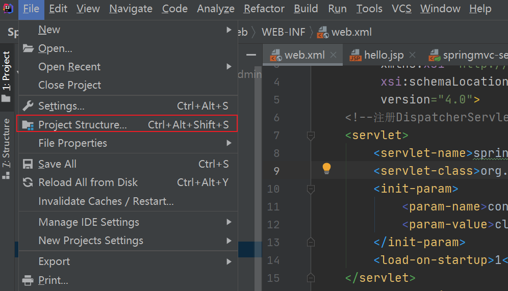
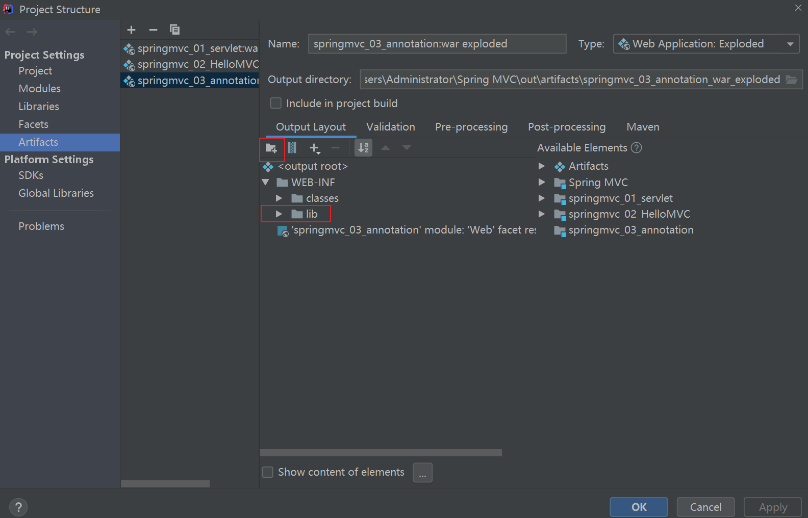
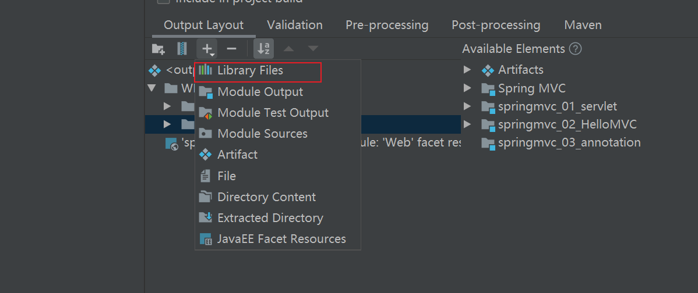
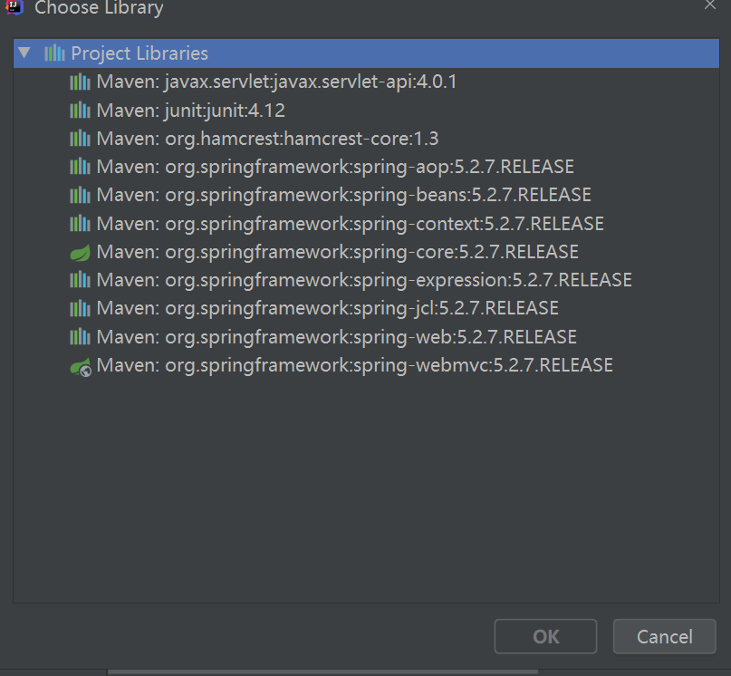
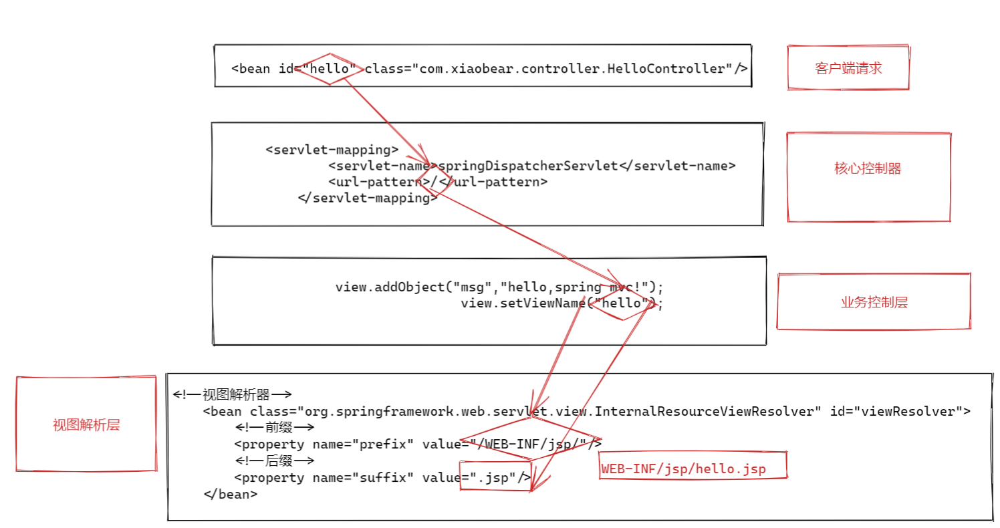

新建一个`module`,添加Web框架

### 1、在web.xml 中配置DispatcherServlet

```xml
<!-- 配置SpringMVC 核心控制器： -->
    <servlet>
        <servlet-name>springDispatcherServlet</servlet-name>
        <servlet-class>org.springframework.web.servlet.DispatcherServlet</servlet-class>
        <!-- 配置DispatcherServlet 的初始化參數：设置文件的路径和文件名称-->
        <init-param>
            <param-name>contextConfigLocation</param-name>
            <param-value>classpath:springmvc.xml</param-value>
        </init-param>
        <load-on-startup>1</load-on-startup>
    </servlet>
    <servlet-mapping>
        <servlet-name>springDispatcherServlet</servlet-name>
        <url-pattern>/</url-pattern>
    </servlet-mapping>
```

解释配置文件的名称定义规则:

- 实际上也可以不通过`contextConfigLocation `来配置SpringMVC 的配置文件, 而使用默认

  的.默认的配置文件为: `/WEB-INF/<servlet-name>-servlet.xml`

- 所有请求都将自动拦截下来，拦截下来后，请求交给` DispatcherServlet `去处理，在加载 DispatcherServlet 时，还需要指定配置文件路径。这里有一个默认的规则，如果配置文件放在 webapp/WEB-INF/ 目录下，并且配置文件的名字等于 `DispatcherServlet 的名字+ -servlet`（即这里的配置文件路径是 webapp/WEB-INF/springmvc-servlet.xml），如果是这样的话，可以不用添加 init-param 参数，即不用手动配置 springmvc 的配置文件，框架会自动加载。

### 2、加载 springmvc 配置文件

在 resources 目录下，创建一个名为 spring.xml 的 springmvc 的配置文件

```xml
<?xml version="1.0" encoding="UTF-8"?>
<beans xmlns="http://www.springframework.org/schema/beans"
       xmlns:xsi="http://www.w3.org/2001/XMLSchema-instance"
       xsi:schemaLocation="http://www.springframework.org/schema/beans http://www.springframework.org/schema/beans/spring-beans.xsd">
<!--spring mvc为我们做好的-->
    <bean class="org.springframework.web.servlet.handler.BeanNameUrlHandlerMapping" />
    <bean class="org.springframework.web.servlet.mvc.SimpleControllerHandlerAdapter" id="handlerAdapter"/>
    <!--视图解析器-->
    <bean class="org.springframework.web.servlet.view.InternalResourceViewResolver" id="viewResolver">
        <!--前缀-->
        <property name="prefix" value="/WEB-INF/jsp/"/>
        <!--后缀-->
        <property name="suffix" value=".jsp"/>
    </bean>

    <bean id="/hello" class="com.xiaobear.controller.HelloController"/>
</beans>
```

### 3、Controller，处理浏览器请求的接口

```java
public class HelloController implements Controller {
    /**
     * 这就是一个请求处理接口
     * @param httpServletRequest  这就是前端发送来的请求
     * @param httpServletResponse 这就是服务端给前端的响应
     * @return 返回值是一个 ModelAndView，Model 相当于是我们的数据模型 View 是我们的视图
     * @throws Exception
     */
    public ModelAndView handleRequest(HttpServletRequest httpServletRequest, HttpServletResponse httpServletResponse) throws Exception {
        ModelAndView view = new ModelAndView();
        view.addObject("msg","hello,spring mvc!");
        view.setViewName("hello");
        //WEB-INF/jsp/hello.jsp
        return view;
    }
}
```

### 4、创建视图

在WEB-INF下新建一个jsp目录,新建`hello.jsp`

```html
<%@ page contentType="text/html;charset=UTF-8" language="java" %>
<html>
<head>
    <title>Title</title>
</head>
<body>
${msg}
</body>
</html>
```

**访问出现404的原因：**

- 仔细检查自己的路径
- 在classes目录下新建一个lib目录，导入相关依赖
    - 
    - 
    - 
    - 

### 5、hello MVC深度解析


