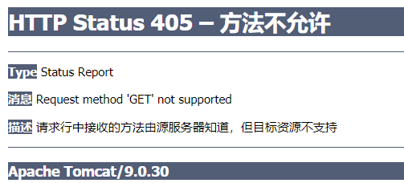

- `@GetMapping` ==` @RequestMapping(method = RequestMethod.GET)`
- `@PostMapping` == ` @RequestMapping(method = RequestMethod.POST)`
- `@PutMapping ` == ` @RequestMapping(method = RequestMethod.PUT)`
- `@DeleteMapping ` == ` @RequestMapping(method = RequestMethod.DELETE)`
- `@PatchMapping ` == ` @RequestMapping(method = RequestMethod.PATCH)`

> 可以使用`@RequestMapping`批注将请求映射到控制器方法。它具有各种属性，可以通过URL，HTTP方法，请求参数，标头和媒体类型进行匹配。您可以在类级别使用它来表示共享的映射，也可以在方法级别使用它来缩小到特定的端点映射。
>
> - SpringMVC 使用@RequestMapping 注解为控制器指定可以处理哪些 URL 请求
> - 在控制器的类定义及方法定义处都可标注 @RequestMapping
    > 	- 标记在类上：提供初步的请求映射信息。相对于 WEB 应用的根目录
           > 	- 标记在方法上：提供进一步的细分映射信息。相对于标记在类上的 URL。
>
> - 若类上未标注 @RequestMapping，则方法处标记的 URL 相对于 WEB 应用的根目录
> - 作用：DispatcherServlet 截获请求后，就通过控制器上 @RequestMapping 提供的映射信息确定请求所对应的处理方法。

```java
@Controller
public class ControllerTest3 {

    @RequestMapping("/test3")
    /**
     * 	映射请求的名称：用于客户端请求；类似Struts2 中action 映射配置的，action 名称
     * 	1 使用@RequestMapping 注解来映射请求的 URL
     * 	2 返回值会通过视图解析器解析为实际的物理视图,
     * 	对于 InternalResourceViewResolver 视图解析器,
     * 	会做如下的解析:
     * 	通过 prefix + returnVal + 后缀 这样的方式得到实际的物理视图, 然会做转发操作.
     * 	/WEB-INF/jsp/test.jsp
     */
    public String test3(){
        return "test";
    }
}

```

### 1、映射请求参数、请求方法或请求头

> 1. @RequestMapping 除了可以使用请求 URL 映射请求外，还可以使用请求方法、请求参数及请求头映射请求
>
> 2. @RequestMapping 的 value【重点】、method【重点】、params【了解】 及 heads 【了解】 分别表示请求 URL、请求方法、请求参数及请求头的映射条件，他们之间是与的关系，联合使用多个条件可让请求映射更加精确化。
>
> 3. params 和 headers 支持简单的表达式：
     >
     > 	- param1: 表示请求必须包含名为 param1 的请求参数
>
> 	- !param1: 表示请求不能包含名为 param1 的请求参数
>
> 	- param1 != value1: 表示请求包含名为 param1 的请求参数，但其值不能为 value1
       > 		{"param1=value1", "param2"}: 请求必须包含名为 param1 和 param2 的两个请求参数，且 param1 参数的值必须为 value1
       >
       > 		```java
> 		@Controller
> 		public class RequestController {
> 		
> 		    @RequestMapping(value = "/t1",method = RequestMethod.POST)
> 		    public String test1(Model model){
> 		        model.addAttribute("msg","get请求方式成功");
> 		        return "test1";
> 		    }
> 		}
> 		```
       >
       > 		- 发生错误
       >
       > 			

### 2、URL模式

| 模式            | 描述                                             | 例                                                           |
| :-------------- | :----------------------------------------------- | :----------------------------------------------------------- |
| `?`             | 匹配一个字符                                     | `"/pages/t?st.html"`比赛`"/pages/test.html"` 和`"/pages/t3st.html"` |
| `*`             | 匹配路径段中的零个或多个字符                     | `"/resources/*.png"` 火柴 `"/resources/file.png"``"/projects/*/versions"`匹配`"/projects/spring/versions"`但不匹配`"/projects/spring/boot/versions"` |
| `**`            | 匹配零个或多个路径段，直到路径结束               | `"/resources/**"`比赛`"/resources/file.png"`和`"/resources/images/file.png"` |
| `{name}`        | 匹配路径段并将其捕获为名为“ name”的变量          | `"/projects/{project}/versions"`比赛`"/projects/spring/versions"`和捕获`project=spring` |
| `{name:[a-z]+}` | 将正则表达式匹配`"[a-z]+"`为名为“名称”的路径变量 | `"/projects/{project:[a-z]+}/versions"`匹配`"/projects/spring/versions"`但不匹配`"/projects/spring1/versions"` |

```java
    /**
     *@RequestMapping("/t2/ab??") 匹配http://localhost:8080/springmvc_04_controller_war_exploded/t2/abcd。。。
     */
    @RequestMapping("/t2/ab??")
    public String testUrl(Model model){
        model.addAttribute("msg","请求成功！xiaobear");
        return "test1";
    }
}
```

### 3、`RequestMapping` 映射请求占位符`PathVariable `注解

#### 1、`@PathVariable`

通过` @PathVariable` 可以将 URL 中占位符参数绑定到控制器处理方法的入参中

URL 中的 {xxx} 占位符可以通过` @PathVariable("xxx") `绑定到操作方法的入参中。

```java
@GetMapping("/t3/{a}/{b}")
    public String testPath(@PathVariable int a, @PathVariable int b, Model model){
        int restPath = a+b;
        model.addAttribute("msg","结果为："+restPath);
        return "test1";
    }
```
