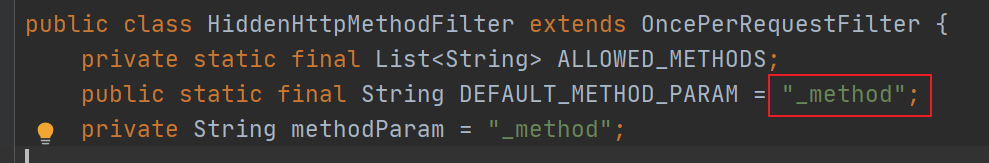

### 1、REST 是什么？

> REST：即 Representational State Transfer。（资源）表现层状态转化。是目前最流行的一种互联网软件架构。它结构清晰、符合标准、易于理解、扩展方便，所以正得到越来越多网站的采用

1. 资源（Resources）：网络上的一个实体，或者说是网络上的一个具体信息。它可以是一段文本、一张图片、

   一首歌曲、一种服务，总之就是一个具体的存在。可以用一个 URI（统一资源定位符）指向它，每种资源对

   应一个特定的 URI 。获取这个资源，访问它的 URI就可以，因此 URI 即为每一个资源的独一无二的识别符。

2. 表现层（Representation）：把资源具体呈现出来的形式，叫做它的表现层（Representation）。比如，文本

   可以用 txt 格式表现，也可以用 HTML 格式、XML格式、JSON 格式表现，甚至可以采用二进制格式。

3. 状态转化（State Transfer）：每发出一个请求，就代表了客户端和服务器的一次交互过程。HTTP 协议，是一

   个无状态协议，即所有的状态都保存在服务器端。因此，如果客户端想要操作服务器，必须通过某种手段，

   让服务器端发生“状态转化” （State Transfer）而这种转化是建立在表现层之上的，所以就是 “表现层状态转

   化”。

4. 具体说，就是 HTTP 协议里面，四个表示操作方式的动词：GET、POST、PUT、DELETE。它们分别对应四种

   基本操作：GET 用来获取资源，POST 用来新建资源，PUT 用来更新资源，DELETE 用来删除资源。

### 2、URL风格

我们传统的传入参数是/xiaobear/id=1?method=add

```java
/order/1 HTTP GET ：得到 id = 1 的 order
/order/1 HTTP DELETE：删除 id = 1 的 order
/order HTTP PUT：更新 order
/order HTTP POST：新增 order
```

符合REST设计风格的Web API称为**RESTful API**。它从以下三个方面资源进行定义：

- 直观简短的资源地址：URI，比如：`http://example.com/resources`。
- 传输的资源：Web服务接受与返回的[互联网媒体类型](https://zh.wikipedia.org/wiki/互联网媒体类型)，比如：[JSON](https://zh.wikipedia.org/wiki/JSON)，[XML](https://zh.wikipedia.org/wiki/XML)，[YAML](https://zh.wikipedia.org/wiki/YAML)等。
- 对资源的操作：Web服务在该资源上所支持的一系列[请求方法](https://zh.wikipedia.org/wiki/超文本传输协议#请求方法)（比如：POST，GET，PUT或DELETE）。

|                          资源                          |                             GET                              |                          PUT                          |                             POST                             |       DELETE       |
| :----------------------------------------------------: | :----------------------------------------------------------: | :---------------------------------------------------: | :----------------------------------------------------------: | :----------------: |
|   一组资源的URI，比如`https://example.com/resources`   | **列出**URI，以及该资源组中每个资源的详细信息（后者可选）。  |       使用给定的一组资源**替换**当前整组资源。        | 在本组资源中**创建/追加**一个新的资源。该操作往往返回新资源的URL。 | **删除**整组资源。 |
| 单个资源的URI，比如`https://example.com/resources/142` | **获取**指定的资源的详细信息，格式可以自选一个合适的网络媒体类型（比如：XML、JSON等） | **替换/创建**指定的资源。并将其追加到相应的资源组中。 | 把指定的资源当做一个资源组，并在其下**创建/追加**一个新的元素，使其隶属于当前资源。 | **删除**指定的元素 |

### 3、`HiddenHttpMethodFilter`

浏览器 form 表单只支持 GET 与 POST 请求，而 DELETE、PUT 等 method 并不支持，Spring3.0 添加了一个过滤器，可以将这些请求转换为标准的 http 方法，使得支持 GET、POST、PUT 与 DELETE 请求。

##### 源码分析：

为什么请求隐含参数名称必须叫做”_method”



hiddenHttpMethodFilter 的处理过程

```java
protected void doFilterInternal(HttpServletRequest request, HttpServletResponse response, FilterChain filterChain) throws ServletException, IOException {
        HttpServletRequest requestToUse = request;
        if ("POST".equals(request.getMethod()) && request.getAttribute("javax.servlet.error.exception") == null) {
            String paramValue = request.getParameter(this.methodParam);
            if (StringUtils.hasLength(paramValue)) {
                String method = paramValue.toUpperCase(Locale.ENGLISH);
                if (ALLOWED_METHODS.contains(method)) {
                    requestToUse = new HiddenHttpMethodFilter.HttpMethodRequestWrapper(request, method);
                }
            }
        }

        filterChain.doFilter((ServletRequest)requestToUse, response);
    }

private static class HttpMethodRequestWrapper extends HttpServletRequestWrapper {
        private final String method;

        public HttpMethodRequestWrapper(HttpServletRequest request, String method) {
            super(request);
            this.method = method;
        }

        public String getMethod() {
            return this.method;
        }
    }
```

##### 代码测试

在web.xml中配置filter

```xml
<!-- 支持 REST 风格的过滤器：可以将 POST 请求转换为 PUT 或 DELETE 请求 -->
<filter>
    <filter-name>HiddenHttpMethodFilter</filter-name>
    <filter-class>org.springframework.web.filter.HiddenHttpMethodFilter</filter-class>
</filter>
<filter-mapping>
    <filter-name>HiddenHttpMethodFilter</filter-name>
    <url-pattern>/*</url-pattern>
</filter-mapping>
```

```java
@Controller
public class RestController {
    @GetMapping(value="/testRESTGet/{id}")
    public String testRESTGet(@PathVariable(value="id") Integer id, Model model) {
        model.addAttribute("msg","ID="+id);
        return "test1";
    }
    @PostMapping("/testRESTPost")
    public String testRESTPost( Model model) {
        model.addAttribute("msg","Post方式请求成功！");
        return "test1";
    }
    @PutMapping("/testRESTPut/{id}")
    public String testRESTPut(@PathVariable(value="id") Integer id, Model model) {
        model.addAttribute("msg","Put方式请求成功！id="+id);
        return "test1";
    }
    @PutMapping("/testRESTDelete/{id}")
    public String testRESTDelete(@PathVariable(value="id") Integer id, Model model) {
        model.addAttribute("msg","Delete方式请求成功！id="+id);
        return "test1";
    }
}
```

index.jsp

```html
<%@ page contentType="text/html;charset=UTF-8" language="java" %>
<html>
  <head>
    <title>$Title$</title>
  </head>
  <body>
  <!-- 实验 1 测试 REST 风格 GET 请求 -->
  <a href="testRESTGet/1">testREST GET</a><br/>
  <!-- 实验 2 测试 REST 风格 POST 请求 -->
  <form action="testRESTPost" method="POST">
    <input type="submit" value="testRESTPost">
  </form>
  <!-- 实验 3 测试 REST 风格 PUT 请求 -->
  <form action="testRESTPut/1" method="POST">
    <input type="hidden" name="_method" value="PUT">
    <input type="submit" value="testRESTPut">
  </form>
  <!-- 实验 4 测试 REST 风格 DELETE 请求 -->
  <form action="testRESTDelete/1" method="POST">
    <input type="hidden" name="_method" value="DELETE"> <input type="submit" value="testRESTDelete">
  </form>
  </body>
</html>
```
