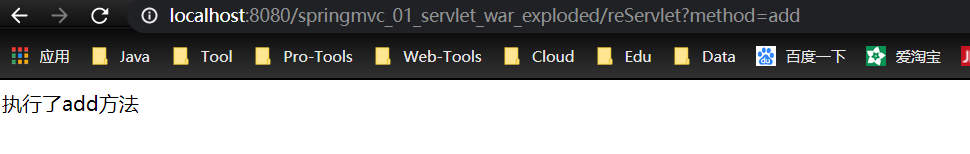
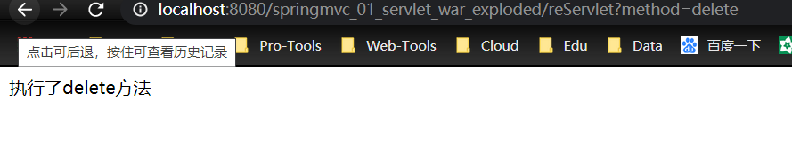

### 1.常用组件

**1**、**DispatcherServlet**：前端控制器

**2** 、**Controller**：处理器/页面控制器，做的是 MVC 中的 C 的事情，但控制逻辑转移到前端控制器了，用于对请求进行处理

**3** 、**HandlerMapping** ：请求映射到处理器，找谁来处理，如果映射成功返回一个 HandlerExecutionChain 对象（包含一个 Handler 处理器(页面控制器)对象、多 个 **HandlerInterceptor** 拦截器对象）

**4** 、**View Resolver** : 视图解析器，找谁来处理返回的页面。把逻辑视图解析为具体 的 View,进行这种策略模式，很容易更换其他视图技术； 如 InternalResourceViewResolver 将逻辑视图名映射为 JSP 视图

**5** 、**LocalResolver**：本地化、国际化

**6** 、**MultipartResolver**：文件上传解析器

**7** 、**HandlerExceptionResolver**：异常处理器

### 2、SpringMVC和Struts的区别

##### 共同点：

- 都是表现层框架，基于MVC模型编写的
- 都离不开原始的ServletAPI
- 处理机制都是一个核心控制器--**DispatcherServlet**

| SpringMVC                            | Struts       |
| ------------------------------------ | ------------ |
| 入口是Servlet                        | Filter       |
| 基于方法设计的                       | 基于类设计的 |
| 简洁，支持JSR303，处理Ajax请求更方便 |              |

### 3、SpringMVC的特点

- 天生与Spring 框架集成，如：(IOC,AOP)
- 支持Restful 风格
- 进行更简洁的Web 层开发
- 支持灵活的URL 到页面控制器的映射
- 非常容易与其他视图技术集成，如:Velocity、FreeMarker 等等
- 因为模型数据不存放在特定的API 里，而是放在一个Model 里(Map 数据结构实现，因此很容易被其他框架使用)
- 非常灵活的数据验证、格式化和数据绑定机制、能使用任何对象进行数据绑定，不必实现特定框架的API
- 更加简单、强大的异常处理
- 对静态资源的支持
- 支持灵活的本地化、主题等解析

### 4、回顾Servlet

1.在web.xml中配置servlet

```xml
<?xml version="1.0" encoding="UTF-8"?>
<web-app xmlns="http://xmlns.jcp.org/xml/ns/javaee"
         xmlns:xsi="http://www.w3.org/2001/XMLSchema-instance"
         xsi:schemaLocation="http://xmlns.jcp.org/xml/ns/javaee http://xmlns.jcp.org/xml/ns/javaee/web-app_4_0.xsd"
         version="4.0">

    <servlet>
        <servlet-name>ReServlet</servlet-name>
        <servlet-class>com.xiaobear.servlet.ReServlet</servlet-class>
    </servlet>
    <servlet-mapping>
        <servlet-name>ReServlet</servlet-name>
        <url-pattern>/reServlet</url-pattern>
    </servlet-mapping>

<!--    <session-config>
        <session-timeout>15</session-timeout>
    </session-config>

    <welcome-file-list>
        <welcome-file>index.jsp</welcome-file>
    </welcome-file-list>-->
</web-app>
```

2、建立一个servlet

```java
/**
 * @author xiaobear
 * @date 2020/6/27 0027 16:39
 * @Description 回顾Servlet
 */
public class ReServlet extends HttpServlet {

    @Override
    protected void doGet(HttpServletRequest req, HttpServletResponse resp) throws ServletException, IOException {
        String method = req.getParameter("method");
        if (method.equals("add")) {
            req.getSession().setAttribute("msg","执行了add方法");
        }
        if (method.equals("delete")) {
            req.getSession().setAttribute("msg","执行了delete方法");
        }
        req.getRequestDispatcher("/WEB-INF/jsp/test.jsp").forward(req, resp);
    }
}
```

3、视图/WEB-INF/jsp/test.jsp

```html
<%@ page contentType="text/html;charset=UTF-8" language="java" %>
<html>
<head>
    <title>test.jsp</title>
</head>
<body>
${msg}
</body>
</html>
```

4、测试

http://localhost:8080/springmvc_01_servlet_war_exploded/reServlet?method=add



http://localhost:8080/springmvc_01_servlet_war_exploded/reServlet?method=delete


