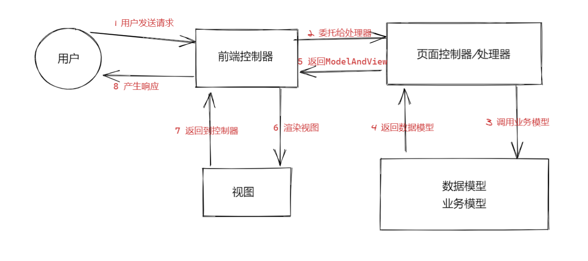

**面试99%会问到**

1. 客户端请求提交到`DispatcherServlet`
2. 由`DispatcherServlet` 控制器查询一个或多个`HandlerMapping`，找到处理请求的` Controller DispatcherServlet`
3. 请求提交到` Controller`（也称为`Handler`）
4. `Controller `调用业务逻辑处理后，返回 `ModelAndView`
5. `DispatcherServlet `查询一个或多个` ViewResoler` 视图解析器，找到` ModelAndView` 指定的视图
6. 视图负责将结果显示到客户端
