### 1、`Nacos`简介

#### 1、为什么叫`nacos`

> 前四个字母分别是Naming和Configuration的前两个字母，后面的s是Service

#### 2、什么是`nacos`

地址：https://nacos.io/zh-cn/docs/what-is-nacos.html

> Nacos是一个易于使用的动态服务发现，配置和服务管理平台，用于构建云本机应用程序。
>
> 使用Spring Cloud Alibaba Nacos Discovery，您可以基于Spring Cloud的编程模型快速访问Nacos服务注册功能。
>
> 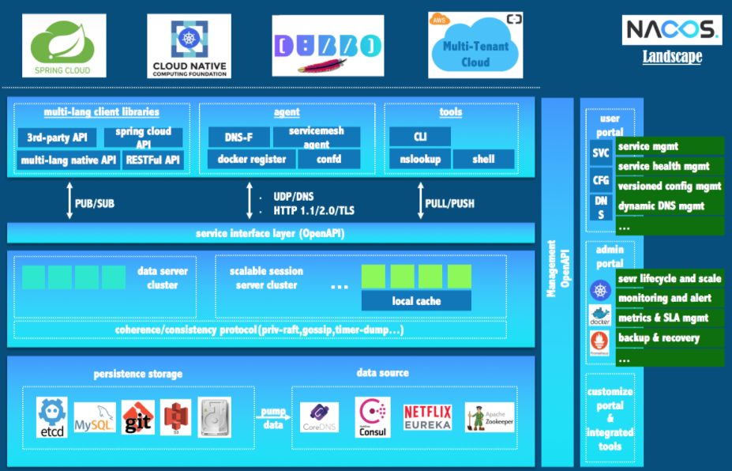

`Nacos`就是注册中心+配置中心的组合

`Nacos` = `Eureka` + `Config` + `Bus`

#### 3、作用

- 替代`Eureka`做服务注册
- 替代`Config`做配置中心

Nacos主要提供以下四大功能：
1. **服务发现与服务健康检查**
   Nacos使服务更容易注册，并通过DNS或HTTP接口发现其他服务，Nacos还提供服务的实时健康检查，以防
   止向不健康的主机或服务实例发送请求。
2. **动态配置管理**
   动态配置服务允许您在所有环境中以集中和动态的方式管理所有服务的配置。Nacos消除了在更新配置时重新
   部署应用程序，这使配置的更改更加高效和灵活。
3. **动态DNS服务**
   Nacos提供基于DNS 协议的服务发现能力，旨在支持异构语言的服务发现，支持将注册在Nacos上的服务以
   域名的方式暴露端点，让三方应用方便的查阅及发现。
4. **服务和元数据管理**
   Nacos 能让您从微服务平台建设的视角管理数据中心的所有服务及元数据，包括管理服务的描述、生命周
   期、服务的静态依赖分析、服务的健康状态、服务的流量管理、路由及安全策略。

#### 4、下载

https://github.com/alibaba/nacos/releases

#### 5、各版本比较

目前市面上用的比较多的配置中心有：Spring Cloud Config、Apollo、Nacos和Disconf等。
由于Disconf不再维护，下面主要对比一下Spring Cloud Config、Apollo和Nacos。

**主流配置中心对比**

| 对比项目     | Spring Cloud Config    | Apollo                   | Nacos                    |
| ------------ | ---------------------- | ------------------------ | ------------------------ |
| 配置实时推送 | 支持(Spring Cloud Bus) | 支持(HTTP长轮询1s内)     | 支持(HTTP长轮询1s内)     |
| 版本管理     | 支持(Git)              | 支持                     | 支持                     |
| 配置回滚     | 支持(Git)              | 支持                     | 支持                     |
| 灰度发布     | 支持                   | 支持                     | 不支持                   |
| 权限管理     | 支持(依赖Git)          | 支持                     | 不支持                   |
| 多集群       | 支持                   | 支持                     | 支持                     |
| 多环境       | 支持                   | 支持                     | 支持                     |
| 监听查询     | 支持                   | 支持                     | 支持                     |
| 多语言       | 只支持Java             | 主流语言，提供了Open API | 主流语言，提供了Open API |
| 配置格式校验 | 不支持                 | 支持                     | 支持                     |
| 单机读(QPS)  | 7(限流所致)            | 9000                     | 15000                    |
| 单击写(QPS)  | 5(限流所致)            | 1100                     | 1800                     |
| 3节点读(QPS) | 21(限流所致)           | 27000                    | 45000                    |
| 3节点写(QPS) | 5(限流所致)            | 3300                     | 5600                     |

> 从配置中心角度来看，性能方面Nacos的读写性能最高，Apollo次之，Spring Cloud Config依赖Git场景不适合开
> 放的大规模自动化运维API。功能方面Apollo最为完善，nacos具有Apollo大部分配置管理功能，而Spring Cloud
> Config不带运维管理界面，需要自行开发。Nacos的一大优势是整合了注册中心、配置中心功能，部署和操作相比
> Apollo都要直观简单，因此它简化了架构复杂度，并减轻运维及部署工作。
> 综合来看，Nacos的特点和优势还是比较明显的，下面我们一起进入Nacos的世界。


> 据说 Nacos 在阿里巴巴内部有超过 10 万的实例运行，已经过了类似双十一等各种大型流量的考验

### 2、`Nacos`安装与配置

https://nacos.io/zh-cn/docs/quick-start.html

### 3、`Nacos`作为服务注册中心案例

#### 1、`Nacos`服务提供者

##### 1、新建module

```
xiaobear-cloud-alibaba-payment9001
```

##### 2、修改pom

父工程增加`spring-cloud-alibaba-dependencies`的依赖，这样我们就不用每次都要增加这个依赖了。

```xml
 <dependency>
        <groupId>com.alibaba.cloud</groupId>
        <artifactId>spring-cloud-alibaba-dependencies</artifactId>
        <version>2.2.1.RELEASE</version>
        <type>pom</type>
        <scope>import</scope>
      </dependency>
```

```xml
<dependencies>
        <!--SpringCloud ailibaba nacos -->
        <dependency>
            <groupId>com.alibaba.cloud</groupId>
            <artifactId>spring-cloud-starter-alibaba-nacos-discovery</artifactId>
        </dependency>
        <!-- SpringBoot整合Web组件 -->
        <dependency>
            <groupId>org.springframework.boot</groupId>
            <artifactId>spring-boot-starter-web</artifactId>
        </dependency>
        <dependency>
            <groupId>org.springframework.boot</groupId>
            <artifactId>spring-boot-starter-actuator</artifactId>
        </dependency>
        <!--日常通用jar包配置-->
        <dependency>
            <groupId>org.springframework.boot</groupId>
            <artifactId>spring-boot-devtools</artifactId>
            <scope>runtime</scope>
            <optional>true</optional>
        </dependency>
        <dependency>
            <groupId>org.projectlombok</groupId>
            <artifactId>lombok</artifactId>
            <optional>true</optional>
        </dependency>
        <dependency>
            <groupId>org.springframework.boot</groupId>
            <artifactId>spring-boot-starter-test</artifactId>
            <scope>test</scope>
        </dependency>
    </dependencies>

```

##### 3、写yaml

```yaml
server:
  port: 9001

spring:
  application:
    name: nacos-discovery-payment-provider
  cloud:
    nacos:
      discovery:
        server-addr: 127.0.0.1:8848

management:
  endpoints:
    web:
      exposure:
        include: '*'
```

##### 4、主启动类

```java
@SpringBootApplication
@EnableDiscoveryClient
public class NacosDiscoveryMain9001 {
    public static void main(String[] args) {
        SpringApplication.run(NacosDiscoveryMain9001.class, args);
    }
}
```

##### 5、业务类

- controller

  ```java
  @RestController
  public class PaymentController
  {
      @Value("${server.port}")
      private String serverPort;
  
      @GetMapping(value = "/payment/nacos/{id}")
      public String getPayment(@PathVariable("id") Integer id)
      {
          return "nacos registry, serverPort: "+ serverPort+"\t id"+id;
      }
  }
  ```

##### 6、测试

- http://localhost:9001/payment/nacos/23

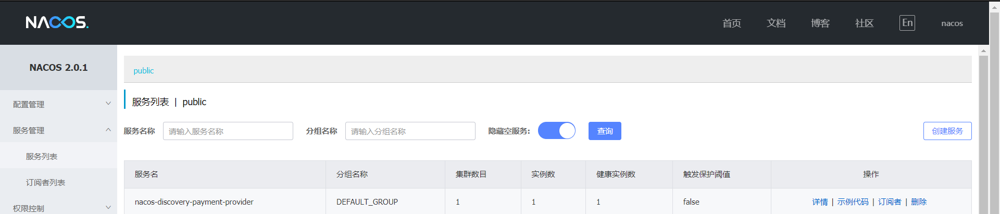

为了演示`Nacos`的负载均衡，复制一份9001，为9002


#### 2、`Naocs`服务消费者

##### 1、新建module

```
xiaobear-cloud-alibaba-consumer-order83
```

##### 2、改pom

```xml
<dependencies>
        <!--SpringCloud ailibaba nacos -->
        <dependency>
            <groupId>com.alibaba.cloud</groupId>
            <artifactId>spring-cloud-starter-alibaba-nacos-discovery</artifactId>
        </dependency>
        <dependency><!-- 引入自己定义的api通用包，可以使用Payment支付Entity -->
            <groupId>com.xiaobear</groupId>
            <artifactId>xiaobear-common-api-3</artifactId>
            <version>1.0-SNAPSHOT</version>
        </dependency>
        <!-- SpringBoot整合Web组件 -->
        <dependency>
            <groupId>org.springframework.boot</groupId>
            <artifactId>spring-boot-starter-web</artifactId>
        </dependency>
        <dependency>
            <groupId>org.springframework.boot</groupId>
            <artifactId>spring-boot-starter-actuator</artifactId>
        </dependency>
        <!--日常通用jar包配置-->
        <dependency>
            <groupId>org.springframework.boot</groupId>
            <artifactId>spring-boot-devtools</artifactId>
            <scope>runtime</scope>
            <optional>true</optional>
        </dependency>
        <dependency>
            <groupId>org.projectlombok</groupId>
            <artifactId>lombok</artifactId>
            <optional>true</optional>
        </dependency>
        <dependency>
            <groupId>org.springframework.boot</groupId>
            <artifactId>spring-boot-starter-test</artifactId>
            <scope>test</scope>
        </dependency>
    </dependencies>
```

##### 3、写yaml

```yaml
server:
  port: 83

spring:
  application:
    name: nacos-order-consumer
  cloud:
    nacos:
      discovery:
        server-addr: localhost:8848

#消费者将要去访问的微服务名称(注册成功进nacos的微服务提供者)
service-url:
  nacos-user-service: http://nacos-discovery-payment-provider
```

##### 4、主启动类

```java
@SpringBootApplication
@EnableDiscoveryClient
public class NacosConsumerMain83 {

    public static void main(String[] args) {
        SpringApplication.run(NacosConsumerMain83.class, args);
    }
}
```

##### 5、业务类

- controller

  ```java
  @RestController
  public class PaymentController
  {
      @Value("${server.port}")
      private String serverPort;
  
      @GetMapping(value = "/payment/nacos/{id}")
      public String getPayment(@PathVariable("id") Integer id)
      {
          return "nacos registry, serverPort: "+ serverPort+"\t id"+id;
      }
  }
  ```

    - NacosOrderController

      ```java
      @RestController
      public class NacosOrderController {
      
          @Resource
          private RestTemplate restTemplate;
      
          @Value("${service-url.nacos-user-service}")
          private String serverURL;
      
          @GetMapping("/consumer/nocas/{id}")
          public String getPaymentByDiscovery(@PathVariable("id") Long id){
              return restTemplate.getForObject(serverURL+"/payment/nacos/"+id,String.class);
          }
      }
      
      ```

    - ApplicationContextBean

      ```java
      @Configuration
      public class ApplicationContextBean {
      
          @LoadBalanced
          @Bean
          public RestTemplate getRestTemplate(){
              return new RestTemplate();
          }
      }
      ```

##### 6、测试

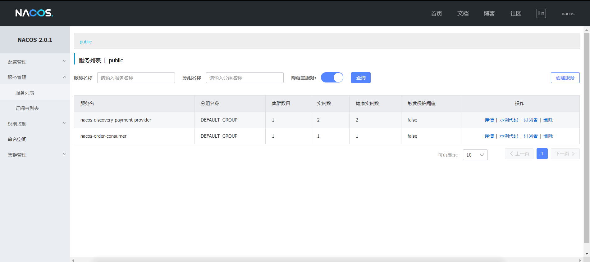

http://localhost:83/consumer/nocas/23

9001和9002轮询负载


#### 3、服务注册中心对比

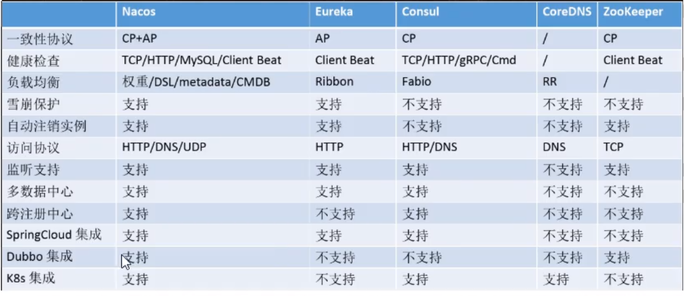

##### 切换

**`Naocs`支持`Ap`和`Cp`的切换**

> C是所有节点在同一时间看到的数据是一致的；而A的定义是所有的请求都会收到响应。

**何时选择使用何种模式？**

> 一般来说，如果不需要存储服务级别的信息且服务实例是通过nacos-client注册，并能够保持心跳上报，那么就可以选择AP模式。当前主流的服务如 Spring cloud 和 Dubbo 服务，都适用于AP模式，AP模式为了服务的可能性而减弱了一致性，因此AP模式下只支持注册临时实例。
>
> 如果需要在服务级别编辑或者存储配置信息，那么 CP 是必须，K8S服务和DNS服务则适用于CP模式。
>
> CP模式下则支持注册持久化实例，此时则是以 Raft 协议为集群运行模式，该模式下注册实例之前必须先注册服务，如果服务不存在，则会返回错误。

**模式切换**

> curl -X PUT '$NACOS_SERVER:8848/nacos/v1/ns/operator/switches?entry=serverMode&value=CP'


### 4、`Nacos`作为配置中心

#### 1、基础配置

##### 1、新建module

```
xiaobear-cloud-alibaba-config-client3377
```

##### 2、改pom

```xml
<dependencies>
        <!--nacos-config-->
        <dependency>
            <groupId>com.alibaba.cloud</groupId>
            <artifactId>spring-cloud-starter-alibaba-nacos-config</artifactId>
        </dependency>
        <!--nacos-discovery-->
        <dependency>
            <groupId>com.alibaba.cloud</groupId>
            <artifactId>spring-cloud-starter-alibaba-nacos-discovery</artifactId>
        </dependency>
        <!--web + actuator-->
        <dependency>
            <groupId>org.springframework.boot</groupId>
            <artifactId>spring-boot-starter-web</artifactId>
        </dependency>
        <dependency>
            <groupId>org.springframework.boot</groupId>
            <artifactId>spring-boot-starter-actuator</artifactId>
        </dependency>
        <!--一般基础配置-->
        <dependency>
            <groupId>org.springframework.boot</groupId>
            <artifactId>spring-boot-devtools</artifactId>
            <scope>runtime</scope>
            <optional>true</optional>
        </dependency>
        <dependency>
            <groupId>org.projectlombok</groupId>
            <artifactId>lombok</artifactId>
            <optional>true</optional>
        </dependency>
        <dependency>
            <groupId>org.springframework.boot</groupId>
            <artifactId>spring-boot-starter-test</artifactId>
            <scope>test</scope>
        </dependency>
    </dependencies>
```

##### 3、写yaml

> Nacos同springcloud-config一样，在项目初始化时，要保证先从配置中心进行配置拉取，拉取配置之后，才能保证项目的正常启动。
>
> springboot中配置文件的加载是存在优先级顺序的，bootstrap优先级高于application

- application.yaml

  ```yaml
  spring:
    profiles:
      active: dev ## 表示开发环境
  ```

- bootstrap.yaml

  ```yaml
  ## nacos配置
  server:
    port: 3377
  
  spring:
    application:
      name: nacos-config-client
    cloud:
      nacos:
        discovery:
          server-addr: localhost:8848 #Nacos服务注册中心地址
        config:
          server-addr: localhost:8848 #Nacos作为配置中心地址
          file-extension: yaml #指定yaml格式的配置
  ```

##### 4、主启动类

```java
@SpringBootApplication
@EnableDiscoveryClient
public class NacosConfigClientMain3377 {
    public static void main(String[] args) {
        SpringApplication.run(NacosConfigClientMain3377.class, args);
    }
}
```

##### 5、业务类

- controller

  ```java
  @RestController
  @RefreshScope
  public class ConfigClientController {
  
      @Value("${config.info}")
      private String configInfo;
  
      @GetMapping("/config/info")
      public String getConfigInfo() {
          return configInfo;
      }
  }
  ```

##### 6、在`Nacos`中增加配置信息

https://nacos.io/zh-cn/docs/quick-start-spring-cloud.html

在 Nacos Spring Cloud 中，`dataId` 的完整格式如下：

```plain
${prefix}-${spring.profiles.active}.${file-extension}
```

- `prefix` 默认为 `spring.application.name` 的值，也可以通过配置项 `spring.cloud.nacos.config.prefix`来配置。
- `spring.profiles.active` 即为当前环境对应的 profile，详情可以参考 [Spring Boot文档](https://docs.spring.io/spring-boot/docs/current/reference/html/boot-features-profiles.html#boot-features-profiles)。 **注意：当 `spring.profiles.active` 为空时，对应的连接符 `-` 也将不存在，dataId 的拼接格式变成 `${prefix}.${file-extension}`**
- `file-exetension` 为配置内容的数据格式，可以通过配置项 `spring.cloud.nacos.config.file-extension` 来配置。目前只支持 `properties` 和 `yaml` 类型。


###### 实操

####### 1、配置新增

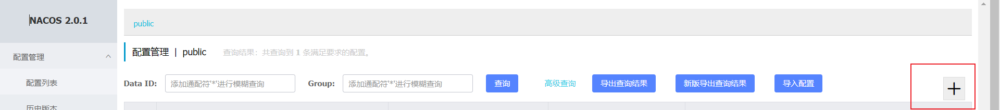

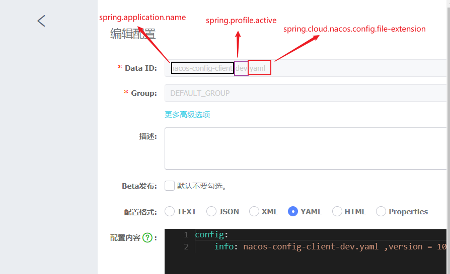

####### 2、历史配置

> `Naocs`会记录配置文件的历史版本默认保留30天，此外还有一键回滚功能，回滚操作将触发配置更新

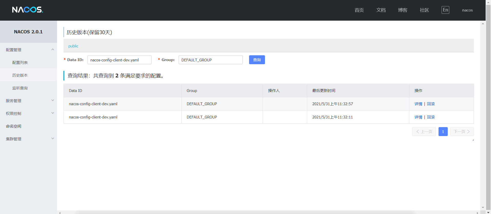

#### 2、分类配置

存在的问题：

**问题1：**

> 实际开发中，通常一个系统会准备
>
> dev开发环境
>
> test测试环境
>
> prod生产环境。
>
> 如何保证指定环境启动时服务能正确读取到Nacos上相应环境的配置文件呢？

**问题2：**

> 一个大型分布式微服务系统会有很多微服务子项目，
>
> 每个微服务项目又都会有相应的开发环境、测试环境、预发环境、正式环境......
>
> 那怎么对这些微服务配置进行管理呢？

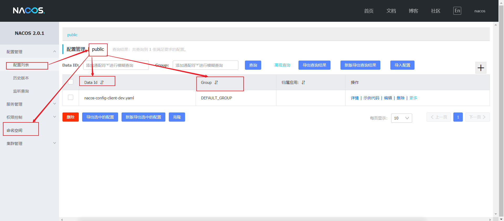

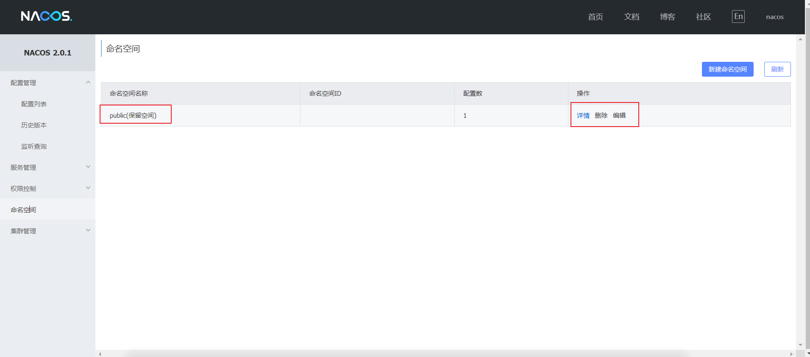

##### 1、`Namespace+Group+Data ID`的关系

>   类似Java里面的package名和类名
>
>   最外层的namespace是可以用于区分部署环境的，Group和DataID逻辑上区分两个目标对象。

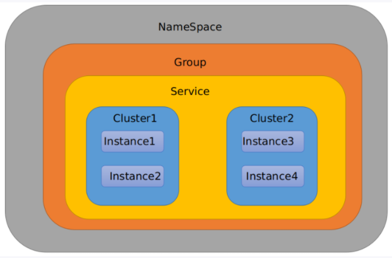

**默认情况：**

> Namespace=public，Group=DEFAULT_GROUP, 默认Cluster是DEFAULT


Nacos默认的命名空间是public，Namespace主要用来实现隔离。

> 比方说我们现在有三个环境：开发、测试、生产环境，我们就可以创建三个Namespace，不同的Namespace之间是隔离的。

Group默认是DEFAULT_GROUP，Group可以把不同的微服务划分到同一个分组里面去

> Service就是微服务；一个Service可以包含多个Cluster（集群），Nacos默认Cluster是DEFAULT，Cluster是对指定微服务的一个虚拟划分。
>
> 比方说为了容灾，将Service微服务分别部署在了杭州机房和广州机房，这时就可以给杭州机房的Service微服务起一个集群名称（HZ），给广州机房的Service微服务起一个集群名称（GZ），还可以尽量让同一个机房的微服务互相调用，以提升性能。

最后是Instance，就是微服务的实例。


##### 2、三种加载配置

###### 1、`Data ID `方案

> 指定spring.profile.active和配置文件的DataID来使不同环境下读取不同的配置

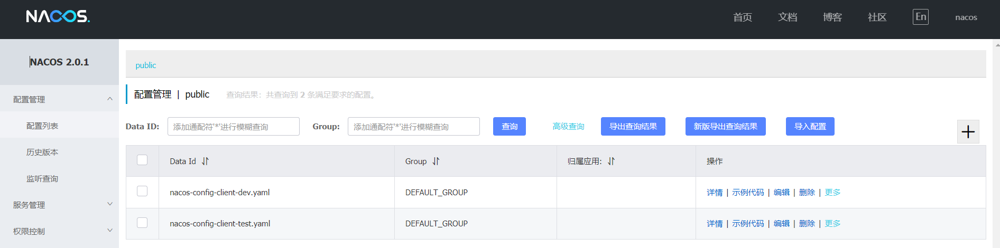

通过spring.profile.active属性就能进行多环境下配置文件的读取

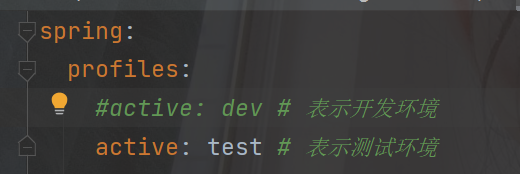

测试：http://localhost:3377/config/info

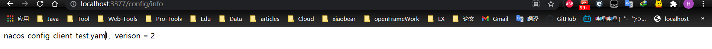


###### 2、`Group`方案

> 通过Group实现环境区分

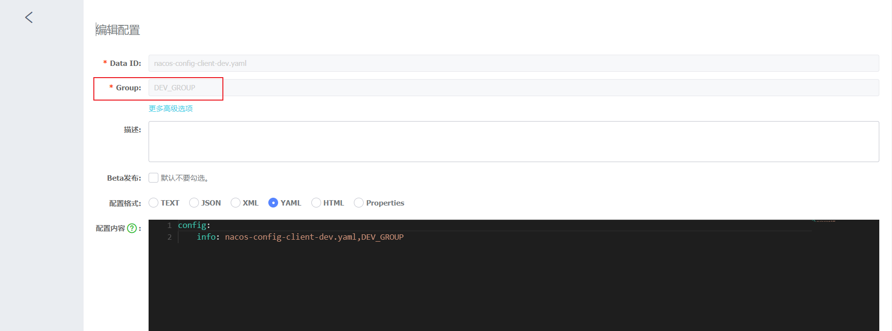

1. 修改application.yml

   ```yaml
   spring:
     profiles:
       active: dev ## 表示开发环境
       #active: test ## 表示测试环境
   ```

2. 修改bootstrap.yml

   ```yaml
   server:
     port: 3377
   
   spring:
     application:
       name: nacos-config-client
     cloud:
       nacos:
         discovery:
           server-addr: localhost:8848 #Nacos服务注册中心地址
         config:
           server-addr: localhost:8848 #Nacos作为配置中心地址
           file-extension: yaml #指定yaml格式的配置
           group: DEV_GROUP
   ```

3. 在config下增加一条group的配置即可。可配置为DEV_GROUP

###### 3、`Namespace`方案

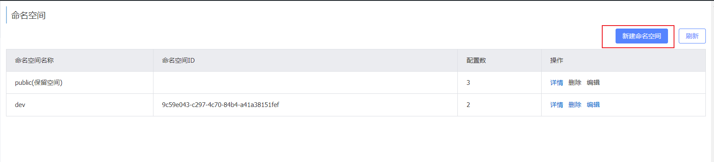

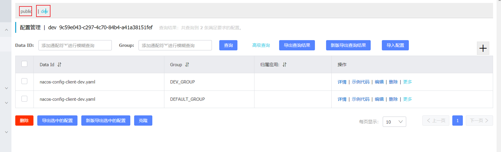

```yaml
## nacos配置
server:
  port: 3377

spring:
  application:
    name: nacos-config-client
  cloud:
    nacos:
      discovery:
        server-addr: localhost:8848 #Nacos服务注册中心地址
      config:
        server-addr: localhost:8848 #Nacos作为配置中心地址
        file-extension: yaml #指定yaml格式的配置
        group: DEV_GROUP
        namespace: 9c59e043-c297-4c70-84b4-a41a38151fef
```

### 5、`nacos`集群与持久化配置

官网地址：https://nacos.io/zh-cn/docs/cluster-mode-quick-start.html

根据官网翻译：

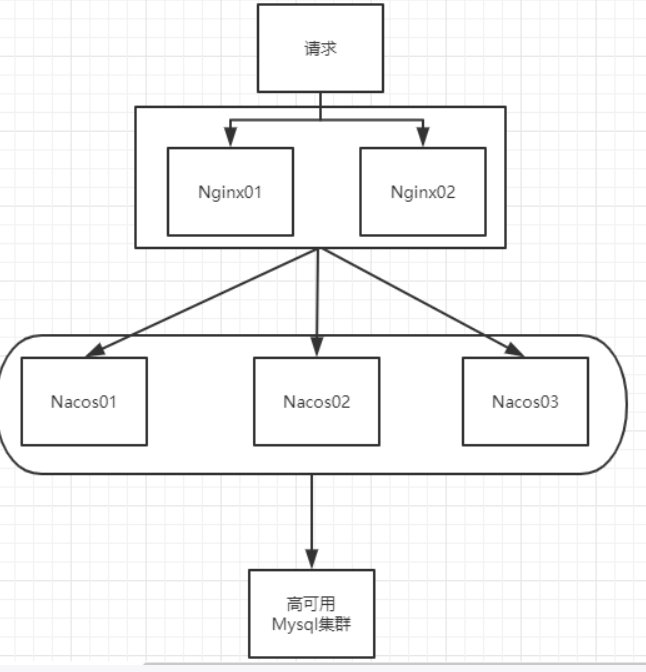

默认Nacos使用嵌入式数据库实现数据的存储。所以，如果启动多个默认配置下的Nacos节点，数据存储是存在一致性问题的。

为了解决这个问题，**Nacos采用了集中式存储的方式来支持集群化部署，目前只支持MySQL的存储。**


#### 1、`Nacos`持久化配置

> Nacos默认自带的是嵌入式数据库derby

https://github.com/alibaba/nacos/blob/develop/config/pom.xml

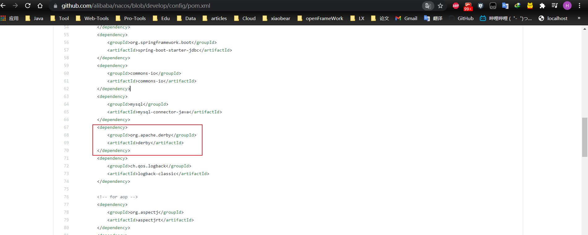

##### 1、切换到MySQL

1. 找到该脚本，然后执行

   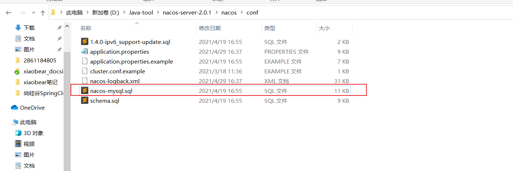

2. nacos-server-1.1.4\nacos\conf目录下找到application.properties

   ```properties
   spring.datasource.platform=mysql
   
   db.num=1
   db.url.0=jdbc:mysql://127.0.0.1:3306/nacos_config&characterEncoding=utf8&connectTimeout=1000&socketTimeout=3000&autoReconnect=true
   db.user=root
   db.password=123456
   ```

3. 启动Nacos，可以看到是个全新的空记录界面，以前是记录进derby

4. 新增配置，查询mysql，可以看到刚刚的记录

#### 2、`Linux`版`Nacos`+`MySQL`生产环境配置

预计需要，1个Nginx+3个nacos注册中心+1个mysql

Nginx安装：https://cloud.tencent.com/developer/article/1654844

MySQL安装：https://www.huaweicloud.com/articles/c2f3da4367a296361dfe1b7a2805fd20.html

##### 1、Linux服务器上mysql数据库配置

跟win一样，直接运行脚本即可

##### 2、application.properties 配置

```properties
spring.datasource.platform=mysql
 
db.num=1
db.url.0=jdbc:mysql://127.0.0.1:3306/nacos_config?characterEncoding=utf8&connectTimeout=1000&socketTimeout=3000&autoReconnect=true
db.user=root
db.password=123456
```

##### 3、Linux服务器上nacos的集群配置cluster.conf

梳理出3台nacos集器的不同服务端口号

- 192.168.222.125:3333
- 192.168.222.125:4444
- 192.168.222.125:5555

这个IP不能写127.0.0.1，必须是Linux命令hostname -i能够识别的IP

##### 4、编辑Nacos的启动脚本startup.sh，使它能够接受不同的启动端口

../nacos/bin 目录下有startup.sh

思考：

> /nacos/bin 目录下有startup.sh
>
> 平时单机版的启动，都是./startup.sh即可。
>
> 但是，集群启动，我们希望可以类似其它软件的shell命令，传递不同的端口号启动不同的nacos实例。
>
> 命令：./startup.sh -p 3333 表示启动端口号为3333的nacos服务器实例，和上一步的cluster.conf配置的一致。

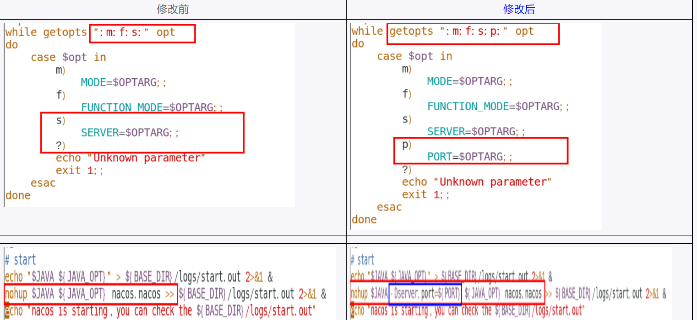

执行方式：**./startup.sh -p 3333**

##### 5、Nginx的配置，由它作为负载均衡器

修改nginx的配置文件

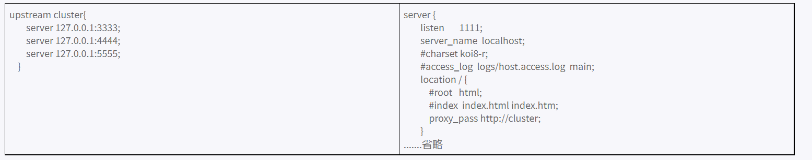

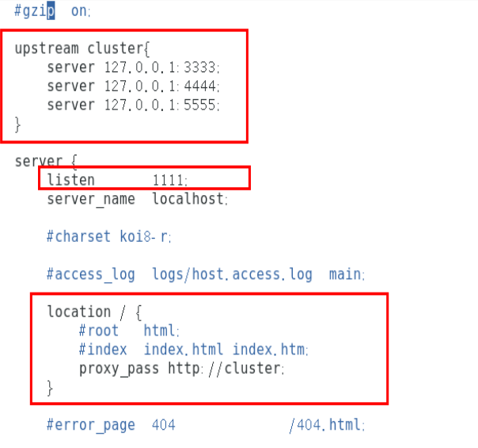

**注意：记得重启**

##### 6、测试

- 测试通过nginx访问nacos：http://192.168.222.125:1111/nacos/#/login

- 新建一个配置进行测试
- linux服务器的mysql插入一条记录


#### 3、测试

##### 1、微服务cloudalibaba-provider-payment9002启动注册进nacos集群

```yaml
server:
  port: 9002

spring:
  application:
    name: nacos-discovery-payment-provider
  cloud:
    nacos:
      discovery:
        #配置Nacos地址
        #server-addr: localhost:8848
        ## 换成nginx的1111端口，做集群
        server-addr: 192.168.111.144:1111


management:
  endpoints:
    web:
      exposure:
        include: '*'
```

总结：

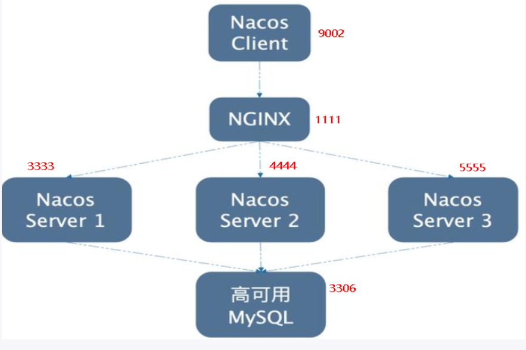
