### 1、简介

> Sentinel 是面向分布式服务架构的流量控制组件，主要以流量为切入点，从流量控制、熔断降级、系统自适应保护等多个维度来帮助您保障微服务的稳定性。

官网：https://github.com/alibaba/Sentinel

中文文档：https://github.com/alibaba/Sentinel/wiki/%E4%BB%8B%E7%BB%8D   https://sentinelguard.io/zh-cn/docs/introduction.html

下载地址：https://github.com/alibaba/Sentinel/releases/tag/1.8.1

#### 1、Sentinel 基本概念

##### 资源

资源是 Sentinel 的关键概念。它可以是 Java 应用程序中的任何内容，例如，由应用程序提供的服务，或由应用程序调用的其它应用提供的服务，甚至可以是一段代码。在接下来的文档中，我们都会用资源来描述代码块。

只要通过 Sentinel API 定义的代码，就是资源，能够被 Sentinel 保护起来。大部分情况下，可以使用方法签名，URL，甚至服务名称作为资源名来标示资源。

##### 规则

围绕资源的实时状态设定的规则，可以包括流量控制规则、熔断降级规则以及系统保护规则。所有规则可以动态实时调整。

#### 2、特点

- **丰富的适用场景**：哨兵在阿里巴巴得到了广泛的应用，几乎覆盖了近10年双11（11.11）购物节的所有核心场景，比如需要限制突发流量的“秒杀”满足系统能力、消息削峰填谷、不依靠业务断路、流量控制等。
- **实时监控**：Sentinel 还提供实时监控能力。可以实时查看单台机器的运行时信息，以及以下 500 个节点的集群运行时信息。
- **广泛的开源生态**：Sentinel 提供与 Spring、Dubbo 和 gRPC 等常用框架和库的开箱即用集成。
- **多语言支持**：Sentinel 为 Java、[Go](https://github.com/alibaba/sentinel-golang)和[C++](https://github.com/alibaba/sentinel-cpp)提供了本机支持。
- **丰富的 SPI 扩展**：Sentinel 提供简单易用的 SPI 扩展接口，可以让您快速自定义逻辑，例如自定义规则管理、适配数据源等。

#### 3、作用


#### 4、生态


Sentinel 分为两个部分:

- 核心库（Java 客户端）不依赖任何框架/库，能够运行于所有 Java 运行时环境，同时对 Dubbo / Spring Cloud 等框架也有较好的支持。
- 控制台（Dashboard）基于 Spring Boot 开发，打包后可以直接运行，不需要额外的 Tomcat 等应用容器。
    - Sentinel Dashboard 是一个轻量级的控制台，提供机器发现、单服务器资源监控、集群资源数据概览以及规则管理等功能

#### 5、Sentinel 控制台

官网地址：https://sentinelguard.io/zh-cn/docs/dashboard.html

Sentinel 提供一个轻量级的开源控制台，它提供机器发现以及健康情况管理、监控（单机和集群），规则管理和推送的功能。这里，我们将会详细讲述如何通过简单的步骤就可以使用这些功能。

接下来，我们将会逐一介绍如何整合 Sentinel 核心库和 Dashboard，让它发挥最大的作用。同时我们也在阿里云上提供企业级的 Sentinel 服务：[AHAS Sentinel 控制台](https://github.com/alibaba/Sentinel/wiki/AHAS-Sentinel-控制台)，您只需要几个简单的步骤，就能最直观地看到控制台如何实现这些功能，并体验多样化的监控及全自动托管的集群流控能力。

Sentinel 控制台包含如下功能:

- **查看机器列表以及健康情况**：收集 Sentinel 客户端发送的心跳包，用于判断机器是否在线。
- **监控 (单机和集群聚合)**：通过 Sentinel 客户端暴露的监控 API，定期拉取并且聚合应用监控信息，最终可以实现秒级的实时监控。
- **规则管理和推送**：统一管理推送规则。
- **鉴权**：生产环境中鉴权非常重要。这里每个开发者需要根据自己的实际情况进行定制。


### 2、案例module

#### 1、新建module

```
xiaobear-cloud-alibaba-sentinel-service8401
```

#### 2、改pom

```xml
<dependencies>
        <!--SpringCloud ailibaba nacos -->
        <dependency>
            <groupId>com.alibaba.cloud</groupId>
            <artifactId>spring-cloud-starter-alibaba-nacos-discovery</artifactId>
        </dependency>
        <!--SpringCloud ailibaba sentinel-datasource-nacos 后续做持久化用到-->
        <dependency>
            <groupId>com.alibaba.csp</groupId>
            <artifactId>sentinel-datasource-nacos</artifactId>
        </dependency>
        <!--SpringCloud ailibaba sentinel -->
        <dependency>
            <groupId>com.alibaba.cloud</groupId>
            <artifactId>spring-cloud-starter-alibaba-sentinel</artifactId>
        </dependency>
        <!--openfeign-->
        <dependency>
            <groupId>org.springframework.cloud</groupId>
            <artifactId>spring-cloud-starter-openfeign</artifactId>
        </dependency>
        <!-- SpringBoot整合Web组件+actuator -->
        <dependency>
            <groupId>org.springframework.boot</groupId>
            <artifactId>spring-boot-starter-web</artifactId>
        </dependency>
        <dependency>
            <groupId>org.springframework.boot</groupId>
            <artifactId>spring-boot-starter-actuator</artifactId>
        </dependency>
        <!--日常通用jar包配置-->
        <dependency>
            <groupId>org.springframework.boot</groupId>
            <artifactId>spring-boot-devtools</artifactId>
            <scope>runtime</scope>
            <optional>true</optional>
        </dependency>
        <dependency>
            <groupId>cn.hutool</groupId>
            <artifactId>hutool-all</artifactId>
            <version>4.6.3</version>
        </dependency>
        <dependency>
            <groupId>org.projectlombok</groupId>
            <artifactId>lombok</artifactId>
            <optional>true</optional>
        </dependency>
        <dependency>
            <groupId>org.springframework.boot</groupId>
            <artifactId>spring-boot-starter-test</artifactId>
            <scope>test</scope>
        </dependency>
    </dependencies>
```

#### 3、写yaml

```yaml
server:
  port: 8401

spring:
  application:
    name: xiaobear-sentinel-service
  cloud:
    #nacos注册服务中心
    nacos:
      discovery:
        server-addr: localhost:8848
    sentinel:
      transport:
        #配置Sentinel dashboard地址
        dashboard: localhost:8080
        #默认8719端口，假如被占用会自动从8719开始依次+1扫描,直至找到未被占用的端口
        port: 8719
        clientIp: localhost

#暴露端点
management:
  endpoints:
    web:
      exposure:
        include: '*'
```

#### 4、主启动类

```java
@SpringBootApplication
@EnableDiscoveryClient
public class SentinelServiceApplication8401 {

    public static void main(String[] args) {
        SpringApplication.run(SentinelServiceApplication8401.class, args);
    }
}
```

#### 5、业务类

- controller

  ```java
  @RestController
  public class FlowLimitController {
  
      @GetMapping("/test1")
      public String test1(){
          return "----------test1--------";
      }
  
      @GetMapping("/test2")
      public String test2(){
          return "----------test2--------";
      }
  }
  ```

#### 6、测试

- 启动`Nacos`，访问http://localhost:8848/nacos/
- 启动`Sentinel`，访问http://localhost:8080/
- 启动工程，访问http://localhost:8401/test1和http://localhost:8401/test2

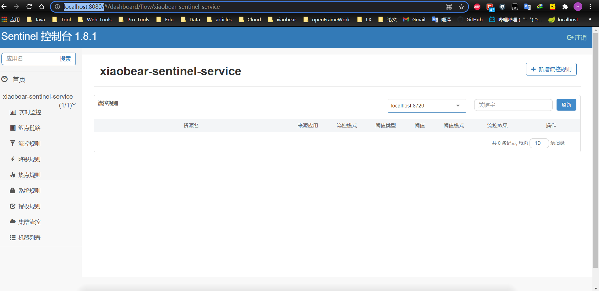

**注意：**

- `Sentinel`采用的是懒加载，所以需要访问才会监控到微服务


### 3、流控规则

#### 1、概述

`FlowSlot` 会根据预设的规则，结合前面 `NodeSelectorSlot`、`ClusterNodeBuilderSlot`、`StatistcSlot` 统计出来的实时信息进行流量控制。

限流的直接表现是在执行 `Entry nodeA = SphU.entry(资源名字)` 的时候抛出 `FlowException` 异常。`FlowException` 是 `BlockException` 的子类，您可以捕捉 `BlockException` 来自定义被限流之后的处理逻辑。

同一个资源可以对应多条限流规则。`FlowSlot` 会对该资源的所有限流规则依次遍历，直到有规则触发限流或者所有规则遍历完毕。

一条限流规则主要由下面几个因素组成，我们可以组合这些元素来实现不同的限流效果：

- `resource`：资源名，即限流规则的作用对象
- `count`: 限流阈值
- `grade`: 限流阈值类型，QPS 或线程数
- `strategy`: 根据调用关系选择策略

|      Field      | 说明                                                         | 默认值                        |
| :-------------: | :----------------------------------------------------------- | :---------------------------- |
|    resource     | 资源名，资源名是限流规则的作用对象                           |                               |
|      count      | 限流阈值                                                     |                               |
|      grade      | 限流阈值类型，QPS 或线程数模式                               | QPS 模式                      |
|    limitApp     | 流控针对的调用来源                                           | `default`，代表不区分调用来源 |
|    strategy     | 调用关系限流策略：直接、链路、关联                           | 根据资源本身（直接）          |
| controlBehavior | 流控效果（直接拒绝 / 排队等待 / 慢启动模式），不支持按调用关系限流 | 直接拒绝                      |

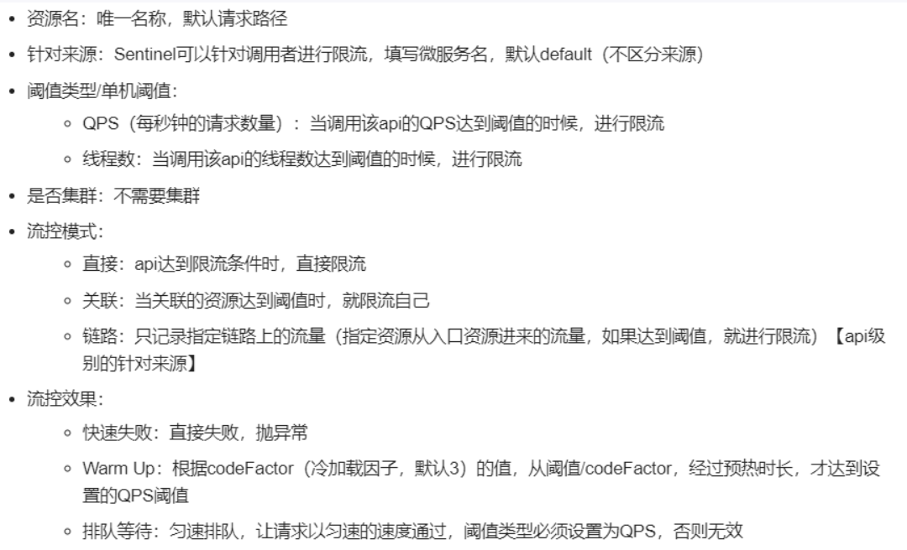

#### 2、流控模式

##### 1、直接（默认）

> 直接->快速失败

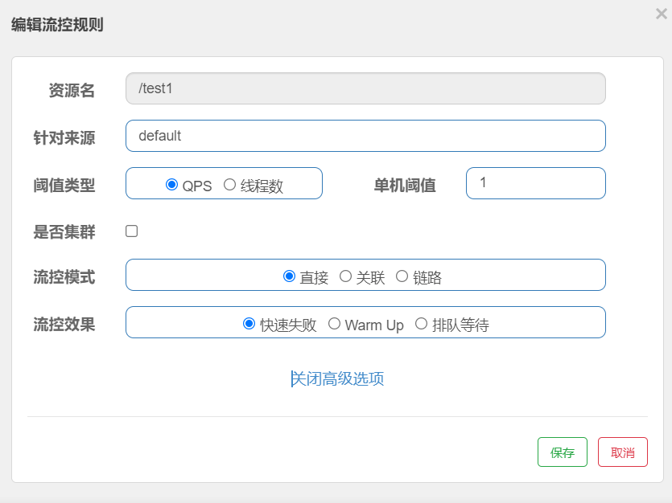

表示1秒钟内查询1次就是OK，若超过次数1，就直接-快速失败，报默认错误

```
Blocked by Sentinel (flow limiting)
```

**思考：**

直接报默认错误信息，技术上是OK，但是是否应该有后续处理，比如有一个兜底的fallback


##### 2、关联

> 当关联的资料达到阈值时，就限流自己。当与A关联的资源B达到阈值后，就限流A

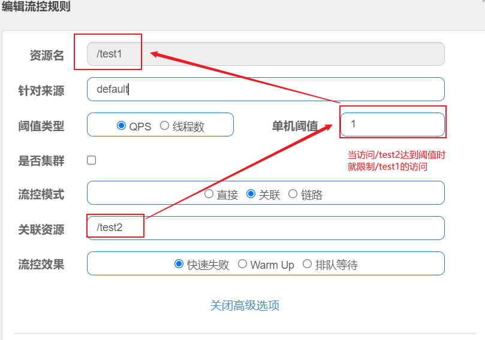

当关联资源/test2的qps阀值超过1时，就限流/test1的Rest访问地址，当关联资源到阈值后限制配置好的资源名


用PostMan模拟并发访问/test2,发现Blocked by Sentinel (flow limiting)

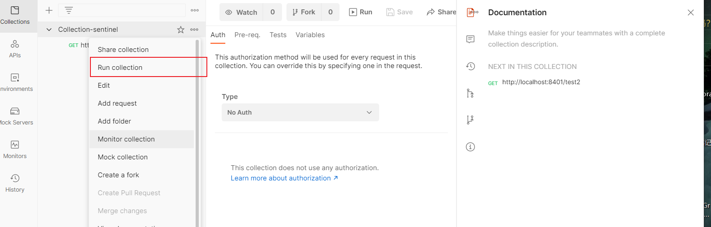

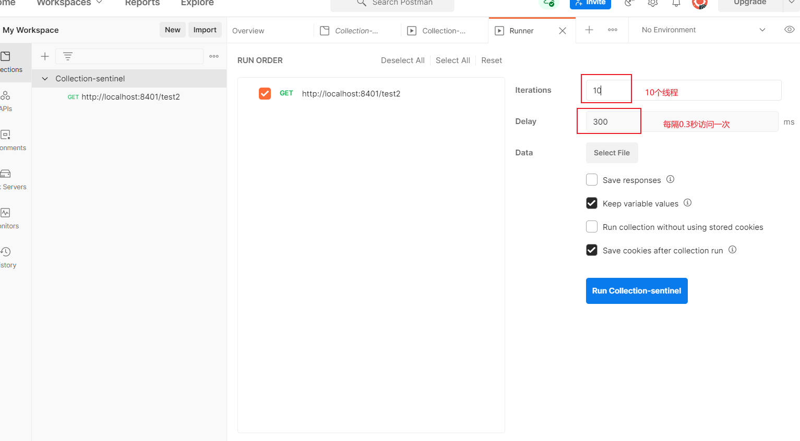

##### 3、链路

**链路流控模式指的是，当从某个接口过来的资源达到限流条件时，开启限流；它的功能有点类似于针对 来源配置项，区别在于：针对来源是针对上级微服务，而链路流控是针对上级接口，也就是说它的粒度 更细；**

增加service

- service

  ```java
  @Service
  public class SentinelService {
  
      @SentinelResource("hello")
      public String hello() {
          return "Hello Sentinel";
      }
  }
  ```

    - `@SentinelResource` 注释用于识别资源是速率受限还是降级。在上面的示例中，注解的 'hello' 属性指的是资源名称。

- controller

  ```java
  @RestController
  public class FlowLimitController {
  
      @Resource
      private SentinelService sentinelService;
  
      @GetMapping("/test1")
      public String test1(){
          return "----------test1--------";
      }
  
      @GetMapping("/test2")
      public String test2(){
          return "----------test2--------";
      }
  
      @GetMapping("/test3")
      public String test3(){
          return sentinelService.hello();
      }
  }
  ```


### 4、流控效果

#### 1、直接（默认的流控处理）

该方式是默认的流量控制方式，当QPS超过任意规则的阈值后，新的请求就会被立即拒绝，拒绝方式为抛出`FlowException`。

#### 2、预热(Warm Up)

> https://github.com/alibaba/Sentinel/wiki/%E6%B5%81%E9%87%8F%E6%8E%A7%E5%88%B6
>
> 公式：阈值除以coldFactor(默认为3)，经过预热时长后才达到阈值
>
> 冷启动（`RuleConstant.CONTROL_BEHAVIOR_WARM_UP`）方式。该方式主要用于系统长期处于低水位的情况下，当流量突然增加时，直接把系统拉升到高水位可能瞬间把系统压垮。通过"冷启动"，让通过的流量缓慢增加，在一定时间内逐渐增加到阈值上限，给冷系统一个预热的时间，避免冷系统被压垮的情况。

##### 1、配置

| 默认 coldFactor 为 3，即请求QPS从(threshold / 3) 开始，经多少预热时长才逐渐升至设定的 QPS 阈值。 |
| ------------------------------------------------------------ |
| 案例，阀值为10+预热时长设置5秒。系统初始化的阀值为10 / 3 约等于3,即阀值刚开始为3；然后过了5秒后阀值才慢慢升高恢复到10 |

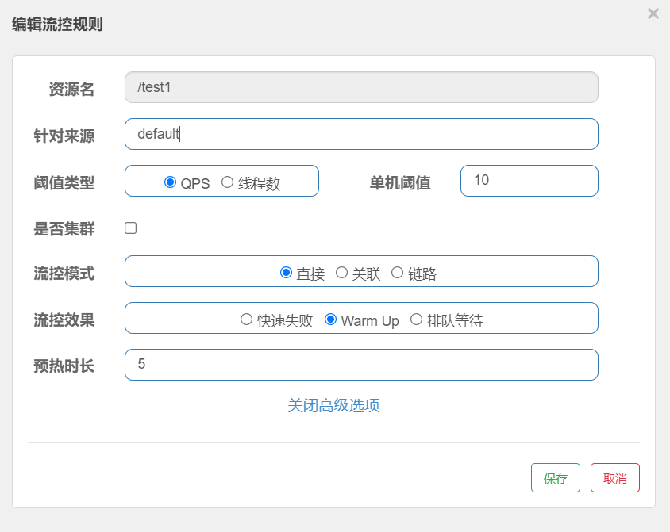

##### 2、应用场景

> 如：秒杀系统在开启的瞬间，会有很多流量上来，很有可能把系统打死，预热方式就是把为了保护系统，可慢慢的把流量放进来，慢慢的把阀值增长到设置的阀值。

#### 3、排队等待

匀速器（`RuleConstant.CONTROL_BEHAVIOR_RATE_LIMITER`）方式。这种方式严格控制了请求通过的间隔时间，也即是让请求以均匀的速度通过，对应的是漏桶算法。


| 匀速排队，让请求以均匀的速度通过，阀值类型必须设成QPS，否则无效。 |
| ------------------------------------------------------------ |
| 设置含义：/test1每秒1次请求，超过的话就排队等待，等待的超时时间为1000毫秒。 |

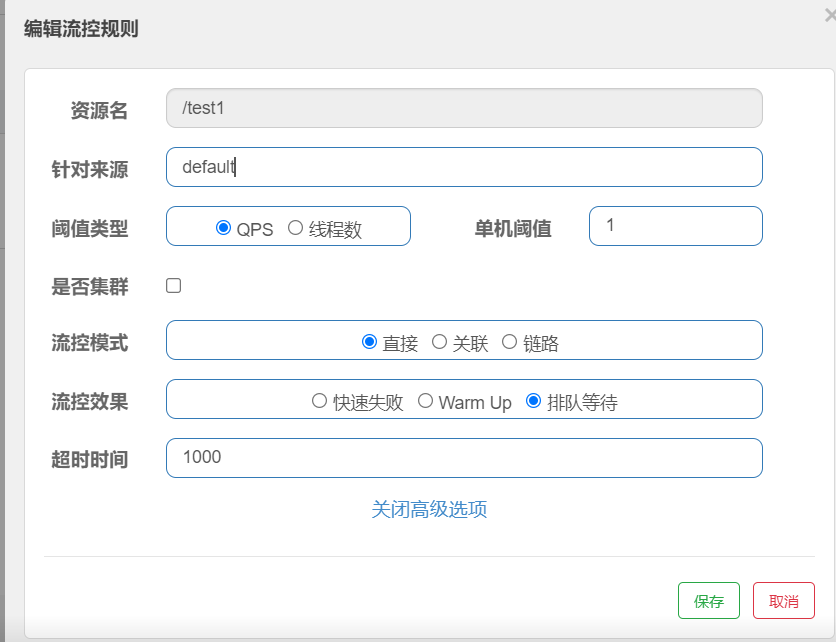

### 5、降级规则

官网文档地址：https://sentinelguard.io/zh-cn/docs/circuit-breaking.html

Sentinel 提供以下几种熔断策略：

- 慢调用比例 (`SLOW_REQUEST_RATIO`)：选择以慢调用比例作为阈值，需要设置允许的慢调用 RT（即最大的响应时间），请求的响应时间大于该值则统计为慢调用。当单位统计时长（`statIntervalMs`）内请求数目大于设置的最小请求数目，并且慢调用的比例大于阈值，则接下来的熔断时长内请求会自动被熔断。经过熔断时长后熔断器会进入探测恢复状态（HALF-OPEN 状态），若接下来的一个请求响应时间小于设置的慢调用 RT 则结束熔断，若大于设置的慢调用 RT 则会再次被熔断。
- 异常比例 (`ERROR_RATIO`)：当单位统计时长（`statIntervalMs`）内请求数目大于设置的最小请求数目，并且异常的比例大于阈值，则接下来的熔断时长内请求会自动被熔断。经过熔断时长后熔断器会进入探测恢复状态（HALF-OPEN 状态），若接下来的一个请求成功完成（没有错误）则结束熔断，否则会再次被熔断。异常比率的阈值范围是 `[0.0, 1.0]`，代表 0% - 100%。
- 异常数 (`ERROR_COUNT`)：当单位统计时长内的异常数目超过阈值之后会自动进行熔断。经过熔断时长后熔断器会进入探测恢复状态（HALF-OPEN 状态），若接下来的一个请求成功完成（没有错误）则结束熔断，否则会再次被熔断。

> RT（平均响应时间，秒级）
>
>    平均响应时间  超出阈值 且  在时间窗口内通过的请求>=5，两个条件同时满足后触发降级
>
>    窗口期过后关闭断路器
>
>    RT最大4900（更大的需要通过-Dcsp.sentinel.statistic.max.rt=XXXX才能生效）
>
>
>
> 异常比列（秒级）
>
>   QPS >= 5 且异常比例（秒级统计）超过阈值时，触发降级；时间窗口结束后，关闭降级
>
>
>
> 异常数（分钟级）
>
>    异常数（分钟统计）超过阈值时，触发降级；时间窗口结束后，关闭降级

Sentinel 熔断降级会在调用链路中某个资源出现不稳定状态时（例如调用超时或异常比例升高），对这个资源的调用进行限制，让请求快速失败，避免影响到其它的资源而导致级联错误。

当资源被降级后，在接下来的降级时间窗口之内，对该资源的调用都自动熔断（默认行为是抛出 DegradeException）。

- `Sentinel`的断路器是没有半开状态
    - 半开的状态系统自动检测是否请求有异常，没有异常就关闭断路器恢复使用，有异常则打开断路器不可用


#### 1、慢调用比例

> 以前的版本是：**平均响应时间**
>
> 选择以慢调用比例作为阈值，需要设置允许的慢调用 RT（即最大的响应时间），请求的响应时间大于该值则统计为慢调用。当单位统计时长（`statIntervalMs`）内请求数目大于设置的最小请求数目，并且慢调用的比例大于阈值，则接下来的熔断时长内请求会自动被熔断。经过熔断时长后熔断器会进入探测恢复状态（HALF-OPEN 状态），若接下来的一个请求响应时间小于设置的慢调用 RT 则结束熔断，若大于设置的慢调用 RT 则会再次被熔断。

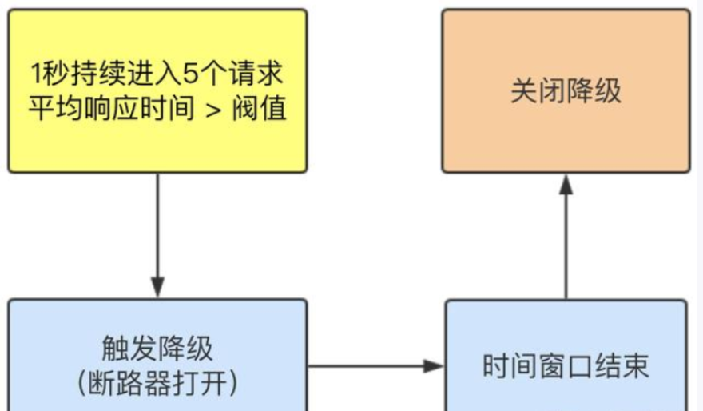

- controller

  ```java
     @GetMapping("/test4")
      public String test4(){
          try {
              Thread.sleep(1000);
          } catch(InterruptedException e) {
              e.printStackTrace();
          }
          return "------------test4----------";
      }
  ```

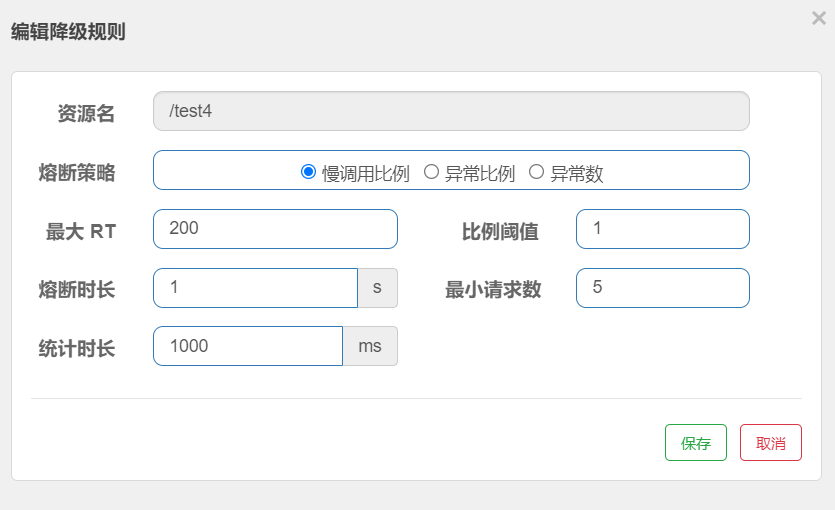

使用jmeter进行压测，一秒钟访问10次

>  永远一秒钟打进来10个线程（大于5个了）调用testD，我们希望200毫秒处理完本次任务，
>
> 如果超过200毫秒还没处理完，在未来1秒钟的时间窗口内，断路器打开(保险丝跳闸)微服务不可用，保险丝跳闸断电了
>
> 后续我停止jmeter，没有这么大的访问量了，断路器关闭(保险丝恢复)，微服务恢复OK

#### 2、异常比例

> 当单位统计时长（`statIntervalMs`）内请求数目大于设置的最小请求数目，并且异常的比例大于阈值，则接下来的熔断时长内请求会自动被熔断。经过熔断时长后熔断器会进入探测恢复状态（HALF-OPEN 状态），若接下来的一个请求成功完成（没有错误）则结束熔断，否则会再次被熔断。异常比率的阈值范围是 `[0.0, 1.0]`，代表 0% - 100%。

- controller

  ```java
   @GetMapping("/test5")
      public String test5(){
          int x = 10/0;
          return "----------5--------------";
      }
  }
  ```

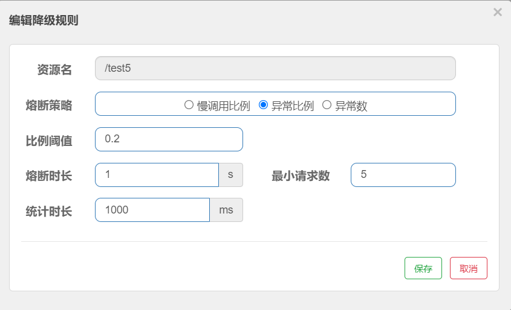

单独访问一次，必然来一次报错一次(int x = 10/0)，调一次错一次；开启jmeter后，直接高并发发送请求，多次调用达到我们的配置条件了。断路器开启(保险丝跳闸)，微服务不可用了，不再报错error而是服务降级了。

#### 3、异常数

> 当单位统计时长内的异常数目超过阈值之后会自动进行熔断。经过熔断时长后熔断器会进入探测恢复状态（HALF-OPEN 状态），若接下来的一个请求成功完成（没有错误）则结束熔断，否则会再次被熔断。
>
> **异常数是按分钟统计的**

- controller

```java
   @GetMapping("/test5")
    public String test5(){
        int x = 10/0;
        return "----------5--------------";
    }
```

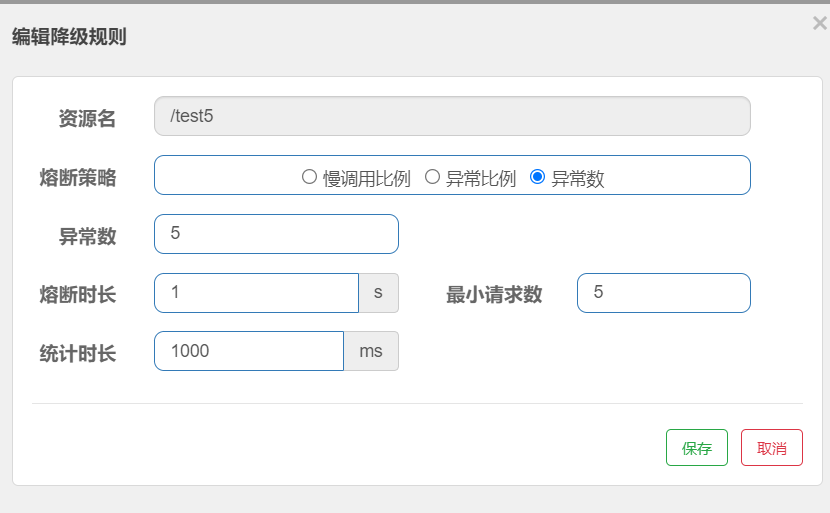

http://localhost:8401/test5，第一次访问绝对报错，因为除数不能为零，我们看到error窗口，但是达到5次报错后，进入熔断后降级。

### 6、热点`Key`限流

**何为热点**

> 热点即经常访问的数据，很多时候我们希望统计或者限制某个热点数据中访问频次最高的TopN数据，并对其访问进行限流或者其它操作

兜底方法分为系统默认和客户自定义，两种

之前的case，限流出问题后，都是用sentinel系统默认的提示：Blocked by Sentinel (flow limiting)

我们能不能自定?类似hystrix，某个方法出问题了，就找对应的兜底降级方法？

**结论** **从HystrixCommand 到@SentinelResource**

#### 1、配置

> 限流模式只支持QPS模式，固定写死了。（这才叫热点）
>
> @SentinelResource注解的方法参数索引，0代表第一个参数，1代表第二个参数，以此类推
>
> 单机阀值以及统计窗口时长表示在此窗口时间超过阀值就限流。
>
> 上面的抓图就是第一个参数有值的话，1秒的QPS为1，超过就限流，限流后调用dealHandler_testHotKey支持方法。
>
> 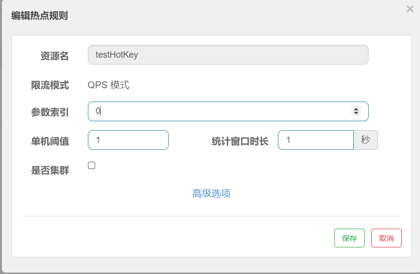

```java
@GetMapping("/testHotKey")
    @SentinelResource(value = "testHotKey",blockHandler = "dealHandler_testHotKey")
    public String testHotKey(@RequestParam(value = "p1",required = false) String p1,
                             @RequestParam(value = "p2",required = false) String p2){
        return "------testHotKey-------------";
    }
    public String dealHandler_testHotKey(String p1, String p2, BlockException exception)
    {
        return "-----dealHandler_testHotKey-----------";
    }
```

只要第一参数访问的QPS超过1秒，马上降级处理`blockHandler = "dealHandler_testHotKey"`

测试：

- http://localhost:8401/testHotKey?p1=abc
- http://localhost:8401/testHotKey?p1=abc&p2=111
- http://localhost:8401/testHotKey?p2=abc

#### 2、特殊情况

> 我们期望p1的某个值达到限流时，它的限流值跟普通的不一样。
>
> - 例如p1= 10，限流值阈值为200

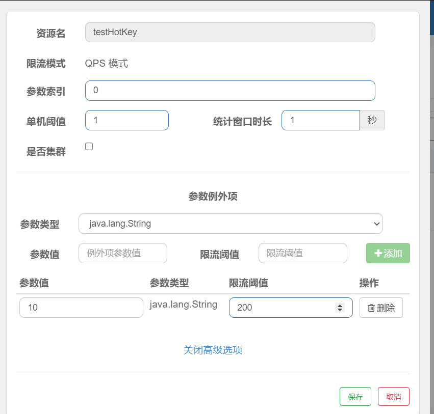

这里需要先填写**参数值**跟**限流阈值**，添加按钮才会有反应

注意：

- **参数类型必须是基本类型**，访问地址的类型跟参数类型进行对应


### 7、系统规则

https://github.com/alibaba/Sentinel/wiki/%E7%B3%BB%E7%BB%9F%E8%87%AA%E9%80%82%E5%BA%94%E9%99%90%E6%B5%81#%E7%B3%BB%E7%BB%9F%E8%A7%84%E5%88%99

> 系统保护规则是从应用级别的入口流量进行控制，从单台机器的 load、CPU 使用率、平均 RT、入口 QPS 和并发线程数等几个维度监控应用指标，让系统尽可能跑在最大吞吐量的同时保证系统整体的稳定性。
>
> 系统保护规则是应用整体维度的，而不是资源维度的，并且**仅对入口流量生效**。入口流量指的是进入应用的流量（`EntryType.IN`），比如 Web 服务或 Dubbo 服务端接收的请求，都属于入口流量。

系统规则支持以下的模式：

- **Load 自适应**（仅对 Linux/Unix-like 机器生效）：系统的 load1 作为启发指标，进行自适应系统保护。当系统 load1 超过设定的启发值，且系统当前的并发线程数超过估算的系统容量时才会触发系统保护（BBR 阶段）。系统容量由系统的 `maxQps * minRt` 估算得出。设定参考值一般是 `CPU cores * 2.5`。
- **CPU usage**（1.5.0+ 版本）：当系统 CPU 使用率超过阈值即触发系统保护（取值范围 0.0-1.0），比较灵敏。
- **平均 RT**：当单台机器上所有入口流量的平均 RT 达到阈值即触发系统保护，单位是毫秒。
- **并发线程数**：当单台机器上所有入口流量的并发线程数达到阈值即触发系统保护。
- **入口 QPS**：当单台机器上所有入口流量的 QPS 达到阈值即触发系统保护。

#### 1、原理

先用经典图来镇楼:


我们把系统处理请求的过程想象为一个水管，到来的请求是往这个水管灌水，当系统处理顺畅的时候，请求不需要排队，直接从水管中穿过，这个请求的RT是最短的；反之，当请求堆积的时候，那么处理请求的时间则会变为：排队时间 + 最短处理时间。

- 推论一: 如果我们能够保证水管里的水量，能够让水顺畅的流动，则不会增加排队的请求；也就是说，这个时候的系统负载不会进一步恶化。

我们用 T 来表示(水管内部的水量)，用RT来表示请求的处理时间，用P来表示进来的请求数，那么一个请求从进入水管道到从水管出来，这个水管会存在 `P * RT`　个请求。换一句话来说，当 `T ≈ QPS * Avg(RT)` 的时候，我们可以认为系统的处理能力和允许进入的请求个数达到了平衡，系统的负载不会进一步恶化。

接下来的问题是，水管的水位是可以达到了一个平衡点，但是这个平衡点只能保证水管的水位不再继续增高，但是还面临一个问题，就是在达到平衡点之前，这个水管里已经堆积了多少水。如果之前水管的水已经在一个量级了，那么这个时候系统允许通过的水量可能只能缓慢通过，RT会大，之前堆积在水管里的水会滞留；反之，如果之前的水管水位偏低，那么又会浪费了系统的处理能力。

- 推论二:　当保持入口的流量是水管出来的流量的最大的值的时候，可以最大利用水管的处理能力。

然而，和 TCP BBR 的不一样的地方在于，还需要用一个系统负载的值（load1）来激发这套机制启动。

> 注：这种系统自适应算法对于低 load 的请求，它的效果是一个“兜底”的角色。**对于不是应用本身造成的 load 高的情况（如其它进程导致的不稳定的情况），效果不明显。**

### 8、`@SentinelResourse`

#### 1、按资源名限流

- 启动`Nacos`
- 启动`Sentinel`

##### 1、修改8401

###### 1、pom文件增加依赖

```xml
<dependency>
    <groupId>com.xiaobear</groupId>
    <artifactId>xiaobear-common-api-3</artifactId>
    <version>1.0-SNAPSHOT</version>
</dependency>
```

###### 2、增加业务层controller

- 增加兜底方法`handleException`

```java
@RestController
public class RateLimitController {

    @GetMapping("/byResource")
    @SentinelResource(value = "/byResource",blockHandler = "handleException")
    public CommonResult byResourse(){
        return new CommonResult(200,"按资源名称限流测试OK",new Payment(2020L,"serial001"));
    }

    public CommonResult handleException(BlockException exception)
    {
        return new CommonResult(444,exception.getClass().getCanonicalName()+"\t 服务不可用");
    }
}
```

###### 3、测试

启动8401

- http://localhost:8401/byResource

  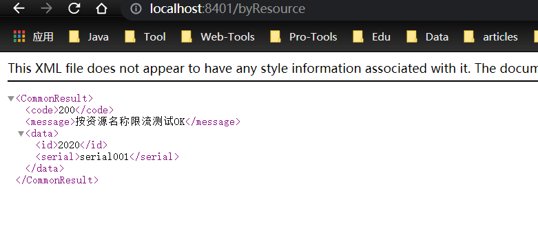

- 添加流控规则

  表示1秒钟内查询的次数大于1，就会跑到我们自己的限流

  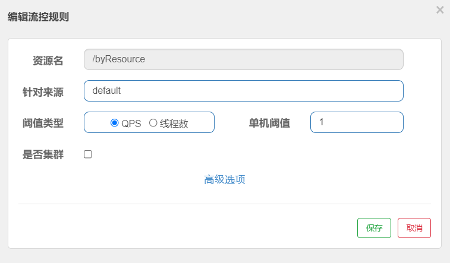

- 接着访问

  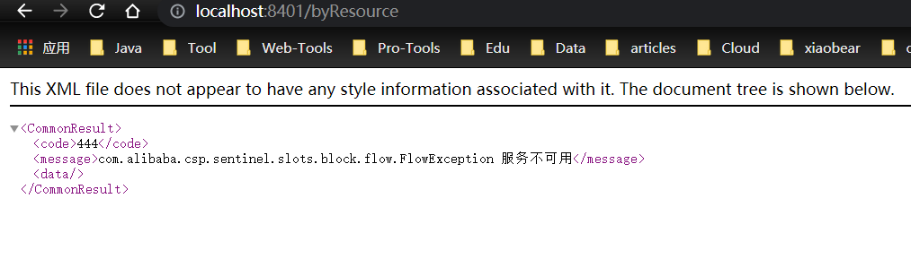

- **额外问题**

    - **关闭8401，流控规则就消失了，不能够持久化**

#### 2、按URL限流

> 通过访问URL来限流，会返回`Sentinel`自带默认的限流处理

业务层添加接口

```java
 @GetMapping("/rateLimit/byUrl")
    @SentinelResource(value = "byUrl")
    public CommonResult byUrl()
    {
        return new CommonResult(200,"按url限流测试OK",new Payment(2020L,"serial002"));
    }
```

测试：http://localhost:8401/rateLimit/byUrl

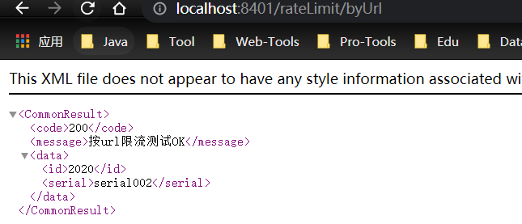

添加流控规则：每秒钟访问一次

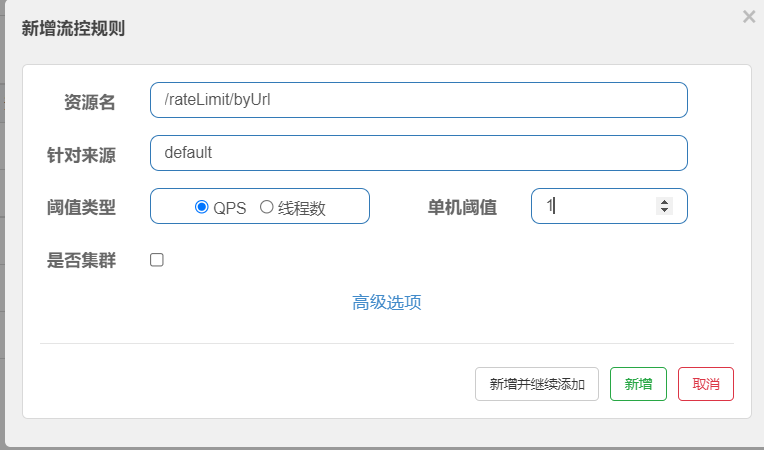

然后测试：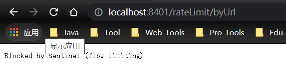

------

> 1   系统默认的，没有体现我们自己的业务要求。
>
> 2 依照现有条件，我们自定义的处理方法又和业务代码耦合在一块，不直观。
>
> 3 每个业务方法都添加一个兜底的，那代码膨胀加剧。
>
> 4 全局统一的处理方法没有体现。

#### 3、自定义限流处理规则

1. 创建CustomerBlockHandler类用于自定义限流处理逻辑

   ```java
   public class CustomerBlockHandler {
   
       public static CommonResult handleException(BlockException exception){
           return new CommonResult(2020,"自定义的限流处理信息......CustomerBlockHandler");
       }
   
   }
   ```

2. RateLimitController增加接口

   ```java
       @GetMapping("/rateLimit/customerBlockHandler")
       @SentinelResource(value = "customerBlockHandler",
               blockHandlerClass = CustomerBlockHandler.class, blockHandler = "handleException")
       public CommonResult customerBlockHandler()
       {
           return new CommonResult(200,"按客户自定义限流处理逻辑");
       }
   ```

   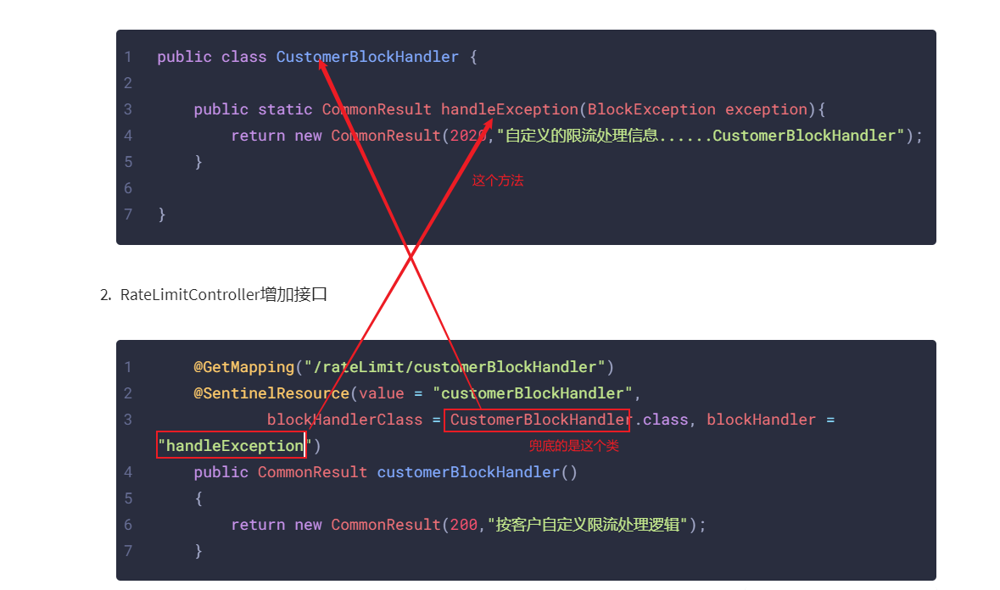

3. 测试：http://localhost:8401/rateLimit/customerBlockHandler

4. 增加流控规则

   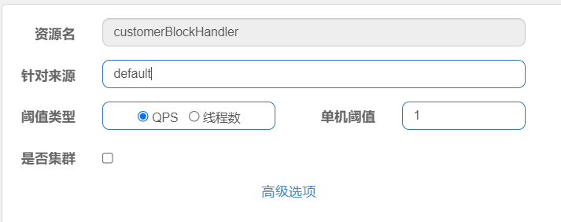

5. 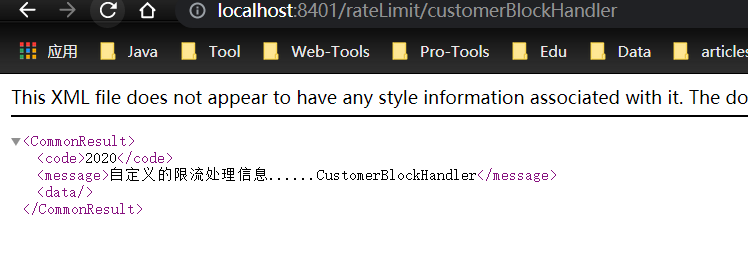

#### 4、更多属性

地址：https://sentinelguard.io/zh-cn/docs/annotation-support.html

##### @SentinelResource 注解

> 注意：注解方式埋点不支持 private 方法。

`@SentinelResource` 用于定义资源，并提供可选的异常处理和 fallback 配置项。 `@SentinelResource` 注解包含以下属性：

- `value`：资源名称，必需项（不能为空）

- `entryType`：entry 类型，可选项（默认为 `EntryType.OUT`）

- `blockHandler` / `blockHandlerClass`: `blockHandler` 对应处理 `BlockException` 的函数名称，可选项。blockHandler 函数访问范围需要是 `public`，返回类型需要与原方法相匹配，参数类型需要和原方法相匹配并且最后加一个额外的参数，类型为 `BlockException`。blockHandler 函数默认需要和原方法在同一个类中。若希望使用其他类的函数，则可以指定 `blockHandlerClass` 为对应的类的 `Class` 对象，注意对应的函数必需为 static 函数，否则无法解析。

- ```
  fallback
  ```

  ：fallback 函数名称，可选项，用于在抛出异常的时候提供 fallback 处理逻辑。fallback 函数可以针对所有类型的异常（除了

  ```
  exceptionsToIgnore
  ```

  里面排除掉的异常类型）进行处理。fallback 函数签名和位置要求：

    - 返回值类型必须与原函数返回值类型一致；
    - 方法参数列表需要和原函数一致，或者可以额外多一个 `Throwable` 类型的参数用于接收对应的异常。
    - fallback 函数默认需要和原方法在同一个类中。若希望使用其他类的函数，则可以指定 `fallbackClass` 为对应的类的 `Class` 对象，注意对应的函数必需为 static 函数，否则无法解析。

- ```
  defaultFallback
  ```

  （since 1.6.0）：默认的 fallback 函数名称，可选项，通常用于通用的 fallback 逻辑（即可以用于很多服务或方法）。默认 fallback 函数可以针对所以类型的异常（除了


  ```
  exceptionsToIgnore
  ```


里面排除掉的异常类型）进行处理。若同时配置了 fallback 和 defaultFallback，则只有 fallback 会生效。defaultFallback 函数签名要求：

- 返回值类型必须与原函数返回值类型一致；
- 方法参数列表需要为空，或者可以额外多一个 `Throwable` 类型的参数用于接收对应的异常。
- defaultFallback 函数默认需要和原方法在同一个类中。若希望使用其他类的函数，则可以指定 `fallbackClass` 为对应的类的 `Class` 对象，注意对应的函数必需为 static 函数，否则无法解析。

- `exceptionsToIgnore`（since 1.6.0）：用于指定哪些异常被排除掉，不会计入异常统计中，也不会进入 fallback 逻辑中，而是会原样抛出。

> 注：1.6.0 之前的版本 fallback 函数只针对降级异常（`DegradeException`）进行处理，**不能针对业务异常进行处理**。

特别地，若 blockHandler 和 fallback 都进行了配置，则被限流降级而抛出 `BlockException` 时只会进入 `blockHandler` 处理逻辑。若未配置 `blockHandler`、`fallback` 和 `defaultFallback`，则被限流降级时会将 `BlockException` **直接抛出**。


##### 三个核心API

- SphU定义资源
- Tracer定义统计
- ContextUtil定义了上下文


### 9、服务熔断

`sentinel`+`ribbon`+`openfeign`+`fallback`的整合

#### 1、`Ribbon`系列

- 新建xiaobear-cloud-alibaba-sentinel-ribbon-provider-payment9003
- 新建xiaobear-cloud-alibaba-sentinel-ribbon-provider-payment9004
- 新建xiaobear-cloud-alibaba-consumer-nacos-order84

###### 1、新建9003 、9004

####### 1、新建module

####### 2、改Pom

```xml
 <dependencies>
        <!--SpringCloud ailibaba nacos -->
        <dependency>
            <groupId>com.alibaba.cloud</groupId>
            <artifactId>spring-cloud-starter-alibaba-nacos-discovery</artifactId>
        </dependency>
        <dependency>
            <groupId>com.xiaobear</groupId>
            <artifactId>xiaobear-common-api-3</artifactId>
            <version>1.0-SNAPSHOT</version>
        </dependency>
        <!-- SpringBoot整合Web组件 -->
        <dependency>
            <groupId>org.springframework.boot</groupId>
            <artifactId>spring-boot-starter-web</artifactId>
        </dependency>
        <dependency>
            <groupId>org.springframework.boot</groupId>
            <artifactId>spring-boot-starter-actuator</artifactId>
        </dependency>
        <!--日常通用jar包配置-->
        <dependency>
            <groupId>org.springframework.boot</groupId>
            <artifactId>spring-boot-devtools</artifactId>
            <scope>runtime</scope>
            <optional>true</optional>
        </dependency>
        <dependency>
            <groupId>org.projectlombok</groupId>
            <artifactId>lombok</artifactId>
            <optional>true</optional>
        </dependency>
        <dependency>
            <groupId>org.springframework.boot</groupId>
            <artifactId>spring-boot-starter-test</artifactId>
            <scope>test</scope>
        </dependency>
    </dependencies>
```

####### 3、写yaml

端口号是不同的，一个是9003，一个是9004

```yaml
server:
  port: 9003

spring:
  application:
    name: nacos-payment-provider
  cloud:
    nacos:
      discovery:
        server-addr: localhost:8848 #配置Nacos地址

management:
  endpoints:
    web:
      exposure:
        include: '*'
```

####### 4、主启动类

```java
@SpringBootApplication
@EnableDiscoveryClient
public class PaymentMain9003 {
    public static void main(String[] args) {
        SpringApplication.run(PaymentMain9003.class, args);
    }
}
```

####### 5、业务层

- controller

  ```java
  @RestController
  public class PaymentController
  {
      @Value("${server.port}")
      private String serverPort;
  
      public static HashMap<Long, Payment> hashMap = new HashMap<>();
      static
      {
          hashMap.put(1L,new Payment(1L,"28a8c1e3bc2742d8848569891fb42181"));
          hashMap.put(2L,new Payment(2L,"bba8c1e3bc2742d8848569891ac32182"));
          hashMap.put(3L,new Payment(3L,"6ua8c1e3bc2742d8848569891xt92183"));
      }
  
      @GetMapping(value = "/paymentSQL/{id}")
      public CommonResult<Payment> paymentSQL(@PathVariable("id") Long id)
      {
          Payment payment = hashMap.get(id);
          CommonResult<Payment> result = new CommonResult(200,"from mysql,serverPort:  "+serverPort,payment);
          return result;
      }
      
  }
  ```

####### 6、测试

我们采用的是静态数据，并没有进行数据库查询

测试地址：http://localhost:9003/paymentSQL/1


###### 2、新建xiaobear-cloud-alibaba-consumer-nacos-order84

####### 1、新建

####### 2、改pom

```xml
<dependencies>
    <!--SpringCloud ailibaba nacos -->
    <dependency>
        <groupId>com.alibaba.cloud</groupId>
        <artifactId>spring-cloud-starter-alibaba-nacos-discovery</artifactId>
    </dependency>
    <!--SpringCloud ailibaba sentinel -->
    <dependency>
        <groupId>com.alibaba.cloud</groupId>
        <artifactId>spring-cloud-starter-alibaba-sentinel</artifactId>
    </dependency>
    <!-- 引入自己定义的api通用包，可以使用Payment支付Entity -->
    <dependency>
        <groupId>com.xiaobear</groupId>
        <artifactId>xiaobear-common-api-3</artifactId>
        <version>1.0-SNAPSHOT</version>
    </dependency>
    <!-- SpringBoot整合Web组件 -->
    <dependency>
        <groupId>org.springframework.boot</groupId>
        <artifactId>spring-boot-starter-web</artifactId>
    </dependency>
    <dependency>
        <groupId>org.springframework.boot</groupId>
        <artifactId>spring-boot-starter-actuator</artifactId>
    </dependency>
    <!--日常通用jar包配置-->
    <dependency>
        <groupId>org.springframework.boot</groupId>
        <artifactId>spring-boot-devtools</artifactId>
        <scope>runtime</scope>
        <optional>true</optional>
    </dependency>
    <dependency>
        <groupId>org.projectlombok</groupId>
        <artifactId>lombok</artifactId>
        <optional>true</optional>
    </dependency>
    <dependency>
        <groupId>org.springframework.boot</groupId>
        <artifactId>spring-boot-starter-test</artifactId>
        <scope>test</scope>
    </dependency>
</dependencies>
```

####### 3、写yaml

```yaml
server:
  port: 84


spring:
  application:
    name: nacos-order-consumer
  cloud:
    nacos:
      discovery:
        server-addr: localhost:8848
    sentinel:
      transport:
        #配置Sentinel dashboard地址
        dashboard: localhost:8080
        #默认8719端口，假如被占用会自动从8719开始依次+1扫描,直至找到未被占用的端口
        port: 8719


#消费者将要去访问的微服务名称(注册成功进nacos的微服务提供者)
service-url:
  nacos-user-service: http://nacos-payment-provider
```

####### 4、主启动类

```java
@SpringBootApplication
@EnableDiscoveryClient
public class OrderNacosMain84 {
    public static void main(String[] args) {
        SpringApplication.run(OrderNacosMain84.class, args);
    }
}

```

####### 5、业务层

- config，用于负载均衡

  ```java
  @Configuration
  public class ApplicationContextConfig {
  
      @Bean
      @LoadBalanced
      public RestTemplate getRestTemplate(){
          return new RestTemplate();
      }
  }
  ```

- controller

  ```java
  @RestController
  public class CircleBreakerController {
  
      public static final String SERVICE_URL = "http://nacos-payment-provider";
  
      @Resource
      private RestTemplate restTemplate;
  
      @RequestMapping("/consumer/fallback/{id}")
      @SentinelResource(value = "fallback")
      //fallback负责业务异常
      public CommonResult<Payment> fallback(@PathVariable Long id)
      {
          CommonResult<Payment> result = restTemplate.getForObject(SERVICE_URL + "/paymentSQL/"+id, CommonResult.class,id);
  
          if (id == 4) {
              throw new IllegalArgumentException ("IllegalArgumentException,非法参数异常....");
          }else if (result.getData() == null) {
              throw new NullPointerException ("NullPointerException,该ID没有对应记录,空指针异常");
          }
  
          return result;
      }
  }
  ```

####### 6、测试

- fallback管运行异常
- blockHandler管配置违规

地址：http://localhost:84/consumer/fallback/1

测试结果：直接返回错误页面，不友好

1、只配置fallback

- controller新增兜底方法

  ```java
  package com.xiaobear.controller;
  
  import com.alibaba.csp.sentinel.annotation.SentinelResource;
  import com.xiaobear.entities.CommonResult;
  import com.xiaobear.entities.Payment;
  import org.springframework.web.bind.annotation.PathVariable;
  import org.springframework.web.bind.annotation.RequestMapping;
  import org.springframework.web.bind.annotation.RestController;
  import org.springframework.web.client.RestTemplate;
  
  import javax.annotation.Resource;
  
  /**
   * @Author xiaobear
   * @date 2021年06月08日 21:53
   * @Description TODO
   */
  @RestController
  public class CircleBreakerController {
  
      public static final String SERVICE_URL = "http://nacos-payment-provider";
  
      @Resource
      private RestTemplate restTemplate;
  
      @RequestMapping("/consumer/fallback/{id}")
      @SentinelResource(value = "fallback",fallback = "handlerFallback")
      //fallback负责业务异常
      public CommonResult<Payment> fallback(@PathVariable Long id)
      {
          CommonResult<Payment> result = restTemplate.getForObject(SERVICE_URL + "/paymentSQL/"+id, CommonResult.class,id);
  
          if (id == 4) {
              throw new IllegalArgumentException ("IllegalArgumentException,非法参数异常....");
          }else if (result.getData() == null) {
              throw new NullPointerException ("NullPointerException,该ID没有对应记录,空指针异常");
          }
  
          return result;
      }
      public CommonResult handlerFallback(@PathVariable  Long id,Throwable e) {
          Payment payment = new Payment(id,"null");
          return new CommonResult<>(444,"兜底异常handlerFallback,exception内容  "+e.getMessage(),payment);
      }
  }
  ```

重启测试：

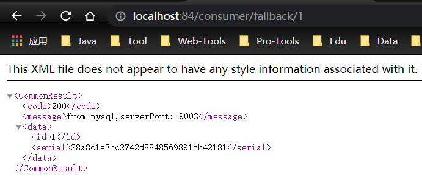

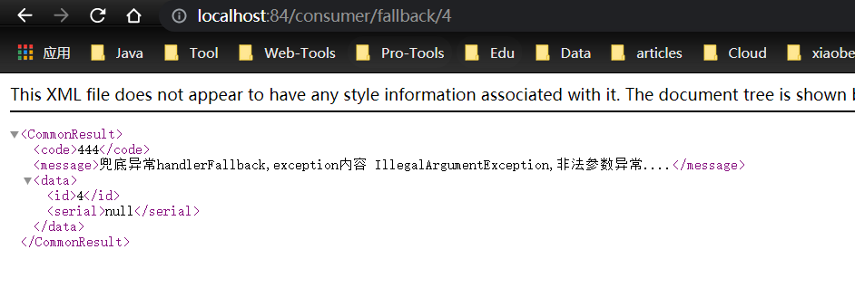

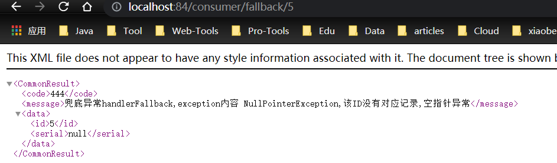

2、只配置blockHandler

```java
package com.xiaobear.controller;

import com.alibaba.csp.sentinel.annotation.SentinelResource;
import com.alibaba.csp.sentinel.slots.block.BlockException;
import com.xiaobear.entities.CommonResult;
import com.xiaobear.entities.Payment;
import org.springframework.web.bind.annotation.PathVariable;
import org.springframework.web.bind.annotation.RequestMapping;
import org.springframework.web.bind.annotation.RestController;
import org.springframework.web.client.RestTemplate;

import javax.annotation.Resource;

/**
 * @Author xiaobear
 * @date 2021年06月08日 21:53
 * @Description TODO
 */
@RestController
public class CircleBreakerController {

    public static final String SERVICE_URL = "http://nacos-payment-provider";

    @Resource
    private RestTemplate restTemplate;

    @RequestMapping("/consumer/fallback/{id}")
    @SentinelResource(value = "fallback",blockHandler = "blockHandler")
    //fallback负责业务异常
    public CommonResult<Payment> fallback(@PathVariable Long id)
    {
        CommonResult<Payment> result = restTemplate.getForObject(SERVICE_URL + "/paymentSQL/"+id, CommonResult.class,id);
        if (id == 4) {
            throw new IllegalArgumentException ("IllegalArgumentException,非法参数异常....");
        }else if (result.getData() == null) {
            throw new NullPointerException ("NullPointerException,该ID没有对应记录,空指针异常");
        }
        return result;
    }
    public CommonResult handlerFallback(@PathVariable  Long id,Throwable e) {
        Payment payment = new Payment(id,"null");
        return new CommonResult<>(444,"兜底异常handlerFallback,exception内容  "+e.getMessage(),payment);
    }

    public CommonResult blockHandler(@PathVariable  Long id, BlockException blockException) {
        Payment payment = new Payment(id,"null");
        return new CommonResult<>(445,"blockHandler-sentinel限流,无此流水: blockException  "+blockException.getMessage(),payment);
    }
}
```

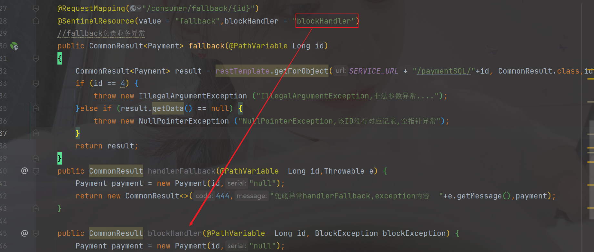

sentinel配置

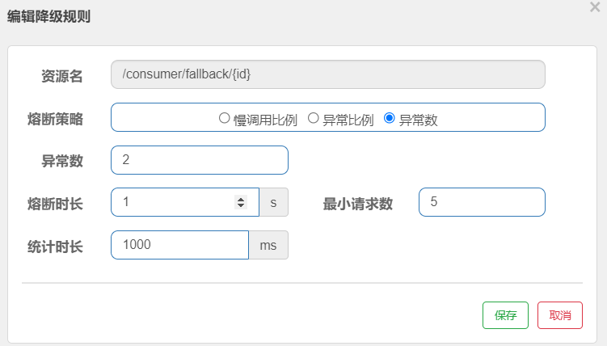

结果

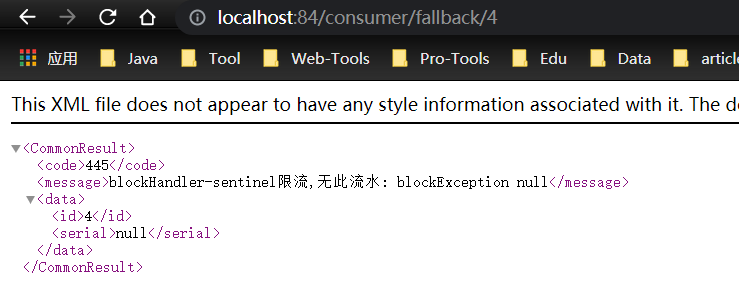

3、fallback和blockHandler都配置

```java
@SentinelResource(value = "fallback",fallback = "handlerFallback",blockHandler = "blockHandler")
```

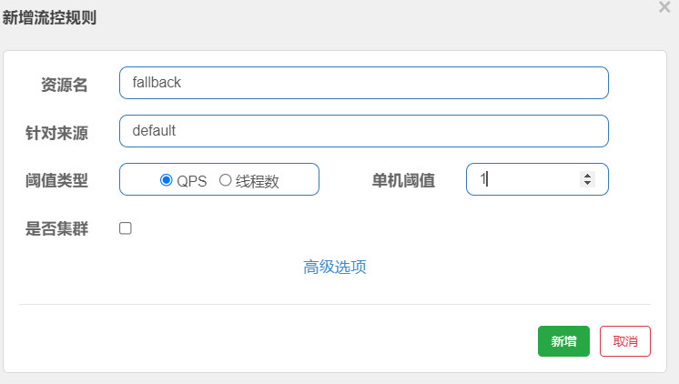

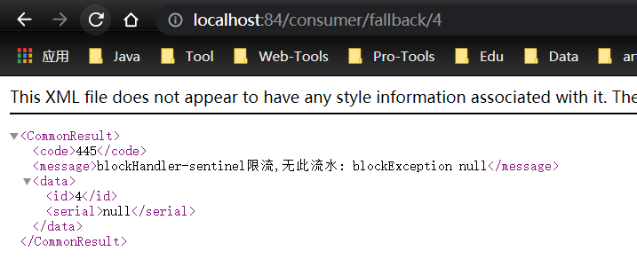

若 blockHandler 和 fallback 都进行了配置，则被限流降级而抛出 BlockException 时只会进入 blockHandler 处理逻辑。


4、忽略属性.......

```java
@SentinelResource(value = "fallback", fallback = "handlerFallback", blockHandler = "blockHandler", exceptionsToIgnore = {IllegalArgumentException.class})
```

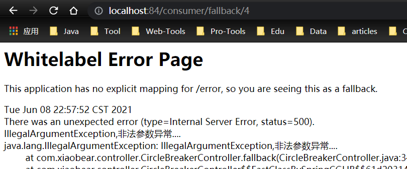


#### 2、Feign系列

##### 1、修改84模块

###### 1、pom文件

```xml
<!--SpringCloud openfeign -->
<dependency>
    <groupId>org.springframework.cloud</groupId>
    <artifactId>spring-cloud-starter-openfeign</artifactId>
</dependency>
```

##### 2、yaml

```yaml
## 激活Sentinel对Feign的支持
feign:
  sentinel:
    enabled: true  
```

##### 3、业务层

- 业务接口 带@FeignClient注解的业务接口

  ```java
  @FeignClient(value = "nacos-payment-provider",fallback = PaymentFallbackService.class)//调用中关闭9003服务提供者
  public interface PaymentService
  {
      @GetMapping(value = "/paymentSQL/{id}")
      public CommonResult<Payment> paymentSQL(@PathVariable("id") Long id);
  }
  ```

- ```java
  @Component
  public class PaymentFallbackService implements PaymentService
  {
      @Override
      public CommonResult<Payment> paymentSQL(Long id)
      {
          return new CommonResult<>(444,"服务降级返回,没有该流水信息",new Payment(id, "errorSerial......"));
      }
  }
  ```

- controller

  ```java
  @Resource
  private PaymentService paymentService;
  
  @GetMapping(value = "/consumer/openfeign/{id}")
  public CommonResult<Payment> paymentSQL(@PathVariable("id") Long id)
  {
      if(id == 4)
      {
          throw new RuntimeException("没有该id");
      }
      return paymentService.paymentSQL(id);
  }
  ```

##### 4、主启动

添加注解`@EnableFeignClients`

##### 5、测试

http://localhost:84/consumer/paymentSQL/1

测试84调用9003，此时故意关闭9003微服务提供者，看84消费侧自动降级，不会被耗死


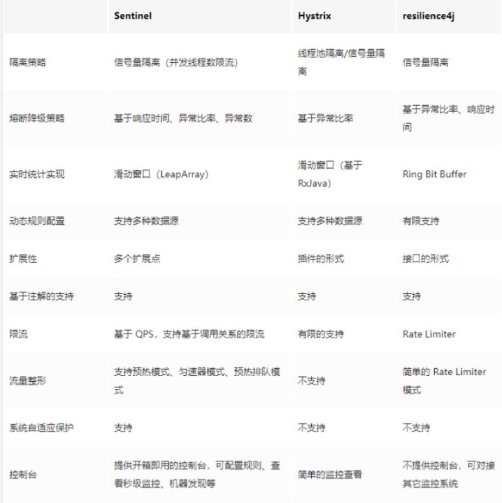

### 10、规则持久化

一旦我们重启应用，sentinel规则将消失，生产环境需要将配置规则进行持久化

**如何使用？**

> 将限流配置规则持久化进Nacos保存，只要刷新8401某个rest地址，sentinel控制台
> 的流控规则就能看到，只要Nacos里面的配置不删除，针对8401上sentinel上的流控规则持续有效

#### 1、修改8401

##### 1、修改pom

```xml
<!--SpringCloud ailibaba sentinel-datasource-nacos -->
<dependency>
    <groupId>com.alibaba.csp</groupId>
    <artifactId>sentinel-datasource-nacos</artifactId>
</dependency>
```

##### 2、改yaml

```yaml
server:
  port: 8401

spring:
  application:
    name: xiaobear-sentinel-service
  cloud:
    #nacos注册服务中心
    nacos:
      discovery:
        server-addr: localhost:8848
    sentinel:
      transport:
        #配置Sentinel dashboard地址
        dashboard: localhost:8080
        #默认8719端口，假如被占用会自动从8719开始依次+1扫描,直至找到未被占用的端口
        port: 8719
        clientIp: localhost
      datasource:
        ds1:
          nacos:
            server-addr: localhost:8848
            dataId: cloudalibaba-sentinel-service
            groupId: DEFAULT_GROUP
            data-type: json
            rule-type: flow


#暴露端点
management:
  endpoints:
    web:
      exposure:
        include: '*'
```

##### 3、添加Nacos业务规则配置

```json
[
    {
        "resource": "/rateLimit/byUrl",
        "limitApp": "default",
        "grade": 1,
        "count": 1,
        "strategy": 0,
        "controlBehavior": 0,
        "clusterMode": false
    }
]
```

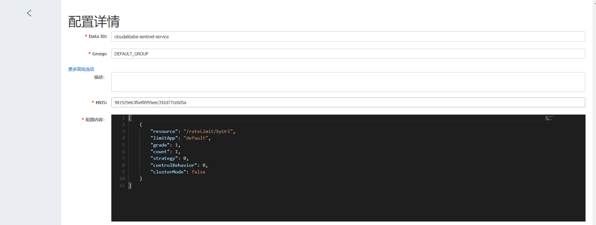

##### 4、启动测试

测试地址：http://localhost:8401/rateLimit/byUrl

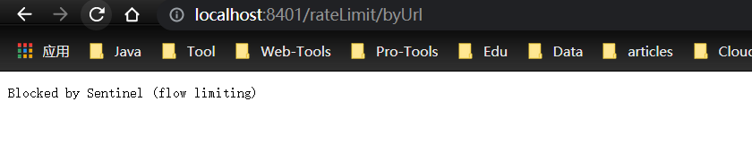

停掉8401之后，在启动，发现流控规则还存在，重新配置出现了，持久化验证通过

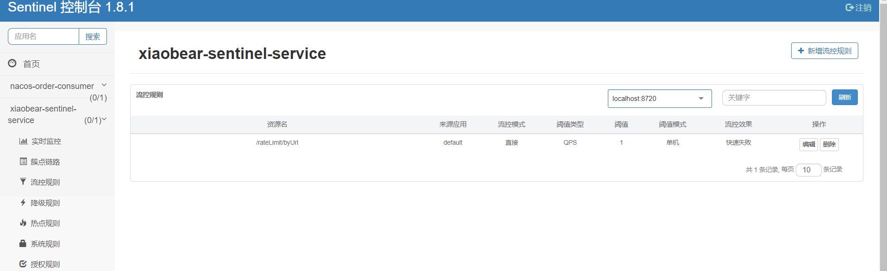
