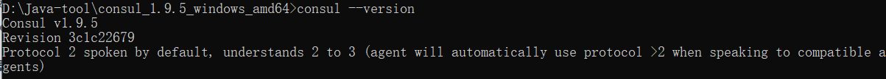
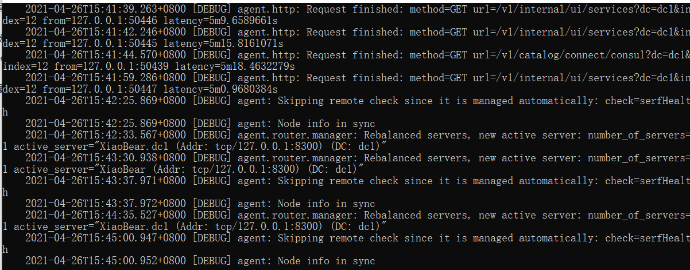
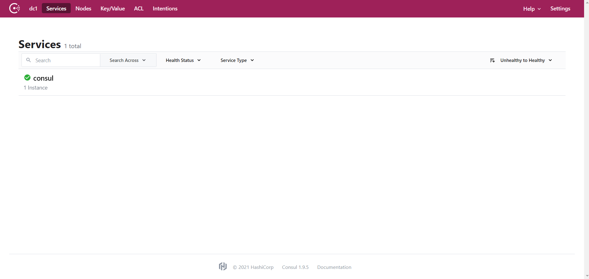
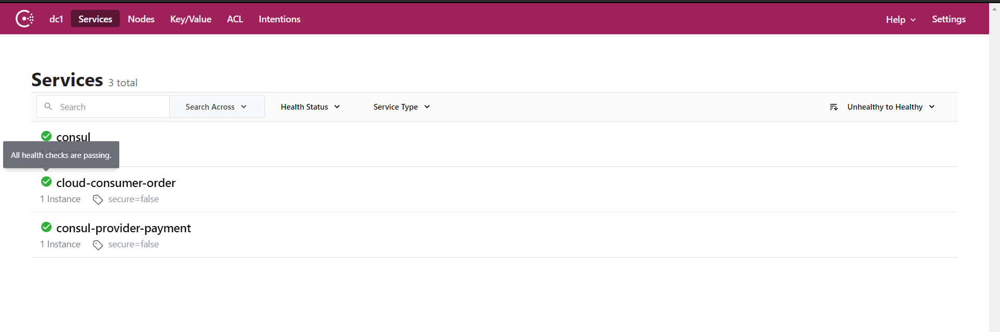
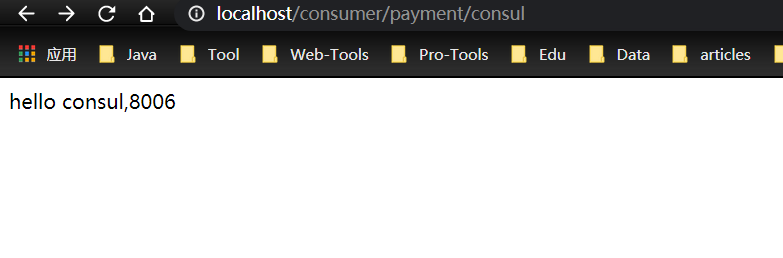
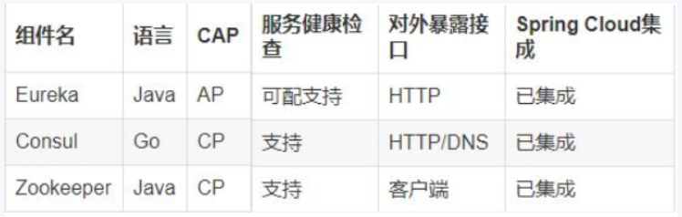
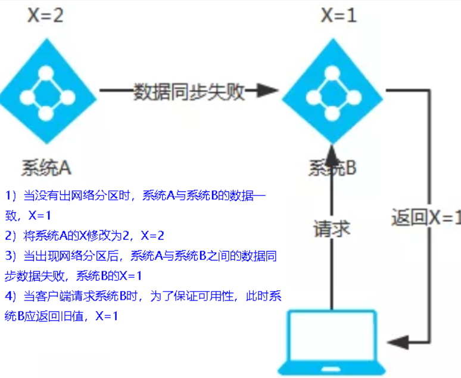
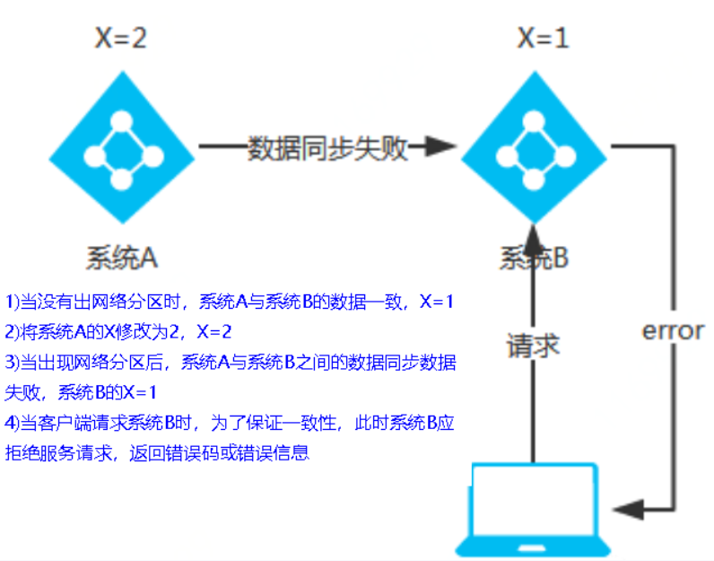

### 1、简介

https://www.consul.io/docs/intro

> Consul is a service mesh solution providing a full featured control plane with service discovery, configuration, and segmentation functionality. Each of these features can be used individually as needed, or they can be used together to build a full service mesh. Consul requires a data plane and supports both a proxy and native integration model. Consul ships with a simple built-in proxy so that everything works out of the box, but also supports 3rd party proxy integrations such as Envoy.

Consul 是一套开源的分布式服务发现和配置管理系统，由 HashiCorp 公司用 Go 语言开发。

``` 
提供了微服务系统中的服务治理、配置中心、控制总线等功能。这些功能中的每一个都可以根据需要单独使用，也可以一起使用以构建全方位的服务网格，总之Consul提供了一种完整的服务网格解决方案。

它具有很多优点。包括： 基于 raft 协议，比较简洁； 支持健康检查, 同时支持 HTTP 和 DNS 协议 支持跨数据中心的 WAN 集群 提供图形界面 跨平台，支持 Linux、Mac、Windows
```

**特性**

- 服务发现

  > 提供HTTP和DNS两种服务发现方式

- 健康监测

  > 支持多种方式，Http、TCP、Docker、Shell脚本定制化监控

- KV存储

  > key、value的存储方式

- 多数据中心

  > 支持多数据中心

- 可视化Web界面

**下载**

https://www.consul.io/downloads

### 2、安装并运行

https://learn.hashicorp.com/tutorials/consul/get-started-install?in=consul/getting-started


解压之后就是一个exe文件，双击运行即可

##### 查看版本信息


```
consul --version
```




##### 使用开发者模式启动

```
consul agent -dev
```



通过地址即可访问到consul的首页：http://localhost:8500/



### 3、服务提供者

#### 1、新建module

```
xiaobear-provider-consul-payment8006-7
```

#### 2、改pom

```xml
<dependencies>

        <!--SpringCloud consul-server -->
        <dependency>
            <groupId>org.springframework.cloud</groupId>
            <artifactId>spring-cloud-starter-consul-discovery</artifactId>
        </dependency>
        <!-- SpringBoot整合Web组件 -->
        <dependency>
            <groupId>org.springframework.boot</groupId>
            <artifactId>spring-boot-starter-web</artifactId>
        </dependency>

        <dependency>
            <groupId>org.springframework.boot</groupId>
            <artifactId>spring-boot-starter-actuator</artifactId>
        </dependency>
        <!--日常通用jar包配置-->
        <dependency>
            <groupId>org.springframework.boot</groupId>
            <artifactId>spring-boot-devtools</artifactId>
            <scope>runtime</scope>
            <optional>true</optional>
        </dependency>
        <dependency>
            <groupId>org.projectlombok</groupId>
            <artifactId>lombok</artifactId>
            <optional>true</optional>
        </dependency>
        <dependency>
            <groupId>org.springframework.boot</groupId>
            <artifactId>spring-boot-starter-test</artifactId>
            <scope>test</scope>
        </dependency>
    </dependencies>
```

#### 3、写yml

```yaml
server:
  port: 8006

spring:
  application:
    name: consul-provider-payment
  #consul服务注册地址
  cloud:
    consul:
      host: localhost
      port: 8500
      discovery:
        service-name: ${spring.application.name}
```

#### 4、主启动类

```java
@SpringBootApplication
public class ConsulProviderPayment {

    public static void main(String[] args) {
        SpringApplication.run(ConsulProviderPayment.class,args);
    }
}
```

#### 5、业务类

##### controller

```java
@RestController
public class PaymentController {

    @Value("${server.port}")
    private String serverPort;

    @GetMapping("/consul/payment")
    public String paymentInfo(){
        return "hello consul,"+serverPort;
    }
}
```

#### 6、测试

http://localhost:8006/consul/payment


### 4、服务消费者

#### 1、新建module

```
xiaobear-consumer-consul-order82
```

#### 2、改pom

```xml
    <dependencies>

        <!--SpringCloud consul-server -->
        <dependency>
            <groupId>org.springframework.cloud</groupId>
            <artifactId>spring-cloud-starter-consul-discovery</artifactId>
        </dependency>
        <!-- SpringBoot整合Web组件 -->
        <dependency>
            <groupId>org.springframework.boot</groupId>
            <artifactId>spring-boot-starter-web</artifactId>
        </dependency>

        <dependency>
            <groupId>org.springframework.boot</groupId>
            <artifactId>spring-boot-starter-actuator</artifactId>
        </dependency>
        <!--日常通用jar包配置-->
        <dependency>
            <groupId>org.springframework.boot</groupId>
            <artifactId>spring-boot-devtools</artifactId>
            <scope>runtime</scope>
            <optional>true</optional>
        </dependency>
        <dependency>
            <groupId>org.projectlombok</groupId>
            <artifactId>lombok</artifactId>
            <optional>true</optional>
        </dependency>
        <dependency>
            <groupId>org.springframework.boot</groupId>
            <artifactId>spring-boot-starter-test</artifactId>
            <scope>test</scope>
        </dependency>
    </dependencies>
```

#### 3、写yml

```yaml
###consul服务端口号
server:
  port: 80

spring:
  application:
    name: cloud-consumer-order
  ####consul注册中心地址
  cloud:
    consul:
      host: localhost
      port: 8500
      discovery:
        #hostname: 127.0.0.1
        service-name: ${spring.application.name}
```

#### 4、主启动类

```java
@SpringBootApplication
public class ConsulOrderMain {

    public static void main(String[] args) {
        SpringApplication.run(ConsulOrderMain.class,args);
    }
}
```

#### 5、业务类

##### 1、配置bean

```
@Configuration
public class ApplicationContextBean {

    @Bean
    @LoadBalanced
    public RestTemplate getRestTemplate(){
        return new RestTemplate();
    }
}
```

##### 2、controller

```java
@RestController
public class OrderConsulController {

    public static final String INVOKE_URL = "http://consul-provider-payment"; //consul-provider-payment

    @Resource
    private RestTemplate restTemplate;

    @GetMapping(value = "/consumer/payment/consul")
    public String paymentInfo()
    {
        String result = restTemplate.getForObject(INVOKE_URL+"/consul/payment", String.class);
        System.out.println("消费者调用支付服务(consule)--->result:" + result);
        return result;
    }
}
```

#### 6、测试



http://localhost/consumer/payment/consul



### 5、三个注册中心的异同点



##### CAP

- C：consistency(强一致性)
- A：Availability(可用性)
- P：Partition tolerance(分区容错性)

> CAP理论关注粒度是数据，而不是整体设计的策略

最多只能同时较好的满足两个。

CAP理论的核心是：一个分布式系统不可能同时很好的满足一致性，可用性和分区容错性这三个需求，

**因此，根据 CAP 原理将 NoSQL 数据库分成了满足 CA 原则、满足 CP 原则和满足 AP 原则三 大类：**

- CA - 单点集群，满足一致性，可用性的系统，通常在可扩展性上不太强大。

- CP - 满足一致性，分区容忍必的系统，通常性能不是特别高。

- AP - 满足可用性，分区容忍性的系统，通常可能对一致性要求低一些。


##### Eureka（AP）

> AP架构
>
> 当网络分区出现后，为了保证可用性，系统B可以返回旧值，保证系统的可用性。
>
> 结论：违背了一致性C的要求，只满足可用性和分区容错，即AP



##### Zookeeper/Consul（CP）

> CP架构
>
> 当网络分区出现后，为了保证一致性，就必须拒接请求，否则无法保证一致性
>
> 结论：违背了可用性A的要求，只满足一致性和分区容错，即CP


