**什么是服务治理？**

> Spring Cloud 封装了 Netflix 公司开发的 Eureka 模块来实现服务治理。
>
> 在传统的rpc远程调用框架中，管理每个服务与服务之间依赖关系比较复杂，管理比较复杂，所以需要使用服
>
> 务治理，管理服务于服务之间依赖关系，可以实现服务调用、负载均衡、容错等，实现服务发现与注册。

**什么是服务注册？**

> Eureka采用了CS的设计架构，Eureka Server 作为服务注册功能的服务器，它是服务注册中心。而系统中的其他微服务，使用 Eureka的客户端连接到 Eureka Server并维持心跳连接。这样系统的维护人员就可以通过 Eureka Server 来监控系统中各个微服务是否正常运行。
>
> 在服务注册与发现中，有一个注册中心。当服务器启动的时候，会把当前自己服务器的信息 比如 服务地址通讯地址等以别名方式注册到注册中心上。另一方（消费者|服务提供者），以该别名的方式去注册中心上获取到实际的服务通讯地址，然后再实现本地RPC调用RPC远程调用框架核心设计思想：在于注册中心，因为使用注册中心管理每个服务与服务之间的一个依赖关系(服务治理概念)。在任何rpc远程框架中，都会有一个注册中心(存放服务地址相关信息(接口地址))
>
> 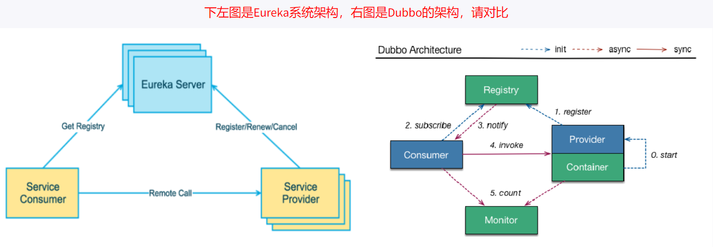

`Eureka包含两个组件：Eureka Server和Eureka Client`

1. Eureka Server提供服务注册服务

   > 各个微服务节点通过配置启动后，会在EurekaServer中进行注册，这样EurekaServer中的服务注册表中将会存储所有可用服务节点的信息，服务节点的信息可以在界面中直观看到。

2. EurekaClient通过注册中心进行访问

   > 是一个Java客户端，用于简化Eureka Server的交互，客户端同时也具备一个内置的、使用轮询(round-robin)负载算法的负载均衡器。在应用启动后，将会向Eureka Server发送心跳(默认周期为30秒)。如果Eureka Server在多个心跳周期内没有接收到某个节点的心跳，EurekaServer将会从服务注册表中把这个服务节点移除（默认90秒）

### 1、单机Eurake构建

#### 1、创建微服务注册中心

##### 1、新建module

`xiaobear-eurake-server-7001-4`

##### 2、改pom.xml

```xml
<dependencies>
        <!--eureka-server-->
        <dependency>
            <groupId>org.springframework.cloud</groupId>
            <artifactId>spring-cloud-starter-netflix-eureka-server</artifactId>
        </dependency>
        <dependency><!-- 引入自己定义的api通用包，可以使用Payment支付Entity -->
            <groupId>com.xiaobear</groupId>
            <artifactId>xiaobear-common-api-3</artifactId>
            <version>1.0-SNAPSHOT</version>
        </dependency>
        <!--boot web actuator-->
        <dependency>
            <groupId>org.springframework.boot</groupId>
            <artifactId>spring-boot-starter-web</artifactId>
        </dependency>
        <dependency>
            <groupId>org.springframework.boot</groupId>
            <artifactId>spring-boot-starter-actuator</artifactId>
        </dependency>
        <!--一般通用配置-->
        <dependency>
            <groupId>org.springframework.boot</groupId>
            <artifactId>spring-boot-devtools</artifactId>
            <scope>runtime</scope>
            <optional>true</optional>
        </dependency>
        <dependency>
            <groupId>org.projectlombok</groupId>
            <artifactId>lombok</artifactId>
        </dependency>
        <dependency>
            <groupId>org.springframework.boot</groupId>
            <artifactId>spring-boot-starter-test</artifactId>
            <scope>test</scope>
        </dependency>
        <dependency>
            <groupId>junit</groupId>
            <artifactId>junit</artifactId>
        </dependency>
    </dependencies>
```

##### 3、写Yml

```yaml
server:
  port: 7001

eureka:
  instance:
    hostname: localhost  #eureka服务端的实例名称
  client:
    register-with-eureka: false   #false表示不向注册中心注册自己。
    fetch-registry: false      #false表示自己端就是注册中心，我的职责就是维护服务实例，并不需要去检索服务
    service-url:
      defaultZone: http://${eureka.instance.hostname}:${server.port}/eureka/
      #设置与Eureka Server交互的地址查询服务和注册服务都需要依赖这个地址。
```

##### 4、主启动

```java
@SpringBootApplication
@EnableEurekaServer  //标注这个一个eureka服务端
public class EurekaMainIn7001Application {

    public static void main(String[] args) {
        SpringApplication.run(EurekaMainIn7001Application.class,args);
    }
}
```

##### 5、测试

http://localhost:7001/

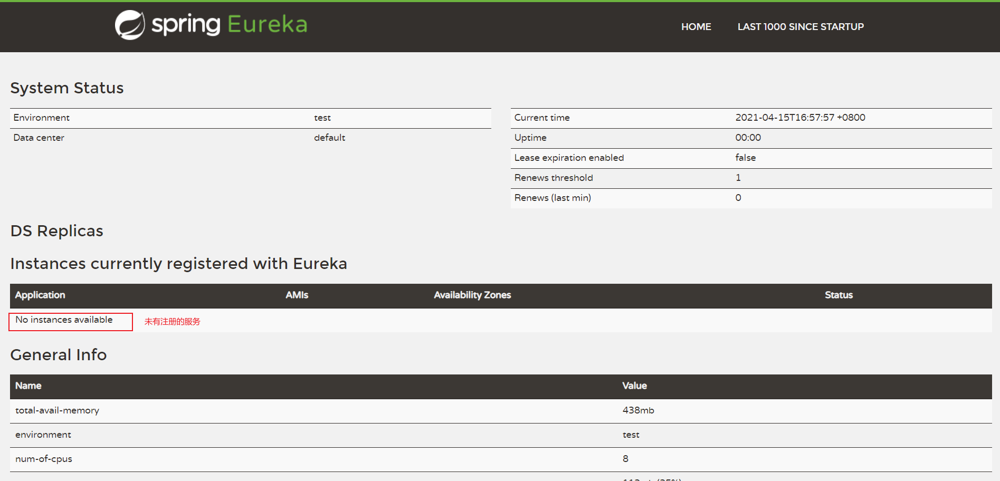

#### 2、将提供者8001和消费者80分别注册进eureka服务

因为两个注册过程一致，这里以8001为例

##### 1、修改8001的pom.xml

```xml
//增加客户端依赖
<dependency>
    <groupId>org.springframework.cloud</groupId>
    <artifactId>spring-cloud-starter-netflix-eureka-client</artifactId>
</dependency>
```

##### 2、写Yml

```yaml
#添加如下
eureka:
  client:
    #表示是否将自己注册进EurekaServer默认为true。
    register-with-eureka: true
    #是否从EurekaServer抓取已有的注册信息，默认为true。单节点无所谓，集群必须设置为true才能配合ribbon使用负载均衡
    fetchRegistry: true
    service-url:
      defaultZone: http://localhost:7001/eureka
```

##### 3、主启动

```java
@SpringBootApplication
@EnableEurekaClient
public class Payment8001Application {

    public static void main(String[] args) {
        SpringApplication.run(Payment8001Application.class,args);
    }
}
```

##### 4、测试

http://localhost:7001/

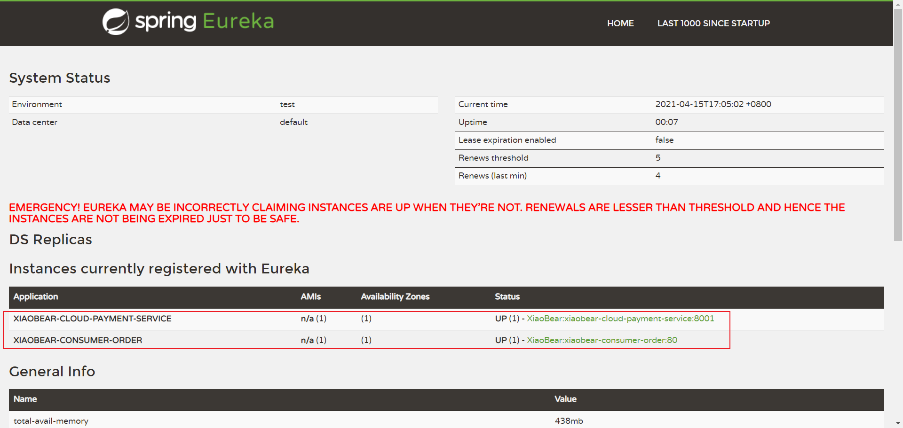

**微服务注册名说明**

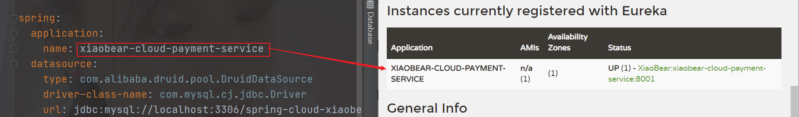


### 2、集群Eureka构建

**原理说明**  互相注册，相互守望

> 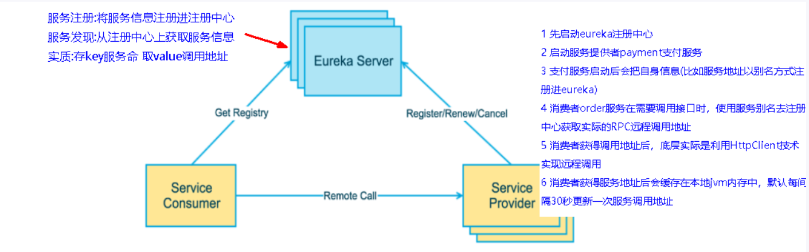

**微服务RPC远程服务调用最核心的是：**高可用

试想：如果只有一个注册中心，它挂掉了，就会导致整个服务都可不用

解决：`搭建Eureka注册中心集群，实现负载均衡+故障容错`

#### 1、创建微服务注册中心7002

参考单机注册中心7001的创建

##### 1、新建module

```
xiaobear-eureka-server-7002-5
```

##### 2、改pom.xml

```xml
    <dependencies>
        <!--eureka-server-->
        <dependency>
            <groupId>org.springframework.cloud</groupId>
            <artifactId>spring-cloud-starter-netflix-eureka-server</artifactId>
        </dependency>
        <dependency><!-- 引入自己定义的api通用包，可以使用Payment支付Entity -->
            <groupId>com.xiaobear</groupId>
            <artifactId>xiaobear-common-api-3</artifactId>
            <version>1.0-SNAPSHOT</version>
        </dependency>
        <!--boot web actuator-->
        <dependency>
            <groupId>org.springframework.boot</groupId>
            <artifactId>spring-boot-starter-web</artifactId>
        </dependency>
        <dependency>
            <groupId>org.springframework.boot</groupId>
            <artifactId>spring-boot-starter-actuator</artifactId>
        </dependency>
        <!--一般通用配置-->
        <dependency>
            <groupId>org.springframework.boot</groupId>
            <artifactId>spring-boot-devtools</artifactId>
            <scope>runtime</scope>
            <optional>true</optional>
        </dependency>
        <dependency>
            <groupId>org.projectlombok</groupId>
            <artifactId>lombok</artifactId>
        </dependency>
        <dependency>
            <groupId>org.springframework.boot</groupId>
            <artifactId>spring-boot-starter-test</artifactId>
            <scope>test</scope>
        </dependency>
        <dependency>
            <groupId>junit</groupId>
            <artifactId>junit</artifactId>
        </dependency>
    </dependencies>
```

##### 3、修改映射配置

因为有两个注册中心，倘若实例的主机都为localhost,无法区分到底是哪个注册中心，所以这时候需要我们修改C:\Windows\System32\drivers\etc\hosts文件，增加如下:

```
#######################Spring Boot Eureka学习##########
127.0.0.1 eureka7001.com
127.0.0.1 eureka7002.com
```

##### 4、写yml

- 7001的yaml修改：

> ```yaml
> server:
>   port: 7001
> 
> eureka:
>   instance:
>     hostname: eureka7001.com
>   client:
>     register-with-eureka: false #不向注册中心注册自己
>     fetch-registry: false   #自己就是注册中心
>     service-url:
>       ## 与eureka-server交互的地址查询服务和注册服务器需要这个地址
>       defaultZone: http://eureka7002.com:7002/eureka/
> ```
>
> 因为之前只有一个注册中心，以自己的地址为server，现在有7001和7002，两个服务需要相互注册，互相守望

```yaml
server:
  port: 7002

eureka:
  instance:
    hostname: eureka7002.com
  client:
    register-with-eureka: false #不向注册中心注册自己
    fetch-registry: false   #自己就是注册中心
    service-url:
      ## 与eureka-server交互的地址查询服务和注册服务器需要这个地址
      defaultZone: http://eureka7001.com:7001/eureka/
```

##### 5、主启动

```java
@SpringBootApplication
@EnableEurekaServer
public class EurekaMainIn7002Application {

    public static void main(String[] args) {
        SpringApplication.run(EurekaMainIn7002Application.class,args);
    }
}
```

##### 6、测试

http://eureka7001.com:7001/

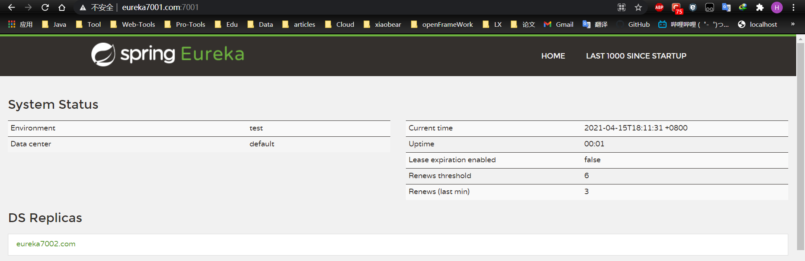

http://eureka7002.com:7002/

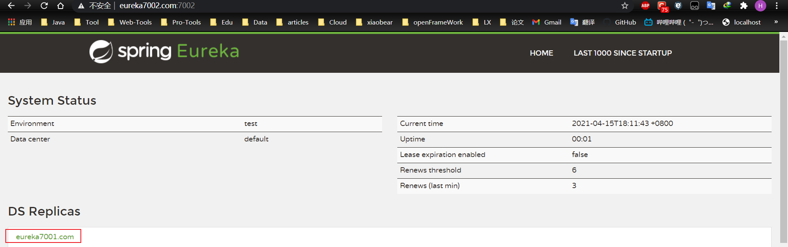

#### 2、将微服务8001和80分别发布到2台Eureka集群配置中

只需修改yml的配置文件，以前是挂在一台server上，而现在

```yaml
eureka:
  client:
    #表示是否将自己注册进EurekaServer默认为true。
    register-with-eureka: true
    #是否从EurekaServer抓取已有的注册信息，默认为true。单节点无所谓，集群必须设置为true才能配合ribbon使用负载均衡
    fetchRegistry: true
    service-url:
      defaultZone: http://eureka7001.com:7001/eureka,http://eureka7002.com:7002/eureka 
      #集群版
       ## defaultZone: http://localhost:7001/eureka 单机版
```

##### 测试

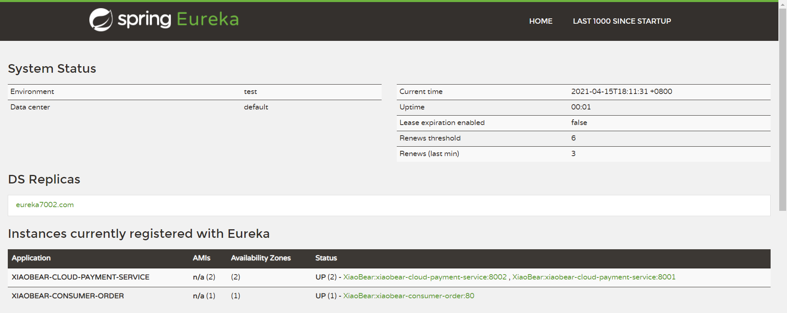

启动顺序

- 先启动EurekaServer，7001、7002服务

- 再启动服务提供者，8001

- 启动消费者80

- 测试 http://localhost/consumer/payment/get/1 OK

  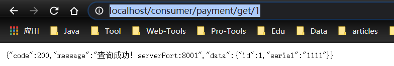

#### 3、创建服务提供者8001集群环境--8002

参考微服务提供者8001

##### 1、新建module

```
xiaobear-provider-payment8002-6
```

##### 2、写pom.xml

```xml
    <dependencies>

        <dependency>
            <groupId>org.springframework.cloud</groupId>
            <artifactId>spring-cloud-starter-netflix-eureka-client</artifactId>
        </dependency>

        <dependency><!-- 引入自己定义的api通用包，可以使用Payment支付Entity -->
            <groupId>com.xiaobear</groupId>
            <artifactId>xiaobear-common-api-3</artifactId>
            <version>1.0-SNAPSHOT</version>
        </dependency>
        <dependency>
            <groupId>org.springframework.boot</groupId>
            <artifactId>spring-boot-starter-web</artifactId>
        </dependency>
        <dependency>
            <groupId>org.springframework.boot</groupId>
            <artifactId>spring-boot-starter-actuator</artifactId>
        </dependency>
        <dependency>
            <groupId>org.mybatis.spring.boot</groupId>
            <artifactId>mybatis-spring-boot-starter</artifactId>
        </dependency>
        <dependency>
            <groupId>com.alibaba</groupId>
            <artifactId>druid-spring-boot-starter</artifactId>
            <version>1.1.10</version>
        </dependency>
        <!--mysql-connector-java-->
        <dependency>
            <groupId>mysql</groupId>
            <artifactId>mysql-connector-java</artifactId>
        </dependency>
        <!--jdbc-->
        <dependency>
            <groupId>org.springframework.boot</groupId>
            <artifactId>spring-boot-starter-jdbc</artifactId>
        </dependency>
        <dependency>
            <groupId>org.springframework.boot</groupId>
            <artifactId>spring-boot-devtools</artifactId>
            <scope>runtime</scope>
            <optional>true</optional>
        </dependency>
        <dependency>
            <groupId>org.projectlombok</groupId>
            <artifactId>lombok</artifactId>
            <optional>true</optional>
        </dependency>
        <dependency>
            <groupId>org.springframework.boot</groupId>
            <artifactId>spring-boot-starter-test</artifactId>
            <scope>test</scope>
        </dependency>
    </dependencies>
```

##### 3、写yaml

```yaml
server:
  port: 8002

spring:
  application:
    name: xiaobear-cloud-payment-service
  datasource:
    type: com.alibaba.druid.pool.DruidDataSource
    driver-class-name: com.mysql.cj.jdbc.Driver
    url: jdbc:mysql://localhost:3306/spring-cloud-xiaobear?useUnicode=true&characterEncoding=utf8&zeroDateTimeBehavior=convertToNull&useSSL=true&serverTimezone=GMT%2B8
    username: root
    password: root


eureka:
  client:
    #表示是否将自己注册进EurekaServer默认为true。
    register-with-eureka: true
    #是否从EurekaServer抓取已有的注册信息，默认为true。单节点无所谓，集群必须设置为true才能配合ribbon使用负载均衡
    fetchRegistry: true
    service-url:
      defaultZone: http://eureka7001.com:7001/eureka,http://eureka7002.com:7002/eureka  #集群版
     ## defaultZone: http://localhost:7001/eureka 单机版

mybatis:
  mapper-locations: classpath:mapper/*.xml
  type-aliases-package: com.xiaobear.entities
```

##### 4、主启动

```java
@SpringBootApplication
@EnableEurekaClient
public class Payment8002Application {

    public static void main(String[] args) {
        SpringApplication.run(Payment8002Application.class,args);
    }
}
```

##### 5、业务类

直接复制8001的业务类即可

##### 6、修改8001与8002的controller

为了区分调用的是哪个服务

```java
@RestController
@RequestMapping("payment")
@Slf4j
public class PaymentController {
    /**
     * 服务对象
     */
    @Resource
    private PaymentService paymentService;

    @Value("${server.port}")
    private String serverPort;
    /**
     * 通过主键查询单条数据
     *
     * @param id 主键
     * @return 单条数据
     */
    @GetMapping("/selectOne/{id}")
    public CommonResult selectOne(@PathVariable("id")Long id) {
        Payment payment = paymentService.queryById(id);
        if (null != payment){
            return new CommonResult(200,"查询成功！serverPort:"+serverPort,payment);
        }else {
            return new CommonResult(404,"查询失败！serverPort"+serverPort,null);
        }
    }


    @PostMapping("/insert")
    public CommonResult createPayment(@RequestBody Payment payment){
        Payment insert = paymentService.insert(payment);
        log.info("插入成功！");
        if (null != insert){
            return new CommonResult(200,"插入数据库成功！serverPort:"+serverPort,insert);
        }else {
            return new CommonResult(500,"插入数据库失败！serverPort:"+serverPort,null);
        }
    }
}
```

##### 7、测试

http://localhost/consumer/payment/get/1

这时候发现，无论怎么刷新，都是调用的8001的服务====>因为80的地址是写死的

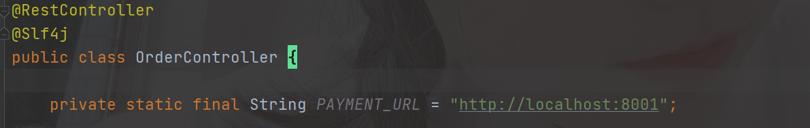

**解决**：需变成动态的地址，服务我们都已经注册到server端了，需把地址换成spring.application.name

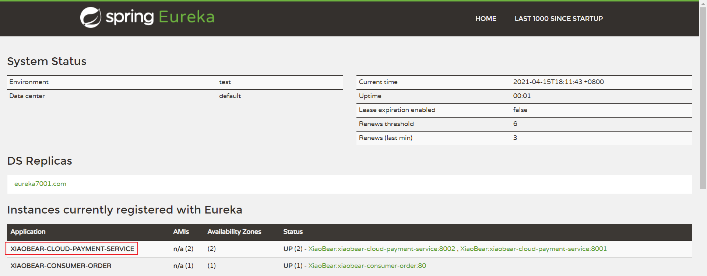

修改如下：

```java
@RestController
@Slf4j
public class OrderController {

    private static final String PAYMENT_URL = "http://localhost:8001";

    // 通过在eureka上注册过的微服务名称调用
    public static final String PAYMENT_SRV = "http://XIAOBEAR-CLOUD-PAYMENT-SERVICE";

    @Resource
    private RestTemplate restTemplate;

    @GetMapping("/consumer/payment/insert")
    public CommonResult<Payment> create(Payment payment){
        return restTemplate.postForObject(PAYMENT_SRV+"/payment/insert",payment,CommonResult.class);
    }

    @GetMapping("/consumer/payment/get/{id}")
    public CommonResult<Payment> getPayment(@PathVariable("id") Long id){
        return restTemplate.getForObject(PAYMENT_SRV + "/payment/selectOne/"+id,CommonResult.class, id);
    }
}
```

重启然后进行访问，http://localhost/consumer/payment/get/1

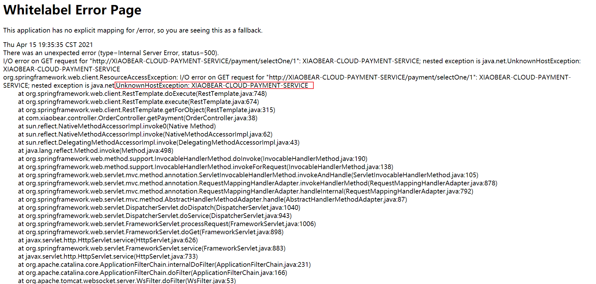

未知的服务名称，因为两个提供者不知道该调用哪一个，这时候需用到负载均衡

**使用@LoadBalanced注解赋予RestTemplate负载均衡的能力**

修改80的config

```java
@Configuration
public class ApplicationContextConfig {

    @Bean
    @LoadBalanced //使用@LoadBalanced注解赋予RestTemplate负载均衡的能力
    public RestTemplate getRestTemplate(){
        return new RestTemplate();
    }
}
```

重启再接着测试，会发现，8001与8002交替出现

### 3、Actuator微服务信息完善

#### 1、主机名称修改

存在的问题：含有电脑主机的名称

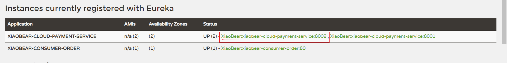

**解决：**

必须有以下依赖才可

```xml
<dependency>
    <groupId>org.springframework.boot</groupId>
    <artifactId>spring-boot-starter-actuator</artifactId>
</dependency>
```

- 修改8001以及8002的yaml文件

  ```yaml
  server:
    port: 8002
  
  spring:
    application:
      name: xiaobear-cloud-payment-service
    datasource:
      type: com.alibaba.druid.pool.DruidDataSource
      driver-class-name: com.mysql.cj.jdbc.Driver
      url: jdbc:mysql://localhost:3306/spring-cloud-xiaobear?useUnicode=true&characterEncoding=utf8&zeroDateTimeBehavior=convertToNull&useSSL=true&serverTimezone=GMT%2B8
      username: root
      password: 密码
  
  eureka:
    client:
      #表示是否将自己注册进EurekaServer默认为true。
      register-with-eureka: true
      #是否从EurekaServer抓取已有的注册信息，默认为true。单节点无所谓，集群必须设置为true才能配合ribbon使用负载均衡
      fetchRegistry: true
      service-url:
        defaultZone: http://eureka7001.com:7001/eureka,http://eureka7002.com:7002/eureka  #集群版
       ## defaultZone: http://localhost:7001/eureka 单机版
    instance:
      instance-id: payment8002
  
  mybatis:
    mapper-locations: classpath:mapper/*.xml
    type-aliases-package: com.xiaobear.entities
  ```

- 修改之后的效果

  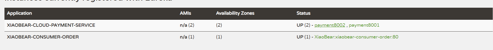

- 查询状态是否打开 http://localhost:8001/actuator/health

  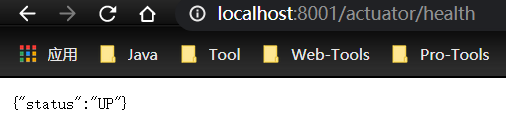

#### 2、访问信息ip提示

修改8001和8002的yaml

```yaml
eureka:
  client:
    #表示是否将自己注册进EurekaServer默认为true。
    register-with-eureka: true
    #是否从EurekaServer抓取已有的注册信息，默认为true。单节点无所谓，集群必须设置为true才能配合ribbon使用负载均衡
    fetchRegistry: true
    service-url:
      defaultZone: http://eureka7001.com:7001/eureka,http://eureka7002.com:7002/eureka  ## 集群版
      #defaultZone: http://localhost:7001/eureka  ## 单机版
  instance:
    instance-id: payment8001
    prefer-ip-address: true     #访问路径可以显示IP地址
```

- 修改之前

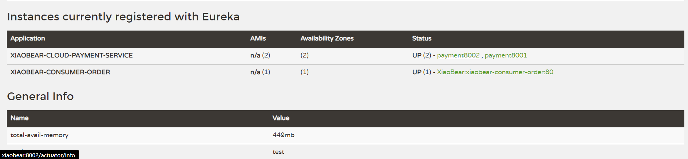

- 修改之后

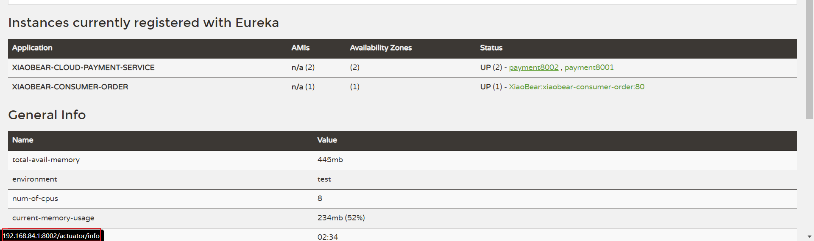


### 4、服务发现Discovery

> 对于注册进Eureka里面的微服务，可以通过服务发现来获得服务的信息

以8001Controller为例：

#### 1、自动装配

```java
@Resource
private DiscoveryClient discoveryClient;
```

#### 2、写接口

```java
   @GetMapping("/discovery")
    public Object discovery(){
        List<String> services = discoveryClient.getServices();
        for (String service : services) {
            System.out.println(service);
        }
        List<ServiceInstance> instances = discoveryClient.getInstances("XIAOBEAR-CLOUD-PAYMENT-SERVICE");
        for (ServiceInstance element : instances) {
            System.out.println(element.getServiceId() + "\t" + element.getHost() + "\t" + element.getPort() + "\t"
                    + element.getUri());
        }
        return this.discoveryClient;
    }
```

#### 3、测试

http://localhost:8001/payment/discovery

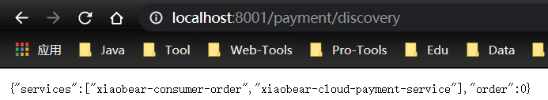

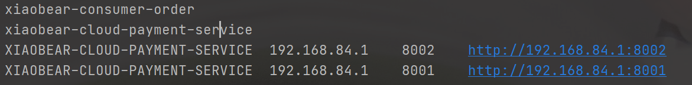


### 5、Eureka的自我保护

> 保护模式主要用于一组客户端和Eureka Server之间存在网络分区场景下的保护。一旦进入保护模式，
>
> Eureka Server将会尝试保护其服务注册表中的信息，不再删除服务注册表中的数据，也就是不会注销任何微服
>
> 务。

如果在Eureka Server的首页看到以下这段提示，则说明Eureka进入了保护模式：

```
EMERGENCY! EUREKA MAY BE INCORRECTLY CLAIMING INSTANCES ARE UP WHEN THEY'RE NOT. 
RENEWALS ARE LESSER THAN THRESHOLD AND HENCE THE INSTANCES ARE NOT BEING EXPIRED JUST TO BE SAFE 
```

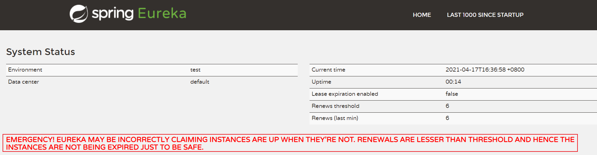

#### 1、原因

*为什么会产生Eureka自我保护机制？*

> 为了防止EurekaClient可以正常运行，但是 与 EurekaServer网络不通情况下，EurekaServer不会立刻将EurekaClient服务剔除.

***什么是自我保护模式？***

> 默认情况下，如果EurekaServer在一定时间内没有接收到某个微服务实例的心跳，EurekaServer将会注销该实例（默认90秒）。但是当网络分区故障发生(延时、卡顿、拥挤)时，微服务与EurekaServer之间无法正常通信，以上行为可能变得非常危险了——因为微服务本身其实是健康的，此时本不应该注销这个微服务。Eureka通过“自我保护模式”来解决这个问题——当EurekaServer节点在短时间内丢失过多客户端时（可能发生了网络分区故障），那么这个节点就会进入自我保护模式。

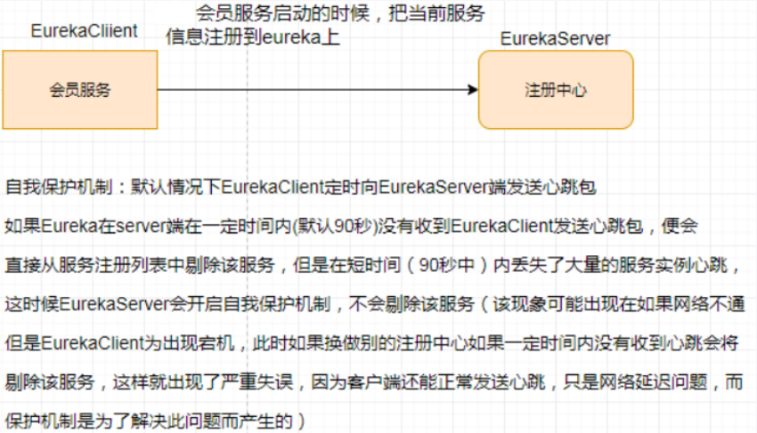

**在自我保护模式中，Eureka Server会保护服务注册表中的信息，不再注销任何服务实例。**

它的设计哲学就是宁可保留错误的服务注册信息，也不盲目注销任何可能健康的服务实例。一句话讲解：好死不如赖活着.

综上，自我保护模式是一种应对网络异常的安全保护措施。它的架构哲学是宁可同时保留所有微服务（健康的微服务和不健康的微服务都会保留）也不盲目注销任何健康的微服务。使用自我保护模式，可以让Eureka集群更加的健壮、稳定。

#### 2、如何禁止

**出厂默认，自我保护机制是开启的**

server端以7001为例，client以8001为例

##### 1、修改7001的yaml

```yaml
server:
  port: 7001

eureka:
  instance:
    hostname: eureka7001.com  #eureka服务端的实例名称
  client:
    register-with-eureka: false   #false表示不向注册中心注册自己。
    fetch-registry: false      #false表示自己端就是注册中心，我的职责就是维护服务实例，并不需要去检索服务
    service-url:
      defaultZone: http://eureka7002.com:7002/eureka/
      #设置与Eureka Server交互的地址查询服务和注册服务都需要依赖这个地址。
  server:
    #关闭自我保护机制，保证不可用服务被及时踢除
    enable-self-preservation: false
    eviction-interval-timer-in-ms: 1000
```

**关闭效果**

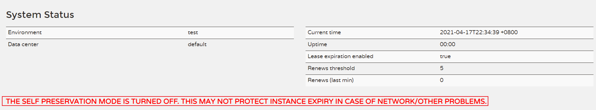

##### 2、Client8001

修改yaml文件

```yaml
eureka:
  client:
    #表示是否将自己注册进EurekaServer默认为true。
    register-with-eureka: true
    #是否从EurekaServer抓取已有的注册信息，默认为true。单节点无所谓，集群必须设置为true才能配合ribbon使用负载均衡
    fetchRegistry: true
    service-url:
      defaultZone: http://eureka7001.com:7001/eureka,http://eureka7002.com:7002/eureka  #集群版
     ## defaultZone: http://localhost:7001/eureka 单机版
  instance:
    instance-id: payment8001
    prefer-ip-address: true     #访问路径可以显示IP地址
    #Eureka服务端在收到最后一次心跳后等待时间上限，单位为秒(默认是90秒)，超时将剔除服务
    lease-expiration-duration-in-seconds: 2
    #Eureka客户端向服务端发送心跳的时间间隔，单位为秒(默认是30秒)
    lease-renewal-interval-in-seconds: 1
```

##### 3、模拟测试

1. 7001和8001都配置好
2. 先启动7001，后启动8001
3. 关闭8001，7001上立马被删除了

------

Eureka停止更新了：https://github.com/Netflix/eureka
