### 1、概述

**分布式面临的问题**

> 复杂分布式体系结构中的应用程序有数十个依赖关系，每个依赖关系在某些时候将不可避免地失败。
>
> 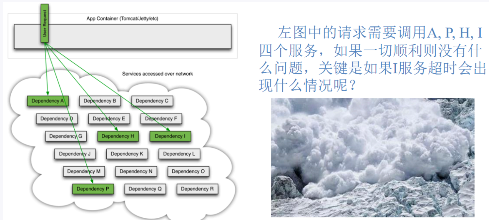
>
> **服务雪崩**
>
> ```
> 多个微服务之间调用的时候，假设微服务A调用微服务B和微服务C，微服务B和微服务C又调用其它的微服务，这就是所谓的“扇出”。如果扇出的链路上某个微服务的调用响应时间过长或者不可用，对微服务A的调用就会占用越来越多的系统资源，进而引起系统崩溃，所谓的“雪崩效应”.
> 
> 对于高流量的应用来说，单一的后端依赖可能会导致所有服务器上的所有资源都在几秒钟内饱和。比失败更糟糕的是，这些应用程序还可能导致服务之间的延迟增加，备份队列，线程和其他系统资源紧张，导致整个系统发生更多的级联故障。这些都表示需要对故障和延迟进行隔离和管理，以便单个依赖关系的失败，不能取消整个应用程序或系统。
> 
> 所以，通常当你发现一个模块下的某个实例失败后，这时候这个模块依然还会接收流量，然后这个有问题的模块还调用了其他的模块，这样就会发生级联故障，或者叫雪崩。
> ```

#### 1、Hystrix

> **Hystrix是一个用于处理分布式系统的==延迟和容错==的开源库，在分布式系统里，许多依赖不可避免的会调用失败，比如超时、异常等，Hystrix能够保证在一个依赖出问题的情况下，不会导致整体服务失败，避免级联故障，以提高分布式系统的弹性。**
>
> **“断路器”本身是一种开关装置，当某个服务单元发生故障之后，通过断路器的故障监控（类似熔断保险丝），向调用方返回一个符合预期的、可处理的备选响应（FallBack），而不是长时间的等待或者抛出调用方无法处理的异常，这样就保证了服务调用方的线程不会被长时间、不必要地占用，从而避免了故障在分布式系统中的蔓延，乃至雪崩。**

Hystrix是由Netflix开源的一个延迟和容错库，用于隔离访问远程系统、服务或者第三方库，防止级联失
败，从而提升系统的可用性与容错性。Hystrix主要通过以下几点实现延迟和容错。

- ==包裹请求==：使用HystrixCommand包裹对依赖的调用逻辑，每个命令在独立线程中执行。这使用
  了设计模式中的“命令模式”。
- ==跳闸机制==：当某服务的错误率超过一定的阈值时，Hystrix可以自动或手动跳闸，停止请求该服务
  一段时间。
- ==资源隔离==：Hystrix为每个依赖都维护了一个小型的线程池（或者信号量）。如果该线程池已满，
  发往该依赖的请求就被立即拒绝，而不是排队等待，从而加速失败判定。
- ==监控==：Hystrix可以近乎实时地监控运行指标和配置的变化，例如成功、失败、超时、以及被拒绝
  的请求等。
- ==回退机制==：当请求失败、超时、被拒绝，或当断路器打开时，执行回退逻辑。回退逻辑由开发人员
  自行提供，例如返回一个缺省值。
- ==自我修复==：断路器打开一段时间后，会自动进入“半开”状态。

#### 2、作用

- 服务降级
- 服务熔断
- 接近实时的监控


#### 3、官网

如何使用：https://github.com/Netflix/Hystrix/wiki/How-To-Use

官网：https://github.com/Netflix/Hystrix

==但现在已经停止更新了，不在发布新版本，被动修复bug==

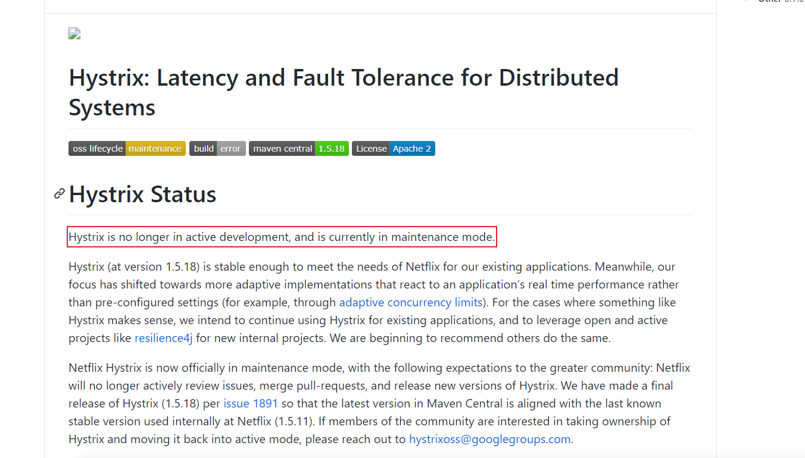

### 2、服务容错的核心知识

#### 1、雪崩效应

> 在微服务架构中，一个请求需要调用多个服务是非常常见的。如客户端访问A服务，而A服务需要调用B
> 服务，B服务需要调用C服务，由于网络原因或者自身的原因，如果B服务或者C服务不能及时响应，A服
> 务将处于阻塞状态，直到B服务C服务响应。此时若有大量的请求涌入，容器的线程资源会被消耗完毕，
> 导致服务瘫痪。服务与服务之间的依赖性，故障会传播，造成连锁反应，会对整个微服务系统造成灾难
> 性的严重后果，这就是服务故障的“雪崩”效应。

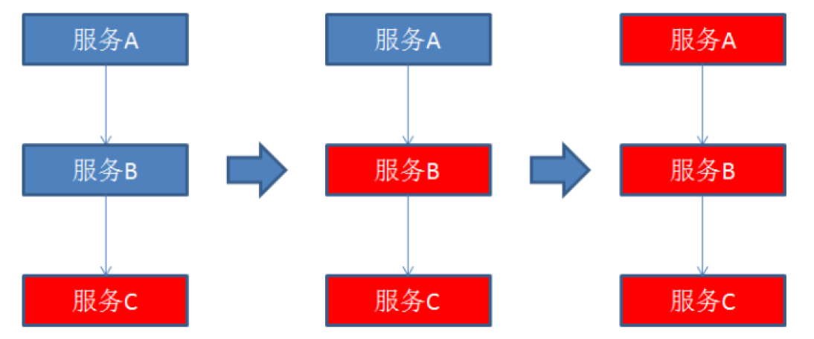

> 雪崩是系统中的蝴蝶效应导致其发生的原因多种多样，有不合理的容量设计，或者是高并发下某一个方
> 法响应变慢，亦或是某台机器的资源耗尽。从源头上我们无法完全杜绝雪崩源头的发生，但是雪崩的根
> 本原因来源于服务之间的强依赖，所以我们可以提前评估，做好熔断，隔离，限流。

#### 2、服务降级

> 熔断这一概念来源于电子工程中的断路器（Circuit Breaker）。在互联网系统中，当下游服务因访问压
> 力过大而响应变慢或失败，上游服务为了保护系统整体的可用性，可以暂时切断对下游服务的调用。这
> 种牺牲局部，保全整体的措施就叫做熔断。
>
> 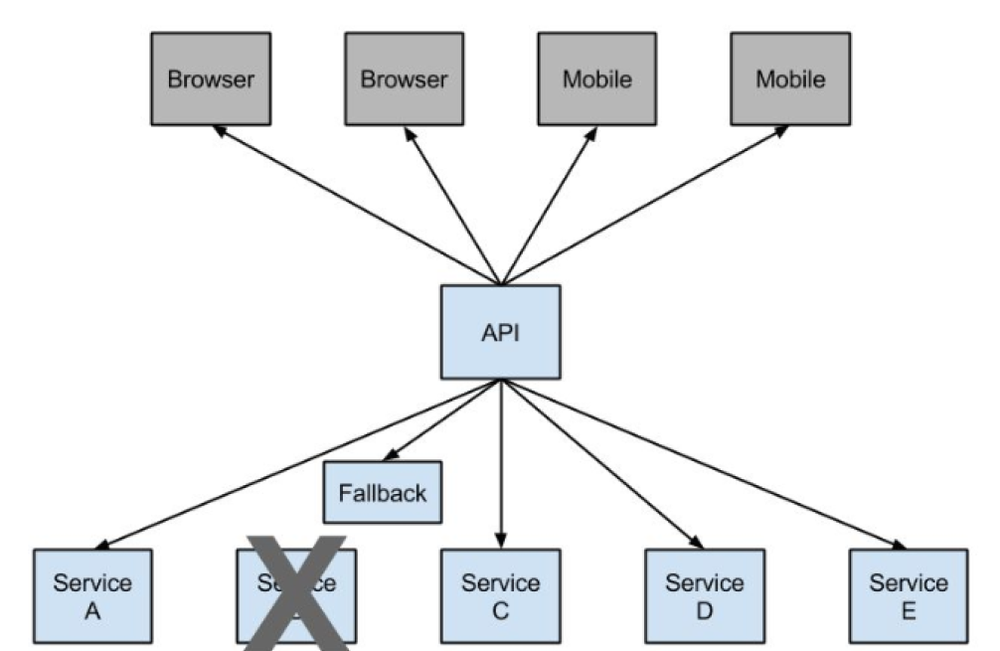
>
> 服务器忙，请稍后重试，不让客户端等待并立即返回一个友好提示，fallback

所谓降级，就是当某个服务熔断之后，服务器将不再被调用，此时客户端可以自己准备一个本地的
fallback回调，返回一个缺省值。 也可以理解为兜底

**会发生降级的情况**

- 程序运行异常
- 超时
- 服务熔断触发服务降级
- 线程池、信号量打满也会导致服务降级

#### 3、服务熔断

> 类比保险丝达到最大的服务访问后，直接拒绝访问，拉闸限电，然后调用服务降级的方法并返回友好提示

就相当于保险丝，服务的降级-----》进而熔断-----》恢复调用链路

#### 4、服务限流

> 限流可以认为服务降级的一种，限流就是限制系统的输入和输出流量已达到保护系统的目的。一般来说
> 系统的吞吐量是可以被测算的，为了保证系统的稳固运行，一旦达到的需要限制的阈值，就需要限制流
> 量并采取少量措施以完成限制流量的目的。比方：推迟解决，拒绝解决，或者者部分拒绝解决等等。
>
> 秒杀高并发等操作，严禁一窝蜂的一样拥挤，排队有序进行，一秒钟N个，有序进行


### 3、Hystrix案例

#### 1、构建

##### 1、新建module

```
xiaobear-provider-hystrix-payment8001-12
```

##### 2、改pom.xml

```xml
<dependencies>
        <dependency>
            <groupId>org.springframework.cloud</groupId>
            <artifactId>spring-cloud-starter-netflix-hystrix</artifactId>
        </dependency>
        <!--eureka client-->
        <dependency>
            <groupId>org.springframework.cloud</groupId>
            <artifactId>spring-cloud-starter-netflix-eureka-client</artifactId>
        </dependency>

        <dependency><!-- 引入自己定义的api通用包，可以使用Payment支付Entity -->
            <groupId>com.xiaobear</groupId>
            <artifactId>xiaobear-common-api-3</artifactId>
            <version>1.0-SNAPSHOT</version>
        </dependency>
        <dependency>
            <groupId>org.springframework.boot</groupId>
            <artifactId>spring-boot-starter-web</artifactId>
        </dependency>
        <dependency>
            <groupId>org.springframework.boot</groupId>
            <artifactId>spring-boot-starter-actuator</artifactId>
        </dependency>
        <dependency>
            <groupId>org.mybatis.spring.boot</groupId>
            <artifactId>mybatis-spring-boot-starter</artifactId>
        </dependency>
        <dependency>
            <groupId>org.springframework.boot</groupId>
            <artifactId>spring-boot-devtools</artifactId>
            <scope>runtime</scope>
            <optional>true</optional>
        </dependency>
        <dependency>
            <groupId>org.projectlombok</groupId>
            <artifactId>lombok</artifactId>
            <optional>true</optional>
        </dependency>
        <dependency>
            <groupId>org.springframework.boot</groupId>
            <artifactId>spring-boot-starter-test</artifactId>
            <scope>test</scope>
        </dependency>
    </dependencies>
```

##### 3、写yml

```yaml
server:
  port: 8001

spring:
  application:
    name: cloud-provider-hystrix-payment

eureka:
  client:
    register-with-eureka: true
    fetch-registry: true
    service-url:
      #defaultZone: http://eureka7001.com:7001/eureka,http://eureka7002.com:7002/eureka
      defaultZone: http://eureka7001.com:7001/eureka
```

##### 4、主启动类

```java
@SpringBootApplication(exclude={DataSourceAutoConfiguration.class, HibernateJpaAutoConfiguration.class})
@EnableEurekaClient //本服务启动后会自动注册进eureka服务中
public class HystrixApplication {

    public static void main(String[] args) {
        SpringApplication.run(HystrixApplication.class,args);
    }
}
```

##### 5、业务类

- service

  ```java
  @Service
  public class PaymentService {
  
      /**
       * 正常访问，一切OK
       * @param id
       * @return
       */
      public String paymentInfo_OK(Integer id)
      {
          return "线程池:"+Thread.currentThread().getName()+"paymentInfo_OK,id: "+id+"\t"+"O(∩_∩)O";
      }
  
  
      /**
       * 超时访问，演示降级
       * @param id
       * @return
       */
      public String paymentInfo_TimeOut(Integer id)
      {
          try { TimeUnit.SECONDS.sleep(3); } catch (InterruptedException e) { e.printStackTrace(); }
          return "线程池:"+Thread.currentThread().getName()+"paymentInfo_TimeOut,id: "+id+"\t"+"O(∩_∩)O，耗费3秒";
      }
  }
  
  ```

- controller

  ```java
  @RestController
  @Slf4j
  public class HystrixController {
  
      @Resource
      private PaymentService paymentService;
  
      @Value("${server.port}")
      private String serverPort;
  
      @GetMapping("/payment/hystrix/ok/{id}")
      public String paymentInfo_OK(@PathVariable("id") Integer id)
      {
          String result = paymentService.paymentInfo_OK(id);
          log.info("****result: "+result);
          return result;
      }
  
      @GetMapping("/payment/hystrix/timeout/{id}")
      public String paymentInfo_TimeOut(@PathVariable("id") Integer id) throws InterruptedException
      {
          String result = paymentService.paymentInfo_TimeOut(id);
          log.info("****result: "+result);
          return result;
      }
  }
  ```

##### 6、测试

**启动顺序：**

1. 先启动Eureka7001
2. 再启动启动类
3. 测试
    - 正常访问的：http://localhost:8001/payment/hystrix/ok/1
    - 调用耗时5秒的：http://localhost:8001/payment/hystrix/timeout/1


#### 2、高并发测试

上述在非高并发的情况下还能勉强满足，但是在高并发的情况下就会延迟。

##### 1、Jmeter压测

安装请参考：https://bbs.huaweicloud.com/blogs/222391

###### 1、开启Jmeter

双击即可

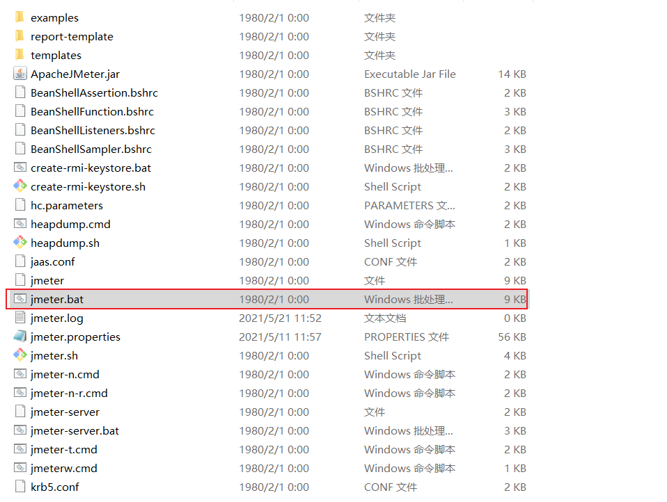

1. 创建线程组

   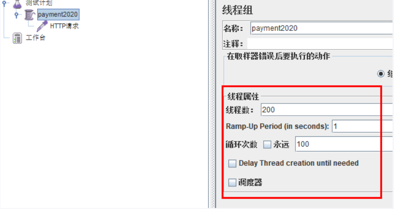

2. 添加HTTP默认请求

   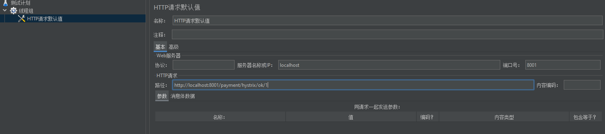

3. 启动执行


发现之前正常的也在转圈，访问延迟了，这是因为：

> tomcat的默认的工作线程数被打满 了，没有多余的线程来分解压力和处理。

**总结：**

上述服务还是用于自测，倘若此时外部的80也来访问，那么消费者只能等着自测先访问完，最终导致80消费者不满意，服务端8001被拖死了


##### 2、新建消费者80

###### 1、新建module

```
xiaobear-consumer-openFeign-hystrix-order80-13
```

###### 2、改pom.xml

```xml
 <dependencies>
        <!--openfeign-->
        <dependency>
            <groupId>org.springframework.cloud</groupId>
            <artifactId>spring-cloud-starter-openfeign</artifactId>
        </dependency>
        <!--hystrix-->
        <dependency>
            <groupId>org.springframework.cloud</groupId>
            <artifactId>spring-cloud-starter-netflix-hystrix</artifactId>
        </dependency>
        <!--eureka client-->
        <dependency>
            <groupId>org.springframework.cloud</groupId>
            <artifactId>spring-cloud-starter-netflix-eureka-client</artifactId>
        </dependency>
        <!-- 引入自己定义的api通用包，可以使用Payment支付Entity -->
        <dependency>
            <groupId>com.xiaobear</groupId>
            <artifactId>xiaobear-common-api-3</artifactId>
            <version>1.0-SNAPSHOT</version>
        </dependency>
        <!--web-->
        <dependency>
            <groupId>org.springframework.boot</groupId>
            <artifactId>spring-boot-starter-web</artifactId>
        </dependency>
        <dependency>
            <groupId>org.springframework.boot</groupId>
            <artifactId>spring-boot-starter-actuator</artifactId>
        </dependency>
        <!--一般基础通用配置-->
        <dependency>
            <groupId>org.springframework.boot</groupId>
            <artifactId>spring-boot-devtools</artifactId>
            <scope>runtime</scope>
            <optional>true</optional>
        </dependency>
        <dependency>
            <groupId>org.projectlombok</groupId>
            <artifactId>lombok</artifactId>
            <optional>true</optional>
        </dependency>
        <dependency>
            <groupId>org.springframework.boot</groupId>
            <artifactId>spring-boot-starter-test</artifactId>
            <scope>test</scope>
        </dependency>
    </dependencies>
```

###### 3、写yml

```yaml
server:
  port: 80

eureka:
  client:
    register-with-eureka: false
    service-url:
      defaultZone: http://eureka7001.com:7001/eureka/
```

###### 4、主启动类

```java
@SpringBootApplication
@EnableFeignClients
public class OrderHystrixMain80 {

    public static void main(String[] args) {
        SpringApplication.run(OrderHystrixMain80.class,args);
    }
}
```

###### 5、业务类

- service

  ```java
  @Component
  @FeignClient(value = "CLOUD-PROVIDER-HYSTRIX-PAYMENT")
  public interface PaymentHystrixService {
  
      @GetMapping("/payment/hystrix/ok/{id}")
      String paymentInfoOK(@PathVariable("id") Integer id);
  
      @GetMapping("/payment/hystrix/timeout/{id}")
      String paymentInfoTimeOut(@PathVariable("id") Integer id);
  }
  ```

- controller

  ```java
  @RestController
  public class OrderHystrixController {
      @Resource
      private PaymentHystrixService paymentHystrixService;
  
      @GetMapping("/consumer/payment/hystrix/ok/{id}")
      public String paymentInfo_OK(@PathVariable("id") Integer id)
      {
          String result = paymentHystrixService.paymentInfoOK(id);
          return result;
      }
  
      @GetMapping("/consumer/payment/hystrix/timeout/{id}")
      public String paymentInfo_TimeOut(@PathVariable("id") Integer id)
      {
          String result = paymentHystrixService.paymentInfoTimeOut(id);
          return result;
      }
  }
  ```


###### 6、测试

正常测试：http://localhost/consumer/payment/hystrix/ok/1

高并发压测8001，发现80访问的时候要么就是超时错误，要么就是等待

**故障出现以及导致的原因：**

- 8001的其他服务被困死，因tomcat的线程池里面的工作线程已经被挤占了
- 80此时调用8001，客户端响应缓慢


正因为有了上述的故障，才有了服务的降级、限流等技术

------

**如何解决？**

1. 超时导致服务器变慢----->超时不再等待
2. 出错（宕机或程序出错）----------->出错要有兜底，也就是最终的解决方法


#### 3、服务降级

降级的配置：`@HystrixCommand`


##### 1、8001从自身找问题

设置自身调用服务超时时间的峰值，在峰值内可以正常运行，超过了需要兜底的方法进行处理，做服务降级fallback

###### 1、修改8001service

> 一旦调用的方法抛出错误信息后，会自动调用`@HystrixCommand`标注好的`fallbackMethod`调用类中的指定方法

```java
@Service
public class PaymentService {

    /**
     * 正常访问，一切OK
     * @param id
     * @return
     */
    public String paymentInfo_OK(Integer id)
    {
        return "线程池:"+Thread.currentThread().getName()+"paymentInfo_OK,id: "+id+"\t"+"O(∩_∩)O";
    }


    /**
     * 超时访问，演示降级
     * @param id
     * @return
     */                                                                                   /**自身超时时间3秒钟 */
    @HystrixCommand(fallbackMethod = "paymentInfo_TimeOutHandler",commandProperties = {@HystrixProperty(name="execution.isolation.thread.timeoutInMilliseconds",value="3000")})
    public String paymentInfo_TimeOut(Integer id)
    {
        try { TimeUnit.SECONDS.sleep(5); } catch (InterruptedException e) { e.printStackTrace(); }
        return "线程池:"+Thread.currentThread().getName()+"paymentInfo_TimeOut,id: "+id+"\t"+"O(∩_∩)O，耗费3秒";
    }

    /**
     * 如果paymentInfo_OK超时或者出错，即会调用该方法
     * @param id
     * @return
     */
    public String paymentInfo_TimeOutHandler(Integer id){
        return "/(ㄒoㄒ)/调用支付接口超时或异常：\t"+ "\t当前线程池名字" + Thread.currentThread().getName();
    }
}

```

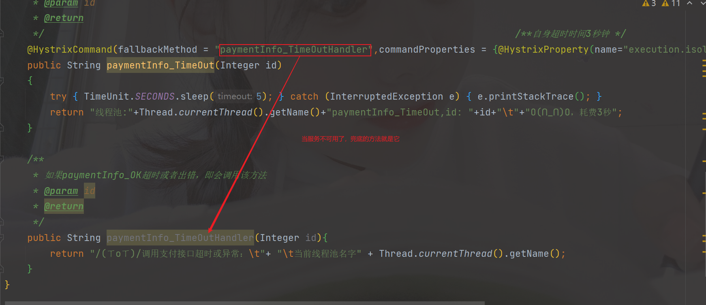


###### 2、主启动类激活

添加新注解`@EnableCircuitBreaker`

```java
@SpringBootApplication(exclude={DataSourceAutoConfiguration.class, HibernateJpaAutoConfiguration.class})
@EnableEurekaClient //本服务启动后会自动注册进eureka服务中
@EnableCircuitBreaker
public class HystrixApplication {

    public static void main(String[] args) {
        SpringApplication.run(HystrixApplication.class,args);
    }
}
```

##### 2、80fallback

80订单微服务，也可以更好的保护自己，自己也可以降级处理

**注意：**我们自己配置热部署对`java`代码改动明显，但对`@HystrixCommand`建议重启微服务

###### 1、修改yaml

```yaml
server:
  port: 80

eureka:
  client:
    register-with-eureka: false
    service-url:
      defaultZone: http://eureka7001.com:7001/eureka/
## 用于服务降级 在注解@FeignClient中添加fallbackFactory属性值
feign:
  hystrix:
    enabled: true
```

###### 2、主启动类

```java
@SpringBootApplication
@EnableFeignClients
@EnableHystrix
public class OrderHystrixMain80 {

    public static void main(String[] args) {
        SpringApplication.run(OrderHystrixMain80.class,args);
    }
}
```

###### 3、业务类

- controller

  ```java
  @RestController
  public class OrderHystrixController {
      @Resource
      private PaymentHystrixService paymentHystrixService;
  
      @GetMapping("/consumer/payment/hystrix/ok/{id}")
      public String paymentInfo_OK(@PathVariable("id") Integer id)
      {
          String result = paymentHystrixService.paymentInfoOK(id);
          return result;
      }
  
      @GetMapping("/consumer/payment/hystrix/timeout/{id}")
      @HystrixCommand(fallbackMethod = "paymentTimeOutFallbackMethod",commandProperties = {
              @HystrixProperty(name="execution.isolation.thread.timeoutInMilliseconds",value="1500")
      })
      public String paymentInfo_TimeOut(@PathVariable("id") Integer id)
      {
          String result = paymentHystrixService.paymentInfoTimeOut(id);
          return result;
      }
  
      public String paymentTimeOutFallbackMethod(@PathVariable("id") Integer id)
      {
          return "我是消费者80,对方支付系统繁忙请10秒钟后再试或者自己运行出错请检查自己,o(╥﹏╥)o";
      }
  }
  
  ```


**目前存在的问题：**

- 每一个业务方法都有一个兜底的方法，代码膨胀

**解决**

- 统一和自定义的分开


##### 3、解决问题

> 本次服务的降级处理是在客户端80实现的，与服务端8001没有关系，只需要`feign`客户端定义的接口添加一个服务降级处理实现类即可实现解耦

以后我们时常需要面对的：

- 运行
- 宕机
- 超时


###### 1、修改xiaobear-consumer-openFeign-hystrix-order80-13

该模块已经有了`PaymentHystrixService`接口，我们需要重新建一个`PaymentFallBackHystrixService`实现该接口，统一为该接口里面的方法做异常处理

```java
@Component
public class PaymentFallBackHystrixService implements PaymentHystrixService{
    @Override
    public String paymentInfoOK(Integer id) {
        return "服务调用失败，提示来自：paymentInfoOK";
    }

    @Override
    public String paymentInfoTimeOut(Integer id) {
        return "服务调用失败，提示来自：paymentInfoTimeOut";
    }
}
```

- `PaymentHystrixService`

  ```java
  @Component
  @FeignClient(value = "CLOUD-PROVIDER-HYSTRIX-PAYMENT",fallback = PaymentFallBackHystrixService.class)
  public interface PaymentHystrixService {
  
      @GetMapping("/payment/hystrix/ok/{id}")
      String paymentInfoOK(@PathVariable("id") Integer id);
  
      @GetMapping("/payment/hystrix/timeout/{id}")
      String paymentInfoTimeOut(@PathVariable("id") Integer id);
  
  }
  ```


###### 2、测试

启动顺序：

- 先启动7001
- 再启动8001

正常测试：http://localhost/consumer/payment/hystrix/ok/1

此时我们故意关闭8001，服务器已经宕机了，但是我们统一做了服务降级处理，让客户端在服务器不可用时也会获得提示信息而不会挂起耗死服务器


#### 4、服务熔断

> 熔断机制是应对雪崩效应的一种微服务链路保护机制。当扇出链路的某个微服务出错不可用或者响应时间太长时，会进行服务的降级，进而熔断该节点微服务的调用，快速返回错误的响应信息。
>
> **当检测到该节点微服务调用响应正常后，恢复调用链路。**
>
> 在Spring Cloud框架里，熔断机制通过Hystrix实现。Hystrix会监控微服务间调用的状况，
>
> 当失败的调用到一定阈值，缺省是5秒内20次调用失败，就会启动熔断机制。熔断机制的注解是@HystrixCommand。

简单来说，就是==家里的保险丝==


###### 1、修改xiaobear-provider-hystrix-payment8001-12

####### 1、修改service，添加两个方法

```java
/**
     * 服务熔断
     * @param id
     * @return
     */
    @HystrixCommand(fallbackMethod = "paymentCircuitBreaker_fallback",commandProperties = {
            @HystrixProperty(name = "circuitBreaker.enabled",value = "true"),
            @HystrixProperty(name = "circuitBreaker.requestVolumeThreshold",value = "10"),
            @HystrixProperty(name = "circuitBreaker.sleepWindowInMilliseconds",value = "10000"),
            @HystrixProperty(name = "circuitBreaker.errorThresholdPercentage",value = "60"),
    })
    public String paymentCircuitBreaker(@PathVariable("id") Integer id)
    {
        if(id < 0)
        {
            throw new RuntimeException("******id 不能负数");
        }
        String serialNumber = IdUtil.simpleUUID();

        return Thread.currentThread().getName()+"\t"+"调用成功，流水号: " + serialNumber;
    }
    public String paymentCircuitBreaker_fallback(@PathVariable("id") Integer id)
    {
        return "id 不能负数，请稍后再试，/(ㄒoㄒ)/~~   id: " +id;
    }
```

####### 2、在controller调用service方法

```java
@GetMapping("/payment/circuit/{id}")
public String paymentCircuitBreaker(@PathVariable("id") Integer id)
{
    String result = paymentService.paymentCircuitBreaker(id);
    log.info("****result: "+result);
    return result;
}
```

####### 3、测试

http://localhost:8001/payment/circuit/12

一次正确一次错误的测试

多次错误，然后慢慢正确，刚开始不满足条件，就算是正确的地址也不能进行


###### 2、总结

####### 1、熔断类型

- 熔断打开

  > 请求不在调用当前服务，内部设置时钟一般为MTTR（平均故障处理时间），当打开时长达到所设时钟则进入半熔断状态

- 熔断关闭

  > 熔断关闭不会对服务进行熔断

- 熔断半开

  > 部分请求根据规则调用当前服务，如果请求成功而且符合规则，认为当前服务恢复正常，关闭熔断

####### 2、断路器什么时候开始起作用

涉及到断路器的三个重要参数：快照时间窗、请求总数阀值、错误百分比阀值。

1：快照时间窗：断路器确定是否打开需要统计一些请求和错误数据，而统计的时间范围就是快照时间窗，默认为最近的10秒。

2：请求总数阀值：在快照时间窗内，必须满足请求总数阀值才有资格熔断。默认为20，意味着在10秒内，如果该hystrix命令的调用次数不足20次，即使所有的请求都超时或其他原因失败，断路器都不会打开。

3：错误百分比阀值：当请求总数在快照时间窗内超过了阀值，比如发生了30次调用，如果在这30次调用中，有15次发生了超时异常，也就是超过50%的错误百分比，在默认设定50%阀值情况下，这时候就会将断路器打开。


####### 3、断路器开启或关闭的条件

- 当满足一定的阈值的时候（默认10s内超过20个请求）
- 当失败率达到一定的时候（默认10s超过50%的请求失败）
- 以上两个，断路器则会开启
- 开启后，所有的请求都不会进行转发
- 一段时间之后（默认5秒），这个时候断路器是半开状态，会让其中一个请求进行转发，如果成功，断路器则会关闭，若失败，则会继续开启


####### 4、断路器开启之后

再有请求调用的时候，将不会调用主逻辑，而是直接调用降级fallback。通过断路器，实现了自动地发现错误并将降级逻辑切换为主逻辑，减少响应延迟的效果。

**原来的主逻辑要如何恢复呢？**

> 对于这一问题，hystrix也为我们实现了自动恢复功能
>
> 当断路器打开，对主逻辑进行熔断之后，hystrix会启动一个休眠时间窗，在这个时间窗内，降级逻辑是临时的成为主逻辑，
>
> 当休眠时间窗到期，断路器将进入半开状态，释放一次请求到原来的主逻辑上，如果此次请求正常返回，那么断路器将继续闭合，
>
> 主逻辑恢复，如果这次请求依然有问题，断路器继续进入打开状态，休眠时间窗重新计时。


####### 5、HystrixProperty相关配置

```java
@HystrixCommand(fallbackMethod = "str_fallbackMethod",
        groupKey = "strGroupCommand",
        commandKey = "strCommand",
        threadPoolKey = "strThreadPool",

        commandProperties = {
                // 设置隔离策略，THREAD 表示线程池 SEMAPHORE：信号池隔离
                @HystrixProperty(name = "execution.isolation.strategy", value = "THREAD"),
                // 当隔离策略选择信号池隔离的时候，用来设置信号池的大小（最大并发数）
                @HystrixProperty(name = "execution.isolation.semaphore.maxConcurrentRequests", value = "10"),
                // 配置命令执行的超时时间
                @HystrixProperty(name = "execution.isolation.thread.timeoutinMilliseconds", value = "10"),
                // 是否启用超时时间
                @HystrixProperty(name = "execution.timeout.enabled", value = "true"),
                // 执行超时的时候是否中断
                @HystrixProperty(name = "execution.isolation.thread.interruptOnTimeout", value = "true"),
                // 执行被取消的时候是否中断
                @HystrixProperty(name = "execution.isolation.thread.interruptOnCancel", value = "true"),
                // 允许回调方法执行的最大并发数
                @HystrixProperty(name = "fallback.isolation.semaphore.maxConcurrentRequests", value = "10"),
                // 服务降级是否启用，是否执行回调函数
                @HystrixProperty(name = "fallback.enabled", value = "true"),
                // 是否启用断路器
                @HystrixProperty(name = "circuitBreaker.enabled", value = "true"),
                // 该属性用来设置在滚动时间窗中，断路器熔断的最小请求数。例如，默认该值为 20 的时候，
                // 如果滚动时间窗（默认10秒）内仅收到了19个请求， 即使这19个请求都失败了，断路器也不会打开。
                @HystrixProperty(name = "circuitBreaker.requestVolumeThreshold", value = "20"),
                // 该属性用来设置在滚动时间窗中，表示在滚动时间窗中，在请求数量超过
                // circuitBreaker.requestVolumeThreshold 的情况下，如果错误请求数的百分比超过50,
                // 就把断路器设置为 "打开" 状态，否则就设置为 "关闭" 状态。
                @HystrixProperty(name = "circuitBreaker.errorThresholdPercentage", value = "50"),
                // 该属性用来设置当断路器打开之后的休眠时间窗。 休眠时间窗结束之后，
                // 会将断路器置为 "半开" 状态，尝试熔断的请求命令，如果依然失败就将断路器继续设置为 "打开" 状态，
                // 如果成功就设置为 "关闭" 状态。
                @HystrixProperty(name = "circuitBreaker.sleepWindowinMilliseconds", value = "5000"),
                // 断路器强制打开
                @HystrixProperty(name = "circuitBreaker.forceOpen", value = "false"),
                // 断路器强制关闭
                @HystrixProperty(name = "circuitBreaker.forceClosed", value = "false"),
                // 滚动时间窗设置，该时间用于断路器判断健康度时需要收集信息的持续时间
                @HystrixProperty(name = "metrics.rollingStats.timeinMilliseconds", value = "10000"),
                // 该属性用来设置滚动时间窗统计指标信息时划分"桶"的数量，断路器在收集指标信息的时候会根据
                // 设置的时间窗长度拆分成多个 "桶" 来累计各度量值，每个"桶"记录了一段时间内的采集指标。
                // 比如 10 秒内拆分成 10 个"桶"收集这样，所以 timeinMilliseconds 必须能被 numBuckets 整除。否则会抛异常
                @HystrixProperty(name = "metrics.rollingStats.numBuckets", value = "10"),
                // 该属性用来设置对命令执行的延迟是否使用百分位数来跟踪和计算。如果设置为 false, 那么所有的概要统计都将返回 -1。
                @HystrixProperty(name = "metrics.rollingPercentile.enabled", value = "false"),
                // 该属性用来设置百分位统计的滚动窗口的持续时间，单位为毫秒。
                @HystrixProperty(name = "metrics.rollingPercentile.timeInMilliseconds", value = "60000"),
                // 该属性用来设置百分位统计滚动窗口中使用 “ 桶 ”的数量。
                @HystrixProperty(name = "metrics.rollingPercentile.numBuckets", value = "60000"),
                // 该属性用来设置在执行过程中每个 “桶” 中保留的最大执行次数。如果在滚动时间窗内发生超过该设定值的执行次数，
                // 就从最初的位置开始重写。例如，将该值设置为100, 滚动窗口为10秒，若在10秒内一个 “桶 ”中发生了500次执行，
                // 那么该 “桶” 中只保留 最后的100次执行的统计。另外，增加该值的大小将会增加内存量的消耗，并增加排序百分位数所需的计算时间。
                @HystrixProperty(name = "metrics.rollingPercentile.bucketSize", value = "100"),
                // 该属性用来设置采集影响断路器状态的健康快照（请求的成功、 错误百分比）的间隔等待时间。
                @HystrixProperty(name = "metrics.healthSnapshot.intervalinMilliseconds", value = "500"),
                // 是否开启请求缓存
                @HystrixProperty(name = "requestCache.enabled", value = "true"),
                // HystrixCommand的执行和事件是否打印日志到 HystrixRequestLog 中
                @HystrixProperty(name = "requestLog.enabled", value = "true"),
        },
        threadPoolProperties = {
                // 该参数用来设置执行命令线程池的核心线程数，该值也就是命令执行的最大并发量
                @HystrixProperty(name = "coreSize", value = "10"),
                // 该参数用来设置线程池的最大队列大小。当设置为 -1 时，线程池将使用 SynchronousQueue 实现的队列，
                // 否则将使用 LinkedBlockingQueue 实现的队列。
                @HystrixProperty(name = "maxQueueSize", value = "-1"),
                // 该参数用来为队列设置拒绝阈值。 通过该参数， 即使队列没有达到最大值也能拒绝请求。
                // 该参数主要是对 LinkedBlockingQueue 队列的补充,因为 LinkedBlockingQueue
                // 队列不能动态修改它的对象大小，而通过该属性就可以调整拒绝请求的队列大小了。
                @HystrixProperty(name = "queueSizeRejectionThreshold", value = "5"),
        }
)public String strConsumer() {
    return "hello 2020";
}
public String str_fallbackMethod()
{
    return "*****fall back str_fallbackMethod";
}
```

### 4、Hystrix工作流程


| 序号  | 操作                                                         |
| ----- | ------------------------------------------------------------ |
| **1** | 创建 HystrixCommand（用在依赖的服务返回单个操作结果的时候） 或 HystrixObserableCommand（用在依赖的服务返回多个操作结果的时候） 对象。 |
| 2     | 命令执行。其中 HystrixComand 实现了下面前两种执行方式；而 HystrixObservableCommand 实现了后两种执行方式：execute()：同步执行，从依赖的服务返回一个单一的结果对象， 或是在发生错误的时候抛出异常。queue()：异步执行， 直接返回 一个Future对象， 其中包含了服务执行结束时要返回的单一结果对象。observe()：返回 Observable 对象，它代表了操作的多个结果，它是一个 Hot Obserable（不论 "事件源" 是否有 "订阅者"，都会在创建后对事件进行发布，所以对于 Hot Observable 的每一个 "订阅者" 都有可能是从 "事件源" 的中途开始的，并可能只是看到了整个操作的局部过程）。toObservable()： 同样会返回 Observable 对象，也代表了操作的多个结果，但它返回的是一个Cold Observable（没有 "订阅者" 的时候并不会发布事件，而是进行等待，直到有 "订阅者" 之后才发布事件，所以对于 Cold Observable 的订阅者，它可以保证从一开始看到整个操作的全部过程）。 |
| 3     | 若当前命令的请求缓存功能是被启用的， 并且该命令缓存命中， 那么缓存的结果会立即以 Observable 对象的形式 返回。 |
| 4     | 检查断路器是否为打开状态。如果断路器是打开的，那么Hystrix不会执行命令，而是转接到 fallback 处理逻辑（第 8 步）；如果断路器是关闭的，检查是否有可用资源来执行命令（第 5 步）。 |
| 5     | 线程池/请求队列/信号量是否占满。如果命令依赖服务的专有线程池和请求队列，或者信号量（不使用线程池的时候）已经被占满， 那么 Hystrix 也不会执行命令， 而是转接到 fallback 处理逻辑（第8步）。 |
| 6     | Hystrix 会根据我们编写的方法来决定采取什么样的方式去请求依赖服务。HystrixCommand.run() ：返回一个单一的结果，或者抛出异常。HystrixObservableCommand.construct()： 返回一个Observable 对象来发射多个结果，或通过 onError 发送错误通知。 |
| 7     | Hystrix会将 "成功"、"失败"、"拒绝"、"超时" 等信息报告给断路器， 而断路器会维护一组计数器来统计这些数据。断路器会使用这些统计数据来决定是否要将断路器打开，来对某个依赖服务的请求进行 "熔断/短路"。 |
| 8     | 当命令执行失败的时候， Hystrix 会进入 fallback 尝试回退处理， 我们通常也称该操作为 "服务降级"。而能够引起服务降级处理的情况有下面几种：第4步： 当前命令处于"熔断/短路"状态，断路器是打开的时候。第5步： 当前命令的线程池、 请求队列或 者信号量被占满的时候。第6步：HystrixObservableCommand.construct() 或 HystrixCommand.run() 抛出异常的时候。 |
| 9     | 当Hystrix命令执行成功之后， 它会将处理结果直接返回或是以Observable 的形式返回。 |

tips：==如果我们没有为命令实现降级逻辑或者在降级处理逻辑中抛出了异常， Hystrix 依然会返回一个 Observable 对象， 但是它不会发射任何结果数据， 而是通过 onError 方法通知命令立即中断请求，并通过onError()方法将引起命令失败的异常发送给调用者。==


### 5、服务监控`HystrixDashBoard`

> 除了隔离依赖服务的调用以外，Hystrix还提供了准实时的调用监控（Hystrix Dashboard），Hystrix会持续地记录所有通过Hystrix发起的请求的执行信息，并以统计报表和图形的形式展示给用户，包括每秒执行多少请求多少成功，多少失败等。Netflix通过hystrix-metrics-event-stream项目实现了对以上指标的监控。Spring Cloud也提供了Hystrix Dashboard的整合，对监控内容转化成可视化界面。

#### 1、案例module9001

##### 1、新建module

```
xiaobear-consumer-hystrix-dashboard9001-14
```

##### 2、改pom.xml

```xml
<dependencies>
    <dependency>
        <groupId>org.springframework.cloud</groupId>
        <artifactId>spring-cloud-starter-netflix-hystrix-dashboard</artifactId>
    </dependency>
    <dependency>
        <groupId>org.springframework.boot</groupId>
        <artifactId>spring-boot-starter-actuator</artifactId>
    </dependency>

    <dependency>
        <groupId>org.springframework.boot</groupId>
        <artifactId>spring-boot-devtools</artifactId>
        <scope>runtime</scope>
        <optional>true</optional>
    </dependency>
    <dependency>
        <groupId>org.projectlombok</groupId>
        <artifactId>lombok</artifactId>
        <optional>true</optional>
    </dependency>
    <dependency>
        <groupId>org.springframework.boot</groupId>
        <artifactId>spring-boot-starter-test</artifactId>
        <scope>test</scope>
    </dependency>
</dependencies>
```

##### 3、写yaml

```yaml
server:
  port: 9001
```

##### 4、主启动类

```java
@SpringBootApplication
@EnableHystrixDashboard
public class HystrixDashBoard9001 {
    public static void main(String[] args) {
        SpringApplication.run(HystrixDashBoard9001.class,args);
    }
}
```

##### 5、测试

http://localhost:9001/hystrix

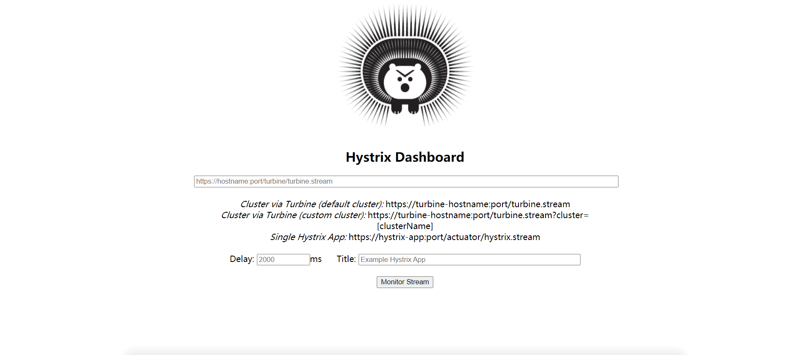

### 2、监控测试

#### 1、修改xiaobear-provider-hystrix-payment8001-12

==注意==：新版本`Hystrix`需要在启动类上指定监控路径，否则就会报**404错误**。

```java
@SpringBootApplication(exclude={DataSourceAutoConfiguration.class, HibernateJpaAutoConfiguration.class})
@EnableEurekaClient //本服务启动后会自动注册进eureka服务中
@EnableCircuitBreaker
public class HystrixApplication {

    public static void main(String[] args) {
        SpringApplication.run(HystrixApplication.class,args);
    }

    /**
     *此配置是为了服务监控而配置，与服务容错本身无关，springcloud升级后的坑
     *ServletRegistrationBean因为springboot的默认路径不是"/hystrix.stream"，
     *只要在自己的项目里配置上下面的servlet就可以了
     */
    @Bean
    public ServletRegistrationBean getServlet() {
        HystrixMetricsStreamServlet streamServlet = new HystrixMetricsStreamServlet();
        ServletRegistrationBean registrationBean = new ServletRegistrationBean(streamServlet);
        registrationBean.setLoadOnStartup(1);
        registrationBean.addUrlMappings("/hystrix.stream");
        registrationBean.setName("HystrixMetricsStreamServlet");
        return registrationBean;
    }
}
```

#### 2、测试

1. 启动一个Eureka或者Eureka集群
2. 观察监控窗口

##### 1、观察监控窗口

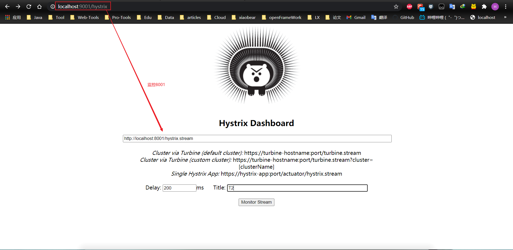

==Delay==：该参数用来控制服务器上轮询监控信息的延迟时间，默认为2000毫秒，可以通过配置该属性来降低客户端的网络和CPU消耗。

==Title==：该参数对应了头部标题Hystrix Stream之后的内容，默认会使用具体监控实例的URL，可以通过配置该信息来展示更合适的标题。

遇到的问题：

启动8001的时候报错了，

[Cannot execute request on any known server](https://www.cnblogs.com/shea/p/8675439.html)

==原因==：在默认设置下，eureka服务注册中心也会将自己作为客户端来尝试注册它自己，所以我们需要禁用它的客户端注册行为

==解决==：查看配置文件application.yml，发现register-with-eureka 属性值设置为true了，将其改为false,重启eureka服务，启动成功


打开另一个浏览器窗口，测试8001的其他接口地址

例如：http://localhost:8001/payment/circuit/1

- 监控成功

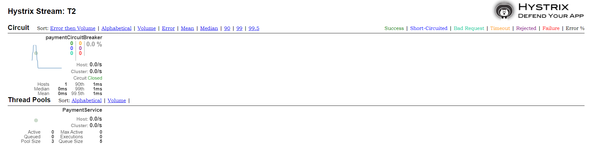

- 监控失败

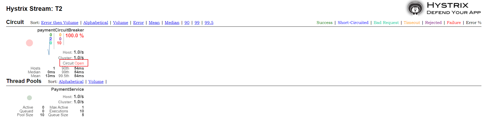

##### 2、如何观看监控图？

实心圆：共有两种含义。它通过颜色的变化代表了实例的健康程度，它的健康度从绿色<黄色<橙色<红色递减。

该实心圆除了颜色的变化之外，它的大小也会根据实例的请求流量发生变化，流量越大该实心圆就越大。所以通过该实心圆的展示，就可以在大量的实例中快速的发现故障实例和高压力实例。

曲线：用来记录2分钟内流量的相对变化，可以通过它来观察到流量的上升和下降趋势。


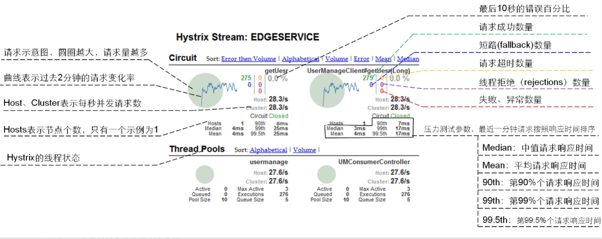
