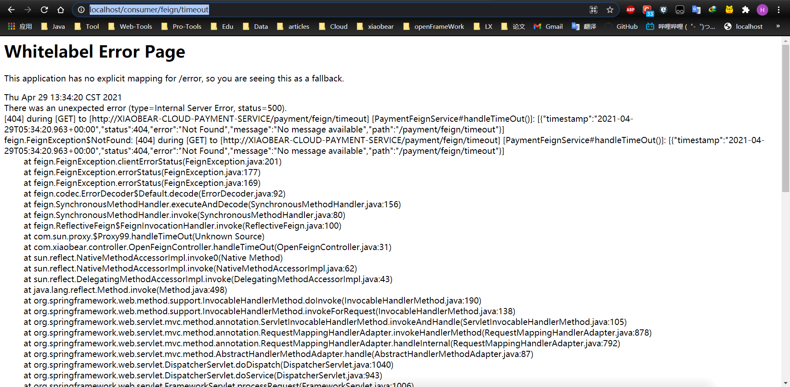
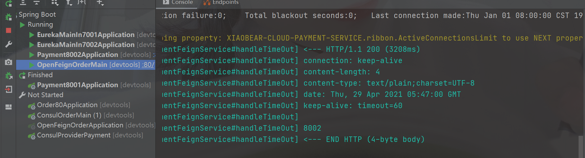

### 1、概述

官网：https://docs.spring.io/spring-cloud-openfeign/docs/current/reference/html/

> Feign是一个声明式WebService客户端。使用Feign能让编写Web Service客户端更加简单。
>
> 它的使用方法是定义一个服务接口然后在上面添加注解。Feign也支持可拔插式的编码器和解码器。Spring Cloud对Feign进行了封装，使其支持了Spring MVC标准注解和HttpMessageConverters。Feign可以与Eureka和Ribbon组合使用以支持负载均衡
>
> [Feign](https://github.com/OpenFeign/feign) is a declarative web service client. It makes writing web service clients easier. To use Feign create an interface and annotate it. It has pluggable annotation support including Feign annotations and JAX-RS annotations. Feign also supports pluggable encoders and decoders. Spring Cloud adds support for Spring MVC annotations and for using the same `HttpMessageConverters` used by default in Spring Web. Spring Cloud integrates Eureka, Spring Cloud CircuitBreaker, as well as Spring Cloud LoadBalancer to provide a load-balanced http client when using Feign.


#### 1、作用

> Feign旨在使编写Java Http客户端变得更容易。
>
> 前面在使用Ribbon+RestTemplate时，利用RestTemplate对http请求的封装处理，形成了一套模版化的调用方法。但是在实际开发中，由于对服务依赖的调用可能不止一处，往往一个接口会被多处调用，所以通常都会针对每个微服务自行封装一些客户端类来包装这些依赖服务的调用。所以，Feign在此基础上做了进一步封装，由他来帮助我们定义和实现依赖服务接口的定义。在Feign的实现下，我们只需创建一个接口并使用注解的方式来配置它(以前是Dao接口上面标注Mapper注解,现在是一个微服务接口上面标注一个Feign注解即可)，即可完成对服务提供方的接口绑定，简化了使用Spring cloud Ribbon时，自动封装服务调用客户端的开发量。

**Feign集成了Ribbon**

利用Ribbon维护了Payment的服务列表信息，并且通过轮询实现了客户端的负载均衡。而与Ribbon不同的是，通过feign只需要定义服务绑定接口且以声明式的方法，优雅而简单的实现了服务调用

#### 2、Feign与OpenFeign的区别

| Feign                                                        | OpenFeign                                                    |
| ------------------------------------------------------------ | ------------------------------------------------------------ |
| Feign是Spring Cloud组件中的一个轻量级RESTful的HTTP服务客户端；Feign内置了Ribbon，用来做客户端负载均衡，去调用服务注册中心的服务。Feign的使用方式是：使用Feign的注解定义接口，调用这个接口，就可以调用服务注册中心的服务 | OpenFeign是Spring Cloud 在Feign的基础上支持了SpringMVC的注解，如@RequesMapping等等。OpenFeign的@FeignClient可以解析SpringMVC的@RequestMapping注解下的接口，并通过动态代理的方式产生实现类，实现类中做负载均衡并调用其他服务。 |
| <dependency>  <groupId>org.springframework.cloud</groupId>  <artifactId>spring-cloud-starter-feign</artifactId></dependency> | <dependency>  <groupId>org.springframework.cloud</groupId>  <artifactId>spring-cloud-starter-openfeign</artifactId></dependency> |


### 2、使用

还是跟之前一样的步骤

#### 1、建module

```java
xiaobear-openFeign-order80-11
```

#### 2、改pom

```xml
<dependencies>
        <!--openfeign-->
        <dependency>
            <groupId>org.springframework.cloud</groupId>
            <artifactId>spring-cloud-starter-openfeign</artifactId>
        </dependency>
        <dependency>
            <groupId>org.springframework.cloud</groupId>
            <artifactId>spring-cloud-starter-netflix-eureka-client</artifactId>
        </dependency>

        <dependency><!-- 引入自己定义的api通用包，可以使用Payment支付Entity -->
            <groupId>com.xiaobear</groupId>
            <artifactId>xiaobear-common-api-3</artifactId>
            <version>1.0-SNAPSHOT</version>
        </dependency>
        <dependency>
            <groupId>org.springframework.boot</groupId>
            <artifactId>spring-boot-starter-web</artifactId>
        </dependency>
        <dependency>
            <groupId>org.springframework.boot</groupId>
            <artifactId>spring-boot-starter-actuator</artifactId>
        </dependency>
        <dependency>
            <groupId>org.mybatis.spring.boot</groupId>
            <artifactId>mybatis-spring-boot-starter</artifactId>
        </dependency>
        <dependency>
            <groupId>org.springframework.boot</groupId>
            <artifactId>spring-boot-devtools</artifactId>
            <scope>runtime</scope>
            <optional>true</optional>
        </dependency>
        <dependency>
            <groupId>org.projectlombok</groupId>
            <artifactId>lombok</artifactId>
            <optional>true</optional>
        </dependency>
        <dependency>
            <groupId>org.springframework.boot</groupId>
            <artifactId>spring-boot-starter-test</artifactId>
            <scope>test</scope>
        </dependency>
</dependencies>
```

这里我遇到的问题:

**突然就报数据库连接的错误，而这里我并没有做任何数据库相关的配置，一看pom文件，发现导入了数据库相关的依赖**

#### 3、写yaml

```yaml
server:
  port: 80

eureka:
  client:
    #表示是否将自己注册进EurekaServer默认为true。
    register-with-eureka: false
    service-url:
      defaultZone: http://eureka7001.com:7001/eureka,http://eureka7002.com:7002/eureka  #集群版
```

#### 4、主启动类

```java
@SpringBootApplication
@EnableFeignClients
public class OpenFeignOrderMain {

    public static void main(String[] args) {
        SpringApplication.run(OpenFeignOrderMain.class,args);
    }
}
```

#### 5、业务层

##### 1、service

```java
@Component
@FeignClient(value = "XIAOBEAR-CLOUD-PAYMENT-SERVICE")
public interface PaymentFeignService {

    @GetMapping("/payment/selectOne/{id}")
    //这里调用的8001或8002的查询
    CommonResult<Payment> getPaymentById(@PathVariable("id") Long id);
}
```

##### 2、controller

```java
@RestController
public class OpenFeignController {

    @Resource
    private PaymentFeignService feignService;

    @GetMapping("/feign/get/{id}")
    public CommonResult<Payment> getPayment(@PathVariable("id") Long id){
        return feignService.getPaymentById(id);
    }
}

```

#### 6、测试

http://localhost/feign/get/1

8001和8002服务交替出现

### 3、OpenFeign的超时控制

##### 1、服务8002controller写暂停代码

```java
@GetMapping(value = "/payment/feign/timeout")
    public String handleTimeOut(){
        try{
            //暂停3秒
            TimeUnit.SECONDS.sleep(3);
        } catch (InterruptedException e) {
            e.printStackTrace();
        }
        return serverPort;
    }
```

##### 2、服务消费端80

```java
@Component
@FeignClient(value = "XIAOBEAR-CLOUD-PAYMENT-SERVICE")
public interface PaymentFeignService {

    @GetMapping("/payment/selectOne/{id}")
    CommonResult<Payment> getPaymentById(@PathVariable("id") Long id);

    @GetMapping(value = "/payment/feign/timeout")
    String handleTimeOut();
}
```

##### 3、80controller添加超时方法

```java
@RestController
public class OpenFeignController {

    @Resource
    private PaymentFeignService feignService;

    @GetMapping("/feign/get/{id}")
    public CommonResult<Payment> getPayment(@PathVariable("id") Long id){
        return feignService.getPaymentById(id);
    }

    @GetMapping(value = "/consumer/feign/timeout")
    public String handleTimeOut(){
        return feignService.handleTimeOut();

    }
}
```

##### 4、测试

先测试-----》http://localhost:8002/payment/payment/feign/timeout 3秒后才显示端口

再http://localhost/consumer/feign/timeout

**原因**

> OpenFeign默认等待1秒钟，超时就会报错

默认Feign客户端只等待一秒钟，但是服务端处理需要超过1秒钟，导致Feign客户端不想等待了，直接返回报错。

为了避免这样的情况，有时候我们需要设置Feign客户端的超时控制。

在yaml中进行配置

```yaml
#设置feign客户端超时时间(OpenFeign默认支持ribbon)
ribbon:
  #指的是建立连接所用的时间，适用于网络状况正常的情况下,两端连接所用的时间
  ReadTimeout: 5000
  #指的是建立连接后从服务器读取到可用资源所用的时间
  ConnectTimeout: 5000
```

**完整版**

```yaml
server:
  port: 80

eureka:
  client:
    #表示是否将自己注册进EurekaServer默认为true。
    register-with-eureka: false
    service-url:
      defaultZone: http://eureka7001.com:7001/eureka,http://eureka7002.com:7002/eureka  #集群版

#设置feign客户端超时时间(OpenFeign默认支持ribbon)
ribbon:
  #指的是建立连接所用的时间，适用于网络状况正常的情况下,两端连接所用的时间
  ReadTimeout: 5000
  #指的是建立连接后从服务器读取到可用资源所用的时间
  ConnectTimeout: 5000
```

再接着访问http://localhost/consumer/feign/timeout 等待5秒就会显示接口


遇到的错误，启动80的启动类

```
Error starting ApplicationContext. To display the auto-configuration report re-run your application with 'debug' enabled.
2018-08-05 10:56:04,870 ERROR [LoggingFailureAnalysisReporter.java:42] : 
 
***************************
APPLICATION FAILED TO START
***************************
 
Description:
 
Cannot determine embedded database driver class for database type NONE
 
Action:
 
If you want an embedded database please put a supported one on the classpath. If you have database settings to be loaded from a particular profile you may need to active it (no profiles are currently active).
```

**解决**

因为这个module是没有用到数据库的，这时候，我们需要排除，防止自动注入数据库的链接

> 在@SpringBootApplication中排除其注入
> @SpringBootApplication(exclude={DataSourceAutoConfiguration.class,HibernateJpaAutoConfiguration.class})

```java
@SpringBootApplication(exclude={DataSourceAutoConfiguration.class, HibernateJpaAutoConfiguration.class})
@EnableFeignClients
public class OpenFeignOrderMain {

    public static void main(String[] args) {
        SpringApplication.run(OpenFeignOrderMain.class,args);
    }
}
```

### 4、OpenFeign日志打印

> Feign 提供了日志打印功能，我们可以通过配置来调整日志级别，从而了解 Feign 中 Http 请求的细节。
>
> 说白了就是**对Feign接口的调用情况进行监控和输出**

#### 1、日志级别

- NONE：默认的，不显示任何日志；
- BASIC：仅记录请求方法、URL、响应状态码及执行时间；
- HEADERS：除了 BASIC 中定义的信息之外，还有请求和响应的头信息；
- FULL：除了 HEADERS 中定义的信息之外，还有请求和响应的正文及元数据。

#### 2、配置

```java
//日志打印配置类
@Configuration
public class OpenFeignConfig {
    @Bean
    Logger.Level feignLoggerLevel()
    {
        return Logger.Level.FULL;
    }
}
```

#### 3、在yaml文件中开始OpenFeign的客户端

```yaml
server:
  port: 80

eureka:
  client:
    #表示是否将自己注册进EurekaServer默认为true。
    register-with-eureka: false
    service-url:
      defaultZone: http://eureka7001.com:7001/eureka,http://eureka7002.com:7002/eureka  #集群版

#设置feign客户端超时时间(OpenFeign默认支持ribbon)
ribbon:
  #指的是建立连接所用的时间，适用于网络状况正常的情况下,两端连接所用的时间
  ReadTimeout: 5000
  #指的是建立连接后从服务器读取到可用资源所用的时间
  ConnectTimeout: 5000

logging:
  level:
    ## feign日志以什么级别监控哪个接口
    com.xiaobear.service.PaymentFeignService: debug
```

#### 4、测试

http://localhost/consumer/feign/timeout


