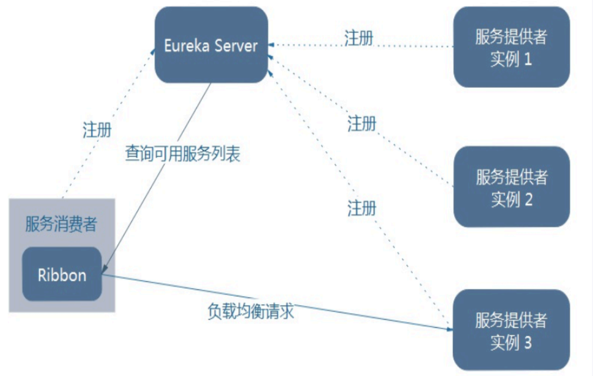
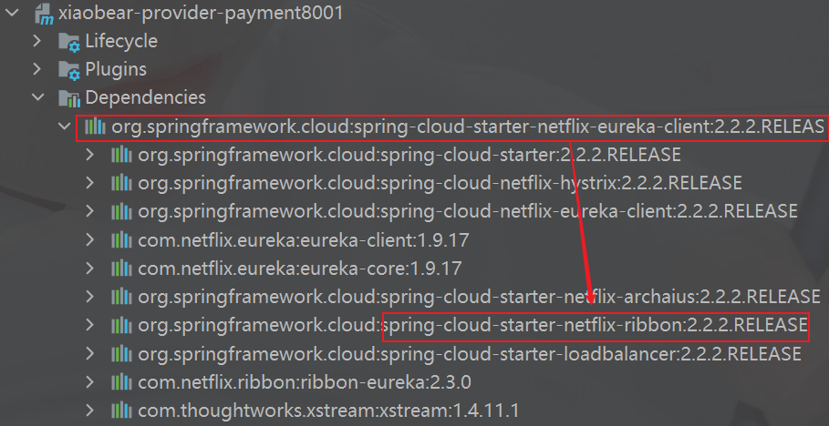
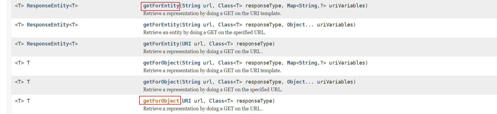
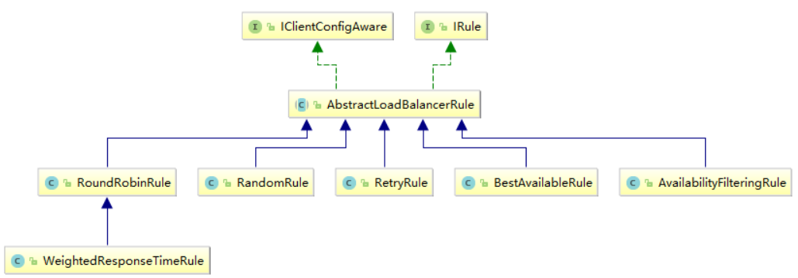
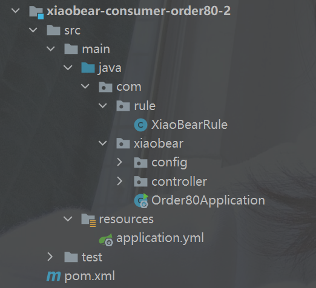
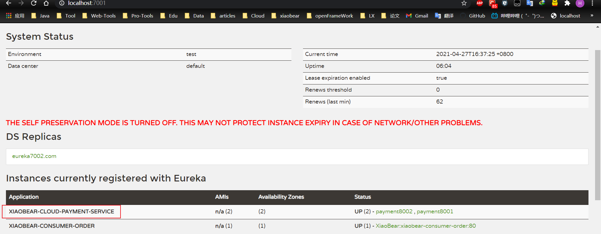

### 1、概述

> Spring Cloud Ribbon是基于Netflix Ribbon实现的一套*客户端***负载均衡**的工具。
>
> 简单的说，Ribbon是Netflix发布的开源项目，主要功能是提供客户端的软件负载均衡算法和服务调用。Ribbon客户端组件提供一系列完善的配置项如连接超时，重试等。简单的说，就是在配置文件中列出Load Balancer（简称LB）后面所有的机器，Ribbon会自动的帮助你基于某种规则（如简单轮询，随机连接等）去连接这些机器。我们很容易使用Ribbon实现自定义的负载均衡算法

#### 1、负载均衡分类

载均和分为硬件负载均衡和软件负载均衡：

**硬件负载均衡**：比如 F5、深信服、Array 等；

**软件负载均衡**：比如 Nginx、LVS、HAProxy 等；（是一个服务器实现的）

#### 2、作用

##### 1、LB负载均衡(Load Balance)是什么

> 简单的说就是将用户的请求平摊的分配到多个服务上，从而达到系统的HA（高可用）。

##### 2、Ribbon本地负载均衡客户端 VS Nginx服务端负载均衡区别

> Nginx是服务器负载均衡，客户端所有请求都会交给nginx，然后由nginx实现转发请求。即负载均衡是由服务端实现的。

Ribbon本地负载均衡，在调用微服务接口时候，会在注册中心上获取注册信息服务列表之后缓存到JVM本地，从而在本地实现RPC远程服务调用技术。

##### 3、进程式LB与集中式LB

###### 进程式LB

> 将LB逻辑集成到消费方，消费方从服务注册中心获知有哪些地址可用，然后自己再从这些地址中选择出一个合适的服务器。
>
>  Ribbon就属于进程内LB，它只是一个类库，集成于消费方进程，消费方通过它来获取到服务提供方的地址。

###### 集中式LB

> 即在服务的消费方和提供方之间使用独立的LB设施(可以是硬件，如F5, 也可以是软件，如nginx), 由该设施负责把访问请求通过某种策略转发至服务的提供方；

#### 3、总结

`Ribbon就是负载均衡+RestTemplate调用`

我们在Eureka就用到了负载均衡，8001和8002的访问


### 2、负载均衡演示



**Ribbon在工作时分成两步**

1. 先选择 EurekaServer ,它优先选择在同一个区域内负载较少的server.
2. 再根据用户指定的策略，在从server取到的服务注册列表中选择一个地址。

其中Ribbon提供了多种策略：比如**轮询**、**随机**和**根据响应时间加权**。

------

**总结：**Ribbon就是一个软负载均衡的客户端组件，他可以根据所需请求的客户端结合使用


那么，前面用到的Eureka的负载均衡是哪来的呢？

我们没有引入，猜测就是Eureka的客户端自带了ribbon，事实也是



#### 1、RestTempalte的作用



官网地址：https://docs.spring.io/spring-framework/docs/5.2.2.RELEASE/javadoc-api/org/springframework/web/client/RestTemplate.html

##### 1、getForObject/getForEntity方法

###### getForObject方法

> 返回对象为响应体中数据转化成的对象，基本上可以理解为Json

```java
@GetMapping("/consumer/payment/get/{id}")
    public CommonResult<Payment> getPayment(@PathVariable("id") Long id){
        return restTemplate.getForObject(PAYMENT_SRV + "/payment/selectOne/"+id,CommonResult.class, id);
    }
```

###### getForEntity方法

> 返回对象为ResponseEntity对象，包含了响应中的一些重要信息，比如响应头、响应状态码、响应体等

```java
 @GetMapping("/consumer/payment/getForEntity/{id}")
    public CommonResult<Payment> getPayment2(@PathVariable("id") Long id){
        ResponseEntity<CommonResult> entity = restTemplate.getForEntity(PAYMENT_SRV + "/payment/selectOne/" + id, CommonResult.class, id);
        if (entity.getStatusCode().is2xxSuccessful()){
            return entity.getBody();
        }else {
            return new CommonResult<>(400,"操作失败");
        }
    }
```

##### 2、postForObject/postForEntity方法

###### 1、postForObject方法

```java
@GetMapping("/consumer/payment/insert")
    public CommonResult<Payment> create(Payment payment){
        return restTemplate.postForObject(PAYMENT_SRV+"/payment/insert",payment,CommonResult.class);
    }
```

###### 2、postForEntity方法

```java
 @GetMapping("/consumer/payment/postForEntity")
    public CommonResult<Payment> create2(Payment payment){
        ResponseEntity<CommonResult> postForEntity = restTemplate.postForEntity(PAYMENT_SRV + "/payment/insert", payment, CommonResult.class);
        if (postForEntity.getStatusCode().is2xxSuccessful()){
            return postForEntity.getBody();
        }else {
            return new CommonResult<>(400,"新增失败");
        }
    }
```


##### 3、get/post方法

###### 1、get方法

```java
<T> T getForObject(String url, Class<T> responseType, Object... uriVariables);

<T> T getForObject(String url, Class<T> responseType, Map<String, ?> uriVariables);

<T> T getForObject(URI url, Class<T> responseType);

<T> ResponseEntity<T> getForEntity(String url, Class<T> responseType, Object... uriVariables);

<T> ResponseEntity<T> getForEntity(String url, Class<T> responseType, Map<String, ?> uriVariables);

<T> ResponseEntity<T> getForEntity(URI var1, Class<T> responseType);
```

###### 2、post方法

```java
<T> T postForObject(String url, @Nullable Object request, Class<T> responseType, Object... uriVariables);

<T> T postForObject(String url, @Nullable Object request, Class<T> responseType, Map<String, ?> uriVariables);

<T> T postForObject(URI url, @Nullable Object request, Class<T> responseType);

<T> ResponseEntity<T> postForEntity(String url, @Nullable Object request, Class<T> responseType, Object... uriVariables);

<T> ResponseEntity<T> postForEntity(String url, @Nullable Object request, Class<T> responseType, Map<String, ?> uriVariables);

<T> ResponseEntity<T> postForEntity(URI url, @Nullable Object request, Class<T> responseType);
```


### 3、核心组件 `IRule`

> 根据特定算法中从服务列表中选取一个要访问的服务



- RoundRobinRule：轮询
- RandomRule：随机
- RetryRule：先按照RoundRobinRule的 策略获取服务，如果服务获取失败，则在指定的时间内重试，获取可用的服务
- RestAvailableRule：先过滤调由于多次访问故障而处于断路器跳闸状态的服务，然后选择一个并发量最小的服务
- AvailabilityFulteringRule：先过滤调故障实例，再选择并发量最小的实例
- WeightedResponseTimeRule：对RoundRobinRule的扩展，响应速度越快的实例选择权重越大，越容易被选择
- ZoneAvoidanceRule：默认规则，复合判断server所在区域的性能和server的可用性选择服务器


#### 1、如何进行替换

我们将对order80进行修改

`配置注意`

> 官方文档明确给出了警告：
>
> 这个自定义配置类不能放在@ComponentScan所扫描的当前包下以及子包下，
>
> 否则我们自定义的这个配置类就会被所有的Ribbon客户端所共享，达不到特殊化定制的目的了。
>
> ------
>
> **也就是启动类所在的包**



###### 新建规则类

```java
@Configuration
public class XiaoBearRule {

    //随机替换
    @Bean
    public IRule myRule(){
        return new RandomRule();
    }
}
```

###### 主启动类加注解@RibbonClient

```java
@SpringBootApplication
@EnableEurekaClient
@RibbonClient(name = "XIAOBEAR-CLOUD-PAYMENT-SERVICE",configuration= XiaoBearRule.class)
public class Order80Application {

    public static void main(String[] args) {
        SpringApplication.run(Order80Application.class,args);
    }
}

```

name：是我们提供者的服务名称



configuration：新建的规则类

###### 测试

http://localhost/consumer/payment/get/1

刷新会发现调用服务是随机的


### 4、Ribbon负载均衡算法

> **负载均衡算法：rest接口第几次请求数 % 服务器集群总数量 = 实际调用服务器位置下标 ，每次服务重启动后rest接口计数从1开始。**
>
> ```java
> List<ServiceInstance> instances = discoveryClient.getInstances("XIAOBEAR-CLOUD-PAYMENT-SERVICE");
> 如：  List [0] instances = 127.0.0.1:8002
> 　　　List [1] instances = 127.0.0.1:8001
> ```
>
>
>
> 8001+ 8002 组合成为集群，它们共计2台机器，集群总数为2， 按照轮询算法原理：
>
>
>
> 当总请求数为1时： 1 % 2 =1 对应下标位置为1 ，则获得服务地址为127.0.0.1:8001
>
> 当总请求数位2时： 2 % 2 =0 对应下标位置为0 ，则获得服务地址为127.0.0.1:8002
>
> 当总请求数位3时： 3 % 2 =1 对应下标位置为1 ，则获得服务地址为127.0.0.1:8001
>
> 当总请求数位4时： 4 % 2 =0 对应下标位置为0 ，则获得服务地址为127.0.0.1:8002
>
> 如此类推......

#### 1、手写负载均衡

##### 1、8001和8002的controller改造

```java
@RestController
@RequestMapping("payment")
@Slf4j
public class PaymentController {
    /**
     * 服务对象
     */
    @Resource
    private PaymentService paymentService;

    @Resource
    private DiscoveryClient discoveryClient;

    @Value("${server.port}")
    private String serverPort;

    /**
     * 通过主键查询单条数据
     *
     * @param id 主键
     * @return 单条数据
     */
    @GetMapping("/selectOne/{id}")
    public CommonResult selectOne(@PathVariable("id")Long id) {
        Payment payment = paymentService.queryById(id);
        if (null != payment){
            return new CommonResult(200,"查询成功！serverPort:"+serverPort,payment);
        }else {
            return new CommonResult(404,"查询失败！serverPort"+serverPort,null);
        }
    }


    @PostMapping("/insert")
    public CommonResult createPayment(@RequestBody Payment payment){
        Payment insert = paymentService.insert(payment);
        log.info("插入成功！");
        if (null != insert){
            return new CommonResult(200,"插入数据库成功！serverPort:"+serverPort,insert);
        }else {
            return new CommonResult(500,"插入数据库失败！serverPort:"+serverPort,null);
        }
    }

    @GetMapping("/discovery")
    public Object discovery(){
        List<String> services = discoveryClient.getServices();
        for (String service : services) {
            System.out.println(service);
        }
        List<ServiceInstance> instances = discoveryClient.getInstances("XIAOBEAR-CLOUD-PAYMENT-SERVICE");
        for (ServiceInstance element : instances) {
            System.out.println(element.getServiceId() + "\t" + element.getHost() + "\t" + element.getPort() + "\t"
                    + element.getUri());
        }
        return this.discoveryClient;
    }

    @GetMapping(value = "/payment/lb")
    public String getPaymentLB()
    {
        return serverPort;
    }
}
```

##### 2、80订单微服务改造

```java
@Configuration
public class ApplicationContextConfig {

    @Bean
//    @LoadBalanced //使用@LoadBalanced注解赋予RestTemplate负载均衡的能力
    public RestTemplate getRestTemplate(){
        return new RestTemplate();
    }
}
```

##### 3、自定义接口与实现类

```java
public interface XiaobearLoadBalanced {

    ServiceInstance instances(List<ServiceInstance> serviceInstances);
}
```

```java
@Component
public class XiaobearLoadBalancedImpl implements XiaobearLoadBalanced{

    private AtomicInteger atomicInteger = new AtomicInteger(0);
	/**
     * 利用CAS和自旋锁 CAS比较并交换
     * @return
     */
    public int getServiceInstanceIndex(){
        int current;
        int index;
        do {
            current = atomicInteger.get();
            index = current >= 2147483647 ? 0 : current + 1;
        }while (!this.atomicInteger.compareAndSet(current,index));
        System.out.println("*****next: "+index);
        return index;
    }

    /**
     *负载均衡算法：rest接口第几次请求数 % 服务器集群总数量 = 实际调用服务器位置下标 ，每次服务重启动后rest接口计数从1开始。
     * @param serviceInstances
     * @return
     */
    @Override
    public ServiceInstance instances(List<ServiceInstance> serviceInstances) {
        int i = getServiceInstanceIndex() % serviceInstances.size();
        return serviceInstances.get(i);
    }
}
```

##### 4、80的controller

```java
@RestController
@Slf4j
public class OrderController {

    private static final String PAYMENT_URL = "http://localhost:8001";

    // 通过在eureka上注册过的微服务名称调用
    public static final String PAYMENT_SRV = "http://XIAOBEAR-CLOUD-PAYMENT-SERVICE";

    @Resource
    private RestTemplate restTemplate;
    @Resource
    private DiscoveryClient discoveryClient;
    @Resource
    private XiaobearLoadBalanced xiaobearLoadBalanced;

    public CommonResult<Payment> create(Payment payment){
        return restTemplate.postForObject(PAYMENT_SRV+"/payment/insert",payment,CommonResult.class);
    }

    @GetMapping("/consumer/payment/postForEntity")
    public CommonResult<Payment> create2(Payment payment){
        ResponseEntity<CommonResult> postForEntity = restTemplate.postForEntity(PAYMENT_SRV + "/payment/insert", payment, CommonResult.class);
        if (postForEntity.getStatusCode().is2xxSuccessful()){
            return postForEntity.getBody();
        }else {
            return new CommonResult<>(400,"新增失败");
        }
    }

    @GetMapping("/consumer/payment/get/{id}")
    public CommonResult<Payment> getPayment(@PathVariable("id") Long id){
        return restTemplate.getForObject(PAYMENT_SRV + "/payment/selectOne/"+id,CommonResult.class, id);
    }

    @GetMapping("/consumer/payment/getForEntity/{id}")
    public CommonResult<Payment> getPayment2(@PathVariable("id") Long id){
        ResponseEntity<CommonResult> entity = restTemplate.getForEntity(PAYMENT_SRV + "/payment/selectOne/" + id, CommonResult.class, id);
        if (entity.getStatusCode().is2xxSuccessful()){
            return entity.getBody();
        }else {
            return new CommonResult<>(400,"操作失败");
        }
    }
	//测试自定义的负载均衡
    @GetMapping("/consumer/payment/lb")
    public String getServerPort(){
        //获取服务
        List<ServiceInstance> instances = discoveryClient.getInstances("XIAOBEAR-CLOUD-PAYMENT-SERVICE");
        if(instances == null || instances.size()<=0) {
            return null;
        }
        ServiceInstance serviceInstance = xiaobearLoadBalanced.instances(instances);
        URI uri = serviceInstance.getUri();
        return restTemplate.getForObject(uri+"/payment/payment/lb",String.class);
    }
}
```

##### 5、测试

http://localhost/consumer/payment/lb

可以发现8001和8002交替出现，重启之后，又从1开始
