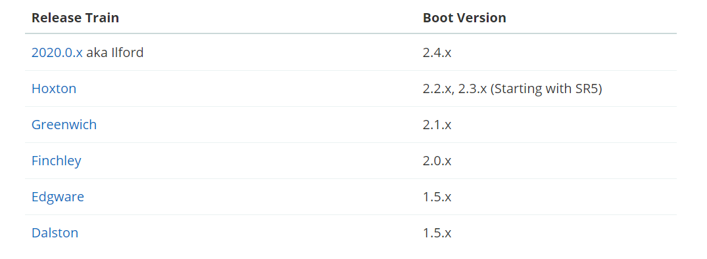
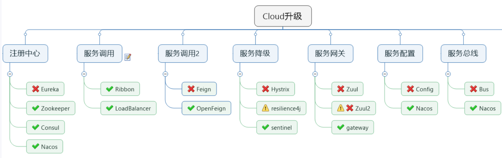
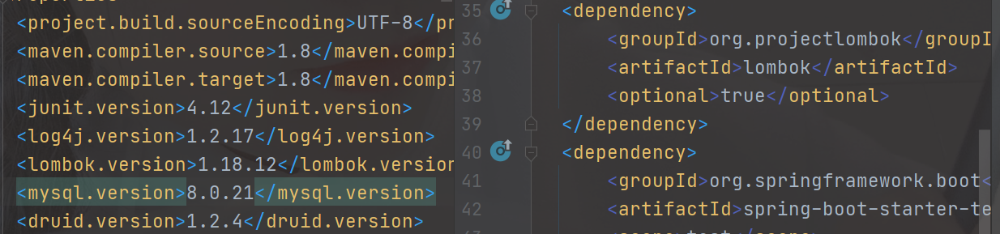

> Spring Cloud provides tools for developers to quickly build some of the common patterns in distributed systems (e.g. configuration management, service discovery, circuit breakers, intelligent routing, micro-proxy, control bus, one-time tokens, global locks, leadership election, distributed sessions, cluster state). Coordination of distributed systems leads to boiler plate patterns, and using Spring Cloud developers can quickly stand up services and applications that implement those patterns. They will work well in any distributed environment, including the developer’s own laptop, bare metal data centres, and managed platforms such as Cloud Foundry.
>
> Spring Cloud为开发人员提供了工具，以快速构建分布式系统中的一些常见模式（例如，配置管理，服务发现，断路器，智能路由，微代理，控制总线，一次性令牌，全局锁，领导选举，分布式会话，群集状态）。分布式系统的协调导致样板式样，并且使用Spring Cloud开发人员可以快速站起来实现这些样板的服务和应用程序。它们将在任何分布式环境中都能很好地工作，包括开发人员自己的笔记本电脑，裸机数据中心以及诸如Cloud Foundry之类的托管平台.

**特性**

- 分布式/版本化配置
- 服务注册和发现
- 路由
- 服务与服务间的调用
- 负载均衡
- 断路器
- 全局锁
- 领导选举与集群状态
- 分布式消息传递

### 1、Spring Cloud版本选择

#### 1、版本关系

> Spring Cloud 采用了英国伦敦地铁站的名称来命名，并由地铁站名称字母A-Z依次类推的形式来发布迭代版本
>
>SpringCloud是一个由许多子项目组成的综合项目，各子项目有不同的发布节奏。为了管理SpringCloud与各子项目的版本依赖关系，发布了一个清单，其中包括了某个SpringCloud版本对应的子项目版本。为了避免SpringCloud版本号与子项目版本号混淆，SpringCloud版本采用了名称而非版本号的命名，这些版本的名字采用了伦敦地铁站的名字，根据字母表的顺序来对应版本时间顺序。例如Angel是第一个版本, Brixton是第二个版本。
>
>当SpringCloud的发布内容积累到临界点或者一个重大BUG被解决后，会发布一个"service releases"版本，简称SRX版本，比如Greenwich.SR2就是SpringCloud发布的Greenwich版本的第2个SRX版本。

### 2、Spring Cloud与Spring Boot依赖关系

官方：https://spring.io/projects/spring-cloud#overview



更详细版本对应的查看：https://start.spring.io/actuator/info

json格式化：截止（2021.04.13）

```json
{
  "git": {
    "branch": "709ff1cec88a124ef588f6185e5dc237766f3236",
    "commit": {
      "id": "709ff1c",
      "time": "2021-04-10T08:56:10Z"
    }
  },
  "build": {
    "version": "0.0.1-SNAPSHOT",
    "artifact": "start-site",
    "versions": {
      "spring-boot": "2.4.4",
      "initializr": "0.11.0-SNAPSHOT"
    },
    "name": "start.spring.io website",
    "time": "2021-04-12T11:22:19.209Z",
    "group": "io.spring.start"
  },
  "bom-ranges": {
    "azure": {
      "2.2.4": "Spring Boot >=2.2.0.RELEASE and <2.3.0.M1",
      "3.2.0": "Spring Boot >=2.3.0.M1 and <2.4.0-M1",
      "3.3.0": "Spring Boot >=2.4.0.M1 and <2.5.0-M1"
    },
    "codecentric-spring-boot-admin": {
      "2.2.4": "Spring Boot >=2.2.0.RELEASE and <2.3.0.M1",
      "2.3.1": "Spring Boot >=2.3.0.M1 and <2.5.0-M1"
    },
    "solace-spring-boot": {
      "1.0.0": "Spring Boot >=2.2.0.RELEASE and <2.3.0.M1",
      "1.1.0": "Spring Boot >=2.3.0.M1 and <2.5.0-M1"
    },
    "solace-spring-cloud": {
      "1.0.0": "Spring Boot >=2.2.0.RELEASE and <2.3.0.M1",
      "1.1.1": "Spring Boot >=2.3.0.M1 and <2.4.0-M1",
      "2.0.0": "Spring Boot >=2.4.0.M1 and <2.5.0-M1"
    },
    "spring-cloud": {
      "Hoxton.SR10": "Spring Boot >=2.2.0.RELEASE and <2.3.10.BUILD-SNAPSHOT",
      "Hoxton.BUILD-SNAPSHOT": "Spring Boot >=2.3.10.BUILD-SNAPSHOT and <2.4.0.M1",
      "2020.0.0-M3": "Spring Boot >=2.4.0.M1 and <=2.4.0.M1",
      "2020.0.0-M4": "Spring Boot >=2.4.0.M2 and <=2.4.0-M3",
      "2020.0.0": "Spring Boot >=2.4.0.M4 and <=2.4.0",
      "2020.0.2": "Spring Boot >=2.4.1 and <2.5.0-M1",
      "2020.0.3-SNAPSHOT": "Spring Boot >=2.4.5-SNAPSHOT"
    },
    "spring-cloud-alibaba": {
      "2.2.1.RELEASE": "Spring Boot >=2.2.0.RELEASE and <2.3.0.M1"
    },
    "spring-cloud-gcp": {
      "2.0.0": "Spring Boot >=2.4.0-M1 and <2.5.0-M1"
    },
    "spring-cloud-services": {
      "2.2.6.RELEASE": "Spring Boot >=2.2.0.RELEASE and <2.3.0.RELEASE",
      "2.3.0.RELEASE": "Spring Boot >=2.3.0.RELEASE and <2.4.0-M1",
      "2.4.1": "Spring Boot >=2.4.0-M1 and <2.5.0-M1"
    },
    "spring-geode": {
      "1.2.12.RELEASE": "Spring Boot >=2.2.0.RELEASE and <2.3.0.M1",
      "1.3.9.RELEASE": "Spring Boot >=2.3.0.M1 and <2.4.0-M1",
      "1.4.4": "Spring Boot >=2.4.0-M1 and <2.5.0-M1",
      "1.5.0-M3": "Spring Boot >=2.5.0-M1"
    },
    "vaadin": {
      "14.5.2": "Spring Boot >=2.1.0.RELEASE and <2.5.0-M1"
    },
    "wavefront": {
      "2.0.2": "Spring Boot >=2.1.0.RELEASE and <2.4.0-M1",
      "2.1.0": "Spring Boot >=2.4.0-M1"
    }
  },
  "dependency-ranges": {
    "native": {
      "0.9.0": "Spring Boot >=2.4.3 and <2.4.4",
      "0.9.1": "Spring Boot >=2.4.4 and <2.4.5-SNAPSHOT",
      "0.9.2-SNAPSHOT": "Spring Boot >=2.4.5-SNAPSHOT and <2.5.0-M1"
    },
    "okta": {
      "1.4.0": "Spring Boot >=2.2.0.RELEASE and <2.4.0-M1",
      "1.5.1": "Spring Boot >=2.4.0-M1 and <2.4.1",
      "2.0.1": "Spring Boot >=2.4.1 and <2.5.0-M1"
    },
    "mybatis": {
      "2.1.4": "Spring Boot >=2.1.0.RELEASE and <2.5.0-M1"
    },
    "camel": {
      "3.3.0": "Spring Boot >=2.2.0.RELEASE and <2.3.0.M1",
      "3.5.0": "Spring Boot >=2.3.0.M1 and <2.4.0-M1",
      "3.9.0": "Spring Boot >=2.4.0.M1 and <2.5.0-M1"
    },
    "open-service-broker": {
      "3.1.1.RELEASE": "Spring Boot >=2.2.0.RELEASE and <2.3.0.M1",
      "3.2.0": "Spring Boot >=2.3.0.M1 and <2.4.0-M1",
      "3.3.0": "Spring Boot >=2.4.0-M1 and <2.5.0-M1"
    }
  }
}
```

### 3、Spring Cloud组件的停更、升级、替换



### 4、环境版本定稿

```xml

  <!-- 统一管理jar包版本 -->
  <properties>
    <project.build.sourceEncoding>UTF-8</project.build.sourceEncoding>
    <maven.compiler.source>1.8</maven.compiler.source>
    <maven.compiler.target>1.8</maven.compiler.target>
    <junit.version>4.12</junit.version>
    <log4j.version>1.2.17</log4j.version>
    <lombok.version>1.18.12</lombok.version>
    <mysql.version>8.0.21</mysql.version>
    <druid.version>1.2.4</druid.version>
    <mybatis.spring.boot.version>2.1.3</mybatis.spring.boot.version>
  </properties>

  <!-- 子模块继承之后，提供作用：锁定版本+子modlue不用写groupId和version  -->
  <dependencyManagement>
    <dependencies>
      <!--spring boot 2.2.2-->
      <dependency>
        <groupId>org.springframework.boot</groupId>
        <artifactId>spring-boot-dependencies</artifactId>
        <version>2.3.3.RELEASE</version>
        <type>pom</type>
        <scope>import</scope>
      </dependency>
      <!--spring cloud Hoxton.SR1-->
      <dependency>
        <groupId>org.springframework.cloud</groupId>
        <artifactId>spring-cloud-dependencies</artifactId>
        <version>Hoxton.SR4</version>
        <type>pom</type>
        <scope>import</scope>
      </dependency>
      <!--spring cloud alibaba 2.1.0.RELEASE-->
      <dependency>
        <groupId>com.alibaba.cloud</groupId>
        <artifactId>spring-cloud-alibaba-dependencies</artifactId>
        <version>2.2.1.RELEASE</version>
        <type>pom</type>
        <scope>import</scope>
      </dependency>
      <dependency>
        <groupId>mysql</groupId>
        <artifactId>mysql-connector-java</artifactId>
        <version>${mysql.version}</version>
      </dependency>
      <dependency>
        <groupId>com.alibaba</groupId>
        <artifactId>druid</artifactId>
        <version>${druid.version}</version>
      </dependency>
      <dependency>
        <groupId>org.mybatis.spring.boot</groupId>
        <artifactId>mybatis-spring-boot-starter</artifactId>
        <version>${mybatis.spring.boot.version}</version>
      </dependency>
      <dependency>
        <groupId>junit</groupId>
        <artifactId>junit</artifactId>
        <version>${junit.version}</version>
      </dependency>
      <dependency>
        <groupId>log4j</groupId>
        <artifactId>log4j</artifactId>
        <version>${log4j.version}</version>
      </dependency>
      <dependency>
        <groupId>org.projectlombok</groupId>
        <artifactId>lombok</artifactId>
        <version>${lombok.version}</version>
        <optional>true</optional>
      </dependency>
    </dependencies>
  </dependencyManagement>

  <build>
    <plugins>
      <plugin>
        <groupId>org.springframework.boot</groupId>
        <artifactId>spring-boot-maven-plugin</artifactId>
        <configuration>
          <fork>true</fork>
          <addResources>true</addResources>
        </configuration>
      </plugin>
    </plugins>
  </build>
```

#### 1、maven工程复习

`dependencyManagement`

Maven 使用dependencyManagement 元素来提供了一种管理依赖版本号的方式。通常会在一个组织或者项目的最顶层的父POM 中看到dependencyManagement 元素。

使用pom.xml 中的dependencyManagement 元素能让所有在子项目中引用一个依赖而不用显式的列出版本号。
Maven 会沿着父子层次向上走，直到找到一个拥有dependencyManagement 元素的项目，然后它就会使用这个
dependencyManagement 元素中指定的版本号。

例如：

我们在父项目指定了版本，子项目就可以不用指定版本，直接用父项目的版本

> 

这样做的好处就是：如果有多个子项目都引用同一样依赖，则可以避免在每个使用的子项目里都声明一个版本号，

这样当想升级或切换到另一个版本时，只需要在顶层父容器里更新，而不需要一个一个子项目的修改 ；另外如果

某个子项目需要另外的一个版本，只需要声明version就可。

*     dependencyManagement里只是声明依赖，并不实现引入，因此子项目需要显示的声明需要用的依赖。
*   如果不在子项目中声明依赖，是不会从父项目中继承下来的；只有在子项目中写了该依赖项，并且没有指定具体版本，
    才会从父项目中继承该项，并且version和scope都读取自父pom;
*     如果子项目中指定了版本号，那么会使用子项目中指定的jar版本。

#### 2、mysql驱动说明

> com.mysql.jdbc.Driver和mysql-connector-java 5一起用。
>
> com.mysql.cj.jdbc.Driver和mysql-connector-java 6 一起用。
>
> ------
>
> com.mysql.cj.jdbc.Driver是mysql-connector-java 6 中的特性，相比mysql-connector-java 5 多了一个时区：
>
> serverTimezone，把数据源配置的驱动改一下就好了
>
> ------
>
> org.gjt.mm.mysql.Driver是当时最好的MySQL JDBC，但不是MySQL公司的，然后MySQL将MM的JDBC驱动 收为
>
> 官方的JDBC驱动，所以将驱动的package也改了，但还保留了org.gjt.mm.mysql.Driver这个路径的引用，也就
>
> 是你使用新版的JDBC驱动时还可以通过这个来引用，打开下载的新版JDBC驱动的jar文件可以看到，只有一个
>
> 文件的目录是org.gjt.mm.mysql，就是为了兼容而设计的
