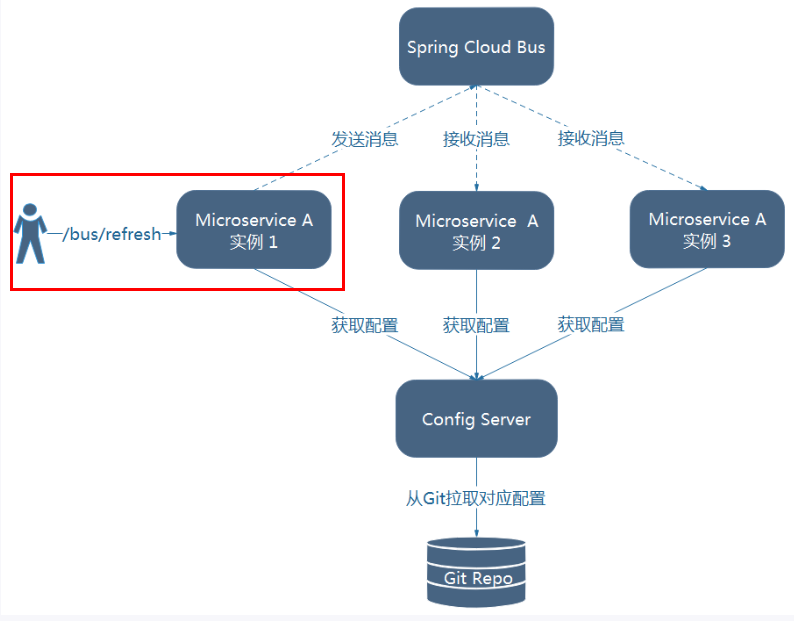
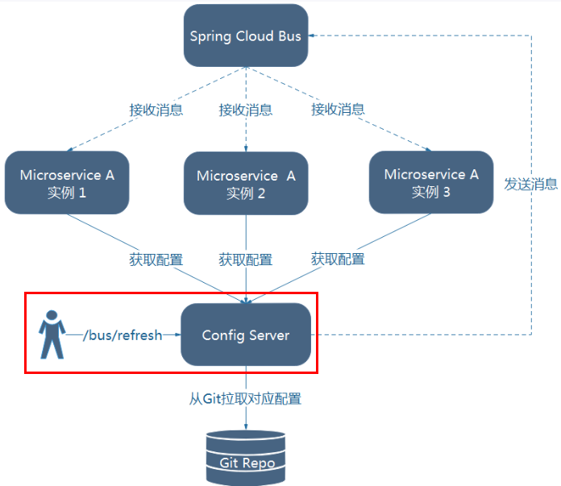
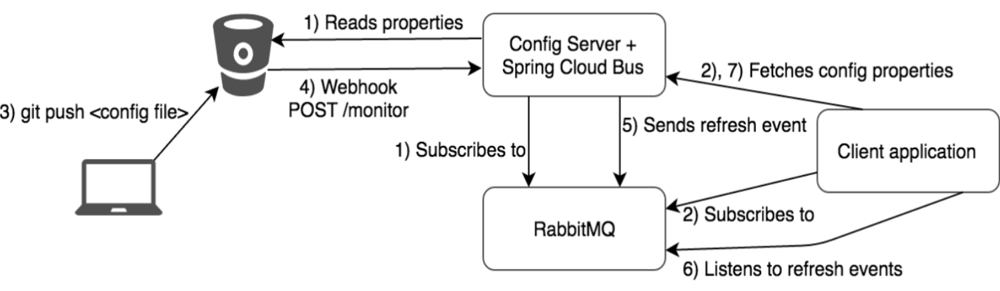

### 1、概述

> Spring Cloud Bus将分布式系统的节点与轻量级消息代理链接。这可以用于广播状态更改（例如配置更改）或其他管理指令。一个关键的想法是，Bus就像一个扩展的Spring Boot应用程序的分布式执行器，但也可以用作应用程序之间的通信渠道。当前唯一的实现是使用AMQP代理作为传输，但是相同的基本功能集（还有一些取决于传输）在其他传输的路线图上。
>
> - 分布式自动刷新配置功能
> - 配合`Spring Cloud Config`实现配置的动态的刷新

`Bus`支持的两种消息代码：

- `RabbitMQ`
- `kafka`

#### 1、作用

Spring Cloud Bus能管理和传播分布式系统间的消息，就像一个分布式执行器，可用于广播状态更改、事件推送等，也可以当作微服务间的通信通道。

#### 2、为何叫做总线

##### 什么是总线

> 在微服务架构的系统中，通常会使用轻量级的消息代理来构建一个共用的消息主题，并让系统中所有微服务实例都连接上来。由于该主题中产生的消息会被所有实例监听和消费，所以称它为消息总线。在总线上的各个实例，都可以方便地广播一些需要让其他连接在该主题上的实例都知道的消息。

##### 基本原理

> ConfigClient实例都监听MQ中同一个topic(默认是springCloudBus)。当一个服务刷新数据的时候，它会把这个信息放入到Topic中，这样其它监听同一Topic的服务就能得到通知，然后去更新自身的配置。

https://www.bilibili.com/video/av55976700?from=search&seid=15010075915728605208

### 2、`RabbitMQ`安装与配置

参考：

https://www.huaweicloud.com/articles/8b843c2fd653346beba18d2b21af0c3d.html

https://cloud.tencent.com/developer/article/1582235


### 3、Spring Cloud Bus动态刷新全局广播

切记：必须安装好rabbitMQ的环境

#### 1、新建一个module3366

##### 1、新建module

```
xiaobear-cloud-config-client-3366
```

##### 2、改pom.xml

```xml
<dependencies>
        <dependency>
            <groupId>org.springframework.cloud</groupId>
            <artifactId>spring-cloud-starter-config</artifactId>
        </dependency>
        <dependency>
            <groupId>org.springframework.cloud</groupId>
            <artifactId>spring-cloud-starter-netflix-eureka-client</artifactId>
        </dependency>
        <dependency>
            <groupId>org.springframework.boot</groupId>
            <artifactId>spring-boot-starter-web</artifactId>
        </dependency>
        <dependency>
            <groupId>org.springframework.boot</groupId>
            <artifactId>spring-boot-starter-actuator</artifactId>
        </dependency>

        <dependency>
            <groupId>org.springframework.boot</groupId>
            <artifactId>spring-boot-devtools</artifactId>
            <scope>runtime</scope>
            <optional>true</optional>
        </dependency>
        <dependency>
            <groupId>org.projectlombok</groupId>
            <artifactId>lombok</artifactId>
            <optional>true</optional>
        </dependency>
        <dependency>
            <groupId>org.springframework.boot</groupId>
            <artifactId>spring-boot-starter-test</artifactId>
            <scope>test</scope>
        </dependency>
    </dependencies>
```

##### 3、写yaml(`bootstrap.yaml`)

```yaml
server:
  port: 3366

spring:
  application:
    name: config-client
  cloud:
    #Config客户端配置
    config:
      label: master #分支名称
      name: config #配置文件名称
      profile: dev #读取后缀名称   上述3个综合：master分支上config-dev.yml的配置文件被读取http://config-3344.com:3344/master/config-dev.yml
      uri: http://localhost:3344 #配置中心地址

#服务注册到eureka地址
eureka:
  client:
    service-url:
      defaultZone: http://localhost:7001/eureka

## 暴露监控端点
management:
  endpoints:
    web:
      exposure:
        include: "*"
```

##### 4、主启动类

```java
@EnableEurekaClient
@SpringBootApplication
public class BusConfigClient3366 {
    public static void main(String[] args) {
        SpringApplication.run(BusConfigClient3366.class, args);
    }
}
```

##### 5、业务类

- controller

```java
@RestController
@RefreshScope
public class BusClientController {

    @Value("${server.port}")
    private String serverPort;

    @Value("${spring.cloud.nacos.config.server-addr}")
    private String configInfo;

    @GetMapping("/configInfo")
    public String configInfo()
    {
        return "serverPort: "+serverPort+"\t\n\n configInfo: "+configInfo;
    }
}
```


#### 2、设计思想

1. 利用消息总线触发一个客户端/bus/refresh，而刷新客户端所有配置

   

2. 利用消息总线触发一个服务端ConfigServer的/bus/refresh端点，而刷新所有客户端配置

   

**推荐：**第二个思想更合适一点，第一个不适合原因如下：

- 打破了微服务的单一职责性，因为微服务本身是业务模块，它本不应该承担配置刷新的职责
- 破坏了微服务各节点的对等性
- 有一定的局限性。比如微服务在迁移时，它的网络地址时常发生变化，这时要想做到自动刷新，那就会增加更多的修改


#### 3、	3344服务端增加消息总线

##### 1、pom文件增加依赖

```xml
<!--添加消息总线RabbitMQ支持-->
<dependency>
    <groupId>org.springframework.cloud</groupId>
    <artifactId>spring-cloud-starter-bus-amqp</artifactId>
</dependency>
<dependency>
    <groupId>org.springframework.boot</groupId>
    <artifactId>spring-boot-starter-actuator</artifactId>
</dependency>
```

##### 2、yaml增加配置

```yaml
server:
  port: 3344

spring:
  application:
    name: cloud-config-center #注册进Eureka服务器的微服务名
  cloud:
    config:
      server:
        git:
          uri: https://github.com/yhx1001/Spring-Cloud-Config-Test.git #GitHub上面的git仓库名字

#rabbit配置
  rabbitmq:
    host: localhost
    port: 5672
    username: guest
    password: guest

#服务注册到eureka地址
eureka:
  client:
    service-url:
      defaultZone: http://localhost:7001/eureka


##rabbitmq相关配置,暴露bus刷新配置的端点
management:
  endpoints: #暴露bus刷新配置的端点
    web:
      exposure:
        include: 'bus-refresh'
```

#### 4、3355客户端增加消息总线

##### 1、pom文件增加依赖

```xml
<!--添加消息总线RabbitMQ支持-->
<dependency>
    <groupId>org.springframework.cloud</groupId>
    <artifactId>spring-cloud-starter-bus-amqp</artifactId>
</dependency>
<dependency>
    <groupId>org.springframework.boot</groupId>
    <artifactId>spring-boot-starter-actuator</artifactId>
</dependency>
```

##### 2、yaml增加配置

```yaml
server:
  port: 3355

spring:
  application:
    name: config-client
  cloud:
    #Config客户端配置
    config:
      label: master #分支名称
      name: config #配置文件名称
      profile: dev #读取后缀名称   上述3个综合：master分支上config-dev.yml的配置文件被读取http://config-3344.com:3344/master/config-dev.yml
      uri: http://localhost:3344 #配置中心地址

  #rabbitmq相关配置 15672是Web管理界面的端口；5672是MQ访问的端口
  rabbitmq:
    host: localhost
    port: 5672
    username: guest
    password: guest


#服务注册到eureka地址
eureka:
  client:
    service-url:
      defaultZone: http://localhost:7001/eureka

## 暴露监控端点
## 暴露监控端点
management:
  endpoints:
    web:
      exposure:
        include: "*"   ## 'refresh'
```

#### 5、3366客户端增加消息总线

##### 1、pom文件增加依赖

```xml
<!--添加消息总线RabbitMQ支持-->
<dependency>
    <groupId>org.springframework.cloud</groupId>
    <artifactId>spring-cloud-starter-bus-amqp</artifactId>
</dependency>
<dependency>
    <groupId>org.springframework.boot</groupId>
    <artifactId>spring-boot-starter-actuator</artifactId>
</dependency>
```

##### 2、yaml增加配置

```yaml
server:
  port: 3366

spring:
  application:
    name: config-client
  cloud:
    #Config客户端配置
    config:
      label: master #分支名称
      name: config #配置文件名称
      profile: dev #读取后缀名称   上述3个综合：master分支上config-dev.yml的配置文件被读取http://config-3344.com:3344/master/config-dev.yml
      uri: http://localhost:3344 #配置中心地址

  #rabbitmq相关配置 15672是Web管理界面的端口；5672是MQ访问的端口
  rabbitmq:
    host: localhost
    port: 5672
    username: guest
    password: guest

#服务注册到eureka地址
eureka:
  client:
    service-url:
      defaultZone: http://localhost:7001/eureka

## 暴露监控端点
management:
  endpoints:
    web:
      exposure:
        include: "*"
```

#### 6、测试

启动3355，3366报错

```
org.springframework.context.ApplicationContextException: Failed to start bean 'webServerStartStop'; nested exception is org.springframework.boot.web.server.WebServerException: Unable to start embedded Tomcat server
```

升级依赖：https://spring.io/projects/spring-cloud#overview

- 修改GitHub配置文件
- curl -X POST "http://localhost:3344/actuator/bus ，一次发送处处生效
- 服务端：http://localhost:3344/config-dev.yml
- 客户端：http://localhost:3355/configInfo
- 客户端：http://localhost:3366/configInfo

获取配置信息，发现都已经刷新了


### 4、Spring Cloud Bus动态刷新定点通知

不想全部通知，只通知一部分

> 指定具体一个实例生效而不是全部
>
> 公式：**http://localhost:配置中心的端口号/actuator/bus-refresh/{destination}**
>
> /bus/refresh请求不再发送到具体的服务实例上，而是发给config server并通过destination参数类指定需要更新配置的服务或实例

案例：以刷新运行在3355端口上的config-client为例

- curl -X POST "http://localhost:3344/actuator/bus-refresh/config-client:3355"

总结


