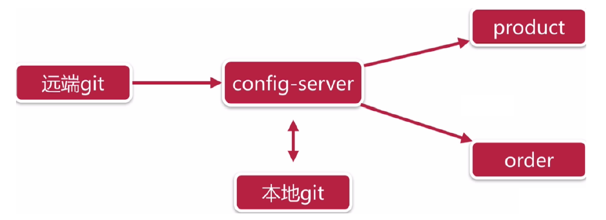
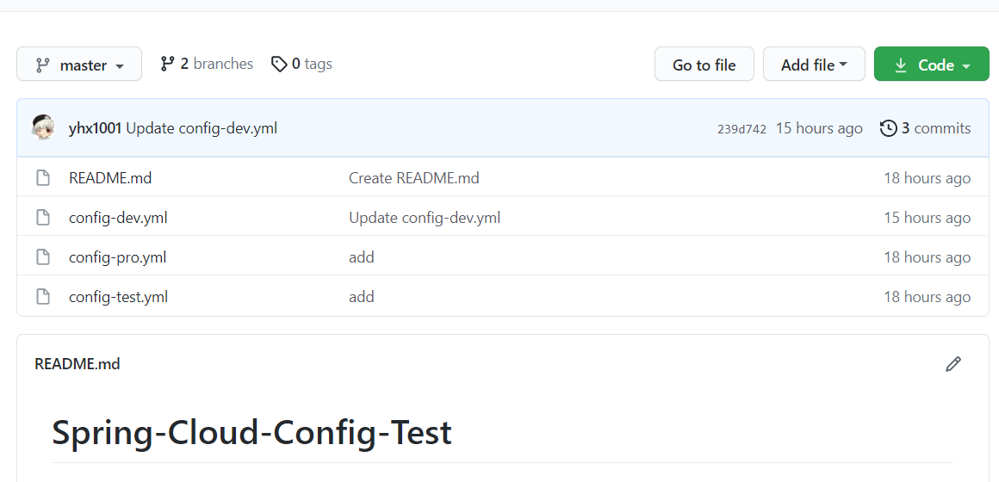
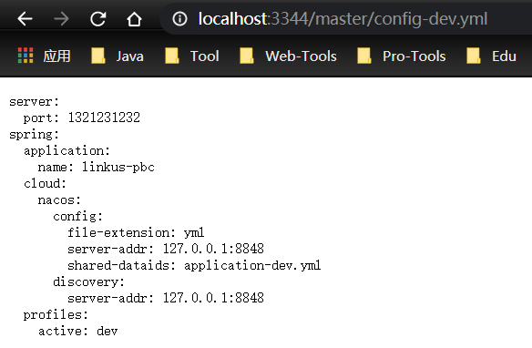

### 1、概述

分布式系统面临的问题--配置问题

> 微服务意味着要将单体应用中的业务拆分成一个个子服务，每个服务的粒度相对较小，因此系统中会出现大量的服务。由于每个服务都需要必要的配置信息才能运行，所以一套集中式的、动态的配置管理设施是必不可少的。
>
> SpringCloud提供了ConfigServer来解决这个问题，我们每一个微服务自己带着一个application.yml，上百个配置文件的管理......

#### 1、什么是`Spring Cloud Config`

**SpringCloud Config为微服务架构中的微服务提供集中化的外部配置支持，配置服务器为各个不同微服务应用的所有环境提供了一个中心化的外部配置。**

SpringCloud Config分为**服务端**和**客户端**两部分。

- 服务端也称为分布式配置中心，它是一个独立的微服务应用，用来连接配置服务器并为客户端提供获取配置信息，加密/解密信息等访问接口

- 客户端则是通过指定的配置中心来管理应用资源，以及与业务相关的配置内容，并在启动的时候从配置中心获取和加载配置信息配置服务器默认采用git来存储配置信息，这样就有助于对环境配置进行版本管理，并且可以通过git客户端工具来方便的管理和访问配置内容。

##### 1、作用

- 集中管理配置文件
- 不同环境不同配置，动态化的配置更新，分环境部署，比如/dev、/test、/prod、/beta、/release
- 运行期间动态调整配置，不再需要在每个服务部署的机器上编写配置文件，服务会向配置中心统一拉取配置自己的信息
- 当配置发生变动时，服务不需要重启即可感知到配置的变化并应用新的配置
- 将配置信息以REST接口的形式暴露
    - post、curl访问刷新即可

##### 2、与`GitHub`的整合

`Spring Cloud Config`默认使用`Git`来存储配置文件（也有其他方式，比如SVN和本地文件），但最推荐还是`Git`，而且使用的是`http/https`访问的形式。



##### 3、官网

https://docs.spring.io/spring-cloud-config/docs/current/reference/html/


### 2、Config服务端配置与测试

#### 1、在GitHub创建仓库



同时，新建分支dev，yml的内容随便填写

#### 2、整合

##### 1、新建module

```
xiaobear-cloud-config-center-3344
```

##### 2、改pom.xml

```xml
<dependencies>
        <dependency>
            <groupId>org.springframework.boot</groupId>
            <artifactId>spring-boot-starter-actuator</artifactId>
        </dependency>
        <dependency>
            <groupId>org.springframework.cloud</groupId>
            <artifactId>spring-cloud-config-server</artifactId>
        </dependency>
        <dependency>
            <groupId>org.springframework.boot</groupId>
            <artifactId>spring-boot-starter-web</artifactId>
        </dependency>
        <dependency>
            <groupId>org.projectlombok</groupId>
            <artifactId>lombok</artifactId>
        </dependency>
        <dependency>
            <groupId>org.springframework.boot</groupId>
            <artifactId>spring-boot-starter-test</artifactId>
        </dependency>
        <dependency>
            <groupId>org.springframework.boot</groupId>
            <artifactId>spring-boot-devtools</artifactId>
        </dependency>
        <dependency>
            <groupId>org.springframework.cloud</groupId>
            <artifactId>spring-cloud-starter-netflix-eureka-client</artifactId>
        </dependency>
    </dependencies>
```

##### 3、写yaml

```yaml
server:
  port: 3344

spring:
  application:
    name: cloud-config-center #注册进Eureka服务器的微服务名
  cloud:
    config:
      server:
        git:
          uri: https://github.com/yhx1001/Spring-Cloud-Config-Test.git #GitHub上面的git仓库名字

#服务注册到eureka地址
eureka:
  client:
    service-url:
      defaultZone: http://localhost:7001/eureka
```

##### 4、主启动类

```java
@EnableConfigServer
@EnableEurekaClient
@SpringBootApplication
public class ConfigApplication3344 {
    public static void main(String[] args) {
        SpringApplication.run(ConfigApplication3344.class, args);
    }
}
```

##### 5、测试

- http://localhost:3344/master/config-dev.yml

- http://localhost:3344/config-dev.yml

- http://localhost:3344/config/dev/dev



#### 3、配置读取规则

```
/{application}/{profile}[/{label}]
/{application}-{profile}.yml
/{label}/{application}-{profile}.yml
/{application}-{profile}.properties
/{label}/{application}-{profile}.properti
```

>  其中“应用程序”作为`SpringApplication`中的`spring.config.name`注入（即常规Spring Boot应用程序中通常为“应用程序”），“配置文件”是活动配置文件（或逗号分隔列表）的属性），“label”是可选的git标签（默认为“master”）。

##### 1、`/{application}/{profile}[/{label}]`

以刚刚测试的地址来测试：

- master分支
    - http://localhost:3344/config/dev/master
    - http://localhost:3344/config/pro/master
    - http://localhost:3344/config/test/master
- dev分支
    - http://localhost:3344/config/dev/dev
    - http://localhost:3344/config/pro/dev
    - http://localhost:3344/config/test/dev

##### 2、`/{application}-{profile}.yml`

- http://localhost:3344/config-dev.yml
- http://localhost:3344/config-pro.yml
- http://localhost:3344/config-test.yml

##### 3、`/{label}/{application}-{profile}.yml`

- master
    - http://localhost:3344/master/config-dev.yml
    - http://localhost:3344/master/config-pro.yml
    - http://localhost:3344/master/config-test.yml
- dev分支
    - http://localhost:3344/dev/config-dev.yml
    - http://localhost:3344/dev/config-pro.yml
    - http://localhost:3344/dev/config-test.yml

##### 4、总结

/{name}-{profiles}.yml

/{label}-{name}-{profiles}.yml

label：分支(branch)

name ：服务名

profiles：环境(dev/test/prod)


### 3、config客户端配置与测试

#### 1、案例

##### 1、新建module

```
xiaobear-cloud-config-client-3355
```

##### 2、改pom.xml

```xml
<dependencies>
        <dependency>
            <groupId>org.springframework.cloud</groupId>
            <artifactId>spring-cloud-starter-config</artifactId>
        </dependency>
        <dependency>
            <groupId>org.springframework.cloud</groupId>
            <artifactId>spring-cloud-starter-netflix-eureka-client</artifactId>
        </dependency>
        <dependency>
            <groupId>org.springframework.boot</groupId>
            <artifactId>spring-boot-starter-web</artifactId>
        </dependency>
        <dependency>
            <groupId>org.springframework.boot</groupId>
            <artifactId>spring-boot-starter-actuator</artifactId>
        </dependency>

        <dependency>
            <groupId>org.springframework.boot</groupId>
            <artifactId>spring-boot-devtools</artifactId>
            <scope>runtime</scope>
            <optional>true</optional>
        </dependency>
        <dependency>
            <groupId>org.projectlombok</groupId>
            <artifactId>lombok</artifactId>
            <optional>true</optional>
        </dependency>
        <dependency>
            <groupId>org.springframework.boot</groupId>
            <artifactId>spring-boot-starter-test</artifactId>
            <scope>test</scope>
        </dependency>
    </dependencies>
```

##### 3、写yaml

这里写的是`bootstrap.yaml`

```yaml
server:
  port: 3355

spring:
  application:
    name: config-client
  cloud:
    #Config客户端配置
    config:
      label: master #分支名称
      name: config #配置文件名称
      profile: dev #读取后缀名称   上述3个综合：master分支上config-dev.yml的配置文件被读取http://config-3344.com:3344/master/config-dev.yml
      uri: http://localhost:3344 #配置中心地址k

#服务注册到eureka地址
eureka:
  client:
    service-url:
      defaultZone: http://localhost:7001/eureka
```

###### 1、什么是bootstrap.yml

- applicaiton.yml是用户级的资源配置项

- bootstrap.yml是系统级的，优先级更加高

> Spring Cloud会创建一个“Bootstrap Context”，作为Spring应用的`Application Context`的父上下文。初始化的时候，`Bootstrap Context`负责从外部源加载配置属性并解析配置。这两个上下文共享一个从外部获取的`Environment`。
>
> `Bootstrap`属性有高优先级，默认情况下，它们不会被本地配置覆盖。 `Bootstrap context`和`Application Context`有着不同的约定，所以新增了一个`bootstrap.yml`文件，保证`Bootstrap Context`和`Application Context`配置的分离。
>
> 要将Client模块下的application.yml文件改为bootstrap.yml,这是很关键的，
>
> 因为bootstrap.yml是比application.yml先加载的。bootstrap.yml优先级高于application.yml

##### 4、主启动类

```java
@SpringBootApplication
@EnableEurekaClient
public class ConfigClientApplication3355 {
    public static void main(String[] args) {
        SpringApplication.run(ConfigClientApplication3355.class, args);
    }
}
```

##### 5、业务类

- controller

  ```java
  @RestController
  public class ConfigClientController {
  
      @Value("${spring.cloud.nacos.config.server-addr}")
      private String configInfo;
  
      @GetMapping("/configInfo")
      public String getConfigInfo()
      {
          return configInfo;
      }
  }
  ```

##### 6、测试

- 启动3344自测
- 启动3355

测试地址：http://localhost:3344/config/dev/master

http://localhost:3355/configInfo


成功实现了客户端3355访问3344通过GitHub获取配置信息

存在的问题：**动态刷新**

1. 运维人员修改GitHub的配置
2. 刷新3344，发现config server立即响应
3. 刷新3355，发现没有任何反应
4. 3355除非重新启动


### 4、config客户端动态刷新

#### 1、动态刷新

##### 1、修改3355pom

引入spring-boot-starter-actuator

```xml
<dependency>
    <groupId>org.springframework.boot</groupId>
    <artifactId>spring-boot-starter-actuator</artifactId>
</dependency>
```

##### 2、修改yml，暴露监控端口

```yaml
## 暴露监控端点
management:
  endpoints:
    web:
      exposure:
        include: "*"
```

##### 3、修改GitHub文件

http://localhost:3355/configInfo 没有任何反应

##### 4、运维人员激活3355

发送POST请求

curl -X POST "http://localhost:3355/actuator/refresh"

##### 5、再次请求

http://localhost:3355/configInfo

成功刷到最新配置内容--避免了服务重启

**可否广播，一次通知，处处生效？**
