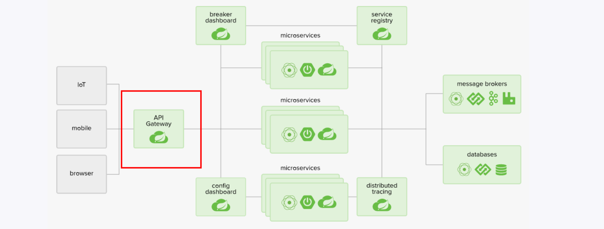
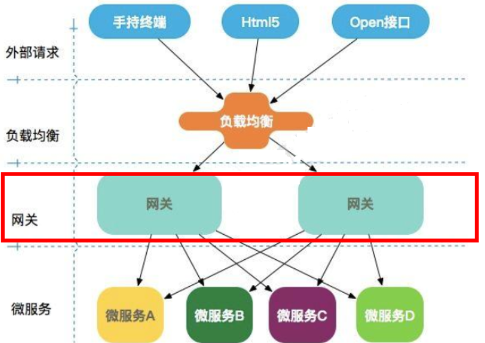
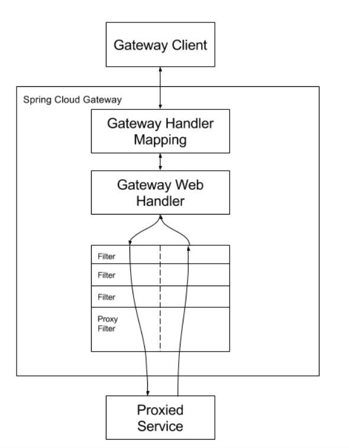
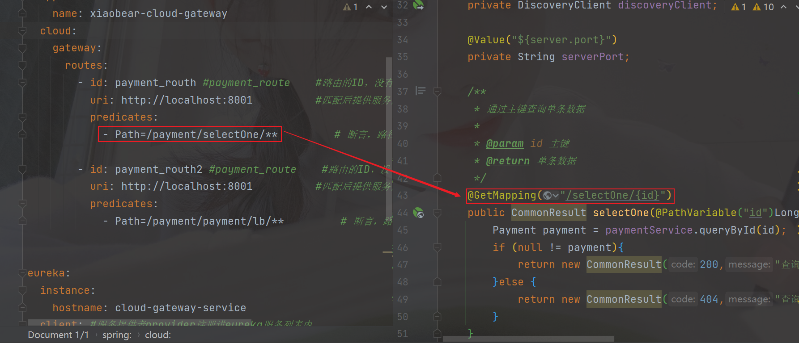
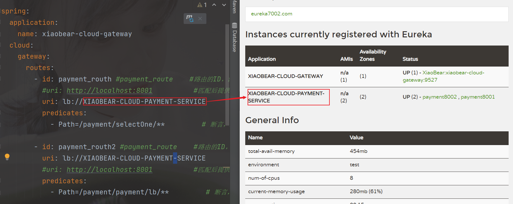
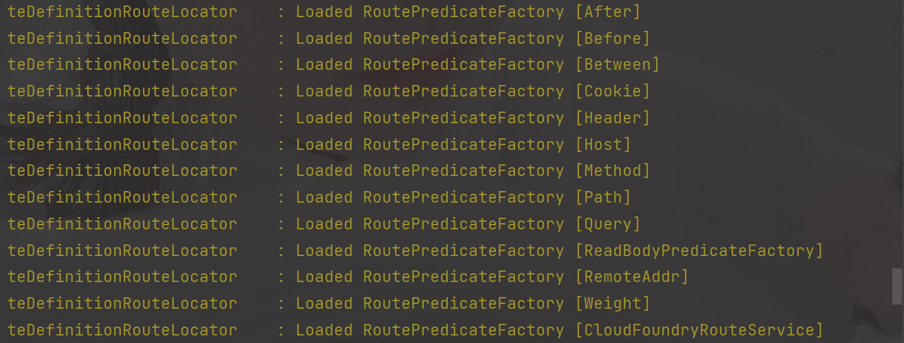
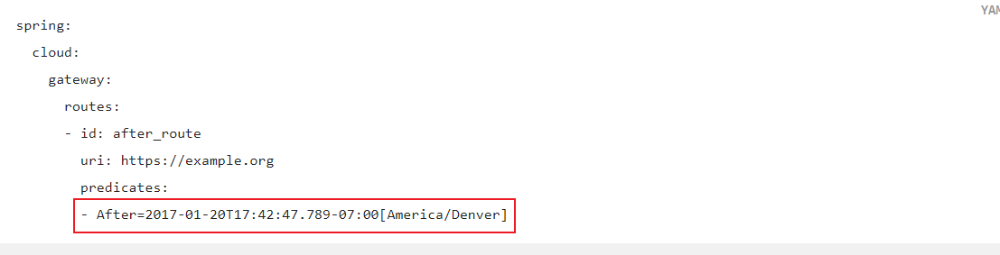
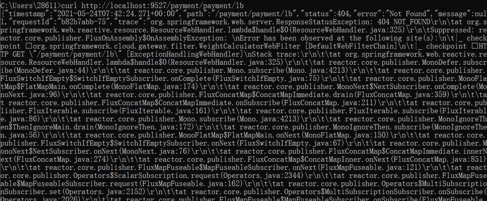
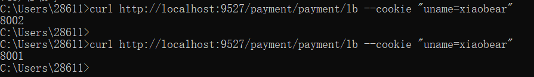
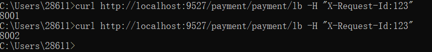

官网：https://docs.spring.io/spring-cloud-gateway/docs/current/reference/html/

> 该项目提供了一个用于在Spring WebFlux之上构建API网关的库。Spring Cloud Gateway旨在提供一种简单而有效的方法来路由到API，并为它们提供跨领域关注，例如：安全性，监视/指标和弹性。

### 1、什么是`GateWay`

> Cloud全家桶中有个很重要的组件就是网关，在1.x版本中都是采用的Zuul网关；
>
> 但在2.x版本中，zuul的升级一直跳票，SpringCloud最后自己研发了一个网关替代Zuul，
>
> 那就是SpringCloud Gateway一句话：gateway是原zuul1.x版的替代



#### 1、概述

**提供了一个在Spring生态系统之上构建的API网关，包括：Spring 5，Spring Boot 2和Project Reactor**

> pringCloud Gateway 作为 Spring Cloud 生态系统中的网关，目标是替代 Zuul，在Spring Cloud 2.0以上版本中，没有对新版本的Zuul 2.0以上最新高性能版本进行集成，仍然还是使用的Zuul 1.x非Reactor模式的老版本。
>
> **而为了提升网关的性能，SpringCloud Gateway是基于WebFlux框架实现的，而WebFlux框架底层则使用了高性能的Reactor模式通信框架Netty。**
>
> Spring Cloud Gateway的目标提供统一的路由方式且基于 Filter 链的方式提供了网关基本的功能，例如：安全，监控/指标，和限流。

#### 2、特性

- 反向代理
- 鉴权
- 流量控制
- 熔断
- 日志监控

#### 3、微服务的网关在哪



#### 4、有`Zuul`，为什么又出现了`GateWay`

##### 1、为什么我们选择`GateWay`

1. netflix不靠谱，迟迟不发布

   > 方面因为Zuul1.0已经进入了维护阶段，而且Gateway是SpringCloud团队研发的，是亲儿子产品，值得信赖。而且很多功能Zuul都没有用起来也非常的简单便捷。
   >
   >  Gateway是基于异步非阻塞模型上进行开发的，性能方面不需要担心。虽然Netflix早就发布了最新的 Zuul 2.x，但 Spring Cloud 貌似没有整合计划。而且Netflix相关组件都宣布进入维护期；不知前景如何？
   >
   > 多方面综合考虑Gateway是很理想的网关选择。

2. Spring Cloud GateWay有很多特性

   > 基于Spring Framework 5, Project Reactor 和 Spring Boot 2.0 进行构建；
   >
   > 动态路由：能够匹配任何请求属性；
   >
   > 可以对路由指定 Predicate（断言）和 Filter（过滤器）；
   >
   > 集成Hystrix的断路器功能；
   >
   > 集成 Spring Cloud 服务发现功能；
   >
   > 易于编写的 Predicate（断言）和 Filter（过滤器）；
   >
   > 请求限流功能；
   >
   > 支持路径重写。

3. Spring Cloud Gateway 与 Zuul的区别

   > 在SpringCloud Finchley 正式版之前，Spring Cloud 推荐的网关是 Netflix 提供的Zuul：
   >
   > 1. Zuul 1.x，是一个基于阻塞 I/ O 的 API Gateway
   > 2. Zuul 1.x 基于Servlet 2. 5使用阻塞架构它不支持任何长连接(如 WebSocket) Zuul 的设计模式和Nginx较像，每次 I/ O 操作都是从工作线程中选择一个执行，请求线程被阻塞到工作线程完成，但是差别是Nginx 用C++ 实现，Zuul 用 Java 实现，而 JVM 本身会有第一次加载较慢的情况，使得Zuul 的性能相对较差。
   > 3. Zuul 2.x理念更先进，想基于Netty非阻塞和支持长连接，但SpringCloud目前还没有整合。 Zuul 2.x的性能较 Zuul 1.x 有较大提升。在性能方面，根据官方提供的基准测试， Spring Cloud Gateway 的 RPS（每秒请求数）是Zuul 的 1. 6 倍。
   > 4. Spring Cloud Gateway 建立 在 Spring Framework 5、 Project Reactor 和 Spring Boot 2 之上， 使用非阻塞 API。
   > 5. Spring Cloud Gateway 还 支持 WebSocket， 并且与Spring紧密集成拥有更好的开发体验

##### 2、Zuul 1.x模型

Springcloud中所集成的Zuul版本，采用的是Tomcat容器，使用的是传统的Servlet IO处理模型。

学web课程都知道一个题目，Servlet的生命周期?servlet由servlet container进行生命周期管理。

> container启动时构造servlet对象并调用servlet init()进行初始化；
>
> container运行时接受请求，并为每个请求分配一个线程（一般从线程池中获取空闲线程）然后调用service()。
>
> container关闭时调用servlet destory()销毁servlet；

**上述模式的缺点：**

> servlet是一个简单的网络IO模型，当请求进入servlet container时，servlet container就会为其绑定一个线程，在并发不高的场景下这种模型是适用的。但是一旦高并发(比如抽风用jemeter压)，线程数量就会上涨，而线程资源代价是昂贵的（上线文切换，内存消耗大）严重影响请求的处理时间。在一些简单业务场景下，不希望为每个request分配一个线程，只需要1个或几个线程就能应对极大并发的请求，这种业务场景下servlet模型没有优势

所以Zuul 1.X是基于servlet之上的一个==阻塞式==处理模型，即spring实现了处理所有request请求的一个

servlet（DispatcherServlet）并由该servlet阻塞式处理处理。所以Springcloud Zuul无法摆脱servlet模型的弊端

##### 3、GateWay模型

> 传统的Web框架，比如说：struts2，springmvc等都是基于Servlet API与Servlet容器基础之上运行的。但是
>
> 在Servlet3.1之后有了==异步非阻塞的支持==。而WebFlux是一个典型非阻塞异步的框架，它的核心是基于Reactor的相关API实现的。相对于传统的web框架来说，它可以运行在诸如Netty，Undertow及支持Servlet3.1的容器上。非阻塞式+函数式编程（Spring5必须让你使用java8）
>
> Spring WebFlux 是 Spring 5.0 引入的新的响应式框架，区别于 Spring MVC，它不需要依赖Servlet API，它是完全异步非阻塞的，并且基于 Reactor 来实现响应式流规范。

### 2、核心概念

#### 1、`Route`路由

路由是构建网关的基本模块，它由ID、目标url，一系列的断言和过滤组成，如果断言为true则匹配该路由

#### 2、`Predicate`断言

参考Java8的函数式编程

开发人员可以匹配HTTP请求中的所有内容（例如请求头或请求参数），  如果==请求与断言匹配则进行路由==

#### 3、`Filter`过滤

Spring框架中GateWayFilter的实例，使用过滤器，可以在请求被路由前或之后队请求进行修改

------

**总结：**

> web请求，通过一些匹配条件，定位到真正的服务节点。并在这个转发过程的前后，进行一些精细化控制。
>
> predicate就是我们的匹配条件；
>
> 而filter，就可以理解为一个无所不能的拦截器。有了这两个元素，再加上目标uri，就可以实现一个具体的路由了

### 3、GateWay工作流程



> 客户端向 Spring Cloud Gateway 发出请求。然后在 Gateway Handler Mapping 中找到与请求相匹配的路由，将其发送到 Gateway Web Handler。
>
> Handler 再通过指定的过滤器链来将请求发送到我们实际的服务执行业务逻辑，然后返回。
>
> 过滤器之间用虚线分开是因为过滤器可能会在发送代理请求之前（“pre”）或之后（“post”）执行业务逻辑。
>
> Filter在“pre”类型的过滤器可以做参数校验、权限校验、流量监控、日志输出、协议转换等，
>
> 在“post”类型的过滤器中可以做响应内容、响应头的修改，日志的输出，流量监控等有着非常重要的作用。

==核心逻辑==：**路由转发+执行过滤链**


### 4、入门配置

##### 1、新建module

```
xiaobear-gateway-gateway9527
```

##### 2、改pom.xml

```xml
<dependencies>
        <!--gateway-->
        <dependency>
            <groupId>org.springframework.cloud</groupId>
            <artifactId>spring-cloud-starter-gateway</artifactId>
        </dependency>
        <!--eureka-client-->
        <dependency>
            <groupId>org.springframework.cloud</groupId>
            <artifactId>spring-cloud-starter-netflix-eureka-client</artifactId>
        </dependency>
        <!-- 引入自己定义的api通用包，可以使用Payment支付Entity -->
        <dependency>
            <groupId>com.xiaobear</groupId>
            <artifactId>xiaobear-common-api-3</artifactId>
            <version>1.0-SNAPSHOT</version>
        </dependency>
        <!--一般基础配置类-->
        <dependency>
            <groupId>org.springframework.boot</groupId>
            <artifactId>spring-boot-devtools</artifactId>
            <scope>runtime</scope>
            <optional>true</optional>
        </dependency>
        <dependency>
            <groupId>org.projectlombok</groupId>
            <artifactId>lombok</artifactId>
            <optional>true</optional>
        </dependency>
        <dependency>
            <groupId>org.springframework.boot</groupId>
            <artifactId>spring-boot-starter-test</artifactId>
            <scope>test</scope>
        </dependency>
    </dependencies>
```

==注意==：`spring-cloud-starter-gateway`的依赖，是不需要`web`的依赖

##### 3、写yaml

```yaml
server:
  port: 9527

eureka:
  instance:
    hostname: cloud-gateway-service
  client: #服务提供者provider注册进eureka服务列表内
    service-url:
      register-with-eureka: true
      fetch-registry: true
      defaultZone: http://eureka7001.com:7001/eureka
```

##### 4、主启动类

```java
@SpringBootApplication
@EnableEurekaClient
public class GateWayApplication {
    public static void main(String[] args) {
        SpringApplication.run(GateWayApplication.class,args);
    }
}
```

##### 5、增加yaml的配置

作为路由映射

```yaml
server:
  port: 9527

spring:
  application:
    name: xiaobear-cloud-gateway
  cloud:
    gateway:
      routes:
        - id: payment_routh #payment_route    #路由的ID，没有固定规则但要求唯一，建议配合服务名
          uri: http://localhost:8001          #匹配后提供服务的路由地址
          predicates:
            - Path=/payment/selectOne/**         ## 断言，路径相匹配的进行路由

        - id: payment_routh2 #payment_route    #路由的ID，没有固定规则但要求唯一，建议配合服务名
          uri: http://localhost:8001          #匹配后提供服务的路由地址
          predicates:
            - Path=/payment/payment/lb/**         ## 断言，路径相匹配的进行路由

eureka:
  instance:
    hostname: cloud-gateway-service
  client: #服务提供者provider注册进eureka服务列表内
    service-url:
      register-with-eureka: true
      fetch-registry: true
      defaultZone: http://eureka7001.com:7001/eureka
```

##### 6、测试

**启动顺序：**

- 启动7001
- 启动8001
- 启动9527

**访问：**

- 添加网关前：http://localhost:8001/payment/selectOne/1
- 添加网关后：http://localhost:9527/payment/selectOne/1



##### 7、`gateWay`网关配置的两种方式

###### 1、yaml配置，前面我们用到的就是

###### 2、代码中注入`RouteLocator`的`Bean`

官网：https://docs.spring.io/spring-cloud-gateway/docs/current/reference/html/#configuration

```java
@Configuration
public class GateWayConfig {

    @Bean
    public RouteLocator customRouteLocator(RouteLocatorBuilder routeBuilder){
        return routeBuilder.routes().route("xiaobear-config",r -> r.path("/spring-cloud-gateway-configuration").uri("https://www.bilibili.com/video/BV18E411x7eT")).build();
    }
}
```


### 5、动态路由

> 通过微服务名实现动态路由，默认情况下`GateWay`会根据注册中心注册的服务列表，以注册中心上微服务名为路径创建动态路由进行转发，从而实现动态路由的功能。

启动：

- 一个Eureka7001
- 两个服务提供者8001，8002

#### 1、修改yaml

```yaml
server:
  port: 9527

spring:
  application:
    name: xiaobear-cloud-gateway
  cloud:
    gateway:
      routes:
        - id: payment_routh #payment_route    #路由的ID，没有固定规则但要求唯一，建议配合服务名
          #uri: http://localhost:8001          #匹配后提供服务的路由地址
          uri: lb://XIAOBEAR-CLOUD-PAYMENT-SERVICE
          predicates:
            - Path=/payment/selectOne/**         ## 断言，路径相匹配的进行路由

        - id: payment_routh2 #payment_route    #路由的ID，没有固定规则但要求唯一，建议配合服务名
          uri: lb://XIAOBEAR-CLOUD-PAYMENT-SERVICE
          #uri: http://localhost:8001          #匹配后提供服务的路由地址
          predicates:
            - Path=/payment/payment/lb/**         ## 断言，路径相匹配的进行路由


eureka:
  instance:
    hostname: cloud-gateway-service
  client: #服务提供者provider注册进eureka服务列表内
    service-url:
      register-with-eureka: true
      fetch-registry: true
      defaultZone: http://eureka7001.com:7001/eureka
```



==注意==：`uri`的协议为`lb`，表示启用`GateWay`的负载均衡功能

`lb://serviceName`是`Spring Cloud GateWay`在微服务中自动为我们创建的负载均衡`uri`

#### 2、测试

测试地址：http://localhost:9527/payment/payment/lb

发现在端口8001与8002来回切换


### 6、`Predicate`断言

在启动网关模块的时候，控制输出如下：


官网地址：https://docs.spring.io/spring-cloud-gateway/docs/current/reference/html/#gateway-request-predicates-factories

#### 1、常用的`Route Predicate`

> Spring Cloud Gateway将路由匹配作为Spring WebFlux HandlerMapping基础架构的一部分。
>
> Spring Cloud Gateway包括许多内置的Route Predicate工厂。所有这些Predicate都与HTTP请求的不同属性匹配。多个Route Predicate工厂可以进行组合
>
> Spring Cloud Gateway 创建 Route 对象时， 使用 RoutePredicateFactory 创建 Predicate 对象，Predicate 对象可以赋值给 Route。 Spring Cloud Gateway 包含许多内置的Route Predicate Factories。
>
> 所有这些谓词都匹配HTTP请求的不同属性。多种谓词工厂可以组合，并通过逻辑and。

##### 1、[After Route Predicate Factory](https://docs.spring.io/spring-cloud-gateway/docs/current/reference/html/#the-after-route-predicate-factory)

表示在这个时区里的时间点才允许访问



这个时间格式，是Java 8新特性的时区时间格式

```java
public class ZoneDateTimeTest {
    public static void main(String[] args) {
        ZonedDateTime zbj = ZonedDateTime.now(); // 默认时区
        System.out.println(zbj);
        //        ZonedDateTime zny = ZonedDateTime.now(ZoneId.of("America/New_York")); // 用指定时区获取当前时间
//        System.out.println(zny);
    }
}
```

```yaml
server:
  port: 9527

spring:
  application:
    name: xiaobear-cloud-gateway
  cloud:
    gateway:
      routes:
        - id: payment_routh #payment_route    #路由的ID，没有固定规则但要求唯一，建议配合服务名
          #uri: http://localhost:8001          #匹配后提供服务的路由地址
          uri: lb://XIAOBEAR-CLOUD-PAYMENT-SERVICE
          predicates:
            - Path=/payment/selectOne/**         ## 断言，路径相匹配的进行路由

        - id: payment_routh2 #payment_route    #路由的ID，没有固定规则但要求唯一，建议配合服务名
          uri: lb://XIAOBEAR-CLOUD-PAYMENT-SERVICE
          #uri: http://localhost:8001          #匹配后提供服务的路由地址
          predicates:
            - Path=/payment/payment/lb/**         ## 断言，路径相匹配的进行路由
            - After=2021-05-24T15:17:53.623+08:00[Asia/Shanghai]         ## 断言，路径相匹配的进行路由


eureka:
  instance:
    hostname: cloud-gateway-service
  client: #服务提供者provider注册进eureka服务列表内
    service-url:
      register-with-eureka: true
      fetch-registry: true
      defaultZone: http://eureka7001.com:7001/eureka
```


##### 2、[Before Route Predicate Factory](https://docs.spring.io/spring-cloud-gateway/docs/current/reference/html/#the-before-route-predicate-factory)

> 在时间点前才允许访问

```yaml
spring:
  application:
    name: xiaobear-cloud-gateway
  cloud:
    gateway:
      routes:
        - id: payment_routh #payment_route    #路由的ID，没有固定规则但要求唯一，建议配合服务名
          #uri: http://localhost:8001          #匹配后提供服务的路由地址
          uri: lb://XIAOBEAR-CLOUD-PAYMENT-SERVICE
          predicates:
            - Path=/payment/selectOne/**         ## 断言，路径相匹配的进行路由

        - id: payment_routh2 #payment_route    #路由的ID，没有固定规则但要求唯一，建议配合服务名
          uri: lb://XIAOBEAR-CLOUD-PAYMENT-SERVICE
          #uri: http://localhost:8001          #匹配后提供服务的路由地址
          predicates:
            - Path=/payment/payment/lb/**         ## 断言，路径相匹配的进行路由
            - Before=2021-05-24T15:17:53.623+08:00[Asia/Shanghai]
```

##### 3、[Between Route Predicate Factory](https://docs.spring.io/spring-cloud-gateway/docs/current/reference/html/#the-between-route-predicate-factory)

> 在两者之间

```yaml
spring:
  application:
    name: xiaobear-cloud-gateway
  cloud:
    gateway:
      routes:
        - id: payment_routh #payment_route    #路由的ID，没有固定规则但要求唯一，建议配合服务名
          #uri: http://localhost:8001          #匹配后提供服务的路由地址
          uri: lb://XIAOBEAR-CLOUD-PAYMENT-SERVICE
          predicates:
            - Path=/payment/selectOne/**         ## 断言，路径相匹配的进行路由

        - id: payment_routh2 #payment_route    #路由的ID，没有固定规则但要求唯一，建议配合服务名
          uri: lb://XIAOBEAR-CLOUD-PAYMENT-SERVICE
          #uri: http://localhost:8001          #匹配后提供服务的路由地址
          predicates:
            - Path=/payment/payment/lb/**         ## 断言，路径相匹配的进行路由
            - Between=2021-05-24T15:17:53.623+08:00[Asia/Shanghai], 2021-05-24T15:30:53.623+08:00[Asia/Shanghai]
```

##### 4、[Cookie Route Predicate Factory](https://docs.spring.io/spring-cloud-gateway/docs/current/reference/html/#the-cookie-route-predicate-factory)

> Cookie Route Predicate需要两个参数，一个是 Cookie name ,一个是正则表达式。
>
> 路由规则会通过获取对应的 Cookie name 值和正则表达式去匹配，如果匹配上就会执行路由，如果没有匹配上则不执行

```yaml
spring:
  application:
    name: xiaobear-cloud-gateway
  cloud:
    gateway:
      routes:
        - id: payment_routh #payment_route    #路由的ID，没有固定规则但要求唯一，建议配合服务名
          #uri: http://localhost:8001          #匹配后提供服务的路由地址
          uri: lb://XIAOBEAR-CLOUD-PAYMENT-SERVICE
          predicates:
            - Path=/payment/selectOne/**         ## 断言，路径相匹配的进行路由

        - id: payment_routh2 #payment_route    #路由的ID，没有固定规则但要求唯一，建议配合服务名
          uri: lb://XIAOBEAR-CLOUD-PAYMENT-SERVICE
          #uri: http://localhost:8001          #匹配后提供服务的路由地址
          predicates:
            - Path=/payment/payment/lb/**         ## 断言，路径相匹配的进行路由
            - Cookie=uname, xiaobear
```

###### 1、不带cookie访问

curl http://localhost:9527/payment/payment/lb



###### 2、带cookie访问

curl http://localhost:9527/payment/payment/lb --cookie "uname=xiaobear"



##### 5、[Header Route Predicate Factory](https://docs.spring.io/spring-cloud-gateway/docs/current/reference/html/#the-header-route-predicate-factory)

> 两个参数：一个是属性名称和一个正则表达式，这个属性值和正则表达式匹配则执行。

curl http://localhost:9526/payment/payment/lb -H "X-Request-Id:123"



```yaml
spring:
  application:
    name: xiaobear-cloud-gateway
  cloud:
    gateway:
      routes:
        - id: payment_routh #payment_route    #路由的ID，没有固定规则但要求唯一，建议配合服务名
          #uri: http://localhost:8001          #匹配后提供服务的路由地址
          uri: lb://XIAOBEAR-CLOUD-PAYMENT-SERVICE
          predicates:
            - Path=/payment/selectOne/**         ## 断言，路径相匹配的进行路由

        - id: payment_routh2 #payment_route    #路由的ID，没有固定规则但要求唯一，建议配合服务名
          uri: lb://XIAOBEAR-CLOUD-PAYMENT-SERVICE
          #uri: http://localhost:8001          #匹配后提供服务的路由地址
          predicates:
            - Path=/payment/payment/lb/**         ## 断言，路径相匹配的进行路由
            - Header=X-Request-Id, \d+  ## 请求头要有X-Request-Id属性并且值为整数的正则表达式
            #- Cookie=uname, xiaobear
```


#### 6、[Host Route Predicate Factory](https://docs.spring.io/spring-cloud-gateway/docs/current/reference/html/#the-host-route-predicate-factory)

> Host Route Predicate 接收一组参数，一组匹配的域名列表，这个模板是一个 ant 分隔的模板，用.号作为分隔符。它通过参数中的主机地址作为匹配规则。

```yaml
spring:
  application:
    name: xiaobear-cloud-gateway
  cloud:
    gateway:
      routes:
        - id: payment_routh #payment_route    #路由的ID，没有固定规则但要求唯一，建议配合服务名
          #uri: http://localhost:8001          #匹配后提供服务的路由地址
          uri: lb://XIAOBEAR-CLOUD-PAYMENT-SERVICE
          predicates:
            - Path=/payment/selectOne/**         ## 断言，路径相匹配的进行路由

        - id: payment_routh2 #payment_route    #路由的ID，没有固定规则但要求唯一，建议配合服务名
          uri: lb://XIAOBEAR-CLOUD-PAYMENT-SERVICE
          #uri: http://localhost:8001          #匹配后提供服务的路由地址
          predicates:
            - Path=/payment/payment/lb/**         ## 断言，路径相匹配的进行路由
            #- Header=X-Request-Id, \d+  ## 请求头要有X-Request-Id属性并且值为整数的正则表达式
            #- Cookie=uname, xiaobear
            - Host=**.xiaobear.com
```

其他的请参照官网：https://docs.spring.io/spring-cloud-gateway/docs/current/reference/html/#gateway-request-predicates-factories


==总结：==`Predicate`就是为了实现一组匹配规则，让请求找到对应的`Route`进行处理


### 7、`Filter`过滤

https://docs.spring.io/spring-cloud-gateway/docs/current/reference/html/#gatewayfilter-factories

> 路由过滤器可用于修改进入的HTTP请求和返回的HTTP响应，路由过滤器只能指定路由进行使用。
>
> Spring Cloud Gateway 内置了多种路由过滤器，他们都由GatewayFilter的工厂类来产生。

#### 1、分类

##### 1、按生命周期分类

- `Pre`
- `Post`

##### 2、按种类分类

-  [GatewayFilter Factories](https://docs.spring.io/spring-cloud-gateway/docs/current/reference/html/#gatewayfilter-factories)
- [Global Filters](https://docs.spring.io/spring-cloud-gateway/docs/current/reference/html/#global-filters)

#### 2、常用的`Filter`

```yaml
spring:
  application:
    name: xiaobear-cloud-gateway
  cloud:
    gateway:
      routes:
        - id: payment_routh #payment_route    #路由的ID，没有固定规则但要求唯一，建议配合服务名
          #uri: http://localhost:8001          #匹配后提供服务的路由地址
          uri: lb://XIAOBEAR-CLOUD-PAYMENT-SERVICE
          predicates:
            - Path=/payment/selectOne/**         ## 断言，路径相匹配的进行路由

        - id: payment_routh2 #payment_route    #路由的ID，没有固定规则但要求唯一，建议配合服务名
          uri: lb://XIAOBEAR-CLOUD-PAYMENT-SERVICE
          filters:
            - AddRequestParameter=X-Request-Id,1024 #过滤器工厂会在匹配的请求头加上一对请求头，名称为X-Request-Id值为1024
          #uri: http://localhost:8001          #匹配后提供服务的路由地址
          predicates:
            - Path=/payment/payment/lb/**         ## 断言，路径相匹配的进行路由
            #- Header=X-Request-Id, \d+  ## 请求头要有X-Request-Id属性并且值为整数的正则表达式
            #- Cookie=uname, xiaobear
            - Host=**.xiaobear.com
```

#### 3、自定义过滤器

自定义全局过滤器`Global Filters`

主要是实现两个接口 `implements GlobalFilter,Ordered`

##### 作用

- 全局日志处理
- 统一网关鉴权

```java
@Component
public class XiaoBearGateWayFilter implements GlobalFilter, Ordered {
    private static final Logger log = LoggerFactory.getLogger(XiaoBearGateWayFilter.class);
    @Override
    public Mono<Void> filter(ServerWebExchange exchange, GatewayFilterChain chain) {
        log.info("time:"+new Date()+"\t 执行了自定义的全局过滤器: "+"MyLogGateWayFilter"+"hello");
        String uname = exchange.getRequest().getQueryParams().getFirst("uname");
        if (uname == null) {
            log.error("用户名为空！！！！！！");
            exchange.getResponse().setStatusCode(HttpStatus.NOT_ACCEPTABLE);
            return exchange.getResponse().setComplete();
        }
        return chain.filter(exchange);
    }

    @Override
    public int getOrder() {
        return 0;
    }
}
```

##### 测试

- 错误的：http://localhost:9527/payment/payment/lb

- 正确的：http://localhost:9527/payment/payment/lb?uname=123

**注意：**之前我们使用`Predicate`的代码记得注释，以及yaml的过滤
