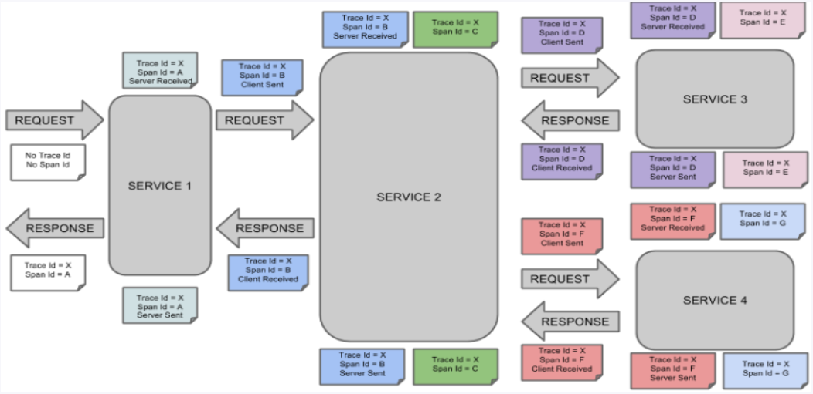
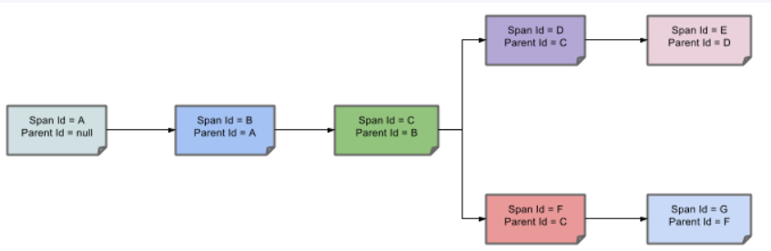
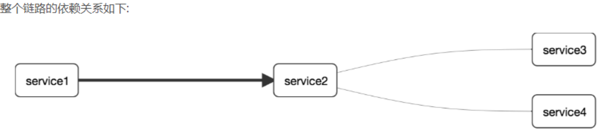
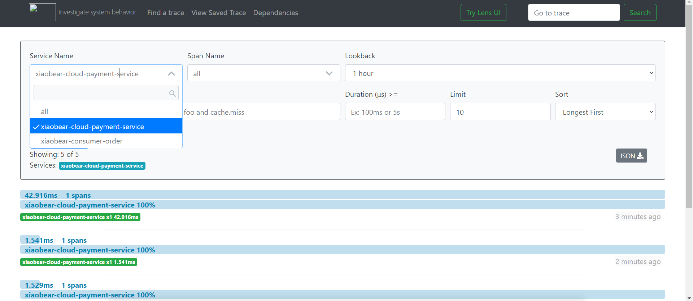

### 1、概述

> 在微服务框架中，一个由客户端发起的请求在后端系统中会经过多个不同的的服务节点调用来协同产生最后的请求结果，每一个前段请求都会形成一条复杂的分布式服务调用链路，链路中的任何一环出现高延时或错误都会引起整个请求最后的失败。

官网资料：https://github.com/spring-cloud/spring-cloud-sleuth

**Spring Cloud Sleuth提供了一套完整的服务跟踪的解决方案，在分布式系统中提供追踪解决方案并且兼容支持了zipkin。**

### 2、搭建链路监控

> SpringCloud从F版起已不需要自己构建Zipkin Server了，只需调用jar包即可

下载地址：https://search.maven.org/remote_content?g=io.zipkin.java&a=zipkin-server&v=LATEST&c=exec

`zipkin-server-2.12.9-exec.jar`

运行：`java -jar zipkin-server-2.12.9-exec.jar `

访问地址：http://localhost:9411/zipkin/


#### 1、完整的链路图

> 表示一请求链路，一条链路通过Trace Id唯一标识，Span标识发起的请求信息，各span通过parent id 关联起来
>
> 

#### 2、解释

一条链路通过Trace Id唯一标识，Span标识发起的请求信息，各span通过parent id 关联起来





#### 3、名词

**Trace：**类似于树结构的Span集合，表示一条调用链路，存在唯一标识

**span：**表示调用链路来源，通俗的理解span就是一次请求信息


### 3、监控案例

这里以起初的`xiaobear-provider-payment8001`和`xiaobear-consumer-order80-2`进行监控

#### 1、修改`xiaobear-consumer-order80-2`

##### 1、pom文件增加监控依赖

```xml
<!--包含了sleuth+zipkin-->
<dependency>
    <groupId>org.springframework.cloud</groupId>
    <artifactId>spring-cloud-starter-zipkin</artifactId>
</dependency>
```

##### 2、yaml增加配置

```yaml
spring:
  application:
    name: xiaobear-consumer-order
  zipkin:
    base-url: http://localhost:9411
    sleuth:
      sampler:
        probability: 1
```

##### 3、业务层controller

```java
@GetMapping("/payment/zipkin")
public String paymentZipkin()
{
    return "hi ,i'am paymentzipkin server fall back，O(∩_∩)O哈哈~";
}
```

#### 2、修改xiaobear-provider-payment8001

##### 1、pom文件增加监控依赖

```xml
 <!--包含了sleuth+zipkin-->
<dependency>
    <groupId>org.springframework.cloud</groupId>
    <artifactId>spring-cloud-starter-zipkin</artifactId>
</dependency>
```

##### 2、yaml增加配置

```yaml
spring:
  application:
    name: xiaobear-cloud-payment-service
  zipkin:
    base-url: http://localhost:9411
    sleuth:
      sampler:
        #采样率值介于 0 到 1 之间，1 则表示全部采集
        probability: 1
  datasource:
    type: com.alibaba.druid.pool.DruidDataSource
    driver-class-name: com.mysql.cj.jdbc.Driver
    url: jdbc:mysql://localhost:3306/spring-cloud-xiaobear?useUnicode=true&characterEncoding=utf8&zeroDateTimeBehavior=convertToNull&useSSL=true&serverTimezone=GMT%2B8
    username: root
    password: 密码
```

##### 3、业务层controller

```java
@GetMapping("/payment/zipkin")
public String paymentZipkin()
{
    return "hi ,i'am paymentzipkin server fall back，O(∩_∩)O哈哈~";
}
```

#### 3、测试

启动：

- 7001
- 8001
- 80

分别访问：

- http://localhost:8001/payment/payment/zipkin
- http://localhost/payment/zipkin


