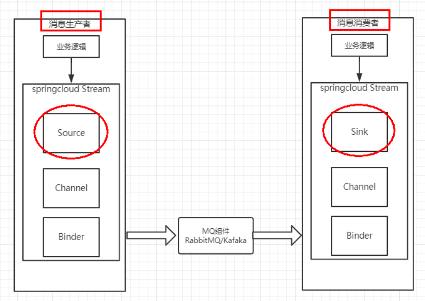
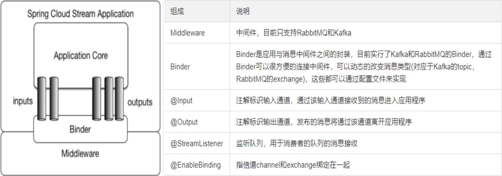
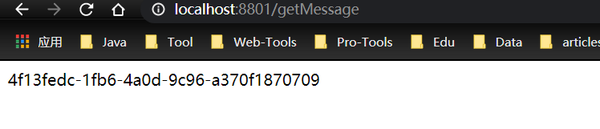
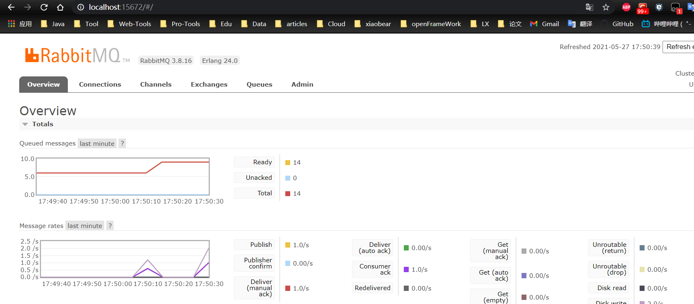
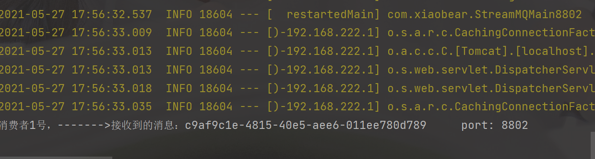
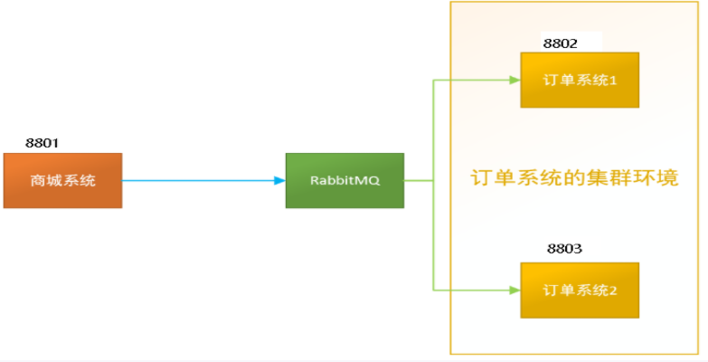
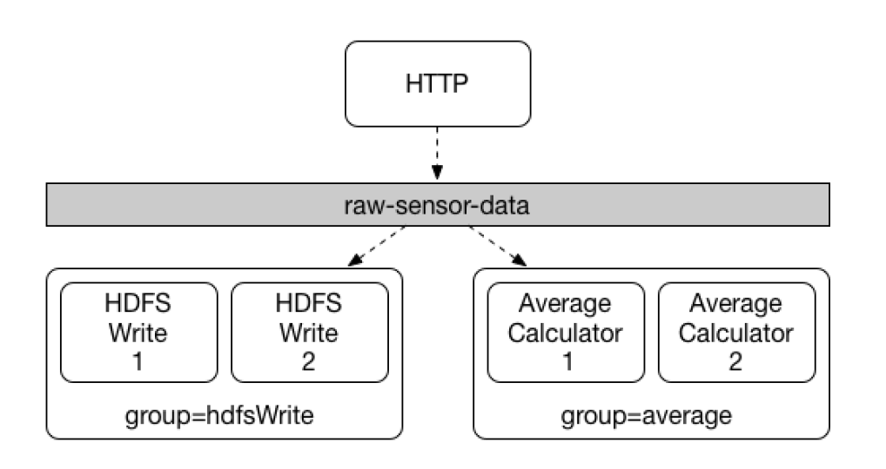
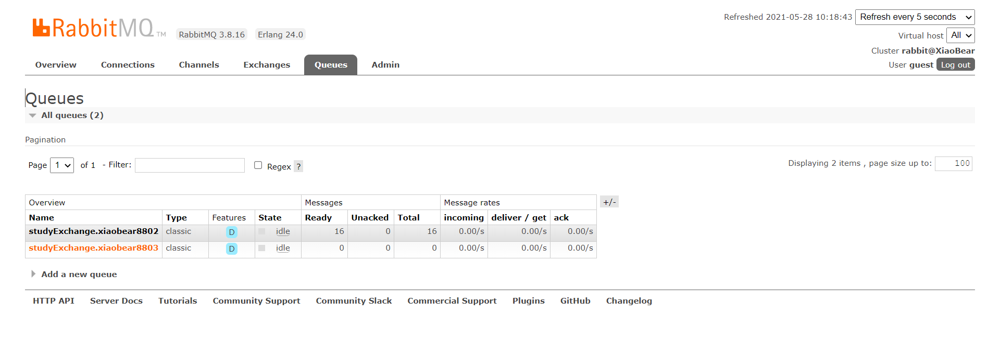

### 1、概述

> 屏蔽底层消息中间件的差异,降低切换成本，统一消息的编程模型

官网资料：

- https://docs.spring.io/spring-cloud-stream/docs/3.1.3/reference/html/
- 中文指导手册：https://m.wang1314.com/doc/webapp/topic/20971999.html

#### 1、设计思想

##### 1、标准的MQ

- 生产者/消费者之间靠消息媒介传递信息内容 ----`Message`
- 消息必须走特定的通道 ----`消息通道MessageChannel`
- 消息通道里的消息如何被消费呢，谁负责收发处理 ----`消息通道MessageChannel的子接口SubscribableChannel，由MessageHandler消息处理器所订阅`

##### 2、为什么要用`Spring Cloud Stream`

`Stream`凭什么可以统一底层差异

> 在没有绑定器这个概念的情况下，我们的SpringBoot应用要直接与消息中间件进行信息交互的时候，
>
> 由于各消息中间件构建的初衷不同，它们的实现细节上会有较大的差异性
>
> 通过定义绑定器作为中间层，完美地实现了**应用程序与消息中间件细节之间的隔离**。
>
> 通过向应用程序暴露统一的Channel通道，使得应用程序不需要再考虑各种不同的消息中间件实现。
>
> **通过定义绑定器Binder作为中间层，实现了应用程序与消息中间件细节之间的隔离。**

`Binder`

> 在没有绑定器这个概念的情况下，我们的SpringBoot应用要直接与消息中间件进行信息交互的时候，由于各消息中间件构建的初衷不同，它们的实现细节上会有较大的差异性，通过定义绑定器作为中间层，完美地实现了应用程序与消息中间件细节之间的隔离。Stream对消息中间件的进一步封装，可以做到代码层面对中间件的无感知，甚至于动态的切换中间件(rabbitmq切换为kafka)，使得微服务开发的高度解耦，服务可以关注更多自己的业务流程
>
> .png)

**通过定义绑定器Binder作为中间层，实现了应用程序与消息中间件细节之间的隔离。**

Binder可以生成Binding，Binding用来绑定消息容器的生产者和消费者，它有两种类型，INPUT和OUTPUT，INPUT对应于消费者，OUTPUT对应于生产者。


##### 3、`Stream`的通信方式遵循了发布-订阅模式

`Topic`主题进行广播

在`RabbitMQ`就是`Exchange`

在`Kafka`就是`Topic`


#### 2、标准流程套路



##### 1、`Binder`

> 很方便的连接中间件，屏蔽差异

##### 2、`Channel`

> 通道，是队列Queue的一种抽象，在消息通讯系统中就是实现存储和转发的媒介，通过Channel对队列进行配置

##### 3、`Source`和`Sink`

> 简单的可理解为参照对象是Spring Cloud Stream自身，从Stream发布消息就是输出，接受消息就是输入。

#### 3、编码API和常用注解




### 2、案例说明

- xiaobear-cloud-stream-rabbitmq-provider8801， 作为生产者进行发消息模块
- xiaobear-cloud-stream-rabbitmq-consumer8802，作为消息接收模块
- xiaobear-cloud-stream-rabbitmq-consumer8803  作为消息接收模块


### 3、消息驱动生产者

#### 1、新建module

```
xiaobear-cloud-stream-rabbitmq-provider8801
```

#### 2、改pom.xml

```xml
<dependencies>
        <dependency>
            <groupId>org.springframework.boot</groupId>
            <artifactId>spring-boot-starter-web</artifactId>
        </dependency>

        <dependency>
            <groupId>org.springframework.boot</groupId>
            <artifactId>spring-boot-starter-actuator</artifactId>
        </dependency>
        <dependency>
            <groupId>org.springframework.cloud</groupId>
            <artifactId>spring-cloud-starter-netflix-eureka-client</artifactId>
        </dependency>
        <dependency>
            <groupId>org.springframework.cloud</groupId>
            <artifactId>spring-cloud-starter-stream-rabbit</artifactId>
        </dependency>
        <!--基础配置-->
        <dependency>
            <groupId>org.springframework.boot</groupId>
            <artifactId>spring-boot-devtools</artifactId>
            <scope>runtime</scope>
            <optional>true</optional>
        </dependency>
        <dependency>
            <groupId>org.projectlombok</groupId>
            <artifactId>lombok</artifactId>
            <optional>true</optional>
        </dependency>
        <dependency>
            <groupId>org.springframework.boot</groupId>
            <artifactId>spring-boot-starter-test</artifactId>
            <scope>test</scope>
        </dependency>
    </dependencies>
```

#### 3、写yaml

```yaml
server:
  port: 8801

spring:
  application:
    name: cloud-stream-provider
  cloud:
    stream:
      binders: ## 在此处配置要绑定的rabbitmq的服务信息；
        defaultRabbit: ## 表示定义的名称，用于于binding整合
          type: rabbit ## 消息组件类型
          environment: ## 设置rabbitmq的相关的环境配置
            spring:
              rabbitmq:
                host: localhost
                port: 5672
                username: guest
                password: guest
      bindings: ## 服务的整合处理
        output: ## 这个名字是一个通道的名称
          destination: studyExchange ## 表示要使用的Exchange名称定义
          content-type: application/json ## 设置消息类型，本次为json，文本则设置“text/plain”
          binder:  ## 设置要绑定的消息服务的具体设置

eureka:
  client: ## 客户端进行Eureka注册的配置
    service-url:
      defaultZone: http://localhost:7001/eureka
  instance:
    lease-renewal-interval-in-seconds: 2 ## 设置心跳的时间间隔（默认是30秒）
    lease-expiration-duration-in-seconds: 5 ## 如果现在超过了5秒的间隔（默认是90秒）
    instance-id: send-8801.com  ## 在信息列表时显示主机名称
    prefer-ip-address: true     ## 访问的路径变为IP地址
```

#### 4、主启动类

```java
@SpringBootApplication
public class StreamApplication8801 {
    public static void main(String[] args) {
        SpringApplication.run(StreamApplication8801.class, args);
    }
}
```

#### 5、业务类

- service

  ```java
  public interface IMessageService {
      /**
       * 生产者发送消息
       * @return
       */
      public String send() ;
  }
  ```

- impl

  ```java
  @EnableBinding(Source.class)
  public class IMessageServiceImpl implements IMessageService {
  
      /**
       * 消息的发送管道
       */
      @Resource
      private MessageChannel output;
  
      @Override
      public String send() {
          String s = UUID.randomUUID().toString();
          output.send(MessageBuilder.withPayload(s).build());
          return s;
      }
  }
  ```

- controller

  ```java
  @RestController
  public class StreamController {
  
      @Resource
      private IMessageService iMessageService;
  
      @GetMapping("/getMessage")
      public String getMessage(){
          String send = iMessageService.send();
          return send;
      }
  }
  ```

#### 6、测试

http://localhost:8801/getMessage



在rabbitMq上面可以看到有峰值波动：http://localhost:15672/#/



### 4、消息驱动消费者

#### 1、新建module

```
xiaobear-cloud-stream-rabbitmq-consumer8802
```

#### 2、改pom.xml

```xml
<dependencies>
        <dependency>
            <groupId>org.springframework.boot</groupId>
            <artifactId>spring-boot-starter-web</artifactId>
        </dependency>
        <dependency>
            <groupId>org.springframework.cloud</groupId>
            <artifactId>spring-cloud-starter-netflix-eureka-client</artifactId>
        </dependency>
        <dependency>
            <groupId>org.springframework.cloud</groupId>
            <artifactId>spring-cloud-starter-stream-rabbit</artifactId>
        </dependency>
        <dependency>
            <groupId>org.springframework.boot</groupId>
            <artifactId>spring-boot-starter-actuator</artifactId>
        </dependency>
        <!--基础配置-->
        <dependency>
            <groupId>org.springframework.boot</groupId>
            <artifactId>spring-boot-devtools</artifactId>
            <scope>runtime</scope>
            <optional>true</optional>
        </dependency>
        <dependency>
            <groupId>org.projectlombok</groupId>
            <artifactId>lombok</artifactId>
            <optional>true</optional>
        </dependency>
        <dependency>
            <groupId>org.springframework.boot</groupId>
            <artifactId>spring-boot-starter-test</artifactId>
            <scope>test</scope>
        </dependency>
    </dependencies>
```

#### 3、写yaml

```yaml
server:
  port: 8802

spring:
  application:
    name: cloud-stream-consumer
  cloud:
    stream:
      binders: ## 在此处配置要绑定的rabbitmq的服务信息；
        defaultRabbit: ## 表示定义的名称，用于于binding整合
          type: rabbit ## 消息组件类型
          environment: ## 设置rabbitmq的相关的环境配置
            spring:
              rabbitmq:
                host: localhost
                port: 5672
                username: guest
                password: guest
      bindings: ## 服务的整合处理
        input: ## 这个名字是一个通道的名称
          destination: studyExchange ## 表示要使用的Exchange名称定义
          content-type: application/json ## 设置消息类型，本次为对象json，如果是文本则设置“text/plain”
          binder: ## 设置要绑定的消息服务的具体设置
          group: xiaobear8803

eureka:
  client: ## 客户端进行Eureka注册的配置
    service-url:
      defaultZone: http://localhost:7001/eureka
  instance:
    lease-renewal-interval-in-seconds: 2 ## 设置心跳的时间间隔（默认是30秒）
    lease-expiration-duration-in-seconds: 5 ## 如果现在超过了5秒的间隔（默认是90秒）
    instance-id: receive-8802.com  ## 在信息列表时显示主机名称
    prefer-ip-address: true     ## 访问的路径变为IP地址
```

#### 4、主启动类

```java
@SpringBootApplication
public class StreamMQMain8802 {
    public static void main(String[] args) {
        SpringApplication.run(StreamMQMain8802.class, args);
    }
}
```

#### 5、业务类

- 监听器

```java
@Component
@EnableBinding(Sink.class)
public class ReceiveMessageListener {

    @Value("${server.port}")
    private String serverPort;

    @StreamListener(Sink.INPUT)
    public void input(Message<String> message)
    {
        System.out.println("消费者1号，------->接收到的消息：" + message.getPayload()+"\t port: "+serverPort);
    }
}
```

#### 6、测试

http://localhost:8801/getMessage

8802的控制台输出



### 5、分组消费与持久化

按照xiaobear-cloud-stream-rabbitmq-consumer88032克隆出一份xiaobear-cloud-stream-rabbitmq-consumer8803

运行后产生的问题：

- 重复消费问题
- 消息持久化问题

#### 1、消费

##### 1、现象

> 8802和8803都收到了8801的消息，存在重复消费的问题

##### 2、解决

分组与持久化属性`Group`

> 比如在如下场景中，订单系统我们做集群部署，都会从RabbitMQ中获取订单信息，那如果一个订单同时被两个服务获取到，那么就会造成数据错误，我们得避免这种情况。这时我们就可以使用Stream中的消息分组来解决



注意在Stream中处于同一个group中的多个消费者是竞争关系，就能够保证消息只会被其中一个应用消费一次。

**不同组是可以全面消费的(重复消费)，同一组内会发生竞争关系，只有其中一个可以消费。**

#### 2、分组

> 原理：微服务应用放置于同一个`Group`中，就能够保证消息只会被其中一个应用消费一次。不同的组是可以消费的，同一个组内会发生竞争关系，只有其中一个可以消费。



**分组：**

修改8802与8803的yaml，重点是加入了`Group`的配置，8803同理

```yaml
server:
  port: 8802

spring:
  application:
    name: cloud-stream-consumer
  cloud:
    stream:
      binders: ## 在此处配置要绑定的rabbitmq的服务信息；
        defaultRabbit: ## 表示定义的名称，用于于binding整合
          type: rabbit ## 消息组件类型
          environment: ## 设置rabbitmq的相关的环境配置
            spring:
              rabbitmq:
                host: localhost
                port: 5672
                username: guest
                password: guest
      bindings: ## 服务的整合处理
        input: ## 这个名字是一个通道的名称
          destination: studyExchange ## 表示要使用的Exchange名称定义
          content-type: application/json ## 设置消息类型，本次为对象json，如果是文本则设置“text/plain”
          binder: ## 设置要绑定的消息服务的具体设置
          group: xiaobear8802

eureka:
  client: ## 客户端进行Eureka注册的配置
    service-url:
      defaultZone: http://localhost:7001/eureka
  instance:
    lease-renewal-interval-in-seconds: 2 ## 设置心跳的时间间隔（默认是30秒）
    lease-expiration-duration-in-seconds: 5 ## 如果现在超过了5秒的间隔（默认是90秒）
    instance-id: receive-8802.com  ## 在信息列表时显示主机名称
    prefer-ip-address: true     ## 访问的路径变为IP地址
```



```
分布式微服务应用为了实现高可用和负载均衡，实际上都会部署多个实例，本次启动了两个消费微服务(8802/8803)

多数情况，生产者发送消息给某个具体微服务时只希望被消费一次，按照上面我们启动两个应用的例子，虽然它们同属一个应用，但是这个消息出现了被重复消费两次的情况。为了解决这个问题，在Spring Cloud Stream中提供了消费组的概念。
```

**结论**：加入消费组之后，还是存在重复消费

**解决：**

- 8802与8803实现轮询分组，每次只有一个消费者能接收到消息
- 8802与8803变成相同组，`Group`两个相同，同时变成**xiaobear8802**或**xiaobear8803**

#### 3、持久化

1. 停止8802并去除8802的分组属性`Group`
2. 8801先发送几条消息（调用http://localhost:8801/getMessage）
3. 启动8802，没有分组属性，并没有接收到消息
4. 启动8803，有分组属性配置，后台接收了8801发送的消息
