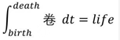
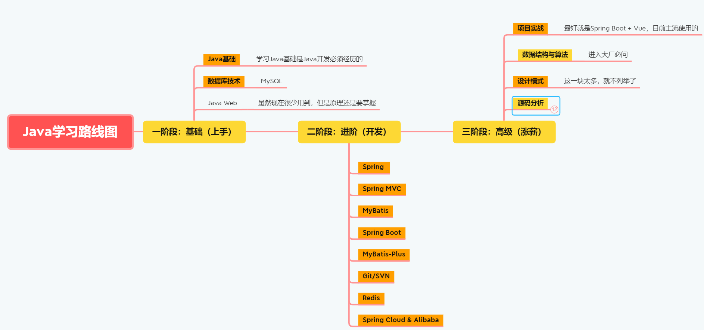
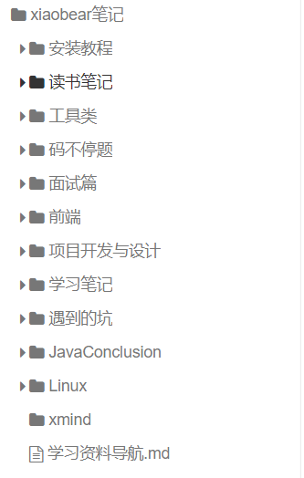
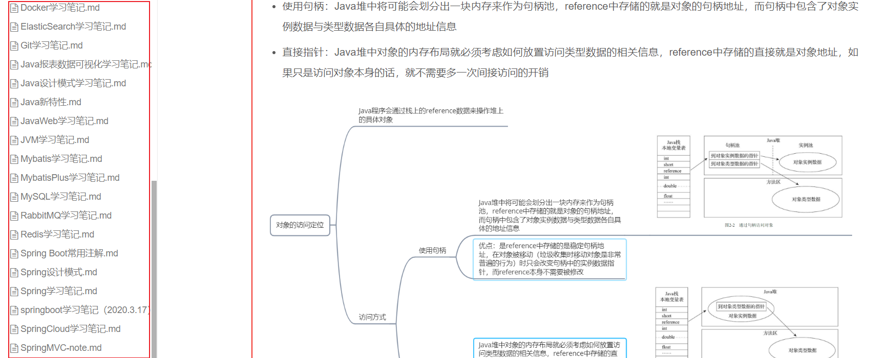

::: tip 说明
以下纯属个人的观点，适合自己的最重要，大家可以做个参考
:::

> 关于这篇，应该很早就要更新了，奈何一直拖拖拖（因为自己在跟着做项目），导致到现在才更新，今天就聊一聊

关于我科班出身，自己接触Java比较早，但真正实际能到开发阶段，还是在疫情期间，因为要准备实习了，看网上这么卷，所以才开始框架的学习，在此之前，学习的态度的：三天打鱼，两天晒网；

现在回想之前的大学时光，感觉自己很荒废，自己也走了不少弯路，强烈建议：如果能找到一个大佬带你学习或者给你提供学习路线等，你将会少走很多弯路！

不然大部分应该和我一样，学完一个全新的框架之后，总会纠结到底该学哪个，在此件事情上浪费很多时间！

现在Java的现状就是：

## 关于路线图

> 大家在网上可以看到很多学习路线图，有各个大佬总结的，很多培训机构也都有提供，这个没有哪个好的说法，适合自己最重要

下面是我在网上找到的一些

1. [p5学习路线图](https://www.processon.com/view/link/62246a886376895389217f88)
2. [图灵Java架构师体系图](https://www.processon.com/view/link/617be37ee0b34d7894fcf545#map)

这两个路线个人感觉是比较全，很细，也有在线地址，大家取用也很方便；但是全部按照这个来学习，对于学生来说，肯定时间不够的

所以我自己粗略整理了一下，如下：

### **第一阶段：Java基础**

> Java三大特性：封装、继承、多态，这三点必须要掌握，笔面试中对于应届生基本必问
>
> 其次的话，就是流程控制、异常体系、数组、集合与泛型、线程、IO、反射

### **第二阶段：数据库**

> 推荐MySQL，大部分公司用的都是MySQL
>
> 初次学习可以不深入，能学会增删改查、多表查询、联合查询、子查询等就可以了，后面索引等再系统学习
>
> 我的学习笔记：[数据库笔记](https://javaxiaobear.gitee.io/notes/database/MySQL.html)

### **第三阶段：框架篇**

> - 如果你现在处于要实习的阶段，建议直接学习Spring Boot，快速上手，后面再慢慢补SSM
>
> - 如果时间不急，可以深入学习，那就可以安装Spring、SpringMVC、MyBatis的路线进行学习
    >
    >   Spring的IOC和AOP理解上可能会有点抽象，不是很懂，我之前也是一样，到项目中用到了就知道有啥用处了
>
> - 其次就是Spring Boot，它就是一个快速上手的框架，总之就是有点牛逼
>
> - Spring Cloud：目前用的最多的是Spring Cloud Alibaba这套，但其他也要学习，不同公司使用的框架不同
>
> [框架篇笔记](https://javaxiaobear.gitee.io/notes/)

### **第四阶段：项目实战**

> 学到这里，出去找工作基本就没问题了，但是还差一个项目实战，网上项目很多，这个可以自行选择
>
> - 时间充足，可以cloud + vue
> - 不充足的话boot + vue
>
> 可不可以不实战，这个看你个人，项目可以帮你理解学习的知识以及如何运用

### **进阶篇**

> 应届生主攻数据结构与算法，要想进大厂，多上力扣多刷题，计算机基础和网络也很重要，其次更深入一点的就是底层源码理解多背八股文

### **高级篇**

> 这里我就不说了，毕竟我自己都没达到高级，正在慢慢摸索ing，可以参考上面完整的路线图

## 学习方法

> 个人建议还是边学习边做笔记整理，整理的过程其实也是加深印象，整理思维思路的过程。
>
> 我的话，每学习一个新的框架都会有一个笔记文档，记录自己的操作步骤，注意事项以及采坑记录

上面是我学习过程中整理的笔记，也就是今天你们看到的在线网站：https://javaxiaobear.gitee.io/，建议收藏

### 为什么要做笔记？

> 很多人可能觉得，边敲代码边做笔记很耗时间，这点是肯定的！那既然耗时间，为什么还要做呢？
>
> 因为在学习新知识的过程中，旧知识你也会慢慢遗忘（如果你是记忆大佬，当我没说），然后当你回顾的时候，虽然你有印象，但是关键步骤可能又得去找度娘了，以此反复！

## 如何学习

> 我该怎么学，到底该不该我纠结那些细节，我的建议就是不必过多去纠结，可以先把问题记录下来，学习本来就是思维慢慢开阔的过程，遇到纠结的点很正常，有时候一个bug能卡一天，但这并不代表不适合编程，你能力不行，过两天回头看这个问题，可能就迎刃而解了

[comment]: <> (|  :wrench:​开发工具篇    |   :computer:基础篇   |   :bookmark_tabs:​数据库篇   |:books:组件篇 |)

[comment]: <> (| ---- | ---- | ---- | ---- |)

[comment]: <> (|   [Git]&#40;devTools/GitNote.md&#41;、[Linux常用命令]&#40;devTools/Linux.md&#41;   |  [Java新特性]&#40;basic/features.md&#41;、[数据结构与算法]&#40;basic/dataAndAlgorithm.md&#41;    | [MySQL]&#40;database/MySQL.md&#41;、[Redis]&#40;frame/RedisNote.md&#41;    | [CAT链路追踪]&#40;/notes/components/CAT.html&#41; 、[HATEOAS]&#40;/notes/components/HATEOAS.html&#41; |)

[comment]: <> (|    :notebook:​框架篇  |)

[comment]: <> (| ---- |)

[comment]: <> (|  [JavaWeb]&#40;frame/JavaWebNote.md&#41;、[Spring MVC]&#40;frame/SpringMVCNote.md&#41;、[MyBatis]&#40;frame/MybatisNote.md.md&#41;、[MyBatis-Plus]&#40;frame/MybatisPlusNote.md.md&#41;、[Spring Boot]&#40;frame/SpringBootNote.md&#41;、[Spring Cloud]&#40;frame/SpringCloudNote.md&#41;、[Docker]&#40;frame/Docker.md&#41;、[RabbitMQ]&#40;frame/RabbitMQ.md&#41; 、[Elasticsearch]&#40;/notes/frame/Elasticsearch.html&#41;   |)

[comment]: <> (
)

[comment]: <> ()

[comment]: <> (
)

